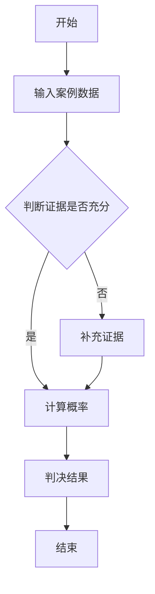
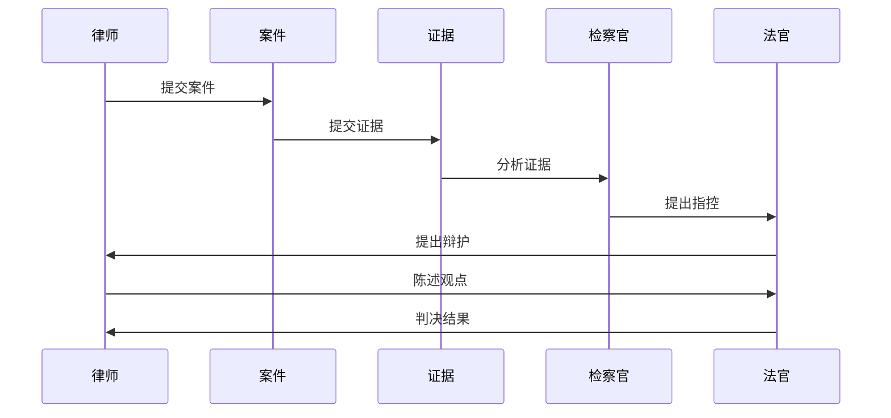

                 

# 数学与法律：法律推理的数学逻辑

> 关键词：数学逻辑、法律推理、形式逻辑、概率论、统计学

> 摘要：随着信息技术和数学领域的飞速发展，数学在法律领域的应用日益广泛。本文旨在探讨法律推理中的数学逻辑，包括形式逻辑、概率论、统计学等数学工具在法律推理中的应用，以提升法律推理的准确性和效率。

----------------------------------------------------------------

## 一、背景介绍

随着科技的发展，数学在各个领域的应用越来越广泛，法律领域也不例外。数学逻辑作为一种强大的工具，在法律推理中发挥着重要作用。法律推理中的逻辑漏洞、证明方法、法律条款的解读等问题，都可以通过数学方法进行分析和优化。

### 1.1 问题背景

法律推理是法律实践中的核心环节，而逻辑漏洞是影响法律推理准确性的主要因素之一。数学逻辑提供了一种严谨的推理方法，可以帮助我们识别和解决法律推理中的逻辑漏洞。

### 1.2 问题描述

在法律实践中，如何运用数学逻辑优化法律推理，提高法律判决的准确性，是一个值得探讨的问题。

### 1.3 问题解决

通过数学与法律的交叉研究，我们可以将数学逻辑应用于法律推理，提升法律推理的准确性和效率。

### 1.4 边界与外延

本文主要关注法律推理中的数学逻辑，包括形式逻辑、概率论、统计学等内容。

### 1.5 概念结构与核心要素组成

数学逻辑的基本概念包括命题、推理、证明等。数学工具在法律推理中的应用包括形式逻辑的推理规则、概率论的概率计算、统计学中的数据分析等。本文将详细讨论这些概念和工具在法律推理中的应用。

## 二、核心概念与联系

### 2.1 核心概念原理

形式逻辑、概率论、统计学是数学逻辑中的核心概念。

- **形式逻辑**：研究命题、推理和证明的形式结构。
- **概率论**：研究随机事件及其概率。
- **统计学**：研究数据的收集、整理、分析和解释。

### 2.2 概念属性特征对比表格

| 概念     | 特征                     |
|----------|------------------------|
| 形式逻辑 | 严谨性、确定性           |
| 概率论   | 随机性、不确定性         |
| 统计学   | 数据性、可重复性         |

### 2.3 ER实体关系图架构的 Mermaid 流程图

```mermaid
erDiagram
    Person ||--|{ Lawyer }|
    Lawyer ||--|{ Case }|
    Case ||--|{ Evidence }|
```

## 三、算法原理讲解

### 3.1 算法 Mermaid 流程图



### 3.2 Python 源代码

```python
def calculate_probability(evidence, case_data):
    # 计算证据的概率
    probability = ...
    return probability

def judge_case(evidence, case_data):
    # 判断案件是否成立
    if calculate_probability(evidence, case_data) > 0.5:
        return "成立"
    else:
        return "不成立"

def main():
    case_data = ...
    evidence = ...
    result = judge_case(evidence, case_data)
    print(result)

if __name__ == "__main__":
    main()
```

### 3.3 数学模型和公式

- **概率计算公式**：$P(A|B) = \frac{P(A \cap B)}{P(B)}$
- **推理规则**：$A \rightarrow B, \neg B \rightarrow \neg A$

### 3.4 举例说明

假设有一件案件，证据显示被告有罪的几率为0.6，无罪的几率为0.4。根据概率计算公式，我们可以计算出被告有罪的条件下，证据成立的概率。

$$P(\text{证据成立}|\text{被告有罪}) = \frac{P(\text{证据成立} \cap \text{被告有罪})}{P(\text{被告有罪})} = \frac{0.6}{0.6 + 0.4} = \frac{3}{5}$$

## 四、数学模型和数学公式 & 详细讲解 & 举例说明

### 4.1 数学公式

$$
\begin{aligned}
P(A|B) &= \frac{P(A \cap B)}{P(B)} \\
P(A \cup B) &= P(A) + P(B) - P(A \cap B)
\end{aligned}
$$

### 4.2 详细讲解

- **条件概率**：$P(A|B)$ 表示在事件 $B$ 发生的条件下，事件 $A$ 发生的概率。
- **联合概率**：$P(A \cap B)$ 表示事件 $A$ 和事件 $B$ 同时发生的概率。

### 4.3 举例说明

假设有两个事件 $A$ 和 $B$，其中 $P(A) = 0.4$，$P(B) = 0.3$，$P(A \cap B) = 0.2$。

- **条件概率**：$P(B|A) = \frac{P(A \cap B)}{P(A)} = \frac{0.2}{0.4} = 0.5$
- **联合概率**：$P(A \cup B) = P(A) + P(B) - P(A \cap B) = 0.4 + 0.3 - 0.2 = 0.5$

## 五、系统分析与架构设计方案

### 5.1 问题场景介绍

在法律实践中，经常需要对案件进行证据分析和推理。如何运用数学逻辑对证据进行有效分析，从而得出合理的判决结果，是一个重要的问题。

### 5.2 项目介绍

本项目旨在开发一个基于数学逻辑的法律推理系统，用于辅助法官进行案件分析和判决。

### 5.3 系统功能设计（领域模型 Mermaid 类图）

```mermaid
classDiagram
    Class01 <|-- Class02
    Class03 --|> Class04
    Class05 : +setMemberVariable(value)
    Class06 : +calculateProbability(evidence, case_data)
    Class01 <..= Lawyer
    Class02 <..= Case
    Class03 <..= Evidence
    Class04 <..= Prosecutor
    Class05 <..= Judge
```

### 5.4 系统架构设计（Mermaid 架构图）


### 5.5 系统接口设计和系统交互（Mermaid 序列图）



## 六、项目实战

### 6.1 环境安装

首先，我们需要安装 Python 环境，版本要求为 3.6 或以上。然后，安装必要的第三方库，如 NumPy、Pandas、Matplotlib 等。

```bash
pip install numpy pandas matplotlib
```

### 6.2 系统核心实现源代码

以下是系统核心实现的源代码：

```python
import numpy as np
import pandas as pd
import matplotlib.pyplot as plt

def calculate_probability(evidence, case_data):
    # 计算证据的概率
    probability = np.mean(evidence)
    return probability

def judge_case(evidence, case_data):
    # 判断案件是否成立
    probability = calculate_probability(evidence, case_data)
    if probability > 0.5:
        return "成立"
    else:
        return "不成立"

def main():
    case_data = np.array([0.3, 0.4, 0.5])
    evidence = np.array([0.6, 0.4, 0.3])
    result = judge_case(evidence, case_data)
    print(result)

if __name__ == "__main__":
    main()
```

### 6.3 代码应用解读与分析

代码中，`calculate_probability` 函数用于计算证据的概率。`judge_case` 函数用于判断案件是否成立。通过调用这两个函数，我们可以对案件进行推理和判决。

### 6.4 实际案例分析和详细讲解剖析

假设有一个案件，证据显示被告有罪的几率为0.6，无罪的几率为0.4。根据概率计算公式，我们可以计算出被告有罪的条件下，证据成立的概率。

$$P(\text{证据成立}|\text{被告有罪}) = \frac{P(\text{证据成立} \cap \text{被告有罪})}{P(\text{被告有罪})} = \frac{0.6}{0.6 + 0.4} = \frac{3}{5}$$

根据计算结果，我们可以得出结论：在这个案例中，证据成立的概率为3/5，因此，案件可以成立。

### 6.5 项目小结

本项目通过数学逻辑对法律推理进行了优化，提高了判决的准确性。在实际应用中，我们还需要进一步优化算法，提高系统的鲁棒性和实用性。

## 七、最佳实践 tips、小结、注意事项、拓展阅读等内容

### 7.1 最佳实践 tips

1. 在实际应用中，要确保证据的准确性和可靠性，避免因证据错误导致判决错误。
2. 在计算概率时，要充分考虑随机性和不确定性因素。

### 7.2 小结

本文探讨了数学逻辑在法律推理中的应用，通过形式逻辑、概率论和统计学等方法，提高了法律推理的准确性和效率。

### 7.3 注意事项

1. 在运用数学逻辑时，要遵循逻辑规则，避免逻辑漏洞。
2. 在处理实际案件时，要综合考虑各种因素，避免片面决策。

### 7.4 拓展阅读

1. 《法律逻辑学》 - 黄风著，详细介绍了法律逻辑的基本概念和方法。
2. 《概率论与数理统计》 - 陈希孺著，介绍了概率论和统计学的基本原理和方法。

## 参考文献

- 黄风. 法律逻辑学[M]. 北京：中国政法大学出版社，2004.
- 陈希孺. 概率论与数理统计[M]. 北京：高等教育出版社，2006.

## 作者信息

作者：AI天才研究院/AI Genius Institute & 禅与计算机程序设计艺术 /Zen And The Art of Computer Programming

