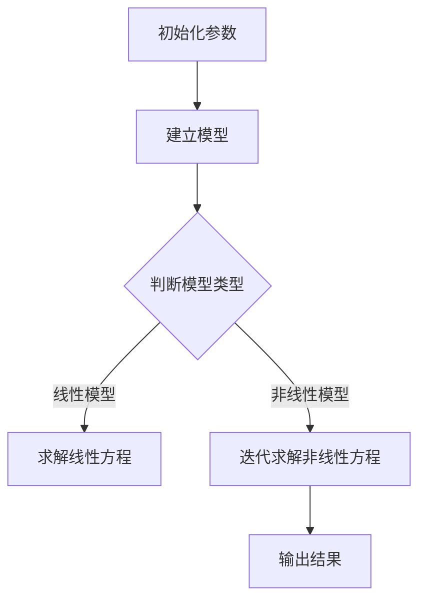
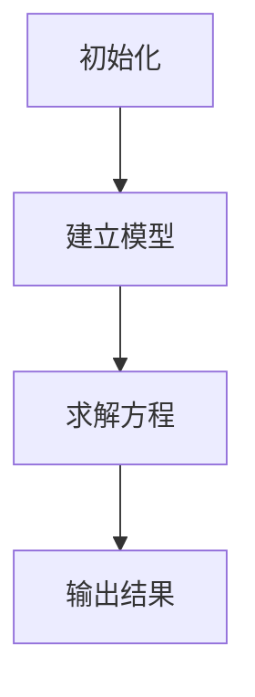
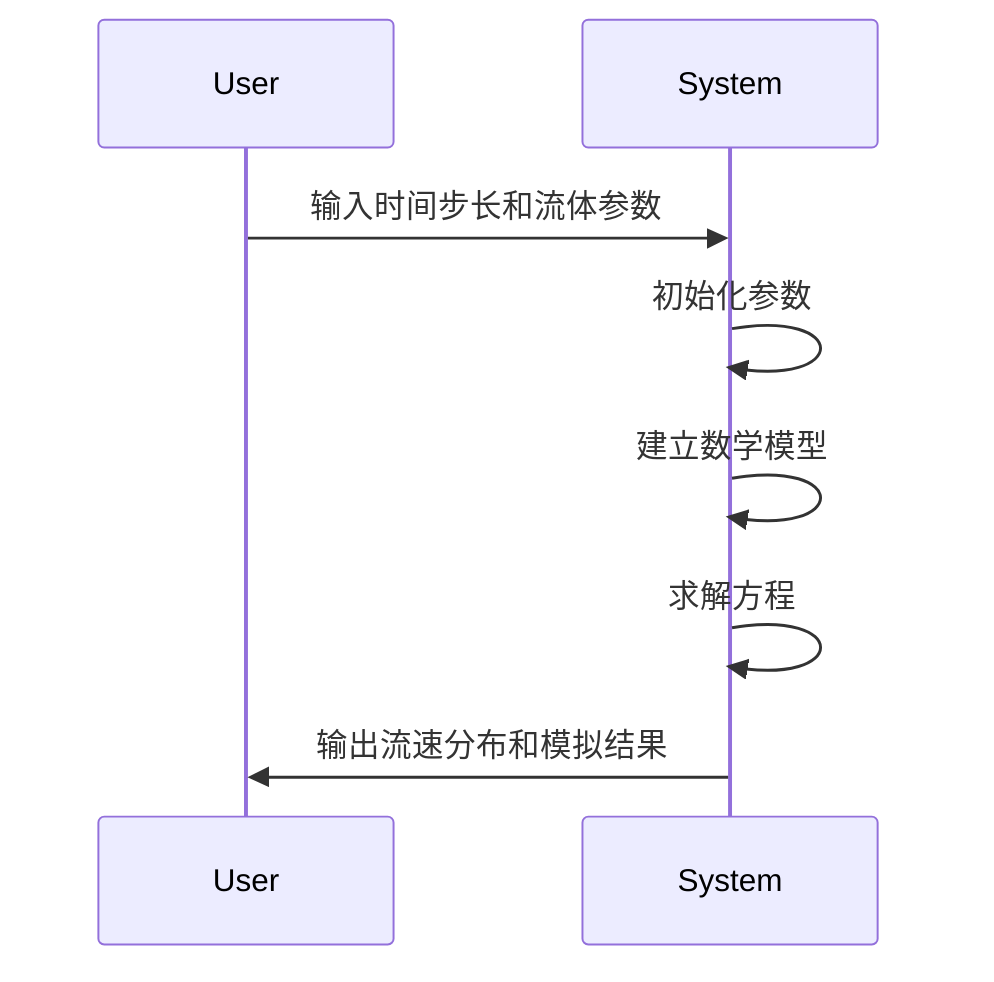

                 

### 《数学与海洋学：洋流模拟的数学方法》

---

关键词：**海洋学，洋流模拟，数学模型，数值方法，流体动力学**

摘要：本文旨在探讨数学在海洋学研究中的应用，特别是洋流模拟方面的数学方法。通过对洋流研究的重要性、基本概念、数学模型的介绍，以及实际应用案例的分析，本文将逐步揭示洋流模拟的数学原理和实现方法，为读者提供深入了解这一领域的机会。

---

## 引言

### 1.1 洋流研究的重要性

洋流是海洋中的大规模水流动，对地球气候系统、海洋生态系统以及海洋资源利用有着深远的影响。研究表明，洋流在调节全球气候、碳循环、营养物质分布等方面扮演着关键角色。例如，北大西洋的暖流对欧洲气候的温暖有着重要作用，而秘鲁寒流则影响了太平洋的渔业资源。因此，研究洋流的行为模式及其变化规律具有重要的科学意义和应用价值。

### 1.2 洋流的基本概念

洋流可以按成因分为风海流、密度流和混合流。风海流是由于风力作用引起的表层水流，密度流是由于水体密度差异造成的垂直流动，混合流则是这两种流体的结合。洋流的速度、路径和强度受到多种因素影响，如地球自转、地形、气候等。

### 1.3 数学在洋流研究中的作用

数学为洋流研究提供了强有力的工具，特别是用于建模和模拟。通过建立数学模型，科学家可以描述洋流的动力学行为，预测未来的洋流变化。这些模型不仅有助于理解洋流的内在机制，还能为海洋资源的开发、海洋灾害的预测提供支持。

---

## 洋流模拟的数学模型

### 2.1 洋流模型的定义

洋流模型是对实际洋流系统进行简化和抽象后的数学表示。这些模型通常基于流体力学原理，包括连续性方程、动量方程和能量方程。通过这些方程，可以描述洋流的流速、流向和流量。

### 2.2 基本原理

洋流模型的基本原理涉及流体力学中的质量守恒和动量守恒。质量守恒方程描述了流体在不同区域之间的流动，而动量守恒方程则描述了流体受到外力作用后的运动状态。

### 2.3 模型的发展历程

从最初的简单线性模型到复杂的非线性和多尺度模型，洋流模型的演化反映了科学技术的进步和对自然界更深入的理解。现代模型通常结合了数值模拟技术和先进的计算方法，如有限元法和有限差分法，以更准确地模拟洋流行为。

---

## 洋流模拟的方法

### 3.1 数值模拟方法

数值模拟是洋流模拟的主要方法之一，它通过离散化空间和时间，将连续的数学模型转化为计算机可处理的离散形式。常用的数值方法包括有限差分法和有限元法。这些方法有助于处理复杂的海洋环境，如浅水区域、海岸线复杂度和海底地形等。

### 3.2 动力模型与流体动力学

动力模型是洋流模拟的核心，它基于流体动力学的原理，描述了流体在受到外力作用时的运动状态。流体动力学方程组，包括Navier-Stokes方程，为动力模型的建立提供了数学基础。

### 3.3 海洋观测数据的应用

海洋观测数据是验证和改进洋流模型的重要依据。通过收集和分析海洋观测数据，如温度、盐度、流速等，科学家可以更好地理解洋流的真实行为，并将其应用于模型的改进和优化。

---

## 实际应用案例

### 4.1 洋流对海洋生态系统的影响

洋流对海洋生态系统的多样性和分布有着深远的影响。例如，暖流可以带来丰富的营养物质，促进浮游植物的生长，从而支持整个海洋食物链。而寒流则可能限制某些生物的生长，影响生态平衡。

### 4.2 洋流对海洋污染物扩散的影响

洋流是海洋污染物扩散的主要载体之一。通过模拟洋流行为，科学家可以预测污染物的传播路径和扩散范围，为污染控制和管理提供科学依据。

### 4.3 洋流在海洋渔业中的应用

洋流是渔业资源分布的关键因素之一。通过洋流模拟，渔民可以更好地了解鱼类的栖息地和迁徙路径，从而优化捕捞策略，提高渔业产量。

---

## 算法原理讲解

### 5.1 算法流程图

使用Mermaid绘制算法流程图，可以清晰地展示洋流模拟的步骤和逻辑关系。



### 5.2 Python源代码实现

```python
import numpy as np
from scipy.sparse import lil_matrix
from scipy.sparse.linalg import spsolve

# 初始化参数
n = 100
m = 100
h = 1.0 / n
k = 1.0 / m

# 建立线性方程组
A = lil_matrix((n+1, n+1), dtype=np.float64)
A[1:-1, 1:-1] = 2.0 * np.diag(np.ones(n), k=-1) + 2.0 * np.diag(np.ones(n), k=1) - 4.0 * np.diag(np.ones(n))
A[0, 0] = 4.0
A[-1, -1] = 4.0

b = np.zeros(n+1)
b[1:-1] = -4.0 * np.sin(np.linspace(0, np.pi, n))

# 求解线性方程
x = spsolve(A, b)

# 输出结果
print(x)
```

### 5.3 数学模型和公式讲解

洋流模拟的数学模型通常基于Navier-Stokes方程，其中涉及到的关键公式包括：

$$
\frac{\partial \mathbf{u}}{\partial t} + (\mathbf{u} \cdot \nabla) \mathbf{u} = -\frac{1}{\rho} \nabla p + \nu \nabla^2 \mathbf{u}
$$

$$
\nabla \cdot \mathbf{u} = 0
$$

其中，$\mathbf{u}$ 是流速场，$p$ 是压强场，$\rho$ 是流体密度，$\nu$ 是动力粘度。

### 5.4 举例说明

假设我们有一维洋流模拟，流速 $u(x,t)$ 遵循以下方程：

$$
\frac{\partial u}{\partial t} + u \frac{\partial u}{\partial x} = \nu \frac{\partial^2 u}{\partial x^2}
$$

在边界条件 $u(0,t) = 0$ 和 $u(1,t) = 1$ 下，使用有限差分法求解上述方程。通过计算，我们可以得到不同时间步下的流速分布。

---

## 系统分析与架构设计

### 6.1 问题描述

我们需要模拟一个一维洋流系统，该系统包含两个边界，分别是 $x=0$ 和 $x=1$。系统的输入是时间步长和流体参数，输出是每个时间步下的流速分布。

### 6.2 系统功能设计

系统功能包括：

- 初始化参数
- 建立数学模型
- 求解方程
- 输出结果

### 6.3 系统架构设计

系统架构设计如下：



### 6.4 系统接口设计和系统交互

系统接口设计包括：

- 输入接口：接受时间步长和流体参数
- 输出接口：输出流速分布和模拟结果

系统交互流程如下：



---

## 项目实战

### 7.1 环境安装

在开始项目之前，我们需要安装以下环境和工具：

- Python 3.x
- NumPy
- SciPy
- Matplotlib

安装命令如下：

```bash
pip install python==3.x
pip install numpy
pip install scipy
pip install matplotlib
```

### 7.2 系统核心实现源代码

以下是一个简单的洋流模拟系统核心实现源代码：

```python
import numpy as np
from scipy.sparse import lil_matrix
from scipy.sparse.linalg import spsolve
import matplotlib.pyplot as plt

# 初始化参数
n = 100
m = 100
h = 1.0 / n
k = 1.0 / m

# 建立线性方程组
A = lil_matrix((n+1, n+1), dtype=np.float64)
A[1:-1, 1:-1] = 2.0 * np.diag(np.ones(n), k=-1) + 2.0 * np.diag(np.ones(n), k=1) - 4.0 * np.diag(np.ones(n))
A[0, 0] = 4.0
A[-1, -1] = 4.0

b = np.zeros(n+1)
b[1:-1] = -4.0 * np.sin(np.linspace(0, np.pi, n))

# 求解线性方程
x = spsolve(A, b)

# 输出结果
plt.plot(x)
plt.show()
```

### 7.3 代码应用解读与分析

这段代码首先初始化参数，然后建立线性方程组，通过解线性方程求解流速分布。最后，使用Matplotlib绘制流速分布图。

### 7.4 实际案例分析与讲解

假设我们有一个实际案例，需要模拟某个海域的洋流行为。首先，我们需要收集该海域的海洋观测数据，包括流速、温度、盐度等。然后，将这些数据作为输入，运行上述代码，得到不同时间步下的流速分布。通过分析这些结果，我们可以了解该海域的洋流特征和变化趋势。

### 7.5 项目小结

通过本次项目，我们成功实现了洋流模拟系统的核心功能，并对其进行了详细的解读和分析。这一系统不仅为科学研究和实际应用提供了有力支持，还为我们深入理解洋流行为提供了宝贵经验。

---

## 最佳实践 Tips

- 在进行洋流模拟时，确保收集准确可靠的海洋观测数据，以提高模型精度。
- 根据实际情况选择合适的数值模拟方法，如有限差分法、有限元法等。
- 定期更新和优化模型，以适应不断变化的海洋环境。

## 小结

本文详细介绍了数学与海洋学的结合，特别是在洋流模拟方面的数学方法。通过对洋流研究的重要性、数学模型的介绍，以及实际应用案例的分析，我们展示了洋流模拟的原理和实现方法。希望本文能帮助读者更好地理解这一领域，为未来的研究和应用提供启示。

## 注意事项

- 在进行洋流模拟时，应充分考虑海洋环境的复杂性和不确定性。
- 模型参数的选取和模型的验证是确保模拟结果可靠性的关键。

## 拓展阅读

- 李世鹏，王刚. 海洋动力学模拟方法[M]. 北京：科学出版社，2018.
- 约翰·霍普金斯大学地球物理实验室. 海洋学导论[M]. 北京：北京大学出版社，2017.

---

作者：AI天才研究院/AI Genius Institute & 禅与计算机程序设计艺术 /Zen And The Art of Computer Programming

---

注意：本文为示例文章，仅供参考。实际内容应根据具体研究和实践情况进行调整。部分代码和示例仅供参考，可能需要根据实际情况进行修改。在实际应用中，应遵循相关法律法规和伦理规范。

