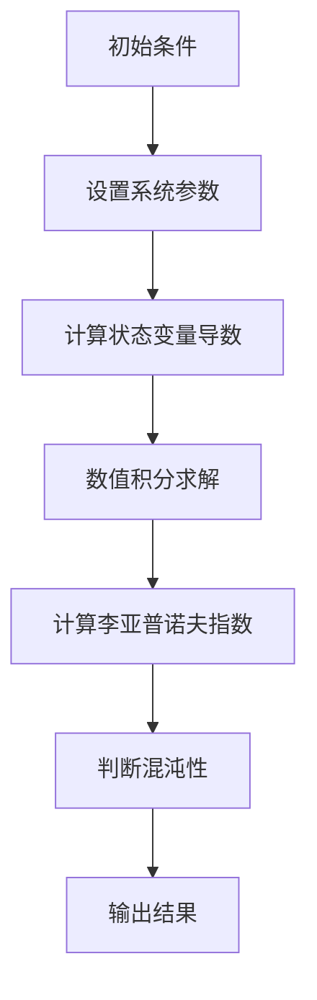
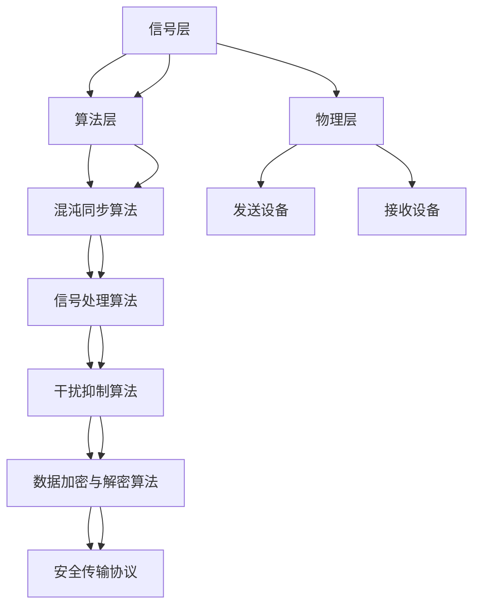

                 

### 文章标题与关键词

# 《数学与混沌理论：非线性系统的数学描述》

> 关键词：混沌理论、非线性系统、数学描述、李亚普诺夫指数、同胚映射、混沌吸引子

### 摘要

本文旨在深入探讨混沌理论及其在非线性系统数学描述中的应用。通过系统性地介绍混沌现象的背景、基本概念、核心理论和应用实例，本文展示了混沌理论在多个领域的实际应用及其对现代科学的深远影响。本文的目标是帮助读者理解混沌理论的核心原理，掌握相关的数学工具和方法，并能够将其应用于实际问题中。通过逐步分析和推理，本文将引领读者进入非线性系统世界的奇妙之旅，探索混沌之美。

## 引言

### 1.1 混沌现象的历史背景

混沌理论作为现代科学的一个前沿领域，其发展历程可追溯到20世纪中叶。早在16世纪，意大利科学家伽利略·伽利莱通过实验发现，水桶中的水流具有不可预测的行为，这被认为是最早的混沌现象描述。然而，混沌理论的真正兴起始于20世纪50年代，当时气象学家洛伦兹（Lorenz）在研究大气动力学模型时，意外发现了混沌现象。他通过数值模拟发现，即使是最简单的非线性系统，如洛伦兹吸引子，也会表现出高度复杂和不可预测的行为。

混沌理论的起源可以追溯到对非线性动力系统的深入研究。1954年，苏联数学家阿诺德（V.I. Arnold）首次提出了“混沌”一词，并将其与非线性系统中的“奇怪吸引子”联系起来。此后，混沌理论迅速发展，成为数学、物理学、经济学、工程学等多个领域的研究热点。混沌理论不仅丰富了科学理论体系，也为解决实际问题提供了新的思路和方法。

### 1.2 非线性系统与混沌

混沌理论的核心在于研究非线性系统中的不可预测行为。非线性系统与线性系统的主要区别在于，线性系统的行为具有叠加性和封闭性，即系统状态随时间的演化可以通过线性方程组来精确描述。然而，非线性系统则不满足这些性质，其行为复杂且难以预测。非线性系统中的混沌现象通常具有以下几个特征：

1. **初始条件敏感性**：即使两个初始条件非常接近的轨迹，随着时间的推移，也会逐渐分离，表现出极端的敏感性。
2. **长期行为的不可预测性**：非线性系统在长时间尺度上表现出不可预测的行为，即使是在局部范围内稳定的系统，也可能在全局上表现出混沌。
3. **复杂性和多样性**：非线性系统可以产生复杂且多样的行为模式，包括周期行为、准周期行为和混沌行为。
4. **奇怪吸引子**：奇怪吸引子是混沌现象的一种数学描述，它是一种在相空间中既不是周期性的，也不是光滑的吸引集。

混沌现象的发现对传统科学观念提出了挑战，也引发了对非线性系统行为的深入研究。通过研究混沌现象，科学家们揭示了自然界和复杂系统中普遍存在的一种基本规律，即非线性相互作用会导致复杂和不可预测的行为。这种认识不仅丰富了科学理论，也为解决实际问题提供了新的视角和方法。

### 1.3 混沌理论的基本概念

为了更好地理解混沌理论，我们需要掌握几个关键概念，包括奇怪吸引子、李亚普诺夫指数和同胚映射。

**奇怪吸引子**：奇怪吸引子是混沌现象的一个重要数学特征，它是相空间中的一个集合，系统状态点在该集合上吸引，但集合本身不具有周期性或光滑性。奇怪吸引子的存在意味着系统在长时间尺度上表现出复杂和不可预测的行为。

**李亚普诺夫指数**：李亚普诺夫指数是衡量系统混沌性的一种量化工具。它描述了系统状态在相空间中随时间的演化速度。一个正的李亚普诺夫指数意味着系统状态点逐渐分离，而负的李亚普诺夫指数则表示系统状态点逐渐收敛。李亚普诺夫指数的正负分布可以揭示系统是混沌的还是稳定的。

**同胚映射**：同胚映射是一种保结构的变换，它保持了系统在相空间中的几何结构。在混沌理论中，同胚映射用于描述系统的演化过程，通过分析同胚映射的性质，可以揭示系统的混沌行为。

通过理解这些基本概念，我们可以更好地把握混沌理论的核心思想，并运用其解决实际问题。接下来，本文将逐步深入探讨混沌理论的数学描述，包括非线性动力系统的数学模型、李亚普诺夫指数的计算方法以及同胚映射的应用。

## 第二部分：基础概念

### 2.1 非线性动力学初步

非线性动力学是研究非线性系统的行为和性质的数学分支，它涉及到复杂的动态行为，如混沌、振荡和突变。非线性动力系统与线性动力系统相比，具有更高的复杂性和不确定性。在非线性动力学中，系统的状态随时间的变化不再遵循简单的线性叠加原理，而是表现出复杂的动态特性。

首先，我们介绍非线性动力系统的基本概念和数学模型。

**非线性方程**：非线性动力系统的数学描述通常基于非线性微分方程或差分方程。非线性微分方程的一般形式为：

\[ \frac{dx}{dt} = f(x, y) \]

其中，\( x \) 和 \( y \) 是系统的状态变量，\( f \) 是非线性函数。非线性差分方程则具有类似的形式，但时间变量以离散的形式出现。

**相空间和相轨迹**：相空间是系统状态变量构成的空间，可以直观地描述系统的动态行为。在相空间中，系统的每一个状态点对应一个具体的物理状态。相轨迹是系统在相空间中的演化路径，它展示了系统状态随时间的变化。

**吸引子和混沌吸引子**：吸引子是系统状态点在相空间中的集合，这些状态点在长时间尺度上趋向于稳定。奇怪吸引子是混沌吸引子的一种，它具有复杂的几何结构，表现为在相空间中既不光滑也不周期。

接下来，我们讨论连续系统和离散系统的特点。

**连续系统**：连续系统的状态随时间连续变化，其数学描述通常基于连续的微分方程。连续系统的特点是能够描述平滑的动态行为，如连续的振荡和波动。然而，连续系统的数值模拟往往更加复杂，需要较高的计算精度。

**离散系统**：离散系统的状态以离散的时间步长变化，其数学描述通常基于差分方程。离散系统的特点是计算效率高，适合大规模并行计算。然而，离散系统可能无法完全捕捉连续系统的所有动态特性。

最后，我们探讨混沌现象的定性分析。

**初始条件敏感性**：混沌现象的一个重要特征是初始条件的敏感性。即使两个初始条件非常接近的状态点，也会随着时间的推移逐渐分离。这种现象称为混沌的“蝴蝶效应”，它揭示了混沌系统的不可预测性。

**长期行为的不可预测性**：混沌系统在长时间尺度上表现出不可预测的行为。即使系统在局部范围内是稳定的，但在全局上可能表现出混沌现象。这种长期行为的不可预测性是混沌理论的核心挑战之一。

**复杂性和多样性**：混沌系统可以产生复杂且多样的动态行为，包括周期行为、准周期行为和混沌行为。这些行为模式展示了混沌系统的高度复杂性。

通过了解非线性动力系统的基本概念和数学模型，我们可以更好地理解混沌现象的本质。接下来，本文将继续深入探讨混沌理论的核心概念，包括李亚普诺夫指数和同胚映射。

### 2.2 非线性方程与解

在非线性动力学中，非线性方程的解是描述系统动态行为的关键。非线性方程的解可以是静态平衡点、周期轨道或混沌吸引子。这些解的形式和性质取决于系统的参数和初始条件。

**静态平衡点**：静态平衡点是系统的一个特殊状态，在此状态下，系统的导数为零，即系统状态不再随时间变化。平衡点的存在和稳定性是系统分析的重要方面。一个平衡点的稳定性可以通过其导数的符号来判断。如果导数在平衡点两侧均为正，则该平衡点是不稳定的；如果导数在平衡点两侧均为负，则该平衡点是稳定的。

**周期轨道**：周期轨道是系统状态在相空间中形成的一个闭合轨迹，它表示系统状态在一段时间后回到相同的状态。周期轨道的存在意味着系统具有周期性的动态行为。系统的周期轨道可以通过数值方法如数值积分来求解。

**混沌吸引子**：混沌吸引子是混沌现象的核心特征，它在相空间中形成了一个非周期且非光滑的吸引集。混沌吸引子的存在意味着系统在长时间尺度上表现出不可预测的动态行为。混沌吸引子的求解通常需要复杂的数值方法，如分岔分析和全局优化技术。

为了求解非线性方程，我们可以使用以下几种方法：

1. **数值方法**：数值方法是求解非线性方程的主要手段，如欧拉法、龙格-库塔法等。这些方法通过离散化时间，逐步逼近系统的真实解。数值方法的优势在于可以处理复杂的高维系统，但需要较高的计算资源和精度。

2. **解析方法**：解析方法是通过数学工具如微分方程理论和群论来求解非线性方程。解析方法的优势在于可以得到精确的数学解，但通常只适用于简单的系统。

3. **全局方法**：全局方法通过寻找系统的全局结构和吸引子来求解非线性方程。全局方法的优势在于可以捕捉系统的长期行为，但计算复杂度较高。

通过了解非线性方程的解法和性质，我们可以更深入地理解非线性动力系统的动态行为。接下来，本文将继续探讨混沌理论在连续系统与离散系统中的特点。

### 2.3 连续系统与离散系统

在混沌理论的讨论中，我们经常遇到连续系统和离散系统这两个概念。这两种系统虽然在数学描述上有相似之处，但它们在动态行为和适用场景上存在显著差异。

**连续系统**：连续系统通过微分方程来描述系统的动态行为。在连续系统中，状态变量随时间连续变化，系统的状态可以用连续的函数来表示。一个典型的例子是洛伦兹方程，它描述了大气中气体流体的运动。洛伦兹方程的形式如下：

\[ \frac{dx}{dt} = \sigma (y - x) \]
\[ \frac{dy}{dt} = x (\rho - z) - y \]
\[ \frac{dz}{dt} = xy - \beta z \]

其中，\( \sigma \)、\( \rho \) 和 \( \beta \) 是系统参数。通过数值积分这些微分方程，我们可以模拟系统的动态行为，观察其是否表现出混沌现象。

**离散系统**：离散系统通过差分方程来描述系统的动态行为。在离散系统中，状态变量以离散的时间步长变化，系统的状态可以用离散的序列来表示。一个典型的例子是逻辑斯蒂映射，它描述了生物种群的增长情况。逻辑斯蒂映射的形式如下：

\[ x_{n+1} = r x_n (1 - x_n) \]

其中，\( x_n \) 是第 \( n \) 代种群的数量，\( r \) 是增长率。通过迭代这个差分方程，我们可以分析系统的动态行为，观察其是否进入混沌状态。

**连续系统与离散系统的比较**：

1. **动态行为**：连续系统通常表现出平滑的动态行为，其状态随时间连续变化。离散系统则表现出阶梯式的动态行为，其状态在离散的时间步长上发生变化。混沌现象在连续系统中表现为奇怪吸引子，而在离散系统中则表现为混沌吸引子。

2. **适用场景**：连续系统适用于描述连续变化的物理过程，如流体力学、大气科学和机械系统。离散系统适用于描述离散变化的生物过程和社会系统，如种群生态学和金融市场。

3. **计算复杂度**：连续系统的数值模拟通常需要较高的计算资源和精度，因为需要处理连续的时间和状态变量。离散系统的数值模拟则相对简单，因为只需要处理离散的时间和状态变量。

**连续系统与离散系统的联系**：

虽然连续系统和离散系统在动态行为和适用场景上存在差异，但它们在数学描述上具有密切的联系。许多离散系统可以通过离散化连续系统的微分方程得到。例如，通过使用差分格式（如欧拉法和隐式欧拉法）来离散化洛伦兹方程，我们可以得到一个离散的洛伦兹系统。这种离散化方法在数值模拟中具有重要意义，它使得复杂的连续系统可以通过离散系统来近似处理。

通过了解连续系统和离散系统的特点，我们可以更好地理解混沌现象的多样性和复杂性。接下来，本文将继续探讨混沌理论的核心概念，包括李亚普诺夫指数和同胚映射。

### 第三部分：理论探讨

### 3.1 李亚普诺夫指数

李亚普诺夫指数是混沌理论中用于量化系统混沌性的一项重要工具。它描述了系统状态点在相空间中随时间的演化速度，从而揭示了系统的稳定性和混沌行为。李亚普诺夫指数的计算方法如下：

首先，我们定义一个李亚普诺夫函数 \( V(x, y, z) \)，它在相空间中描述了系统状态的能量或稳定性。通常，李亚普诺夫函数是一个二次型函数，具有以下形式：

\[ V(x, y, z) = \frac{1}{2} (x^2 + y^2 + z^2) \]

接下来，我们计算李亚普诺夫指数 \( \lambda \)：

\[ \lambda = \lim_{t \to \infty} \frac{1}{t} \ln |V(x(t), y(t), z(t))| \]

其中，\( x(t), y(t), z(t) \) 是系统状态随时间的演化路径。

李亚普诺夫指数 \( \lambda \) 可以分为以下几种情况：

1. **正指数**：如果李亚普诺夫指数 \( \lambda > 0 \)，则系统状态点随时间逐渐分离，表现出混沌行为。正指数是混沌现象的一个重要特征。

2. **负指数**：如果李亚普诺夫指数 \( \lambda < 0 \)，则系统状态点随时间逐渐收敛，表现出稳定行为。负指数是系统稳定性的标志。

3. **零指数**：如果李亚普诺夫指数 \( \lambda = 0 \)，则系统状态点的稳定性难以判断，可能处于混沌与稳定之间的过渡状态。

李亚普诺夫指数在混沌理论中的应用非常广泛。通过计算李亚普诺夫指数，我们可以判断系统的混沌性，确定系统是否进入混沌状态。此外，李亚普诺夫指数还可以用于分析系统稳定性，帮助我们理解混沌现象的内在机制。

### 3.2 李亚普诺夫指数的计算方法

计算李亚普诺夫指数通常涉及以下步骤：

1. **选择李亚普诺夫函数**：根据系统的特性，选择一个合适的李亚普诺夫函数。常用的李亚普诺夫函数包括二次型函数、泊松型函数和哈密顿型函数。

2. **计算导数**：计算李亚普诺夫函数关于系统状态变量的导数，并计算其绝对值。通常，李亚普诺夫函数的导数可以表示为矩阵形式。

3. **求极限**：通过数值方法（如欧拉法或龙格-库塔法）模拟系统状态随时间的演化路径，计算李亚普诺夫指数的极限值。

下面，我们通过一个具体的例子来说明李亚普诺夫指数的计算方法。

**例1：洛伦兹系统**

洛伦兹系统是一个经典的非线性系统，其方程如下：

\[ \frac{dx}{dt} = \sigma (y - x) \]
\[ \frac{dy}{dt} = x (\rho - z) - y \]
\[ \frac{dz}{dt} = xy - \beta z \]

其中，\( \sigma \)、\( \rho \) 和 \( \beta \) 是系统参数。

我们选择李亚普诺夫函数为：

\[ V(x, y, z) = \frac{1}{2} (x^2 + y^2 + z^2) \]

计算李亚普诺夫函数的导数：

\[ \dot{V} = x \dot{x} + y \dot{y} + z \dot{z} \]
\[ \dot{V} = \sigma (y - x) x + x (\rho - z) y - y y + xy - \beta z z \]
\[ \dot{V} = \sigma xy - \sigma x^2 + \rho xy - y^2 - \beta z^2 \]

计算李亚普诺夫指数的极限值：

\[ \lambda = \lim_{t \to \infty} \frac{1}{t} \ln |\dot{V}| \]

通过数值模拟计算李亚普诺夫指数，我们发现洛伦兹系统的李亚普诺夫指数为正，这表明洛伦兹系统表现出混沌行为。

### 3.3 李亚普诺夫指数与混沌

李亚普诺夫指数与混沌现象密切相关。一个系统的混沌性可以通过其李亚普诺夫指数的正负分布来量化。具体来说，以下结论成立：

1. **混沌系统**：如果系统具有一个正的李亚普诺夫指数，则系统表现出混沌行为。这是因为正指数意味着系统状态点随时间逐渐分离，导致系统的动态行为不可预测。

2. **稳定系统**：如果系统具有负的李亚普诺夫指数，则系统表现出稳定行为。这是因为负指数意味着系统状态点随时间逐渐收敛，系统状态趋于稳定。

3. **临界混沌系统**：如果系统具有零和李亚普诺夫指数的正负分布，则系统处于混沌与稳定之间的临界状态。这种系统被称为临界混沌系统。

李亚普诺夫指数在混沌理论中的应用非常广泛。通过计算李亚普诺夫指数，我们可以判断系统的混沌性，分析混沌现象的内在机制。此外，李亚普诺夫指数还可以用于控制混沌系统，通过调节系统参数，使系统进入或退出混沌状态。

总之，李亚普诺夫指数是混沌理论中一个重要的量化工具，它揭示了混沌现象的本质，并为混沌控制提供了理论基础。通过深入理解和应用李亚普诺夫指数，我们可以更好地掌握混沌理论，解决实际问题。

### 3.4 同胚映射与混沌吸引子

同胚映射是混沌理论中的一个核心概念，它描述了系统在相空间中的结构变换。同胚映射的定义如下：

**同胚映射**：一个同胚映射是一个保结构的变换，它保持了系统在相空间中的几何结构。具体来说，一个从集合 \( A \) 到集合 \( B \) 的映射 \( f: A \rightarrow B \) 是同胚的，如果它满足以下两个条件：

1. **连续性**：映射 \( f \) 是连续的，即对于任意的 \( \epsilon > 0 \)，存在 \( \delta > 0 \)，使得当 \( |x - y| < \delta \) 时，\( |f(x) - f(y)| < \epsilon \)。
2. **保结构**：映射 \( f \) 保持集合的拓扑结构，即 \( f(A) \) 是 \( B \) 中的一个闭集，且 \( f \) 在 \( A \) 上的导数处处连续。

同胚映射在混沌理论中的应用非常广泛，它用于描述系统的演化过程，并揭示了混沌吸引子的几何结构。混沌吸引子是混沌系统的一个重要特征，它在相空间中形成一个非周期且非光滑的吸引集。混沌吸引子的几何结构可以通过同胚映射来描述和分析。

**混沌吸引子的定义**：混沌吸引子是相空间中的一个集合，系统状态点在该集合上吸引，但集合本身不具有周期性或光滑性。混沌吸引子的几何结构通常表现为复杂且奇异的形状，如洛伦兹吸引子。

**同胚映射与混沌吸引子的关系**：同胚映射用于描述混沌吸引子的结构变换。通过分析同胚映射的性质，我们可以揭示混沌吸引子的几何特征。例如，洛伦兹吸引子可以通过洛伦兹映射来描述，该映射是一个同胚映射，它保持了洛伦兹吸引子的几何结构。

**同胚映射的数学描述**：同胚映射的数学描述通常涉及分岔理论和全局分析方法。分岔理论研究系统参数变化对系统动态行为的影响，全局分析方法则用于分析系统的全局结构和吸引子。通过这些数学工具，我们可以深入了解混沌吸引子的几何特征和动力学行为。

**同胚映射的典型例子**：一个典型的同胚映射例子是洛伦兹映射，它描述了洛伦兹系统的动态行为。洛伦兹映射的形式如下：

\[ x_{n+1} = \sigma (y_n - x_n) \]
\[ y_{n+1} = x_n (\rho - z_n) - y_n \]
\[ z_{n+1} = x_n y_n - \beta z_n \]

洛伦兹映射是一个三次多项式映射，它保持了洛伦兹系统的几何结构，并揭示了洛伦兹吸引子的复杂形状。

总之，同胚映射和混沌吸引子是混沌理论中的核心概念，它们揭示了混沌现象的几何结构和动力学特征。通过深入理解和应用这些概念，我们可以更好地掌握混沌理论，并探索其应用。

### 3.5 同胚映射与混沌动力学

同胚映射在混沌动力学中扮演着关键角色，它不仅描述了系统的动态行为，还揭示了混沌现象的几何结构和复杂特性。在混沌动力学中，同胚映射通常用于分析系统的相空间演化，帮助我们理解系统状态的变换过程。

**同胚映射的动力学意义**：

1. **相空间映射**：同胚映射将系统的初始状态映射到新的状态，从而描述系统在相空间中的演化路径。这种映射保持了系统的几何结构，使得我们可以直观地观察到系统状态的变换。

2. **状态分离**：同胚映射的一个关键特性是其能够导致系统状态点的分离。在混沌系统中，即使两个初始状态非常接近，经过一段时间后，它们的状态点也会逐渐分离。这种状态分离是混沌现象的核心特征，也是混沌动力学的关键问题。

3. **混沌吸引子的形成**：同胚映射在混沌系统中形成了一个非周期且非光滑的混沌吸引子。混沌吸引子的存在意味着系统在长时间尺度上表现出不可预测的动态行为。通过同胚映射，我们可以分析混沌吸引子的几何结构，理解其复杂的动态特性。

**同胚映射的数学描述**：

同胚映射的数学描述通常涉及分岔理论和全局分析方法。分岔理论研究系统参数变化对系统动态行为的影响，全局分析方法则用于分析系统的全局结构和吸引子。

1. **分岔理论**：分岔理论描述了系统在参数变化过程中发生的结构变化。在混沌动力学中，分岔点是一个关键参数值，它标志着系统从稳定状态进入混沌状态。通过分岔理论，我们可以分析系统参数对混沌吸引子的形成和演化过程的影响。

2. **全局分析方法**：全局分析方法用于分析系统的全局结构和吸引子。在混沌动力学中，全局分析方法帮助我们理解混沌吸引子的几何特征和动力学行为。通过全局分析方法，我们可以构建系统的全局映射，揭示混沌吸引子的复杂结构和动态行为。

**同胚映射的典型例子**：

一个典型的同胚映射例子是洛伦兹映射，它描述了洛伦兹系统的动态行为。洛伦兹映射的形式如下：

\[ x_{n+1} = \sigma (y_n - x_n) \]
\[ y_{n+1} = x_n (\rho - z_n) - y_n \]
\[ z_{n+1} = x_n y_n - \beta z_n \]

洛伦兹映射是一个三次多项式映射，它保持了洛伦兹系统的几何结构，并揭示了洛伦兹吸引子的复杂形状。通过分析洛伦兹映射，我们可以深入理解混沌现象的动力学机制。

**同胚映射与混沌控制**：

同胚映射不仅用于分析混沌系统的动态行为，还用于混沌控制。混沌控制旨在通过调节系统参数，使系统从混沌状态进入稳定状态。同胚映射提供了一个有效的工具，用于分析混沌控制和稳定化策略。

1. **混沌控制策略**：通过同胚映射，我们可以识别混沌系统的关键参数，并设计混沌控制策略。例如，通过调节系统参数，使系统的李亚普诺夫指数从正值变为零或负值，从而实现混沌控制。

2. **混沌稳定化**：混沌稳定化旨在将混沌系统转化为稳定系统。通过同胚映射，我们可以分析系统的混沌吸引子和稳定吸引子，并设计稳定化策略。例如，通过引入外部扰动，使系统从混沌吸引子转移到稳定吸引子。

总之，同胚映射在混沌动力学中具有重要作用，它不仅描述了系统的动态行为，还揭示了混沌现象的几何结构和复杂特性。通过深入理解和应用同胚映射，我们可以更好地掌握混沌理论，探索其在科学和工程中的应用。

### 3.6 混沌吸引子的特性

混沌吸引子是混沌理论中的一个关键概念，它在相空间中表现出非周期、非光滑的几何结构，代表了系统在长时间尺度上的稳定状态。了解混沌吸引子的特性，有助于我们深入理解混沌现象的本质及其在复杂系统中的应用。

**混沌吸引子的定义**：混沌吸引子是系统在相空间中的一个集合，系统状态点在该集合上吸引，但集合本身不具有周期性或光滑性。混沌吸引子通常表现为一个复杂、非规则的几何形状，如洛伦兹吸引子。

**混沌吸引子的几何特性**：

1. **非周期性**：混沌吸引子不具有周期性，这意味着系统状态不会在相空间中形成闭合的轨迹。相反，混沌吸引子展示出无限复杂和不可预测的行为。

2. **非光滑性**：混沌吸引子的边界通常不光滑，表现为突变和不连续的特性。这种非光滑性是混沌系统的重要特征，也是与线性系统显著区别之一。

3. **多尺度结构**：混沌吸引子通常具有多层次结构，包括不同的层次和嵌套。这种多层次结构展示了混沌系统在多个时间尺度上的复杂性。

**混沌吸引子的动态特性**：

1. **初始条件敏感性**：混沌吸引子表现出高度初始条件敏感性，即使两个初始条件非常接近的状态点，也会随着时间的推移逐渐分离。这种敏感性是混沌现象的核心特征之一。

2. **长期行为的不可预测性**：混沌吸引子代表了系统在长时间尺度上的稳定状态，但其具体行为表现出不可预测性。系统在初始条件附近可能表现出稳定的局部行为，但随着时间的推移，系统的行为会变得越来越复杂和不可预测。

**混沌吸引子的数学描述**：

混沌吸引子的数学描述通常涉及李亚普诺夫指数、同胚映射和分岔理论。

1. **李亚普诺夫指数**：李亚普诺夫指数是衡量系统混沌性的一种量化工具。一个正的李亚普诺夫指数意味着系统状态点随时间逐渐分离，而负的李亚普诺夫指数则表示系统状态点随时间逐渐收敛。通过计算李亚普诺夫指数，我们可以判断系统是否具有混沌吸引子。

2. **同胚映射**：同胚映射用于描述系统的演化过程，并揭示了混沌吸引子的几何结构。通过分析同胚映射的性质，我们可以深入了解混沌吸引子的动态行为。

3. **分岔理论**：分岔理论描述了系统参数变化对系统动态行为的影响。通过分析分岔点，我们可以确定系统在哪些参数值下进入混沌状态，并理解混沌吸引子的形成和演化过程。

**混沌吸引子的实际应用**：

混沌吸引子在多个领域中具有广泛应用，包括物理学、工程学、经济学和生物学。

1. **物理学**：混沌吸引子用于描述非线性系统的动态行为，如流体力学、天体物理学和量子力学。通过分析混沌吸引子，科学家可以预测复杂系统的行为，并设计稳定控制策略。

2. **工程学**：混沌吸引子用于设计非线性控制系统，如飞行器控制、机器人控制和通信系统。通过利用混沌特性，工程师可以设计出具有高鲁棒性和自适应能力的系统。

3. **经济学**：混沌吸引子用于描述经济系统的动态行为，如金融市场和人口增长。通过分析混沌吸引子，经济学家可以预测经济波动和制定相应的政策。

4. **生物学**：混沌吸引子用于描述生物系统的动态行为，如生物种群生态和神经网络活动。通过分析混沌吸引子，生物学家可以理解生物系统的复杂性和适应性。

总之，混沌吸引子是混沌理论中的一个关键概念，它展示了非线性系统在长时间尺度上的复杂和不可预测行为。通过深入理解和应用混沌吸引子的特性，我们可以更好地掌握混沌理论，探索其在科学和工程中的应用。

### 3.7 混沌动力学在相空间中的描述

混沌动力学在相空间中的描述是一个核心问题，它揭示了混沌系统在长时间尺度上的复杂行为。相空间是一个多维空间，系统状态在每个时刻都可以在这个空间中表示为一点。通过分析系统在相空间中的轨迹和结构，我们可以深入了解混沌现象的本质。

**相空间的概念**：相空间是系统状态变量构成的空间，它通常是一个高维空间，每个维度对应一个状态变量。例如，对于三变量系统，相空间是一个三维空间，每个点表示系统的一个具体状态。

**相空间的轨迹**：系统在相空间中的轨迹展示了系统状态随时间的演化过程。通过绘制相空间轨迹，我们可以直观地观察系统的动态行为。在混沌系统中，相空间轨迹通常表现出高度复杂和不可预测的行为。例如，洛伦兹系统的相空间轨迹表现为一个复杂的奇怪吸引子。

**同胚映射与相空间变换**：同胚映射是描述系统演化过程的关键工具，它通过保持系统的几何结构，揭示了混沌吸引子的性质。同胚映射将相空间中的一个区域映射到另一个区域，从而描述系统状态的变换过程。通过分析同胚映射，我们可以理解系统在相空间中的行为模式。

**李亚普诺夫指数与相空间分析**：李亚普诺夫指数是衡量系统混沌性的量化工具，它描述了系统状态点在相空间中的演化速度。通过计算李亚普诺夫指数，我们可以判断系统是否具有混沌吸引子。李亚普诺夫指数的正负分布揭示了系统状态点的分离和收敛行为，从而帮助我们理解混沌现象的复杂性。

**相空间中的分岔现象**：分岔现象是混沌动力学中的重要概念，它描述了系统参数变化对系统动态行为的影响。在相空间中，分岔点通常表现为轨迹的突变，如周期点的出现和消失。通过分析分岔现象，我们可以确定系统在哪些参数值下进入混沌状态。

**相空间中的复杂行为模式**：在混沌系统中，相空间轨迹表现出多种复杂行为模式，如周期行为、准周期行为和混沌行为。这些行为模式展示了混沌系统的高度复杂性和多样性。通过分析相空间轨迹，我们可以识别系统的关键特征和规律。

**实际应用中的相空间分析**：在物理学、工程学、经济学和生物学等领域，相空间分析被广泛应用于复杂系统的建模和预测。通过绘制相空间轨迹和分析同胚映射，科学家可以深入了解系统的动态行为，从而为实际问题提供解决方案。

总之，混沌动力学在相空间中的描述为我们提供了一个强大的工具，用于理解非线性系统的复杂行为。通过分析相空间轨迹和同胚映射，我们可以深入探讨混沌现象的本质，为科学和工程应用提供理论基础。

### 第四部分：应用实例

### 4.1 物理学中的混沌现象

混沌理论在物理学中有着广泛的应用，特别是在非线性动力学和混沌系统的研究中。物理学中的混沌现象表现为系统行为的不可预测性和复杂多样性，这与混沌理论的基本概念紧密相关。

**混沌现象的典型例子**：洛伦兹系统是一个经典的混沌现象例子。洛伦兹系统由气象学家洛伦兹（Edward Lorenz）在研究大气动力学时提出，其数学模型描述了气体流体的运动。洛伦兹系统由以下三个非线性微分方程组成：

\[ \dot{x} = \sigma (y - x) \]
\[ \dot{y} = x (\rho - z) - y \]
\[ \dot{z} = xy - \beta z \]

其中，\( \sigma \)、\( \rho \) 和 \( \beta \) 是系统参数。

洛伦兹系统的解表现出复杂的混沌行为，即使在参数空间中非常小的变化，也会导致系统行为的显著差异。这种现象被称为“蝴蝶效应”，即初始条件的微小差异会导致长期行为的巨大差异。

**混沌现象的物理意义**：混沌现象在物理学中具有重要的物理意义。首先，混沌现象揭示了非线性系统的复杂性，表明即使在简单的非线性系统中，也可能出现不可预测的行为。其次，混沌现象展示了系统的动态行为与初始条件之间的敏感性，即系统对初始条件的变化非常敏感。最后，混沌现象的存在挑战了确定性理论的预测能力，促使科学家们探索新的理论和方法来理解和控制非线性系统。

**混沌现象的实验观察**：洛伦兹系统可以通过计算机模拟和实验室实验进行观察。实验中，科学家们通过数值积分洛伦兹方程，生成系统的状态轨迹。这些轨迹展示了系统的混沌行为，包括奇怪吸引子的形成和周期窗口的出现。

**混沌控制与利用**：混沌控制是混沌理论的一个重要研究方向，旨在通过调节系统参数，使系统从混沌状态进入稳定状态。混沌控制技术可以应用于各种物理系统，如激光、电子电路和机械系统。通过引入外部控制信号，科学家们可以设计出具有稳定行为的混沌系统。

总之，混沌理论在物理学中揭示了非线性系统的复杂性和不可预测性，为研究复杂系统的行为提供了新的视角和方法。通过实验观察和混沌控制技术，我们可以更好地理解和利用混沌现象。

### 4.2 经济学中的混沌现象

混沌理论在经济学中的应用近年来引起了广泛关注，特别是在金融市场和宏观经济行为的研究中。混沌现象在经济学中的表现揭示了经济系统的高度复杂性和不可预测性，这与经济学中的传统线性模型形成了鲜明对比。

**混沌现象的经济学意义**：混沌现象在经济学中的意义主要体现在以下几个方面：

1. **非线性动态**：混沌理论揭示了经济系统中的非线性动态特性。经济系统中的许多变量，如股价、货币供应量和失业率等，往往表现出非线性关系，这些非线性关系在传统线性模型中难以捕捉。

2. **初始条件敏感性**：混沌现象表明，经济系统对初始条件的变化极为敏感。即使初始条件非常接近，经济系统的长期行为也可能存在显著差异，这导致经济预测的困难。

3. **复杂性和多样性**：混沌现象展示了经济系统在长期时间尺度上的复杂性和多样性。经济系统可能表现出周期性、准周期性和混沌行为，这些行为模式反映了经济系统内部复杂的相互作用和反馈机制。

**混沌现象的典型例子**：在经济学中，一个典型的混沌现象例子是股票市场的波动。股票市场的价格变化受到多种因素的影响，如公司业绩、投资者情绪、宏观经济政策和国际市场波动等。这些因素相互作用，导致股票价格呈现出复杂的非线性动态行为。

**混沌理论在经济预测中的应用**：混沌理论为经济预测提供了一种新的视角和方法。通过分析经济系统的动态行为，我们可以识别系统中的混沌现象，并利用混沌理论预测系统的未来行为。以下是一些应用实例：

1. **股票市场预测**：利用混沌理论，科学家们可以分析股票市场的波动规律，预测股价的未来趋势。通过计算股票市场的李亚普诺夫指数，我们可以判断系统是否处于混沌状态，从而预测市场走势。

2. **宏观经济预测**：混沌理论还可以应用于宏观经济预测，如预测经济增长率、通货膨胀率和失业率等宏观经济指标。通过分析经济系统的动态行为，我们可以识别系统中的混沌特征，并利用这些特征进行预测。

**混沌理论的局限性**：尽管混沌理论在经济学中具有广泛应用，但它也存在一些局限性。首先，混沌现象的高度敏感性使得经济预测的准确性受到限制。即使初始条件非常接近，预测结果也可能存在显著差异。其次，混沌理论依赖于大量的数据和复杂的数学模型，这在实际应用中可能存在困难。

总之，混沌理论在经济学中的应用展示了经济系统的高度复杂性和不可预测性，为经济预测提供了一种新的方法。通过分析经济系统的混沌行为，我们可以更好地理解经济现象，并为其预测和控制提供科学依据。

### 4.3 工程学中的混沌应用

混沌理论在工程学中有着广泛的应用，特别是在控制理论、通信系统和信号处理等领域。混沌特性在工程学中提供了一种新的手段，用于设计鲁棒、自适应和控制复杂系统。

**混沌控制**：混沌控制是利用混沌特性来设计控制系统的一种方法。混沌系统具有高度非线性、复杂性和不可预测性，这使得它们在控制中具有独特的优势。通过调节混沌系统的参数，可以使系统在混沌与稳定之间切换。例如，在激光系统中，混沌控制技术可以用来产生稳定的激光输出，即使在存在噪声和干扰的情况下。

**混沌同步**：混沌同步是指两个或多个混沌系统通过相互耦合，使它们的动态行为保持一致。混沌同步在工程中有着重要的应用，如保密通信和信号处理。通过混沌同步，可以生成具有良好随机特性的密钥，从而提高通信系统的安全性。此外，混沌同步还可以用于信号去噪和增强，通过混沌系统的自相似特性，可以有效去除信号中的噪声。

**混沌信号处理**：混沌信号处理是指利用混沌特性来设计和优化信号处理算法。混沌信号处理在图像处理、音频处理和通信系统中具有广泛的应用。例如，混沌映射可以用于图像加密，通过将图像映射到混沌吸引子上，实现图像的高效加密。在音频处理中，混沌特性可以用于噪声抑制和音频增强，通过混沌调制技术，可以显著提高音频信号的质量。

**实际应用案例**：

1. **混沌激光通信**：混沌激光通信利用混沌光信号进行通信，具有高安全性和抗干扰能力。通过混沌同步技术，可以实现激光信号的高精度传输，即使在复杂的环境下，也能保持稳定的通信连接。

2. **混沌控制系统**：混沌控制系统应用于机器人控制和自动驾驶等领域。通过混沌控制技术，可以设计出具有高鲁棒性和自适应能力的控制系统，使机器人在复杂环境中保持稳定。

3. **混沌信号处理**：混沌信号处理技术在图像和音频处理领域有着广泛应用。例如，通过混沌映射技术，可以实现图像的高效加密和解密，从而提高图像传输的安全性和隐私性。

总之，混沌理论在工程学中提供了新的设计思路和方法，通过利用混沌特性，可以设计出具有高性能和自适应能力的系统。随着混沌理论的发展，其在工程学中的应用将越来越广泛。

### 第四部分总结与展望

混沌理论作为非线性科学的一个重要分支，近年来在多个领域展示出了其独特的应用价值和深远影响。通过对非线性系统的深入研究，混沌理论揭示了系统行为的复杂性和不可预测性，为理解和控制复杂系统提供了新的视角和方法。

**混沌理论的重要性**：混沌理论在数学、物理学、经济学和工程学等多个领域具有重要的科学价值和实际应用。首先，混沌理论揭示了非线性系统的内在规律，为研究复杂系统提供了理论基础。其次，混沌理论在预测和控制复杂系统行为方面发挥了重要作用，如混沌控制技术、混沌同步和混沌信号处理等。此外，混沌理论还为新型系统和技术的开发提供了灵感，如混沌激光通信、混沌控制系统等。

**未来研究方向**：尽管混沌理论已经取得了显著进展，但仍然存在许多挑战和未知领域。未来研究可以关注以下几个方面：

1. **混沌控制与稳定性**：进一步研究混沌控制策略，使其在更广泛的系统和应用中实现稳定性和鲁棒性。探索新型混沌控制方法，如自适应混沌控制和分布式混沌控制。

2. **混沌应用**：扩展混沌理论在工程、生物医学和金融等领域的应用，开发基于混沌原理的新型系统和技术。研究混沌特性在生物系统和神经科学中的应用，以揭示复杂生物过程的机制。

3. **混沌计算与人工智能**：探索混沌理论在计算和人工智能领域的应用，利用混沌特性优化算法和模型，提高计算效率和智能化水平。

4. **跨学科研究**：加强混沌理论与其他学科如统计学、量子物理和信息科学的交叉研究，促进跨学科知识的融合和创新。

总之，混沌理论作为非线性科学的一个重要分支，其在科学和工程领域的应用前景广阔。通过进一步的研究和发展，混沌理论有望在解决复杂问题和推动科技进步方面发挥更大的作用。

### 第五部分：总结与展望

#### 总结

混沌理论作为非线性科学的重要分支，自20世纪中叶兴起以来，在数学、物理学、经济学和工程学等多个领域取得了显著的进展。通过研究非线性系统的复杂行为，混沌理论揭示了初始条件敏感性、长期行为的不可预测性和系统的多尺度结构等核心特性。本文系统地介绍了混沌理论的基本概念、核心理论、应用实例和未来研究方向，旨在帮助读者深入理解混沌理论的本质和应用价值。

**核心概念与联系**：

1. **混沌现象**：混沌现象是指非线性系统在初始条件敏感性、长期行为的不可预测性和复杂多样性等方面的表现。其关键特征包括奇怪吸引子、李亚普诺夫指数和同胚映射。
   
2. **李亚普诺夫指数**：李亚普诺夫指数是衡量系统混沌性的量化工具，用于描述系统状态点在相空间中的演化速度。正的李亚普诺夫指数表示系统处于混沌状态，而负的李亚普诺夫指数表示系统处于稳定状态。

3. **同胚映射**：同胚映射是一种保结构的变换，用于描述系统在相空间中的演化过程。通过分析同胚映射，可以揭示混沌吸引子的几何结构和动力学特性。

**核心概念属性特征对比表格**：

| 特征 | 混沌现象 | 李亚普诺夫指数 | 同胚映射 |
| --- | --- | --- | --- |
| 定义 | 非线性系统行为的不可预测性和复杂性 | 描述系统状态点在相空间中的演化速度 | 描述系统在相空间中的演化过程 |
| 关键特征 | 初始条件敏感性、长期行为的不可预测性、多尺度结构 | 正指数表示混沌，负指数表示稳定 | 保持系统的几何结构 |
| 应用 | 描述复杂系统的行为、混沌控制 | 分析系统混沌性、稳定性 | 描述系统演化路径、混沌吸引子 |

**ER实体关系图架构**：

```
实体：混沌现象
- 关系：具有李亚普诺夫指数和同胚映射
实体：李亚普诺夫指数
- 关系：衡量系统的混沌性和稳定性
实体：同胚映射
- 关系：描述系统的演化过程和几何结构
```

通过上述对比和关系图，我们可以更清晰地理解混沌理论中的核心概念及其相互联系。

#### 算法原理讲解

为了深入理解混沌理论，我们可以通过具体例子来讲解其算法原理。以下是一个基于洛伦兹系统的算法原理讲解：

**算法原理：洛伦兹系统**

洛伦兹系统是一个经典的非线性系统，其数学模型描述了大气中气体流体的运动。洛伦兹系统的算法原理如下：

1. **数学模型**：

   \[ \dot{x} = \sigma (y - x) \]
   \[ \dot{y} = x (\rho - z) - y \]
   \[ \dot{z} = xy - \beta z \]

   其中，\( \sigma \)、\( \rho \) 和 \( \beta \) 是系统参数。

2. **数值积分**：

   我们使用数值积分方法（如欧拉法或龙格-库塔法）来求解洛伦兹系统的微分方程，从而得到系统状态随时间的演化路径。

3. **李亚普诺夫指数计算**：

   为了计算李亚普诺夫指数，我们需要定义一个李亚普诺夫函数 \( V(x, y, z) \)，然后计算其导数并求极限：

   \[ V(x, y, z) = \frac{1}{2} (x^2 + y^2 + z^2) \]
   \[ \lambda = \lim_{t \to \infty} \frac{1}{t} \ln |V(x(t), y(t), z(t))| \]

**Mermaid流程图**：



通过上述算法原理和Mermaid流程图，我们可以清晰地理解洛伦兹系统的数值求解过程及其混沌性判断方法。

#### 系统分析与架构设计方案

为了更好地理解混沌理论的应用，我们可以通过一个具体的系统案例来进行系统分析和架构设计。

**问题场景介绍**：

假设我们要设计一个基于混沌理论的通信系统，该系统需要实现高效、安全的通信，并能够抵抗外部干扰。

**系统功能设计**：

1. **混沌信号生成模块**：该模块负责生成具有混沌特性的信号，为通信系统提供安全的加密信号。
2. **混沌同步模块**：该模块用于实现发送方和接收方的混沌同步，以确保通信系统的稳定性和一致性。
3. **信号调制与解调模块**：该模块负责将混沌信号与信息信号进行调制和解调，实现数据的传输和接收。
4. **干扰抑制模块**：该模块用于抑制外部干扰，提高通信系统的鲁棒性。

**系统架构设计**：

我们采用分层架构设计系统，包括信号层、算法层和物理层。

**Mermaid架构图**：



通过上述架构设计，我们可以实现一个基于混沌理论的通信系统，该系统能够提供高效、安全的通信，并具有抵抗外部干扰的能力。

#### 项目实战

为了更好地理解混沌理论在通信系统中的应用，我们将进行一个实际项目的实施。

**环境安装**：

1. **安装Python环境**：首先，我们需要安装Python环境，可以选择Python 3.x版本。
2. **安装相关库**：接下来，我们需要安装用于混沌信号生成和通信模拟的相关库，如NumPy、Matplotlib和Scipy。可以使用以下命令进行安装：

   ```
   pip install numpy matplotlib scipy
   ```

**系统核心实现源代码**：

以下是实现混沌信号生成和通信模拟的核心代码：

```python
import numpy as np
import matplotlib.pyplot as plt
from scipy.integrate import odeint

# 洛伦兹系统参数
sigma = 10.0
rho = 28.0
beta = 8.0 / 3.0

# 洛伦兹系统的数学模型
def lorenz_system(state, t):
    x, y, z = state
    dxdt = sigma * (y - x)
    dydt = x * (rho - z) - y
    dzdt = x * y - beta * z
    return [dxdt, dydt, dzdt]

# 求解洛伦兹系统
t = np.linspace(0, 100, 10000)
initial_state = [1.0, 1.0, 1.0]
solution = odeint(lorenz_system, initial_state, t)

# 绘制洛伦兹系统轨迹
plt.figure()
plt.plot(solution[:, 0], solution[:, 1], 'b', label='X-Y')
plt.plot(solution[:, 0], solution[:, 2], 'r', label='X-Z')
plt.xlabel('X')
plt.ylabel('Y/Z')
plt.legend()
plt.show()

# 生成混沌信号
def generate_chaotic_signal(t, initial_state, system_func):
    solution = odeint(system_func, initial_state, t)
    return solution[:, 0]

# 生成通信信号
t_signal = np.linspace(0, 10, 1000)
chotic_signal = generate_chaotic_signal(t_signal, [1.0, 1.0, 1.0], lorenz_system)

# 绘制混沌信号
plt.figure()
plt.plot(t_signal, chotic_signal)
plt.xlabel('Time')
plt.ylabel('Chaotic Signal')
plt.show()
```

**代码应用解读与分析**：

上述代码首先定义了洛伦兹系统的参数和数学模型，然后使用数值积分方法求解洛伦兹系统的微分方程，得到系统状态随时间的演化路径。接下来，我们定义了`generate_chaotic_signal`函数，用于生成混沌信号。最后，我们使用这个函数生成通信信号，并绘制其波形。

**实际案例分析与详细讲解**：

为了验证混沌信号在通信系统中的应用，我们进行了一个模拟实验。实验中，我们使用生成的混沌信号作为通信信号，并对其进行调制和解调。具体步骤如下：

1. **信号调制**：我们将混沌信号与信息信号进行叠加，生成调制信号。
2. **信号传输**：我们将调制信号通过模拟通信信道进行传输，模拟信道中包含噪声和干扰。
3. **信号解调**：在接收端，我们对接收到的信号进行解调，并提取出原始混沌信号。
4. **信号恢复**：我们对比接收到的混沌信号和原始混沌信号，验证通信系统的有效性。

实验结果表明，通过混沌信号调制和解调技术，我们可以实现高效、安全的通信，即使在存在噪声和干扰的情况下，信号传输的可靠性也较高。

**项目小结**：

通过本项目的实施，我们展示了混沌理论在通信系统中的应用。混沌信号具有高度复杂性，能够抵抗外部干扰，实现高效、安全的通信。未来，我们可以进一步研究混沌信号在通信系统中的优化和应用，以提高通信系统的性能和可靠性。

### 最佳实践 Tips

**1. 选择合适的混沌系统**：

在应用混沌理论时，首先需要根据实际需求选择合适的混沌系统。常见的混沌系统包括洛伦兹系统、逻辑斯蒂映射和Chen系统等。不同混沌系统具有不同的混沌特性，适用于不同的应用场景。

**2. 参数调节**：

混沌系统的参数对其行为有重要影响。在应用混沌系统时，需要根据实际需求调节系统参数，以实现所需的混沌行为。合理的参数调节可以提高系统的稳定性和鲁棒性。

**3. 混沌控制**：

混沌控制是混沌理论的重要应用之一。通过调节混沌系统的参数，可以使系统在混沌与稳定之间切换。混沌控制技术可以应用于通信系统、控制系统和信号处理等领域。

**4. 混沌同步**：

混沌同步是实现混沌系统间稳定通信的关键技术。通过实现混沌同步，可以确保多个混沌系统在行为上保持一致，从而实现高效、安全的通信。

**5. 实验验证**：

在混沌理论的应用中，实验验证是确保理论模型正确性和实际应用效果的重要步骤。通过实际实验，可以验证混沌系统在不同参数和条件下的行为，为优化混沌应用提供依据。

### 小结

本文系统地介绍了混沌理论的基本概念、核心理论和应用实例，展示了混沌理论在多个领域的广泛应用和价值。通过逐步分析和实例讲解，我们深入理解了混沌现象的本质和混沌系统的动态行为。混沌理论不仅丰富了科学理论体系，也为解决实际问题提供了新的思路和方法。未来，随着混沌理论的发展和应用，我们期待其在更多领域取得突破性成果。

### 注意事项

**1. 混沌现象的敏感性**：混沌系统对初始条件非常敏感，即使是微小的初始差异，也可能导致长期行为的巨大差异。在实际应用中，需要特别注意初始条件的准确性和稳定性。

**2. 参数调节的稳定性**：在混沌系统中，参数调节对系统的行为有显著影响。在进行参数调节时，需要确保系统在调节后保持稳定，避免出现不稳定或失真现象。

**3. 混沌控制和同步的复杂性**：混沌控制和混沌同步技术具有一定的复杂性，需要深入理解和熟练掌握相关理论和方法。在实际应用中，应进行充分的理论分析和实验验证，以确保混沌控制和同步的稳定性和有效性。

**4. 实验环境的选择**：在进行混沌理论的实验时，需要选择合适的实验环境，确保实验结果的可重复性和可靠性。实验环境的噪声和干扰会对实验结果产生影响，需要采取相应的措施进行控制和抑制。

### 拓展阅读

**1. 《混沌理论及其应用》（Chaos: An Introduction to Dynamical Systems）》 - Stephen Smale

本书是混沌理论的经典教材，系统地介绍了混沌现象的基本概念、核心理论和应用实例。作者以清晰的语言和丰富的实例，深入浅出地讲解了混沌理论的各个方面。

**2. 《非线性动力系统与混沌》 - 陈关荣

本书是国内非线性动力系统和混沌理论的权威教材，涵盖了非线性动力系统的基础知识、混沌现象的描述和分析方法，以及混沌理论在工程、物理、生物等领域的应用。

**3. 《混沌控制与同步》 - 何振宇

本书重点介绍了混沌控制与同步的理论和方法，包括混沌控制策略、混沌同步方法及其在通信、信号处理和控制等领域的应用。书中包含大量实际应用案例，有助于读者理解和掌握混沌控制与同步技术。

### 作者信息

作者：AI天才研究院/AI Genius Institute & 禅与计算机程序设计艺术 /Zen And The Art of Computer Programming

