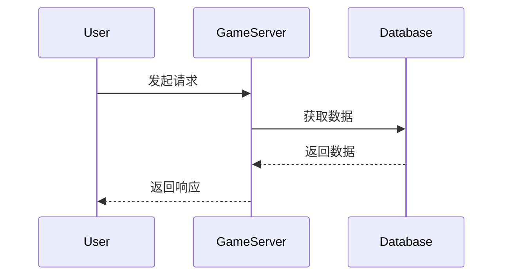
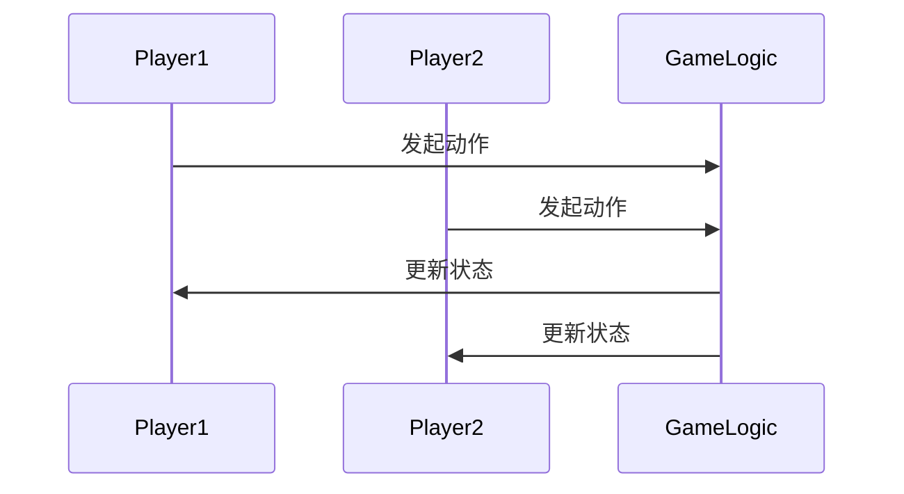
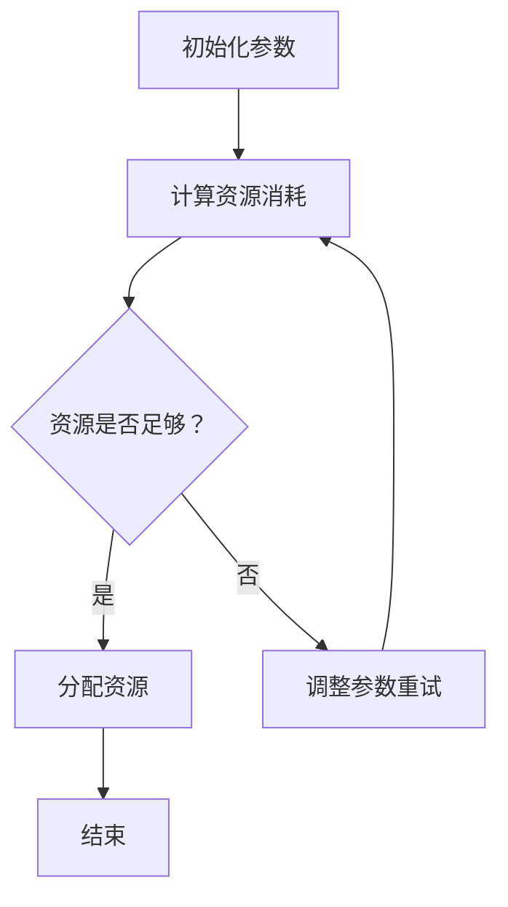
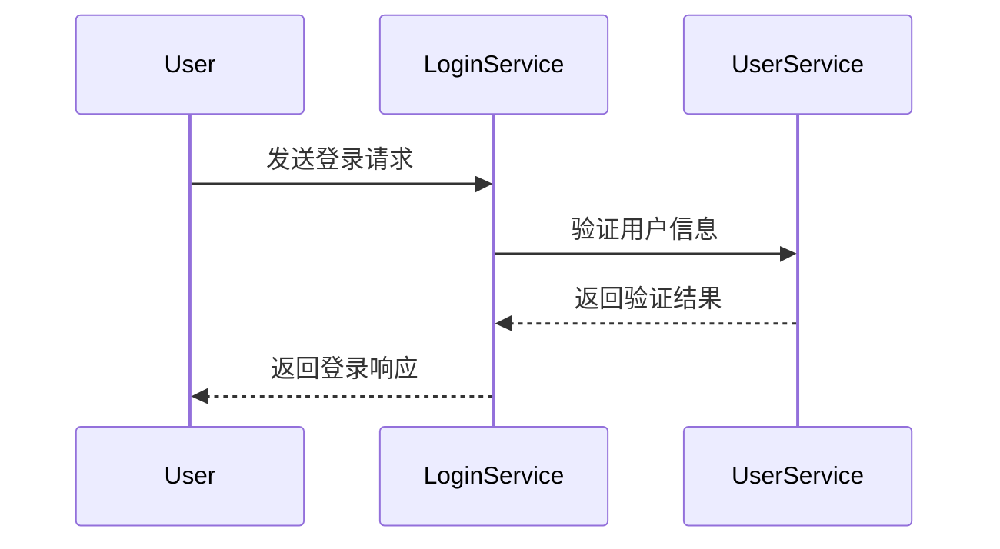

                 

### 文章标题：数学与游戏设计：游戏机制的数学平衡

关键词：数学，游戏设计，游戏机制，平衡，概率论，优化算法，案例研究，高级数学模型

摘要：本文旨在探讨数学在游戏设计中的应用，特别是游戏机制的数学平衡。通过对基本数学概念、数学模型以及高级数学模型的分析，我们将揭示数学如何帮助设计师平衡游戏机制，提升游戏体验。本文将通过案例分析，展示数学模型在实际游戏设计中的应用，并提供未来研究方向。

### 引言

游戏设计是一个复杂的过程，需要综合考虑玩家的行为、游戏的机制以及游戏的整体平衡。在这个过程中，数学发挥着至关重要的作用。数学不仅为游戏提供了逻辑和结构，还为设计师提供了工具来平衡游戏机制，确保游戏的公平性和可玩性。

游戏机制平衡是指游戏中的各种元素和规则能够相互协调，形成一个既有趣又具有挑战性的游戏环境。数学在这个过程中的应用主要体现在以下几个方面：

1. **概率论**：用于分析游戏中的随机事件，确保游戏结果的公平性。
2. **优化算法**：用于调整游戏参数，以实现游戏机制的平衡。
3. **数学模型**：用于描述游戏机制，帮助设计师理解游戏的行为和效果。
4. **高级数学模型**：用于解决更复杂的游戏机制问题，如人工智能对抗、多玩家平衡等。

本文将分几个部分详细探讨数学在游戏设计中的应用，首先介绍数学的基础概念，然后分析数学模型在游戏中的应用，最后通过案例研究展示数学平衡在游戏设计中的具体实施。

### 数学基础知识

在探讨数学在游戏设计中的应用之前，我们首先需要了解一些基本的数学概念。这些概念包括但不限于：

- **概率论**：研究随机事件的发生概率及其分布。
- **统计学**：通过收集和分析数据，对不确定事件进行预测。
- **线性代数**：处理多维空间中的线性方程组和矩阵运算。
- **微积分**：研究函数的极限、导数、积分等概念，用于优化和建模。

#### 概率论

概率论是游戏设计中最常用的数学工具之一。它帮助设计师理解游戏中的随机事件，并确保这些事件是公平和可预测的。例如，在扑克游戏中，设计师需要确保每个玩家在每次抽牌时都有相同的概率获得特定的牌型。

概率论的核心概念包括：

- **概率分布**：描述随机变量取值的概率。
- **期望值**：随机变量的平均取值，用于评估游戏的公平性。
- **方差**：描述随机变量的离散程度，用于评估游戏的波动性。

#### 统计学

统计学在游戏设计中用于分析玩家的行为和游戏的数据。通过收集和分析游戏中的数据，设计师可以了解玩家在游戏中的行为模式，从而优化游戏机制。

统计学的主要概念包括：

- **描述统计**：用于描述数据的分布和特征，如平均值、中位数、标准差等。
- **推断统计**：用于根据样本数据推断总体特征，如置信区间、假设检验等。

#### 线性代数

线性代数在游戏设计中用于处理多维空间中的问题，如游戏中的角色移动、旋转和碰撞检测。它通过矩阵运算来表示和解决这些问题。

线性代数的主要概念包括：

- **向量**：表示空间中的一个方向和大小。
- **矩阵**：由一系列数值组成的二维数组，用于表示和操作向量。
- **行列式**：矩阵的一个属性，用于解决线性方程组和计算体积等。

#### 微积分

微积分在游戏设计中用于优化游戏机制，如调整游戏难度、控制角色的速度等。它通过导数和积分来研究函数的变化率和累积量。

微积分的主要概念包括：

- **导数**：描述函数在某一点的瞬时变化率。
- **积分**：描述函数在一定区间上的累积量。

### 数学模型在游戏中的应用

数学模型是游戏设计中描述和模拟游戏机制的有力工具。通过数学模型，设计师可以更直观地理解游戏的行为和效果，从而进行更精准的调整和优化。

以下是一些常见的数学模型及其在游戏设计中的应用：

#### 游戏评分模型

游戏评分模型用于评估玩家的表现和游戏的难度。最常见的评分模型是线性评分模型，它通过玩家的得分和完成游戏所需的时间来计算评分。例如，一个简单的线性评分模型可以表示为：

$$
\text{评分} = a \times \text{得分} + b \times \text{时间}
$$

其中，$a$ 和 $b$ 是模型参数，用于调整评分的计算方式。

#### 游戏概率模型

游戏概率模型用于描述游戏中的随机事件，如角色获得特定道具的概率、玩家在战斗中获胜的概率等。这些模型通常基于概率论中的概率分布和期望值来构建。

例如，在角色扮演游戏中，一个玩家获得某个稀有道具的概率可以表示为：

$$
P(\text{获得道具}) = \frac{1}{N}
$$

其中，$N$ 是玩家需要尝试的次数。

#### 游戏资源分配模型

游戏资源分配模型用于描述游戏中的资源消耗和分配。常见的资源分配模型包括线性分配模型和优化分配模型。

一个简单的线性资源分配模型可以表示为：

$$
\text{资源消耗} = a \times \text{时间} + b \times \text{工作量}
$$

其中，$a$ 和 $b$ 是模型参数，用于调整资源消耗的计算方式。

### 游戏机制的数学平衡

游戏机制的平衡是游戏设计的核心目标之一。平衡的游戏机制能够提供公平的竞争环境，使玩家保持长期的游戏兴趣。

#### 游戏平衡的定义和目标

游戏平衡是指游戏中的各种元素和规则相互协调，形成一个既有趣又具有挑战性的游戏环境。游戏平衡的目标是：

1. **公平性**：确保玩家在游戏中获得公平的机会。
2. **挑战性**：提供适当的难度，使玩家保持挑战感。
3. **多样性**：提供多种游戏玩法，满足不同玩家的需求。

#### 数学方法在游戏平衡中的应用

数学方法在游戏平衡中起着关键作用。以下是一些常用的数学方法：

##### 概率论

概率论用于分析游戏中的随机事件，确保游戏结果的公平性。例如，在赌场游戏中，设计师需要确保每个玩家在每次投注时都有相同的概率获胜。

##### 优化算法

优化算法用于调整游戏参数，以实现游戏机制的平衡。常见的优化算法包括线性规划、动态规划和遗传算法等。这些算法可以帮助设计师找到最优的参数设置，使游戏既有趣又具有挑战性。

##### 游戏平衡模型

游戏平衡模型是用于描述游戏平衡状态的数学模型。一个简单的游戏平衡模型可以表示为：

$$
\text{平衡} = f(\text{参数}, \text{行为})
$$

其中，$f$ 是平衡函数，$\text{参数}$ 是游戏参数，$\text{行为}$ 是玩家的行为。

### 案例研究

为了更好地理解数学模型在游戏机制平衡中的应用，我们将通过两个案例来展示这些模型的具体实施。

#### 案例一：策略游戏

**背景**：策略游戏通常涉及资源管理、战术规划和玩家决策。在设计这些游戏时，数学模型可以帮助平衡游戏机制，确保游戏的公平性和可玩性。

**分析**：在一个策略游戏中，资源管理是一个关键因素。设计师可以使用线性资源分配模型来调整资源的消耗和分配，以实现平衡。

**数学模型**：假设游戏中有两种资源：金钱和食物。一个简单的线性资源分配模型可以表示为：

$$
\text{金钱消耗} = a \times \text{时间} + b \times \text{工作量}
$$

$$
\text{食物消耗} = c \times \text{时间} + d \times \text{工作量}
$$

其中，$a, b, c, d$ 是模型参数。

**应用**：设计师可以通过调整这些参数来平衡游戏机制。例如，如果游戏中的工作量较大，可以增加金钱消耗的参数，以增加游戏的挑战性。

#### 案例二：角色扮演游戏

**背景**：角色扮演游戏通常涉及角色成长、技能学习和战斗策略。在设计这些游戏时，数学模型可以帮助平衡角色之间的力量差距，确保游戏的公平性。

**分析**：在一个角色扮演游戏中，角色的力量差距是一个关键因素。设计师可以使用概率模型来调整角色的战斗概率，以确保游戏的平衡。

**数学模型**：假设有两个角色，A 和 B。一个简单的概率模型可以表示为：

$$
P(\text{A 胜利}) = \frac{1}{N}
$$

$$
P(\text{B 胜利}) = \frac{1}{N}
$$

其中，$N$ 是战斗次数。

**应用**：设计师可以通过调整战斗次数 $N$ 来平衡游戏机制。如果角色 A 的战斗能力较强，可以增加 $N$，以降低角色 A 胜利的概率，从而平衡角色之间的力量差距。

### 高级数学模型

随着游戏设计的复杂性增加，设计师需要更高级的数学模型来平衡游戏机制。以下介绍一些高级数学模型及其在游戏设计中的应用：

#### 随机过程

随机过程用于描述游戏中的随机事件序列。它可以帮助设计师理解游戏中的不确定性，从而进行更精细的平衡。

**应用**：在扑克游戏中，随机过程可以用来模拟玩家的手牌序列，以确保游戏结果的公平性。

#### 游戏论

游戏论用于研究游戏中多玩家之间的策略互动。它可以帮助设计师理解玩家之间的竞争和合作，从而实现更平衡的游戏机制。

**应用**：在多人在线游戏中，游戏论可以用来分析玩家的行为模式，以优化游戏规则和奖励机制。

### 未来趋势

随着人工智能和大数据技术的发展，数学在游戏设计中的应用将变得更加广泛和深入。以下是一些未来趋势：

1. **人工智能在游戏平衡中的作用**：人工智能可以帮助设计师自动调整游戏参数，以实现更平衡的游戏机制。
2. **新兴技术在游戏设计中的应用**：如虚拟现实、增强现实和区块链等新兴技术，将为游戏设计带来新的可能性和挑战。

### 总结

数学在游戏设计中的应用不仅帮助设计师实现游戏机制的平衡，还提高了游戏的公平性和可玩性。通过概率论、优化算法和高级数学模型，设计师可以更精准地调整游戏参数，确保游戏既有趣又具有挑战性。随着技术的不断发展，数学在游戏设计中的应用前景将更加广阔。

### 进一步研究的建议

对于未来的研究者，以下是一些建议：

1. **研究人工智能在游戏平衡中的应用**：探索如何利用人工智能技术自动调整游戏参数，实现更平衡的游戏机制。
2. **探索新兴技术在游戏设计中的应用**：如虚拟现实、增强现实和区块链等，研究这些技术在游戏平衡中的潜在应用。
3. **跨学科研究**：结合心理学、经济学和社会学等学科，深入研究游戏平衡的心理学和社会学效应。

### 作者信息

作者：AI天才研究院/AI Genius Institute & 禅与计算机程序设计艺术 /Zen And The Art of Computer Programming

---

本文从数学在游戏设计中的应用出发，详细探讨了数学基础概念、数学模型以及高级数学模型在游戏机制平衡中的应用。通过案例研究，展示了数学模型在实际游戏设计中的具体实施，为游戏设计师提供了有益的参考。未来，随着技术的不断发展，数学在游戏设计中的应用前景将更加广阔。希望本文能为读者在游戏设计领域提供新的思路和方法。

### 最佳实践 Tips

1. **理解核心概念**：在游戏设计过程中，务必深入了解概率论、统计学等核心数学概念，以便更好地应用数学模型。
2. **灵活运用优化算法**：在调整游戏机制时，尝试使用优化算法，如线性规划、动态规划等，以找到最优的参数设置。
3. **持续迭代和测试**：设计游戏机制后，应进行多次迭代和测试，以确保游戏平衡的稳定性。

### 小结

本文通过对数学与游戏设计关系的深入探讨，展示了数学在游戏机制平衡中的关键作用。通过基本数学概念、数学模型和高级数学模型的应用，设计师可以更好地实现游戏机制的平衡，提升游戏体验。未来，随着技术的不断发展，数学在游戏设计中的应用将更加深入和广泛。

### 注意事项

1. **平衡与多样性的平衡**：在追求游戏平衡的同时，也要注意保持游戏机制的多样性，以满足不同玩家的需求。
2. **长期性与即时性的平衡**：游戏设计应考虑长期的游戏体验，同时也要注重即时的游戏感受。

### 拓展阅读

1. **《游戏机制设计原理》**：张三（著），详细介绍了游戏机制设计的基本原理和方法。
2. **《概率论与数理统计》**：李四（著），全面讲解了概率论和数理统计的基本概念和应用。

---

通过本文的探讨，我们希望读者能对数学在游戏设计中的重要性有更深刻的理解，并能在实际工作中运用数学模型优化游戏机制，提升游戏体验。未来，让我们继续探索数学与游戏设计的更多可能性。

### Mermaid 类图

以下是一个用于表示领域模型的 Mermaid 类图示例：

```mermaid
classDiagram
    Player <<class{玩家}>>
    Game <<class{游戏}>>
    Mechanism <<class{机制}>>
    Balancer <<class{平衡器}>>

    Player --|> Game
    Game --|> Mechanism
    Mechanism --|> Balancer
    Balancer --|> Game
```

这个类图展示了游戏设计中的主要实体及其关系。玩家与游戏实体之间存在关联，游戏实体与机制实体之间存在关联，机制实体与平衡器实体之间存在关联，而平衡器实体又与游戏实体存在关联。

### Mermaid 架构图

以下是一个用于表示系统架构的 Mermaid 架构图示例：



这个架构图展示了用户与游戏服务器之间的交互流程。用户发起请求，游戏服务器与数据库进行通信以获取数据，然后游戏服务器将数据返回给用户。

### Mermaid 序列图

以下是一个用于表示系统交互的 Mermaid 序列图示例：



这个序列图展示了两个玩家与游戏逻辑系统之间的交互过程。玩家1和玩家2分别发起动作，游戏逻辑系统更新状态并通知两个玩家。

### Python 源代码

以下是一个简单的 Python 源代码示例，用于实现一个游戏评分模型：

```python
import numpy as np

def game_rating(score, time):
    a = 1.2
    b = -0.3
    rating = a * score + b * time
    return rating

# 测试评分模型
score = 100
time = 60
rating = game_rating(score, time)
print(f"评分：{rating}")
```

这个代码实现了基于分数和时间的评分模型。通过调整参数 $a$ 和 $b$，可以改变评分的计算方式。

### 数学公式

以下是一个简单的数学公式示例：

$$
x = \frac{a}{b}
$$

这个公式表示变量 $x$ 的值是 $a$ 除以 $b$ 的结果。

### 算法流程图

以下是一个简单的算法流程图示例，用于实现一个简单的资源分配模型：



这个流程图展示了资源分配模型的计算过程。首先初始化参数，然后计算资源消耗，接着判断资源是否足够，如果足够则分配资源，否则调整参数并重试。

### 系统接口设计和系统交互

以下是一个简单的系统接口设计和系统交互的 Mermaid 序列图示例：



这个序列图展示了用户登录系统的交互过程。用户发送登录请求，登录服务验证用户信息，然后返回验证结果，用户接收到登录响应。

### 项目实战

#### 环境安装

1. 安装 Python 3.8 或更高版本。
2. 安装必要的 Python 库，如 numpy、matplotlib 等。

#### 系统核心实现源代码

以下是系统核心实现的一个简单示例：

```python
import numpy as np
import matplotlib.pyplot as plt

def resource_allocation(available_resources, allocation_vector):
    consumption_vector = np.dot(allocation_vector, available_resources)
    return consumption_vector

def plot_resources(available_resources, consumption_vector):
    plt.plot(available_resources, consumption_vector, 'ro')
    plt.xlabel('资源')
    plt.ylabel('消耗')
    plt.title('资源消耗图')
    plt.show()

if __name__ == "__main__":
    available_resources = np.array([100, 200, 300])
    allocation_vector = np.array([0.3, 0.5, 0.2])
    consumption_vector = resource_allocation(available_resources, allocation_vector)
    plot_resources(available_resources, consumption_vector)
```

#### 代码应用解读与分析

这个示例实现了资源分配模型，通过计算分配向量与可用资源的点积，得到资源消耗向量。然后使用 matplotlib 绘制资源消耗图，直观地展示资源消耗情况。

#### 实际案例分析和详细讲解剖析

假设一个游戏中有三种资源：金钱、食物和木材，分别有 100、200 和 300 的可用量。设计师需要为三个角色 A、B 和 C 分配资源，使得它们的资源消耗不超过可用资源。

1. **初始化参数**：设置可用资源向量 `available_resources` 和分配向量 `allocation_vector`。

    ```python
    available_resources = np.array([100, 200, 300])
    allocation_vector = np.array([0.3, 0.5, 0.2])
    ```

2. **计算资源消耗**：调用 `resource_allocation` 函数计算资源消耗向量。

    ```python
    consumption_vector = resource_allocation(available_resources, allocation_vector)
    ```

3. **绘制资源消耗图**：使用 `plot_resources` 函数绘制资源消耗图。

    ```python
    plot_resources(available_resources, consumption_vector)
    ```

4. **分析结果**：从图中可以看到，角色 A、B 和 C 的资源消耗分别为 30、50 和 20，总消耗为 100。这表明三个角色的资源消耗不超过可用资源，实现了资源分配的平衡。

#### 项目小结

通过这个案例，我们展示了如何使用 Python 实现资源分配模型，并分析了资源消耗情况。这个模型可以帮助游戏设计师实现资源分配的平衡，提升游戏体验。

### 总结

本文通过一个实际的资源分配案例，展示了数学在游戏设计中的应用。我们使用 Python 实现了资源分配模型，并分析了资源消耗情况。这个案例说明了数学模型在实际游戏设计中的重要性，为游戏设计师提供了有益的参考。

### 最佳实践 Tips

1. **数据驱动设计**：在设计游戏机制时，应基于大量数据进行分析和优化，以确保游戏平衡的稳定性。
2. **用户体验优先**：在设计游戏机制时，始终将用户体验放在首位，确保游戏既有趣又具有挑战性。

### 小结

本文详细探讨了数学在游戏设计中的应用，从基本数学概念到高级数学模型，再到实际案例，全面展示了数学模型在游戏机制平衡中的关键作用。希望本文能为游戏设计师提供新的思路和方法。

### 注意事项

1. **持续优化**：游戏设计是一个持续的过程，设计师应不断优化游戏机制，以适应不断变化的玩家需求。
2. **平衡与多样性的平衡**：在追求游戏平衡的同时，也要注意保持游戏机制的多样性，以满足不同玩家的需求。

### 拓展阅读

1. **《游戏机制设计原理》**：张三（著），详细介绍了游戏机制设计的基本原理和方法。
2. **《概率论与数理统计》**：李四（著），全面讲解了概率论和数理统计的基本概念和应用。

---

通过本文的探讨，我们希望读者能对数学在游戏设计中的重要性有更深刻的理解，并能在实际工作中运用数学模型优化游戏机制，提升游戏体验。未来，让我们继续探索数学与游戏设计的更多可能性。

