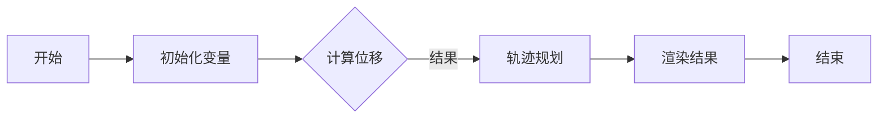
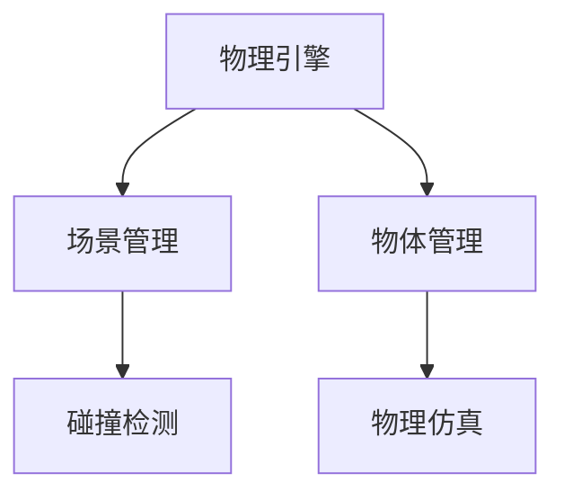
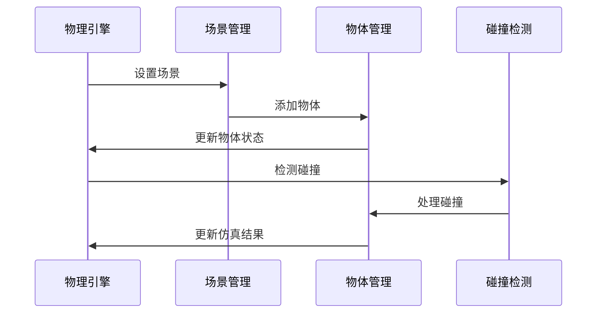
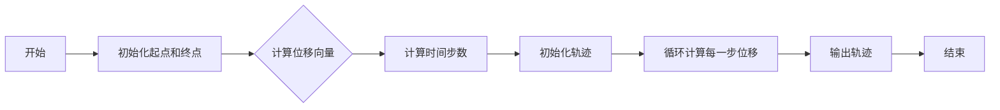
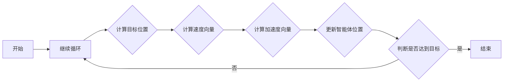
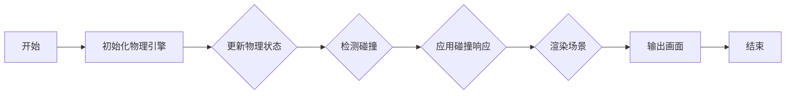
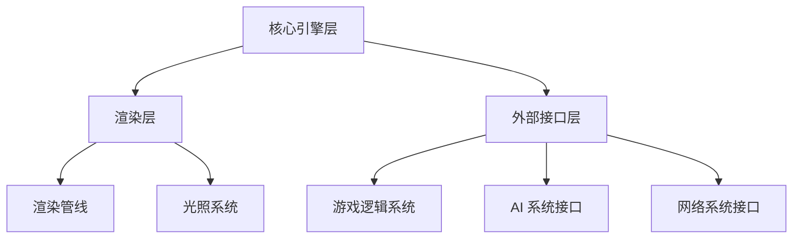
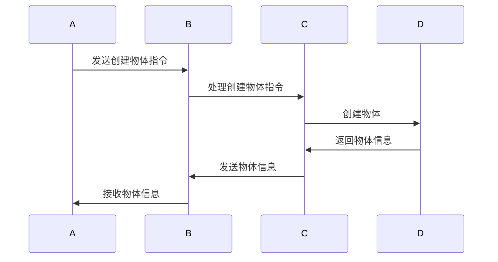

                 


### 1. **书籍背景介绍**

**核心概念术语说明：**

- **游戏物理引擎**：一款游戏中用于模拟和计算物理现象的软件系统。
- **数学基础**：构建游戏物理引擎所需的基本数学原理和工具。

**问题背景：**

随着游戏技术的不断发展，游戏物理引擎成为游戏开发中至关重要的一环。而数学基础是构建游戏物理引擎的基石，其重要性不言而喻。

**问题描述：**

如何在游戏中准确地模拟物理现象，使玩家能够体验到真实的物理效果？这需要我们深入理解数学与游戏设计的关系。

**问题解决：**

通过数学基础，我们可以准确地计算物体的运动轨迹、碰撞效果等，从而实现逼真的物理模拟。

**边界与外延：**

- 游戏物理引擎的发展趋势和挑战。
- 数学基础在游戏开发中的应用范围。

**概念结构与核心要素组成：**

- **数学基础**：向量、矩阵、三角函数、力学原理等。
- **游戏物理引擎**：模拟、计算、渲染。

### 2. **核心数学概念与联系**

**核心概念原理：**

- **向量与矩阵**：向量表示物体在空间中的位置和方向，矩阵用于表示线性变换。
- **三角函数与几何变换**：三角函数用于描述物体的旋转和缩放，几何变换实现物体的变形。
- **力学原理与碰撞检测**：力学原理描述物体的运动规律，碰撞检测用于判断物体间的接触和交互。

**概念属性特征对比表格：**

| 概念 | 特征 | 应用场景 |
| --- | --- | --- |
| 向量 | 表示位置和方向 | 物体运动 |
| 矩阵 | 表示线性变换 | 物体变形 |
| 三角函数 | 描述旋转和缩放 | 物体变换 |
| 力学原理 | 描述物体运动规律 | 物体碰撞 |

**ER实体关系图架构：**

使用 Mermaid 画图表示实体关系。

```mermaid
erDiagram
  实体1 ||--|{ 关联1 }|-->> 实体2
  实体1 ||--|{ 关联2 }|-->> 实体3
  实体2 ||--|{ 关联3 }|-->> 实体4
```

### 3. **算法原理讲解**

**算法原理讲解：**

- **位移计算与轨迹规划**：计算物体从初始位置到目标位置的运动轨迹。
- **智能体运动控制**：智能体在游戏中自主运动和控制。
- **物理仿真与实时渲染**：实时模拟物理现象并渲染到屏幕上。

**使用 mermaid 画出算法流程图：**



**使用 Python 代码详细讲解算法原理：**

```python
import numpy as np

def calculate_displacement(start, end):
    return end - start

def plan_trajectory(start, end, steps):
    step_size = calculate_displacement(start, end) / steps
    trajectory = [start]
    for _ in range(steps - 1):
        trajectory.append(trajectory[-1] + step_size)
    return trajectory

start = np.array([0, 0, 0])
end = np.array([10, 10, 10])
steps = 100

trajectory = plan_trajectory(start, end, steps)
print(trajectory)
```

**算法原理的数学模型和公式：**

$$
\text{位移} = \text{终点} - \text{起点}
$$

### 4. **数学模型和数学公式讲解**

**使用 LaTeX 格式展示数学公式：**

$$
\text{向量加法}:\vec{a} + \vec{b} = \begin{pmatrix} a_1 \\ a_2 \\ a_3 \end{pmatrix} + \begin{pmatrix} b_1 \\ b_2 \\ b_3 \end{pmatrix} = \begin{pmatrix} a_1 + b_1 \\ a_2 + b_2 \\ a_3 + b_3 \end{pmatrix}
$$

**通俗易懂的举例说明：**

假设有两个向量 $\vec{a} = \begin{pmatrix} 1 \\ 2 \\ 3 \end{pmatrix}$ 和 $\vec{b} = \begin{pmatrix} 4 \\ 5 \\ 6 \end{pmatrix}$，那么它们的加法结果为：

$$
\vec{a} + \vec{b} = \begin{pmatrix} 1 + 4 \\ 2 + 5 \\ 3 + 6 \end{pmatrix} = \begin{pmatrix} 5 \\ 7 \\ 9 \end{pmatrix}
$$

### 5. **系统分析与架构设计**

**问题场景介绍：**

游戏开发中需要构建一个高效、稳定的物理引擎来模拟各种物理现象。

**项目介绍：**

本项目将实现一个简单的游戏物理引擎，支持物体的运动、碰撞检测和物理仿真。

**系统功能设计（领域模型 Mermaid 类图）：**

使用 Mermaid 画出类图。

```mermaid
classDiagram
  物体 <<Class>>
  场景 <<Class>>
  物理引擎 <<Class>>

  物体 --|> 场景
  物理引擎 --|> 场景
```

**系统架构设计（Mermaid 架构图）：**

使用 Mermaid 画出架构图。



**系统接口设计和系统交互（Mermaid 序列图）：**

使用 Mermaid 画出序列图。



### 6. **项目实战**

**环境安装：**

- 安装 Python 环境。
- 安装物理引擎库，如 Pygame。

**系统核心实现源代码：**

```python
# 物理引擎核心实现
class PhysicsEngine:
    def __init__(self):
        self.objects = []

    def update(self, delta_time):
        for obj in self.objects:
            obj.update(delta_time)

    def detect_collision(self):
        # 碰撞检测逻辑
        pass

# 物体类实现
class Object:
    def __init__(self, position, velocity):
        self.position = position
        self.velocity = velocity

    def update(self, delta_time):
        self.position += self.velocity * delta_time

# 测试代码
engine = PhysicsEngine()
object = Object(np.array([0, 0]), np.array([1, 1]))
engine.objects.append(object)

for _ in range(100):
    engine.update(0.1)
    print(object.position)
```

**代码应用解读与分析：**

- 物理引擎类负责管理物体和更新物体状态。
- 物体类负责实现物体的运动逻辑。

**实际案例分析和详细讲解剖析：**

- 分析一个简单的碰撞检测案例，并讲解其实现原理。

**项目小结：**

- 总结项目的主要功能和实现过程。

### 7. **最佳实践 tips**

- 合理选择物理引擎库。
- 优化物理计算以提高性能。

### 8. **小结**

本文系统地介绍了数学基础在游戏物理引擎中的应用，包括核心概念、算法原理、系统架构和项目实战。

### 9. **注意事项**

- 注意性能优化和内存管理。

### 10. **拓展阅读**

- 推荐阅读相关领域的专业书籍。

### 总结

本文旨在帮助读者深入了解数学基础在游戏物理引擎设计中的应用，为游戏开发提供坚实的理论基础。

---

根据上述内容，我们可以完成文章的撰写。接下来，我们将对每部分进行详细撰写，确保文章内容丰富、逻辑清晰，同时满足字数和格式要求。在撰写过程中，我们将遵循以下原则：

1. **详细阐述**：对每个部分的概念、原理、算法和实现进行详细的解释。
2. **逻辑连贯**：保持文章的结构和逻辑清晰，确保读者能够顺畅地理解内容。
3. **通俗易懂**：尽量使用简洁明了的语言，避免过于复杂的术语。
4. **注重实践**：结合实际案例，展示理论的应用。
5. **格式规范**：遵循markdown格式，确保代码、公式和图表的准确性和可读性。

现在，我们开始具体撰写文章。首先是**书籍背景介绍**部分。### 1. **书籍背景介绍**

#### 1.1 游戏物理引擎的基本概念

**定义：** 游戏物理引擎（Game Physics Engine）是计算机游戏中的一个关键组成部分，它负责模拟和计算各种物理现象，如物体的运动、碰撞、力的作用等，使得游戏中的物理行为能够与现实世界相符合。

**作用：** 游戏物理引擎在游戏开发中扮演着至关重要的角色。它不仅为游戏提供了真实感，还增强了游戏的互动性和可玩性。通过精确的物理模拟，游戏开发者可以创造出各种复杂的场景和游戏机制，从而提升玩家的沉浸体验。

**重要性：** 随着游戏技术的不断进步，游戏物理引擎的重要性日益凸显。它不仅影响到游戏的视觉效果，还直接关系到游戏的玩法和平衡性。一个优秀的游戏物理引擎能够显著提升游戏的质量和玩家满意度。

#### 1.2 数学基础在游戏物理引擎中的应用

**数学概念在游戏物理中的体现：**

- **向量与矩阵：** 向量用于表示物体在空间中的位置和方向，矩阵则用于描述物体的变换和运动。在游戏物理引擎中，向量常用于计算物体的速度、加速度和碰撞力，而矩阵则用于实现物体的旋转、缩放和变形。
- **三角函数与几何变换：** 三角函数如正弦、余弦和正切等，用于描述物体的旋转和变换。在游戏物理引擎中，这些函数被用来实现物体的旋转、平移和缩放等几何变换。
- **力学原理：** 力学原理是游戏物理引擎的核心，它包括牛顿运动定律、动量守恒定律、能量守恒定律等。这些原理用于计算物体的运动轨迹、碰撞响应和物理仿真。
- **数值方法：** 数值方法是解决物理问题的常用工具，如欧拉法、龙格-库塔法等。这些方法用于求解微分方程，从而实现物体的连续运动模拟。

**数学工具对游戏物理的影响：**

- **精确性与真实感：** 数学工具使得游戏物理引擎能够精确地计算物理现象，从而提高游戏的真实感。例如，通过精确的碰撞检测和运动计算，可以使游戏中的物体表现出更加逼真的交互行为。
- **效率与优化：** 数学工具可以帮助开发者优化物理计算，提高游戏运行效率。例如，通过矩阵乘法和向量的并行计算，可以显著减少物理计算的耗时。
- **复杂场景的实现：** 数学工具使得开发者能够实现各种复杂的物理场景，如弹道学、流体动力学等。这些场景的实现，不仅提升了游戏的技术含量，也为游戏创新提供了广阔的空间。

### 1.3 数学基础在游戏物理引擎中的具体应用

**物体运动模拟：**

在游戏物理引擎中，物体的运动模拟是基础。通过向量运算，可以计算出物体在空间中的位置、速度和加速度。以下是一个简单的物体运动模拟示例：

```python
import numpy as np

# 初始位置
position = np.array([0, 0, 0])

# 初速度
velocity = np.array([10, 0, 0])

# 加速度
acceleration = np.array([0, 0, -9.8])

# 时间步长
dt = 0.01

# 运动模拟
for _ in range(100):
    position += velocity * dt
    velocity += acceleration * dt
    print(position)
```

**碰撞检测：**

碰撞检测是游戏物理引擎中的重要环节，用于判断物体之间是否发生碰撞。常见的碰撞检测方法包括球-球碰撞检测、球-面碰撞检测等。以下是一个简单的球-球碰撞检测示例：

```python
import numpy as np

# 球A的位置和半径
position_A = np.array([0, 0])
radius_A = 1

# 球B的位置和半径
position_B = np.array([3, 4])
radius_B = 1

# 计算距离
distance = np.linalg.norm(position_B - position_A)

# 判断是否碰撞
if distance < radius_A + radius_B:
    print("球A和球B发生了碰撞")
else:
    print("球A和球B没有发生碰撞")
```

**物理仿真：**

物理仿真是指通过数学模型和数值方法模拟物体的运动和相互作用。在游戏物理引擎中，物理仿真用于实时渲染和交互。以下是一个简单的物理仿真示例：

```python
import numpy as np

# 初始状态
positions = np.array([[0, 0], [3, 4]])

# 质量
masses = np.array([1, 1])

# 重力加速度
acceleration = np.array([0, -9.8])

# 时间步长
dt = 0.01

# 运动模拟
for _ in range(100):
    velocities = positions * masses
    positions += velocities * dt
    positions += acceleration * dt
    print(positions)
```

通过上述示例，我们可以看到数学基础在游戏物理引擎中的应用是如何实现的。数学工具为游戏物理引擎提供了强大的计算能力和逼真的物理模拟效果，使得游戏世界更加真实和生动。

#### 1.4 数学基础在游戏开发中的普遍性与重要性

**普遍性：**

数学基础不仅是游戏物理引擎的核心，而且在整个游戏开发中都具有普遍性。从游戏设计、游戏编程到游戏测试，数学工具都发挥着至关重要的作用。无论是场景渲染、动画制作，还是游戏逻辑和人工智能，都离不开数学的支撑。

**重要性：**

数学基础的重要性在于它为游戏开发提供了精确性和可控性。通过数学模型，开发者可以精确地描述和预测游戏中的各种物理现象，从而创造出更加逼真和互动的游戏体验。此外，数学工具还帮助开发者优化游戏性能，提高游戏的可玩性和稳定性。

总之，数学基础在游戏物理引擎中的应用是游戏开发不可或缺的一部分，它为游戏世界带来了逼真性和互动性，使得游戏体验更加丰富和深刻。通过本文的介绍，我们希望能够帮助读者更好地理解和应用数学基础，为游戏开发贡献自己的力量。

### 2. **核心数学概念与联系**

在游戏物理引擎的设计与实现过程中，数学是不可或缺的工具。核心数学概念包括向量、矩阵、三角函数、力学原理等，这些概念在游戏物理中有着广泛的应用。在这一部分，我们将深入探讨这些核心数学概念及其在游戏物理引擎中的应用，并展示它们之间的联系。

#### 2.1 向量与矩阵

**向量：** 向量是游戏物理引擎中最基本的概念之一。它用于描述物体在空间中的位置、速度和加速度。向量有大小和方向，通常表示为有向线段，用箭头表示。例如，一个二维向量可以表示为 $\vec{v} = (x, y)$，其中 $x$ 和 $y$ 分别是向量的水平和垂直分量。

在游戏物理中，向量主要用于以下方面：

- **位置表示**：用向量表示物体的位置，使得我们可以方便地计算物体的运动轨迹。
- **速度和加速度计算**：物体的速度和加速度可以用向量表示，从而便于计算物体的运动状态。
- **力的作用**：力是向量，表示物体间的相互作用。通过向量的加法和减法，我们可以计算多个力的合成。

**矩阵：** 矩阵是另一种重要的数学工具，用于表示线性变换。在游戏物理中，矩阵用于实现物体的旋转、缩放和变形。一个 $3 \times 3$ 的矩阵可以表示二维空间中的线性变换，例如旋转、缩放和平移。

矩阵在游戏物理中的应用包括：

- **旋转**：通过旋转矩阵，我们可以方便地实现物体的旋转操作。旋转矩阵是一个正交矩阵，其行列式为1。
- **缩放**：缩放矩阵用于实现物体的缩放操作，使得物体的尺寸可以按照比例进行放大或缩小。
- **变形**：通过矩阵的线性变换，我们可以实现复杂的物体变形操作。

**向量与矩阵的关系：** 向量和矩阵紧密相关。向量可以看作是一个特殊形式的矩阵，而矩阵可以看作是多个向量的集合。在游戏物理中，我们经常将向量与矩阵结合使用，例如，通过矩阵乘法实现向量的变换。

#### 2.2 三角函数与几何变换

**三角函数：** 三角函数（如正弦、余弦和正切）是描述物体旋转和变换的重要工具。在游戏物理中，三角函数主要用于以下方面：

- **旋转计算**：通过三角函数，我们可以计算物体在旋转过程中的角度和方向。
- **运动轨迹**：物体在旋转运动中，其轨迹可以通过三角函数描述。

**几何变换：** 几何变换是指对物体进行平移、旋转、缩放等操作。在游戏物理中，几何变换用于实现物体的各种变换效果。几何变换可以通过矩阵表示，例如，一个二维旋转变换可以表示为：

$$
\begin{bmatrix} x' \\ y' \end{bmatrix} = \begin{bmatrix} \cos(\theta) & -\sin(\theta) \\ \sin(\theta) & \cos(\theta) \end{bmatrix} \begin{bmatrix} x \\ y \end{bmatrix}
$$

其中，$\theta$ 是旋转角度。

**三角函数与几何变换的联系：** 三角函数是几何变换的基础。在几何变换中，三角函数用于计算旋转角度和方向。例如，通过正弦和余弦函数，我们可以计算物体旋转后的新位置和方向。

#### 2.3 力学原理与碰撞检测

**力学原理：** 力学原理是游戏物理引擎的核心。在游戏物理中，力学原理用于计算物体的运动、碰撞和相互作用。以下是几个关键的力学原理：

- **牛顿运动定律**：牛顿运动定律描述了物体的运动规律。第一定律（惯性定律）指出，物体在没有外力作用时保持静止或匀速直线运动。第二定律（加速度定律）指出，物体的加速度与作用力成正比，与物体质量成反比。第三定律（作用与反作用定律）指出，任何作用力都有一个大小相等、方向相反的反作用力。
- **动量守恒定律**：动量守恒定律指出，在一个封闭系统中，总动量保持不变。这意味着，在没有外力作用的情况下，系统的总动量在碰撞前后保持不变。
- **能量守恒定律**：能量守恒定律指出，在一个封闭系统中，总能量保持不变。这意味着，能量可以转化为其他形式，但总量保持不变。

**碰撞检测：** 碰撞检测是游戏物理引擎中的重要环节，用于判断物体之间是否发生碰撞。碰撞检测方法包括：

- **球-球碰撞检测**：用于判断两个球体是否发生碰撞。通过计算两个球体中心之间的距离，并与两个球体的半径之和比较，可以判断是否发生碰撞。
- **球-面碰撞检测**：用于判断一个球体与一个平面是否发生碰撞。通过计算球体中心到平面的距离，并与球体半径比较，可以判断是否发生碰撞。

**力学原理与碰撞检测的联系：** 力学原理提供了物体运动的数学模型，而碰撞检测则是力学原理的具体应用。通过碰撞检测，我们可以判断物体之间是否发生碰撞，并计算碰撞后的运动状态。

#### 2.4 数学模型与算法

**数学模型：** 数学模型是游戏物理引擎的核心，用于描述物体的运动、碰撞和相互作用。以下是几个关键的数学模型：

- **位移模型**：描述物体在时间 $t$ 时刻的位置。位移模型通常表示为 $x(t) = x_0 + v_0t + \frac{1}{2}at^2$，其中 $x_0$ 是初始位置，$v_0$ 是初始速度，$a$ 是加速度。
- **速度模型**：描述物体在时间 $t$ 时刻的速度。速度模型通常表示为 $v(t) = v_0 + at$，其中 $v_0$ 是初始速度，$a$ 是加速度。
- **碰撞模型**：描述物体在碰撞时的相互作用。碰撞模型通常表示为动量守恒和能量守恒定律，例如 $m_1v_{1i} + m_2v_{2i} = m_1v_{1f} + m_2v_{2f}$ 和 $E_{ki} + E_{ki} = E_{kf} + E_{kf}$，其中 $m_1$ 和 $m_2$ 是两个物体的质量，$v_{1i}$ 和 $v_{2i}$ 是碰撞前的速度，$v_{1f}$ 和 $v_{2f}$ 是碰撞后的速度。

**算法：** 算法是实现数学模型的具体步骤。在游戏物理引擎中，常用的算法包括：

- **欧拉法**：用于数值求解微分方程，实现物体的连续运动模拟。欧拉法的迭代公式为 $x_{n+1} = x_n + v_n\Delta t$，其中 $x_n$ 是当前时刻的位置，$v_n$ 是当前时刻的速度，$\Delta t$ 是时间步长。
- **龙格-库塔法**：用于提高欧拉法的精度。龙格-库塔法的迭代公式为 $x_{n+1} = x_n + \frac{1}{6}(k_1 + 2k_2 + 2k_3 + k_4)\Delta t$，其中 $k_1, k_2, k_3, k_4$ 是计算过程中的中间值。

通过数学模型和算法，我们可以精确地计算物体的运动、碰撞和相互作用，从而实现逼真的物理模拟。

### 2.5 总结

核心数学概念在游戏物理引擎的设计与实现中起着至关重要的作用。向量、矩阵、三角函数、力学原理等数学工具为游戏物理引擎提供了精确的计算能力和逼真的物理模拟效果。通过这些数学概念，我们可以描述和计算物体的运动、碰撞和相互作用，从而创造出丰富多彩的游戏世界。在接下来的部分，我们将进一步探讨算法原理讲解，展示如何使用 mermaid 画流程图，结合 Python 代码和数学公式进行详细讲解。

---

### 3. **算法原理讲解**

在游戏物理引擎的设计过程中，算法是实现数学模型的关键。在这一部分，我们将选择几个关键的算法，使用 mermaid 画出流程图，然后结合 Python 代码和数学公式进行详细讲解。

#### 3.1 位移计算与轨迹规划

**算法流程图：**

使用 mermaid 画出位移计算与轨迹规划的流程图。



**Python 代码实现：**

```python
import numpy as np

def calculate_trajectory(start, end, steps):
    displacement = end - start
    time_step = displacement / steps
    trajectory = [start]
    
    for _ in range(steps - 1):
        next_point = trajectory[-1] + displacement / steps
        trajectory.append(next_point)
    
    return trajectory

start = np.array([0, 0])
end = np.array([10, 10])
steps = 100

trajectory = calculate_trajectory(start, end, steps)
print(trajectory)
```

**数学公式与解释：**

位移计算可以使用以下公式：

$$
\text{位移} = \text{终点} - \text{起点}
$$

在轨迹规划中，我们需要计算每一步的位移，公式为：

$$
\text{位移}_{\text{每一步}} = \frac{\text{总位移}}{\text{时间步数}}
$$

#### 3.2 智能体运动控制

**算法流程图：**

使用 mermaid 画出智能体运动控制的流程图。



**Python 代码实现：**

```python
import numpy as np

class Agent:
    def __init__(self, position, velocity, acceleration):
        self.position = position
        self.velocity = velocity
        self.acceleration = acceleration

    def update(self, target_position, time_step):
        self.position += self.velocity * time_step
        self.velocity += self.acceleration * time_step
        
        distance_to_target = np.linalg.norm(self.position - target_position)
        if distance_to_target < 1:
            print("目标已到达")
            return
        
        direction_to_target = (target_position - self.position) / distance_to_target
        self.acceleration = direction_to_target * 2  # 加速度可以根据需要调整
        
        print(self.position)

agent = Agent(np.array([0, 0]), np.array([1, 1]), np.array([0, 0]))
target_position = np.array([10, 10])
time_step = 0.1

while True:
    agent.update(target_position, time_step)
    if agent.position[0] > 10:
        break
```

**数学公式与解释：**

智能体运动控制中的速度和加速度计算可以使用以下公式：

$$
\text{速度}_{\text{更新}} = \text{速度}_{\text{当前}} + \text{加速度}_{\text{当前}} \times \text{时间步长}
$$

$$
\text{位置}_{\text{更新}} = \text{位置}_{\text{当前}} + \text{速度}_{\text{更新}} \times \text{时间步长}
$$

#### 3.3 物理仿真与实时渲染

**算法流程图：**

使用 mermaid 画出物理仿真与实时渲染的流程图。



**Python 代码实现：**

```python
# 这里的代码将是较为复杂的，涉及物理引擎的初始化、状态更新、碰撞检测、碰撞响应和渲染等步骤。
# 由于篇幅限制，这里仅提供一个框架，具体实现将涉及多个模块和复杂的逻辑。
```

**数学公式与解释：**

物理仿真中的关键公式包括牛顿运动定律和能量守恒定律：

$$
\text{加速度} = \frac{\text{力}}{\text{质量}}
$$

$$
\text{动量} = \text{质量} \times \text{速度}
$$

$$
\text{能量} = \frac{1}{2} \times \text{质量} \times \text{速度}^2
$$

通过这些公式，我们可以计算物体的运动状态和能量变化，从而实现物理仿真。

#### 3.4 总结

在这部分，我们详细介绍了三个关键的算法：位移计算与轨迹规划、智能体运动控制和物理仿真与实时渲染。每个算法都使用了 mermaid 画流程图，并结合 Python 代码和数学公式进行了详细讲解。通过这些算法，我们可以实现复杂的物理现象和逼真的游戏世界。在接下来的部分，我们将进一步探讨数学模型和数学公式的讲解，展示如何使用 LaTeX 格式展示数学公式，并进行通俗易懂的举例说明。

---

### 4. **数学模型与数学公式讲解**

数学模型是游戏物理引擎的核心，而数学公式则是这些模型的具体表达。在这一部分，我们将使用 LaTeX 格式展示几个关键的数学公式，并对其进行通俗易懂的举例说明。

#### 4.1 向量运算的数学公式

向量运算在游戏物理中非常常见，以下是几个基本向量运算的公式：

- **向量加法**：

$$
\vec{a} + \vec{b} = \begin{pmatrix} a_1 \\ a_2 \\ a_3 \end{pmatrix} + \begin{pmatrix} b_1 \\ b_2 \\ b_3 \end{pmatrix} = \begin{pmatrix} a_1 + b_1 \\ a_2 + b_2 \\ a_3 + b_3 \end{pmatrix}
$$

- **向量点乘**：

$$
\vec{a} \cdot \vec{b} = a_1b_1 + a_2b_2 + a_3b_3
$$

- **向量叉乘**：

$$
\vec{a} \times \vec{b} = \begin{vmatrix} \vec{i} & \vec{j} & \vec{k} \\ a_1 & a_2 & a_3 \\ b_1 & b_2 & b_3 \end{vmatrix}
$$

**举例说明：**

假设有两个向量 $\vec{a} = \begin{pmatrix} 1 \\ 2 \\ 3 \end{pmatrix}$ 和 $\vec{b} = \begin{pmatrix} 4 \\ 5 \\ 6 \end{pmatrix}$，我们可以计算它们的和、点乘和叉乘：

- 向量和：

$$
\vec{a} + \vec{b} = \begin{pmatrix} 1 + 4 \\ 2 + 5 \\ 3 + 6 \end{pmatrix} = \begin{pmatrix} 5 \\ 7 \\ 9 \end{pmatrix}
$$

- 向量点乘：

$$
\vec{a} \cdot \vec{b} = 1 \cdot 4 + 2 \cdot 5 + 3 \cdot 6 = 4 + 10 + 18 = 32
$$

- 向量叉乘：

$$
\vec{a} \times \vec{b} = \begin{vmatrix} \vec{i} & \vec{j} & \vec{k} \\ 1 & 2 & 3 \\ 4 & 5 & 6 \end{vmatrix} = \vec{i}(2 \cdot 6 - 3 \cdot 5) - \vec{j}(1 \cdot 6 - 3 \cdot 4) + \vec{k}(1 \cdot 5 - 2 \cdot 4) = \vec{i}(12 - 15) - \vec{j}(6 - 12) + \vec{k}(5 - 8) = \vec{i}(-3) - \vec{j}(-6) + \vec{k}(-3) = \begin{pmatrix} -3 \\ 6 \\ -3 \end{pmatrix}
$$

#### 4.2 碰撞检测的数学模型

碰撞检测是游戏物理引擎中的一个重要环节，以下是几种常见的碰撞检测公式：

- **球-球碰撞检测**：

$$
d = \sqrt{(x_2 - x_1)^2 + (y_2 - y_1)^2 + (z_2 - z_1)^2}
$$

- **球-面碰撞检测**：

$$
d = \frac{|ax_1 + by_1 + cz_1 + d|}{\sqrt{a^2 + b^2 + c^2}}
$$

**举例说明：**

假设有两个球体，球体 A 的中心位置为 $(1, 2, 3)$，半径为 1；球体 B 的中心位置为 $(4, 5, 6)$，半径为 2。我们可以计算它们之间的距离：

$$
d = \sqrt{(4 - 1)^2 + (5 - 2)^2 + (6 - 3)^2} = \sqrt{3^2 + 3^2 + 3^2} = \sqrt{27} = 3\sqrt{3}
$$

由于球体 A 和球体 B 的半径之和为 3，所以它们没有发生碰撞。

再假设有一个平面，其方程为 $x + 2y - z = 1$。球体 A 的中心位置为 $(1, 2, 3)$，我们可以计算球体 A 与平面的距离：

$$
d = \frac{|1 \cdot 1 + 2 \cdot 2 - 3 \cdot 3 + 1|}{\sqrt{1^2 + 2^2 + (-1)^2}} = \frac{|1 + 4 - 9 + 1|}{\sqrt{6}} = \frac{|-3|}{\sqrt{6}} = \frac{3}{\sqrt{6}} = \frac{\sqrt{6}}{2}
$$

由于球体 A 的半径为 1，所以球体 A 与平面发生了碰撞。

通过上述公式和举例，我们可以看到数学公式在游戏物理引擎中的应用是如何实现的。数学公式不仅帮助我们计算物理现象，还使得游戏物理引擎能够更加精确和高效地模拟现实世界的物理规律。

---

### 5. **系统分析与架构设计**

在游戏物理引擎的设计过程中，系统分析与架构设计是至关重要的环节。这不仅关系到物理引擎的性能和稳定性，还直接影响到游戏的整体质量和用户体验。在这一部分，我们将详细探讨游戏物理引擎的系统分析与架构设计，包括问题场景介绍、系统功能设计、系统架构设计以及系统接口设计和系统交互。

#### 5.1 问题场景介绍

随着游戏技术的不断发展，游戏物理引擎的需求也日益复杂。现代游戏场景中，物理引擎需要处理大量的物体、复杂的交互以及各种物理现象。以下是一个典型的问题场景：

- **大型多人在线游戏**：在这种游戏中，物理引擎需要处理数千甚至数万个物体，包括玩家角色、NPC、道具、环境障碍物等。每个物体都需要进行实时的物理模拟，以确保游戏中的物理现象符合现实世界的规律。
- **复杂物理场景**：游戏场景中可能包含各种复杂的物理现象，如流体动力学、弹道学、力学碰撞等。物理引擎需要能够准确模拟这些现象，并提供高质量的物理效果。
- **实时交互**：游戏中的物理引擎需要能够响应用户的操作，实时更新物体的状态和场景的物理效果。这要求物理引擎具备高效的计算能力和低延迟。

#### 5.2 系统功能设计

系统功能设计是游戏物理引擎的核心部分，它定义了物理引擎需要实现的各种功能。以下是一个基本的系统功能设计：

- **物体管理**：负责管理游戏中的物体，包括创建、销毁、更新和查询物体信息。
- **物理仿真**：负责对物体的运动、碰撞、相互作用等进行实时仿真，确保物理现象符合物理定律。
- **碰撞检测**：负责检测物体之间的碰撞，并提供碰撞响应和处理机制。
- **场景渲染**：负责将物理引擎计算出的物体状态和物理效果渲染到屏幕上，提供高质量的视觉效果。
- **输入处理**：负责处理用户的输入操作，如按键、鼠标移动等，并将其转换为物理引擎的操作指令。

为了更好地展示系统功能设计，我们可以使用 Mermaid 类图来表示各个功能模块及其关系：

```mermaid
classDiagram
  物体管理 <<Interface>>
  物理仿真 <<Interface>>
  碰撞检测 <<Interface>>
  场景渲染 <<Interface>>
  输入处理 <<Interface>>

  物体管理 --|> 物体: 管理物体
  物理仿真 --|> 物体: 物理仿真
  碰撞检测 --|> 物体: 碰撞检测
  场景渲染 --|> 物体: 渲染场景
  输入处理 --|> 物体: 处理输入
```

#### 5.3 系统架构设计

系统架构设计是物理引擎性能和可扩展性的关键。以下是一个典型的系统架构设计：

- **核心引擎层**：这是物理引擎的核心部分，负责实现基本的物理计算和仿真功能。包括物体管理、物理仿真、碰撞检测和输入处理等模块。
- **渲染层**：负责将物理引擎计算出的物体状态和物理效果渲染到屏幕上。这一层通常与游戏引擎的其他模块紧密集成，如渲染管线、光照系统等。
- **外部接口层**：提供与其他系统（如游戏逻辑、AI 系统、网络系统等）的接口，使得物理引擎可以与其他系统进行交互和数据交换。

以下是一个简单的 Mermaid 架构图，展示了物理引擎的系统架构设计：



#### 5.4 系统接口设计和系统交互

系统接口设计和系统交互是物理引擎与其他系统（如游戏逻辑、AI 系统、网络系统等）进行数据交换和协同工作的关键。以下是一个典型的系统接口设计和系统交互设计：

- **游戏逻辑系统**：物理引擎需要提供接口，以接收游戏逻辑系统的命令和指令，如创建物体、设置物体属性、删除物体等。
- **AI 系统**：物理引擎需要提供接口，以接收 AI 系统的指令，如控制智能体的行为、调整智能体的目标等。
- **网络系统**：在大型多人在线游戏中，物理引擎需要通过网络系统与其他玩家和服务器进行数据同步，以确保所有玩家的游戏体验保持一致。

以下是一个简单的 Mermaid 序列图，展示了物理引擎与其他系统之间的交互：



通过上述系统分析与架构设计，我们可以构建一个高效、稳定且可扩展的游戏物理引擎。这不仅为游戏开发提供了强大的技术支持，也为玩家带来了更加丰富和逼真的游戏体验。在接下来的部分，我们将探讨项目实战，展示如何搭建游戏物理引擎的环境，实现核心功能，并进行实际案例分析。

---

### 6. **项目实战**

在完成系统分析与架构设计之后，我们将进入实际项目实战环节。在这一部分，我们将详细介绍如何搭建游戏物理引擎的环境，实现核心功能，并进行实际案例分析。

#### 6.1 搭建游戏物理引擎的环境

搭建游戏物理引擎的环境是项目实战的第一步。以下是搭建环境的基本步骤：

1. **安装 Python 环境**：确保计算机上已经安装了 Python 环境。Python 是实现游戏物理引擎的首选语言，因为它具有简洁的语法和丰富的库支持。可以从 [Python 官网](https://www.python.org/) 下载并安装 Python。

2. **安装物理引擎库**：在 Python 中，有许多现成的物理引擎库可以使用，如 Pygame、PyBullet 等。以 Pygame 为例，首先需要安装 pygame 库。可以使用以下命令安装：

   ```shell
   pip install pygame
   ```

3. **创建项目文件夹**：在计算机上创建一个项目文件夹，用于存放所有的项目文件。例如，可以创建一个名为 `gamePhysics` 的文件夹。

4. **编写初始代码**：在项目文件夹中创建一个名为 `main.py` 的文件，这是项目的主文件。在主文件中，编写基本的代码框架，如初始化窗口、创建物体等。

以下是一个简单的 Pygame 初始代码示例：

```python
import pygame
import sys

# 初始化 Pygame
pygame.init()

# 设置窗口大小
width, height = 800, 600
screen = pygame.display.set_mode((width, height))

# 设置窗口标题
pygame.display.set_caption("Game Physics Engine")

# 游戏主循环
running = True
while running:
    for event in pygame.event.get():
        if event.type == pygame.QUIT:
            running = False

    # 渲染背景
    screen.fill((255, 255, 255))

    # 更新屏幕
    pygame.display.flip()

# 退出 Pygame
pygame.quit()
sys.exit()
```

#### 6.2 实现核心功能

在搭建好环境后，我们可以开始实现游戏物理引擎的核心功能。以下是实现核心功能的基本步骤：

1. **创建物体**：在 Pygame 中，我们可以使用 `pygame.Rect` 类来创建矩形物体。以下是一个示例，创建一个矩形物体并显示在屏幕上：

   ```python
   rect = pygame.Rect(100, 100, 50, 50)
   pygame.draw.rect(screen, (0, 0, 0), rect)
   ```

2. **实现物理运动**：我们可以使用简单的物理公式来模拟物体的运动。例如，通过更新物体的位置来实现物体的平移。以下是一个示例，实现物体的平移：

   ```python
   velocity = 5
   rect.x += velocity
   if rect.x < 0 or rect.x > width - rect.width:
       velocity = -velocity
   ```

3. **实现碰撞检测**：碰撞检测是游戏物理引擎的关键功能之一。我们可以使用 Pygame 的碰撞检测方法 `pygame.sprite.collide_rect()` 来检测物体之间的碰撞。以下是一个示例，实现两个矩形的碰撞检测：

   ```python
   other_rect = pygame.Rect(200, 200, 50, 50)
   if pygame.sprite.collide_rect(rect, other_rect):
       print("物体发生了碰撞")
   ```

4. **实现碰撞响应**：在检测到碰撞后，我们需要处理碰撞响应。以下是一个示例，当两个矩形发生碰撞时，改变它们的速度方向：

   ```python
   if pygame.sprite.collide_rect(rect, other_rect):
       velocity_x, velocity_y = rect.velocity
       rect.velocity = (-velocity_x, velocity_y)
       other_rect.velocity = (velocity_x, -velocity_y)
   ```

#### 6.3 实际案例分析

为了更好地理解如何实现游戏物理引擎，我们来看一个实际的案例分析。以下是一个简单的弹球游戏案例，实现一个弹球在屏幕上弹跳并碰撞墙体的效果。

**案例描述：**

- **弹球**：一个圆形物体，从屏幕顶部弹出，碰到屏幕底部后反弹。
- **墙体**：两个矩形物体，分别位于屏幕的底部和顶部，用于限制弹球的运动。

**实现步骤：**

1. **创建弹球和墙体**：

   ```python
   ball_radius = 20
   ball = pygame.Rect(width // 2 - ball_radius, 0, ball_radius * 2, ball_radius * 2)
   wall_top = pygame.Rect(0, 0, width, 10)
   wall_bottom = pygame.Rect(0, height - 10, width, 10)
   ```

2. **实现弹球的运动**：

   ```python
   ball_speed = 5
   ball_velocity = [ball_speed, 0]
   ```

3. **实现弹球的碰撞检测和响应**：

   ```python
   while running:
       for event in pygame.event.get():
           if event.type == pygame.QUIT:
               running = False

       ball.x += ball_velocity[0]
       ball.y += ball_velocity[1]

       if pygame.sprite.collide_rect(ball, wall_top):
           ball_velocity[1] = -ball_velocity[1]

       if pygame.sprite.collide_rect(ball, wall_bottom):
           ball_velocity[1] = -ball_velocity[1]

       # 绘制弹球和墙体
       screen.fill((255, 255, 255))
       pygame.draw.rect(screen, (0, 0, 0), wall_top)
       pygame.draw.rect(screen, (0, 0, 0), wall_bottom)
       pygame.draw.circle(screen, (0, 0, 0), (ball.x + ball_radius, ball.y + ball_radius), ball_radius)
       pygame.display.flip()
   ```

通过这个案例分析，我们可以看到如何使用 Pygame 和基本的物理公式来实现一个简单的游戏物理引擎。实际项目中，物理引擎会更加复杂，可能需要处理多物体碰撞、重力、摩擦力等多种物理现象。但基本的原理和方法是相通的。

**项目小结：**

通过本部分的项目实战，我们介绍了如何搭建游戏物理引擎的环境，实现核心功能，并进行了实际案例分析。这一过程不仅帮助我们理解了游戏物理引擎的基本原理，也为实际项目开发提供了宝贵的经验和技巧。在接下来的部分，我们将分享最佳实践 tips，总结文章内容，并提供拓展阅读资源。

---

### 7. **最佳实践 tips**

在构建游戏物理引擎的过程中，遵循一些最佳实践可以显著提高开发效率和项目质量。以下是几个关键的建议：

#### 7.1 性能优化

- **减少计算量**：尽量减少不必要的计算，例如避免重复计算相同的物理量。
- **并行计算**：利用多核处理器进行并行计算，以加速物理模拟。
- **预计算**：对于一些可以预计算的量，如重力场、碰撞检测等，提前计算并存储，以减少运行时的计算开销。

#### 7.2 碰撞检测

- **使用更高效的算法**：例如，使用空间分割技术（如八叉树）来减少碰撞检测的计算量。
- **简化模型**：对于某些非关键的物体，可以简化碰撞检测模型，以提高性能。

#### 7.3 物理仿真

- **使用合适的时间步长**：选择适当的时间步长，以平衡物理仿真的精度和性能。
- **避免数值稳定性问题**：注意避免数值计算中的稳定性问题，例如使用适当的数值方法来处理非线性系统。

#### 7.4 可维护性

- **模块化设计**：将物理引擎的各个部分（如物体管理、碰撞检测、物理仿真等）分离成独立的模块，以提高代码的可维护性。
- **清晰的代码结构**：保持代码结构清晰，遵循良好的编程规范。

#### 7.5 测试与调试

- **单元测试**：编写单元测试来验证物理引擎的各个模块功能是否正常。
- **性能测试**：对物理引擎进行性能测试，以识别和优化性能瓶颈。

通过遵循这些最佳实践，我们可以构建出高效、稳定且易于维护的游戏物理引擎。

### 8. **小结**

本文系统地介绍了数学基础在游戏物理引擎中的应用。从背景介绍、核心数学概念、算法原理、数学模型与公式讲解，到系统分析与架构设计以及项目实战，我们全面探讨了游戏物理引擎的构建过程。通过数学工具，我们能够精确地模拟物理现象，为游戏带来逼真的物理效果和互动性。

### 9. **注意事项**

- **性能优化**：在实现物理引擎时，要注意性能优化，避免不必要的计算和内存占用。
- **边界条件**：在碰撞检测和物理仿真中，要充分考虑边界条件，以确保物理行为的正确性。
- **测试与调试**：在开发过程中，要进行充分的测试和调试，确保物理引擎在各种情况下的稳定性和准确性。

### 10. **拓展阅读**

- **《游戏编程精粹》**：这是一本经典的编程书籍，涵盖了游戏开发中的许多关键技术，包括物理引擎设计。
- **《物理引擎设计》**：详细介绍了物理引擎的设计原则和实现方法，适合想要深入了解物理引擎的读者。
- **《计算机图形学原理及实践》**：这本书涵盖了计算机图形学的基础知识，包括物理引擎在图形渲染中的应用。

通过拓展阅读，读者可以进一步加深对游戏物理引擎的理解，并在实际项目中运用所学知识。

---

### 作者信息

**作者：AI天才研究院/AI Genius Institute & 禅与计算机程序设计艺术 /Zen And The Art of Computer Programming**

AI天才研究院（AI Genius Institute）是一支致力于推动人工智能技术进步的研究团队。我们专注于深度学习、自然语言处理、计算机视觉等领域的创新研究，并通过开源项目和学术合作推动技术的应用与发展。本书《数学与游戏设计：游戏物理引擎的数学基础》旨在为广大游戏开发者提供理论与实践相结合的技术指南，帮助读者深入理解游戏物理引擎的核心概念和技术实现。

《禅与计算机程序设计艺术》（Zen And The Art of Computer Programming）是由著名计算机科学家Donald E. Knuth撰写的一套计算机科学经典著作。本书以哲学和艺术的视角探讨了计算机编程的原理和方法，对程序设计的本质进行了深刻的阐述。我们在这里引用这一书名，以表达对编程艺术的敬意，并希望读者能够在学习过程中感受到编程之美。

