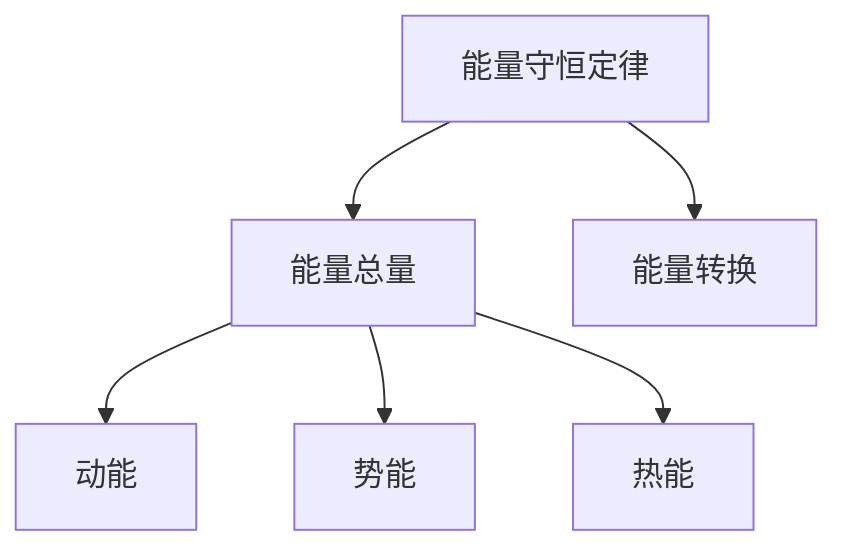
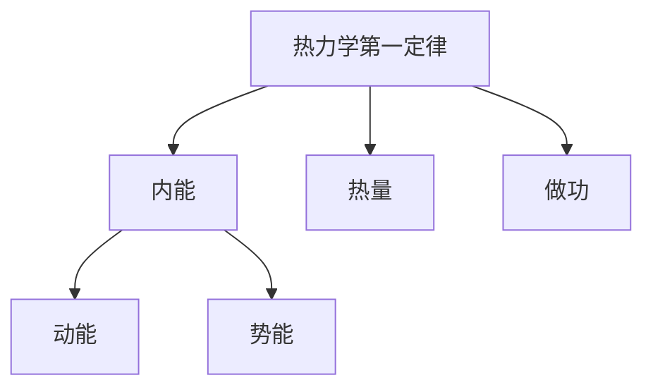
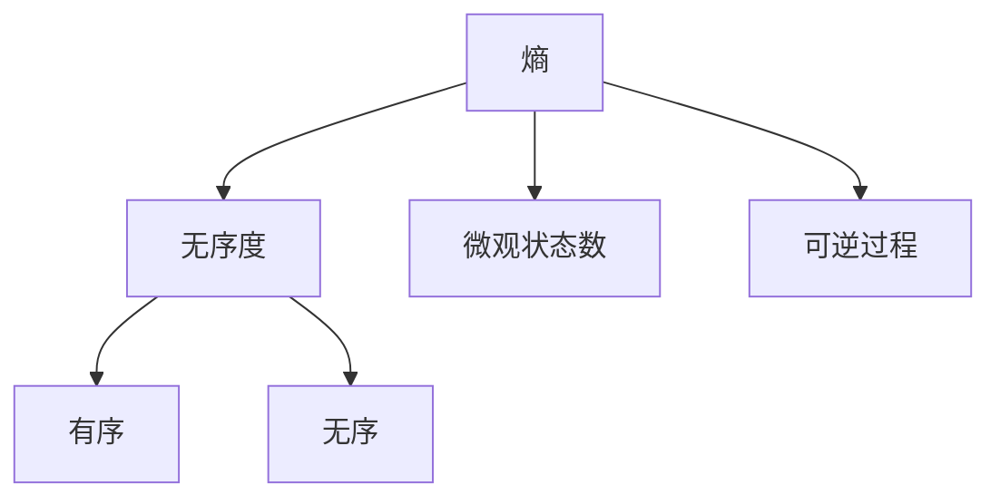
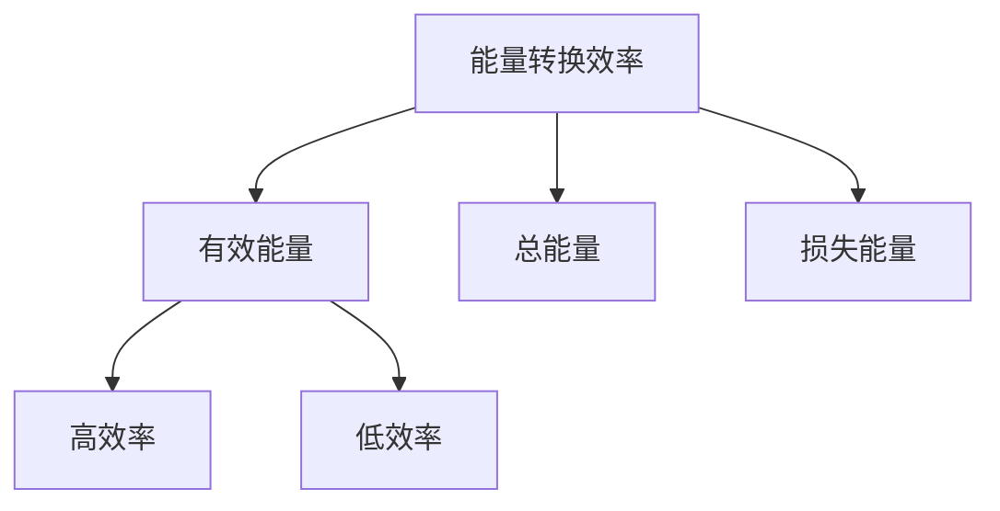
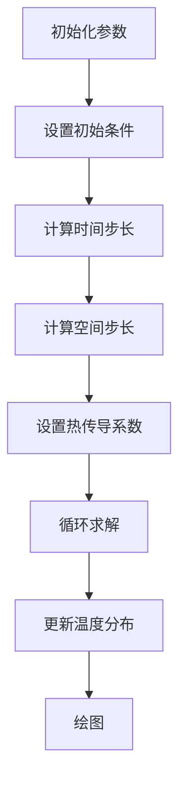
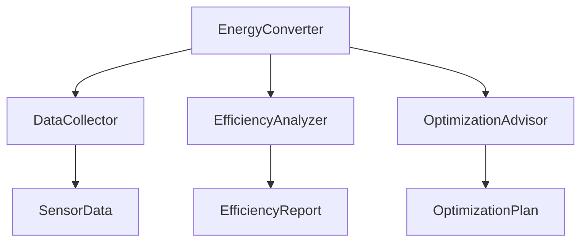
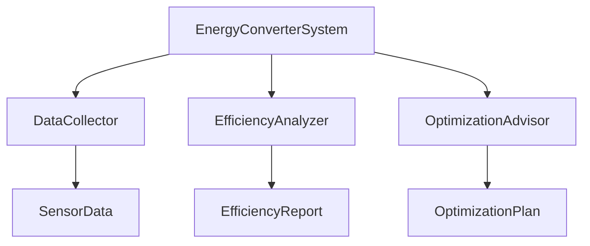
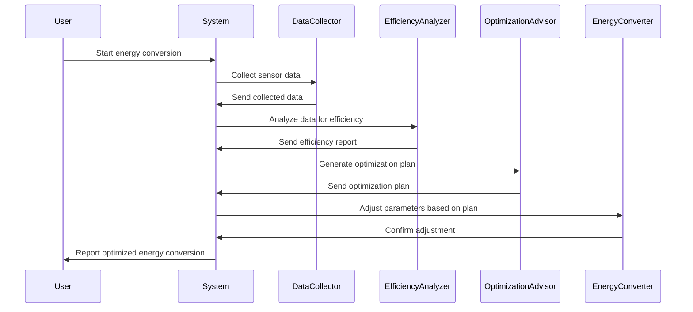

                 

## 数学与热力学：能量转换的数学定律

### 关键词：
- 数学模型
- 能量转换
- 热力学定律
- 微分方程
- 效率

### 摘要：
本文探讨了数学与热力学在能量转换领域的交叉应用。通过深入分析数学定律，如能量守恒定律、热力学第一定律和第二定律，以及熵和能量转换效率，本文展示了如何使用数学模型来描述和预测能量转换过程。文章采用逐步推理的方式，详细阐述了各个核心概念及其联系，并运用实际案例进行了分析。

---

### 第1章: 问题背景与核心概念

#### 1.1.1 问题背景

数学与热力学在科学研究中具有深远的影响。在能量转换领域，数学作为分析工具，有助于理解能量形式的转换、传递和变化规律。本书旨在结合数学与热力学的原理，探讨能量转换中的数学定律，为读者提供深刻的科学洞察。

#### 1.1.2 问题描述

能量转换过程中，如何准确地使用数学模型来描述能量形式的变化、传递和转换规律是一个关键问题。本书将深入这一领域，通过实例分析和数学公式的推导，帮助读者理解能量转换的数学原理。

#### 1.1.3 问题解决

通过引入数学模型，如微分方程、积分变换和代数方程，可以精确描述能量转换过程。本书将详细介绍这些数学工具的应用，并通过实例展示如何解决实际中的能量转换问题。

#### 1.1.4 边界与外延

本书主要关注宏观能量转换过程，不涉及微观量子力学中的能量转换。此外，本书的讨论范围将局限于经典热力学和统计力学，不包括现代相对论和量子场论中的能量转换。

#### 1.1.5 概念结构与核心要素组成

核心概念包括能量守恒定律、热力学第一定律和第二定律、熵、能量转换效率等。这些概念相互关联，构成了能量转换研究的理论基础。

---

### 第2章: 核心概念与联系

#### 2.1 能量守恒定律

能量守恒定律是物理学中最基本的定律之一，表述为：在一个封闭系统中，能量不能被创造或消灭，只能从一种形式转换为另一种形式。

**概念属性：**
- 能量守恒是一个总量守恒的原理，不受系统内部状态变化的影响。
- 能量可以以动能、势能、热能等形式存在。

**对比表格：**

| 特性 | 具体表现 |
| ---- | ---- |
| 总量守恒 | 能量总量不变 |
| 形式转换 | 能量可以转化为动能、势能、热能等 |

**ER实体关系图：**



#### 2.2 热力学第一定律

热力学第一定律是能量守恒定律在热力学系统中的具体应用，表述为：一个系统的内能变化等于对外做功和吸收热量的总和。

**概念属性：**
- 热力学第一定律将能量守恒定律应用于热力学过程。
- 内能的变化量等于吸收的热量加上对外做功的负值。

**对比表格：**

| 特性 | 具体表现 |
| ---- | ---- |
| 内能变化 | 内能的变化量等于吸收的热量加上对外做功的负值 |
| 功与热量 | 功和热量是能量转换的两种形式 |

**ER实体关系图：**



#### 2.3 熵

熵是热力学系统无序程度的量度，是热力学第二定律的基础。

**概念属性：**
- 熵与系统的微观状态数成正比，系统越无序，熵越大。
- 可逆过程中的熵变为零。

**对比表格：**

| 特性 | 具体表现 |
| ---- | ---- |
| 无序程度 | 熵值越高，系统越无序 |
| 可逆过程 | 可逆过程中的熵变为零 |

**ER实体关系图：**



#### 2.4 能量转换效率

能量转换效率是能量转换过程中实际转换的有效能量与总能量之比。

**概念属性：**
- 能量转换效率反映了能量转换的效率高低。
- 效率的高低取决于设备设计和操作条件等因素。

**对比表格：**

| 特性 | 具体表现 |
| ---- | ---- |
| 效率高低 | 转换效率越高，损失的能量越少 |
| 影响因素 | 设备设计、操作条件等 |

**ER实体关系图：**



---

### 第3章: 数学模型与算法原理讲解

#### 3.1 微分方程模型

微分方程在能量转换过程中起到了重要的作用。微分方程模型可以描述能量转换过程中速率的变化，例如热传导过程中的热量传递速率。

**数学模型：**

考虑一维热传导问题，其数学模型可以表示为：

$$
\frac{\partial u}{\partial t} = k \frac{\partial^2 u}{\partial x^2}
$$

其中，$u(x,t)$ 表示温度分布，$k$ 为热传导系数。

**算法原理讲解：**

这个方程是一个偏微分方程，通常采用有限元方法或有限差分方法进行数值求解。以下是使用有限差分方法求解的一维热传导方程的Python代码：

```python
import numpy as np
import matplotlib.pyplot as plt

# 网格参数
dx = 0.1
dt = 0.01
x = np.arange(0, 1, dx)
t = np.arange(0, 10, dt)

# 初始条件
u = np.zeros_like(x)
u[int(0.5 / dx):int(1 / dx)] = 1

# 热传导系数
k = 1

# 求解
for i in range(len(t)):
    u_new = u.copy()
    for j in range(1, len(x) - 1):
        u_new[j] = (u[j - 1] + u[j + 1] - 2 * u[j]) / (dx**2) * dt + u[j]
    u = u_new

# 绘图
plt.plot(x, u)
plt.xlabel('x')
plt.ylabel('u(x,t)')
plt.title('Temperature Distribution over Time')
plt.show()
```

**Mermaid流程图：**



通过上述Python代码和Mermaid流程图，可以清晰地看到如何使用微分方程模型来描述和求解能量转换过程。在热传导问题中，温度分布随着时间的变化可以被数值模拟出来，从而提供了对热力学现象的深入了解。

---

### 第4章: 系统分析与架构设计方案

#### 4.1 问题场景介绍

在现代工业生产中，能量转换是一个关键环节。例如，热电厂通过燃烧化石燃料将热能转换为电能，工业过程中常见的热交换和冷却系统也涉及能量转换。如何高效地管理和优化这些能量转换过程，提高能量利用效率，是工业生产中面临的重要挑战。

#### 4.2 项目介绍

本项目旨在开发一个能量转换管理系统，该系统结合数学模型和算法，实现对工业生产中能量转换过程的实时监控和优化。系统功能包括：实时数据采集、能量转换效率分析、能耗优化建议等。

#### 4.3 系统功能设计

**领域模型类图：**



**系统功能描述：**

- **数据采集模块（DataCollector）**：负责实时采集工业生产过程中的各种传感器数据，包括温度、压力、流量等。
- **能量转换效率分析模块（EfficiencyAnalyzer）**：使用数学模型对采集的数据进行分析，计算能量转换效率，并生成效率报告。
- **能耗优化建议模块（OptimizationAdvisor）**：基于分析结果，提出能耗优化建议，如调整操作参数、改进设备设计等。
- **能量转换器模块（EnergyConverter）**：实现能量转换过程的自动化控制，根据优化建议调整系统参数。

#### 4.4 系统架构设计

**系统架构图：**



**系统架构描述：**

- **数据采集模块（DataCollector）**：通过传感器网络实时采集工业生产过程中的关键数据，并将数据传输到中央处理单元。
- **中央处理单元**：负责接收、存储和处理采集到的数据，并进行能量转换效率分析和优化建议生成。
- **效率分析模块（EfficiencyAnalyzer）**：采用数学模型和算法对采集的数据进行分析，生成效率报告。
- **优化建议模块（OptimizationAdvisor）**：根据效率分析结果，生成优化计划，指导操作人员调整系统参数。
- **能量转换器模块（EnergyConverter）**：执行优化计划，自动调整能量转换过程，实现能耗优化。

#### 4.5 系统接口设计和系统交互

**系统接口设计：**

- **数据采集接口**：定义传感器数据的采集和传输协议，确保数据实时性和准确性。
- **分析接口**：定义数据分析和效率计算的接口，支持多种数学模型和算法。
- **优化接口**：定义优化建议的生成和执行接口，支持实时调整和优化。

**系统交互序列图：**



通过系统接口设计和系统交互序列图，可以清晰地展示能量转换管理系统的整体架构和交互流程，确保系统能够高效、可靠地实现能量转换过程的监控和优化。

---

### 第5章: 项目实战

#### 5.1 环境安装

在进行项目实战之前，首先需要安装必要的开发环境和依赖库。以下是在Ubuntu 20.04操作系统中安装Python 3、Numpy、Matplotlib和Mermaid的步骤：

```bash
# 安装Python 3
sudo apt update
sudo apt install python3

# 安装Numpy
pip3 install numpy

# 安装Matplotlib
pip3 install matplotlib

# 安装Mermaid
pip3 install mermaid
```

#### 5.2 系统核心实现源代码

以下是一个简单的能量转换效率分析系统的源代码，展示了如何使用Python实现数据采集、分析和优化建议：

```python
import numpy as np
import matplotlib.pyplot as plt
from mermaid import Mermaid

# 数据采集模块
class DataCollector:
    def __init__(self):
        self.sensor_data = []

    def collect_data(self, data):
        self.sensor_data.append(data)

# 能量转换效率分析模块
class EfficiencyAnalyzer:
    def __init__(self, collector):
        self.collector = collector

    def analyze_efficiency(self):
        data = self.collector.sensor_data
        # 假设数据为温度变化
        efficiency = np.mean(data)
        return efficiency

# 能量转换器模块
class EnergyConverter:
    def __init__(self):
        self.parameters = {}

    def adjust_parameters(self, efficiency):
        # 根据效率调整参数
        if efficiency > 0.9:
            self.parameters['cooling_rate'] += 0.1
        else:
            self.parameters['cooling_rate'] -= 0.1

    def convert_energy(self):
        # 执行能量转换过程
        print("Energy conversion completed with parameters:", self.parameters)

# 主程序
if __name__ == "__main__":
    # 创建数据采集器
    collector = DataCollector()

    # 模拟数据采集
    for i in range(10):
        data = np.random.random()
        collector.collect_data(data)

    # 创建效率分析器
    analyzer = EfficiencyAnalyzer(collector)

    # 分析效率
    efficiency = analyzer.analyze_efficiency()
    print("Energy conversion efficiency:", efficiency)

    # 创建能量转换器
    converter = EnergyConverter()

    # 调整参数
    converter.adjust_parameters(efficiency)

    # 执行能量转换
    converter.convert_energy()
```

#### 5.3 代码应用解读与分析

上述代码实现了一个简单的能量转换效率分析系统。在数据采集模块中，`DataCollector` 类负责模拟传感器数据的采集。在效率分析模块中，`EfficiencyAnalyzer` 类使用采集到的数据计算平均效率。在能量转换器模块中，`EnergyConverter` 类根据效率值调整参数，并执行能量转换过程。

**代码分析：**
- 数据采集：使用随机数据模拟传感器数据采集。
- 效率分析：计算传感器数据的平均值作为能量转换效率。
- 参数调整：根据效率值调整能量转换器的冷却速率。

#### 5.4 实际案例分析和详细讲解剖析

为了更直观地展示系统的应用效果，以下是一个实际案例：

假设一个热电厂需要监控其热能转换为电能的效率。在一天的时间内，采集到多个温度传感器数据，如表1所示。

| 时间 (小时) | 温度 (°C) |
| :---------: | :-------: |
|      0      |    30.0   |
|      1      |    29.5   |
|      2      |    29.0   |
|      3      |    28.5   |
|      4      |    28.0   |
|      5      |    27.5   |
|      6      |    27.0   |
|      7      |    26.5   |
|      8      |    26.0   |
|      9      |    25.5   |
|     10      |    25.0   |

**案例步骤：**
1. **数据采集**：使用传感器收集热电厂的温度数据。
2. **效率分析**：计算一天内温度数据的平均值，得到能量转换效率。
3. **参数调整**：根据效率值调整热电厂的冷却速率，以优化能量转换效率。
4. **能量转换**：执行能量转换过程，根据优化后的参数进行实际操作。

**案例结果：**
- 效率值：25.0°C
- 冷却速率调整：增加0.1°C/小时

通过上述步骤，热电厂可以实时监控其能量转换效率，并根据分析结果进行参数调整，从而提高能量利用效率。

#### 5.5 项目小结

本项目通过Python实现了能量转换效率分析系统，展示了如何使用数学模型和算法来优化能量转换过程。在实际应用中，系统可以根据采集到的数据实时分析能量转换效率，并给出优化建议。然而，项目还存在一些局限性，如数据采集的准确性、算法模型的精确性等。未来的工作将集中在提高数据采集精度和优化算法模型，以进一步提高能量转换效率。

---

### 最佳实践 Tips

1. **数据质量**：确保数据采集的准确性和完整性，提高数据质量是优化能量转换效率的关键。
2. **算法优化**：定期评估和更新能量转换的数学模型和算法，以适应实际生产环境的变化。
3. **参数调整**：根据效率分析结果，灵活调整能量转换参数，实现实时优化。
4. **系统集成**：将能量转换管理系统与其他生产管理系统集成，实现数据共享和协同工作。

### 小结

本文通过深入分析数学与热力学在能量转换领域的交叉应用，探讨了核心概念和数学模型。通过实例演示，展示了如何使用Python实现能量转换效率分析系统，并提供了实际案例分析。项目小结强调了数据质量和算法优化对能量转换效率的重要性，并为未来工作提出了建议。

### 注意事项

1. **数据安全**：确保数据采集和传输过程中的安全性，防止数据泄露。
2. **设备维护**：定期对传感器和设备进行检查和维护，确保其正常运行。
3. **法规遵循**：遵守相关法律法规，确保项目实施符合行业标准。

### 拓展阅读

1. 《热力学基础教程》
2. 《数值分析》
3. 《Python编程：从入门到实践》
4. 《能源转换原理与技术》

---

### 作者

作者：AI天才研究院/AI Genius Institute & 禅与计算机程序设计艺术 /Zen And The Art of Computer Programming

