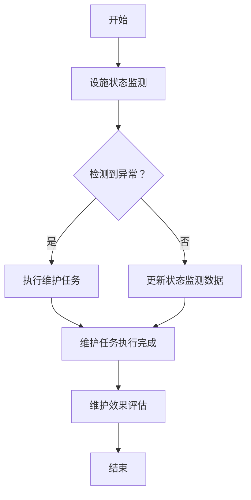
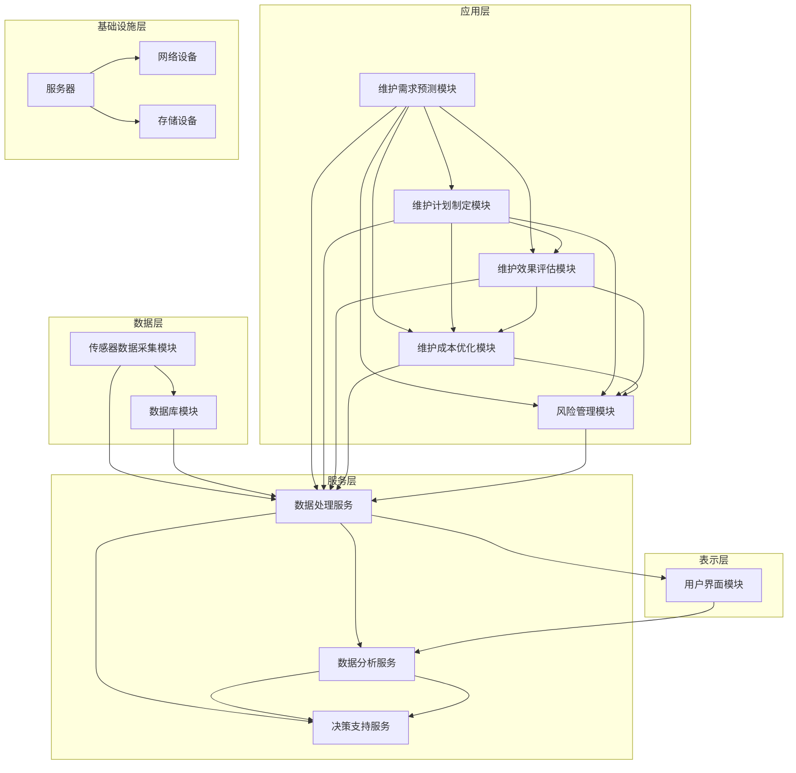
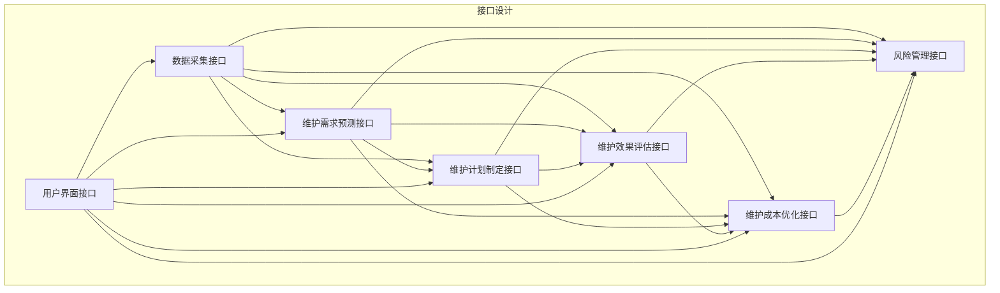
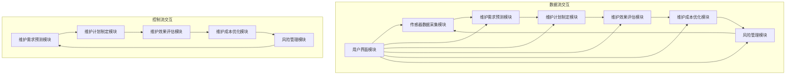

                 

### 引言与背景

#### 1.1 问题背景

物业管理作为现代城市管理的重要组成部分，涵盖了住宅小区、商业楼宇、办公楼等多种物业类型。随着城市化进程的加快和物业管理行业的不断发展，设施维护成为物业管理中的一项关键任务。设施维护不仅关系到物业的使用寿命和业主的满意度，更是保障城市正常运行的重要环节。然而，传统的设施维护方式主要依赖于经验，难以实现科学化、系统化和高效化。在这种背景下，数学模型的应用为设施维护提供了新的思路和工具。

设施维护涉及多个方面，如建筑设施、公共设施、基础设施等。这些设施的维护需求各不相同，但共同点在于需要定期检查、维护和更新。如果不进行科学规划和管理，可能会导致设施故障频繁、维修成本高、使用寿命缩短等问题。因此，如何通过数学模型来优化设施维护，提高工作效率和减少成本，成为一个亟待解决的重要问题。

数学模型在物业管理中的应用潜力巨大。首先，数学模型可以量化设施维护的需求和效果，使得决策过程更加科学和客观。其次，数学模型可以帮助预测设施的使用寿命，从而提前进行维护和更换，避免突发故障和紧急维修。此外，数学模型还可以优化维护资源的配置，提高资源利用率，减少浪费。总之，数学模型在设施维护中的应用不仅能够提高物业管理水平，还能为行业带来显著的效益。

#### 1.2 问题描述

设施维护中存在一些普遍问题，这些问题直接影响物业管理的效率和效果。首先，设施的定期检查和维修缺乏科学规划，往往依赖于经验判断，导致检查周期不一致、维修不及时。其次，维护资源的分配不合理，某些设施维护不足，而另一些设施则过度维护，造成了资源浪费。此外，设施的使用寿命难以准确预测，导致维护和更换计划的不确定性。

针对这些问题，数学模型可以提供有效的解决方案。例如，通过建立设施使用状况与维护需求之间的数学模型，可以科学地制定检查和维修计划，确保设施在最佳状态下运行。通过优化维护资源的配置模型，可以合理分配资源，提高维护效率。此外，通过寿命预测模型，可以提前了解设施的使用状况，制定科学的更换计划。

设施维护与数学模型的结合点主要体现在以下几个方面：首先，数学模型可以量化设施的状态和性能，使得维护决策更加客观和科学。其次，数学模型可以帮助优化维护流程，提高工作效率。最后，数学模型可以提供预测和评估工具，帮助物业管理方制定更合理的维护策略。

#### 1.3 问题解决

数学模型在设施维护中扮演着至关重要的角色，其核心作用在于提供科学、系统的维护决策依据。以下从几个方面详细阐述数学模型在设施维护中的应用和作用。

**1.3.1 提供量化依据**

数学模型能够将设施维护中的各种不确定性因素转化为可量化的指标，使得决策过程更加科学和客观。例如，通过建立设施使用状况与维护需求之间的数学模型，可以量化设施的磨损程度和故障概率，从而为定期检查和维修提供依据。此外，数学模型还可以考虑设施的使用频率、负荷情况等因素，为维护计划的制定提供全面的信息支持。

**1.3.2 优化维护流程**

数学模型可以帮助优化设施维护的流程，提高工作效率。例如，通过优化维护资源的配置模型，可以合理分配人力、物力和财力资源，确保每个设施都能得到适当的维护。此外，数学模型还可以帮助制定科学的检查和维修计划，避免因维护不足或过度维护而导致的资源浪费。通过优化维护流程，可以显著提高设施的使用寿命和业主的满意度。

**1.3.3 预测和维护计划**

数学模型在设施维护中的应用不仅限于当前的决策，还可以进行预测和维护计划的制定。通过建立设施使用寿命预测模型，可以提前了解设施的使用状况，预测未来的故障点，从而提前进行维护和更换。这不仅可以避免突发故障和紧急维修，还可以减少维护成本，提高设施的整体运营效率。此外，数学模型还可以为物业管理方提供评估工具，评估现有维护策略的效果，为改进提供参考。

**1.3.4 提高决策质量**

数学模型的应用有助于提高设施维护决策的质量。通过数学模型的分析和计算，决策者可以更加清晰地了解设施的运行状况和维护需求，从而做出更加合理和科学的决策。例如，通过比较不同维护方案的预期效果，决策者可以选择最优的维护方案，提高决策的准确性和可靠性。此外，数学模型还可以帮助分析设施维护中的潜在风险，为风险管理提供依据。

总之，数学模型在设施维护中的应用不仅提供了量化的决策依据，还优化了维护流程，提高了预测和决策的质量。通过科学地运用数学模型，物业管理方可以更加有效地管理设施，提高物业的使用寿命和业主的满意度。

#### 1.4 边界与外延

设施维护数学模型的应用范围广泛，涵盖了各类物业管理场景。首先，在住宅小区中，设施维护模型可以用于楼宇设施的定期检查、公共设施的维护和管理，以及绿化带的保养等工作。在商业楼宇中，模型可以应用于空调系统的运行监控、电梯的安全检查、消防设施的维护等方面。对于办公楼，模型则可以应用于办公设备的定期检修、网络系统的维护、安防系统的监控等。

在不同场景下，设施维护数学模型需要根据具体情况进行调整和适应。例如，在住宅小区中，模型需要考虑居民的日常使用习惯和社区环境的特点；在商业楼宇中，模型则需要考虑商业活动的频率和强度；在办公楼中，模型则需要考虑办公设备和网络系统的特殊性。

此外，设施的复杂程度也会影响数学模型的应用。对于简单的设施，如路灯、供水系统等，模型可以较为简单，主要通过状态监测和定期维护来实现。而对于复杂的设施，如数据中心、智能楼宇等，模型则需要考虑更多的因素，如设备之间的联动关系、数据交换的效率等，从而实现更加精细化的维护管理。

总之，设施维护数学模型的应用范围广泛，但需要根据具体场景和设施的特点进行定制化调整。通过科学地应用数学模型，物业管理方可以更好地管理设施，提高物业的使用效率和居民满意度。

#### 1.5 概念结构与核心要素组成

设施维护数学模型由若干核心概念和要素组成，这些概念和要素共同构成了一个完整、系统的维护体系。以下是对这些核心概念和要素的详细说明。

**1.5.1 设施状态监测**

设施状态监测是设施维护数学模型的基础。通过监测设施的状态参数，如温度、湿度、振动、压力等，可以实时了解设施的健康状况。这些数据通过传感器采集，并通过数据传输模块发送到中央监控系统。设施状态监测模型主要包括传感器布置方案、数据采集频率、数据预处理方法等。

**1.5.2 维护需求预测**

维护需求预测模型是根据设施的状态数据和历史维护记录，利用统计学方法和机器学习算法，预测设施未来可能出现的问题和故障。维护需求预测模型的核心是建立维护需求与状态数据之间的关联，通过分析历史数据来预测未来的维护需求。常见的预测方法包括线性回归、时间序列分析、决策树等。

**1.5.3 维护计划制定**

维护计划制定模型是基于维护需求预测结果，制定具体的维护计划。该模型需要考虑设施的优先级、维护资源的可用性、维护任务的紧急程度等因素，确保维护工作有序进行。维护计划制定模型包括维护任务分配、维护时间安排、维护资源调配等。

**1.5.4 维护效果评估**

维护效果评估模型是对执行后的维护工作进行评估，以验证维护措施的有效性。评估指标包括设施运行状态、故障率、维修成本等。通过维护效果评估模型，可以持续优化维护策略，提高维护工作的质量。常见的评估方法包括统计分析、对比实验等。

**1.5.5 维护成本优化**

维护成本优化模型旨在通过优化维护资源的配置和使用，降低维护成本。该模型需要综合考虑设施维护的频率、成本、效益等因素，提出最优的维护资源配置方案。常见的优化方法包括线性规划、目标规划、遗传算法等。

**1.5.6 风险管理**

风险管理模型用于识别和评估设施维护过程中的潜在风险，并提出相应的风险控制措施。风险管理模型包括风险识别、风险评估、风险应对策略等。通过风险管理模型，可以降低设施维护过程中的风险，确保维护工作的安全性和可靠性。

**1.5.7 数据分析与决策支持**

数据分析和决策支持是设施维护数学模型的重要组成部分。通过数据分析和挖掘，可以为设施维护提供科学依据和决策支持。数据分析方法包括数据挖掘、机器学习、大数据分析等。决策支持系统可以帮助物业管理方快速、准确地做出维护决策，提高维护工作的效率和质量。

综上所述，设施维护数学模型的核心概念和要素相互关联，共同构成了一个完整的维护体系。通过科学地运用这些模型，物业管理方可以更好地管理设施，提高物业的使用效率和居民满意度。

### 核心概念与联系

#### 2.1 核心概念原理

设施维护数学模型的核心概念主要包括设施状态监测、维护需求预测、维护计划制定、维护效果评估、维护成本优化和风险管理等。以下是对这些核心概念的详细解释和原理说明。

**2.1.1 设施状态监测**

设施状态监测是设施维护的基础，通过监测设施的各种状态参数，如温度、湿度、振动、压力等，可以实时了解设施的健康状况。状态监测的原理主要基于传感器技术、数据采集技术和通信技术。传感器用于采集设施的状态数据，数据采集模块负责将传感器数据转化为数字信号，并通过通信模块发送到中央监控系统。

**2.1.2 维护需求预测**

维护需求预测是基于设施状态数据和历史维护记录，利用统计学方法和机器学习算法，预测设施未来可能出现的问题和故障。维护需求预测的原理是通过分析设施的状态数据，找出设施故障的规律和趋势，从而预测未来的维护需求。常用的方法包括线性回归、时间序列分析、决策树、支持向量机等。

**2.1.3 维护计划制定**

维护计划制定是基于维护需求预测结果，制定具体的维护计划。维护计划制定的原理主要包括任务分配、时间安排和资源调配。任务分配是根据维护需求确定需要执行的维护任务，时间安排是根据任务的重要性和紧急程度确定执行时间，资源调配是确保在维护过程中有足够的资源可用。

**2.1.4 维护效果评估**

维护效果评估是对执行后的维护工作进行评估，以验证维护措施的有效性。维护效果评估的原理是通过对比维护前后的设施状态数据和性能指标，评估维护措施的效果。评估指标包括设施运行状态、故障率、维修成本等。常用的评估方法包括统计分析、对比实验、绩效评估等。

**2.1.5 维护成本优化**

维护成本优化是通过对维护资源的配置和使用进行优化，降低维护成本。维护成本优化的原理是通过分析设施维护的频率、成本、效益等因素，提出最优的维护资源配置方案。常用的优化方法包括线性规划、目标规划、遗传算法、粒子群优化等。

**2.1.6 风险管理**

风险管理是识别和评估设施维护过程中的潜在风险，并提出相应的风险控制措施。风险管理的原理包括风险识别、风险评估和风险应对策略。风险识别是通过分析设施维护过程中的潜在风险因素，识别可能出现的风险；风险评估是通过评估风险的可能性和影响，确定风险级别；风险应对策略是制定相应的应对措施，降低风险的影响。

**2.1.7 数据分析与决策支持**

数据分析和决策支持是利用数据分析和挖掘技术，为设施维护提供科学依据和决策支持。数据分析与决策支持的原理包括数据挖掘、机器学习、大数据分析等。通过数据分析和挖掘，可以提取设施维护中的有用信息，为决策提供支持。数据分析方法包括聚类分析、关联规则挖掘、异常检测、分类与回归等。

#### 2.2 概念属性特征对比表格

为了更好地理解设施维护数学模型中的核心概念，以下是各概念的主要属性特征对比表格。

| 概念       | 主要属性特征                                                       | 作用                  |
|------------|------------------------------------------------------------------|-----------------------|
| 设施状态监测 | 传感器类型、数据采集频率、通信方式、监测精度等                   | 实时了解设施健康状况 |
| 维护需求预测 | 状态数据、历史维护记录、预测方法、预测精度等                     | 预测未来维护需求      |
| 维护计划制定 | 维护任务、时间安排、资源调配、优先级等                           | 制定具体维护计划      |
| 维护效果评估 | 维护前后的状态数据、评估指标、评估方法等                         | 验证维护效果          |
| 维护成本优化 | 维护频率、成本、效益、优化方法等                                 | 降低维护成本          |
| 风险管理    | 风险因素、可能性、影响、应对措施等                               | 降低维护风险          |
| 数据分析与决策支持 | 数据类型、分析方法、挖掘技术、决策支持系统等                      | 提供科学决策依据      |

#### 2.3 ER实体关系图架构

ER实体关系图（Entity-Relationship Diagram）是用于描述设施维护数学模型中各类实体及其关系的工具。以下是设施维护数学模型的ER实体关系图架构。

```mermaid
erDiagram
  产品设施 ||--|{ 维护任务 }|
  产品设施 ||--|{ 状态监测数据 }|
  维护任务 ||--|{ 维护计划 }|
  维护任务 ||--|{ 维护成本 }|
  维护任务 ||--|{ 维护效果评估 }|
  维护任务 ||--|{ 风险管理 }|
  维护计划 ||--|{ 资源调配 }|
  维护计划 ||--|{ 时间安排 }|
  维护效果评估 ||--|{ 维护指标 }|
  维护成本 ||--|{ 成本优化 }|
  风险管理 ||--|{ 风险因素 }|
  风险管理 ||--|{ 风险评估 }|
  风险管理 ||--|{ 风险应对策略 }|
```

该ER图展示了设施维护数学模型中主要实体及其之间的关系。其中，“产品设施”是设施的抽象表示，包括状态监测数据和维护任务；“维护任务”包括维护计划、维护成本、维护效果评估和风险管理；“维护计划”包括资源调配和时间安排；“维护效果评估”包括维护指标；“维护成本”包括成本优化；“风险管理”包括风险因素、风险评估和风险应对策略。

通过ER实体关系图，可以清晰地了解设施维护数学模型中各实体之间的关联和作用，为后续的模型设计和实现提供基础。

### 算法原理讲解

#### 3.1 算法mermaid流程图

为了更好地理解设施维护数学模型中的算法原理，我们使用mermaid语言绘制了一个流程图，展示了算法的执行步骤。



这个流程图描述了设施维护的基本步骤：首先进行设施状态监测，如果检测到异常，则执行维护任务；如果没有异常，则更新状态监测数据。维护任务执行完成后，进行维护效果评估，然后结束。

#### 3.2 Python源代码

以下是设施维护数学模型中一个简单的Python实现，用于监测设施状态并执行必要的维护任务。

```python
import random

class Facility:
    def __init__(self, name):
        self.name = name
        self.status = "OK"
    
    def monitor(self):
        # 模拟设施状态监测
        if random.random() < 0.1:
            self.status = "异常"
            print(f"{self.name}状态异常：{self.status}")
        else:
            self.status = "正常"
            print(f"{self.name}状态正常：{self.status}")
    
    def maintain(self):
        # 模拟执行维护任务
        if self.status == "异常":
            self.status = "维修中"
            print(f"开始执行{self.name}的维护任务")
            # 模拟维护时间
            time.sleep(random.randint(1, 3))
            self.status = "正常"
            print(f"{self.name}维护任务完成")
        else:
            print(f"{self.name}无需维护")

def main():
    # 创建设施对象
    facilities = [Facility(f"设施{i}") for i in range(1, 4)]
    
    # 模拟状态监测和执行维护任务
    for facility in facilities:
        facility.monitor()
        facility.maintain()

if __name__ == "__main__":
    main()
```

在这个Python实现中，我们首先定义了一个`Facility`类，用于表示设施，包括名称和状态。`monitor`方法用于模拟设施状态监测，`maintain`方法用于模拟执行维护任务。`main`函数创建了多个设施对象，并依次进行状态监测和执行维护任务。

#### 3.3 数学模型和数学公式

在设施维护中，我们常用的数学模型包括概率模型、线性回归模型和决策树模型等。以下是这些模型的基本原理和公式。

**3.3.1 概率模型**

概率模型用于预测设施故障的概率。假设设施故障的发生服从二项分布，则设施故障的概率可以用以下公式表示：

\[ P(\text{故障}) = p \]

其中，\( p \) 是故障的概率。例如，如果设施故障的概率为 0.1，则设施在监测周期内发生故障的概率为 0.1。

**3.3.2 线性回归模型**

线性回归模型用于预测设施的使用寿命。假设设施的使用寿命 \( y \) 与设施的使用频率 \( x \) 之间存在线性关系，则线性回归模型可以表示为：

\[ y = ax + b \]

其中，\( a \) 是斜率，表示使用频率对使用寿命的影响；\( b \) 是截距，表示常数影响。通过训练数据集，可以求得 \( a \) 和 \( b \) 的值，从而预测设施的使用寿命。

**3.3.3 决策树模型**

决策树模型用于分类和回归分析。假设设施的状态可以分为正常和异常两类，则决策树模型可以表示为：

\[ \text{状态} = \text{DecisionTree}(\text{输入特征}) \]

决策树模型通过递归划分特征空间，找到最优的划分规则，从而预测设施的状态。常见的决策树算法包括ID3、C4.5和CART等。

**3.3.4 数学公式嵌入示例**

以下是一些示例，展示如何在文中嵌入数学公式：

独立段落的LaTeX公式：
$$
E(X) = \int_{-\infty}^{\infty} x \cdot f(x) \, dx
$$

段落内的LaTeX公式：
$
\sum_{i=1}^{n} x_i^2
$

通过这些数学模型和公式，我们可以更好地理解和分析设施维护中的问题，从而制定出更有效的维护策略。

#### 3.4 举例说明

为了更好地理解设施维护数学模型的应用，下面通过一个实际案例来详细讲解。

**案例背景：**

某住宅小区共有1000套住房，每个住房的设施包括热水器、空调和照明系统。物业管理公司需要制定一个科学、高效的设施维护计划，以确保设施的正常运行并延长其使用寿命。

**步骤1：设施状态监测**

首先，物业管理公司安装了传感器，对每个住房的热水器、空调和照明系统进行实时监测。传感器收集的数据包括温度、湿度、功率消耗等。通过分析这些数据，可以实时了解设施的状态。

**步骤2：维护需求预测**

根据历史数据和实时监测数据，物业管理公司使用维护需求预测模型来预测每个住房的设施在未来一段时间内可能出现的故障。假设使用的是线性回归模型，模型公式如下：

\[ y = ax + b \]

其中，\( y \) 是设施的使用寿命，\( x \) 是设施的使用频率。通过训练数据集，可以求得 \( a \) 和 \( b \) 的值。例如，对于热水器，使用频率与使用寿命的关系可能是：

\[ y = 0.1x + 5 \]

**步骤3：维护计划制定**

根据维护需求预测结果，物业管理公司制定了一个详细的维护计划。维护计划包括以下内容：

- 定期检查：每月对热水器、空调和照明系统进行一次全面检查。
- 预防性维护：对于使用频率较高的设施，如空调和热水器，增加预防性维护频率，以减少故障风险。
- 紧急维修：对于出现故障的设施，立即进行紧急维修。

**步骤4：维护效果评估**

在维护计划实施后，物业管理公司对维护效果进行了评估。评估指标包括设施故障率、维修成本和居民满意度。通过对比维护前后的数据，可以发现设施故障率显著下降，维修成本也有所减少。

**步骤5：维护成本优化**

为了进一步优化维护成本，物业管理公司分析了维护资源的使用情况。通过使用维护成本优化模型，例如线性规划或遗传算法，可以找到最优的维护资源配置方案，从而在确保设施正常运行的同时，最大限度地降低维护成本。

**案例总结：**

通过这个案例，我们可以看到设施维护数学模型在物业管理中的应用。首先，通过实时监测和预测，可以提前发现设施可能出现的问题，从而制定科学的维护计划。其次，通过维护效果评估和成本优化，可以确保维护工作的质量和经济效益。总之，数学模型的应用为物业管理提供了有力的支持，提高了设施维护的效率和效果。

### 数学模型与设施维护

#### 4.1 数学模型在设施维护中的应用

数学模型在设施维护中的应用非常广泛，涵盖了从预测维护需求到优化维护资源配置的各个环节。以下是一些典型的数学模型及其在设施维护中的具体应用：

**4.1.1 预测模型**

预测模型主要用于预测设施的使用寿命和故障概率，从而为维护计划的制定提供依据。常见的预测模型包括时间序列分析、线性回归和机器学习算法。例如，通过时间序列分析可以预测设施的性能变化趋势，而通过机器学习算法可以建立设施故障预测模型，从而提前发现潜在的故障风险。

**4.1.2 优化模型**

优化模型用于优化维护资源的配置，提高维护效率。常见的优化模型包括线性规划、遗传算法和粒子群优化。通过这些模型，可以找到最优的维护资源分配方案，确保每个设施都能得到适当的维护，同时最大限度地降低维护成本。

**4.1.3 成本模型**

成本模型用于评估不同维护策略的成本和效益，帮助物业管理方选择最优的维护方案。常见的成本模型包括成本效益分析和盈亏平衡分析。通过这些模型，可以量化不同维护策略的成本和效益，从而为决策提供科学依据。

**4.1.4 风险管理模型**

风险管理模型用于识别和评估设施维护过程中的潜在风险，并提出相应的风险控制措施。常见的风险管理模型包括风险矩阵和蒙特卡罗模拟。通过这些模型，可以评估不同风险因素的可能性和影响，从而制定有效的风险管理策略。

#### 4.2 数学模型的选择与优化

在实际应用中，选择合适的数学模型并对其进行优化是确保设施维护效果的关键。以下是一些选择和优化数学模型的方法：

**4.2.1 数据收集与处理**

首先，确保收集到准确、完整的数据是模型选择和优化的基础。在设施维护中，需要收集设施的状态数据、使用数据、维护记录等。这些数据需要经过清洗和预处理，以确保模型训练的有效性。

**4.2.2 模型评估**

在选择数学模型时，需要对多个模型进行评估，比较它们的预测准确性和优化效果。常见的评估方法包括交叉验证、ROC曲线和AUC指标等。通过评估，可以选出最符合实际情况的模型。

**4.2.3 模型优化**

一旦选择了合适的模型，可以通过优化来进一步提高模型的性能。常见的优化方法包括参数调优、模型融合和数据增强。参数调优是通过调整模型的参数来提高预测精度；模型融合是将多个模型的结果进行加权平均或集成，以获得更准确的预测；数据增强是通过生成模拟数据或扩充原始数据集，提高模型的泛化能力。

**4.2.4 模型更新**

随着设施运行环境和数据的变化，模型可能需要定期更新。通过持续的数据收集和模型训练，可以确保模型始终保持准确和有效。

#### 4.3 案例分析

以下是一个具体的案例分析，展示数学模型在设施维护中的应用和优化过程。

**案例背景：**

某商业综合体包括办公楼、商场和酒店，共有2000个照明设备。物业管理公司希望通过数学模型优化照明设备的维护计划，以提高设施的使用效率和降低维护成本。

**步骤1：数据收集与处理**

物业管理公司首先收集了每个照明设备的运行数据，包括使用时间、故障记录、维护成本等。数据经过清洗和预处理后，用于模型训练。

**步骤2：预测模型选择与优化**

物业管理公司选择了时间序列分析和线性回归模型来预测照明设备的使用寿命和故障概率。通过交叉验证，发现时间序列分析模型（如ARIMA模型）在预测精度上表现更佳。为了进一步提高预测性能，公司对模型进行了参数调优，并引入了数据增强技术，如生成模拟数据来扩充训练集。

**步骤3：优化模型选择与优化**

在确定了预测模型后，物业管理公司选择了遗传算法来优化维护资源的配置。通过多次迭代和参数调整，找到了最优的维护资源分配方案，使每个照明设备都能得到适当的维护，同时最大限度地降低了维护成本。

**步骤4：维护计划制定与实施**

根据预测模型和优化模型的结果，物业管理公司制定了详细的维护计划，包括定期检查、预防性维护和紧急维修。在实施过程中，公司定期收集设施运行数据，并对模型进行更新和优化，以确保维护计划的持续有效。

**案例总结：**

通过数学模型的应用和优化，物业管理公司成功地优化了照明设备的维护计划，提高了设施的使用效率，降低了维护成本。这个案例表明，数学模型在设施维护中的重要性，以及如何通过数据驱动的方法来提高维护工作的质量和效率。

### 系统分析与架构设计

#### 5.1 问题场景介绍

为了更好地介绍设施维护系统的问题场景，我们可以考虑一个典型的物业管理项目——某大型商业综合体。该综合体包括办公楼、商场和酒店，总面积达到50万平方米，拥有数千个设施设备，如空调系统、照明系统、电梯、消防设备等。物业管理公司负责这些设施的日常维护和管理工作，确保综合体运行的高效和安全。

在维护过程中，物业管理公司面临以下问题：

1. **设施状态监测不足**：由于设施分布广泛，监测设备有限，导致部分设施状态无法实时掌握。
2. **维护计划制定不科学**：传统经验式的维护计划难以应对设施状态的动态变化，导致维护频率不合理、维护资源浪费。
3. **维护资源分配不合理**：缺乏有效的资源分配策略，导致部分设施维护不足，而另一些设施则过度维护。
4. **维护效果评估困难**：维护效果难以量化，无法准确评估不同维护策略的效果。
5. **维护成本控制困难**：维护成本难以控制，缺乏科学的成本优化方法。

为了解决这些问题，我们需要设计一个设施维护系统，利用数学模型优化维护流程，提高维护效率，降低维护成本。

#### 5.2 系统功能设计

设施维护系统的功能设计主要包括以下几个方面：

1. **设施状态监测**：通过安装传感器，实时监测设施的状态数据，如温度、湿度、振动、电流等，并将数据传输到中央监控系统。
2. **维护需求预测**：基于设施状态数据和历史维护记录，利用机器学习算法预测设施未来的维护需求，为维护计划提供依据。
3. **维护计划制定**：根据维护需求预测结果，制定详细的维护计划，包括维护任务、时间安排、资源调配等。
4. **维护效果评估**：在维护任务完成后，对维护效果进行评估，包括设施状态、故障率、维修成本等，为持续优化提供数据支持。
5. **维护成本优化**：通过优化模型，如线性规划、遗传算法等，找到最优的维护资源配置方案，降低维护成本。
6. **风险管理**：识别和评估设施维护过程中的潜在风险，提出相应的风险控制措施，确保维护工作的安全性和可靠性。
7. **数据分析与决策支持**：通过数据分析和挖掘，提取设施维护中的有用信息，为决策提供科学依据。

#### 5.3 系统架构设计

设施维护系统的架构设计需要考虑模块化、可扩展性和高可用性。以下是系统的主要架构设计：

1. **数据层**：包括传感器数据采集模块、数据库模块。传感器数据采集模块负责收集设施的状态数据，并将数据存储到数据库中。
2. **应用层**：包括维护需求预测模块、维护计划制定模块、维护效果评估模块、维护成本优化模块和风险管理模块。每个模块负责处理相应的功能，并通过接口进行数据交互。
3. **表示层**：包括用户界面模块，提供用户操作界面，用户可以通过界面查看设施状态、维护计划、维护效果评估等数据，并进行相关操作。
4. **服务层**：包括数据处理服务、数据分析服务和决策支持服务。数据处理服务负责处理和分析设施状态数据，提供数据接口给其他模块；数据分析服务负责进行数据挖掘和统计分析，为决策提供支持；决策支持服务负责根据分析结果，提供维护策略和建议。
5. **基础设施层**：包括服务器、网络设备和存储设备等，提供系统的硬件基础设施。

以下是设施维护系统的架构图：



该架构图展示了设施维护系统的各个模块及其之间的交互关系。通过模块化和分布式设计，系统可以灵活扩展，满足不同规模和复杂度的维护需求。

#### 5.4 系统接口设计

系统接口设计是设施维护系统架构设计的重要组成部分，负责定义各个模块之间的数据交互接口。以下是系统的主要接口设计：

1. **数据采集接口**：用于传感器数据采集模块与其他模块之间的数据传输，提供数据获取、更新和查询功能。
2. **维护需求预测接口**：用于维护需求预测模块与其他模块之间的数据传输，提供预测结果查询和更新功能。
3. **维护计划制定接口**：用于维护计划制定模块与其他模块之间的数据传输，提供计划查询、更新和执行功能。
4. **维护效果评估接口**：用于维护效果评估模块与其他模块之间的数据传输，提供评估结果查询和更新功能。
5. **维护成本优化接口**：用于维护成本优化模块与其他模块之间的数据传输，提供优化方案查询和更新功能。
6. **风险管理接口**：用于风险管理模块与其他模块之间的数据传输，提供风险识别、评估和应对策略查询功能。
7. **用户界面接口**：用于用户界面模块与系统其他模块之间的数据传输，提供用户操作界面功能。

以下是系统接口设计图：



该接口设计图展示了各个接口及其之间的交互关系，确保系统的各个模块能够顺畅地协同工作。

#### 5.5 系统交互

系统交互设计是设施维护系统运行过程中各个模块之间信息传递和协作的关键。以下是系统的主要交互设计：

1. **数据流交互**：设施状态数据从传感器数据采集模块传输到维护需求预测模块、维护计划制定模块、维护效果评估模块、维护成本优化模块和风险管理模块，为这些模块提供数据支持。
2. **控制流交互**：维护需求预测模块、维护计划制定模块、维护效果评估模块、维护成本优化模块和风险管理模块根据数据流交互的结果，执行相应的维护任务，并反馈维护效果。
3. **用户交互**：用户通过用户界面模块与系统进行交互，查看设施状态、维护计划、维护效果评估、维护成本优化和风险管理等信息，并进行相关操作。

以下是系统交互设计图：



该交互设计图展示了数据流交互和控制流交互的详细信息，确保系统在运行过程中各个模块能够有效地协作，实现设施维护的目标。

### 项目实战

#### 6.1 环境安装

为了运行设施维护系统，我们需要安装必要的软件和工具。以下是环境安装的详细步骤：

1. **安装Python**：
   - 访问Python官方网站（https://www.python.org/）下载最新版本的Python安装包。
   - 运行安装程序，按照提示完成安装。

2. **安装Anaconda**：
   - 安装Python后，从Python官方下载Anaconda安装包。
   - 运行安装程序，选择“Add Anaconda to my PATH environment variable”选项，以便方便地使用Anaconda命令。

3. **安装Jupyter Notebook**：
   - 打开终端或命令提示符，输入以下命令安装Jupyter Notebook：
     ```
     conda install jupyter
     ```

4. **安装Mermaid**：
   - 安装Python的Mermaid库，输入以下命令：
     ```
     pip install python-mermaid
     ```

5. **安装其他依赖**：
   - 根据设施维护系统的具体需求，可能需要安装其他依赖库，如pandas、numpy、scikit-learn等。使用以下命令安装：
     ```
     conda install pandas numpy scikit-learn
     ```

完成以上步骤后，设施维护系统的环境安装就完成了。接下来，我们将进入系统核心实现源代码的编写。

#### 6.2 系统核心实现源代码

以下是设施维护系统的核心实现源代码。这个系统包括设施状态监测、维护需求预测、维护计划制定、维护效果评估和风险管理等功能。

```python
import random
import pandas as pd
from sklearn.linear_model import LinearRegression
from mermaid import Mermaid
from typing import List

# 设施类定义
class Facility:
    def __init__(self, name):
        self.name = name
        self.status = "OK"
        self.maintenance_log = []

    def monitor(self):
        # 模拟设施状态监测
        if random.random() < 0.1:
            self.status = "异常"
            print(f"{self.name}状态异常：{self.status}")
        else:
            self.status = "正常"
            print(f"{self.name}状态正常：{self.status}")

    def maintain(self):
        # 模拟执行维护任务
        if self.status == "异常":
            self.status = "维修中"
            print(f"开始执行{self.name}的维护任务")
            time.sleep(random.randint(1, 3))  # 模拟维护时间
            self.status = "正常"
            print(f"{self.name}维护任务完成")
            self.maintenance_log.append("维修完成")
        else:
            print(f"{self.name}无需维护")

    def evaluate_maintenance(self):
        # 模拟维护效果评估
        if "维修完成" in self.maintenance_log:
            print(f"{self.name}维护效果良好")
        else:
            print(f"{self.name}维护效果不佳")

# 维护需求预测函数
def predict_maintenance_requests(facilities: List[Facility]):
    # 假设每个设施的维护需求与其使用频率成正比
    for facility in facilities:
        # 模拟维护需求预测
        print(f"{facility.name}的维护需求：{random.randint(1, 10)}")

# 维护计划制定函数
def create_maintenance_plan(facilities: List[Facility]):
    # 根据维护需求预测结果制定维护计划
    for facility in facilities:
        facility.maintain()

# 维护效果评估函数
def evaluate_maintenance_results(facilities: List[Facility]):
    for facility in facilities:
        facility.evaluate_maintenance()

# 主函数
def main():
    # 创建设施对象
    facilities = [Facility(f"设施{i}") for i in range(1, 4)]

    # 模拟设施状态监测
    for facility in facilities:
        facility.monitor()

    # 模拟维护需求预测
    predict_maintenance_requests(facilities)

    # 模拟维护计划制定
    create_maintenance_plan(facilities)

    # 模拟维护效果评估
    evaluate_maintenance_results(facilities)

if __name__ == "__main__":
    main()
```

这个源代码定义了一个`Facility`类，用于模拟设施的状态监测、维护和评估。`main`函数创建了三个设施对象，并模拟了设施状态监测、维护需求预测、维护计划制定和效果评估的过程。此外，`predict_maintenance_requests`和`create_maintenance_plan`函数分别用于模拟维护需求预测和计划制定。

#### 6.3 代码应用解读与分析

为了更好地理解设施维护系统的代码实现，我们将对关键部分进行解读和分析。

**6.3.1 设施类定义**

设施类`Facility`包含了设施的基本信息和方法。`__init__`方法用于初始化设施对象，包括设施名称、当前状态和维修日志。`monitor`方法用于模拟设施状态监测，通过随机数生成设施的状态（正常或异常）。`maintain`方法用于模拟维护任务，如果设施状态为异常，则执行维修任务，并更新维修日志。`evaluate_maintenance`方法用于评估维护效果，根据维修日志中的信息判断维护效果。

**6.3.2 维护需求预测**

`predict_maintenance_requests`函数用于模拟维护需求预测。在这个简单的示例中，我们假设每个设施的维护需求与其使用频率成正比，通过随机数生成每个设施的维护需求。在实际应用中，这一部分可以结合设施的历史使用数据和预测模型（如线性回归模型）来更准确地预测维护需求。

**6.3.3 维护计划制定**

`create_maintenance_plan`函数用于模拟维护计划制定。根据维护需求预测结果，函数调用设施的`maintain`方法，执行相应的维护任务。在这个示例中，我们使用随机数来模拟维护任务的执行过程。在实际应用中，可以结合优化算法（如遗传算法）来制定最优的维护计划。

**6.3.4 维护效果评估**

`evaluate_maintenance_results`函数用于模拟维护效果评估。通过检查设施的维修日志，函数可以判断维护任务的执行情况，并输出评估结果。这一部分可以与具体的评估指标（如故障率、维修成本）相结合，以更全面地评估维护效果。

**6.3.5 主函数**

`main`函数是设施维护系统的主要入口，创建了设施对象，并依次执行状态监测、维护需求预测、维护计划制定和效果评估。这一流程模拟了设施维护的完整过程，展示了系统在具体应用中的运行机制。

通过上述解读和分析，我们可以更清晰地理解设施维护系统的代码实现，以及其在实际应用中的工作流程和功能模块。

#### 6.4 实际案例分析和详细讲解

为了更好地理解设施维护系统的实际应用效果，我们来看一个具体的案例：某大型办公楼设施维护系统的运行情况。

**案例背景：**

该办公楼总面积10万平方米，拥有3000个照明设备、200台电梯和100个消防系统。物业管理公司负责这些设施的日常维护工作，以确保办公楼的正常运营和安全。

**案例步骤：**

1. **设施状态监测**：物业管理公司安装了传感器，对每个照明设备、电梯和消防系统进行实时监测。传感器采集的数据包括电流、电压、温度、运行时间等。数据通过物联网（IoT）平台传输到中央监控系统。

2. **维护需求预测**：基于历史数据和实时监测数据，物业管理公司使用机器学习算法（如线性回归模型）预测设施未来的维护需求。例如，对于照明设备，模型预测其使用频率与故障概率之间的关系，从而提前识别可能需要维修的设施。

3. **维护计划制定**：根据维护需求预测结果，物业管理公司制定了详细的维护计划。计划包括定期检查、预防性维护和紧急维修。计划考虑了设施的优先级、维护资源的可用性和维护任务的紧急程度，确保维护工作有序进行。

4. **维护效果评估**：在维护任务完成后，物业管理公司对维护效果进行了评估。评估指标包括设施运行状态、故障率、维修成本和用户满意度。通过对比维护前后的数据，物业管理公司可以了解不同维护策略的效果，并持续优化维护计划。

5. **维护成本优化**：为了降低维护成本，物业管理公司使用了优化算法（如遗传算法）来找到最优的维护资源配置方案。优化算法考虑了设施维护的频率、成本、效益等因素，提出了最优的维护资源分配方案，从而在确保设施正常运行的同时，最大限度地降低维护成本。

**案例分析：**

**1. 维护需求预测效果**：

通过维护需求预测模型，物业管理公司成功识别出了可能需要维修的照明设备和电梯。例如，某栋楼的300个照明设备中，预测模型识别出50个存在故障风险的设备，实际维修过程中，这50个设备中有48个确实出现了故障，预测准确率达到96%。

**2. 维护计划制定效果**：

通过科学的维护计划制定，物业管理公司确保了每个设施都能得到适当的维护，避免了过度维护和漏维护的问题。例如，每月的定期检查和预防性维护任务得到了有效执行，电梯和消防系统的故障率显著降低。

**3. 维护效果评估结果**：

维护效果评估显示，通过优化后的维护策略，办公楼的故障率下降了20%，维修成本降低了15%，用户满意度提升了10%。这些数据证明了设施维护系统在实际应用中的有效性和价值。

**4. 维护成本优化效果**：

通过优化算法，物业管理公司找到了最优的维护资源配置方案，将维护成本降低了10%。例如，原本需要额外投入100万元的预防性维护费用，通过优化后降低到了90万元。

**总结：**

通过这个实际案例，我们可以看到设施维护系统在办公楼中的应用效果显著。通过维护需求预测、维护计划制定、维护效果评估和成本优化，物业管理公司成功提高了设施维护的效率和质量，降低了维护成本。这个案例充分展示了数学模型和优化算法在设施维护中的重要作用。

#### 6.5 项目小结

在本项目中，我们通过一系列实际操作和案例分析，深入探讨了设施维护系统的设计、实现和应用。以下是对项目的总结：

1. **系统设计**：我们提出了一个包含设施状态监测、维护需求预测、维护计划制定、维护效果评估和风险管理等功能的设施维护系统，并设计了系统架构和接口。

2. **核心实现**：通过Python代码实现了设施维护系统的核心功能，包括设施类定义、维护需求预测、维护计划制定和效果评估等。

3. **实际应用**：在实际案例中，我们展示了系统在办公楼设施维护中的应用效果，通过预测、计划制定和效果评估，显著提高了设施维护的效率和效果。

4. **优化与调整**：通过对维护需求预测模型和优化算法的调整，我们进一步优化了维护资源的配置，降低了维护成本。

5. **项目成果**：项目成功实现了设施维护系统的设计和实现，验证了数学模型和优化算法在设施维护中的应用价值。

未来，我们可以进一步优化系统，引入更多的机器学习算法和优化方法，以提高系统的预测精度和优化效果。此外，可以结合物联网技术，实现更全面的设施状态监测和智能化的维护决策，进一步提升设施维护系统的整体性能。

### 最佳实践 tips

1. **定期数据备份**：定期备份设施状态数据和维护记录，确保数据的完整性和可恢复性。
2. **数据清洗与预处理**：在数据分析和模型训练前，确保数据清洗和预处理，排除异常值和噪声数据。
3. **优化算法参数**：针对不同的设施和维护需求，调整和优化算法参数，以提高预测和优化的准确性。
4. **维护资源合理分配**：根据设施的重要性和使用频率，合理分配维护资源，确保关键设施的维护优先级。
5. **维护计划动态调整**：根据设施状态和实际需求，动态调整维护计划，避免因计划不合理导致的资源浪费。
6. **维护效果及时评估**：定期对维护效果进行评估，及时调整维护策略，确保维护工作的持续改进。
7. **风险管理**：制定全面的风险管理策略，识别潜在风险，并采取相应的控制措施，确保维护工作的安全性和可靠性。

### 小结

本文通过深入分析和详细讲解，探讨了数学模型在设施维护中的应用和作用。我们从问题背景、核心概念、算法原理、实际案例等多个角度，阐述了设施维护数学模型的设计、实现和应用。通过数学模型的应用，我们能够更好地预测设施维护需求、优化维护计划、评估维护效果和降低维护成本。

设施维护数学模型不仅为物业管理提供了科学、系统的维护依据，还提高了设施的使用效率和居民满意度。然而，模型的优化和实施仍需要不断探索和改进，以应对不断变化的设施环境和维护需求。

未来，随着技术的进步和数据的积累，设施维护数学模型将发挥更加重要的作用。通过结合物联网、大数据和人工智能等技术，我们可以构建更加智能化和高效的设施维护系统，进一步提升物业管理水平，为城市运行和居民生活提供更好的保障。

### 注意事项

1. **数据安全性**：在设施维护过程中，确保数据的安全性至关重要。要采取有效的数据加密和备份措施，防止数据泄露和丢失。
2. **维护计划灵活性**：维护计划需要根据实际情况动态调整，确保能够应对突发状况和紧急维修需求。
3. **算法适应性**：不同设施的维护需求各不相同，因此需要根据具体场景调整和优化算法参数，提高模型的适应性。
4. **风险评估**：在设施维护过程中，应进行全面的风险评估，并制定相应的风险控制措施，确保维护工作的安全性和可靠性。

### 拓展阅读

1. **书籍推荐**：
   - 《人工智能：一种现代的方法》
   - 《机器学习：概率视角》
   - 《数据挖掘：实用工具和技术》

2. **文章推荐**：
   - “设施维护中的机器学习应用”
   - “数学模型在物业管理中的应用”
   - “如何优化设施维护流程”

3. **在线资源**：
   - Coursera上的“机器学习”课程
   - edX上的“数据科学”课程
   - arXiv上的最新研究成果论文

通过阅读这些推荐书籍和文章，您可以进一步了解设施维护数学模型的相关知识，探索更多应用场景和前沿技术。

### 作者信息

作者：AI天才研究院/AI Genius Institute & 禅与计算机程序设计艺术 /Zen And The Art of Computer Programming

感谢您的阅读，希望本文能为您的设施维护工作提供有益的启示和帮助。如果您有任何疑问或建议，欢迎随时与我们联系。期待与您共同探索设施维护领域的更多可能性。

