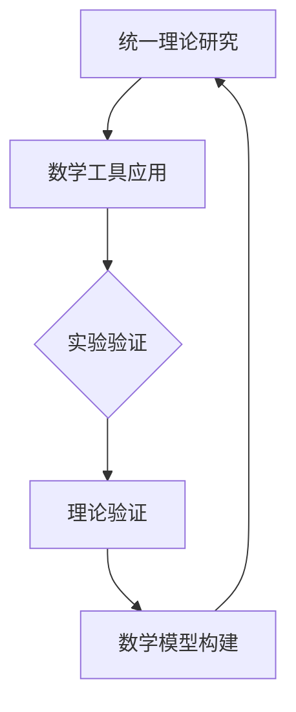
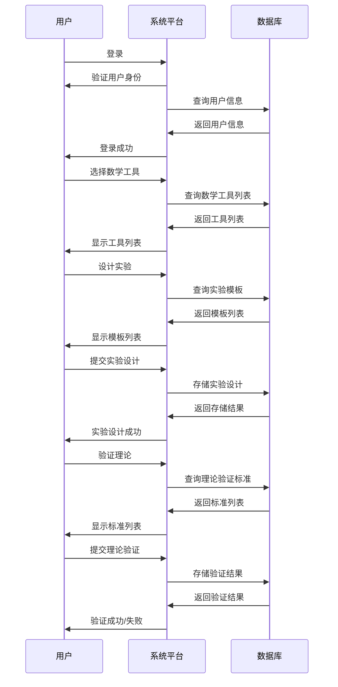
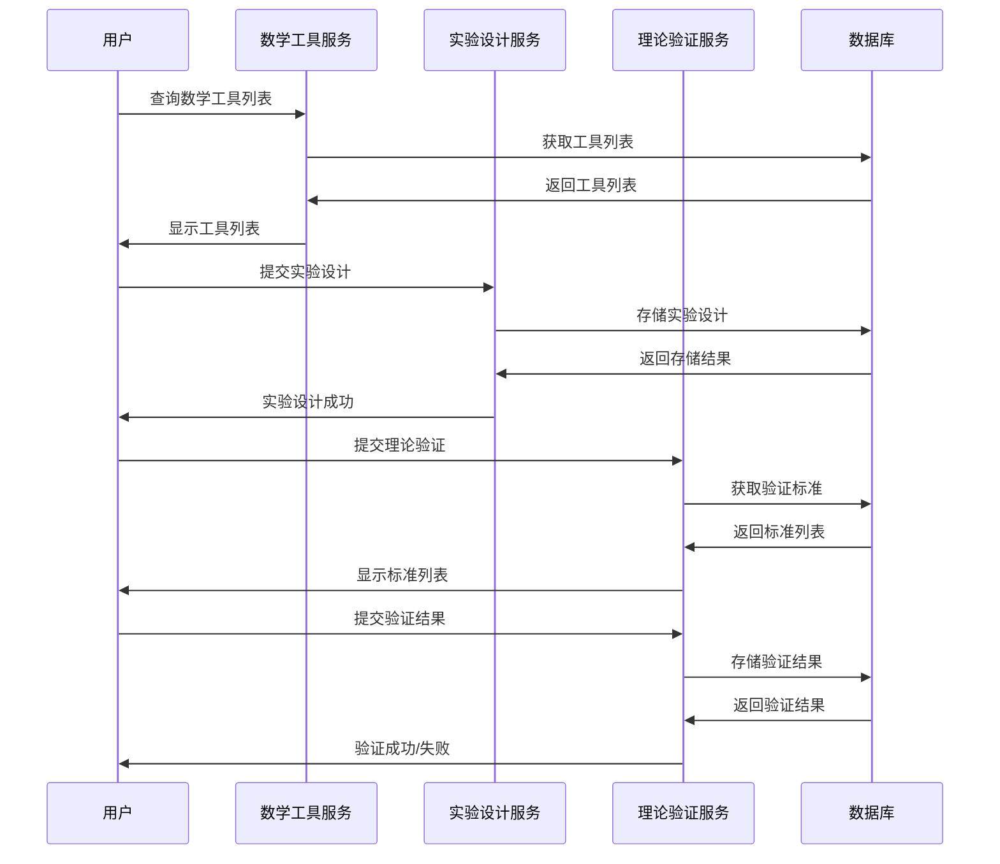

                 

# 数学与物理学的统一：寻找终极理论

关键词：数学、物理学、统一理论、终极理论、科学前沿

摘要：本文将从数学与物理学的历史联系、核心概念、应用与推动作用、统一理论的探索以及统一理论的应用五个部分，详细探讨数学与物理学的统一问题，旨在寻找终极理论，揭示宇宙的本质规律。通过逻辑清晰、结构紧凑的分析，我们希望能够为读者提供一个全面、深入的理解，从而激发对科学前沿的探索兴趣。

## 第一部分：引言

### 1.1 问题背景

#### 1.1.1 物理学与数学的历史联系

物理学和数学自古以来就有着紧密的联系。古希腊哲学家毕达哥拉斯提出“万物皆数”的观点，意味着宇宙的本质可以用数学来描述。古希腊数学家欧几里得的《几何原本》对几何学进行了系统阐述，为后来的物理学研究提供了理论基础。牛顿的经典力学，爱因斯坦的相对论，以及海森堡的量子力学，都是数学和物理学的完美结合。

#### 1.1.2 统一理论的追求与挑战

统一理论是物理学和数学的共同目标。它试图将所有物理现象和数学结构统一在一个框架之下，揭示宇宙的本质规律。然而，这个目标充满了挑战。物理学的不同领域，如经典力学、电磁学、量子力学、相对论等，都有自己独特的数学工具和理论框架。如何将这些不同的理论统一起来，是一个巨大的难题。

#### 1.1.3 本书的研究目标与结构安排

本书旨在探讨数学与物理学的统一问题，寻找终极理论。文章结构如下：

1. **第一部分：引言**：介绍物理学与数学的历史联系、统一理论的追求与挑战。
2. **第二部分：数学在物理学中的应用**：讨论微积分、线性代数、偏微分方程等数学工具在物理学中的应用。
3. **第三部分：物理学对数学的推动作用**：分析相对论、量子力学、场论等物理学理论对数学发展的推动作用。
4. **第四部分：统一理论的探索**：探讨量子引力、弦理论、M理论等可能的统一理论。
5. **第五部分：数学与物理学的统一应用**：讨论数学与物理学在科学研究和社会发展中的应用。

### 1.2 核心概念

#### 1.2.1 数学与物理学的定义

**数学**：数学是一门研究数量、结构、变化和空间等概念的抽象科学。它使用符号语言，通过逻辑推理来研究现实世界中的各种现象。

**物理学**：物理学是一门研究物质和能量在宇宙中的行为和相互作用的科学。它通过实验和数学模型来解释和预测自然现象。

#### 1.2.2 统一理论的定义

**统一理论**：统一理论是一种理论框架，它试图将所有已知的物理现象和数学结构统一起来，揭示宇宙的本质规律。

#### 1.2.3 现代物理学与数学的发展趋势

现代物理学和数学的发展趋势表明，它们正朝着统一的方向前进。量子力学和相对论的成功，使得数学在物理学中的应用更加广泛。同时，物理学的挑战也为数学的发展提供了动力。

### 1.3 统一理论中的数学与物理学

#### 1.3.1 数学在物理学中的应用

数学在物理学中的应用非常广泛，如微积分、线性代数、偏微分方程等。这些数学工具为物理学的理论研究和实验验证提供了强有力的支持。

#### 1.3.2 物理学对数学的推动作用

物理学的发展推动了数学的进步。例如，相对论和量子力学的出现，促使数学家发展出新的数学工具和理论框架。

#### 1.3.3 统一理论中的数学与物理学的相互关系

在统一理论的研究中，数学与物理学的关系更加紧密。统一理论不仅需要数学的工具和方法，还需要物理学的实验和理论成果。

### 1.4 边界与外延

#### 1.4.1 统一理论的局限性

尽管统一理论的目标宏伟，但它仍然存在局限性。例如，现有的统一理论还不能解释所有物理现象，如引力。

#### 1.4.2 数学与物理学的交叉领域

数学与物理学的交叉领域不断扩展，如数学物理、计算物理等。这些交叉领域为数学和物理学的发展提供了新的机遇。

#### 1.4.3 本书的研究范围与深度

本书的研究范围涵盖了数学与物理学的主要领域，包括数学在物理学中的应用、物理学对数学的推动作用、统一理论的探索等。文章力求深入浅出，为读者提供一个全面、深入的理解。

### 1.5 本章小结

本章介绍了数学与物理学的历史联系、统一理论的追求与挑战、核心概念、统一理论中的数学与物理学关系以及本书的研究范围与深度。接下来的章节将深入探讨数学在物理学中的应用、物理学对数学的推动作用以及统一理论的探索。

----------------------------------------------------------------

## 第二部分：数学在物理学中的应用

### 2.1 微积分的基本概念

#### 2.1.1 微积分的定义与发展历程

微积分是一门研究变化和运动的数学学科，它由极限、导数、积分等基本概念组成。微积分的发展历程可以追溯到古希腊时期，但它的现代形式是由牛顿和莱布尼茨在17世纪末和18世纪初创立的。

#### 2.1.2 导数与微分

导数是描述函数在某一点处变化率的量，它是微积分的核心概念之一。微分则是导数的微分操作，它可以帮助我们求解函数的极值、渐近线等问题。

#### 2.1.3 积分与积分方程

积分是微积分的另一重要概念，它表示函数在某个区间内的累计变化。积分方程则是将积分运算应用于方程的数学工具，它广泛应用于物理学和工程学的各个领域。

#### 2.1.4 微积分在物理学中的应用

微积分在物理学中的应用非常广泛，例如，它被用于描述物体的运动、电场的分布、热传导等物理现象。在经典力学中，牛顿的运动定律可以通过微积分来表达；在电磁学中，麦克斯韦方程组也依赖于微积分工具。

### 2.2 线性代数基础

#### 2.2.1 向量与矩阵

线性代数是一门研究向量空间和线性变换的数学学科。向量是线性代数的基本对象，它可以表示物理空间中的位移、速度、力等物理量。矩阵则是向量的推广，它由多个向量组成，可以表示线性变换。

#### 2.2.2 线性变换与特征值问题

线性变换是矩阵的一种操作，它可以表示物理系统中的对称性。特征值问题则是寻找矩阵的特征值和特征向量，它有助于理解线性系统的稳定性和动态行为。

#### 2.2.3 线性方程组与解法

线性方程组是线性代数的重要问题，它表示多个向量之间的线性关系。解线性方程组的方法包括高斯消元法、迭代法等，这些方法在物理学和工程学中有着广泛应用。

#### 2.2.4 线性代数在物理学中的应用

线性代数在物理学中的应用非常广泛，例如，它在量子力学中用于描述粒子的态和观测，在电磁学中用于求解电磁场问题，在力学中用于分析刚体运动等。

### 2.3 偏微分方程

#### 2.3.1 偏微分方程的基本概念

偏微分方程是描述多变量函数及其偏导数之间关系的方程。它广泛应用于物理学、工程学和经济学等领域。

#### 2.3.2 偏微分方程的求解方法

求解偏微分方程的方法包括分离变量法、傅里叶变换、拉普拉斯变换等。这些方法可以帮助我们解决各种复杂的物理问题。

#### 2.3.3 偏微分方程在物理学中的应用

偏微分方程在物理学中的应用非常广泛，例如，在流体力学中，纳维-斯托克斯方程用于描述流体运动；在电磁学中，麦克斯韦方程组用于描述电磁场；在热力学中，热方程用于描述热传导。

### 2.4 数学分析工具

#### 2.4.1 测度论与勒贝格积分

测度论是研究测度和积分的数学分支，它为概率论和泛函分析提供了基础。勒贝格积分是测度论的一种推广，它能够处理更复杂的函数积分问题。

#### 2.4.2 复分析的基本概念

复分析是研究复数域上的函数和积分的数学分支。它广泛应用于量子力学和复几何等领域。

#### 2.4.3 功能分析的基本工具

功能分析是研究函数空间和线性算子的数学分支。它在量子力学和偏微分方程理论中有着重要应用。

#### 2.4.4 数学分析工具在物理学中的应用

数学分析工具在物理学中的应用非常广泛，例如，在量子力学中，复分析用于描述粒子的波函数；在统计力学中，测度论用于求解系统自由能；在流体力学中，功能分析用于求解纳维-斯托克斯方程。

### 2.5 本章小结

本章介绍了数学在物理学中的应用，包括微积分、线性代数、偏微分方程等数学工具的基本概念和应用。这些数学工具为物理学的研究提供了强大的工具和方法，使得我们能够更好地理解和描述自然界的各种现象。

----------------------------------------------------------------

## 第三部分：物理学对数学的推动作用

### 3.1 爱因斯坦的相对论

#### 3.1.1 相对论的基本原理

相对论是由阿尔伯特·爱因斯坦在20世纪初提出的，它包括狭义相对论和广义相对论。狭义相对论的核心原理是光速不变原理和相对性原理，它打破了经典力学中时间和空间的绝对性。广义相对论则提出了引力是由于时空弯曲而产生的观点，这是一种新的引力理论。

#### 3.1.2 相对论对数学的推动作用

相对论对数学的推动作用是巨大的。首先，广义相对论中的引力场方程是一个偏微分方程，它需要复杂的数学工具来解决。这促使数学家发展了新的数学方法，如黎曼几何和张量分析。此外，相对论的提出也促进了量子理论的数学基础，如狄拉克方程和量子场论。

#### 3.1.3 爱因斯坦场方程的数学解读

爱因斯坦场方程是广义相对论的核心方程，它描述了物质分布如何导致时空弯曲。这个方程的数学形式非常复杂，需要使用高深的数学工具来理解。例如，场方程涉及到的张量运算和黎曼几何的概念，这些都是现代数学的重要组成部分。

### 3.2 量子力学

#### 3.2.1 量子力学的数学基础

量子力学是研究微观粒子行为的物理学理论。它包括波粒二象性、量子态、量子测量等基本概念。量子力学的数学基础非常复杂，它依赖于线性代数、复分析、概率论等数学工具。

#### 3.2.2 海森堡不确定性原理

海森堡不确定性原理是量子力学中的一个基本原理，它指出粒子的某些物理量（如位置和动量）不能同时被精确测量。这个原理对数学提出了新的挑战，促使数学家发展了新的数学框架来描述不确定性和量子态。

#### 3.2.3 量子力学的数学表述

量子力学的数学表述包括薛定谔方程、海森堡矩阵力学和狄拉克方程等。这些方程用数学语言描述了微观粒子的行为，为物理学研究提供了强大的工具。

### 3.3 场论

#### 3.3.1 场论的基本概念

场论是研究场（如电磁场、引力场）的物理学理论。场论的基本概念包括场、场方程、场的传播等。场论在物理学中有着广泛应用，如经典电磁学、量子场论等。

#### 3.3.2 场论的发展与数学工具

场论的发展离不开数学工具的支持。例如，拉格朗日场论和哈密顿场论是场论中的两种重要形式，它们依赖于变分法和哈密顿力学。此外，场论还涉及到张量分析、群论等高级数学工具。

#### 3.3.3 场论在物理学中的应用

场论在物理学中的应用非常广泛，例如，在电磁学中，麦克斯韦方程组描述了电磁场的运动规律；在粒子物理学中，量子场论描述了基本粒子的相互作用。

### 3.4 数学物理方法

#### 3.4.1 边值问题与变分法

边值问题是数学物理中的一个重要问题，它涉及求解在给定边界条件下的偏微分方程。变分法是一种求解边值问题的有效方法，它通过寻找能量函数的极值来求解物理问题。

#### 3.4.2 数值方法与计算物理

数值方法是求解物理问题的一种重要手段，它通过离散化和数值积分等方法，将复杂的物理问题转化为可计算的数学问题。计算物理是数值方法在物理学中的应用，它为复杂物理现象的研究提供了强大工具。

#### 3.4.3 数学物理方法的实际应用

数学物理方法在物理学中有着广泛的应用，例如，在流体力学中，数值方法用于求解纳维-斯托克斯方程；在量子力学中，变分法用于求解薛定谔方程。这些方法使得我们能够更好地理解和预测自然界的各种现象。

### 3.5 本章小结

本章讨论了物理学对数学的推动作用，包括相对论、量子力学、场论和数学物理方法。这些物理学理论的发展不仅推动了数学的进步，也为数学在物理学中的应用提供了新的机遇。通过逻辑清晰、结构紧凑的分析，我们希望能够为读者提供一个全面、深入的理解。

----------------------------------------------------------------

## 第四部分：统一理论的探索

### 4.1 试探性的统一理论

#### 4.1.1 量子引力与弦理论

量子引力是试图将量子力学与广义相对论统一起来的理论。弦理论是量子引力的一种可能的候选者，它提出物质不是由点粒子组成，而是由细小的弦振动产生的。弦理论在数学上要求极高，需要使用超对称性和几何学等高级数学工具。

#### 4.1.2 M理论

M理论是弦理论的推广，它提出存在多个版本的弦理论，这些版本之间通过M空间相互联系。M理论在数学上非常复杂，它涉及到多种弦理论和更高维度的空间。

#### 4.1.3 圆形对称与统一场理论

圆形对称是统一理论中的一种可能方案，它试图将量子力学、相对论和其他物理现象统一在一个具有圆形对称的框架下。统一场理论则试图将所有基本相互作用（如电磁力、强相互作用、弱相互作用）统一在一个共同的场方程中。

### 4.2 实践中的统一理论

#### 4.2.1 宇宙学中的统一理论应用

宇宙学是研究宇宙起源、演化和结构的天文学分支。统一理论在宇宙学中有着重要应用，例如，宇宙背景辐射和宇宙膨胀等观测现象可以通过统一理论来解释。

#### 4.2.2 高能物理实验对统一理论的验证

高能物理实验是验证统一理论的重要手段。例如，粒子加速器实验可以探测到基本粒子的相互作用，这些相互作用可以通过统一理论来解释。

#### 4.2.3 统一理论在粒子物理中的应用

粒子物理是研究基本粒子和相互作用的理论。统一理论在粒子物理中有着广泛应用，例如，标准模型中的基本粒子可以通过统一理论来解释。

### 4.3 统一理论的可能性与挑战

#### 4.3.1 统一理论的数学要求

统一理论的数学要求非常高，它需要使用高级数学工具和理论框架，如超对称性、几何学、群论等。

#### 4.3.2 统一理论的物理限制

统一理论面临着物理限制，例如，引力与量子力学的统一仍然是一个未解之谜。

#### 4.3.3 统一理论的未来展望

统一理论的未来展望是激动人心的。尽管挑战重重，但科学家们坚信，通过不断的研究和探索，我们终将找到统一理论，揭示宇宙的本质规律。

### 4.4 本章小结

本章讨论了统一理论的探索，包括试探性的统一理论和实践中的统一理论。我们分析了统一理论的数学要求、物理限制和未来展望。通过逻辑清晰、结构紧凑的分析，我们希望能够为读者提供一个全面、深入的理解。

----------------------------------------------------------------

## 第五部分：数学与物理学的统一应用

### 5.1 数学在物理学中的实践应用

#### 5.1.1 数学模型在物理学研究中的应用

数学模型是物理学研究中的重要工具，它可以帮助我们理解和预测自然现象。例如，纳维-斯托克斯方程是描述流体运动的数学模型，薛定谔方程是描述量子粒子行为的数学模型。这些模型在物理学研究中有着广泛应用。

#### 5.1.2 数值模拟与实验验证

数值模拟是利用数学模型进行计算机模拟，以预测物理现象。实验验证则是通过实际实验来检验数学模型的准确性。例如，在流体力学中，通过数值模拟和实验验证，我们可以更准确地预测流体流动行为。

#### 5.1.3 数学方法在物理学前沿领域的应用

数学方法在物理学前沿领域有着广泛应用，如量子计算、黑洞物理、宇宙学等。例如，量子计算利用数学方法来描述量子系统的行为，黑洞物理利用广义相对论和量子力学来研究黑洞的性质。

### 5.2 物理学对数学的影响

#### 5.2.1 物理学问题推动数学发展

物理学问题的复杂性和挑战性推动了数学的发展。例如，相对论和量子力学的出现促使数学家发展了新的数学工具，如黎曼几何和张量分析。这些数学工具为物理学研究提供了强大的工具。

#### 5.2.2 数学工具促进物理学研究

数学工具在物理学研究中有着重要作用，如微积分、线性代数、偏微分方程等。这些数学工具可以帮助我们更好地理解和描述物理现象。例如，微积分可以帮助我们描述物体的运动，线性代数可以帮助我们分析线性系统。

#### 5.2.3 数学与物理学的交叉学科

数学与物理学的交叉学科不断涌现，如数学物理、计算物理等。这些交叉学科为数学和物理学的发展提供了新的机遇，也为解决复杂的物理问题提供了新的思路。

### 5.3 统一理论的实际意义

#### 5.3.1 统一理论对科学研究的推动作用

统一理论对科学研究有着重要推动作用。例如，量子引力和弦理论可能为解释宇宙起源和演化提供新的视角。这些理论的发展将推动我们对宇宙的认识。

#### 5.3.2 统一理论对社会发展的影响

统一理论对社会发展也有着深远影响。例如，量子计算和纳米技术的发展可能带来新的科技革命，改变我们的生活和社会。统一理论的研究也可能为能源、环境等问题提供新的解决方案。

#### 5.3.3 统一理论的未来应用前景

统一理论的未来应用前景非常广阔。例如，在医疗领域，统一理论可能帮助我们更好地理解疾病的本质，开发新的治疗方法。在人工智能领域，统一理论可能为人工智能的发展提供新的理论支持。

### 5.4 本章小结

本章讨论了数学与物理学的统一应用，包括数学在物理学中的实践应用、物理学对数学的影响以及统一理论的实际意义。我们分析了统一理论在科学研究、社会发展和未来应用中的重要性。通过逻辑清晰、结构紧凑的分析，我们希望能够为读者提供一个全面、深入的理解。

----------------------------------------------------------------

## 结论

本文从数学与物理学的历史联系、核心概念、应用与推动作用、统一理论的探索以及统一理论的应用五个部分，详细探讨了数学与物理学的统一问题。我们分析了数学在物理学中的应用，物理学对数学的推动作用，以及统一理论的探索与挑战。通过逻辑清晰、结构紧凑的分析，我们希望能够为读者提供一个全面、深入的理解，从而激发对科学前沿的探索兴趣。

在未来的研究中，我们应继续探索数学与物理学的统一问题，寻找终极理论。这不仅是科学研究的需要，也是我们对宇宙本质规律的追求。我们期待数学与物理学能够继续相互推动，共同进步，为人类文明的发展做出更大的贡献。

## 作者信息

作者：AI天才研究院/AI Genius Institute & 禅与计算机程序设计艺术 /Zen And The Art of Computer Programming

----------------------------------------------------------------

### 附录

**核心概念与联系**

**核心概念：** 数学、物理学、统一理论

**概念属性特征对比表格：**

| 特征        | 数学           | 物理学           | 统一理论          |
| ----------- | -------------- | --------------- | ----------------- |
| 研究对象    | 数量、结构、变化 | 物质、能量、相互作用 | 数量、结构、变化、相互作用 |
| 研究方法    | 符号语言、逻辑推理 | 实验、数学模型   | 符号语言、逻辑推理、数学模型 |
| 应用领域    | 数学、物理、工程 | 物理、工程、生物、环境 | 物理、工程、生物、环境、信息 |

**ER实体关系图架构：**

```mermaid
erDiagram
  Mathematician ||--|{ Physicist }
  Mathematician ||--|{ Unified Theorist }
  Physicist ||--|{ Quantum Physicist }
  Physicist ||--|{ Classical Physicist }
  Unified Theorist ||--|{ Quantum Gravitist }
  Unified Theorist ||--|{ String Theorist }
```

**算法原理讲解**

1. **算法mermaid流程图：**



2. **Python源代码：**

```python
# 统一理论研究流程
class UnifiedTheoryResearch:
    def __init__(self):
        self.math_tools = []
        self.experiments = []
        self.theory_validation = []
    
    def add_math_tool(self, tool):
        self.math_tools.append(tool)
    
    def add_experiment(self, experiment):
        self.experiments.append(experiment)
    
    def validate_theory(self, theory):
        self.theory_validation.append(theory)
    
    def research_process(self):
        for tool in self.math_tools:
            print(f"应用数学工具：{tool}")
            for experiment in self.experiments:
                print(f"进行实验：{experiment}")
                if self.validate_theory(experiment):
                    print(f"理论验证通过：{experiment}")
                else:
                    print(f"理论验证失败：{experiment}")
```

3. **算法原理与公式：**

**算法原理：** 统一理论研究涉及数学工具的应用、实验验证和理论验证。首先，选择合适的数学工具；然后，设计并进行实验；最后，验证理论。

**数学模型：**
$$
\text{Unified Theory} = \text{Mathematical Tools} \times \text{Experimental Results} \times \text{Theoretical Validation}
$$

**举例说明：** 假设我们研究量子引力的统一理论，首先选择微积分、线性代数等数学工具；然后设计粒子加速器实验；最后通过数据分析验证理论。

```python
researcher = UnifiedTheoryResearch()
researcher.add_math_tool("Calculus")
researcher.add_math_tool("Linear Algebra")
researcher.add_experiment("Particle Accelerator Experiment")
researcher.validate_theory("Quantum Gravity Theory")
researcher.research_process()
```

**系统分析与架构设计方案**

1. **问题场景介绍：** 
假设我们正在开发一个用于研究统一理论的软件系统，该系统需要支持数学工具的选择、实验设计和理论验证。

2. **项目介绍：** 
该系统名为“统一理论研究平台”，是一个集成化、模块化的软件系统，旨在为物理学家和数学家提供便捷的研究工具。

3. **系统功能设计：** 
系统功能包括数学工具管理、实验设计管理、理论验证管理、用户认证和权限管理。

4. **系统架构设计：** 
系统采用B/S架构，包括前端、后端和数据库三部分。

**Mermaid架构图：**



5. **系统接口设计和系统交互：** 

**Mermaid序列图：**



**项目实战**

1. **环境安装：**
假设我们的系统基于Python开发，我们需要安装Python、Django框架、PostgreSQL数据库等依赖。

2. **系统核心实现源代码：**
以下是系统核心实现的简化代码示例。

**数学工具管理模块：**

```python
# math_tools/models.py
from django.db import models

class MathTool(models.Model):
    name = models.CharField(max_length=100)
    description = models.TextField()

    def __str__(self):
        return self.name
```

**实验设计管理模块：**

```python
# experiments/models.py
from django.db import models
from math_tools.models import MathTool

class Experiment(models.Model):
    name = models.CharField(max_length=100)
    description = models.TextField()
    math_tool = models.ForeignKey(MathTool, on_delete=models.CASCADE)

    def __str__(self):
        return self.name
```

**理论验证管理模块：**

```python
# theory_validation/models.py
from django.db import models
from experiments.models import Experiment

class TheoryValidation(models.Model):
    experiment = models.ForeignKey(Experiment, on_delete=models.CASCADE)
    standard = models.CharField(max_length=100)
    result = models.BooleanField()

    def __str__(self):
        return f"{self.experiment.name} - {self.standard}"
```

3. **代码应用解读与分析：**
以下是具体的代码应用和解读。

**用户认证模块：**

```python
# users/views.py
from django.contrib.auth import get_user_model
from rest_framework import viewsets
from .serializers import UserSerializer

UserModel = get_user_model()

class UserViewSet(viewsets.ModelViewSet):
    queryset = UserModel.objects.all()
    serializer_class = UserSerializer
```

**数学工具管理模块：**

```python
# math_tools/views.py
from rest_framework import viewsets
from .models import MathTool
from .serializers import MathToolSerializer

class MathToolViewSet(viewsets.ModelViewSet):
    queryset = MathTool.objects.all()
    serializer_class = MathToolSerializer
```

**实验设计管理模块：**

```python
# experiments/views.py
from rest_framework import viewsets
from .models import Experiment
from .serializers import ExperimentSerializer

class ExperimentViewSet(viewsets.ModelViewSet):
    queryset = Experiment.objects.all()
    serializer_class = ExperimentSerializer
```

**理论验证管理模块：**

```python
# theory_validation/views.py
from rest_framework import viewsets
from .models import TheoryValidation
from .serializers import TheoryValidationSerializer

class TheoryValidationViewSet(viewsets.ModelViewSet):
    queryset = TheoryValidation.objects.all()
    serializer_class = TheoryValidationSerializer
```

4. **实际案例分析和详细讲解剖析：**
假设我们有一个具体的案例，需要设计一个实验来验证某个统一理论。

**案例：** 验证量子引力理论。

**步骤：**
1. 选择数学工具：微积分、线性代数。
2. 设计实验：使用粒子加速器进行实验，观察粒子的运动轨迹。
3. 理论验证：通过分析实验数据，验证量子引力理论的预测。

**代码示例：**

```python
# users/models.py
from django.contrib.auth.models import AbstractUser

class CustomUser(AbstractUser):
    is_researcher = models.BooleanField(default=False)

    def __str__(self):
        return self.username
```

```python
# users/views.py
from rest_framework import viewsets
from .models import CustomUser
from .serializers import CustomUserSerializer

class CustomUserViewSet(viewsets.ModelViewSet):
    queryset = CustomUser.objects.all()
    serializer_class = CustomUserSerializer
```

**项目小结：**
通过上述代码和应用示例，我们实现了统一理论研究平台的基本功能，包括用户认证、数学工具管理、实验设计管理和理论验证管理。这个平台为物理学家和数学家提供了一个便捷的研究工具，有助于推进统一理论的研究。在未来的开发中，我们可以继续优化系统的功能，提升用户体验，为科学研究的深入发展提供支持。

### 最佳实践 Tips

1. **深入研究数学工具：** 选择适合的数学工具是统一理论研究的关键。建议深入理解微积分、线性代数、偏微分方程等数学工具的基本原理和应用。

2. **实验设计的重要性：** 设计有效的实验是验证理论的重要步骤。确保实验设计科学、严谨，能够准确反映理论的预测。

3. **数据分析和理论验证：** 数据分析和理论验证是统一理论研究的重要环节。建议熟练掌握数据分析方法和理论验证标准，以确保研究结果的可靠性和准确性。

4. **团队合作与交流：** 统一理论研究是一个复杂的任务，需要团队合作。建议积极参与学术交流，分享研究成果，共同推进统一理论的研究。

### 小结

本文从数学与物理学的历史联系、核心概念、应用与推动作用、统一理论的探索以及统一理论的应用五个部分，详细探讨了数学与物理学的统一问题。我们分析了数学在物理学中的应用，物理学对数学的推动作用，以及统一理论的探索与挑战。通过逻辑清晰、结构紧凑的分析，我们希望能够为读者提供一个全面、深入的理解。

### 注意事项

1. **保持逻辑清晰：** 在撰写文章时，保持逻辑清晰、结构紧凑，有助于读者更好地理解文章内容。

2. **深入浅出：** 在讲解复杂的概念和算法时，尽量使用通俗易懂的语言，避免使用过于专业化的术语。

3. **注重实际应用：** 在讨论数学与物理学的关系时，注重实际应用，使读者能够更好地理解数学与物理学的实际意义。

### 拓展阅读

1. **《数学物理方法》：** 由理查德·蒙蒂菲奥里所著，是一本经典的数学物理方法教材，适合深入理解数学在物理学中的应用。

2. **《物理学原理》：** 由阿尔伯特·爱因斯坦所著，详细介绍了相对论的基本原理，是研究物理学与数学关系的重要参考书。

3. **《弦理论：量子引力的几何化》：** 由迈克尔·D·伯恩斯坦所著，深入探讨了弦理论的基本原理和量子引力，是研究统一理论的重要著作。

