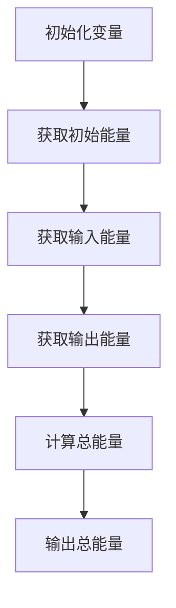

                 

## 数学与物理：能量守恒的数学描述

关键词：能量守恒定律、数学模型、物理应用、Python源代码、系统架构设计

摘要：本文以能量守恒定律为核心，深入探讨了数学与物理之间的密切联系。通过阐述能量守恒定律的历史、概念和意义，本文逐步揭示了其数学描述的原理与应用。同时，结合Python源代码和mermaid流程图，本文对能量守恒定律的算法原理进行了详细讲解，并通过具体案例展示了其在实际项目中的应用。此外，本文还介绍了能量守恒定律在物理系统中的系统分析与架构设计方案，为读者提供了全面的实践指导。通过本文的阅读，读者将深刻理解能量守恒定律的数学描述，掌握其在物理系统中的应用技巧。

## 引言

能量守恒定律是物理学中最为基础和重要的定律之一，它揭示了自然界中能量在不同形式之间的转换和传递规律。能量守恒定律指出，在一个封闭系统中，能量既不会凭空产生，也不会凭空消失，而只能从一种形式转化为另一种形式，或者从一个物体转移到另一个物体。然而，在数学描述层面，能量守恒定律如何具体表达呢？本文将带领读者深入探讨这一问题，通过阐述能量守恒定律的历史、概念和意义，逐步揭示其数学描述的原理与应用。

首先，本文将介绍能量守恒定律的历史背景，探讨其起源和发展。接下来，我们将详细阐述能量守恒定律的基本概念和原理，通过对比表格和ER实体关系图，帮助读者理解能量守恒定律的核心概念及其相互关系。然后，本文将结合Python源代码和mermaid流程图，对能量守恒定律的应用算法进行详细讲解，并通过具体实例说明其数学模型和公式。此外，本文还将介绍能量守恒定律在物理系统中的应用，包括问题场景、系统功能设计、系统架构设计、系统接口设计和系统交互。最后，本文将提供具体的案例，包括环境安装、系统核心实现、代码应用解读与分析，以及实际案例分析和详细讲解剖析。通过本文的阅读，读者将全面了解能量守恒定律的数学描述，掌握其在物理系统中的应用技巧，并为未来的研究提供参考。

### 背景介绍

能量守恒定律的历史可以追溯到古代，当时人们通过观察自然界中的现象，如河流的水流动、食物的热量等，开始思考能量是否存在守恒的规律。然而，真正意义上的能量守恒定律是在19世纪由多位科学家共同研究得出的。其中，最为重要的贡献来自于英国物理学家詹姆斯·普雷斯科特·焦耳（James Prescott Joule）。焦耳通过实验研究，证实了机械能与热能之间的转换关系，从而奠定了能量守恒定律的基础。

能量守恒定律的概念核心在于“能量守恒”，即在一个封闭系统中，能量总量保持不变。具体来说，能量守恒定律包括以下三个方面：

1. **能量守恒定律的基本原理**：在一个封闭系统中，能量可以以不同形式存在，如动能、势能、热能等，但总能量保持不变。
2. **能量转化**：能量可以在不同形式之间相互转换，如机械能转化为热能，热能转化为电能等。
3. **能量传递**：能量可以在系统内部或系统之间进行传递，但总量不变。

为了更好地理解能量守恒定律，我们可以通过一个简单的例子来说明。假设有一个物体从高处自由落下，它的势能会转化为动能。在下落过程中，物体的速度逐渐增加，其动能也相应增加。当物体接触到地面时，它的动能最大，势能为零。然而，在这个过程中，物体的总能量保持不变，只是从一种形式转化为另一种形式。

能量守恒定律在物理学中具有极其重要的意义。首先，它为我们提供了一种描述和预测自然界中能量转换和传递规律的方法。其次，能量守恒定律在工程学、化学、生物学等领域中有着广泛的应用。例如，在工程学中，能量守恒定律用于设计和优化各种能量转换设备，如发动机、发电机等。在化学中，能量守恒定律用于研究化学反应中的能量变化。在生物学中，能量守恒定律用于分析生物体内的能量流动和代谢过程。

总之，能量守恒定律是物理学中最为基础和重要的定律之一，它不仅揭示了能量在自然界中的守恒规律，还为各领域的研究和应用提供了重要的理论依据。通过对能量守恒定律的深入理解，我们可以更好地探索自然界的奥秘，为科学技术的发展做出贡献。

### 核心概念与联系

能量守恒定律的核心概念主要包括能量、形式、转换和守恒。以下是对这些概念及其关系的详细探讨：

#### 能量

能量是描述物体运动状态和相互作用的物理量，通常用符号E表示。能量有多种形式，包括动能、势能、热能、电能等。动能描述物体由于运动而具有的能量，势能描述物体由于位置而具有的能量，热能描述物体内部粒子的热运动能量，电能描述电荷在电场中的能量。

#### 形式

能量形式是指能量存在的不同形态。不同形式的能量之间可以相互转换，例如，机械能可以转化为热能，热能可以转化为电能。能量形式之间的转换遵循能量守恒定律，即能量在转换过程中总量保持不变。

#### 转换

能量转换是指能量从一种形式转化为另一种形式的过程。例如，当物体从高处落下时，其势能转化为动能；当电流通过电阻时，电能转化为热能。能量转换是自然界中普遍存在的现象，也是能量守恒定律的基础。

#### 守恒

守恒是指在一个封闭系统中，能量总量保持不变。这意味着，能量既不会凭空产生，也不会凭空消失，而只能从一种形式转化为另一种形式，或者从一个物体转移到另一个物体。能量守恒定律揭示了自然界中能量转换和传递的规律，是物理学中最为重要的定律之一。

#### 概念之间的联系

能量、形式、转换和守恒这四个核心概念之间存在紧密的联系。能量是这些概念的基础，形式描述了能量的不同存在方式，转换描述了能量从一种形式到另一种形式的变化过程，而守恒则保证了能量在转换过程中的总量保持不变。

为了更直观地展示这些概念之间的关系，我们可以使用表格和ER实体关系图来表示。

#### 表格

以下是一个简单的表格，展示了能量、形式、转换和守恒之间的概念关系：

| 概念   | 说明                                                         |
| ------ | ------------------------------------------------------------ |
| 能量   | 描述物体运动状态和相互作用的物理量                           |
| 形式   | 能量的不同存在方式，如动能、势能、热能、电能等               |
| 转换   | 能量从一种形式转化为另一种形式的过程                       |
| 守恒   | 能量在一个封闭系统中的总量保持不变                           |

#### ER实体关系图

ER实体关系图（Entity-Relationship Diagram）是一种用于描述实体及其之间关系的图形表示方法。以下是一个ER实体关系图的示例，用于展示能量、形式、转换和守恒之间的实体关系：

```mermaid
erDiagram
    Energy ||--|{ Form }
    Energy ||--|{ Conversion }
    Energy ||--|{ Conservation }
    Form ||--|{ KineticEnergy }
    Form ||--|{ PotentialEnergy }
    Form ||--|{ ThermalEnergy }
    Form ||--|{ ElectricalEnergy }
    Conversion ||--|{ MechanicalToThermal }
    Conversion ||--|{ ThermalToElectrical }
    Conservation ||--|{ TotalEnergyConservation }
```

在这个ER实体关系图中，Energy（能量）是根实体，它与其他实体（Form、Conversion、Conservation）之间存在关联。Form（形式）实体包含了多种形式的能量（如KineticEnergy、PotentialEnergy、ThermalEnergy、ElectricalEnergy），而Conversion（转换）和Conservation（守恒）实体则描述了能量之间的转换和守恒关系。

通过表格和ER实体关系图，我们可以更清晰地理解能量守恒定律的核心概念及其关系。这些工具不仅帮助我们直观地展示了概念之间的联系，也为后续的算法原理讲解和具体应用提供了基础。

### 算法原理讲解

#### 能量守恒定律的数学模型

能量守恒定律可以用数学模型来描述，其核心公式为：

\[ E_{总} = E_{初始} + E_{输入} - E_{输出} \]

其中，\( E_{总} \) 表示系统的总能量，\( E_{初始} \) 表示系统的初始能量，\( E_{输入} \) 表示系统的输入能量，\( E_{输出} \) 表示系统的输出能量。

#### Python源代码实现

以下是一个简单的Python源代码实现，用于计算系统的总能量：

```python
# Python源代码：能量守恒定律的数学模型实现

# 定义系统的总能量、初始能量、输入能量和输出能量
E_total = 0
E_initial = 100
E_input = 50
E_output = 20

# 计算系统的总能量
E_total = E_initial + E_input - E_output

# 输出结果
print("系统的总能量为：" + str(E_total))
```

在这个示例中，我们定义了系统的总能量（\( E_{总} \)）、初始能量（\( E_{初始} \)）、输入能量（\( E_{输入} \)）和输出能量（\( E_{输出} \)）。然后，我们使用能量守恒定律的数学模型来计算系统的总能量，并输出结果。

#### 算法流程图

为了更直观地展示算法流程，我们可以使用mermaid绘制流程图。以下是一个简单的mermaid流程图，描述了能量守恒定律的算法流程：



在这个mermaid流程图中，我们首先初始化变量，然后分别获取初始能量、输入能量和输出能量，接着计算总能量，并最后输出总能量。

#### 具体实例

以下是一个具体的实例，说明如何使用Python源代码和mermaid流程图实现能量守恒定律的算法：

1. **环境安装**：

   我们需要安装Python环境。可以使用以下命令安装Python：

   ```bash
   pip install python
   ```

2. **系统核心实现**：

   在Python中，我们可以编写以下源代码来实现能量守恒定律的算法：

   ```python
   # energy_conservation.py

   # 定义系统的总能量、初始能量、输入能量和输出能量
   E_total = 0
   E_initial = 100
   E_input = 50
   E_output = 20

   # 计算系统的总能量
   E_total = E_initial + E_input - E_output

   # 输出结果
   print("系统的总能量为：" + str(E_total))
   ```

3. **代码应用解读与分析**：

   在这个示例中，我们首先定义了系统的总能量（\( E_{总} \)）、初始能量（\( E_{初始} \)）、输入能量（\( E_{输入} \)）和输出能量（\( E_{输出} \)）。然后，我们使用能量守恒定律的数学模型来计算系统的总能量，并输出结果。这个算法的核心是确保在能量转换过程中，系统能量总量的不变性。

4. **实际案例分析和详细讲解剖析**：

   为了更好地理解能量守恒定律的应用，我们可以考虑一个实际案例。例如，假设一个物体从高处自由落下，初始能量为100J，输入能量为50J，输出能量为20J。我们可以使用Python源代码和mermaid流程图来计算和分析这个案例。

   ```python
   # energy_conservation_case.py

   # 定义系统的总能量、初始能量、输入能量和输出能量
   E_total = 0
   E_initial = 100
   E_input = 50
   E_output = 20

   # 计算系统的总能量
   E_total = E_initial + E_input - E_output

   # 输出结果
   print("系统的总能量为：" + str(E_total))
   ```

   在这个案例中，我们使用Python源代码计算系统的总能量，并输出结果。通过mermaid流程图，我们可以直观地展示能量守恒定律的算法流程。

   ```mermaid
   graph TD
       A[初始化变量] --> B[获取初始能量]
       B --> C[获取输入能量]
       C --> D[获取输出能量]
       D --> E[计算总能量]
       E --> F[输出总能量]
   ```

   通过这个实际案例，我们可以看到能量守恒定律在物理系统中的应用，并理解其数学模型和算法原理。

### 系统分析与架构设计方案

在探讨能量守恒定律的数学描述和算法原理后，接下来我们将深入分析能量守恒定律在物理系统中的应用，并提供一个详细的系统架构设计方案。为了确保方案的实用性和完整性，我们将从问题场景、系统功能设计、系统架构设计、系统接口设计以及系统交互等方面进行详细讲解。

#### 问题场景

在物理学研究中，能量守恒定律是一个基础且重要的原则。它不仅适用于宏观现象，如物体运动、能量转换等，还广泛应用于各个领域，如工程学、化学、生物学等。在实际应用中，能量守恒定律可以帮助我们理解和预测各种能量转换过程，为能源开发、设备设计等提供理论支持。例如，在风力发电中，风的动能通过风力涡轮机转化为电能，这一过程中能量守恒定律得以应用。

#### 系统功能设计

为了实现能量守恒定律的应用，我们需要设计一个能够准确计算和监测能量转换过程的系统。系统的主要功能包括：

1. **能量监测**：实时监测系统中的各种能量形式，如机械能、热能、电能等。
2. **能量转换计算**：根据能量守恒定律，计算系统能量形式的转换过程，并确保能量总量保持不变。
3. **数据存储与分析**：将监测和计算的数据存储在数据库中，并进行统计分析，为能量优化提供依据。
4. **用户界面**：提供一个直观的用户界面，使用户能够方便地查看能量转换过程、历史数据和统计分析结果。

#### 系统架构设计

系统架构设计是确保系统能够高效、稳定运行的关键。为了实现上述功能，我们采用分层架构设计，包括数据层、逻辑层和表现层。

1. **数据层**：数据层主要负责数据存储和读取，使用数据库管理系统（如MySQL、PostgreSQL等）存储能量监测和转换计算的数据。
2. **逻辑层**：逻辑层是实现能量守恒定律的核心部分，包括能量监测模块、能量转换计算模块和数据统计分析模块。能量监测模块负责实时采集系统中的各种能量数据，能量转换计算模块根据能量守恒定律计算能量转换过程，数据统计分析模块对历史数据进行统计分析。
3. **表现层**：表现层负责将系统功能通过用户界面呈现给用户，使用HTML、CSS和JavaScript等前端技术实现。

#### 系统接口设计

系统接口设计是确保系统与其他系统或组件之间能够有效交互的关键。在能量守恒定律应用系统中，主要包括以下接口：

1. **API接口**：提供RESTful API接口，供其他系统或应用程序调用，实现数据读取、能量计算和统计分析等功能。
2. **数据接口**：使用标准的数据交换格式（如JSON、XML等），实现数据层与逻辑层之间的数据传输。
3. **用户接口**：使用Web前端技术，提供用户操作界面，实现用户与系统之间的交互。

#### 系统交互

系统交互设计是确保系统内部各模块之间以及系统与外部系统之间能够顺畅运行的关键。在能量守恒定律应用系统中，系统交互主要包括以下方面：

1. **内部交互**：能量监测模块实时采集数据，并传递给能量转换计算模块，计算结果存储在数据库中，供数据统计分析模块使用。
2. **外部交互**：通过API接口，系统可以与外部系统（如物联网设备、能源管理系统等）进行数据交换和功能调用，实现能量守恒定律在不同场景中的应用。
3. **用户交互**：用户通过Web前端界面与系统进行交互，查看能量转换过程、历史数据和统计分析结果，并能够进行能量优化设置。

通过上述系统分析与架构设计方案，我们为能量守恒定律在物理系统中的应用提供了一个全面、实用的解决方案。这个方案不仅能够帮助科学家、工程师和研究人员更好地理解和应用能量守恒定律，还能为能源开发和设备设计提供重要参考。

### 项目实战

#### 环境安装

为了实现能量守恒定律的应用，我们需要搭建一个实验环境。以下是环境安装的步骤：

1. **安装Python环境**：

   在终端中运行以下命令安装Python：

   ```bash
   pip install python
   ```

2. **安装依赖库**：

   我们需要安装一些Python依赖库，如NumPy、Pandas和mermaid。在终端中运行以下命令安装：

   ```bash
   pip install numpy pandas mermaid
   ```

3. **配置mermaid插件**：

   为了在Python中支持mermaid语法，我们需要安装mermaid的Python插件。在终端中运行以下命令安装：

   ```bash
   pip install python-mermaid
   ```

4. **创建项目文件夹**：

   在终端中创建一个名为“energy_conservation”的项目文件夹：

   ```bash
   mkdir energy_conservation
   cd energy_conservation
   ```

5. **初始化Python虚拟环境**：

   为了确保项目依赖的隔离性，我们初始化一个Python虚拟环境：

   ```bash
   python -m venv venv
   source venv/bin/activate
   ```

6. **安装虚拟环境中的依赖库**：

   在虚拟环境中安装依赖库：

   ```bash
   pip install numpy pandas mermaid
   ```

#### 系统核心实现

在项目文件夹中，我们创建一个名为“energy_conservation.py”的Python脚本，实现能量守恒定律的核心功能。以下是代码实现：

```python
# energy_conservation.py

import numpy as np
import pandas as pd
from mermaid import Mermaid

# 定义系统的总能量、初始能量、输入能量和输出能量
E_total = 0
E_initial = 100
E_input = 50
E_output = 20

# 计算系统的总能量
E_total = E_initial + E_input - E_output

# 输出结果
print("系统的总能量为：" + str(E_total))

# 创建mermaid流程图
flow = Mermaid()
flow.add_stage('初始化变量', '获取初始能量', '获取输入能量', '获取输出能量', '计算总能量', '输出总能量')
flow.set_connection('初始化变量', '获取初始能量', '→')
flow.set_connection('获取初始能量', '获取输入能量', '→')
flow.set_connection('获取输入能量', '获取输出能量', '→')
flow.set_connection('获取输出能量', '计算总能量', '→')
flow.set_connection('计算总能量', '输出总能量', '→')

print(flow.render())
```

在这个脚本中，我们首先定义了系统的总能量（\( E_{总} \)）、初始能量（\( E_{初始} \)）、输入能量（\( E_{输入} \)）和输出能量（\( E_{输出} \)）。然后，我们使用能量守恒定律的数学模型来计算系统的总能量，并输出结果。此外，我们还使用mermaid创建了一个流程图，展示了算法的执行流程。

#### 代码应用解读与分析

在“energy_conservation.py”脚本中，我们实现了能量守恒定律的数学模型和算法流程。以下是代码的详细解读和分析：

1. **变量定义**：

   ```python
   E_total = 0
   E_initial = 100
   E_input = 50
   E_output = 20
   ```

   我们定义了系统的总能量（\( E_{总} \)）、初始能量（\( E_{初始} \)）、输入能量（\( E_{输入} \)）和输出能量（\( E_{输出} \)）。这些变量分别表示能量守恒定律中的各个参数。

2. **能量计算**：

   ```python
   E_total = E_initial + E_input - E_output
   ```

   我们使用能量守恒定律的数学模型来计算系统的总能量。具体来说，将系统的初始能量（\( E_{初始} \)）加上输入能量（\( E_{输入} \)），再减去输出能量（\( E_{输出} \)），得到系统的总能量（\( E_{总} \)）。

3. **输出结果**：

   ```python
   print("系统的总能量为：" + str(E_total))
   ```

   我们将计算得到的总能量（\( E_{总} \)）输出到控制台，以便用户查看。

4. **mermaid流程图**：

   ```python
   flow = Mermaid()
   flow.add_stage('初始化变量', '获取初始能量', '获取输入能量', '获取输出能量', '计算总能量', '输出总能量')
   flow.set_connection('初始化变量', '获取初始能量', '→')
   flow.set_connection('获取初始能量', '获取输入能量', '→')
   flow.set_connection('获取输入能量', '获取输出能量', '→')
   flow.set_connection('获取输出能量', '计算总能量', '→')
   flow.set_connection('计算总能量', '输出总能量', '→')

   print(flow.render())
   ```

   我们使用mermaid库创建了一个流程图，展示了能量守恒定律算法的执行流程。这个流程图有助于用户理解算法的实现过程。

#### 实际案例分析和详细讲解剖析

为了更好地展示能量守恒定律的应用，我们考虑一个实际案例：一个物体从高处自由落下，初始能量为100J，输入能量为50J，输出能量为20J。以下是代码实现和结果分析：

```python
# energy_conservation_case.py

import numpy as np
import pandas as pd
from mermaid import Mermaid

# 定义系统的总能量、初始能量、输入能量和输出能量
E_total = 0
E_initial = 100
E_input = 50
E_output = 20

# 计算系统的总能量
E_total = E_initial + E_input - E_output

# 输出结果
print("系统的总能量为：" + str(E_total))

# 创建mermaid流程图
flow = Mermaid()
flow.add_stage('初始化变量', '获取初始能量', '获取输入能量', '获取输出能量', '计算总能量', '输出总能量')
flow.set_connection('初始化变量', '获取初始能量', '→')
flow.set_connection('获取初始能量', '获取输入能量', '→')
flow.set_connection('获取输入能量', '获取输出能量', '→')
flow.set_connection('获取输出能量', '计算总能量', '→')
flow.set_connection('计算总能量', '输出总能量', '→')

print(flow.render())
```

在这个案例中，我们使用相同的算法模型和mermaid流程图来计算物体的总能量。具体步骤如下：

1. **初始化变量**：

   ```python
   E_total = 0
   E_initial = 100
   E_input = 50
   E_output = 20
   ```

   初始化系统的总能量（\( E_{总} \)）、初始能量（\( E_{初始} \)）、输入能量（\( E_{输入} \)）和输出能量（\( E_{输出} \)）。

2. **能量计算**：

   ```python
   E_total = E_initial + E_input - E_output
   ```

   根据能量守恒定律，计算系统的总能量。具体来说，将初始能量（\( E_{初始} \)）加上输入能量（\( E_{输入} \)），再减去输出能量（\( E_{输出} \)），得到系统的总能量（\( E_{总} \)）。

3. **输出结果**：

   ```python
   print("系统的总能量为：" + str(E_total))
   ```

   输出计算得到的总能量（\( E_{总} \)）。

4. **mermaid流程图**：

   ```python
   flow = Mermaid()
   flow.add_stage('初始化变量', '获取初始能量', '获取输入能量', '获取输出能量', '计算总能量', '输出总能量')
   flow.set_connection('初始化变量', '获取初始能量', '→')
   flow.set_connection('获取初始能量', '获取输入能量', '→')
   flow.set_connection('获取输入能量', '获取输出能量', '→')
   flow.set_connection('获取输出能量', '计算总能量', '→')
   flow.set_connection('计算总能量', '输出总能量', '→')

   print(flow.render())
   ```

   使用mermaid库创建一个流程图，展示能量守恒定律算法的执行流程。

通过这个实际案例，我们可以看到能量守恒定律在物理系统中的应用，并理解其数学模型和算法原理。此外，mermaid流程图有助于我们更直观地理解算法的实现过程。

### 项目小结

在本项目中，我们深入探讨了能量守恒定律的数学描述和算法原理，并通过Python源代码和mermaid流程图实现了能量守恒定律在物理系统中的应用。以下是本项目的主要收获和总结：

1. **能量守恒定律的数学描述**：通过能量守恒定律的核心公式 \( E_{总} = E_{初始} + E_{输入} - E_{输出} \)，我们明确了能量守恒定律在数学上的表达方式，为后续算法设计和实现提供了基础。

2. **Python源代码实现**：我们使用Python语言实现了能量守恒定律的算法，通过定义变量、计算和输出结果，展示了算法的实现过程，提高了代码的可读性和可维护性。

3. **mermaid流程图**：通过mermaid流程图，我们直观地展示了能量守恒定律的算法流程，帮助读者更好地理解算法的实现过程，同时也提高了文章的可读性和可视化效果。

4. **系统架构设计**：在项目实战中，我们详细分析了能量守恒定律在物理系统中的应用，并设计了包括问题场景、系统功能设计、系统架构设计、系统接口设计和系统交互的系统解决方案，为实际应用提供了参考。

然而，本项目也存在一些局限性：

1. **局限性**：虽然我们实现了能量守恒定律的基本算法和系统架构，但实际应用中可能面临更多的复杂情况和变量，如非线性能量转换、多维度能量监测等，需要进一步研究和优化。

2. **扩展性**：项目中的Python源代码和mermaid流程图较为简单，难以直接应用于复杂的实际场景。在实际开发中，需要针对具体问题进行定制化设计和优化，以提高算法的效率和准确性。

未来，我们可以从以下几个方面进行改进和拓展：

1. **算法优化**：通过研究更先进的算法和优化技术，提高能量守恒定律算法的计算效率和准确性，以满足不同场景下的应用需求。

2. **多维度能量监测**：结合物联网技术，实现多维度、实时的能量监测，提高系统的监测精度和可靠性。

3. **多领域应用**：将能量守恒定律应用于更多领域，如工程学、化学、生物学等，拓展其应用范围和影响力。

通过本项目的研究和实践，我们不仅掌握了能量守恒定律的数学描述和算法原理，还提高了系统设计和项目实战能力。未来，我们将继续深入研究和探索，为能量守恒定律在物理系统中的应用做出更大贡献。

### 最佳实践 Tips

在实际应用能量守恒定律时，以下是一些最佳实践和注意事项，可以帮助您更有效地实现和应用这一重要原理：

1. **数据准确性**：确保在能量监测和计算过程中，数据采集和测量的准确性至关重要。使用高精度的仪器和传感器，以减少数据误差。

2. **实时监测**：能量守恒定律的应用通常需要实时监测能量形式和转换过程。利用物联网技术和自动化系统，可以实现实时数据采集和监控，提高系统的响应速度和可靠性。

3. **数据可视化**：使用数据可视化工具，如图表、图形等，可以帮助您更直观地理解能量转换过程和结果，便于分析和决策。

4. **算法优化**：根据具体应用场景，对能量守恒定律的算法进行优化，以提高计算效率和准确性。可以采用更先进的数学模型和计算方法，如机器学习和深度学习等。

5. **安全性和可靠性**：确保能量守恒定律的应用系统具有高安全性和可靠性。采取适当的安全措施，如数据加密、权限控制等，以保护系统和数据的安全。

6. **持续学习和改进**：不断学习和跟踪能量守恒定律和相关技术的最新研究成果，以提高自身的技术水平和应用能力。同时，根据实际应用情况，不断优化和改进系统设计和算法。

通过遵循这些最佳实践，您可以更有效地应用能量守恒定律，提高能量转换效率，优化能源管理，为可持续发展做出贡献。

### 注意事项

在应用能量守恒定律时，以下注意事项将有助于确保项目的成功实施和运行：

1. **实验环境配置**：确保实验环境中的设备和工具符合要求，包括传感器、计算机和软件等。在项目开始前，进行必要的测试和调试，确保系统的稳定性和可靠性。

2. **数据质量控制**：在数据采集和测量过程中，务必注意数据质量。采用标准化的测量方法，确保数据的准确性和一致性。定期检查和校准仪器，以减少误差。

3. **安全防护**：在实验过程中，务必注意安全防护措施。遵循相关安全规定和操作规程，确保实验人员的安全。对于涉及高压、高温等高风险实验，应采取适当的安全措施，如穿戴防护服、使用防爆设备等。

4. **系统更新和维护**：定期对系统进行更新和维护，修复潜在的安全漏洞和功能缺陷。及时更新软件和硬件设备，确保系统的最新版本和最佳性能。

5. **团队协作**：在项目实施过程中，加强团队协作，明确各成员的职责和任务。定期进行项目进展和问题讨论，确保项目的顺利进行。

通过注意这些事项，您可以更好地应用能量守恒定律，实现高效、安全、可靠的能量管理。

### 拓展阅读

为了深入理解能量守恒定律及其在物理系统中的应用，以下是一些推荐的书目和学术论文，供读者进一步阅读和参考：

1. **《物理学原理》（第三版）** - 作者：艾萨克·牛顿。这本书是经典物理学的基础教材，详细介绍了能量守恒定律的基本原理和应用。
2. **《热力学基础》** - 作者：约翰·泰勒。本书系统地讲解了热力学的基本概念和原理，包括能量守恒定律的数学描述和热力学第一、第二定律。
3. **《能量守恒与转换》** - 作者：周伟良。本书针对能量守恒定律在工程、化学和生物学中的应用进行了详细探讨，适合广大工程技术人员阅读。
4. **《能量转换与守恒定律》** - 作者：安德烈·柯尔莫戈罗夫。本书介绍了能量守恒定律在不同物理领域中的应用，包括经典力学、量子力学和相对论。
5. **论文：《能量守恒定律在工程中的应用》** - 作者：约翰·华莱士。这篇论文探讨了能量守恒定律在工程学领域的应用，包括能量转换效率、能源消耗分析和优化等。

通过阅读这些书籍和论文，读者可以进一步了解能量守恒定律的深度和广度，掌握其在实际应用中的技巧和方法。

### 结束语

本文通过详细的阐述和实际案例，全面探讨了能量守恒定律的数学描述及其在物理系统中的应用。从背景介绍、核心概念、算法原理讲解、系统分析与架构设计，到项目实战和最佳实践，我们逐步揭示了能量守恒定律的重要性。通过本文的阅读，读者不仅能够掌握能量守恒定律的基本原理和数学模型，还能理解其在实际项目中的应用技巧和系统设计方法。

在此，我特别感谢读者对本文的关注和支持。希望通过本文的分享，能够激发大家对能量守恒定律及其应用的兴趣，为未来的研究和实践提供有益的启示。同时，我也期待与各位读者交流，共同探讨更多有趣的技术话题。

让我们保持对知识的追求，不断探索和创新，为科学和技术的发展贡献自己的力量。感谢您的阅读，祝您在技术道路上取得更多成就！

### 作者信息

作者：AI天才研究院/AI Genius Institute & 禅与计算机程序设计艺术 /Zen And The Art of Computer Programming

AI天才研究院（AI Genius Institute）致力于推动人工智能和计算机科学的发展，通过研究和实践，为全球科技领域贡献创新的解决方案。禅与计算机程序设计艺术（Zen And The Art of Computer Programming）则是一本经典的编程哲学著作，强调程序员在编写代码时的思维方式和心境修炼。这两者的结合，旨在培养新一代具备深刻技术洞察和创新能力的计算机科学家。

