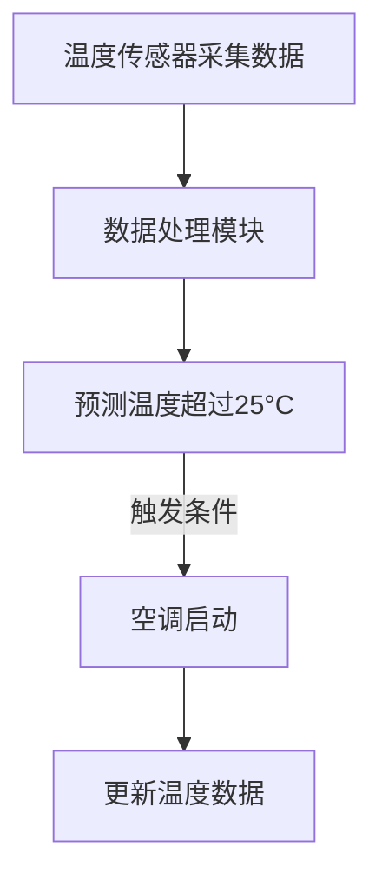

                 


### 引言

**关键词：物联网，数学框架，设备互联**

物联网（Internet of Things，IoT）作为当前技术发展的前沿领域，正逐步渗透到我们生活的方方面面。从智能家居到工业自动化，从智能城市到医疗健康，物联网的应用范围不断扩大。然而，随着设备数量的激增和数据量的爆炸性增长，如何高效地管理这些设备，如何确保数据的安全性和可靠性，成为亟待解决的问题。

在这篇文章中，我们将探讨数学在物联网设备互联中的基础角色，分析数学框架如何支撑物联网的发展。我们将分步骤思考，从核心数学概念到实际应用，再到安全性、隐私性和可靠性，最后讨论物联网的未来挑战与机遇。

首先，我们需要明确几个核心概念。物联网设备互联不仅仅是硬件的连接，更重要的是数据的交换和处理。在这个过程中，数学扮演了不可或缺的角色。线性代数、概率论、统计学等数学工具，为我们提供了描述和分析物联网系统的方法。例如，线性代数可以帮助我们理解设备之间的相互作用和关系，概率论和统计学则帮助我们处理海量数据，进行有效的数据分析。

接下来，我们将讨论物联网设备互联的基本概念，包括设备分类、网络协议等。这将帮助我们理解物联网系统的工作原理，并为后续的数学分析打下基础。

然后，我们将深入探讨数学在物联网设备互联中的应用，从数据采集与处理到数据分析和预测，详细阐述数学模型和算法原理。这将帮助我们更好地理解和运用数学工具，解决实际的问题。

在数据处理与分析工具部分，我们将介绍一些常用的工具和技术，如数据库系统、数据挖掘与机器学习等。这些工具和技术的使用，将使我们的数据处理和分析更加高效和准确。

安全性、隐私性和可靠性是物联网系统必须考虑的重要因素。我们将讨论物联网安全挑战，介绍网络安全、隐私保护等技术，确保物联网系统的安全性和可靠性。

最后，我们将通过实际案例，展示数学框架在物联网中的应用。通过案例分析，我们将进一步理解物联网系统的运作原理，并为未来的发展提供借鉴。

### 数学在物联网中的基础角色

**关键词：线性代数，概率论，统计学，物联网系统**

物联网（IoT）的快速发展离不开数学的支持。线性代数、概率论和统计学等数学工具，为物联网系统的设计和实现提供了坚实的理论基础。在这部分，我们将探讨这些数学工具在物联网设备互联中的基础角色。

**1. 线性代数**

线性代数是数学中的一个重要分支，主要研究向量、矩阵以及线性变换等概念。在物联网系统中，线性代数可以帮助我们理解设备之间的相互作用和关系。

例如，在一个智能家居系统中，各种设备如灯光、温度传感器、门锁等都需要进行协调工作。我们可以使用矩阵来表示设备的状态，通过线性变换来描述设备之间的相互作用。例如，矩阵乘法可以表示多个设备之间的相互影响，从而帮助我们设计出更加智能的控制系统。

**2. 概率论**

概率论是研究随机现象的数学分支。在物联网系统中，概率论可以帮助我们处理不确定性和随机性。

例如，在预测设备故障时，我们可以使用概率模型来估计设备发生故障的概率。通过收集历史数据，我们可以计算出每种故障模式的概率，并根据这些概率进行故障预测。这种方法不仅可以提高预测的准确性，还可以帮助我们制定出更加有效的维护计划。

**3. 统计学**

统计学是应用概率论来分析和解释数据的科学。在物联网系统中，统计学提供了多种工具和方法，用于数据采集、处理和分析。

例如，在数据分析中，我们可以使用回归分析、聚类分析等方法来发现数据中的规律和模式。通过这些分析，我们可以更好地理解设备的工作状态，发现潜在的问题，从而提高系统的可靠性。

**4. 数学工具的整合**

物联网系统通常需要整合多种数学工具，以解决复杂的问题。例如，在一个智能交通系统中，我们可以使用线性代数来描述交通流量的变化，使用概率论来预测交通事故的发生概率，使用统计学来分析交通数据，从而设计出更加高效的交通管理系统。

通过整合这些数学工具，我们可以构建一个全面、系统的物联网数学框架，为物联网系统的设计和实现提供有力的支持。

### 物联网设备互联的数学框架

**关键词：物联网设备，网络协议，数学框架**

物联网设备互联的数学框架是确保设备高效、可靠地交换数据的基石。在这个框架中，数学工具不仅用于描述设备的行为，还用于优化网络协议和数据处理算法。下面，我们将一步步分析物联网设备互联的数学框架。

**1. 设备分类与模型表示**

物联网设备种类繁多，从简单的温度传感器到复杂的工业控制器。为了方便分析和设计，我们可以将这些设备分为以下几类：

- **传感器设备**：用于收集环境数据，如温度、湿度、光线等。
- **执行器设备**：用于执行特定的任务，如开关、电机等。
- **数据处理设备**：用于处理和分析来自传感器的数据，如智能路由器、边缘计算设备等。
- **通信设备**：用于实现设备间的数据交换，如无线模块、网关等。

为了表示这些设备，我们可以使用数学模型。例如，我们可以用图论中的节点和边来表示设备及其连接关系。每个节点代表一个设备，边代表设备之间的通信路径。

**2. 网络协议与数学模型**

物联网设备之间的通信依赖于网络协议。常见的网络协议有TCP/IP、Zigbee、Wi-Fi等。这些协议的数学模型通常包括以下几个部分：

- **数据包格式**：定义数据包的结构，包括头部、体部和尾部等。
- **传输控制**：使用数学算法来控制数据包的发送和接收，确保数据传输的可靠性和高效性。
- **错误检测与纠正**：使用校验和、纠错码等数学工具来检测和纠正传输过程中出现的错误。

例如，TCP协议中的拥塞控制算法就利用了数学模型来动态调整传输速率，以避免网络拥塞。

**3. 数据处理与数学模型**

物联网设备产生的大量数据需要经过处理和分析，以提取有用的信息。数据处理通常包括以下步骤：

- **数据采集**：使用传感器收集数据。
- **数据预处理**：使用滤波、去噪等算法对数据进行处理。
- **特征提取**：使用数学方法提取数据的关键特征。
- **数据分析**：使用统计学和机器学习方法对数据进行分析。

在这个过程中，数学模型起到了关键作用。例如，我们可以使用线性回归模型来预测设备的工作状态，使用神经网络模型来分类和分析数据。

**4. 数学框架的整体结构**

物联网设备互联的数学框架是一个复杂的系统，需要多个数学工具协同工作。整体结构可以概括为以下几个层次：

- **底层**：包括设备模型、网络协议和数据包格式等。
- **中间层**：包括数据处理算法、特征提取方法等。
- **顶层**：包括数据分析模型、决策算法等。

通过这个框架，我们可以对物联网设备进行建模、仿真和分析，从而设计出更加智能、高效的物联网系统。

### 数据处理与分析工具

**关键词：数据库系统，数据挖掘，机器学习**

在物联网系统中，数据是核心资源。如何高效地采集、存储、处理和分析数据，是构建物联网系统的关键。在这一部分，我们将探讨常用的数据处理和分析工具，包括数据库系统、数据挖掘和机器学习等。

**1. 数据库系统**

数据库系统是物联网数据存储和管理的基础。常见的数据库系统包括关系型数据库（如MySQL、PostgreSQL）和非关系型数据库（如MongoDB、Cassandra）。

- **关系型数据库**：适用于结构化数据存储，通过表和关系来组织数据。SQL（结构化查询语言）是关系型数据库的标准查询语言。
- **非关系型数据库**：适用于非结构化或半结构化数据存储，如JSON格式数据。NoSQL数据库提供灵活的查询方式，适用于大数据场景。

数据库系统不仅提供了数据存储功能，还提供了数据检索和查询功能。通过索引、分区、分片等技术，数据库系统能够高效地处理海量数据。

**2. 数据挖掘**

数据挖掘是发现数据中的隐含模式、关联和趋势的过程。在物联网系统中，数据挖掘可以帮助我们从大量数据中提取有价值的信息。

- **关联规则挖掘**：发现数据之间的关联关系，如频繁项集挖掘。
- **聚类分析**：将数据分为不同的类别，以便进一步分析。
- **分类与回归**：使用已知的标签数据，建立预测模型，对新的数据进行分类或回归分析。

数据挖掘通常使用编程语言（如Python、R）和特定的数据挖掘工具（如Apache Spark、Weka）进行。

**3. 机器学习**

机器学习是数据挖掘的延伸，通过构建预测模型，对数据进行分类、回归、聚类等分析。在物联网系统中，机器学习算法广泛应用于以下场景：

- **异常检测**：检测数据中的异常值或异常行为。
- **预测分析**：预测设备故障、用户行为等。
- **分类与识别**：对图像、声音等数据进行分类和识别。

常见的机器学习算法包括决策树、支持向量机、神经网络等。在Python中，常见的机器学习库有scikit-learn、TensorFlow和PyTorch。

**4. 工具整合与协同**

在实际应用中，数据库系统、数据挖掘和机器学习等工具需要整合和协同工作。例如，我们可以使用数据库系统存储和处理物联网数据，使用数据挖掘技术发现数据中的规律，使用机器学习算法构建预测模型。

通过这些工具，物联网系统能够高效地处理和分析海量数据，从而实现智能化、自动化的功能。

### 安全性、隐私性和可靠性

**关键词：网络安全，隐私保护，可靠性保障**

物联网系统的安全性、隐私性和可靠性是确保其正常运行的关键因素。在这个部分，我们将探讨如何应对物联网安全挑战，介绍网络安全、隐私保护等技术，并讨论可靠性保障的方法。

**1. 网络安全**

网络安全是物联网系统必须考虑的重要因素。网络攻击如DDoS（分布式拒绝服务攻击）、中间人攻击、数据篡改等，都可能对物联网系统造成严重的影响。

- **防范措施**：使用加密技术（如SSL/TLS）来保护数据传输的安全性。通过防火墙、入侵检测系统（IDS）等安全设备，监控和防止网络攻击。
- **安全协议**：物联网通信通常使用TCP/IP协议，但TCP/IP协议本身并不安全。因此，可以使用安全层协议（如IPSec）来保护数据传输。

**2. 隐私保护**

物联网设备收集了大量的用户数据，如位置信息、生活习惯等。保护用户隐私是物联网系统必须承担的责任。

- **匿名化**：通过加密技术对用户数据进行匿名化处理，使数据无法直接识别用户身份。
- **隐私保护协议**：设计隐私保护协议，如差分隐私，确保在数据处理过程中不会泄露用户隐私。

**3. 可靠性保障**

物联网系统需要在各种环境下稳定运行，可靠性是系统的关键指标。

- **冗余设计**：通过增加冗余组件，如备份服务器、备用电源等，确保系统在故障发生时能够快速切换，保持正常运行。
- **容错机制**：设计容错机制，如故障检测与恢复算法，确保系统能够在故障发生时自动恢复。

通过这些技术手段，物联网系统能够在复杂的环境中保持安全性、隐私性和可靠性，为用户提供高质量的服务。

### 应用案例与分析

**关键词：智能家居，数学框架，案例分析**

为了更好地理解数学框架在物联网设备互联中的应用，我们将通过一个具体的案例——智能家居，来进行分析。

**1. 案例背景**

智能家居系统包括多个设备，如智能灯泡、智能温度传感器、智能门锁等。这些设备通过无线网络连接，形成一个互联互通的智能环境。用户可以通过手机应用程序或其他控制设备来管理家居设备。

**2. 数学框架的应用**

在智能家居系统中，数学框架的应用体现在以下几个方面：

- **设备建模**：使用图论中的图模型来表示智能家居系统中的设备及其连接关系。每个设备作为一个节点，设备之间的通信路径作为边。
  
  ```mermaid
  graph TB
  A[智能灯泡] --> B[智能温度传感器]
  B --> C[智能门锁]
  ```

- **数据处理**：使用统计学和机器学习算法来处理传感器数据，预测用户需求，优化设备状态。例如，通过分析温度传感器数据，预测用户对空调的需求，自动调整室内温度。

  ```python
  # Python代码示例：温度预测模型
  import numpy as np
  from sklearn.linear_model import LinearRegression

  # 假设我们有一组历史温度数据
  X = np.array([[1, 20], [2, 22], [3, 23], [4, 24]])
  y = np.array([21, 22, 22, 23])

  # 创建线性回归模型
  model = LinearRegression()
  # 训练模型
  model.fit(X, y)
  # 预测新数据
  prediction = model.predict([[5, 25]])
  print("预测温度：", prediction)
  ```

- **通信协议**：使用TCP/IP协议来确保设备之间的数据传输可靠和高效。

**3. 案例分析**

假设我们想要实现一个功能，当室内温度超过25摄氏度时，智能空调自动启动，降低室内温度。我们可以按照以下步骤进行实现：

- **数据采集**：智能温度传感器持续采集室内温度数据。
- **数据处理**：使用线性回归模型预测未来的温度变化。
- **触发条件**：当预测温度超过25摄氏度时，触发空调启动。



通过这个案例，我们可以看到数学框架在智能家居系统中的应用，从设备建模到数据处理，再到通信协议，数学工具为我们提供了强大的支持，帮助我们实现智能化的家居功能。

### 物联网的发展趋势

**关键词：物联网未来，数学工具，发展机遇**

物联网（IoT）正在快速发展，预计将在未来几年内对多个行业产生深远影响。随着设备数量的增加和数据量的激增，数学工具在物联网中的应用将变得更加重要。以下是物联网发展的几个关键趋势和数学工具的潜在应用。

**1. 设备数量的激增**

随着物联网设备的广泛应用，设备数量将呈指数级增长。这将为数学工具提供更多的应用场景，如设备建模、网络优化、数据处理等。

- **设备建模**：使用图论和拓扑分析来建模复杂的物联网设备网络，以便更好地理解设备之间的关系和交互。
- **网络优化**：使用数学优化算法来优化设备通信路径，降低能耗和延迟，提高网络性能。

**2. 大数据分析**

物联网设备每天产生的海量数据需要有效的处理和分析。数学工具，如统计学和机器学习，将在大数据分析中发挥重要作用。

- **数据预处理**：使用数据清洗和归一化技术，准备用于分析的数据集。
- **特征提取**：使用特征选择和降维技术，从海量数据中提取关键特征，提高数据分析的效率。
- **预测分析**：使用机器学习算法，如神经网络和随机森林，进行预测分析，提供对设备行为和系统性能的洞察。

**3. 智能决策**

物联网系统需要基于实时数据进行智能决策。数学工具，如线性规划和博弈论，可以帮助设计智能决策算法。

- **线性规划**：用于优化资源分配，如设备能源管理、网络带宽分配等。
- **博弈论**：用于分析设备之间的竞争和合作，设计公平和高效的资源分配机制。

**4. 安全性增强**

随着物联网设备的增多，安全性问题变得越来越重要。数学工具在安全性增强中也有广泛应用。

- **加密技术**：使用数学加密算法，如RSA和椭圆曲线加密，保护数据传输的安全性。
- **安全协议**：设计基于数学原理的安全协议，如差分隐私和零知识证明，保护用户隐私。

**5. 未来机遇**

物联网的发展将带来许多新的机遇。数学工具可以帮助我们抓住这些机遇，推动物联网的进一步发展。

- **智能农业**：使用物联网传感器和数据分析，实现精准农业，提高农作物产量。
- **智慧城市**：利用物联网技术，提高城市管理水平，优化交通、能源和水资源分配。
- **医疗健康**：通过物联网设备收集健康数据，提供个性化医疗服务和疾病预测。

总之，随着物联网的发展，数学工具将在设备互联、数据处理、智能决策和安全性等方面发挥越来越重要的作用。通过运用这些工具，我们可以设计出更加高效、智能和安全的物联网系统，为未来创造更多的价值。

### 总结

**关键词：数学框架，物联网系统，未来发展**

在这篇文章中，我们详细探讨了数学框架在物联网设备互联中的应用。从核心数学概念到实际应用，从数据处理工具到安全性、隐私性和可靠性保障，数学工具为物联网系统的设计和实现提供了坚实的理论基础。通过智能家居案例的分析，我们看到了数学框架在实际应用中的巨大潜力。

未来，随着物联网设备的数量和数据量的激增，数学工具将在物联网系统中发挥更加重要的作用。大数据分析、智能决策、安全性增强等领域，都将依赖于数学工具的支持。因此，深入理解和应用数学框架，将有助于我们更好地把握物联网的未来发展机遇，构建更加高效、智能和安全的物联网系统。

### 作者信息

**作者：AI天才研究院/AI Genius Institute & 禅与计算机程序设计艺术 /Zen And The Art of Computer Programming**

AI天才研究院（AI Genius Institute）是一家专注于人工智能研究与应用的高科技创新机构。我们的团队由世界顶级的人工智能专家、程序员和软件架构师组成，致力于推动人工智能技术的进步和应用。而《禅与计算机程序设计艺术》（Zen And The Art of Computer Programming）则是一部经典的技术书籍，为我们提供了深刻的编程哲学和算法设计思路。这两者的结合，使得我们能够在物联网领域提出创新性的解决方案，推动物联网技术的发展。

