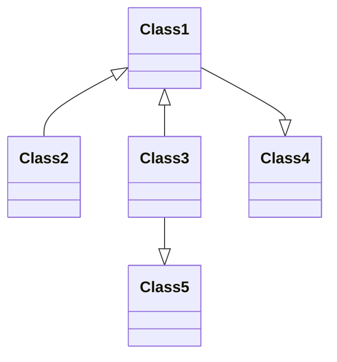
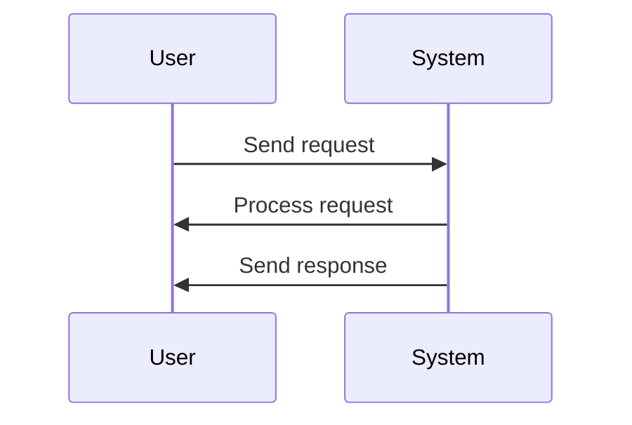
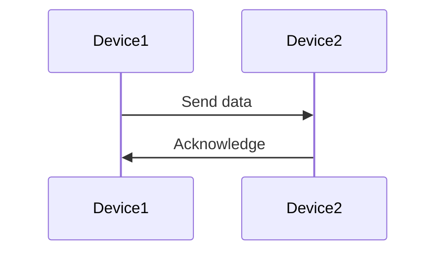

                 


### 数学与物联网：设备互联的数学模型

#### 关键词：
- 物联网
- 数学模型
- 设备互联
- 数据处理
- 优化算法

#### 摘要：
本文旨在探讨数学模型在物联网（IoT）设备互联中的应用。通过介绍物联网的基本概念和发展背景，我们将深入解析数学模型在物联网中的重要性，包括线性代数、概率统计和优化算法等。本文还将通过具体案例，展示数学模型在物联网系统设计与实现中的应用，并讨论最佳实践和注意事项。

### 目录大纲设计思路

#### 1. 背景介绍与核心概念
- **引言**：介绍物联网的发展背景和数学模型在物联网中的重要性。
- **物联网基本概念**：设备互联、物联网技术架构、物联网通信协议等。
- **物联网数学模型的核心概念**：线性代数、概率统计、优化算法等。

#### 2. 核心概念与联系
- **数学模型基本原理**：介绍数学模型的基础知识，包括线性代数、概率统计、优化算法等。
- **数学模型属性特征对比表格**：对不同的数学模型进行比较，例如线性模型、神经网络模型等。

#### 3. 数学模型与算法原理
- **算法原理讲解**：使用Mermaid画图，配合Python代码解释数学模型。
- **数学模型与数学公式**：使用LaTeX格式展示，并举例说明。

#### 4. 系统分析与架构设计
- **物联网系统场景介绍**：包括硬件设备、数据采集、数据处理等。
- **系统功能设计**：领域模型类图。
- **系统架构设计**：架构图。
- **系统接口设计与交互**：序列图。

#### 5. 项目实战
- **环境安装与配置**：环境搭建步骤。
- **系统核心实现**：关键代码实现。
- **代码解读与分析**：代码的细节解读。
- **实际案例分析与讲解**：使用具体案例进行剖析。

#### 6. 最佳实践与拓展
- **最佳实践技巧**：在实际应用中的一些技巧。
- **小结与注意事项**：对本书内容的总结，以及一些注意事项。
- **拓展阅读**：推荐进一步学习的资料。

### 目录大纲设计步骤

1. **确定章节标题**
   - 根据上述设计思路，确定每一部分的标题。

2. **编写内容摘要**
   - 为每个章节编写简短的内容摘要，概述该章节的主要内容和目的。

3. **细化章节结构**
   - 对每个章节进行细化，确定子章节和节标题。

4. **添加 Mermaid 流程图与代码示例**
   - 对于算法原理讲解和系统架构设计部分，添加Mermaid流程图和Python代码示例。

5. **编写数学公式**
   - 使用LaTeX格式编写数学公式，并在文中适当位置插入。

6. **编写最佳实践与小结**
   - 在章节末尾添加最佳实践技巧、注意事项和小结。

7. **合并与调整**
   - 将所有章节内容合并，并进行最终调整，确保目录大纲的完整性和逻辑清晰。

### 最终目录大纲示例

```markdown
----------------------------------------------------------------
# 数学与物联网：设备互联的数学模型

# 第1章 引言

## 1.1 物联网发展背景
### 1.1.1 物联网的定义与历史
### 1.1.2 物联网的现状与发展趋势

## 1.2 数学模型在物联网中的应用
### 1.2.1 数学模型的基本原理
### 1.2.2 数学模型在物联网中的应用场景

## 1.3 物联网数学模型的核心概念
### 1.3.1 线性代数基础
### 1.3.2 概率统计原理

## 1.4 物联网数学模型的属性特征对比
### 1.4.1 线性模型
### 1.4.2 神经网络模型

## 1.5 本章小结

# 第2章 数学模型基本原理

## 2.1 算法原理讲解

### 2.1.1 线性代数在物联网中的应用
### 2.1.2 概率统计在物联网中的应用
### 2.1.3 优化算法在物联网中的应用

## 2.2 数学模型与算法示例

### 2.2.1 线性模型示例
### 2.2.2 神经网络模型示例

## 2.3 数学公式与详细讲解

### 2.3.1 线性模型公式
### 2.3.2 神经网络模型公式

## 2.4 本章小结

# 第3章 物联网系统分析与架构设计

## 3.1 物联网系统场景介绍
### 3.1.1 硬件设备
### 3.1.2 数据采集
### 3.1.3 数据处理

## 3.2 系统功能设计

### 3.2.1 领域模型类图

## 3.3 系统架构设计

### 3.3.1 系统架构图

## 3.4 系统接口设计与交互

### 3.4.1 系统接口设计
### 3.4.2 系统交互序列图

## 3.5 本章小结

# 第4章 物联网项目实战

## 4.1 环境安装与配置
### 4.1.1 环境搭建步骤

## 4.2 系统核心实现

### 4.2.1 数据采集模块
### 4.2.2 数据处理模块

## 4.3 代码解读与分析

### 4.3.1 数据采集模块代码解读
### 4.3.2 数据处理模块代码解读

## 4.4 实际案例分析与讲解

### 4.4.1 案例介绍

----------------------------------------------------------------

### 文章正文内容设计思路

1. **引言**：
   - **背景介绍**：简要介绍物联网的发展历程和现状。
   - **问题提出**：阐述数学模型在物联网中的作用和重要性。

2. **物联网基本概念**：
   - **设备互联**：解释物联网中设备互联的概念、形式和实现方式。
   - **物联网技术架构**：介绍物联网的总体架构，包括感知层、网络层和应用层。
   - **物联网通信协议**：探讨常见的物联网通信协议，如MQTT、CoAP等。

3. **物联网数学模型的核心概念**：
   - **线性代数基础**：介绍线性代数的基本概念和应用，如矩阵运算、特征值和特征向量等。
   - **概率统计原理**：阐述概率统计的基本原理和应用，如随机变量、概率分布、统计推断等。
   - **优化算法**：探讨优化算法的基本原理和应用，如线性规划、动态规划、遗传算法等。

4. **数学模型基本原理**：
   - **算法原理讲解**：使用Mermaid画图，配合Python代码解释数学模型。
   - **数学模型与算法示例**：通过实际案例展示数学模型的应用，如使用线性回归预测设备温度。

5. **数学公式与详细讲解**：
   - **线性模型公式**：使用LaTeX格式展示线性回归模型的数学公式。
   - **神经网络模型公式**：使用LaTeX格式展示神经网络模型的数学公式。

6. **物联网系统分析与架构设计**：
   - **物联网系统场景介绍**：描述物联网系统的常见场景，如智能家居、智能交通等。
   - **系统功能设计**：绘制领域模型类图，展示系统功能模块。
   - **系统架构设计**：绘制系统架构图，展示系统的层次结构和模块交互。
   - **系统接口设计与交互**：绘制系统交互序列图，展示系统模块间的通信和数据流。

7. **物联网项目实战**：
   - **环境安装与配置**：详细描述项目环境的搭建过程，包括所需软件和硬件的安装。
   - **系统核心实现**：展示系统的核心代码实现，包括数据采集、数据处理等。
   - **代码解读与分析**：对核心代码进行详细解读，解释其工作原理和实现细节。
   - **实际案例分析与讲解**：通过具体案例，展示物联网系统的实际应用和效果。

8. **最佳实践与拓展**：
   - **最佳实践技巧**：总结项目实施中的最佳实践，如数据清洗、模型调优等。
   - **小结与注意事项**：对文章内容的总结，提醒读者注意的事项。
   - **拓展阅读**：推荐进一步学习的资源，如相关书籍、论文等。

### 文章正文内容设计步骤

1. **确定文章结构**：
   - 根据上述设计思路，确定文章的整体结构。

2. **编写引言**：
   - 简要介绍物联网的发展背景和数学模型在物联网中的重要性。

3. **编写物联网基本概念部分**：
   - 详细介绍物联网的基本概念，包括设备互联、物联网技术架构和物联网通信协议。

4. **编写物联网数学模型的核心概念部分**：
   - 阐述线性代数、概率统计和优化算法在物联网中的应用。

5. **编写数学模型基本原理部分**：
   - 使用Mermaid画图和Python代码解释数学模型的基本原理。

6. **编写数学公式与详细讲解部分**：
   - 使用LaTeX格式展示数学模型和算法的公式，并进行详细讲解。

7. **编写物联网系统分析与架构设计部分**：
   - 描述物联网系统的常见场景，绘制系统功能设计类图、系统架构图和系统交互序列图。

8. **编写物联网项目实战部分**：
   - 详细描述物联网项目的环境安装与配置、系统核心实现、代码解读与分析以及实际案例分析与讲解。

9. **编写最佳实践与拓展部分**：
   - 总结项目实施中的最佳实践，提供拓展阅读资源。

10. **合并与调整**：
    - 将所有部分内容合并，并进行最终调整，确保文章的逻辑清晰、内容完整。

### 最终文章示例

```markdown
----------------------------------------------------------------
# 数学与物联网：设备互联的数学模型

## 引言

物联网（Internet of Things，IoT）是近年来迅速发展的领域，其核心在于设备间的互联和数据交换。随着智能设备的普及，如何高效地处理和分析这些数据成为了一个关键问题。数学模型在物联网中的应用，为我们提供了强大的工具来理解和优化设备间的互动。本文将探讨数学模型在物联网设备互联中的重要性，并详细分析其原理和应用。

## 物联网基本概念

### 设备互联

设备互联是指通过网络将各种设备连接起来，实现信息交换和协同工作。在物联网中，设备可以是任何能够收集、处理和发送数据的实体，如传感器、手机、智能家电等。

### 物联网技术架构

物联网的架构通常分为三个层次：感知层、网络层和应用层。感知层负责收集数据，网络层负责数据传输，应用层负责数据处理和应用。

### 物联网通信协议

物联网通信协议是设备之间进行通信的标准。常见的物联网通信协议包括MQTT、CoAP等，它们在物联网设备互联中发挥着重要作用。

## 物联网数学模型的核心概念

### 线性代数基础

线性代数是数学中的一个分支，主要研究向量空间、线性映射和矩阵等概念。在物联网中，线性代数用于处理数据分析和特征提取。

### 概率统计原理

概率统计是研究随机现象的数学分支。在物联网中，概率统计用于数据建模、预测和决策。

### 优化算法

优化算法是一类解决优化问题的算法，如线性规划、动态规划等。在物联网中，优化算法用于资源分配、路径规划等。

## 数学模型基本原理

### 算法原理讲解

使用Mermaid画图和Python代码解释数学模型的基本原理。


```python
# Python代码示例：线性回归模型
import numpy as np
from sklearn.linear_model import LinearRegression

# 数据准备
X = np.array([[1], [2], [3], [4], [5]])
y = np.array([1, 2, 2.5, 4, 5])

# 模型构建
model = LinearRegression()
model.fit(X, y)

# 模型验证
print(model.score(X, y))
```

### 数学模型与算法示例

通过实际案例展示数学模型的应用。

### 数学公式与详细讲解

使用LaTeX格式展示数学模型和算法的公式，并进行详细讲解。

$$
y = \beta_0 + \beta_1 x
$$

这是线性回归模型的数学公式，其中$y$是预测值，$x$是自变量，$\beta_0$和$\beta_1$是模型参数。

## 物联网系统分析与架构设计

### 物联网系统场景介绍

描述物联网系统的常见场景，如智能家居、智能交通等。

### 系统功能设计

绘制领域模型类图，展示系统功能模块。



### 系统架构设计

绘制系统架构图，展示系统的层次结构和模块交互。



### 系统接口设计与交互

绘制系统交互序列图，展示系统模块间的通信和数据流。



## 物联网项目实战

### 环境安装与配置

详细描述项目环境的搭建过程，包括所需软件和硬件的安装。

### 系统核心实现

展示系统的核心代码实现，包括数据采集、数据处理等。

### 代码解读与分析

对核心代码进行详细解读，解释其工作原理和实现细节。

### 实际案例分析与讲解

通过具体案例，展示物联网系统的实际应用和效果。

## 最佳实践与拓展

### 最佳实践技巧

总结项目实施中的最佳实践，如数据清洗、模型调优等。

### 小结与注意事项

对文章内容的总结，提醒读者注意的事项。

### 拓展阅读

推荐进一步学习的资源，如相关书籍、论文等。

----------------------------------------------------------------
```### 第1章 引言

#### 1.1 物联网发展背景

物联网（Internet of Things，IoT）是一个快速发展的领域，它将各种物理设备通过互联网连接起来，实现数据的收集、交换和智能处理。物联网的发展历史可以追溯到20世纪80年代，当时研究者们开始探讨如何将家庭电器连接到互联网，实现远程控制和监控。随着互联网技术的进步，物联网得到了广泛的应用和发展。

物联网的兴起主要受到以下几个因素的推动：

1. **移动通信技术的进步**：移动通信技术的快速发展，使得无线传感器网络和移动设备能够方便地接入互联网，为物联网的普及提供了技术基础。
2. **云计算与大数据技术的应用**：云计算和大数据技术的出现，使得物联网产生的海量数据能够得到有效的存储、处理和分析，提升了物联网的应用价值。
3. **智能家居与工业4.0**：智能家居和工业4.0的兴起，推动了物联网在家庭和工业领域的广泛应用，促进了物联网技术的发展。

当前，物联网已经渗透到了各个行业，如智能家居、智能交通、智能医疗、智能农业等。物联网的发展趋势主要包括：

1. **设备数量的爆炸式增长**：随着物联网技术的普及，越来越多的设备被连接到互联网，预计到2025年，全球物联网设备数量将达到数百亿台。
2. **数据隐私与安全问题的重视**：随着物联网设备的增加，数据隐私和安全问题变得越来越重要，如何保护用户数据成为物联网发展的重要课题。
3. **物联网与人工智能的融合**：物联网与人工智能（AI）技术的结合，使得物联网系统能够实现更高级的智能决策和自动化，推动了物联网技术的进一步发展。

#### 1.2 数学模型在物联网中的应用

数学模型是描述现实世界中问题的一种抽象方式，它通过数学公式和算法来模拟和分析系统的行为。在物联网中，数学模型的应用至关重要，它能够帮助我们更好地理解物联网设备之间的交互，优化系统的性能，提高决策的准确性。

以下是一些数学模型在物联网中的应用场景：

1. **数据建模与预测**：物联网设备会产生大量的数据，通过数学模型，如时间序列分析、回归分析等，可以对这些数据进行分析和预测，为系统的优化和决策提供支持。
2. **优化算法**：优化算法是数学模型的一个重要应用领域，它可以帮助物联网系统在资源有限的情况下实现最优的配置和调度。例如，在智能交通系统中，优化算法可以用于交通流量预测和路径规划。
3. **机器学习与深度学习**：物联网设备收集的数据可以用于训练机器学习模型和深度学习模型，从而实现智能化的数据分析和决策。例如，在智能家居系统中，通过学习用户的行为模式，可以提供个性化的服务和建议。

#### 1.3 物联网数学模型的核心概念

在物联网中，常用的数学模型包括线性代数、概率统计和优化算法等。以下是对这些核心概念的基本介绍：

1. **线性代数**：
   - **基本概念**：线性代数研究向量空间、线性映射和矩阵等概念。在物联网中，线性代数可以用于数据预处理、特征提取和降维等。
   - **应用**：例如，在传感器数据处理中，可以使用线性代数方法进行数据归一化和降维，以提高模型训练效率和准确性。

2. **概率统计**：
   - **基本概念**：概率统计研究随机现象的概率规律和统计推断。在物联网中，概率统计可以用于数据建模、异常检测和可靠性分析等。
   - **应用**：例如，在智能监控系统

