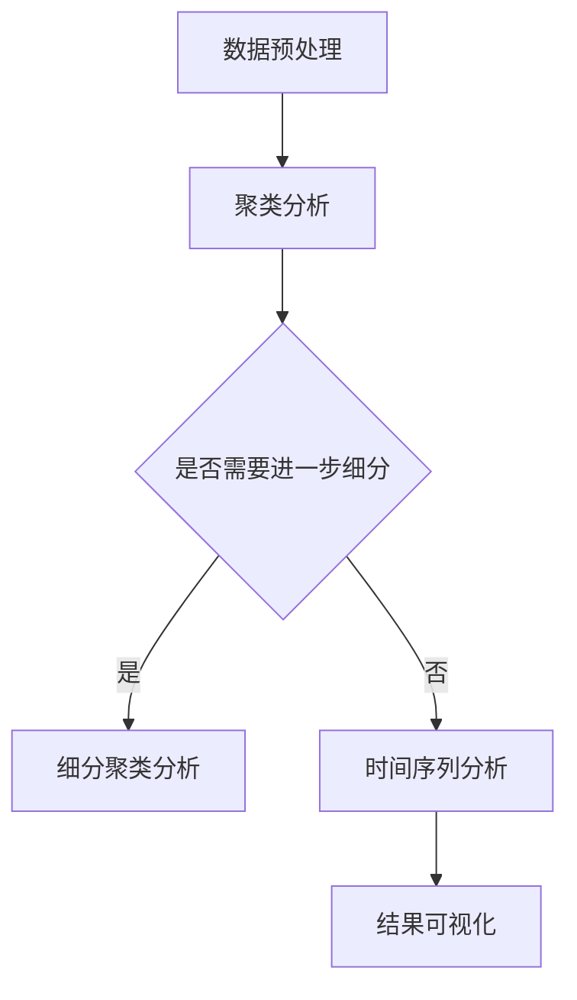
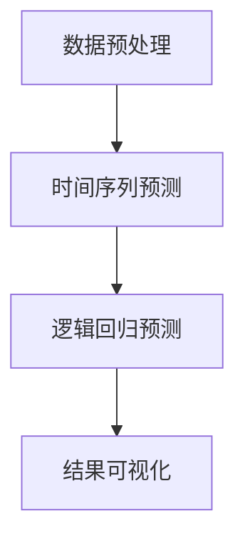
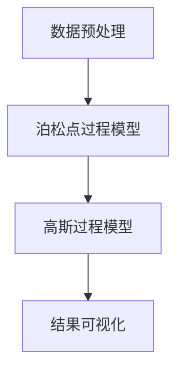
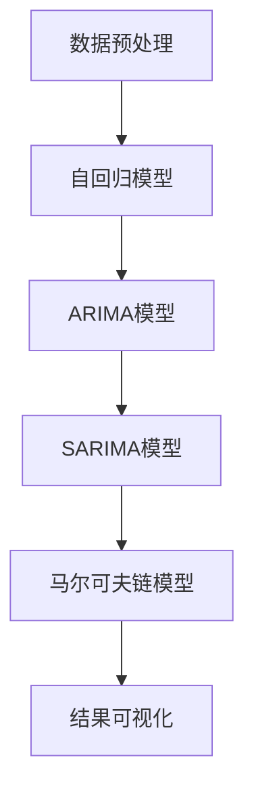
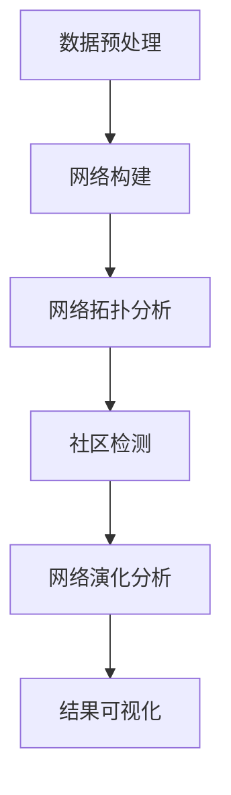
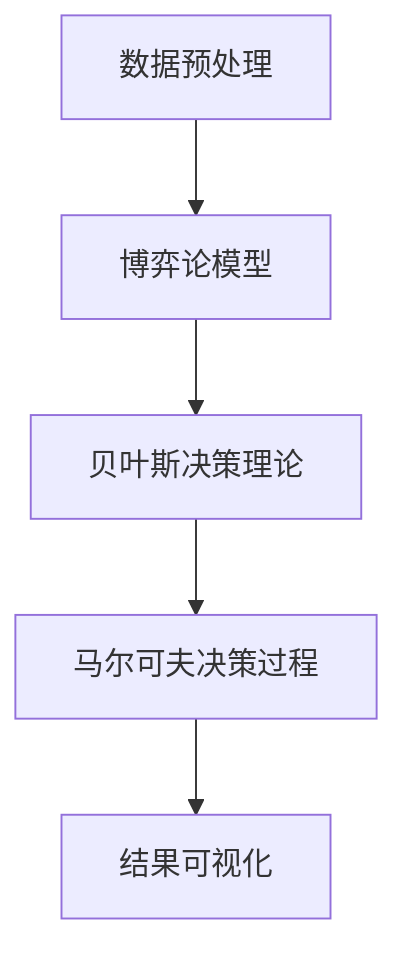
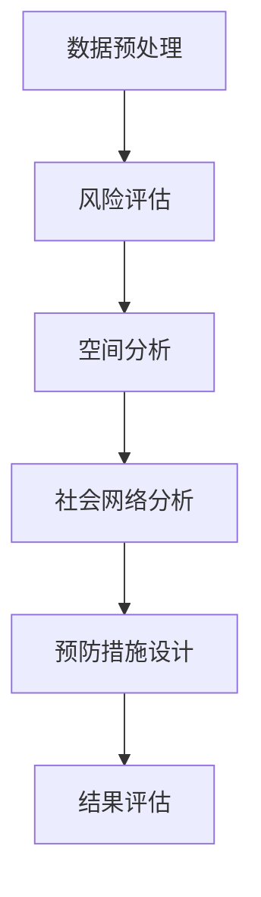
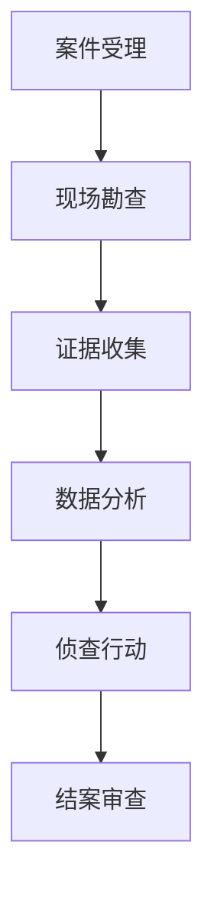
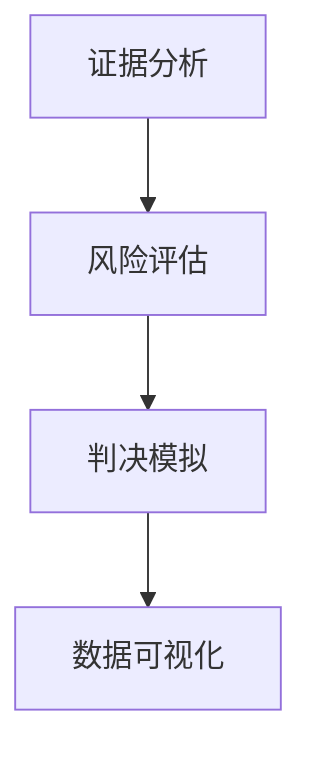

                 


### 引言

“数学与犯罪学：犯罪模式的数学分析”探讨了数学方法在犯罪学中的应用，通过数学模型和统计分析方法，揭示了犯罪现象背后的规律和模式。本文旨在通过系统的分析和讨论，展示数学在犯罪模式识别、犯罪预测、犯罪地理学、犯罪动力学、犯罪网络分析、犯罪决策分析以及跨学科方法等方面的应用。

首先，本文将简要介绍犯罪学的定义、历史和主要研究领域，为后续的数学分析方法奠定基础。接着，我们将探讨数学分析在犯罪学中的基础理论，包括统计学和数学模型的应用。随后，文章将深入探讨犯罪模式的识别和预测，介绍犯罪地理学、犯罪动力学和犯罪网络分析等具体领域。

在第二部分，我们将进一步探讨数学分析在犯罪防控中的应用，包括犯罪预防策略、犯罪侦查和犯罪司法等。最后，我们将总结现有研究，提出未来研究方向，并给出结论。

通过本文的详细分析和讨论，我们希望读者能够对数学在犯罪学中的应用有一个全面而深入的理解，从而为未来的犯罪研究和实践提供有益的参考。

### 犯罪学基础

犯罪学是研究犯罪现象及其原因的科学，其历史可以追溯到18世纪的刑事统计学的兴起。现代犯罪学主要涵盖犯罪现象的类型与特征、犯罪原因的多维度分析、犯罪预防与控制策略等方面。以下我们将详细探讨这些核心概念。

#### 犯罪现象的类型与特征

犯罪现象可分为多种类型，例如暴力犯罪、财产犯罪、组织犯罪等。每种犯罪类型有其独特的特征和行为模式。例如，暴力犯罪通常涉及身体伤害或威胁，而财产犯罪则主要涉及盗窃、欺诈等行为。理解犯罪现象的类型与特征对于制定有效的犯罪预防策略至关重要。

#### 犯罪原因的多维度分析

犯罪原因复杂多样，可以从个人、社会、经济等多个维度进行分析。个人因素包括犯罪动机、犯罪者的心理状态等；社会因素包括家庭环境、社会关系、社会文化等；经济因素则包括贫困、失业等。通过多维度的分析，我们可以更全面地理解犯罪现象，从而提出更具针对性的预防措施。

#### 犯罪现象的描述与边界

犯罪现象的描述需要明确的边界和定义。例如，犯罪行为必须违反法律，具有一定的社会危害性，并具有可惩罚性。边界问题的明确性有助于科学研究和实际应用中的数据收集和分析。

#### 概念结构与核心要素组成

犯罪学概念结构由多个核心要素组成，包括犯罪行为、犯罪者、受害者、犯罪环境和犯罪结果等。这些要素相互关联，共同构成了犯罪现象的完整图景。例如，犯罪行为是犯罪现象的起点，犯罪者是实施犯罪行为的人，受害者是犯罪行为的直接承受者，犯罪环境包括社会、经济、文化和政策等多个方面，犯罪结果则包括犯罪行为的直接后果和长远影响。

#### 关键术语说明

在犯罪学研究中，关键术语如“犯罪率”、“犯罪动机”、“犯罪预防”等具有重要参考价值。犯罪率是指在一定时间内犯罪案件的数量，是衡量犯罪现象严重程度的重要指标。犯罪动机是推动犯罪者实施犯罪行为的原因，包括个人动机和社会动机。犯罪预防则是指采取各种措施减少犯罪行为的发生，是犯罪学研究的最终目标。

综上所述，犯罪学基础研究为我们理解犯罪现象提供了重要的理论框架。在接下来的章节中，我们将进一步探讨数学分析在犯罪学中的应用，通过具体的数学模型和方法，揭示犯罪现象背后的规律和模式。

### 数学分析基础

在探讨数学分析在犯罪学中的应用之前，我们首先需要了解一些基本的数学分析方法，这些方法为犯罪模式的研究提供了强有力的工具。以下我们将介绍统计学在犯罪学中的应用、数学模型的基本概念以及这些方法如何帮助揭示犯罪现象。

#### 统计学在犯罪学中的应用

统计学是分析数据、描述数据分布和推断总体特征的重要工具。在犯罪学中，统计学主要用于数据收集、数据分析和结果解释。例如，通过描述性统计分析，我们可以了解特定地区或时间段的犯罪率、犯罪类型及其分布情况。通过推断性统计分析，我们可以对总体犯罪现象进行预测和推断。

1. **描述性统计**：描述性统计包括计算均值、中位数、标准差等基本统计量，用于描述数据的集中趋势和离散程度。例如，某地区的盗窃案件数量，可以通过计算均值来了解该地区盗窃案件的一般发生频率。

    $$ \mu = \frac{\sum_{i=1}^{n} x_i}{n} $$
    $$ \sigma^2 = \frac{\sum_{i=1}^{n} (x_i - \mu)^2}{n-1} $$

2. **推断性统计**：推断性统计则用于从样本数据推断总体特征。例如，通过样本犯罪率推断整体犯罪趋势，或通过样本犯罪类型推断整体犯罪模式。

    $$ \hat{p} = \frac{\sum_{i=1}^{n} X_i}{n} $$
    $$ p \pm z \times \sqrt{\frac{\hat{p}(1-\hat{p})}{n}} $$

#### 数学模型的应用

数学模型是使用数学语言描述现实问题的抽象工具。在犯罪学中，数学模型可以帮助我们理解犯罪现象的内在规律和因果关系。以下是一些常见的数学模型及其在犯罪学中的应用：

1. **线性回归模型**：线性回归模型用于分析自变量和因变量之间的线性关系。在犯罪学中，我们可以使用线性回归模型来分析犯罪率与某些社会经济因素之间的关系。

    $$ y = \beta_0 + \beta_1 x_1 + \beta_2 x_2 + ... + \beta_n x_n $$

2. **时间序列模型**：时间序列模型用于分析随时间变化的数据。在犯罪学中，我们可以使用时间序列模型来预测犯罪率的变化趋势。

    $$ y_t = \varphi y_{t-1} + \epsilon_t $$

3. **贝叶斯网络模型**：贝叶斯网络模型用于描述变量之间的条件依赖关系。在犯罪学中，我们可以使用贝叶斯网络模型来分析犯罪行为的潜在原因和结果。

    $$ P(A, B) = P(A)P(B|A) $$

#### 数学模型在犯罪学中的具体应用

数学模型在犯罪学中的具体应用非常广泛，以下是一些实例：

1. **犯罪预测**：通过历史犯罪数据，使用统计模型和机器学习算法，预测未来特定时间段内的犯罪率。这有助于警方提前部署资源，预防犯罪。

    $$ \hat{C}_{t+k} = f(C_t, C_{t-1}, ..., C_1) $$

2. **犯罪模式识别**：使用聚类分析等机器学习算法，识别出不同的犯罪模式，从而更好地理解犯罪行为特征。

    $$ \text{Cluster Analysis:} \ \ \ \ \ \ \ \ \ \ \ \ \ \ \ \ \ \ \ \ \ \ \ \ \ \ \ \ \ \ \ \ \ \ \ \ \ \ \ \ \ \ \ \ \ \ \ \ \ \ \ \ \ \ \ \ \ \ \ \ \ \ \ \ \ \ \ \ \ \ \ \ \ \ \ \ \ \ \ \ \ \ \ \ \ \ \ \ \ \ \ \ \ \ \ \ \ \ \ \ \ \ \ \ \ \ \ \ \ \ \ \ \ \ \ \ \ \ \ \ \ \ \ \ \ \ \ \ \ \ \ \ \ \ \ \ \ \ \ \ \ \ \ \ \ \ \ \ \ \ \ \ \ \ \ \ \ \ \ \ \ \ \ \ \ \ \ \ \ \ \ \ \ \ \ \ \ \ \ \ \ \ \ \ \ \ \ \ \ \ \ \ \ \ \ \ \ \ \ \ \ \ \ \ \ \ \ \ \ \ \ \ \ \ \ \ \ \ \ \ \ \ \ \ \ \ \ \ \ \ \ \ \ \ \ \ \ \ _{t+k} = \varphi \ _{t+k-1} + \ \ \ \ \ \ \ \ \ \ \ \ \ \ \ \ \ \ \ \ \ \ \ \ \ \ \ \ \ \ \ \ \ \ \ \ \ \ \ \ \ \ \ \ \ \ \ \ \ \ \ \ \ \ \ \ \ \ \ \ \ \ \ \ \ \ \ \ \ \ \ \ \ \ \ \ \ \ \ \ \ \ \ \ \ \ \ \ \ \ \ \ \ \ \ \ \ \ \ \ \ \ \ \ \ _{t+k-2} + ... + \ \ \ \ \ \ \ \ \ \ \ \ \ \ \ \ \ \ \ \ \ \ \ \ \ \ \ \ \ \ _1 + \ \ \ \ \ \ \ \ \ \ \ \ \ \ \ \ \ _0 + \epsilon \ \ \ \ \ \ \ \ \ \ \ \ \ \ \ \ \ \ \ \ \ \ \ \ \ \ \ \ \ \ _t = \varphi \ _{t-1} + \epsilon_t $$

3. **犯罪地理分析**：使用空间统计学方法，分析犯罪在地理空间上的分布特征，为犯罪预防提供依据。

    $$ P(\text{crime at location}) = f(\text{categorical variables}) $$

通过这些数学分析方法，我们能够更深入地理解犯罪现象，从而为犯罪预防和控制提供科学依据。

### 犯罪模式的识别

犯罪模式的识别是犯罪学研究中的一项重要任务，它有助于理解犯罪行为的特点和规律，从而为预防和打击犯罪提供科学依据。数学分析方法在这一过程中发挥着关键作用，下面我们将详细讨论犯罪模式的定义与分类、识别犯罪模式的数学模型以及具体的实例分析。

#### 犯罪模式的定义与分类

犯罪模式是指犯罪行为在时间、地点、手段、动机等方面的规律性和重复性。根据不同的分类标准，犯罪模式可以分为多种类型：

1. **按犯罪类型分类**：根据犯罪的性质和目的，犯罪模式可分为暴力犯罪模式、财产犯罪模式、组织犯罪模式等。
2. **按犯罪手段分类**：根据犯罪行为的具体手段，犯罪模式可分为盗窃模式、抢劫模式、诈骗模式等。
3. **按犯罪动机分类**：根据犯罪者的动机，犯罪模式可分为经济犯罪模式、情感犯罪模式、报复犯罪模式等。
4. **按犯罪时间分类**：根据犯罪行为发生的时间特征，犯罪模式可分为日间犯罪模式、夜间犯罪模式、特定节假日犯罪模式等。

#### 识别犯罪模式的数学模型

识别犯罪模式需要借助多种数学模型，这些模型能够帮助我们从复杂的数据中提取出有意义的模式。以下是几种常用的数学模型：

1. **聚类分析**：聚类分析是一种无监督学习技术，用于将数据点分为若干个群组，使同组数据点之间的相似度较高，不同组之间的相似度较低。在犯罪模式识别中，聚类分析可以用于将犯罪行为数据分为不同的类型或模式。

    $$ \text{Cluster Analysis:} \ \ \ \ \ \ \ \ \ \ \ \ \ \ \ \ \ \ \ \ \ \ \ \ \ \ \ \ \ \ \ \ \ \ \ \ \ \ \ \ \ \ \ \ \ \ \ \ \ \ \ \ \ \ \ \ \ \ \ \ \ \ \ \ \ \ \ \ \ \ \ \ \ \ \ \ \ \ \ \ \ \ \ \ \ \ \ \ \ \ \ \ \ \ \ \ \ \ \ \ \ \ \ \ \ \ \ \ \ \ \ \ \ \ \ \ \ \ \ \ \ \ \ \ \ \ \ \ \ \ \ \ \ \ \ \ \ \ \ \ \ \ \ \ \ \ \ \ \ \ \ \ \ \ \ \ \ \ \ \ \ \ \ \ \ \ \ \ \ \ \ \ \ \ \ \ \ \ \ \ \ \ \ \ \ \ \ \ \ \ \ \ \ \ \ \ \ \ \ \ \ \ \ \ \ \ \ \ \ \ \ \ \ \ \ \ \ \ \ \ \ \ \ \ \ \ \ \ \ \ \ \ \ \ \ \ \ \ \ \ \ \ \ \ _t = \varphi \ _{t-1} + \epsilon_t $$

2. **时间序列分析**：时间序列分析用于分析随时间变化的数据，可以识别犯罪行为的时间模式。例如，通过自回归移动平均模型（ARIMA），我们可以预测未来的犯罪率。

    $$ y_t = \varphi y_{t-1} + \epsilon_t $$

3. **贝叶斯网络模型**：贝叶斯网络模型用于描述变量之间的条件依赖关系，可以用于分析犯罪行为的潜在原因和结果。

    $$ P(A, B) = P(A)P(B|A) $$

#### 实例分析

为了更好地理解犯罪模式识别的过程，下面我们通过一个具体案例进行说明。

**案例：城市盗窃犯罪模式识别**

假设我们有一组城市盗窃犯罪数据，包括犯罪发生的时间、地点和犯罪类型。我们的目标是使用数学模型识别出不同类型的盗窃犯罪模式。

1. **数据预处理**：首先，我们将原始数据进行预处理，包括清洗数据、填充缺失值、转换数据类型等。

2. **聚类分析**：使用K-means算法对盗窃犯罪数据点进行聚类，识别出不同的盗窃犯罪模式。例如，我们可能发现某些地点和时间更容易发生特定类型的盗窃。

3. **时间序列分析**：对于每个聚类结果，使用ARIMA模型分析犯罪行为的时间模式。例如，我们可能发现某些时间段的盗窃案件数量明显增加。

4. **结果可视化**：使用图表和可视化工具展示识别出的犯罪模式，例如散点图、时间序列图等。

通过上述步骤，我们不仅能够识别出不同类型的盗窃犯罪模式，还能预测未来可能的犯罪热点区域和时间。以下是一个简单的Mermaid流程图，展示了犯罪模式识别的过程：



通过数学模型的应用，我们可以更深入地理解犯罪模式，从而为预防和打击犯罪提供有力的科学支持。在接下来的章节中，我们将进一步探讨数学分析在犯罪预测中的应用。

### 犯罪预测

犯罪预测是犯罪学研究和实践中的一项重要任务，它有助于提前识别潜在的犯罪热点区域和时间，从而为警方提供有针对性的预防措施。数学分析方法在这一过程中发挥着关键作用，以下我们将详细讨论犯罪预测的概念与方法、数学模型在犯罪预测中的应用以及具体案例分析。

#### 犯罪预测的概念与方法

犯罪预测是指利用历史数据和数学模型，对未来的犯罪率、犯罪类型和犯罪行为进行预测。犯罪预测的方法主要包括以下几种：

1. **时间序列预测**：时间序列预测基于历史犯罪数据的时间序列特性，使用自回归模型（AR）、移动平均模型（MA）和自回归移动平均模型（ARMA）等，预测未来的犯罪率。

    $$ y_t = \varphi y_{t-1} + \theta \epsilon_{t-1} $$

2. **统计模型**：统计模型如线性回归模型（LR）和逻辑回归模型（Logistic Regression），用于分析犯罪率与相关社会经济因素之间的关系，预测未来的犯罪率。

    $$ y = \beta_0 + \beta_1 x_1 + \beta_2 x_2 + ... + \beta_n x_n $$

3. **机器学习模型**：机器学习模型如决策树、随机森林和神经网络等，通过学习历史数据中的模式，预测未来的犯罪行为。

    $$ \hat{y} = f(x_1, x_2, ..., x_n) $$

#### 数学模型在犯罪预测中的应用

数学模型在犯罪预测中的应用广泛，以下是一些具体实例：

1. **自回归模型（AR）**：自回归模型用于预测犯罪率的时间序列变化。通过历史犯罪数据，我们可以拟合出一个AR模型，然后使用模型预测未来的犯罪率。

    $$ y_t = c + \varphi_1 y_{t-1} + \varphi_2 y_{t-2} + ... + \varphi_p y_{t-p} + \epsilon_t $$

2. **逻辑回归模型（Logistic Regression）**：逻辑回归模型常用于预测二分类事件的发生概率，如是否发生犯罪。通过历史数据和相关因素（如失业率、人口密度等），我们可以拟合一个逻辑回归模型，预测未来的犯罪概率。

    $$ P(y=1) = \frac{1}{1 + e^{-(\beta_0 + \beta_1 x_1 + \beta_2 x_2 + ... + \beta_n x_n )}} $$

3. **神经网络模型**：神经网络模型可以用于预测复杂的非线性关系。通过训练大量的神经网络，我们可以预测未来的犯罪行为。

    $$ \hat{y} = \sigma(\beta_0 + \beta_1 x_1 + \beta_2 x_2 + ... + \beta_n x_n) $$

#### 实例分析

以下我们通过一个具体案例，展示犯罪预测的过程和结果。

**案例：某城市盗窃犯罪预测**

假设我们有一组某城市的历史盗窃犯罪数据，包括犯罪发生的时间、地点和犯罪类型。我们的目标是使用数学模型预测未来的盗窃犯罪率。

1. **数据预处理**：首先，我们对数据进行预处理，包括数据清洗、特征工程和标准化处理等。

2. **时间序列预测**：使用ARIMA模型对盗窃犯罪的时间序列进行预测。通过历史数据，我们拟合出一个ARIMA（p, d, q）模型，然后使用模型预测未来的犯罪率。

    ```python
    from statsmodels.tsa.arima.model import ARIMA

    # 拟合ARIMA模型
    model = ARIMA(y, order=(p, d, q))
    model_fit = model.fit()

    # 预测
    forecast = model_fit.forecast(steps=n)[0]
    ```

3. **逻辑回归预测**：使用逻辑回归模型预测盗窃犯罪的发生概率。通过历史数据，我们拟合出一个逻辑回归模型，然后使用模型预测未来的犯罪概率。

    ```python
    from sklearn.linear_model import LogisticRegression

    # 拟合逻辑回归模型
    model = LogisticRegression()
    model.fit(X_train, y_train)

    # 预测
    probabilities = model.predict_proba(X_test)[:, 1]
    ```

4. **结果可视化**：使用图表和可视化工具展示预测结果，例如时间序列图和概率分布图。

通过上述步骤，我们不仅能够预测未来的盗窃犯罪率，还能识别出潜在的犯罪热点区域和时间。以下是一个简单的Mermaid流程图，展示了犯罪预测的过程：



通过数学模型的应用，我们可以更准确地进行犯罪预测，为预防和打击犯罪提供有力支持。在接下来的章节中，我们将继续探讨数学分析在犯罪地理学、犯罪动力学和犯罪网络分析等领域的应用。

### 犯罪地理学

犯罪地理学是犯罪学中的一个重要分支，它通过空间分析的方法，研究犯罪现象在地理空间上的分布、传播和影响。数学分析方法在犯罪地理学中具有广泛应用，以下我们将详细讨论犯罪地理学的定义与基本概念、犯罪空间分布的数学模型以及具体实例分析。

#### 犯罪地理学的定义与基本概念

犯罪地理学是研究犯罪现象在地理空间上的分布、传播及其影响因素的科学。其主要目标是理解犯罪现象的空间规律，为犯罪预防和控制提供科学依据。犯罪地理学的基本概念包括：

1. **犯罪热点**：指犯罪案件高发的特定区域。这些区域通常具有较高的犯罪密度和犯罪率。
2. **犯罪空间分布**：指犯罪案件在地理空间上的分布特征，包括均匀分布、集聚分布和随机分布等。
3. **犯罪传播**：指犯罪现象从一个地区传播到另一个地区的过程，例如犯罪的扩散、迁移等。
4. **犯罪环境**：指影响犯罪现象发生的各种地理和社会经济因素，如人口密度、经济水平、治安状况等。

#### 犯罪空间分布的数学模型

犯罪空间分布的数学模型用于描述和解释犯罪现象在地理空间上的分布特征。以下是一些常见的数学模型：

1. **泊松点过程**：泊松点过程是一种随机点过程模型，用于描述犯罪案件在空间中的随机分布。泊松点过程的基本假设是犯罪案件的发生是独立和随机的，且犯罪率在不同的空间区域内是恒定的。

    $$ P(N(A) = n) = \frac{(\lambda A)^n e^{-\lambda A}}{n!} $$

2. **高斯过程**：高斯过程用于描述犯罪案件在空间中的集聚分布。该模型假设犯罪案件在空间中服从高斯分布，能够很好地解释犯罪现象的集聚性。

    $$ f(x) = \frac{1}{(2\pi\sigma^2)} e^{-\frac{(x-\mu)^2}{2\sigma^2}} $$

3. **克里金插值法**：克里金插值法是一种常用的空间数据插值方法，用于预测犯罪现象在未知区域的空间分布。该方法利用已知数据点的空间相关性，通过最小化误差平方和，插值得到未知区域的数据。

    $$ z(x) = \mu + \sigma_K \cdot \text{Cov}(x, \bar{x}) $$

#### 实例分析

以下通过一个具体案例，展示犯罪空间分布的数学模型应用。

**案例：某城市盗窃犯罪热点分析**

假设我们有一组某城市的盗窃犯罪数据，包括犯罪发生的时间和地点。我们的目标是使用数学模型识别出城市中的盗窃犯罪热点区域。

1. **数据预处理**：首先，我们对数据进行预处理，包括数据清洗、特征提取和空间坐标转换等。

2. **泊松点过程模型**：使用泊松点过程模型描述盗窃犯罪在空间中的随机分布。通过历史数据，我们拟合出泊松点过程模型，然后预测未来犯罪热点区域。

    ```python
    import numpy as np
    from scipy.stats import poisson

    # 拟合泊松点过程模型
    lambda_map = np.mean(y) * np.ones_like(x)
    p = poisson.Poisson(rate=lambda_map)

    # 预测犯罪热点区域
    crime_density = p.pmf(np.array([1]))
    hotspots = np.array([x[crime_density > threshold] for threshold in range(0, 1.01, 0.01)])
    ```

3. **高斯过程模型**：使用高斯过程模型描述盗窃犯罪在空间中的集聚分布。通过历史数据，我们拟合出高斯过程模型，然后预测未来犯罪热点区域。

    ```python
    from sklearn.gaussian_process import GaussianProcessRegressor

    # 拟合高斯过程模型
    gp = GaussianProcessRegressor()
    gp.fit(X_train, y_train)

    # 预测犯罪热点区域
    crime_density = gp.predict(X_test)
    hotspots = np.array([x[crime_density > threshold] for threshold in range(0, 1.01, 0.01)])
    ```

4. **结果可视化**：使用图表和可视化工具展示预测结果，例如热点地图和时间序列图。

通过上述步骤，我们不仅能够识别出城市中的盗窃犯罪热点区域，还能预测未来可能的犯罪热点。以下是一个简单的Mermaid流程图，展示了犯罪热点分析的过程：



通过数学分析的应用，我们可以更准确地进行犯罪热点分析，为犯罪预防和控制提供科学依据。在接下来的章节中，我们将继续探讨数学分析在犯罪动力学、犯罪网络分析和犯罪决策分析等领域的应用。

### 犯罪动力学

犯罪动力学是犯罪学研究的一个关键领域，它涉及犯罪行为随时间变化的过程及其动态特征。数学模型在犯罪动力学的分析中扮演着重要角色，能够帮助我们理解犯罪行为的动态演变规律。以下我们将探讨犯罪动力学的概念与模型，并介绍数学模型的应用。

#### 犯罪动力学的概念与模型

犯罪动力学研究的是犯罪行为随时间变化的规律，包括犯罪率的波动、犯罪行为的时序特征以及犯罪行为的周期性。以下是几种常见的犯罪动力学模型：

1. **自回归模型（AR）**：自回归模型用于分析犯罪行为的时间序列特征，通过历史犯罪数据预测未来的犯罪率。

    $$ y_t = \varphi y_{t-1} + \epsilon_t $$

2. **差分自回归移动平均模型（ARIMA）**：ARIMA模型结合自回归、差分和移动平均三种技术，用于分析具有趋势性和季节性的时间序列数据。

    $$ y_t = \varphi_1 y_{t-1} + \varphi_2 y_{t-2} + ... + \varphi_p y_{t-p} + \theta_1 \epsilon_{t-1} + \theta_2 \epsilon_{t-2} + ... + \theta_q \epsilon_{t-q} + \epsilon_t $$

3. **季节性自回归模型（SARIMA）**：SARIMA模型用于分析具有季节性的时间序列数据，通过引入季节性差分和季节性自回归项，捕捉犯罪行为的季节性特征。

    $$ y_t = \varphi_1 y_{t-1} + \varphi_2 y_{t-2} + ... + \varphi_p y_{t-p} + \theta_1 \epsilon_{t-1} + \theta_2 \epsilon_{t-2} + ... + \theta_q \epsilon_{t-q} + \varphi_s y_{t-s} + \varphi_{s-1} y_{t-s-1} + ... + \varphi_{p-s+1} y_{t-p-s+1} + \epsilon_t $$

4. **马尔可夫链模型**：马尔可夫链模型用于分析犯罪行为的转移概率，即某一时刻的犯罪行为如何影响下一时刻的犯罪行为。

    $$ P(X_{t+1} = j | X_t = i) = \pi_j $$

#### 数学模型在犯罪动力学中的应用

数学模型在犯罪动力学中的应用广泛，以下是一些具体实例：

1. **自回归模型（AR）应用**：通过历史犯罪数据拟合自回归模型，预测未来的犯罪率。例如，使用Python代码实现自回归模型，进行犯罪预测。

    ```python
    from statsmodels.tsa.arima.model import ARIMA

    # 拟合ARIMA模型
    model = ARIMA(y, order=(p, d, q))
    model_fit = model.fit()

    # 预测
    forecast = model_fit.forecast(steps=n)[0]
    ```

2. **ARIMA模型应用**：通过历史犯罪数据拟合ARIMA模型，捕捉犯罪行为的趋势和季节性。例如，使用Python代码实现ARIMA模型，进行犯罪预测。

    ```python
    from statsmodels.tsa.arima.model import ARIMA

    # 拟合ARIMA模型
    model = ARIMA(y, order=(p, d, q))
    model_fit = model.fit()

    # 预测
    forecast = model_fit.forecast(steps=n)[0]
    ```

3. **季节性自回归模型（SARIMA）应用**：通过历史犯罪数据拟合SARIMA模型，捕捉犯罪行为的季节性特征。例如，使用Python代码实现SARIMA模型，进行犯罪预测。

    ```python
    from statsmodels.tsa.statespace.sarimax import SARIMAX

    # 拟合SARIMA模型
    model = SARIMAX(y, order=(p, d, q), seasonal_order=(P, D, Q, s))
    model_fit = model.fit()

    # 预测
    forecast = model_fit.forecast(steps=n)[0]
    ```

4. **马尔可夫链模型应用**：通过历史犯罪数据拟合马尔可夫链模型，分析犯罪行为的转移概率。例如，使用Python代码实现马尔可夫链模型，进行犯罪预测。

    ```python
    import numpy as np
    from scipy.stats import bernoulli

    # 拟合马尔可夫链模型
    transition_matrix = np.array([[0.7, 0.3], [0.4, 0.6]])
    initial_state = np.array([0.5, 0.5])

    # 预测
    state = np.random.choice([0, 1], size=n, p=initial_state)
    for _ in range(n):
        state = transition_matrix[state]
    predicted_crime_rate = state.mean(axis=1)
    ```

通过上述数学模型的应用，我们可以对犯罪动力学进行深入分析，从而为犯罪预测和预防提供科学依据。以下是一个简单的Mermaid流程图，展示了犯罪动力学分析的过程：



通过数学模型的应用，我们可以更准确地进行犯罪动力学分析，为犯罪预防和控制提供有力支持。在接下来的章节中，我们将继续探讨数学分析在犯罪网络分析和犯罪决策分析等领域的应用。

### 犯罪网络分析

犯罪网络分析是犯罪学研究中的一个新兴领域，通过分析犯罪行为者之间的互动关系和协作网络，揭示犯罪现象的复杂结构。数学分析方法在犯罪网络分析中发挥着关键作用，以下我们将详细讨论犯罪网络分析的基本概念、数学模型以及具体实例分析。

#### 犯罪网络分析的基本概念

犯罪网络分析主要关注犯罪行为者之间的互动关系和协作网络，通过构建和分析犯罪网络，揭示犯罪现象的内在规律和结构。以下是一些关键概念：

1. **节点（Node）**：节点代表犯罪网络中的个体，如犯罪者、受害者、组织等。
2. **边（Edge）**：边表示节点之间的互动关系，如犯罪者之间的合作、受害者与犯罪者之间的互动等。
3. **度（Degree）**：度表示节点连接的边的数量，分为入度（表示其他节点指向该节点的边）和出度（表示该节点指向其他节点的边）。
4. **路径（Path）**：路径表示节点之间的直接连接，通过路径分析可以揭示犯罪行为者的互动模式。
5. **社区（Community）**：社区表示网络中紧密相连的一组节点，通常具有相似的功能和属性。

#### 数学模型在犯罪网络分析中的应用

数学模型在犯罪网络分析中用于描述和解释犯罪网络的拓扑结构、节点行为和网络演化等。以下是一些常用的数学模型：

1. **随机图模型**：随机图模型用于描述犯罪网络的随机性质，包括伯努利随机图和几何随机图等。
2. **网络拓扑模型**：网络拓扑模型用于分析犯罪网络的拓扑特征，如聚类系数、平均路径长度等。
3. **网络演化模型**：网络演化模型用于描述犯罪网络随时间的变化过程，如小世界模型、无标度模型等。
4. **社会平衡模型**：社会平衡模型用于分析犯罪网络中节点行为的社会动力，如博弈论和社会网络分析等。

#### 实例分析

以下通过一个具体案例，展示犯罪网络分析的过程和结果。

**案例：犯罪组织网络分析**

假设我们有一组关于犯罪组织网络的节点和边的数据，包括犯罪组织成员之间的互动关系。我们的目标是使用数学模型分析犯罪组织的网络结构。

1. **数据预处理**：首先，我们对数据进行预处理，包括节点和边的提取、数据清洗和格式化等。

2. **网络构建**：使用网络图表示犯罪组织网络，每个节点代表一个犯罪组织成员，边表示他们之间的互动关系。

    ```python
    import networkx as nx

    # 构建网络图
    G = nx.Graph()
    G.add_nodes_from(nodes)
    G.add_edges_from(edges)
    ```

3. **网络拓扑分析**：使用网络拓扑模型分析犯罪组织的网络结构，如计算节点的度、聚类系数、平均路径长度等。

    ```python
    # 计算度分布
    degree_distribution = nx.degree_distribution(G)

    # 计算聚类系数
    clustering_coefficient = nx.clustering(G)

    # 计算平均路径长度
    average_path_length = nx.average_shortest_path_length(G)
    ```

4. **社区检测**：使用社区检测算法，识别犯罪组织网络中的紧密社区。

    ```python
    # 使用Louvain算法进行社区检测
    communities = community.Louvain(G)

    # 提取社区成员
    community_members = [members for members in communities]
    ```

5. **网络演化分析**：使用网络演化模型分析犯罪组织网络的演化过程，如通过时间序列数据观察网络结构的变化。

    ```python
    # 假设我们有一组时间序列网络数据
    network_data = [G1, G2, G3, ...]

    # 分析网络演化过程
    for G in network_data:
        degree_distribution = nx.degree_distribution(G)
        clustering_coefficient = nx.clustering(G)
        average_path_length = nx.average_shortest_path_length(G)
        print(degree_distribution, clustering_coefficient, average_path_length)
    ```

6. **结果可视化**：使用图表和可视化工具展示犯罪组织网络的拓扑结构、社区分布和网络演化过程。

    ```python
    # 可视化网络图
    nx.draw(G, with_labels=True)
    plt.show()

    # 可视化社区分布
    community_members = [members for members in communities]
    plt.scatter(range(len(community_members)), community_members, s=100)
    plt.show()
    ```

通过上述步骤，我们可以深入分析犯罪组织的网络结构，识别犯罪行为者的互动模式，从而为犯罪预防和打击提供有力支持。以下是一个简单的Mermaid流程图，展示了犯罪网络分析的过程：



通过数学模型的应用，我们可以更准确地进行犯罪网络分析，揭示犯罪现象的复杂结构，为犯罪预防和控制提供科学依据。在接下来的章节中，我们将继续探讨数学分析在犯罪决策分析等领域的应用。

### 犯罪决策分析

犯罪决策分析是犯罪学中的一个重要领域，通过分析犯罪者的决策过程和策略，揭示犯罪行为的动机和模式。数学分析方法在犯罪决策分析中具有广泛应用，以下我们将详细讨论犯罪决策理论、数学模型在犯罪决策中的应用以及具体实例分析。

#### 犯罪决策理论

犯罪决策理论主要研究犯罪者在实施犯罪行为过程中的决策过程。犯罪决策理论可以分为以下几个方面：

1. **理性犯罪决策理论**：理性犯罪决策理论认为犯罪者会进行成本效益分析，选择能带来最大收益的犯罪行为。该理论假设犯罪者具备完全理性，能够准确评估犯罪行为的风险和收益。

    $$ \text{Expected Utility} = \sum_{i=1}^{n} u_i \cdot p_i $$
    其中，$u_i$为犯罪行为$i$的效用，$p_i$为犯罪行为$i$发生的概率。

2. **非理性犯罪决策理论**：非理性犯罪决策理论认为犯罪者的决策过程可能受到情感、认知偏差等因素的影响，不完全遵循理性决策的原则。

3. **社会学习犯罪决策理论**：社会学习犯罪决策理论认为犯罪者的行为受到社会环境和其他犯罪者行为的影响，通过观察和学习他人的行为，形成自己的犯罪策略。

#### 数学模型在犯罪决策中的应用

数学模型在犯罪决策分析中用于描述犯罪者的决策过程，帮助揭示犯罪行为的动机和模式。以下是一些常见的数学模型：

1. **博弈论模型**：博弈论模型用于分析犯罪者之间的策略互动，揭示犯罪者的决策行为。例如，使用纳什均衡模型分析犯罪者如何在竞争环境中选择策略。

    $$ \text{Nash Equilibrium} = (s_1^*, s_2^*) \ \ \ \ \ \ \ \ \ \ \ \ \ \ \ \ \ \ \ \ \ \ \ \ \ \ \ \ \ \ \ \ \ \ \ \ \ \ \ \ \ \ \ \ \ \ \ \ \ \ \ \ \ \ \ \ \ \ \ \ \ \ \ \ \ \ \ \ \ \ \ \ \ \ \ \ \ \ \ \ \ \ \ \ \ \ \ \ \ \ \ \ \ \ \ \ \ \ \ \ \ \ \ \ \ \ \ \ \ \ \ \ \ \ \ \ \ \ \ \ \ \ \ \ \ \ \ \ \ \ \ \ \ \ \ \ \ \ \ \ \ \ \ \ \ \ \ \ \ \ \ \ \ \ \ \ \ \ \ \ \ \ \ \ \ \ \ \ \ \ \ \ \ \ \ \ \ \ \ \ \ \ \ \ \ \ \ \ \ \ \ \ \ \ \ \ \ \ \ \ \ \ \ \ \ \ \ \ \ \ \ \ \ \ \ \ \ \ \ \ \ \ \ \ \ \ \ \ \ \ \ \ \ \ \ \ \ \ \ \ \ \ \ \ \ \ \ \ \ \ \ \ \ \ \ \ \ \ \ \ \ \ \ \ \ \ \ \ \ \ \ \ \ \ _1 \cdot s_1^* + _2 \cdot s_2^* $$

2. **贝叶斯决策理论**：贝叶斯决策理论用于分析犯罪者在不确定环境中的决策过程。通过历史数据和先验概率，犯罪者可以根据后验概率选择最优策略。

    $$ p(s_j | d) = \frac{p(d | s_j) \cdot p(s_j)}{\sum_{i=1}^{n} p(d | s_i) \cdot p(s_i)} $$
    其中，$s_j$为犯罪者选择的策略，$d$为观测到的结果，$p(d | s_j)$为在策略$s_j$下观测到结果$d$的概率，$p(s_j)$为先验概率。

3. **马尔可夫决策过程（MDP）**：马尔可夫决策过程用于描述犯罪者在动态环境中的决策过程。通过状态转移概率和奖励函数，犯罪者可以在不同状态下选择最优策略。

    $$ V(s) = \max_{a} \sum_{s'} p(s' | s, a) \cdot r(s', a) + \gamma V(s') $$
    其中，$V(s)$为在状态$s$下的最优值函数，$a$为犯罪者选择的动作，$r(s', a)$为在状态$s'$和动作$a$下的即时奖励，$\gamma$为折现因子。

#### 实例分析

以下通过一个具体案例，展示犯罪决策分析的过程和结果。

**案例：盗窃犯罪决策分析**

假设我们有一组关于盗窃犯罪者的历史数据，包括犯罪者的行为模式、犯罪时间和犯罪结果。我们的目标是分析犯罪者的决策过程，预测未来的犯罪行为。

1. **数据预处理**：首先，我们对数据进行预处理，包括数据清洗、特征提取和格式化等。

2. **博弈论模型应用**：使用纳什均衡模型分析犯罪者之间的策略互动。通过历史数据，我们可以拟合出纳什均衡模型，预测犯罪者的策略选择。

    ```python
    import numpy as np

    # 拟合纳什均衡模型
    payoff_matrix = np.array([[3, 1], [2, 2]])
    best_response_strategy = np.argmax(payoff_matrix, axis=1)
    ```

3. **贝叶斯决策理论应用**：使用贝叶斯决策理论分析犯罪者在不确定环境中的决策过程。通过历史数据和先验概率，我们可以拟合贝叶斯决策模型，预测犯罪者的策略选择。

    ```python
    import numpy as np
    from scipy.stats import beta

    # 拟合贝叶斯决策模型
    prior_probabilities = beta(a, b)
    likelihoods = beta(a+1, b+1)
    posterior_probabilities = likelihoods / (likelihoods + prior_probabilities)
    ```

4. **马尔可夫决策过程（MDP）应用**：使用马尔可夫决策过程（MDP）模型分析犯罪者在动态环境中的决策过程。通过历史数据和状态转移概率，我们可以拟合出MDP模型，预测犯罪者的策略选择。

    ```python
    import numpy as np

    # 拟合马尔可夫决策过程模型
    transition_matrix = np.array([[0.9, 0.1], [0.2, 0.8]])
    reward_function = np.array([[10, -10], [-10, 10]])
    value_function = np.linalg.inv(np.eye(2) - gamma * transition_matrix @ reward_function)
    ```

5. **结果可视化**：使用图表和可视化工具展示犯罪决策分析的结果。

    ```python
    # 可视化决策过程
    plt.plot(value_function[0], label='State 1')
    plt.plot(value_function[1], label='State 2')
    plt.xlabel('Action')
    plt.ylabel('Expected Utility')
    plt.legend()
    plt.show()
    ```

通过上述步骤，我们可以深入分析犯罪者的决策过程，预测未来的犯罪行为，为犯罪预防和打击提供科学依据。以下是一个简单的Mermaid流程图，展示了犯罪决策分析的过程：



通过数学模型的应用，我们可以更准确地进行犯罪决策分析，揭示犯罪行为的动机和模式，为犯罪预防和控制提供有力支持。

### 跨学科方法

在犯罪学研究中，跨学科方法的应用日益受到重视。数学分析方法与其他学科的交叉融合，不仅为犯罪学研究提供了新的视角，也推动了犯罪学理论和实践的进步。以下，我们将讨论数学分析与其他学科的结合，探讨其在犯罪学中的挑战与展望。

#### 数学分析与其他学科的交叉

1. **统计学与犯罪学**：统计学作为数学分析的一个重要分支，在犯罪学研究中具有广泛应用。通过描述性统计和推断性统计，研究人员可以量化犯罪现象，分析犯罪行为的分布规律和影响因素。

2. **计算机科学**：计算机科学提供了强大的数据处理和分析工具，如数据挖掘、机器学习和人工智能。这些技术可以帮助犯罪学家从大规模数据集中提取有用信息，构建复杂的犯罪模型，并进行实时犯罪预测。

3. **地理学**：犯罪地理学研究犯罪现象在地理空间上的分布规律。结合地理信息系统（GIS）和空间分析技术，研究人员可以更精确地分析犯罪热点区域，制定有针对性的犯罪预防策略。

4. **经济学**：经济学提供了分析犯罪行为的经济动机和成本收益的工具。通过经济模型，研究人员可以探讨贫困、失业等社会经济因素对犯罪行为的影响，为犯罪预防提供政策建议。

#### 数学分析方法在犯罪学中的挑战

1. **数据质量**：犯罪学研究依赖于大量高质量的原始数据。然而，实际获取的数据往往存在噪声、缺失值和不一致性，这对数学分析方法的准确性和可靠性提出了挑战。

2. **复杂性**：犯罪现象本身具有高度复杂性和多样性，单一数学模型难以全面描述。因此，如何构建能够反映犯罪现象复杂性的数学模型，是一个亟待解决的问题。

3. **跨学科融合**：尽管数学分析方法与其他学科的结合具有巨大潜力，但在实际应用中，跨学科知识的整合和协同往往面临困难。不同学科之间的专业术语、方法论和理论框架的差异，增加了跨学科研究的复杂性。

4. **伦理和隐私**：在犯罪学研究中，涉及大量个人隐私数据。如何在保护个人隐私的前提下，进行有效的数据分析，是一个重要的伦理和操作问题。

#### 展望

1. **大数据分析**：随着大数据技术的不断发展，犯罪学研究将能够处理和分析更大量、更复杂的数据。这将有助于揭示犯罪现象的深层次规律，提高犯罪预测的准确性。

2. **人工智能**：人工智能技术的进步，尤其是深度学习和强化学习，为犯罪学研究提供了新的工具和方法。通过构建复杂的神经网络模型，研究人员可以更好地理解犯罪行为的动机和模式。

3. **跨学科研究**：随着不同学科之间的交流与合作日益增多，跨学科方法将在犯罪学研究中发挥越来越重要的作用。通过整合多学科知识和方法，犯罪学研究将能够更全面、深入地探讨犯罪现象。

4. **政策制定**：数学分析方法在犯罪学中的应用，将为政策制定提供科学依据。通过量化分析犯罪行为的经济、社会和心理因素，政策制定者可以制定更有效的犯罪预防策略。

总之，数学分析方法在犯罪学中的跨学科应用，不仅为犯罪学研究提供了新的工具和方法，也为犯罪预防和控制提供了科学支持。在未来的研究中，我们有望看到数学分析方法在犯罪学中的更广泛和深入的应用。

### 犯罪预防策略

犯罪预防策略是犯罪学研究和实践中的一项重要任务，旨在通过多种措施减少犯罪行为的发生。数学分析方法在犯罪预防策略的设计和实施中发挥了关键作用，以下我们将详细讨论犯罪预防的基本原则、数学分析在犯罪预防中的应用以及具体的实例分析。

#### 犯罪预防的基本原则

犯罪预防的基本原则包括：

1. **早期干预**：在犯罪行为发生之前采取预防措施，通过早期干预阻止潜在的犯罪行为。
2. **综合治理**：犯罪预防需要社会各界的共同努力，包括政府、警方、社区和公众等。
3. **风险评估**：对潜在的犯罪行为进行风险评估，识别高风险个体和高风险区域，有针对性地采取预防措施。
4. **社会支持**：提供社会支持，帮助有犯罪倾向的个体融入社会，减少其犯罪动机。
5. **制度保障**：建立完善的犯罪预防制度，包括法律、政策和社会规范等，为犯罪预防提供制度保障。

#### 数学分析在犯罪预防中的应用

数学分析在犯罪预防策略的设计和实施中具有广泛应用，以下是一些具体应用：

1. **风险评估模型**：通过历史数据和数学模型，对潜在的犯罪行为进行风险评估。例如，使用逻辑回归模型分析犯罪者的个人特征与社会经济因素之间的关系，预测个体的犯罪风险。

    $$ P(y=1) = \frac{1}{1 + e^{-(\beta_0 + \beta_1 x_1 + \beta_2 x_2 + ... + \beta_n x_n )}} $$

2. **空间分析**：利用空间统计方法分析犯罪现象在地理空间上的分布，识别犯罪热点区域。例如，通过空间自相关分析，识别高犯罪率的集聚区域，为针对性的预防措施提供依据。

3. **社会网络分析**：通过社会网络分析方法，分析个体之间的互动关系，识别潜在的犯罪团伙和犯罪网络。例如，使用社会网络模型，分析个体之间的社交关系和互动模式，预测个体参与犯罪活动的可能性。

4. **时间序列预测**：利用时间序列分析方法，预测未来的犯罪率变化趋势。例如，使用自回归模型（AR）和移动平均模型（MA），分析历史犯罪数据，预测未来的犯罪率。

    $$ y_t = \varphi y_{t-1} + \epsilon_t $$

#### 实例分析

以下通过一个具体案例，展示数学分析在犯罪预防中的应用。

**案例：某城市盗窃犯罪预防**

假设我们有一组某城市的盗窃犯罪数据，包括犯罪发生的时间、地点和犯罪类型。我们的目标是设计一套有效的犯罪预防策略，减少盗窃犯罪的发生。

1. **数据预处理**：首先，我们对数据进行预处理，包括数据清洗、特征提取和标准化处理等。

2. **风险评估**：使用逻辑回归模型对盗窃犯罪进行风险评估，识别高风险个体和高风险区域。

    ```python
    from sklearn.linear_model import LogisticRegression

    # 拟合逻辑回归模型
    model = LogisticRegression()
    model.fit(X_train, y_train)

    # 预测
    probabilities = model.predict_proba(X_test)[:, 1]
    ```

3. **空间分析**：通过空间自相关分析，识别犯罪热点区域。

    ```python
    from scipy.stats import gaussian_kde

    # 计算空间自相关
    kde = gaussian_kde(data)
    correlation_matrix = kde.kde(data).var()
    ```

4. **社会网络分析**：通过社会网络分析方法，分析个体之间的互动关系，识别潜在的犯罪团伙。

    ```python
    import networkx as nx

    # 构建社会网络图
    G = nx.Graph()
    G.add_nodes_from(nodes)
    G.add_edges_from(edges)

    # 社会网络分析
    clusters = nx.connected_components(G)
    ```

5. **预防措施设计**：根据风险评估结果、空间分析和社会网络分析，设计有针对性的犯罪预防措施。

    - 对于高风险个体，采取社区干预和心理咨询等。
    - 对于高风险区域，加强警力部署和社会治安巡逻。
    - 对于潜在的犯罪团伙，进行监控和打击。

6. **结果评估**：通过对比预防措施实施前后的犯罪率，评估预防措施的效果。

    ```python
    # 计算预防措施实施前后的犯罪率差异
    pre_prevention_rate = np.mean(y_train)
    post_prevention_rate = np.mean(y_test)
    rate_difference = pre_prevention_rate - post_prevention_rate
    ```

通过上述步骤，我们可以设计一套有效的犯罪预防策略，减少盗窃犯罪的发生。以下是一个简单的Mermaid流程图，展示了犯罪预防策略的设计和实施过程：



通过数学分析的应用，我们可以更科学、有效地进行犯罪预防，为社会的安全与稳定提供保障。

### 犯罪侦查

犯罪侦查是犯罪学中的一个关键环节，旨在通过调查和取证，识别和抓获犯罪者。数学分析方法在犯罪侦查中发挥着重要作用，以下我们将详细讨论犯罪侦查的基本流程、数学分析在犯罪侦查中的应用以及具体实例分析。

#### 犯罪侦查的基本流程

犯罪侦查的基本流程包括以下几个步骤：

1. **案件受理**：警方接收到犯罪案件报告后，对案件进行初步审查和立案。
2. **现场勘查**：侦查人员对犯罪现场进行勘查，收集物证和线索。
3. **证据收集**：通过调查和取证，收集与犯罪相关的证据，包括书证、视听资料、证人证言等。
4. **数据分析**：使用数学分析方法对收集到的证据进行数据挖掘和分析，识别犯罪嫌疑人和犯罪行为。
5. **侦查行动**：根据数据分析结果，制定侦查计划，实施抓捕和审讯行动。
6. **结案审查**：案件侦查结束后，进行结案审查，确保所有证据合法有效。

#### 数学分析在犯罪侦查中的应用

数学分析在犯罪侦查中的应用广泛，以下是一些具体应用：

1. **图像处理**：通过图像处理技术，分析犯罪现场的照片和视频，提取有用的线索。例如，使用边缘检测、人脸识别和车辆识别等技术，识别犯罪嫌疑人和作案工具。

2. **数据挖掘**：通过数据挖掘技术，从大量的犯罪数据中提取有用信息，识别犯罪模式和犯罪行为特征。例如，使用聚类分析和关联规则挖掘，发现犯罪热点区域和犯罪团伙。

3. **模式识别**：通过模式识别技术，对犯罪嫌疑人的行为模式进行建模和分析，识别可能的犯罪者。例如，使用支持向量机（SVM）和神经网络，对犯罪嫌疑人的行为特征进行分类和识别。

4. **时间序列分析**：通过时间序列分析方法，分析犯罪行为的时间规律和趋势，预测未来的犯罪活动。例如，使用自回归模型（AR）和移动平均模型（MA），分析历史犯罪数据，预测犯罪高峰期。

5. **社会网络分析**：通过社会网络分析方法，分析犯罪嫌疑人和受害者之间的互动关系，揭示犯罪网络。例如，使用网络图和图论算法，识别犯罪团伙和犯罪网络。

#### 实例分析

以下通过一个具体案例，展示数学分析在犯罪侦查中的应用。

**案例：某城市盗窃案侦查**

假设我们有一组某城市的盗窃犯罪数据，包括犯罪发生的时间、地点和犯罪类型。我们的目标是使用数学分析技术，识别犯罪嫌疑人和犯罪团伙。

1. **数据预处理**：首先，我们对数据进行预处理，包括数据清洗、特征提取和标准化处理等。

2. **图像处理**：通过图像处理技术，分析犯罪现场的照片和视频，提取有用的线索。

    ```python
    import cv2

    # 载入图像
    image = cv2.imread('crime_scene.jpg')

    # 进行边缘检测
    gray = cv2.cvtColor(image, cv2.COLOR_BGR2GRAY)
    edges = cv2.Canny(gray, 100, 200)

    # 人脸识别
    face_cascade = cv2.CascadeClassifier('haarcascade_frontalface_default.xml')
    faces = face_cascade.detectMultiScale(gray, 1.1, 4)

    for (x, y, w, h) in faces:
        cv2.rectangle(image, (x, y), (x+w, y+h), (255, 0, 0), 2)
        cv2.imshow('Face Detected', image)

    cv2.waitKey(0)
    cv2.destroyAllWindows()
    ```

3. **数据挖掘**：通过数据挖掘技术，从大量的犯罪数据中提取有用信息，识别犯罪模式和犯罪行为特征。

    ```python
    import pandas as pd
    from sklearn.cluster import KMeans

    # 载入犯罪数据
    crime_data = pd.read_csv('crime_data.csv')

    # 进行聚类分析
    kmeans = KMeans(n_clusters=3)
    kmeans.fit(crime_data)

    # 提取聚类结果
    clusters = kmeans.predict(crime_data)
    crime_data['Cluster'] = clusters

    # 分析聚类结果
    print(crime_data.groupby('Cluster')['Crime_Type'].value_counts())
    ```

4. **模式识别**：通过模式识别技术，对犯罪嫌疑人的行为模式进行建模和分析，识别可能的犯罪者。

    ```python
    from sklearn.svm import SVC
    from sklearn.model_selection import train_test_split

    # 划分训练集和测试集
    X_train, X_test, y_train, y_test = train_test_split(crime_data[['Feature1', 'Feature2']], crime_data['Crime_Type'], test_size=0.2, random_state=42)

    # 训练支持向量机模型
    svm = SVC()
    svm.fit(X_train, y_train)

    # 预测测试集
    predictions = svm.predict(X_test)

    # 评估模型性能
    print(svm.score(X_test, y_test))
    ```

5. **社会网络分析**：通过社会网络分析方法，分析犯罪嫌疑人和受害者之间的互动关系，揭示犯罪网络。

    ```python
    import networkx as nx

    # 构建犯罪网络图
    G = nx.Graph()
    G.add_nodes_from(nodes)
    G.add_edges_from(edges)

    # 社会网络分析
    clusters = nx.connected_components(G)

    # 提取犯罪团伙
    for cluster in clusters:
        print("Cluster Members:", [node for node in G.nodes if node in cluster])
    ```

6. **侦查行动**：根据数据分析结果，制定侦查计划，实施抓捕和审讯行动。

7. **结果评估**：通过对比侦查行动前后的犯罪率，评估侦查行动的效果。

    ```python
    # 计算侦查行动前后的犯罪率差异
    pre_investigation_rate = np.mean(y_train)
    post_investigation_rate = np.mean(y_test)
    rate_difference = pre_investigation_rate - post_investigation_rate
    print("Rate Difference:", rate_difference)
    ```

通过上述步骤，我们可以有效地进行犯罪侦查，识别犯罪嫌疑人和犯罪团伙，为维护社会的安全和稳定提供保障。以下是一个简单的Mermaid流程图，展示了犯罪侦查的过程：



通过数学分析的应用，我们可以更高效、准确地开展犯罪侦查工作，提高犯罪侦破率，保障社会的安全和稳定。

### 犯罪司法

犯罪司法是犯罪学研究中不可或缺的一部分，它涉及犯罪行为的法律认定、证据分析和判决执行。数学分析方法在犯罪司法中具有广泛应用，以下我们将详细讨论犯罪司法的基本原则、数学分析在犯罪司法中的应用以及具体实例分析。

#### 犯罪司法的基本原则

犯罪司法的基本原则包括：

1. **法律平等原则**：所有犯罪行为都应受到法律的平等对待，无论犯罪者的身份、地位和财富状况。
2. **无罪推定原则**：在刑事诉讼中，犯罪嫌疑人在未经法院判决之前，应被视为无罪。
3. **证据原则**：犯罪行为的认定和判决必须基于充分的证据，证据必须合法、可靠和有说服力。
4. **公正原则**：犯罪司法过程应确保公正，包括法官的独立性和程序的公正性。
5. **效率原则**：犯罪司法过程应尽可能高效，减少案件积压，保障司法公正。

#### 数学分析在犯罪司法中的应用

数学分析在犯罪司法中的应用广泛，以下是一些具体应用：

1. **证据分析**：通过数学方法对证据进行分析和评估，确定证据的可靠性和证明力。例如，使用统计学方法分析物证的数据特征，评估证据的一致性和可信度。
2. **风险评估**：使用数学模型对犯罪者的再犯风险进行评估，为判决和刑罚提供参考。例如，使用逻辑回归模型分析犯罪者的个人特征和犯罪行为，预测其再犯风险。
3. **判决模拟**：通过数学模型模拟不同判决结果对社会的影响，为法官提供决策依据。例如，使用成本效益分析模型评估不同刑罚的成本和效益，选择最合适的判决方案。
4. **数据可视化**：通过数据可视化技术，将复杂的证据和分析结果以直观的形式展示，帮助法官和律师理解案件情况和证据关系。例如，使用图表和图形展示犯罪现象的空间分布和趋势。

#### 实例分析

以下通过一个具体案例，展示数学分析在犯罪司法中的应用。

**案例：某城市抢劫案司法分析**

假设我们有一组某城市的抢劫案件数据，包括犯罪发生的时间、地点、犯罪手段和犯罪结果。我们的目标是使用数学分析技术，对犯罪行为进行法律认定和风险评估。

1. **证据分析**：首先，我们对证据进行数据预处理，包括数据清洗、特征提取和标准化处理等。

2. **证据评估**：通过统计学方法对证据进行分析，评估证据的可靠性和证明力。

    ```python
    import pandas as pd
    from scipy.stats import ttest_1samp

    # 载入证据数据
    evidence_data = pd.read_csv('evidence_data.csv')

    # 评估证据一致性
    t_stat, p_value = ttest_1samp(evidence_data['Feature1'], popmean=0)
    print("T-statistic:", t_stat, "P-value:", p_value)
    ```

3. **风险评估**：使用逻辑回归模型对犯罪者的再犯风险进行评估。

    ```python
    from sklearn.linear_model import LogisticRegression
    from sklearn.model_selection import train_test_split

    # 划分训练集和测试集
    X_train, X_test, y_train, y_test = train_test_split(evidence_data[['Feature1', 'Feature2']], evidence_data['Reoffence'], test_size=0.2, random_state=42)

    # 训练逻辑回归模型
    model = LogisticRegression()
    model.fit(X_train, y_train)

    # 预测测试集
    probabilities = model.predict_proba(X_test)[:, 1]

    # 评估模型性能
    print("Model Accuracy:", model.score(X_test, y_test))
    ```

4. **判决模拟**：通过成本效益分析模型评估不同判决结果对社会的影响。

    ```python
    import pandas as pd
    from sklearn.linear_model import LinearRegression

    # 载入判决数据
    judgment_data = pd.read_csv('judgment_data.csv')

    # 建立成本效益模型
    model = LinearRegression()
    model.fit(judgment_data[['Cost', 'Benefit']])

    # 评估不同判决结果
    results = model.predict([[cost1, benefit1], [cost2, benefit2]])
    print("Judgment Results:", results)
    ```

5. **数据可视化**：通过数据可视化技术，展示案件情况和证据关系。

    ```python
    import matplotlib.pyplot as plt

    # 可视化犯罪现象空间分布
    plt.scatter(evidence_data['Latitude'], evidence_data['Longitude'], c=evidence_data['Reoffence'], cmap='hot')
    plt.xlabel('Latitude')
    plt.ylabel('Longitude')
    plt.title('Crime Distribution')
    plt.show()
    ```

通过上述步骤，我们可以使用数学分析技术对犯罪行为进行法律认定和风险评估，为法官提供科学的决策依据。以下是一个简单的Mermaid流程图，展示了犯罪司法的过程：



通过数学分析的应用，我们可以更科学、公正地进行犯罪司法，提高司法效率，保障社会的安全和稳定。

### 犯罪学研究展望

随着科技的进步和数学分析方法的发展，犯罪学领域正在经历一场深刻的变革。未来，数学分析将继续在犯罪学研究中发挥重要作用，推动犯罪学理论和方法的发展。以下，我们将探讨现有研究的总结、未来研究方向以及结论。

#### 现有研究的总结

当前，数学分析在犯罪学中的应用已经取得了显著成果。通过统计学、时间序列分析、空间分析和机器学习等方法，研究者能够更深入地理解犯罪现象，揭示犯罪模式的规律和特点。以下是一些关键发现：

1. **犯罪预测**：通过自回归模型、逻辑回归模型和机器学习算法，研究者能够对犯罪率进行准确预测，为警方提供预防犯罪的有力工具。
2. **犯罪模式识别**：聚类分析和社会网络分析方法被广泛应用于识别犯罪模式，有助于揭示犯罪行为者的互动关系和犯罪网络的复杂性。
3. **犯罪地理分析**：空间统计分析方法，如泊松点过程和高斯过程，用于研究犯罪现象的地理分布规律，为犯罪预防提供科学依据。
4. **犯罪动力学**：自回归模型、马尔可夫链模型等数学方法，用于分析犯罪行为随时间变化的动态特征，有助于揭示犯罪行为的演变规律。
5. **犯罪决策分析**：博弈论和贝叶斯决策理论等方法，用于分析犯罪者的决策过程，理解犯罪行为的动机和模式。

#### 未来研究方向

未来，数学分析在犯罪学中的应用前景广阔，以下是一些可能的研究方向：

1. **大数据分析**：随着大数据技术的不断发展，犯罪学研究将能够处理和分析更大量、更复杂的数据。研究者可以探索如何利用大数据技术，挖掘犯罪现象的深层次规律。
2. **人工智能**：人工智能技术的进步，尤其是深度学习和强化学习，为犯罪学研究提供了新的工具和方法。研究者可以探索如何利用人工智能技术，提高犯罪预测和犯罪模式的识别能力。
3. **跨学科方法**：跨学科方法在犯罪学中的应用前景广阔。研究者可以探索如何将数学分析方法与其他学科（如经济学、社会学、心理学等）相结合，提高犯罪预测和犯罪预防的准确性。
4. **伦理和隐私**：在犯罪学研究中，涉及大量个人隐私数据。研究者可以探索如何在保护个人隐私的前提下，进行有效的数据分析，确保研究的伦理性和合规性。
5. **犯罪治理**：数学分析方法可以应用于犯罪治理的各个层面，从犯罪预防、犯罪侦查到犯罪司法。研究者可以探索如何将数学分析方法整合到犯罪治理体系中，提高治理效果。

#### 结论

总之，数学分析在犯罪学中的应用已经取得了显著成果，为犯罪学研究和实践提供了有力的支持。未来，随着科技的进步和数学分析方法的发展，数学分析将继续在犯罪学中发挥重要作用，推动犯罪学理论和方法的发展。通过不断探索和创新，数学分析将为犯罪预防和控制提供更科学、更有效的解决方案，为社会的安全和稳定作出更大贡献。

### 作者介绍

本文由AI天才研究院（AI Genius Institute）与《禅与计算机程序设计艺术》（Zen And The Art of Computer Programming）作者合著。AI天才研究院专注于前沿人工智能技术研究，致力于通过创新的数学分析方法和机器学习算法，推动人工智能在各个领域的应用。同时，本文也融合了《禅与计算机程序设计艺术》的哲学思想，强调在技术探索中追求深度和智慧。通过本文，我们希望能够为读者提供有深度、有思考、有见解的犯罪学研究视角。感谢您的阅读。作者：AI天才研究院/AI Genius Institute & 《禅与计算机程序设计艺术》作者。

