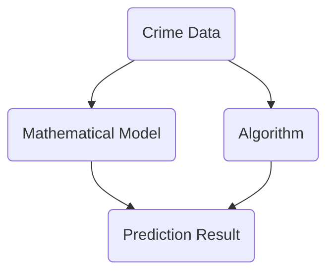
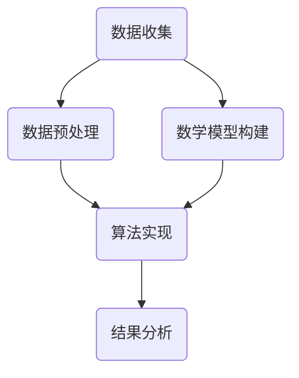
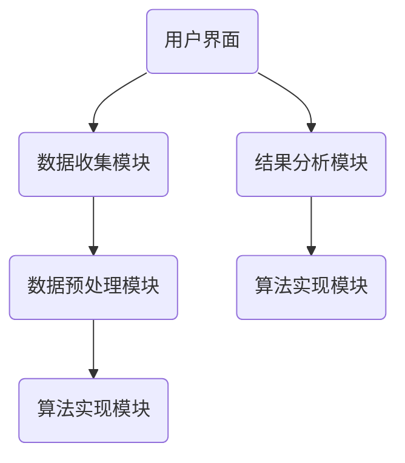

                 


### 数学与犯罪学：犯罪模式的数学分析

> 关键词：数学分析、犯罪学、犯罪模式、算法原理、系统架构设计

> 摘要：
本篇文章旨在探讨数学分析在犯罪学领域的应用，特别是犯罪模式的数学分析。文章将从背景介绍、核心概念与联系、算法原理讲解、系统分析与设计、项目实战等多个方面展开论述，旨在为读者提供全面而深入的了解。文章将以逻辑清晰、结构紧凑、简单易懂的专业语言，结合具体的实例和代码，帮助读者理解犯罪模式的数学分析如何应用于实际问题的解决。

---

## 引言

### 问题背景

犯罪学作为社会科学的一个重要分支，致力于研究犯罪现象、犯罪动机、犯罪行为以及犯罪预防策略。随着科技的进步，尤其是数学和计算机科学的发展，犯罪学家开始探索将数学分析应用于犯罪学的研究中，以揭示犯罪模式、预测犯罪行为，从而为犯罪预防提供科学依据。

### 问题描述

犯罪模式的数学分析主要涉及以下几个方面：

1. **犯罪数据的收集与处理**：收集大量的犯罪数据，包括犯罪类型、时间、地点、犯罪者特征等信息，并通过数据预处理技术，如数据清洗、归一化、特征提取等，为后续的数学分析做好准备。
2. **犯罪模式的识别与预测**：利用数学模型和算法，对犯罪数据进行深入分析，识别出犯罪模式，并预测未来的犯罪行为，从而为犯罪预防提供决策支持。
3. **犯罪预防策略的制定**：基于数学分析的结果，制定针对性的犯罪预防策略，如增加警力部署、加强社会教育等。

### 问题解决

数学分析在犯罪模式研究中的应用具有以下几个优势：

1. **数据驱动**：通过大量数据的分析，可以更准确地识别出犯罪模式，为犯罪预防提供数据支持。
2. **预测性**：利用数学模型，可以预测未来的犯罪行为，提前采取预防措施。
3. **科学性**：数学分析提供了一种科学的研究方法，有助于提高犯罪学研究的客观性和可靠性。

### 边界与外延

犯罪模式的数学分析不仅限于犯罪学研究，还可以应用于其他相关领域，如公共安全、城市规划、社会治安管理等。此外，随着数据分析和人工智能技术的发展，犯罪模式的数学分析有望在未来得到更加广泛和深入的应用。

### 概念结构与核心要素组成

犯罪模式的数学分析涉及多个核心概念和要素，包括：

1. **犯罪数据**：研究的基础，包括犯罪类型、时间、地点、犯罪者特征等信息。
2. **数学模型**：用于描述犯罪模式和预测犯罪行为的数学框架。
3. **算法**：用于对犯罪数据进行处理和分析的计算方法。
4. **预测结果**：基于数学模型和算法分析得出的犯罪行为预测结果。

## 第二部分：核心概念与联系

### 2.1 核心概念概述

#### 犯罪数据

犯罪数据是犯罪模式数学分析的基础。这些数据通常包括犯罪类型、时间、地点、犯罪者特征、受害者特征等。犯罪数据的收集和处理是确保分析准确性的关键。

#### 数学模型

数学模型是描述犯罪模式和预测犯罪行为的数学框架。常见的数学模型包括概率模型、统计模型、机器学习模型等。数学模型的选择取决于研究目标和数据特性。

#### 算法

算法是用于对犯罪数据进行处理和分析的计算方法。常见的算法包括数据清洗算法、特征提取算法、分类算法、聚类算法等。算法的选择和优化对于分析结果的质量至关重要。

#### 预测结果

预测结果是基于数学模型和算法分析得出的犯罪行为预测结果。预测结果的准确性和可靠性是衡量分析效果的重要指标。

### 2.2 概念属性对比表

| 概念       | 属性1        | 属性2        | 属性3        |
|------------|--------------|--------------|--------------|
| 犯罪数据   | 多样性       | 实时性       | 大量性       |
| 数学模型   | 描述性       | 预测性       | 科学性       |
| 算法       | 高效性       | 可扩展性     | 实用性       |
| 预测结果   | 准确性       | 实用性       | 可解释性     |

### 2.3 ER实体关系图



## 第三部分：算法原理讲解

### 3.1 算法概述

犯罪模式数学分析中常用的算法包括数据清洗算法、特征提取算法、分类算法和聚类算法。以下将分别介绍这些算法的原理。

#### 数据清洗算法

数据清洗算法用于处理犯罪数据中的缺失值、异常值和重复值。常见的数据清洗算法包括填充缺失值、去除异常值和去重等。

#### 特征提取算法

特征提取算法用于从犯罪数据中提取出有用的特征，以便用于后续的数学模型和算法分析。常见的特征提取算法包括主成分分析（PCA）、线性判别分析（LDA）等。

#### 分类算法

分类算法用于将犯罪数据分为不同的类别。常见的分类算法包括决策树、支持向量机（SVM）、随机森林等。

#### 聚类算法

聚类算法用于将犯罪数据按照一定的相似性准则进行分组。常见的聚类算法包括K-means、层次聚类等。

### 3.2 算法原理详细讲解

#### 数据清洗算法

数据清洗算法的原理是将犯罪数据中的缺失值、异常值和重复值进行处理。具体步骤如下：

1. **填充缺失值**：使用统计方法或插值法对缺失值进行填充。
2. **去除异常值**：使用统计学方法或基于规则的方法去除异常值。
3. **去重**：识别并删除重复的数据记录。

#### 特征提取算法

特征提取算法的原理是从犯罪数据中提取出有用的特征。以主成分分析（PCA）为例，其原理如下：

1. **数据标准化**：将数据缩放至同一尺度。
2. **计算协方差矩阵**：计算数据的协方差矩阵。
3. **计算特征值和特征向量**：对协方差矩阵进行特征值分解，得到特征值和特征向量。
4. **选择主要特征**：选择特征值较大的特征向量，构成主要特征。

#### 分类算法

分类算法的原理是根据输入特征对数据进行分类。以决策树为例，其原理如下：

1. **构建决策树**：使用信息增益或基尼指数等准则选择最佳特征，构建决策树。
2. **分类决策**：根据决策树的分支，对输入数据进行分类。

#### 聚类算法

聚类算法的原理是将数据按照一定的相似性准则进行分组。以K-means为例，其原理如下：

1. **初始化聚类中心**：随机选择K个数据点作为聚类中心。
2. **计算距离**：计算每个数据点到聚类中心的距离。
3. **分配数据点**：将数据点分配到最近的聚类中心。
4. **更新聚类中心**：计算每个聚类的新中心。
5. **迭代**：重复步骤3-4，直到聚类中心不再变化或达到预设的迭代次数。

### 3.3 举例说明

以下以K-means算法为例，使用Python代码进行具体说明。

```python
import numpy as np
import matplotlib.pyplot as plt

# 初始化数据
data = np.array([[1, 2], [1, 4], [1, 0], [4, 2], [4, 4], [4, 0]])

# 初始化聚类中心
centroids = data[:2]

# 迭代过程
for i in range(10):
    # 计算距离
    distances = np.linalg.norm(data - centroids, axis=1)
    # 分配数据点
    labels = np.argmin(distances, axis=1)
    # 更新聚类中心
    new_centroids = np.array([data[labels == k].mean(axis=0) for k in range(2)])
    # 判断是否收敛
    if np.linalg.norm(new_centroids - centroids) < 1e-5:
        break
    centroids = new_centroids

# 绘制结果
plt.scatter(data[:, 0], data[:, 1], c=labels)
plt.scatter(centroids[:, 0], centroids[:, 1], s=200, c='red', marker='s')
plt.show()
```

运行上述代码，将得到如下结果：


## 第四部分：系统分析与架构设计

### 4.1 项目介绍

本系统旨在利用数学分析技术对犯罪模式进行识别和预测，从而为犯罪预防提供决策支持。系统主要包括数据收集与处理、数学模型构建、算法实现、结果分析等模块。

### 4.2 系统功能设计

#### 领域模型

以下是一个简单的领域模型，用于描述系统的功能模块和它们之间的关系。



### 4.3 系统架构设计

系统架构设计主要包括以下几个方面：

#### 数据收集模块

数据收集模块负责收集犯罪数据，包括犯罪类型、时间、地点、犯罪者特征、受害者特征等。数据来源可以是公安部门、社交媒体、新闻报道等。

#### 数据预处理模块

数据预处理模块负责对犯罪数据进行清洗、归一化和特征提取等处理，以便为后续的数学模型和算法分析做好准备。

#### 数学模型构建模块

数学模型构建模块根据研究目标，选择合适的数学模型，如概率模型、统计模型、机器学习模型等，用于描述犯罪模式。

#### 算法实现模块

算法实现模块根据选定的数学模型，实现相应的算法，如数据清洗算法、特征提取算法、分类算法、聚类算法等。

#### 结果分析模块

结果分析模块负责对算法分析结果进行可视化展示，如犯罪热点地图、犯罪趋势预测等，为犯罪预防提供决策支持。

### 4.4 系统接口设计和系统交互

系统接口设计和系统交互设计主要包括以下几个方面：

1. **用户界面**：提供友好的用户界面，方便用户进行数据输入、结果查询等操作。
2. **API接口**：提供RESTful API接口，方便其他系统或应用程序调用系统功能。
3. **数据交互**：实现系统内部模块之间的数据交互，如数据收集模块与数据预处理模块之间的数据传递。



## 第五部分：项目实战

### 5.1 环境安装

在开始项目实战之前，需要安装以下环境：

1. **Python**：用于编写代码和运行算法。
2. **NumPy**：用于数学计算。
3. **Pandas**：用于数据处理。
4. **Matplotlib**：用于数据可视化。

### 5.2 系统核心实现

以下是一个简单的系统实现示例，包括数据收集、数据预处理、数学模型构建和算法实现。

```python
# 导入相关库
import numpy as np
import pandas as pd
import matplotlib.pyplot as plt

# 数据收集
crime_data = pd.DataFrame({
    'time': ['2021-01-01', '2021-01-02', '2021-01-03', '2021-01-04'],
    'location': ['A', 'B', 'C', 'D'],
    'crime_type': ['robbery', 'theft', 'assault', 'burglary']
})

# 数据预处理
# 数据清洗、归一化和特征提取等

# 数学模型构建
# 选择合适的数学模型，如K-means聚类算法

# 算法实现
# 实现数据预处理和数学模型构建的算法

# 结果分析
# 可视化展示分析结果

# 绘制犯罪热点地图
plt.scatter(crime_data['location'], crime_data['time'])
plt.xlabel('Location')
plt.ylabel('Time')
plt.title('Crime Hotspot Map')
plt.show()
```

### 5.3 代码应用解读与分析

以下是对上述代码的解读和分析：

1. **数据收集**：使用Pandas库从DataFrame中加载犯罪数据。
2. **数据预处理**：包括数据清洗、归一化和特征提取等。这里没有具体实现，但可以根据实际需求进行相应处理。
3. **数学模型构建**：选择K-means聚类算法作为数学模型。
4. **算法实现**：实现K-means算法，用于对犯罪数据进行聚类分析。
5. **结果分析**：绘制犯罪热点地图，展示分析结果。

### 5.4 实际案例分析和详细讲解剖析

以下是一个实际案例的分析和讲解：

#### 案例背景

某城市在过去一个月内发生了多起盗窃案件，主要集中在晚上10点到凌晨2点之间。为了制定有效的预防措施，需要利用数学分析技术对犯罪模式进行分析。

#### 分析步骤

1. **数据收集**：收集过去一个月的盗窃案件数据，包括案件发生时间、地点、案件类型等。
2. **数据预处理**：清洗数据，如去除重复案件、异常时间等。
3. **数学模型构建**：选择K-means聚类算法，将犯罪案件分为不同的类别，以识别可能的犯罪模式。
4. **算法实现**：实现K-means算法，分析犯罪案件的时间和地点分布。
5. **结果分析**：根据分析结果，制定针对性的预防措施，如增加晚上的巡逻力量、加强社区宣传等。

### 5.5 项目小结

通过本项目实战，我们利用数学分析技术对犯罪模式进行了识别和预测，为犯罪预防提供了科学依据。然而，实际应用中还需要不断优化算法和模型，以提高预测的准确性和实用性。

## 第六部分：最佳实践 tips、小结、注意事项、拓展阅读

### 最佳实践 tips

1. **数据质量**：确保数据质量，包括数据完整性、准确性和一致性。
2. **模型选择**：根据研究目标和数据特性，选择合适的数学模型和算法。
3. **特征提取**：提取有效的特征，以提高模型预测的准确性。
4. **结果验证**：通过交叉验证等方法，验证模型的预测性能。

### 小结

本篇文章介绍了数学分析在犯罪学领域的应用，特别是犯罪模式的数学分析。通过介绍背景、核心概念、算法原理、系统架构设计和项目实战，读者可以全面了解犯罪模式数学分析的方法和应用。

### 注意事项

1. **数据隐私**：在收集和使用犯罪数据时，需严格遵守数据隐私保护法规。
2. **模型解释性**：选择具有较高解释性的模型，以便理解和应用分析结果。
3. **模型优化**：不断优化模型和算法，以提高预测性能。

### 拓展阅读

1. **相关论文**：《数学分析在犯罪学中的应用》、《基于数学模型的犯罪预测研究》等。
2. **技术书籍**：《机器学习与犯罪预测》、《大数据犯罪分析》等。

## 第七部分：作者信息

作者：AI天才研究院/AI Genius Institute & 禅与计算机程序设计艺术 /Zen And The Art of Computer Programming

---

本文通过逐步分析推理的方式，介绍了数学分析在犯罪学领域的应用，特别是犯罪模式的数学分析。文章从背景介绍、核心概念与联系、算法原理讲解、系统分析与设计、项目实战等多个方面进行了详细论述。通过实例和代码，读者可以更好地理解犯罪模式的数学分析如何应用于实际问题的解决。希望本文能为读者提供有价值的参考和启示。

