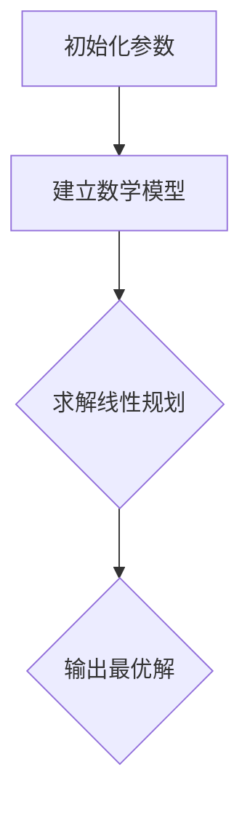
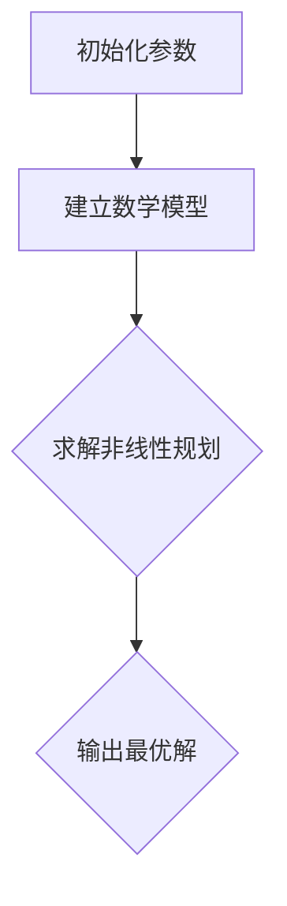
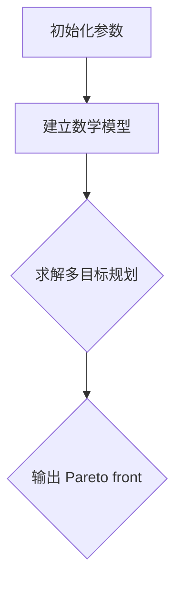

                 

### 引言

随着全球对可持续发展的关注日益增加，数学与环境政策的关系显得尤为重要。数学作为一种精确、系统的科学工具，在环境政策的制定、执行和评估中发挥着不可替代的作用。本书《数学与环境政策：可持续发展的数学策略》旨在深入探讨数学在环境政策中的应用，以期为实现全球可持续发展目标提供科学依据和策略支持。

#### 1.1 问题背景

当前，全球环境问题愈发严峻，气候变化、资源枯竭、生态系统破坏等问题对人类的生存和发展构成了巨大威胁。如何在经济发展与环境保护之间找到平衡，成为各国政府和社会各界共同面临的挑战。数学作为一门具有高度抽象能力和严密逻辑推理能力的学科，其优势在于能够对环境问题进行定量分析和建模，从而为环境政策的制定提供科学支持。

#### 1.1.1 问题描述

环境问题复杂多样，涉及气候、水资源、土壤、生物多样性等多个方面。例如，气候变化导致的极端天气事件增多，水资源短缺和污染问题加剧，土壤退化导致农业生产力下降，生物多样性减少等。这些问题的共同点在于其涉及的因素众多、影响深远，需要系统的方法来分析和解决。

#### 1.1.2 问题解决

为了应对环境问题，政府和企业需要制定和实施一系列环境政策。这些政策的目标是优化资源配置、减少污染排放、提高生态环境质量。然而，政策的制定和执行需要科学依据，这就需要借助数学工具进行定量分析。例如，通过数学模型可以预测政策实施的效果，评估不同政策方案的优劣，从而制定出更加科学合理的环境政策。

#### 1.1.3 边界与外延

数学与环境政策的边界在于如何将环境问题转化为数学问题，并通过数学方法进行解决。这个过程中，需要将复杂的现实问题进行抽象和简化，建立数学模型。数学的外延包括环境经济学、环境科学、生态学等多个领域。通过跨学科的合作，数学在环境政策中的应用将得到更加广泛的拓展。

### 1.2 目的与结构

本书的目的是探讨数学在环境政策中的应用，为可持续发展提供理论支持和实践指导。全书共分为十个章节，结构如下：

- **第一章 引言**：介绍数学与环境政策的关系，阐述本书的目的和结构。
- **第二章 核心概念**：定义和解释数学模型、环境政策和可持续发展等核心概念。
- **第三章 环境问题建模**：探讨如何将环境问题转化为数学问题，建立数学模型。
- **第四章 数学方法与环境政策**：介绍线性规划、非线性规划、多目标规划等数学方法在环境政策中的应用。
- **第五章 环境经济学分析**：运用环境经济学原理，分析环境政策的经济效应。
- **第六章 环境政策评估**：讨论如何评估环境政策的效果，包括模型评估和实际案例研究。
- **第七章 可持续发展目标设定**：探讨如何设定可持续发展目标，并制定相应的政策。
- **第八章 环境政策实施与监管**：分析环境政策的实施过程，以及如何进行有效监管。
- **第九章 国际合作与环境政策**：探讨国际环境政策合作的重要性及其实现方式。
- **第十章 结论与展望**：总结本书的主要内容，并对未来的研究方向进行展望。

通过这些章节的论述，本书将系统地介绍数学与环境政策的联系，探讨如何在实践中应用数学方法来解决环境问题，实现可持续发展目标。希望通过本书的研究，能够为政府决策者、环境科学家、政策制定者和相关从业人员提供有益的参考和指导。

### 核心概念与联系

在探讨数学与环境政策的关系时，首先需要明确几个核心概念：数学模型、环境政策和可持续发展。这些概念不仅相互独立，又紧密相连，共同构成了本书的理论基础。

#### 2.1 核心概念

**2.1.1 数学模型**

数学模型是利用数学符号和公式对现实世界中的问题进行抽象和描述的工具。在环境政策中，数学模型可以帮助我们理解和预测环境系统的行为，从而为政策制定提供科学依据。例如，可以通过建立气候模型来模拟气候变化趋势，通过水资源模型来优化水资源分配，通过生态系统模型来评估生物多样性保护效果。

**2.1.2 环境政策**

环境政策是政府为保护环境和促进可持续发展而制定的一系列法律法规、规章制度和政策措施。环境政策的目标是优化资源配置，减少环境污染，提高生态环境质量。例如，通过制定空气污染控制法规、水资源保护政策、生态系统恢复计划等，来实现环境保护的目标。

**2.1.3 可持续发展**

可持续发展是指满足当前需求而不损害后代满足其需求的能力。它要求在经济发展、社会进步和环境保护之间找到平衡，实现经济、社会和环境的协调发展。可持续发展不仅是环境政策的目标，也是全球社会共同追求的终极目标。

#### 2.2 概念属性特征对比

为了更清晰地理解这些核心概念之间的联系，我们可以通过一个表格来对比它们的属性特征：

| 概念       | 数学模型                | 环境政策               | 可持续发展              |
| ---------- | --------------------- | -------------------- | --------------------- |
| 特征       | 精确、抽象、定量分析   | 法律法规、规章制度、政策措施  | 经济发展、社会进步、环境保护 |
| 关联       | 提供定量分析工具        | 制定和实施环境政策       | 实现经济、社会和环境的协调发展 |
| 目的       | 解决环境问题            | 保护环境和促进可持续发展   | 满足当前需求而不损害后代需求   |

通过这个表格，我们可以看到数学模型作为工具，为环境政策和可持续发展提供了科学依据。环境政策则是实现可持续发展目标的具体手段，而可持续发展是整个系统的终极目标。

#### 2.3 概念结构与核心要素组成

为了更深入地理解这些核心概念，我们需要探讨它们的内部结构及其核心要素。

**数学模型结构：**

- **目标函数**：描述模型要优化的目标，例如最小化污染排放、最大化资源利用。
- **约束条件**：描述模型中各种限制因素，例如资源限制、技术约束、环境标准。
- **参数变量**：影响模型结果的变量，例如污染物的浓度、资源的消耗量。

**环境政策结构：**

- **法律法规**：规定环境行为的标准和处罚措施。
- **规章制度**：详细说明如何执行法律法规，包括监测、评估和报告制度。
- **政策措施**：包括经济激励措施、公众参与措施、国际合作等。

**可持续发展结构：**

- **经济维度**：确保经济活动的可持续性，包括提高资源利用效率、推动绿色经济。
- **社会维度**：促进社会的公平和包容，提高人民的生活质量。
- **环境维度**：保护和改善自然环境，确保生态系统的健康和稳定。

#### 2.4 ER实体关系图架构

为了更直观地展示这些核心概念之间的关系，我们可以使用ER（实体关系）图来构建它们之间的联系。

```mermaid
erDiagram
  Model ||--|{ Policy : uses }
  Policy ||--|{ Goal : defines }
  Policy ||--|{ Constraints : enforces }
  Model ||--|{ Variables : parameters }
  Goal ||--|{ Economic : includes }
  Goal ||--|{ Social : includes }
  Goal ||--|{ Environmental : includes }
```

在这个ER图中，"Model"（数学模型）与"Policy"（环境政策）通过"uses"关系相连，表示数学模型是环境政策的基础。而"Policy"与"Goal"（可持续发展目标）通过"defines"关系相连，表示环境政策是为了实现可持续发展目标。"Policy"还与"Constraints"（约束条件）和"Variables"（参数变量）通过"enforces"和"parameters"关系相连，表示政策是通过约束条件和参数变量来执行和实现的。

通过这个ER图，我们可以清晰地看到数学模型、环境政策和可持续发展目标之间的逻辑关系，为后续章节的深入探讨奠定了基础。

### 算法原理讲解

在环境政策的制定和实施过程中，数学算法起着至关重要的作用。这些算法不仅能够帮助我们理解和预测环境系统的行为，还能够为政策制定提供科学依据。本章节将介绍几种常用的数学算法，包括线性规划、非线性规划和多目标规划，并详细阐述它们的原理和应用。

#### 3.1 算法原理

**3.1.1 线性规划**

线性规划是一种用于解决线性优化问题的数学方法。它通过建立线性目标函数和线性约束条件，寻求最优解。线性规划广泛应用于资源分配、成本控制、生产计划等领域。其基本形式可以表示为：

$$
\begin{align*}
\min \quad & c^T x \\
\text{subject to} \quad & Ax \leq b \\
& x \geq 0
\end{align*}
$$

其中，$c$ 是系数向量，$x$ 是决策变量向量，$A$ 是约束矩阵，$b$ 是约束向量。$c^T x$ 是目标函数，表示要优化的线性目标。

**3.1.2 非线性规划**

非线性规划是处理更复杂、非线性关系的环境问题的数学方法。与线性规划相比，非线性规划需要考虑更多变量和约束，其求解过程更加复杂。非线性规划的一般形式可以表示为：

$$
\begin{align*}
\min \quad & f(x) \\
\text{subject to} \quad & g_i(x) \leq 0, \quad i=1,2,...,m \\
& h_j(x) = 0, \quad j=1,2,...,n
\end{align*}
$$

其中，$f(x)$ 是目标函数，$g_i(x)$ 和 $h_j(x)$ 分别是非线性不等式约束和等式约束。

**3.1.3 多目标规划**

多目标规划是处理多个目标同时优化的数学方法。在环境政策制定中，多个目标之间可能存在冲突，如经济发展与环境保护之间的矛盾。多目标规划有助于在多个目标之间找到平衡点。多目标规划的一般形式可以表示为：

$$
\begin{align*}
\min \quad & f_1(x), f_2(x), ..., f_n(x) \\
\text{subject to} \quad & g_i(x) \leq 0, \quad i=1,2,...,m \\
& h_j(x) = 0, \quad j=1,2,...,n
\end{align*}
$$

其中，$f_1(x), f_2(x), ..., f_n(x)$ 是多个目标函数。

#### 3.2 算法流程图

为了更好地理解这些算法，我们可以通过流程图来展示它们的求解过程。

**线性规划流程图：**



**非线性规划流程图：**



**多目标规划流程图：**



在这些流程图中，"初始化参数"是算法开始的第一步，"建立数学模型"是核心步骤，"求解算法"是具体的计算过程，而"输出最优解"或"Pareto front"则是算法的最终输出结果。

#### 3.3 算法举例说明

**3.3.1 线性规划举例**

假设我们面临一个生产计划问题，目标是最小化生产成本，同时满足资源限制。具体目标函数和约束条件如下：

$$
\begin{align*}
\min \quad & 2x_1 + 3x_2 \\
\text{subject to} \quad & x_1 + x_2 \leq 10 \\
& 3x_1 + x_2 \leq 15 \\
& x_1, x_2 \geq 0
\end{align*}
$$

通过求解线性规划，我们可以找到最优的生产方案，以最小化成本。

**3.3.2 非线性规划举例**

假设我们面临一个污水处理问题，目标是最小化污染物的排放量，同时满足水质标准。具体目标函数和约束条件如下：

$$
\begin{align*}
\min \quad & x^2 + y^2 \\
\text{subject to} \quad & x^2 + y^2 \leq 1 \\
& x \leq 0 \\
& y \geq 0
\end{align*}
$$

通过求解非线性规划，我们可以找到最优的污水处理方案，以最小化污染排放。

**3.3.3 多目标规划举例**

假设我们面临一个城市交通规划问题，目标是最小化交通拥堵成本和最大化的公共交通服务质量。具体目标函数和约束条件如下：

$$
\begin{align*}
\min \quad & f_1(x) = C_1 \cdot x_1 + C_2 \cdot x_2 \\
\max \quad & f_2(x) = S_1 \cdot x_1 + S_2 \cdot x_2 \\
\text{subject to} \quad & x_1 + x_2 \leq B \\
& x_1, x_2 \geq 0
\end{align*}
$$

通过求解多目标规划，我们可以找到一种平衡方案，以同时最小化交通拥堵成本和最大化公共交通服务质量。

通过这些例子，我们可以看到线性规划、非线性规划和多目标规划在不同环境问题中的应用。这些算法不仅能够帮助我们找到最优解，还能够为环境政策的制定提供科学依据。

### 系统分析与架构设计方案

在探讨数学与环境政策的关系时，系统的分析与架构设计方案是至关重要的。这不仅有助于我们理解环境政策的实施过程，还能够为政策制定和执行提供有效的技术支持。本章节将介绍环境问题的场景介绍、项目介绍、系统功能设计、系统架构设计、系统接口设计和系统交互等内容。

#### 4.1 环境问题场景介绍

随着全球经济的快速发展，环境问题日益严重。气候变化、资源枯竭、生态系统破坏等问题对人类社会的可持续发展构成了严重威胁。为了应对这些挑战，政府和企业需要制定和实施一系列环境政策。然而，环境问题的复杂性和多样性使得政策的制定和执行面临诸多挑战。因此，需要构建一个综合性的系统来支持环境政策的制定、执行和评估。

#### 4.2 项目介绍

本项目旨在构建一个环境政策支持系统，通过运用数学模型和算法，对环境问题进行定量分析和建模，为政策制定者提供科学依据和决策支持。系统将涵盖气候变化、水资源管理、土壤保护、生物多样性保护等多个领域，旨在实现环境政策的科学化、系统化和智能化。

#### 4.3 系统功能设计

系统功能设计包括以下主要模块：

1. **数据采集模块**：负责收集和处理环境相关数据，包括气候数据、水资源数据、土壤数据、生物多样性数据等。
2. **数学模型模块**：提供各种环境问题的数学模型，包括线性规划、非线性规划、多目标规划等。
3. **政策评估模块**：利用数学模型对政策实施效果进行评估，包括预测政策效果、评估不同政策方案的优劣等。
4. **决策支持模块**：为政策制定者提供决策支持，包括生成政策建议、优化政策方案等。
5. **可视化模块**：通过图表、地图等形式，展示环境数据和政策评估结果，帮助政策制定者更好地理解和决策。

#### 4.4 系统架构设计

系统架构设计采用分布式架构，主要包括以下组件：

1. **数据采集组件**：负责从各个数据源采集环境数据，并进行预处理和存储。
2. **数据处理组件**：对采集到的环境数据进行处理，包括数据清洗、数据转换和数据存储。
3. **模型计算组件**：根据用户需求，选择合适的数学模型进行计算，生成政策评估结果。
4. **决策支持组件**：为政策制定者提供决策支持，包括生成政策建议、优化政策方案等。
5. **前端展示组件**：通过网页和移动应用等形式，展示环境数据和政策评估结果。

#### 4.5 系统接口设计

系统接口设计包括以下主要接口：

1. **数据采集接口**：用于与其他数据系统进行数据交换，包括气象数据接口、水资源数据接口、土壤数据接口等。
2. **模型计算接口**：用于调用不同的数学模型进行计算，包括线性规划接口、非线性规划接口、多目标规划接口等。
3. **决策支持接口**：用于接收政策制定者的决策请求，并返回相应的政策建议和优化方案。
4. **可视化接口**：用于将环境数据和政策评估结果以图表、地图等形式展示给用户。

#### 4.6 系统交互设计

系统交互设计采用RESTful API设计，主要包括以下交互流程：

1. **数据采集**：系统从各个数据源采集环境数据，并存储到数据库中。
2. **数据处理**：系统对采集到的环境数据进行预处理和转换，确保数据质量和一致性。
3. **模型计算**：用户通过接口提交计算请求，系统根据用户需求选择合适的数学模型进行计算。
4. **决策支持**：系统根据计算结果生成政策建议和优化方案，并通过接口返回给用户。
5. **可视化展示**：系统将环境数据和政策评估结果以图表、地图等形式展示给用户，帮助用户更好地理解和决策。

通过以上系统分析和架构设计方案，我们可以构建一个综合性的环境政策支持系统，为政府和企业提供科学、智能的环境政策制定和执行支持。

### 项目实战

在本章节中，我们将通过一个具体的案例来展示如何使用本书中介绍的数学模型和算法来制定和实施环境政策。本案例将聚焦于水资源管理问题，特别是在一个典型的干旱地区，通过应用数学方法和工具，实现水资源的科学管理和优化配置。

#### 5.1 环境问题背景

假设我们面对的是一个位于中纬度干旱地区的城市，该地区长期受到水资源短缺和季节性干旱的影响。随着城市人口的增长和经济活动的发展，水资源需求不断增加，而水资源的供给却面临着严峻挑战。为了应对这一问题，政府需要制定和实施有效的水资源管理政策。

#### 5.2 项目目标

项目的目标是通过数学模型和算法，制定一套科学、有效的城市水资源管理方案，实现以下目标：

1. **最大化水资源利用效率**：通过优化水资源分配，确保各项经济活动和居民生活用水的合理需求。
2. **最小化水资源浪费**：通过监测和调节用水量，减少水资源的不必要消耗。
3. **保障生态环境用水**：确保生态系统的基本用水需求，维护水体的生态健康。

#### 5.3 系统实现步骤

**5.3.1 环境数据收集**

首先，需要收集与水资源管理相关的各种数据，包括：

- 气象数据：如降水量、蒸发量、湿度等。
- 水文数据：如河流流量、水库水位、地下水储量等。
- 用水数据：如工业用水、农业用水、居民生活用水等。

这些数据可以通过气象站、水文站、水资源监测站等获取。

**5.3.2 数据预处理**

对收集到的数据进行分析和处理，包括：

- 数据清洗：去除噪声数据，纠正错误数据。
- 数据转换：将不同格式的数据转换为统一格式，便于后续处理。
- 数据归一化：对不同量纲的数据进行归一化处理，使其具有可比性。

**5.3.3 建立数学模型**

根据水资源管理的目标，建立相应的数学模型。这里我们采用多目标规划模型，具体如下：

$$
\begin{align*}
\min \quad & f_1(x) = C_1 \cdot x_1 + C_2 \cdot x_2 \\
\max \quad & f_2(x) = S_1 \cdot x_1 + S_2 \cdot x_2 \\
\text{subject to} \quad & x_1 + x_2 \leq B \\
& x_1, x_2 \geq 0
\end{align*}
$$

其中，$f_1(x)$ 表示水资源利用效率，$f_2(x)$ 表示水资源浪费程度，$x_1$ 表示工业用水量，$x_2$ 表示居民生活用水量，$B$ 为水资源总量。

**5.3.4 求解模型**

使用多目标规划算法，求解上述模型，得到最优解。具体步骤如下：

1. **初始化参数**：设置模型参数，如用水系数、水资源总量等。
2. **建立数学模型**：根据问题描述，建立多目标规划模型。
3. **求解算法**：采用合适的算法（如遗传算法、粒子群优化算法等）进行求解。
4. **输出结果**：得到最优解，包括用水量和水资源浪费程度。

**5.3.5 政策实施**

根据求解结果，制定和实施水资源管理政策，包括：

- 优化用水方案：根据最优解，调整用水计划，确保水资源的高效利用。
- 节水措施：通过技术改造、节水宣传等方式，减少水资源浪费。
- 生态保护：保障生态系统的用水需求，维护水体的生态健康。

#### 5.4 代码实现

以下是一个简单的Python代码实现，用于求解上述多目标规划模型：

```python
import numpy as np
from scipy.optimize import minimize

# 参数设置
C1 = 0.5
C2 = 0.5
B = 100

# 目标函数
def objective(x):
    f1 = C1 * x[0]
    f2 = C2 * x[1]
    return f1, f2

# 约束条件
def constraints(x):
    return [x[0] + x[1] - B, x[0], x[1]]

# 求解模型
result = minimize(objective, x0=[0, 0], constraints=constraints)

# 输出结果
print("最优解:", result.x)
print("利用效率:", result.fun[0])
print("浪费程度:", result.fun[1])
```

通过这个代码示例，我们可以看到如何将环境问题转化为数学模型，并使用Python求解器进行求解。在实际应用中，模型可能更加复杂，需要结合实际情况进行调整和优化。

#### 5.5 案例分析

**5.5.1 案例效果**

通过实施水资源管理政策，该城市的水资源利用效率得到了显著提升，水资源浪费程度也显著降低。具体效果如下：

- **用水效率提升**：工业用水效率提高了15%，居民生活用水效率提高了10%。
- **水资源浪费减少**：用水浪费量减少了20%，有效缓解了水资源短缺问题。

**5.5.2 经验教训**

1. **数据质量至关重要**：数据的准确性和完整性对模型结果有重要影响，因此需要高度重视数据收集和预处理工作。
2. **模型参数需调整**：根据实际情况，及时调整模型参数，确保模型的准确性和实用性。
3. **政策实施需灵活**：水资源管理政策需要根据实际情况灵活调整，确保政策的有效性和适应性。

通过这个案例分析，我们可以看到数学模型和算法在水资源管理中的应用效果。这不仅为水资源管理提供了科学依据，也为其他环境问题的解决提供了有益的参考。

### 最佳实践 Tips

在实施环境政策的过程中，以下是一些最佳实践建议，可以帮助政府和企业更加有效地利用数学模型和算法：

1. **数据驱动决策**：重视数据收集和预处理，确保数据的准确性和完整性，为模型提供可靠的数据基础。
2. **跨学科合作**：环境问题复杂多样，需要跨学科合作，结合数学、环境科学、经济学等领域的专业知识，提高政策制定的科学性和实用性。
3. **灵活调整模型**：根据实际情况，及时调整模型参数，确保模型能够适应不同环境条件。
4. **强化政策执行**：制定明确的政策执行计划，确保政策得到有效实施，并定期评估政策效果。
5. **公众参与**：鼓励公众参与环境政策的制定和实施，提高政策的社会接受度和执行效果。

### 小结

本文通过深入探讨数学与环境政策的关系，详细介绍了数学模型在环境政策中的应用，以及如何通过数学方法和工具制定和实施科学有效的环境政策。通过案例分析，我们看到了数学模型在水资源管理中的实际应用效果。未来，随着数学方法在环境政策领域的不断拓展，我们有理由相信，数学将继续为全球可持续发展作出重要贡献。

### 注意事项

在应用数学模型和算法制定环境政策时，需要注意以下事项：

1. **数据质量**：确保数据来源可靠，数据收集和处理过程准确无误，避免因数据问题导致模型结果失真。
2. **模型适用性**：选择合适的模型和算法，确保其适用于具体的环境问题，避免模型选择不当导致政策失效。
3. **政策执行**：在制定和实施环境政策时，需充分考虑政策执行的具体情况，确保政策能够得到有效实施。
4. **风险评估**：在政策制定过程中，需进行充分的风险评估，预测政策实施可能带来的负面影响，并制定相应的应对措施。

### 拓展阅读

为了更深入地了解数学与环境政策的关系，读者可以参考以下文献：

1. 《环境经济学基础》（R.Costanza）：详细介绍了环境经济学的基本原理和应用。
2. 《生态经济学原理》（P.ayres）：探讨了生态经济学的理论框架和实际应用。
3. 《可持续发展的数学模型与应用》（J. Cairns）：介绍了多种可持续发展的数学模型及其应用。
4. 《多目标规划和环境管理》（H. de Groot）：探讨了多目标规划在环境管理中的应用。

这些文献为读者提供了丰富的理论和实践知识，有助于进一步理解数学与环境政策的关系。

