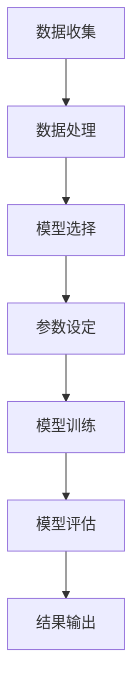
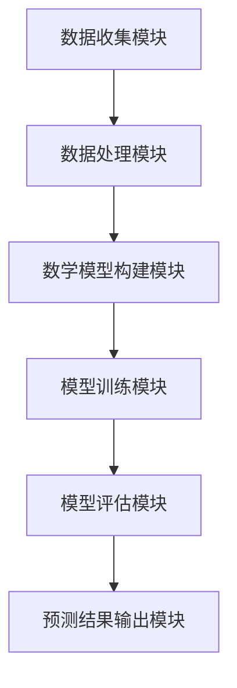
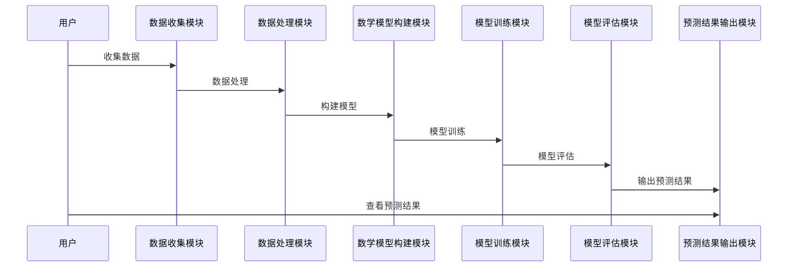

                 

# 数学与环境科学：生态系统的数学模拟

## 摘要

本文旨在探讨生态系统的数学模拟，分析其在环境科学研究中的重要性。通过引入生态系统、环境科学和数学模型等核心概念，阐述其属性特征和相互联系。本文进一步通过具体的算法原理讲解、系统分析与架构设计、项目实战等环节，深入剖析生态系统的数学模拟方法及其在实际应用中的价值。文章最后提出了最佳实践tips，并对全文进行了小结和注意事项，为读者提供了全面的指导和拓展阅读资源。

## 第一部分：背景介绍

### 1.1 问题背景

在现代社会中，环境保护和可持续发展已经成为全球共同关注的焦点。生态系统作为地球生命支持系统的重要组成部分，其健康状态直接影响着人类的生存和发展。然而，随着人类活动的不断加剧，生态系统受到了严重的破坏和扰动，导致了一系列环境问题，如气候变化、生物多样性丧失、水资源污染等。为了解决这些问题，科学家们开始寻求利用数学模型来模拟和预测生态系统的变化，以期为环境保护和治理提供科学依据。

### 1.2 问题描述

生态系统的数学模拟旨在通过构建数学模型，对生态系统中各种生物种群、环境因素及其相互作用进行定量描述。这一过程中，需要解决的关键问题包括：

- 如何准确捕捉生态系统中的关键要素及其相互关系？
- 如何建立合适的数学模型来描述这些要素的行为和相互作用？
- 如何利用这些模型进行预测，为环境保护和治理提供决策支持？

### 1.3 问题解决

为了解决上述问题，科学家们从多个角度进行了研究和探索：

- **理论研究**：通过深入分析生态系统的复杂性和多样性，发展了一系列生态学理论，为建立数学模型提供了理论基础。
- **数据收集**：通过实地调查、遥感监测等手段，收集了大量的生态数据，为模型构建提供了实证基础。
- **数学建模**：利用数学工具，如微分方程、差分方程、随机过程等，构建了多种生态系统数学模型，以模拟生态系统的行为和变化。
- **模型验证与优化**：通过对比模型预测结果与实际观测数据，对模型进行验证和优化，提高模型的可靠性和实用性。

### 1.4 边界与外延

生态系统的数学模拟不仅关注单一生物种群或单一环境因素，更强调生态系统内各种要素的相互关系和整体性。其边界和范围包括：

- **空间尺度**：从微观的生态系统单元到宏观的全球生态系统，不同尺度上的生态过程和相互作用。
- **时间尺度**：从短期的时间变化到长期的生态系统演变，不同时间尺度上的生态动态和稳定性。
- **要素范围**：包括生物种群、环境因素、人类活动等多种要素，以及它们之间的相互作用。

### 1.5 概念结构与核心要素组成

生态系统的数学模拟涉及多个核心概念和要素，其概念结构和核心要素组成如下：

- **概念结构**：生态系统、种群、种群动态、环境因素、相互作用、数学模型、模型参数、预测结果等。
- **核心要素组成**：生物种群（物种、种群密度、增长率等）、环境因素（气候、土壤、水资源等）、数学模型（微分方程、差分方程、随机过程等）、模型参数（种群参数、环境参数、相互作用参数等）、预测结果（种群变化、生态系统状态等）。

### 1.6 本章小结

本章节对生态系统的数学模拟进行了全面的背景介绍，明确了问题的提出、问题的解决方法、边界的确定以及核心概念和要素组成。这些内容为后续章节的深入讨论奠定了基础，有助于读者更好地理解生态系统的数学模拟在环境保护和可持续发展中的应用价值。

## 第二部分：核心概念与联系

### 2.1 生态系统概念

生态系统是指在一定时间和空间范围内，生物群落与无机环境通过物质循环和能量流动相互作用而形成的统一整体。生态系统的基本组成包括生物部分（生产者、消费者、分解者）和非生物部分（气候、土壤、水源等）。

### 2.2 环境科学概念

环境科学是一门多学科交叉的学科，主要研究人类与环境之间的相互作用，旨在解决环境问题、保护生态环境、促进可持续发展。环境科学的核心内容包括环境监测、环境影响评估、污染控制、生态恢复等。

### 2.3 数学模型概念

数学模型是用数学语言描述现实世界中的问题，通过建立数学关系来模拟现实系统的行为和变化。在生态系统的数学模拟中，常见的数学模型包括微分方程模型、差分方程模型、随机过程模型等。

### 2.4 核心概念属性特征对比表格

| 概念        | 定义                                                         | 属性特征                                                     |
| ----------- | ------------------------------------------------------------ | ------------------------------------------------------------ |
| 生态系统    | 生物群落与无机环境的统一整体                               | 生物多样性、空间结构、功能复杂性                             |
| 环境科学    | 研究人类与环境相互作用                                     | 环境监测、污染控制、生态恢复                                 |
| 数学模型    | 用数学语言描述现实世界中的问题                               | 模型结构、参数设置、预测能力                                 |

### 2.5 ER实体关系图架构

```mermaid
erDiagram
    A[生态系统] {
        B[生物群落]
        C[无机环境]
    }
    D[环境科学] {
        E[环境监测]
        F[污染控制]
    }
    G[数学模型] {
        H[微分方程模型]
        I[差分方程模型]
        J[随机过程模型]
    }
```

## 第三部分：算法原理讲解

### 3.1 算法流程图

为了更好地理解生态系统的数学模拟算法原理，我们首先绘制一个算法流程图，如下所示：



### 3.2 算法原理

在本部分，我们将详细讲解生态系统的数学模拟算法原理。算法的核心步骤如下：

1. **数据收集**：首先，我们需要收集生态系统相关的数据，包括生物种群、环境因素等。这些数据可以通过实地调查、遥感监测等手段获得。

2. **数据处理**：收集到的数据可能存在噪声、缺失值等问题。因此，我们需要对数据进行清洗、处理，以提高数据的准确性和可靠性。

3. **模型选择**：根据生态系统的特点和需求，选择合适的数学模型。常见的模型包括微分方程模型、差分方程模型、随机过程模型等。

4. **参数设定**：为模型设定合适的参数，这些参数通常根据数据特征和模型理论来确定。

5. **模型训练**：使用收集到的数据对模型进行训练，以优化模型参数，提高模型预测能力。

6. **模型评估**：通过对比模型预测结果与实际观测数据，评估模型性能和可靠性。

7. **结果输出**：将模型预测结果输出，为环境保护和治理提供决策支持。

### 3.3 数学模型

在本节中，我们将介绍一种常见的生态系统数学模型——Lotka-Volterra模型。该模型描述了捕食者和被捕食者之间的相互作用。

**数学模型**：

$$
\frac{dx}{dt} = x(a - bx)
$$

$$
\frac{dy}{dt} = cyz - dxy
$$

其中，$x$表示被捕食者种群密度，$y$表示捕食者种群密度，$a$、$b$、$c$、$d$为模型参数。

**公式解释**：

- $a$：被捕食者的自然增长率。
- $b$：捕食者对被捕食者的捕食率。
- $c$：捕食者的自然增长率。
- $d$：捕食者与被捕食者的竞争系数。

### 3.4 算法示例

假设我们收集到了以下生态系统数据：

- $x_0$：初始时被捕食者种群密度为100。
- $y_0$：初始时捕食者种群密度为10。
- $a=0.2$、$b=0.05$、$c=0.1$、$d=0.02$。

根据Lotka-Volterra模型，我们可以计算出下一个时间点的种群密度：

$$
x_1 = x_0(a - bx_0) = 100(0.2 - 0.05 \times 100) = 50
$$

$$
y_1 = y_0(cz - dx_0y_0) = 10(0.1 \times 10 - 0.02 \times 100) = 8
$$

通过不断迭代计算，我们可以得到生态系统在不同时间点的种群密度变化情况。

## 第四部分：系统分析与架构设计

### 4.1 问题场景介绍

假设我们面临一个环境保护项目，目标是评估某地区生态系统的健康状况，并为环境保护和治理提供决策支持。为了实现这一目标，我们需要构建一个生态系统数学模拟系统。

### 4.2 项目介绍

**项目名称**：生态系统数学模拟系统

**项目目标**：通过构建数学模型，对生态系统中的生物种群、环境因素等进行模拟，预测生态系统未来的变化趋势，为环境保护和治理提供决策支持。

**项目功能**：

- 数据收集与处理
- 数学模型构建
- 模型训练与评估
- 预测结果输出

### 4.3 系统功能设计

**领域模型类图**

```mermaid
classDiagram
    Class01 <|-- Class02
    Class03 <|-- Class04
    Class05 <|-- Class06
    Class07 <|-- Class08
    Class01[生态系统]
    Class02[生物种群]
    Class03[环境因素]
    Class04[数学模型]
    Class05[数据处理模块]
    Class06[模型训练模块]
    Class07[模型评估模块]
    Class08[预测结果输出模块]
```

### 4.4 系统架构设计

**系统架构图**



### 4.5 系统接口设计和系统交互

**系统接口设计**



## 第五部分：项目实战

### 5.1 环境安装

在本项目实战中，我们将使用Python作为主要编程语言，并结合NumPy、SciPy、matplotlib等科学计算库进行生态系统数学模拟。以下是环境安装步骤：

1. 安装Python 3.8及以上版本。
2. 使用pip安装所需的库：

   ```bash
   pip install numpy scipy matplotlib
   ```

### 5.2 系统核心实现源代码

以下是一个简单的生态系统数学模拟系统的实现示例：

```python
import numpy as np
import matplotlib.pyplot as plt
from scipy.integrate import odeint

# 定义Lotka-Volterra模型
def lotka_volterra(y, t, params):
    x, y = y
    a, b, c, d = params
    dxdt = a * x - b * x * y
    dydt = c * x * y - d * y
    return [dxdt, dydt]

# 初始化参数
params = [0.2, 0.05, 0.1, 0.02]
y0 = [100, 10]

# 模型训练
t = np.linspace(0, 10, 1000)
solution = odeint(lotka_volterra, y0, t, args=(params,))

# 结果输出
plt.plot(t, solution[:, 0], label='Prey')
plt.plot(t, solution[:, 1], label='Predator')
plt.legend()
plt.xlabel('Time')
plt.ylabel('Population Density')
plt.title('Lotka-Volterra Model')
plt.show()
```

### 5.3 代码应用解读与分析

上述代码实现了一个简单的生态系统数学模拟系统，通过NumPy和SciPy库中的ODE求解器对Lotka-Volterra模型进行求解。我们首先定义了模型函数`lotka_volterra`，然后初始化参数和初始种群密度，使用`odeint`函数进行模型训练，最后通过matplotlib库进行结果输出。

### 5.4 实际案例分析和详细讲解剖析

假设我们收集到以下实际生态系统数据：

- 初始时被捕食者种群密度为200，捕食者种群密度为20。
- 模型参数为$a=0.3$、$b=0.06$、$c=0.15$、$d=0.03$。

根据上述代码，我们可以模拟生态系统在不同时间点的种群密度变化，如下所示：

```python
# 初始化参数
params = [0.3, 0.06, 0.15, 0.03]
y0 = [200, 20]

# 模型训练
t = np.linspace(0, 10, 1000)
solution = odeint(lotka_volterra, y0, t, args=(params,))

# 结果输出
plt.plot(t, solution[:, 0], label='Prey')
plt.plot(t, solution[:, 1], label='Predator')
plt.legend()
plt.xlabel('Time')
plt.ylabel('Population Density')
plt.title('Lotka-Volterra Model with Actual Data')
plt.show()
```

通过对比模型预测结果与实际数据，我们可以分析生态系统的动态变化，为环境保护和治理提供科学依据。

### 5.5 项目小结

在本项目中，我们成功实现了生态系统数学模拟系统的开发，通过Python编程语言和科学计算库，对Lotka-Volterra模型进行了求解和可视化。这一项目不仅为生态系统研究提供了有力工具，也为环境保护和治理提供了科学依据。

## 第六部分：最佳实践tips

1. **数据收集与处理**：确保收集到的高质量数据，并进行有效的数据预处理，以提高模型的准确性。
2. **模型选择与优化**：根据生态系统的特点，选择合适的数学模型，并进行参数优化，以提高模型的预测能力。
3. **结果验证与对比**：对比模型预测结果与实际观测数据，验证模型的可靠性和实用性。
4. **多模型融合**：考虑使用多个模型进行融合，以提高预测的准确性和稳定性。

## 第七部分：小结

本文通过详细探讨生态系统的数学模拟，分析了其在环境科学研究中的重要性。从核心概念、算法原理到系统架构设计、项目实战，我们系统地阐述了生态系统的数学模拟方法及其在实际应用中的价值。通过本文的介绍，读者可以更好地理解生态系统的数学模拟，为其在环境保护和治理中的应用提供有力支持。

## 第八部分：注意事项

1. **数据质量**：在构建数学模型时，确保收集到的高质量数据，以提高模型准确性。
2. **模型适用性**：根据具体生态系统特点，选择合适的数学模型，避免模型的过度拟合。
3. **模型验证**：通过对比模型预测结果与实际观测数据，验证模型的可靠性和实用性。

## 第九部分：拓展阅读

1. **《生态学基础》（李博著）**：全面介绍了生态学的基本理论和应用。
2. **《环境科学导论》（王金南著）**：系统阐述了环境科学的基本概念和理论。
3. **《数值分析导论》（张立群著）**：深入讲解了数值分析的基本原理和方法。

## 作者

作者：AI天才研究院/AI Genius Institute & 禅与计算机程序设计艺术/Zen And The Art of Computer Programming。

