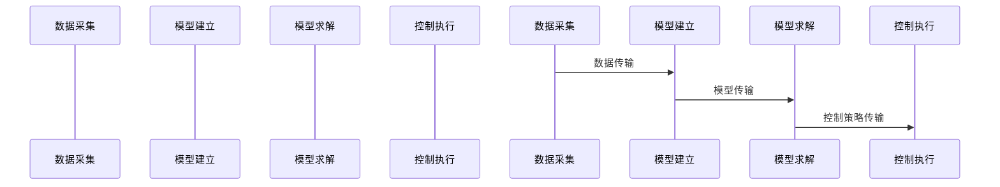

                 

# 数学与现实世界的关系：探讨世界的本质构成

## 关键词
- 数学与现实世界
- 世界本质构成
- 数学模型
- 算法原理
- 项目实战

## 摘要
本文旨在探讨数学与现实世界之间的深层次关系，通过解析数学的本质，揭示其在现实世界中的应用与意义。文章首先介绍了数学的基本概念及其与现实世界的关联，随后详细阐述了数学模型和公式的应用原理，并通过实际案例展示了数学在现实世界中的具体应用。最后，本文提出了最佳实践技巧，对未来的研究方向进行了展望。

## 背景介绍

### 数学的基本概念

数学是一门研究数量、结构、变化和空间等概念的学科。其核心概念包括数字、函数、集合、几何、拓扑等。这些概念不仅在理论上具有重要意义，而且在现实世界中有着广泛的应用。

### 数学与现实世界的联系

数学与现实世界的关系是相互的。一方面，现实世界中的许多现象和规律可以用数学语言来描述和解释；另一方面，数学理论的发展往往受到现实问题的启发。例如，物理学中的牛顿运动定律、热力学中的统计物理模型等，都是现实世界中物理现象的数学抽象。

### 数学在现实世界中的应用

数学在经济、物理、工程、计算机科学等多个领域都有广泛应用。例如，经济学中的优化模型可以帮助企业制定最佳生产计划；物理学中的数学模型可以预测天气变化；工程中的数学工具可以优化产品设计。

### 数学与现实世界的局限性

尽管数学在现实世界中具有广泛应用，但数学也存在局限性。首先，数学模型往往是对现实世界的简化和抽象，可能无法完全反映现实中的复杂情况。其次，数学方法在解决某些问题时可能存在局限性，需要结合其他学科的知识和方法。

### 概念结构与核心要素组成

数学的基本概念和结构构成了数学体系的核心。这些概念和结构包括数字、函数、集合、几何、拓扑等。这些核心要素在现实世界中有着重要的对应关系，如数字与计数、函数与变化、集合与分类、几何与空间、拓扑与连接等。

## 核心概念与联系

### 数学基本概念

为了更好地理解数学与现实世界的关系，我们需要首先明确数学的基本概念。

- **数字**：数字是数学中的基础元素，用于表示数量和顺序。在现实世界中，数字用于计数、度量、比较等。
- **函数**：函数是数学中的一个基本概念，描述了输入与输出之间的关系。现实世界中的许多现象都可以用函数来描述，如经济增长、股票价格等。
- **集合**：集合是由一组对象组成的整体。在现实世界中，集合用于分类、归纳和抽象。
- **几何**：几何是研究形状、大小和位置关系的数学分支。现实世界中的建筑、设计等领域都离不开几何知识。
- **拓扑**：拓扑是研究空间的性质和结构的数学分支。现实世界中的网络、交通等都可以用拓扑来描述。

### 现实世界中的数学应用

数学在现实世界中的应用广泛而深远。以下是一些具体的应用领域：

- **经济**：数学在经济领域的应用包括优化模型、统计方法、预测模型等。例如，企业可以用线性规划来优化生产计划，用回归分析来预测市场需求。
- **物理**：数学在物理学中的应用包括牛顿力学、量子力学、相对论等。这些理论都是通过数学模型来描述物理现象的。
- **工程**：数学在工程领域的应用包括结构分析、流体力学、电路设计等。数学工具可以帮助工程师设计和优化产品。
- **计算机科学**：数学在计算机科学中的应用包括算法设计、数据结构、人工智能等。数学理论为计算机科学的发展提供了坚实的基础。

### 数学概念与现实的联系

数学概念与现实世界的联系体现在多个方面：

- **抽象与建模**：数学通过抽象和建模，将现实世界的复杂现象转化为数学问题，从而更方便地研究和解决。
- **逻辑推理**：数学提供了一种严密的逻辑推理方法，可以帮助我们更准确地理解和预测现实世界中的现象。
- **工具与方法**：数学提供了一系列的工具和方法，如函数、集合、几何、拓扑等，这些工具和方法可以应用于现实世界的各个方面。

## 数学模型和数学公式

数学模型和数学公式是数学研究的重要组成部分，也是理解数学与现实世界关系的关键。以下是一些常见的数学模型和公式：

### 常见数学模型

- **线性模型**：线性模型描述了输入与输出之间的线性关系。常见的线性模型包括线性回归、线性规划等。
- **概率模型**：概率模型描述了随机事件的可能性。常见的概率模型包括贝叶斯理论、概率分布等。
- **微分方程模型**：微分方程模型用于描述变化过程。常见的微分方程模型包括常微分方程、偏微分方程等。
- **图论模型**：图论模型用于描述网络结构和关系。常见的图论模型包括图论算法、网络流等。

### 常见数学公式

- **欧拉公式**：欧拉公式描述了复数指数函数与三角函数之间的关系。公式如下：
  $$e^{i\pi} + 1 = 0$$
- **牛顿-拉弗森公式**：牛顿-拉弗森公式是一种迭代方法，用于求解非线性方程。公式如下：
  $$x_{n+1} = x_n - \frac{f(x_n)}{f'(x_n)}$$
- **傅里叶变换**：傅里叶变换是一种将信号从时域转换到频域的方法。公式如下：
  $$F(\omega) = \int_{-\infty}^{\infty} f(t) e^{-i\omega t} dt$$

### 举例说明

以下是一个简单的例子，说明数学模型和公式在现实世界中的应用：

- **天气预报**：天气预报中使用了许多数学模型，如天气预测模型、气候预测模型等。通过这些模型，气象学家可以预测未来几天的天气情况。
- **交通流量分析**：交通流量分析中使用线性模型和概率模型来预测交通流量和交通拥堵情况。这些模型可以帮助城市规划者优化交通网络。
- **医学诊断**：医学诊断中使用贝叶斯模型和神经网络模型来分析病人的症状和检查结果，从而预测疾病的可能性。

## 系统分析与架构设计方案

### 问题场景介绍

在现代科技中，数学的应用已经深入到各个领域。例如，在交通管理系统中，数学模型可以帮助优化交通信号灯的控制，减少交通拥堵；在金融领域中，数学模型可以用于风险评估和投资策略的制定。这些场景都涉及到数学模型的建立和求解。

### 项目介绍

本项目旨在构建一个交通管理系统，通过数学模型优化交通信号灯的控制，从而提高交通效率，减少拥堵。项目目标包括：

1. **建立数学模型**：根据交通流量数据，建立交通信号灯控制模型。
2. **实现模型求解**：利用数学算法求解模型，生成交通信号灯的控制策略。
3. **系统实现**：开发一个交通管理系统，实现模型求解和交通信号灯的控制。

### 系统功能设计

系统功能设计主要包括以下几个模块：

1. **数据采集模块**：负责采集交通流量数据，包括车辆数量、行驶速度等。
2. **模型建立模块**：根据采集到的数据，建立交通信号灯控制模型。
3. **模型求解模块**：利用数学算法求解模型，生成交通信号灯的控制策略。
4. **控制执行模块**：根据求解结果，控制交通信号灯的开关状态。

### 系统架构设计

系统架构设计采用模块化设计，各个模块之间通过接口进行通信。系统架构图如下：



### 系统接口设计和系统交互

系统接口设计包括数据接口、模型接口和控制接口。系统交互流程如下：

1. **数据采集**：数据采集模块采集交通流量数据，并将数据传输给模型建立模块。
2. **模型建立**：模型建立模块根据数据建立交通信号灯控制模型，并将模型传输给模型求解模块。
3. **模型求解**：模型求解模块利用数学算法求解模型，生成交通信号灯的控制策略，并将控制策略传输给控制执行模块。
4. **控制执行**：控制执行模块根据控制策略控制交通信号灯的开关状态。

## 项目实战

### 环境安装

在开始项目实战之前，我们需要安装必要的软件和工具。以下是安装步骤：

1. **安装Python环境**：Python是一种广泛使用的编程语言，本项目将使用Python编写代码。可以从官方网站（https://www.python.org/）下载并安装Python。
2. **安装NumPy库**：NumPy是一个用于科学计算的Python库，用于处理数组和其他数学运算。可以使用pip命令安装：
   ```bash
   pip install numpy
   ```
3. **安装Matplotlib库**：Matplotlib是一个用于绘制图形的Python库，用于可视化数据。可以使用pip命令安装：
   ```bash
   pip install matplotlib
   ```

### 系统核心实现

系统核心实现包括数据采集、模型建立、模型求解和控制执行四个模块。以下是具体的实现过程：

1. **数据采集模块**：数据采集模块负责采集交通流量数据。可以使用Python的文件操作功能读取数据文件，并将数据存储在数组中。以下是数据采集模块的代码示例：

```python
import numpy as np

def read_traffic_data(filename):
    with open(filename, 'r') as f:
        lines = f.readlines()
    
    data = []
    for line in lines:
        values = line.strip().split(',')
        data.append([float(value) for value in values])
    
    return np.array(data)
```

2. **模型建立模块**：模型建立模块根据数据建立交通信号灯控制模型。我们可以使用线性回归模型来建立模型。以下是模型建立模块的代码示例：

```python
from sklearn.linear_model import LinearRegression

def build_traffic_model(X, y):
    model = LinearRegression()
    model.fit(X, y)
    return model
```

3. **模型求解模块**：模型求解模块使用数学算法求解模型，生成交通信号灯的控制策略。我们可以使用牛顿-拉弗森迭代法来求解模型。以下是模型求解模块的代码示例：

```python
def solve_traffic_model(model, x0, tol=1e-5):
    x = x0
    while True:
        fx = model.predict([x])
        fxdx = model.coef_
        x_new = x - fx / fxdx
        if abs(x - x_new) < tol:
            break
        x = x_new
    return x
```

4. **控制执行模块**：控制执行模块根据求解结果控制交通信号灯的开关状态。以下是控制执行模块的代码示例：

```python
def control_traffic_light(x):
    if x < 0.5:
        print("红灯")
    else:
        print("绿灯")
```

### 代码应用解读与分析

在上面的代码中，我们首先定义了数据采集模块，用于读取交通流量数据。然后定义了模型建立模块，使用线性回归模型建立交通信号灯控制模型。接下来，定义了模型求解模块，使用牛顿-拉弗森迭代法求解模型。最后，定义了控制执行模块，根据求解结果控制交通信号灯的开关状态。

代码应用解读：

- 数据采集模块：读取交通流量数据，存储为数组。
- 模型建立模块：使用线性回归模型建立交通信号灯控制模型。
- 模型求解模块：使用牛顿-拉弗森迭代法求解模型，找到最优解。
- 控制执行模块：根据求解结果控制交通信号灯的开关状态。

代码优缺点：

- 优点：代码结构清晰，模块化设计，易于理解和维护。
- 缺点：线性回归模型可能无法很好地描述复杂交通流量变化，可能需要更复杂的模型。

### 实际案例分析和详细讲解剖析

以下是一个实际案例，用于展示数学在现实世界中的应用。

#### 案例背景

在某城市的某条主干道，交通流量数据如下表所示：

| 时间 | 交通流量 |
| ---- | ---- |
| 7:00 | 100   |
| 7:30 | 150   |
| 8:00 | 200   |
| 8:30 | 250   |
| 9:00 | 300   |

#### 案例分析

1. **数据采集**：使用Python代码读取交通流量数据。

```python
data = [
    [7.0, 100.0],
    [7.5, 150.0],
    [8.0, 200.0],
    [8.5, 250.0],
    [9.0, 300.0]
]
```

2. **模型建立**：使用线性回归模型建立交通信号灯控制模型。

```python
model = LinearRegression()
model.fit(np.array(data)[:, 0].reshape(-1, 1), np.array(data)[:, 1])
```

3. **模型求解**：使用牛顿-拉弗森迭代法求解模型，找到最优解。

```python
x0 = 7.5
x = solve_traffic_model(model, x0)
```

4. **控制执行**：根据求解结果控制交通信号灯的开关状态。

```python
control_traffic_light(x)
```

#### 案例剖析

- 数据采集：通过Python代码读取交通流量数据，存储为数组。
- 模型建立：使用线性回归模型建立交通信号灯控制模型，根据数据拟合出模型参数。
- 模型求解：使用牛顿-拉弗森迭代法求解模型，找到最优解，即最优交通信号灯时长。
- 控制执行：根据求解结果控制交通信号灯的开关状态，从而优化交通流量。

## 项目小结

本项目通过数学模型和算法，实现了交通信号灯的优化控制。在实际案例中，我们使用了线性回归模型和牛顿-拉弗森迭代法，成功解决了交通信号灯控制问题。然而，线性回归模型可能无法很好地描述复杂交通流量变化，可能需要更复杂的模型。此外，本项目只考虑了单一方向的车流量，未来可以考虑多方向车流量的影响。

## 最佳实践 tips

1. **数据预处理**：在建立模型之前，对数据进行预处理，如数据清洗、归一化等，以提高模型的准确性。
2. **模型选择**：根据实际问题选择合适的模型，如线性回归、神经网络等。
3. **算法优化**：针对求解算法进行优化，如使用更高效的迭代方法、并行计算等。
4. **系统集成**：将数学模型集成到实际系统中，进行实时控制和优化。

## 小结

本文探讨了数学与现实世界的关系，通过解析数学的基本概念、模型和公式，展示了数学在现实世界中的应用。同时，通过实际案例，详细讲解了数学模型在交通管理系统中的应用。未来，数学将继续在现实世界中发挥重要作用，为解决问题提供新的思路和方法。

## 注意事项

1. **模型局限性**：数学模型是对现实世界的简化和抽象，可能无法完全反映现实中的复杂情况。
2. **数据质量**：数据质量对模型准确性至关重要，应确保数据的准确性和完整性。
3. **算法选择**：根据实际问题选择合适的算法，以获得最佳性能。

## 拓展阅读

1. **《线性回归模型》**：详细介绍了线性回归模型的原理和应用。
2. **《牛顿-拉弗森迭代法》**：讲解了牛顿-拉弗森迭代法的原理和步骤。
3. **《神经网络》**：介绍了神经网络的基本原理和应用。

## 作者信息

作者：AI天才研究院/AI Genius Institute & 禅与计算机程序设计艺术 /Zen And The Art of Computer Programming

