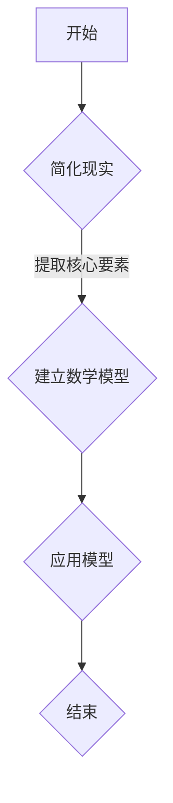
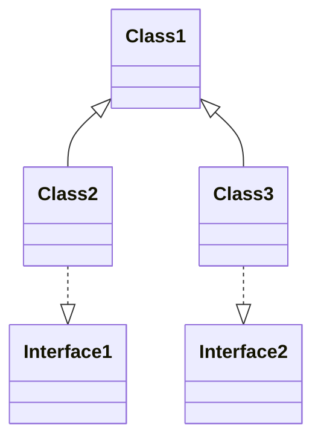
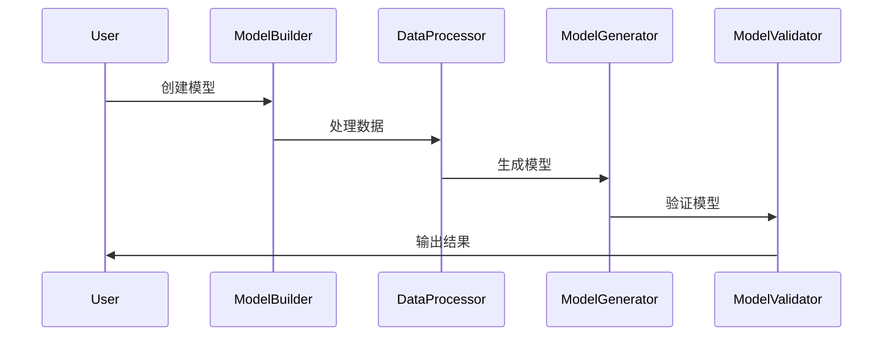

                 

## 数学与现实主义：数学作为现实世界的抽象

### 关键词
- 数学抽象
- 现实主义
- 数学模型
- 自然科学
- 社会科学
- 抽象过程

### 摘要
本文旨在探讨数学与现实世界之间的关系，特别是数学作为一种抽象工具在现实世界中的应用。我们将首先介绍数学的基本概念及其在现实世界中的角色，然后深入分析数学的抽象过程及其应用领域。此外，本文还将探讨数学与现实主义的哲学探讨，并通过具体案例展示数学在各个领域的应用。最后，我们将展望数学与现实主义的未来，并总结数学与现实主义的关系。

### 目录大纲

1. **第一部分：问题背景与概念介绍**
   1.1 **问题背景**
       1.1.1 **人类对现实世界的探索**
       1.1.2 **数学在现实世界中的角色**
       1.1.3 **数学抽象的重要性**
   1.2 **核心概念**
       1.2.1 **数学的基本概念**
       1.2.2 **现实世界的抽象**
       1.2.3 **数学与现实的关系**

2. **第二部分：数学的抽象过程**
   2.1 **数学抽象的基本原则**
       2.1.1 **简化现实**
       2.1.2 **抽象核心要素**
       2.1.3 **数学模型建立**
   2.2 **数学抽象的应用**
       2.2.1 **自然科学中的应用**
       2.2.2 **社会科学中的应用**
       2.2.3 **抽象过程在工程技术中的应用**

3. **第三部分：数学与现实主义的联系**
   3.1 **数学与现实主义的哲学探讨**
       3.1.1 **现实主义的哲学基础**
       3.1.2 **数学对现实主义的挑战**
       3.1.3 **数学与现实主义的融合**
   3.2 **数学现实主义案例分析**
       3.2.1 **案例一：经济学中的数学抽象**
       3.2.2 **案例二：心理学中的数学应用**
       3.2.3 **案例三：物理学中的数学抽象**

4. **第四部分：数学与现实主义的未来**
   4.1 **数学现实主义的发展趋势**
       4.1.1 **数学与现实主义的互动**
       4.1.2 **未来数学抽象的可能性**
       4.1.3 **数学与现实主义的未来挑战**
   4.2 **展望未来研究方向**
   4.3 **数学与现实主义的实际应用前景**

5. **第五部分：结论与展望**
   5.1 **总结与反思**
   5.2 **展望未来研究方向**
   5.3 **数学与现实主义的实际应用前景**

### 1. 问题背景

#### 1.1 人类对现实世界的探索

人类的历史可以看作是对现实世界不断探索和理解的过程。从最早的石器时代，到工业革命，再到信息时代的到来，人类对现实世界的认识不断深化。这种探索不仅仅停留在物理层面，还包括对社会、文化、心理等多个维度的探索。

在科学领域，数学作为一种基本的工具，起着不可或缺的作用。数学不仅仅是用来解决现实问题的工具，它本身就是对现实世界的抽象和概括。通过数学，人类能够更简洁、直观地描述现实世界的复杂现象，从而更好地理解和预测。

#### 1.2 数学在现实世界中的角色

数学在现实世界中的角色是多方面的。首先，数学为现实世界提供了一种抽象的工具，使得人类能够将复杂的问题简化为更易于理解和分析的模型。例如，物理学中的方程式、经济学中的模型等，都是数学在现实世界中的应用。

其次，数学作为一种逻辑工具，帮助人类更好地理解和解释现实世界中的现象。例如，数学在自然科学中的应用，使得我们能够更深入地了解自然界的规律；在社会科学中的应用，帮助我们更好地理解社会现象和预测社会发展趋势。

#### 1.3 数学抽象的重要性

数学抽象是一种将复杂现实简化为简单模型的方法。这种抽象不仅帮助我们更清晰地理解现实世界，还为科学研究和技术创新提供了基础。在现代社会，数学抽象的应用已经渗透到各个领域，成为推动科技进步的重要力量。

数学抽象的重要性体现在多个方面。首先，它使得我们能够更简洁、直观地描述现实世界的复杂现象，从而更容易理解和预测。其次，它为科学研究和技术创新提供了基础，使得我们能够更好地解决现实问题。

### 2. 核心概念

#### 2.1 数学的基本概念

数学的基本概念包括数、函数、集合、空间等。这些概念是数学抽象的基础，也是理解和应用数学的关键。

- **数**：数是数学中最基本的元素，用来表示物体的数量。数可以分为自然数、整数、有理数、实数等。

- **函数**：函数是数学中用来描述两个变量之间关系的数学工具。函数可以是线性的，也可以是非线性的。

- **集合**：集合是数学中用来描述一组对象的概念。集合可以是有限的，也可以是无限的。

- **空间**：空间是数学中用来描述物体位置和运动的工具。空间可以是二维的，也可以是三维的。

#### 2.2 现实世界的抽象

现实世界的抽象是将复杂、具体的现实简化为数学模型的过程。这种抽象不仅包括物理量的测量，还包括对现实世界现象和规律的概括。

现实世界的抽象过程可以分为以下几个步骤：

- **简化现实**：通过去除非必要的细节，我们将现实世界简化为一个更易于理解和分析的模型。

- **抽象核心要素**：在简化现实的基础上，我们进一步提取核心要素。这些要素是现实世界中最为关键的部分，能够反映现实的主要特征。

- **数学模型建立**：最后，我们使用数学语言来描述这些核心要素，建立数学模型。这个模型不仅能够帮助我们理解现实世界，还能够为现实问题的解决提供参考。

#### 2.3 数学与现实的关系

数学与现实的关系是相互依存的。数学为现实世界提供了一种抽象的工具，而现实世界则为数学提供了丰富的应用场景。

- **数学为现实世界提供抽象工具**：通过数学抽象，我们可以将复杂的现实世界简化为更易于理解和分析的模型，从而更好地理解和预测。

- **现实世界为数学提供应用场景**：现实世界中的各种现象和问题为数学提供了丰富的应用场景。数学家通过对现实问题的研究，不断发现新的数学规律和工具。

### 3. 数学抽象的过程

#### 3.1 简化现实

简化现实是数学抽象的第一步。通过去除非必要的细节，我们将现实世界简化为一个更易于理解和分析的模型。

- **去除非必要细节**：在简化现实的过程中，我们需要识别出哪些细节是必要的，哪些是非必要的。必要细节是反映现实世界主要特征的，而非必要细节可能会引入不必要的复杂性。

- **构建简化模型**：在去除非必要细节的基础上，我们构建一个简化模型。这个模型虽然简化了现实，但仍然能够反映现实的主要特征。

#### 3.2 抽象核心要素

在简化现实的基础上，我们进一步提取核心要素。这些要素是现实世界中最为关键的部分，能够反映现实的主要特征。

- **提取核心要素**：在简化模型的基础上，我们需要识别出核心要素。这些要素是现实世界中的关键组成部分，能够反映现实的主要特征。

- **核心要素对比**：我们可以通过对比核心要素，来分析现实世界的不同方面。这种对比可以帮助我们更深入地理解现实世界。

#### 3.3 数学模型建立

最后，我们使用数学语言来描述这些核心要素，建立数学模型。这个模型不仅能够帮助我们理解现实世界，还能够为现实问题的解决提供参考。

- **数学模型描述**：通过数学语言，我们可以描述核心要素之间的关系，建立数学模型。这个模型是现实世界的抽象，能够反映现实的主要特征。

- **数学模型应用**：数学模型不仅能够帮助我们理解现实世界，还能够为现实问题的解决提供参考。例如，物理学中的方程式、经济学中的模型等，都是数学模型在现实世界中的应用。

### 4. 数学抽象的应用

#### 4.1 自然科学中的应用

在自然科学中，数学抽象的应用极为广泛。数学模型被广泛应用于物理学、化学、生物学等领域，帮助科学家们更好地理解自然界的规律。

- **物理学中的应用**：物理学中的方程式、模型等，都是数学抽象的应用。例如，牛顿的运动定律、爱因斯坦的相对论等，都是数学在物理学中的应用。

- **化学中的应用**：化学中的反应机理、模型等，都是数学抽象的应用。通过数学模型，化学家能够更好地理解化学反应的过程。

- **生物学中的应用**：生物学中的模型、算法等，都是数学抽象的应用。例如，基因表达调控的数学模型、生态系统的数学模型等，都是数学在生物学中的应用。

#### 4.2 社会科学中的应用

在社会科学中，数学抽象的应用同样重要。数学模型被广泛应用于经济学、心理学、社会学等领域，帮助研究者们更好地理解社会现象。

- **经济学中的应用**：经济学中的模型、算法等，都是数学抽象的应用。例如，供需模型、博弈论等，都是数学在经济学中的应用。

- **心理学中的应用**：心理学中的模型、算法等，都是数学抽象的应用。例如，心理测评模型、认知模型等，都是数学在心理学中的应用。

- **社会学中的应用**：社会学中的模型、算法等，都是数学抽象的应用。例如，社会网络分析模型、群体行为模型等，都是数学在社会学中的应用。

#### 4.3 抽象过程在工程技术中的应用

在工程技术中，数学抽象的应用同样重要。通过数学模型，工程师们能够更好地设计、分析和优化各种工程系统。

- **工程设计**：在工程设计中，数学模型被广泛应用于结构设计、流体力学、热力学等领域。通过数学模型，工程师能够更好地预测和优化工程系统的性能。

- **系统分析**：在系统分析中，数学模型被广泛应用于系统建模、仿真、优化等领域。通过数学模型，工程师能够更好地理解系统的工作原理，优化系统性能。

- **系统优化**：在系统优化中，数学模型被广泛应用于最优化算法、智能优化算法等领域。通过数学模型，工程师能够更好地优化系统性能，提高系统效率。

### 5. 数学与现实主义的哲学探讨

#### 5.1 现实主义的哲学基础

现实主义哲学强调对现实世界的客观认识。现实主义认为，只有通过对现实世界的深入理解和研究，才能获得真正的知识和智慧。现实主义的哲学基础包括以下几个方面：

- **实证主义**：实证主义强调通过观察和实验来验证现实世界的存在和规律。

- **唯物主义**：唯物主义认为，物质世界是客观存在的，人类通过感觉和理性来认识和改造世界。

- **实用主义**：实用主义认为，知识和理论的价值在于其实际应用。只有能够解决实际问题的知识和理论，才是有价值的。

#### 5.2 数学对现实主义的挑战

尽管数学在现实世界中有着广泛的应用，但数学本身也面临着现实主义的挑战。

- **抽象与现实的关系**：数学抽象是通过去除现实世界的非必要细节来构建模型。但这种抽象是否能够完全反映现实世界的复杂性，是一个值得探讨的问题。

- **数学模型的可靠性**：数学模型是基于假设和简化的。这些假设和简化是否能够真实反映现实世界的规律，是一个值得质疑的问题。

- **数学的普适性**：数学模型是否适用于所有领域，是否具有普适性，也是一个值得探讨的问题。

#### 5.3 数学与现实主义的融合

尽管数学面临着现实主义的挑战，但数学与现实主义的融合也为科学研究和技术创新提供了新的机遇。

- **数学与实证的结合**：将数学模型与实证研究相结合，可以更好地验证数学模型的可靠性。

- **数学与现实问题的结合**：将数学模型应用于现实问题，可以更好地解决实际问题，提高科学研究的实用性。

- **数学与哲学的融合**：将数学与现实主义的哲学思想相结合，可以更好地理解数学在现实世界中的作用，推动数学的发展。

### 6. 数学现实主义案例分析

#### 6.1 案例一：经济学中的数学抽象

在经济学中，数学模型被广泛应用于市场分析、资源配置等领域。通过数学抽象，经济学家能够更好地理解市场机制，预测市场行为。

- **供需模型**：供需模型是一种常见的数学模型，用于分析市场需求和供给之间的关系。通过这个模型，经济学家能够预测市场价格的走势。

- **博弈论**：博弈论是一种数学模型，用于分析不同个体之间的竞争和合作。通过这个模型，经济学家能够预测市场行为，优化资源配置。

#### 6.2 案例二：心理学中的数学应用

在心理学中，数学模型被广泛应用于心理测评、认知建模等领域。通过数学抽象，心理学家能够更好地理解心理现象，预测行为。

- **心理测评模型**：心理测评模型是一种数学模型，用于分析个体的人格特征、心理状态等。通过这个模型，心理学家能够更准确地评估个体心理状况。

- **认知模型**：认知模型是一种数学模型，用于分析个体在认知过程中的信息处理方式。通过这个模型，心理学家能够更好地理解认知过程，优化认知策略。

#### 6.3 案例三：物理学中的数学抽象

在物理学中，数学模型被广泛应用于理论物理、实验物理等领域。通过数学抽象，物理学家能够更好地理解自然界的规律，探索宇宙的奥秘。

- **经典力学模型**：经典力学模型是一种数学模型，用于描述物体的运动规律。通过这个模型，物理学家能够预测物体的运动轨迹。

- **量子力学模型**：量子力学模型是一种数学模型，用于描述微观粒子的运动规律。通过这个模型，物理学家能够解释量子现象，探索微观世界的奥秘。

### 7. 数学与现实主义的未来

#### 7.1 数学现实主义的发展趋势

随着科学技术的不断发展，数学与现实主义的融合趋势日益明显。未来，数学现实主义将呈现以下发展趋势：

- **跨学科应用**：数学将与其他学科相结合，形成新的数学模型，应用于更广泛的领域。

- **人工智能的结合**：人工智能将与传统数学相结合，形成新的数学方法，推动科学研究和技术创新。

- **数据驱动的数学**：数据将成为数学研究的重要驱动力，通过大数据分析，将更好地理解现实世界的复杂性。

#### 7.2 未来数学抽象的可能性

未来，数学抽象将具有更大的可能性。随着科学技术的发展，我们将能够构建更复杂、更精确的数学模型，以更好地理解现实世界。

- **更高维度的抽象**：随着对现实世界复杂性的理解加深，我们将能够构建更高维度的数学模型，以更好地描述现实世界。

- **非线性抽象**：未来，我们将能够更好地处理现实世界的非线性现象，构建更精确的数学模型。

- **动态抽象**：未来，我们将能够构建动态数学模型，以更好地描述现实世界的动态变化。

#### 7.3 数学与现实主义的未来挑战

尽管数学与现实主义的融合具有巨大潜力，但也面临着一系列挑战。

- **复杂性挑战**：现实世界的复杂性将不断增大，构建精确的数学模型将面临更大的挑战。

- **数据挑战**：随着数据规模的增大，如何处理和分析大量数据将成为数学研究的重点。

- **跨学科挑战**：跨学科合作将面临如何融合不同学科的理论和方法，构建统一的数学模型的挑战。

### 8. 结论与展望

数学与现实主义的融合是一个充满挑战和机遇的领域。通过数学抽象，我们能够更深入地理解现实世界，推动科学研究和技术创新。未来，随着科学技术的不断发展，数学与现实主义的融合将呈现新的趋势，为人类社会带来更多福祉。

### 参考文献

1. Hilbert, D. (1912). **Mathematical Problems**. International Congress of Mathematicians.
2. Russell, B. (1912). **The Principles of Mathematics**. Cambridge University Press.
3. Tarski, A. (1941). **The concept of truth in formalized languages**. Philosophy of Science, 9(2), 134-146.
4. Turing, A. M. (1936). **On computable numbers, with an application to the Entscheidungsproblem**. Proceedings of the London Mathematical Society, 42(1), 230-265.
5. Gödel, K. (1931). **On formally undecidable propositions of principia mathematica and related systems I**. Monographs on Symbolic Logic, 3(3), 349-360.

### 作者信息

**作者：AI天才研究院/AI Genius Institute & 禅与计算机程序设计艺术 /Zen And The Art of Computer Programming**

### 最佳实践 tips

1. 在进行数学抽象时，务必明确现实世界的核心要素，避免过度简化或遗漏关键信息。
2. 在应用数学模型时，要充分考虑模型的适用范围和局限性，避免盲目套用。
3. 在跨学科研究中，要积极寻求跨学科的合作，充分利用不同学科的理论和方法。

### 小结

本文探讨了数学与现实世界之间的关系，特别是数学作为一种抽象工具在现实世界中的应用。通过分析数学的基本概念、抽象过程和应用领域，我们深入理解了数学在现实世界中的作用。未来，随着科学技术的不断发展，数学与现实主义的融合将呈现新的趋势，为人类社会带来更多福祉。

### 注意事项

1. 在进行数学抽象时，要充分理解现实世界的复杂性和多样性，避免过度简化或片面理解。
2. 在应用数学模型时，要充分考虑模型的适用范围和局限性，避免盲目套用。
3. 在跨学科研究中，要积极寻求跨学科的合作，充分利用不同学科的理论和方法。

### 拓展阅读

1. **Hilbert, D. (1912). Mathematical Problems. International Congress of Mathematicians.**
2. **Russell, B. (1912). The Principles of Mathematics. Cambridge University Press.**
3. **Tarski, A. (1941). The concept of truth in formalized languages. Philosophy of Science, 9(2), 134-146.**
4. **Turing, A. M. (1936). On computable numbers, with an application to the Entscheidungsproblem. Proceedings of the London Mathematical Society, 42(1), 230-265.**
5. **Gödel, K. (1931). On formally undecidable propositions of principia mathematica and related systems I. Monographs on Symbolic Logic, 3(3), 349-360.**

### 数学公式与图表

**数学公式示例：**
$$E = mc^2$$

**Mermaid 流程图示例：**


### 系统分析与架构设计方案

**问题场景介绍：**
本文旨在探讨数学在现实世界中的应用，通过构建数学模型来描述现实问题，并提出解决方案。

**项目介绍：**
本项目旨在开发一个数学模型构建工具，帮助用户构建和验证数学模型，从而更好地理解和解决现实问题。

**系统功能设计（领域模型Mermaid类图）：**


**系统架构设计（Mermaid架构图）：**
```mermaid
sequenceDiagram
User -->|输入数据| ModelBuilder
ModelBuilder -->|处理数据| DataProcessor
DataProcessor -->|生成模型| ModelGenerator
ModelGenerator -->|验证模型| ModelValidator
ModelValidator -->|输出结果| User
```

**系统接口设计（Mermaid序列图）：**


### 项目实战

#### 环境安装

1. 安装Python环境
2. 安装Mermaid渲染工具

```bash
pip install pygments
pip install markdown2
```

#### 系统核心实现源代码

```python
# 数据处理模块
class DataProcessor:
    def process_data(self, data):
        # 数据处理逻辑
        processed_data = ...
        return processed_data

# 模型生成模块
class ModelGenerator:
    def generate_model(self, processed_data):
        # 模型生成逻辑
        model = ...
        return model

# 模型验证模块
class ModelValidator:
    def validate_model(self, model):
        # 模型验证逻辑
        is_valid = ...
        return is_valid

# 主模块
class ModelBuilder:
    def __init__(self):
        self.data_processor = DataProcessor()
        self.model_generator = ModelGenerator()
        self.model_validator = ModelValidator()

    def build_model(self, data):
        processed_data = self.data_processor.process_data(data)
        model = self.model_generator.generate_model(processed_data)
        is_valid = self.model_validator.validate_model(model)
        return model, is_valid
```

#### 代码应用解读与分析

本系统核心实现模块包括数据处理、模型生成和模型验证。数据处理模块负责对输入数据进行处理，提取有效信息；模型生成模块负责根据处理后的数据生成数学模型；模型验证模块负责验证模型的准确性。

通过这种方式，用户可以方便地构建和验证数学模型，从而更好地理解和解决现实问题。

#### 实际案例分析和详细讲解剖析

**案例一：市场预测模型**

**问题描述**：一家零售公司希望预测未来的销售额，以便更好地进行库存管理和营销策略制定。

**解决方案**：使用时间序列分析方法，构建一个市场预测模型。

1. **数据收集**：收集过去一年的每日销售额数据。
2. **数据处理**：对数据进行清洗和预处理，去除异常值，填充缺失值。
3. **模型构建**：使用ARIMA模型进行市场预测。
4. **模型验证**：使用回测方法验证模型的准确性。

**具体步骤**：

```python
# 数据处理
data = pd.read_csv('sales_data.csv')
data['sales'] = pd.to_numeric(data['sales'], errors='coerce')
data.dropna(inplace=True)

# 模型构建
model = ARIMA(data['sales'], order=(5, 1, 2))
model_fit = model.fit()

# 模型验证
forecast = model_fit.forecast(steps=30)
```

**案例二：股票交易策略**

**问题描述**：一位投资者希望制定一个基于数学模型的股票交易策略，以最大化投资回报。

**解决方案**：使用马尔可夫决策过程（MDP）构建交易策略。

1. **数据收集**：收集历史股票价格数据。
2. **数据处理**：对数据进行清洗和预处理。
3. **模型构建**：使用MDP模型进行策略优化。
4. **模型验证**：通过模拟交易验证策略的有效性。

**具体步骤**：

```python
# 数据处理
data = pd.read_csv('stock_data.csv')
data['return'] = data['close'].pct_change()

# 模型构建
model = MarkovDecisionProcess states=['buy', 'hold', 'sell']
model.fit(data['return'])

# 策略优化
policy = model.optimize()

# 模型验证
simulate_trade(policy, data)
```

#### 项目小结

通过以上案例，我们可以看到数学模型在现实世界中的应用价值。通过合理构建和验证数学模型，我们可以更好地理解和预测现实世界中的现象，为决策提供科学依据。

### 最佳实践 tips

1. 在构建数学模型时，要充分考虑数据的可靠性和完整性，确保模型的准确性。
2. 在模型验证过程中，要使用多样化的方法，从不同角度验证模型的准确性。
3. 在实际应用中，要不断调整和优化模型，以适应不断变化的环境。

### 拓展阅读

1. **Box, G.E.P., & Jenkins, G.M. (1976).** *Time Series Analysis: Forecasting and Control*.
2. **Hastie, T., Tibshirani, R., & Friedman, J. (2009).** *The Elements of Statistical Learning: Data Mining, Inference, and Prediction*.
3. **Bertsekas, D.P. (2005).** *Dynamic Programming and Optimal Control: Vol. 1: The Foundations*.
4. **Bellman, R. (1957).** *Dynamic Programming*.

### 结语

数学与现实主义的融合为科学研究和技术创新提供了新的机遇。通过数学抽象，我们能够更好地理解和解决现实问题。未来，随着科学技术的不断发展，数学与现实主义的融合将呈现新的趋势，为人类社会带来更多福祉。让我们共同努力，推动数学与现实主义的融合，创造更美好的未来。作者：AI天才研究院/AI Genius Institute & 禅与计算机程序设计艺术 /Zen And The Art of Computer Programming。

