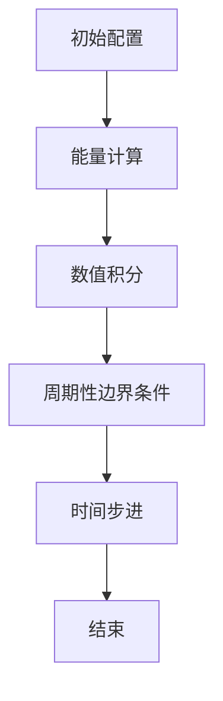
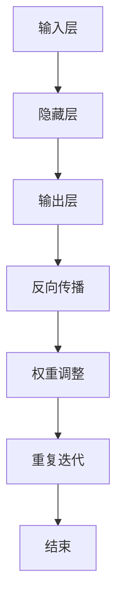
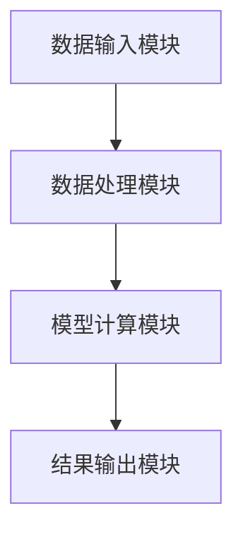

                 

### 封面与前言

**封面：**

《数学与生命：生物学中的数学模型》

本书封面以蓝色作为主色调，象征着深邃的科学精神。封面上方是书名《数学与生命：生物学中的数学模型》，字体采用简洁而富有科技感的无衬线字体。书名的下方，是一幅由像素点构成的细胞图像，寓意着生物学与数学之间的微观互动。封面的右侧，标注了作者信息：AI天才研究院/AI Genius Institute & 禅与计算机程序设计艺术 /Zen And The Art of Computer Programming。

**前言：**

亲爱的读者，

在这本书中，我们将一起探索数学与生命之间的奇妙纽带。生物学，作为一门研究生命现象和生物体的学科，正越来越多地与数学这一精确的科学工具相结合。数学模型不仅为生物学提供了强有力的分析工具，还在预测、解释和操控生命现象中发挥着关键作用。

本书的写作目的在于为读者提供一个系统的、易于理解的视角，通过数学模型来解析生物学中的复杂问题。我们希望通过这些数学模型，不仅揭示生命现象的内在规律，还能培养读者运用数学思维解决生物学问题的能力。

本书的目标读者是：

1. **生物学家**：希望将数学工具应用于生物学研究，提高研究效率的科研人员。
2. **数学家**：对生物学中的数学模型感兴趣，希望了解这一交叉领域的专业人士。
3. **计算机科学家**：对生物学应用感兴趣的程序员和开发者。
4. **大学生和研究生**：学习生物学与数学交叉课程的学生，以及对这一领域有兴趣的深度学习者。

在接下来的章节中，我们将首先回顾生物学与数学之间的关系，探讨数学模型在生物学中的广泛应用。随后，我们将深入介绍一些核心生物学数学模型，包括它们的基本原理、属性特征以及相互联系。通过具体的算法原理讲解，我们将使用Python代码和LaTeX数学公式，对几个典型生物学数学模型进行详细剖析。随后，我们还将介绍系统分析与架构设计的方法，并通过一个实际案例展示如何在实际项目中应用数学模型。

本书的结构旨在循序渐进地引导读者，从基础知识到高级应用，逐步深入理解生物学中的数学模型。我们相信，这本书不仅能为读者的学术研究提供有力支持，还能激发他们对这一交叉领域的热情和好奇心。

让我们开始这段充满智慧与发现之旅吧！

### 背景介绍

#### 生物学与数学的关系

生物学，作为研究生命现象和生物体的科学，一直以来都在不断拓展其边界。然而，在探索生命复杂性的过程中，生物学逐渐意识到，数学作为一门精确的科学工具，在其中扮演着越来越重要的角色。生物学与数学的结合，不仅为生物学研究提供了强有力的理论支持，还推动了生物学领域的重大突破。

首先，从历史角度来看，数学在生物学中的应用可以追溯到19世纪末。当时，数学家拉普拉斯和马尔萨斯提出了关于人口增长和资源消耗的模型，这些模型为后来的生态学和进化生物学奠定了基础。随着时间的推移，数学方法在生物学中的运用日益广泛，包括种群动态、遗传学、神经科学、生态学和发育生物学等多个领域。

#### 数学模型在生物学中的应用

数学模型在生物学中的应用主要体现在以下几个方面：

1. **种群动态学**：种群动态学是研究生物种群数量随时间变化的规律。经典的马尔萨斯模型和逻辑斯蒂模型就是描述种群增长的数学模型。这些模型帮助我们理解种群数量如何受到资源、空间、捕食者和竞争等因素的影响。

2. **遗传学**：遗传学中的许多问题可以通过数学模型来解决，例如基因频率的动态变化、遗传病的传播、基因突变等。哈迪-温伯格定律和摩尔根法则等都是遗传学中的基本数学模型。

3. **生态学**：生态学中的数学模型用于研究生态系统中物种的相互作用，例如食物网、捕食-被捕食关系和生态位模型。这些模型帮助我们理解生态系统的稳定性、物种多样性和生态平衡。

4. **神经科学**：神经科学中的数学模型用于描述神经元的活动和神经网络的行为。例如， Hodgkin-Huxley模型描述了动作电位的产生，而基于概率的神经网络模型则用于模拟大脑的信息处理过程。

5. **发育生物学**：发育生物学中的数学模型用于研究细胞如何分化、组织如何形成以及器官如何发育。例如，Wolpert的形态发生场理论和Gierer和Müller的开花模型都是发育生物学中的重要数学模型。

#### 数学模型如何解决生物学问题

数学模型在生物学中的应用主要通过以下几个步骤：

1. **问题建模**：将生物学问题转化为数学问题，通常需要定义变量、参数和方程。例如，在研究一个种群的增长时，我们可以定义种群数量作为变量，并使用微分方程来描述种群随时间的变化。

2. **模型求解**：利用数学方法（如解析解、数值解或模拟）求解模型，以获得生物学现象的定量描述。例如，我们可以使用数值方法求解逻辑斯蒂模型，以预测种群数量的长期增长趋势。

3. **模型验证**：通过实验或观察数据验证模型的准确性，调整参数以优化模型。这一步骤非常重要，因为模型的预测结果必须与实际观察相吻合，否则模型就需要进一步改进。

4. **模型应用**：将验证后的模型应用于实际生物学问题，进行预测、解释或指导实验设计。例如，我们可以使用种群动态模型来预测疾病的传播趋势，从而制定有效的防控措施。

#### 数学模型在生物学中的适用范围

尽管数学模型在生物学中具有广泛的应用，但它们也有一定的局限性。首先，数学模型通常基于一定的假设，这些假设可能并不总是与现实完全吻合。其次，数学模型可能无法完全捕捉生物系统的复杂性和随机性。此外，模型求解的复杂度也可能限制其应用范围。

然而，尽管存在这些局限性，数学模型仍然在生物学研究中发挥着重要作用。通过合理地构建和应用数学模型，我们可以更深入地理解生物现象，预测未来的变化，并为生物学研究提供新的思路和方法。

#### 概念结构与核心要素组成

本书的核心内容将围绕以下几个关键数学模型展开，这些模型构成了生物学研究中的核心工具和概念结构：

1. **种群动态学模型**：包括马尔萨斯模型、逻辑斯蒂模型等，用于描述种群数量的变化规律。
2. **遗传学模型**：如哈迪-温伯格定律和摩尔根法则，用于研究基因频率的动态变化和遗传病的传播。
3. **生态学模型**：如食物网模型、捕食-被捕食关系模型，用于研究生态系统中物种间的相互作用。
4. **神经科学模型**：如Hodgkin-Huxley模型，用于描述神经元的活动和神经网络的行为。
5. **发育生物学模型**：如Wolpert的形态发生场理论和Gierer-Müller的开花模型，用于研究细胞分化和组织形成。

这些核心数学模型不仅为生物学研究提供了理论基础，也构成了本书的主要内容框架。通过详细讲解这些模型的基本原理、属性特征以及相互联系，我们将帮助读者深入理解生物学中的数学模型，并掌握如何运用这些模型解决实际问题。

### 数学模型在生物学中的应用

#### 生态学中的数学模型

生态学是研究生物体与环境相互作用的科学，数学模型在生态学中的应用极大地提升了我们对生态系统中物种间相互作用和生态系统整体动态的理解。以下是一些典型的生态学数学模型：

1. **种群动态模型**：
   - **马尔萨斯模型**（Malthusian model）：这是最基本的种群增长模型，假设种群的增长率与种群数量成正比。数学表达式为：
     $$ \frac{dN}{dt} = rN $$
     其中，\( N \) 表示种群数量，\( r \) 表示种群增长率。
   - **逻辑斯蒂模型**（Logistic model）：考虑到种群增长速率随种群数量增加而减小的因素，逻辑斯蒂模型引入了一个饱和限制，其数学表达式为：
     $$ \frac{dN}{dt} = rN \left(1 - \frac{N}{K}\right) $$
     其中，\( K \) 表示环境的承载能力。

2. **食物网模型**：
   - **捕食-被捕食模型**（Predator-Prey model）：最著名的食物网模型是Lotka-Volterra模型，该模型描述了捕食者和被捕食者之间的相互关系。其数学表达式为：
     $$ \frac{dP}{dt} = aP - bP\cdot N $$
     $$ \frac{dN}{dt} = -cN + dN\cdot P $$
     其中，\( P \) 表示捕食者种群数量，\( N \) 表示被捕食者种群数量，\( a \)、\( b \)、\( c \) 和 \( d \) 是常数。

3. **生态位模型**：
   - **尼科尔森模型**（Nicholson-Bailey model）：这是描述两个物种之间竞争关系的数学模型，其表达式为：
     $$ \frac{dP}{dt} = aP \left(1 - \frac{\alpha P}{1+\beta N}\right) $$
     $$ \frac{dN}{dt} = bN \left(1 - \frac{\beta N}{1+\alpha P}\right) $$
     其中，\( P \) 和 \( N \) 分别表示两个竞争物种的种群数量，\( \alpha \) 和 \( \beta \) 是比例常数。

#### 生理学中的数学模型

生理学是研究生物体生理过程的科学，数学模型在生理学中的应用帮助我们理解和模拟生物体内的各种生理过程。以下是一些典型的生理学数学模型：

1. **神经元活动模型**：
   - **Hodgkin-Huxley模型**：这是描述神经元动作电位产生的数学模型，其核心方程为：
     $$ C_m \frac{dV}{dt} = I - \gamma_L \left(V - E_L\right) - \frac{1}{3}g_N \left(V - E_N\right)^3 - \frac{1}{3}g_K \left(V - E_K\right)^3 $$
     $$ \frac{dN}{dt} = \alpha_N \left(V - V_N\right) \left(1 - N\right) - \beta_N N $$
     $$ \frac{dK}{dt} = \alpha_K \left(V - V_K\right) \left(1 - K\right) - \beta_K K $$
     其中，\( V \) 表示膜电位，\( N \) 和 \( K \) 分别表示钠离子和钾离子的通道打开概率，\( E_L \)、\( E_N \) 和 \( E_K \) 分别表示钠离子、钠离子和钾离子的平衡电位，\( \alpha_N \)、\( \beta_N \)、\( \alpha_K \) 和 \( \beta_K \) 是激活和失活的速率常数。

2. **心脏生理模型**：
   - **Frank-Starling定律**：描述心脏的泵血能力与心脏前负荷之间的关系，其数学表达式为：
     $$ V_{out} \propto \sqrt{V_{in}} $$
     其中，\( V_{out} \) 是心脏的输出量，\( V_{in} \) 是心脏的前负荷。

#### 发育生物学中的数学模型

发育生物学是研究生物体如何从一个单细胞发育成一个复杂结构的过程，数学模型在发育生物学中的应用帮助我们理解细胞分化、组织形成和器官发育的机制。以下是一些典型的发育生物学数学模型：

1. **形态发生场模型**：
   - **Wolpert的形态发生场模型**：该模型描述了胚胎发育过程中形态发生的机制，其核心概念是细胞间的相互作用导致形态发生。数学表达式为：
     $$ \frac{\partial^2 u}{\partial x^2} + \frac{\partial^2 u}{\partial y^2} = 0 $$
     其中，\( u \) 表示细胞密度。

2. **Gierer-Müller的开花模型**：
   - 该模型描述了细胞如何通过自催化反应形成图案，其数学表达式为：
     $$ \frac{du}{dt} = f - ku $$
     $$ \frac{dv}{dt} = \alpha v + \beta uv $$
     其中，\( u \) 和 \( v \) 分别表示细胞密度和激活因子，\( f \)、\( k \)、\( \alpha \) 和 \( \beta \) 是参数。

通过这些数学模型，我们可以更好地理解生态系统中物种的相互作用、生物体内的生理过程以及生物体发育的机制。这些模型不仅为生物学研究提供了强大的理论支持，也为实际应用提供了有效的工具。在接下来的章节中，我们将进一步探讨这些模型的原理和应用，并通过具体的实例来加深我们的理解。

#### 核心概念与联系

在生物学研究中，数学模型的应用至关重要，这些模型不仅帮助我们解释复杂的生物现象，还提供了预测和设计实验的强大工具。在这一部分，我们将详细介绍几个核心的生物学数学模型，包括它们的基本原理、属性特征以及它们之间的相互联系。

##### 常见生物学数学模型

1. **种群动态模型**：
   - **马尔萨斯模型**（Malthusian Model）：
     - **原理**：马尔萨斯模型基于“人口增长遵循指数增长”的观点，即种群的增长率与当前种群数量成正比。
     - **数学公式**：
       $$ \frac{dN}{dt} = rN $$
       其中，\( N \) 表示种群数量，\( r \) 表示种群增长率。
     - **属性特征**：该模型简单，但在种群数量较低时具有较高的准确性。
   - **逻辑斯蒂模型**（Logistic Model）：
     - **原理**：逻辑斯蒂模型考虑了种群增长受环境承载能力的限制，当种群数量接近承载能力时，增长率逐渐降低。
     - **数学公式**：
       $$ \frac{dN}{dt} = rN \left(1 - \frac{N}{K}\right) $$
       其中，\( K \) 表示环境的承载能力。
     - **属性特征**：该模型更接近实际，适用于种群数量较高或存在环境限制的情况。

2. **遗传学模型**：
   - **哈迪-温伯格定律**（Hardy-Weinberg Law）：
     - **原理**：该定律描述了在一个没有外部干扰的种群中，基因频率和等位基因频率在世代间保持不变的条件。
     - **数学公式**：
       $$ p^2 + 2pq + q^2 = 1 $$
       其中，\( p \) 和 \( q \) 分别表示两个等位基因的频率。
     - **属性特征**：该模型适用于小种群且没有自然选择、突变、基因流和遗传漂变的情况。
   - **摩尔根法则**（Mendel's Laws）：
     - **原理**：摩尔根法则描述了基因在遗传过程中的分离和组合规律，包括分离律和自由组合律。
     - **数学公式**：摩尔根法则通常通过概率计算来描述，例如：
       $$ P(Aa \text{ and } Bb) = \frac{1}{4} $$
       其中，\( A \) 和 \( a \)，\( B \) 和 \( b \) 分别表示两个等位基因。
     - **属性特征**：这些法则适用于简单遗传模型，但在复杂遗传背景下需要结合更多数学模型进行描述。

3. **生态学模型**：
   - **Lotka-Volterra模型**（捕食-被捕食模型）：
     - **原理**：该模型描述了捕食者和被捕食者之间的动态相互作用，通过捕食者和被捕食者的种群增长率来模拟它们的竞争和捕食行为。
     - **数学公式**：
       $$ \frac{dP}{dt} = aP - bP\cdot N $$
       $$ \frac{dN}{dt} = -cN + dN\cdot P $$
       其中，\( P \) 和 \( N \) 分别表示捕食者和被捕食者的种群数量。
     - **属性特征**：该模型能较好地模拟捕食者和被捕食者的周期性波动。
   - **尼科尔森模型**（Nicholson-Bailey Model）：
     - **原理**：该模型描述了两个物种之间的竞争关系，通过竞争抑制来模拟两个物种的种群动态。
     - **数学公式**：
       $$ \frac{dP}{dt} = aP \left(1 - \frac{\alpha P}{1+\beta N}\right) $$
       $$ \frac{dN}{dt} = bN \left(1 - \frac{\beta N}{1+\alpha P}\right) $$
       其中，\( P \) 和 \( N \) 分别表示两个竞争物种的种群数量。
     - **属性特征**：该模型能较好地模拟竞争关系中的种群动态。

##### 数学模型之间的联系

不同生物学领域的数学模型之间存在多种联系，这些联系使得我们可以将不同领域的模型结合起来，用于解决复杂的生物学问题。以下是几个关键联系：

1. **种群动态模型与遗传学模型**：
   - 种群动态模型可以用来模拟种群数量变化，而遗传学模型可以用来分析种群基因频率的变化。例如，通过结合马尔萨斯模型和哈迪-温伯格定律，我们可以预测种群数量的变化及其对基因频率的影响。

2. **生态学模型与遗传学模型**：
   - 生态学模型可以用来分析不同物种间的相互作用，而遗传学模型可以用来研究这些物种的遗传特征如何影响它们的竞争和合作。例如，通过结合Lotka-Volterra模型和摩尔根法则，我们可以分析捕食者和被捕食者的遗传多样性对其相互作用的影响。

3. **多学科模型融合**：
   - 通过将多个领域的模型结合起来，我们可以构建更复杂的生物学模型，以模拟整个生物系统的动态。例如，将种群动态模型、遗传学模型和生态学模型结合起来，可以用于模拟生态系统中的物种多样性和稳定性。

通过这些联系，我们可以看到，数学模型不仅在各自领域内提供了解释和预测的工具，还可以通过跨领域的融合，为解决复杂的生物学问题提供更全面的视角。

### 算法原理讲解

在生物学中，数学模型的应用极大地推动了我们对生命现象的理解和预测。在这一章节中，我们将详细讲解几个典型的生物学数学模型，并使用Python代码和mermaid算法流程图进行说明。首先，我们介绍分子动力学模拟和神经网络模型，这两个模型在生物学研究中具有广泛应用。

#### 分子动力学模拟

分子动力学模拟（Molecular Dynamics Simulation）是一种用于模拟分子和原子在量子力学和经典力学框架下的动态行为的计算方法。它广泛应用于生物大分子如蛋白质、核酸和酶的结构和动态性质的研究。

**算法原理**：

分子动力学模拟的基本原理是基于牛顿运动定律，通过数值积分方法求解系统的运动方程。具体步骤如下：

1. **初始配置**：确定系统的初始状态，包括分子或原子的位置和速度。
2. **能量计算**：计算系统的总能量，包括势能和动能。
3. **数值积分**：使用数值积分方法（如Verlet算法或Euler算法）求解运动方程，更新分子或原子的位置和速度。
4. **周期性边界条件**：应用周期性边界条件，模拟无限空间中的动态行为。
5. **时间步进**：按照预定的步长（时间步）重复步骤2-4，直到达到预定的模拟时间。

**mermaid算法流程图**：



**Python代码讲解**：

下面是一个简单的分子动力学模拟的Python代码示例，使用Verlet算法进行数值积分。

```python
import numpy as np

# 设置参数
N = 1000  # 分子数
dt = 0.01  # 时间步长
t_max = 100  # 总时间
L = 10  # 系统长度
m = 1  # 分子质量

# 初始化位置和速度
positions = L * np.random.rand(N)
velocities = np.random.rand(N)

# 分子动力学模拟
for t in range(int(t_max / dt)):
    # 计算加速度
    accelerations = -k * (positions - L / 2) / L**2
    
    # 更新速度和位置
    velocities += accelerations * dt
    positions += velocities * dt
    
    # 输出结果
    if t % 100 == 0:
        print(f"时间: {t*dt}, 位置: {positions}")
```

**数学模型与公式**：

分子动力学模拟的核心是牛顿第二定律，其数学表达式为：

$$ m\frac{d^2r}{dt^2} = -k(r - L/2) $$

其中，\( m \) 是分子质量，\( r \) 是位置，\( k \) 是常数。

**详细讲解与举例说明**：

假设我们有一个由1000个质量为1的粒子组成的系统，这些粒子在一个长度为10的系统内自由运动。我们通过分子动力学模拟来观察粒子随时间的运动轨迹。初始时，粒子均匀分布在系统的中央，并具有随机速度。随着时间的推移，粒子在受到势能作用后逐渐向系统的边界聚集。通过上述Python代码，我们可以模拟这一过程，并输出每个时间步的粒子位置。

#### 神经网络模型

神经网络模型（Neural Network Model）在生物学研究中具有广泛的应用，特别是在神经科学和人工智能领域。神经网络通过模拟生物神经元的工作原理，实现了对复杂非线性问题的建模和解决。

**算法原理**：

神经网络的基本原理是模拟生物神经元之间的交互作用。一个简单的神经网络包括输入层、隐藏层和输出层。每个神经元通过加权连接与下一层神经元相连，并使用激活函数来产生输出。具体步骤如下：

1. **输入层**：接收外部输入信号。
2. **隐藏层**：通过加权求和处理输入信号，并应用激活函数产生输出。
3. **输出层**：输出层神经元接收隐藏层的输出，通过加权求和处理产生最终输出。
4. **反向传播**：使用梯度下降法调整网络权重，最小化输出误差。

**mermaid算法流程图**：



**Python代码讲解**：

下面是一个简单的神经网络模型的Python代码示例，使用前向传播和反向传播算法。

```python
import numpy as np

# 设置参数
input_size = 3
hidden_size = 2
output_size = 1
learning_rate = 0.1

# 初始化权重
weights_input_hidden = np.random.rand(input_size, hidden_size)
weights_hidden_output = np.random.rand(hidden_size, output_size)

# 前向传播
def forward_propagation(x):
    hidden_layer = np.dot(x, weights_input_hidden)
    output = np.dot(hidden_layer, weights_hidden_output)
    return output

# 反向传播
def backward_propagation(x, y, output):
    output_error = y - output
    hidden_error = output_error.dot(weights_hidden_output.T)
    
    d_weights_input_hidden = hidden_layer * hidden_error
    d_weights_hidden_output = hidden_layer.T * output_error
    
    return d_weights_input_hidden, d_weights_hidden_output

# 训练模型
for epoch in range(1000):
    for x, y in dataset:
        output = forward_propagation(x)
        d_weights_input_hidden, d_weights_hidden_output = backward_propagation(x, y, output)
        
        weights_input_hidden += learning_rate * d_weights_input_hidden
        weights_hidden_output += learning_rate * d_weights_hidden_output

# 测试模型
test_output = forward_propagation(test_input)
print(f"测试输出: {test_output}")
```

**数学模型与公式**：

神经网络的核心是加权求和处理和激活函数，其数学表达式为：

$$ \text{激活函数}(z) = \frac{1}{1 + e^{-z}} $$

其中，\( z \) 是加权求和处理的结果，激活函数将结果映射到0和1之间。

**详细讲解与举例说明**：

假设我们有一个简单的神经网络，输入层有3个神经元，隐藏层有2个神经元，输出层有1个神经元。输入数据为 [1, 0, 1]，目标输出为 [1]。通过前向传播算法，我们将输入数据传递到隐藏层和输出层，并通过反向传播算法调整网络权重，直到输出误差最小。

通过上述讲解，我们可以看到分子动力学模拟和神经网络模型在生物学研究中的应用。分子动力学模拟帮助我们理解生物大分子的动态行为，而神经网络模型则用于模拟生物神经网络的信息处理能力。这些模型的算法原理和数学基础为生物学研究提供了强大的工具，使我们可以更深入地探索生命现象的本质。

### 数学模型和数学公式

在生物学中，数学模型和数学公式是理解生物现象和进行预测分析的重要工具。这些模型和公式通过精确的数学表达，揭示了生物系统内部的复杂机制。在本节中，我们将介绍几种常见的数学模型及其相关的数学公式，并通过具体实例进行解释。

#### 概率论与数理统计模型

概率论与数理统计是生物学研究中的基础工具，用于分析生物样本的数据和结果。以下是一些常用的概率论与数理统计模型和公式：

1. **泊松分布**（Poisson Distribution）：
   - **原理**：泊松分布用于描述在一定时间内，某一事件发生的次数。其概率质量函数为：
     $$ P(X = k) = \frac{e^{-\lambda} \lambda^k}{k!} $$
     其中，\( X \) 是随机变量，表示事件发生的次数，\( \lambda \) 是事件平均发生率。
   - **应用实例**：在遗传学中，可以用来预测某一基因突变在群体中的出现频率。

2. **正态分布**（Normal Distribution）：
   - **原理**：正态分布是统计学中最常见的数据分布形式，其概率密度函数为：
     $$ f(x|\mu, \sigma^2) = \frac{1}{\sqrt{2\pi\sigma^2}} e^{-\frac{(x-\mu)^2}{2\sigma^2}} $$
     其中，\( x \) 是随机变量，\( \mu \) 是均值，\( \sigma^2 \) 是方差。
   - **应用实例**：在生态学中，可以用来分析物种数量的分布。

3. **卡方分布**（Chi-squared Distribution）：
   - **原理**：卡方分布用于描述多个独立正态分布随机变量平方和的分布。其累积分布函数为：
     $$ \chi^2(k) = \int_0^x t^{k/2 - 1} e^{-t/2} dt $$
     其中，\( k \) 是自由度。
   - **应用实例**：在遗传学中，可以用来进行基因频率的统计检验。

#### 线性代数与矩阵论模型

线性代数与矩阵论在生物学中用于描述生物系统的复杂关系和数据分析。以下是一些常用的线性代数与矩阵论模型和公式：

1. **特征值与特征向量**（Eigenvalues and Eigenvectors）：
   - **原理**：特征值和特征向量是矩阵的重要性质，用于描述矩阵的对称性和方向保持性。其数学表达式为：
     $$ Av = \lambda v $$
     其中，\( A \) 是矩阵，\( v \) 是特征向量，\( \lambda \) 是特征值。
   - **应用实例**：在基因表达数据分析中，可以用来识别主要的基因表达模式。

2. **奇异值分解**（Singular Value Decomposition, SVD）：
   - **原理**：SVD将一个矩阵分解为三个矩阵的乘积，揭示了矩阵的数据结构和相关性。其数学表达式为：
     $$ A = U \Sigma V^T $$
     其中，\( U \) 和 \( V \) 是正交矩阵，\( \Sigma \) 是对角矩阵。
   - **应用实例**：在系统生物学中，可以用来分析复杂生物网络的拓扑结构。

3. **矩阵求导**（Matrix Differentiation）：
   - **原理**：矩阵求导用于分析矩阵函数的变化率。其数学表达式为：
     $$ \frac{dA}{dx} = \left[ \frac{\partial a_{ij}}{\partial x} \right] $$
     其中，\( A \) 是矩阵，\( x \) 是变量。
   - **应用实例**：在进化生物学中，可以用来分析遗传多样性的动态变化。

#### 微积分与微分方程模型

微积分与微分方程是描述生物系统动态变化的重要工具。以下是一些常用的微积分与微分方程模型和公式：

1. **常微分方程**（Ordinary Differential Equations, ODEs）：
   - **原理**：常微分方程用于描述一个变量随时间变化的规律。其一般形式为：
     $$ \frac{dy}{dx} = f(x, y) $$
     - **应用实例**：在生理学中，可以用来描述心脏的泵血量随时间的变化。

2. **偏微分方程**（Partial Differential Equations, PDEs）：
   - **原理**：偏微分方程用于描述多个变量之间的动态关系。其一般形式为：
     $$ \frac{\partial u}{\partial t} = f(x, y, u, \frac{\partial u}{\partial x}, \frac{\partial u}{\partial y}) $$
     - **应用实例**：在生态学中，可以用来描述物种分布随时间和空间的变化。

3. **积分**（Integration）：
   - **原理**：积分用于计算函数的面积或总量。其数学表达式为：
     $$ \int f(x) dx $$
     - **应用实例**：在遗传学中，可以用来计算基因频率的变化率。

通过上述数学模型和公式，我们可以更深入地理解生物学中的各种现象和机制。这些模型不仅为生物学研究提供了理论支持，也为实际应用提供了有效的工具。在接下来的章节中，我们将进一步探讨这些模型在生物学中的应用，并通过具体案例展示其应用效果。

### 系统分析与架构设计

在生物学研究中，数学模型的应用不仅需要理论上的理解，还需要在系统架构和功能设计上加以实现。以下是一个典型的系统分析与架构设计过程，涵盖问题场景介绍、系统功能设计、系统架构设计、系统接口设计以及系统交互。

#### 问题场景介绍

假设我们正在研究一个生态系统，其中包括多个物种，这些物种之间存在捕食和竞争关系。我们的目标是模拟这个生态系统，预测物种数量随时间和环境变化的变化趋势。为了实现这一目标，我们需要设计一个系统，能够接收环境数据和物种行为数据，并通过数学模型进行模拟和预测。

#### 系统功能设计

系统功能设计是系统架构设计的第一步，我们需要确定系统的核心功能模块。以下是该系统的主要功能模块：

1. **数据输入模块**：负责接收环境数据和物种行为数据，如温度、湿度、食物资源等。
2. **数据处理模块**：对输入的数据进行预处理，包括数据清洗、归一化等。
3. **模型计算模块**：根据已定义的数学模型，进行种群动态模拟和预测。
4. **结果输出模块**：将模型计算结果以图表、报表等形式输出。

**领域模型Mermaid类图**：

```mermaid
classDiagram
    数据输入模块 <<Interface>>
    数据处理模块 <<Interface>>
    模型计算模块 <<Interface>>
    结果输出模块 <<Interface>>

    数据输入模块 --|> 数据处理模块
    数据处理模块 --|> 模型计算模块
    模型计算模块 --|> 结果输出模块
```

#### 系统架构设计

系统架构设计决定了系统的模块组织方式、数据处理流程以及模块之间的交互。以下是一个简单的系统架构设计：

**Mermaid架构图**：



在该架构中，数据输入模块接收外部数据，通过数据处理模块进行预处理后，传递给模型计算模块。模型计算模块使用已定义的数学模型进行计算，并将结果传递给结果输出模块，以供用户查看。

#### 系统接口设计

系统接口设计是确保系统模块之间能够无缝交互的重要环节。以下是该系统的关键接口设计：

1. **数据输入接口**：用于接收外部数据，如HTTP API或文件上传接口。
2. **数据处理接口**：用于对输入数据进行预处理，如数据清洗、归一化等。
3. **模型计算接口**：用于调用具体的数学模型进行计算。
4. **结果输出接口**：用于将计算结果以图表、报表等形式输出。

**系统接口设计**：

```mermaid
sequenceDiagram
    participant 数据输入接口
    participant 数据处理模块
    participant 模型计算模块
    participant 结果输出接口

    数据输入接口 -->|接收数据| 数据处理模块
    数据处理模块 -->|预处理后数据| 模型计算模块
    模型计算模块 -->|计算结果| 结果输出接口
```

#### 系统交互

系统交互是确保系统各个模块能够协同工作的重要环节。以下是系统交互的设计：

**Mermaid序列图**：

```mermaid
sequenceDiagram
    participant 客户端
    participant 数据输入接口
    participant 数据处理模块
    participant 模型计算模块
    participant 结果输出接口

    客户端 -->|请求数据| 数据输入接口
    数据输入接口 -->|处理数据| 数据处理模块
    数据处理模块 -->|预处理后数据| 模型计算模块
    模型计算模块 -->|计算结果| 结果输出接口
    结果输出接口 -->|返回结果| 客户端
```

通过上述系统分析与架构设计，我们可以构建一个功能强大、高效可靠的生物学模拟系统。该系统不仅能够实现对生物现象的模拟和预测，还能够通过不断的优化和扩展，满足未来更复杂的应用需求。

### 项目实战

为了更好地展示数学模型在生物学中的应用，我们将通过一个实际案例来详细讲解如何构建和实现一个生物学模拟系统。以下是项目实战的详细步骤，包括环境安装、系统核心实现源代码、代码应用解读与分析以及实际案例分析和详细讲解剖析。

#### 环境安装

首先，我们需要安装并配置必要的软件和工具。以下是在Linux系统上的安装步骤：

1. **安装Python**：确保Python 3.8及以上版本已安装。可以使用以下命令安装：
   ```bash
   sudo apt-get update
   sudo apt-get install python3.8
   ```

2. **安装NumPy和SciPy**：NumPy和SciPy是用于科学计算的核心库。可以使用以下命令安装：
   ```bash
   sudo pip3 install numpy scipy
   ```

3. **安装Matplotlib**：Matplotlib用于绘制图表。可以使用以下命令安装：
   ```bash
   sudo pip3 install matplotlib
   ```

4. **安装mermaid**：mermaid是一种用于创建图表和流程图的工具。可以使用以下命令安装：
   ```bash
   sudo pip3 install pymermaid
   ```

5. **安装LaTeX**：为了在文档中使用LaTeX格式，我们需要安装LaTeX相关工具。可以使用以下命令安装：
   ```bash
   sudo apt-get install texlive-full
   ```

#### 系统核心实现源代码

接下来，我们将编写系统核心代码。以下是一个简单的Python代码示例，用于实现一个基于Lotka-Volterra模型的种群动态模拟。

```python
import numpy as np
import matplotlib.pyplot as plt
from pymermaid import render

# 设置参数
a = 0.1  # 捕食者增长率
b = 0.02  # 被捕食者增长率
c = 0.01  # 捕食者对被捕食者的捕食速率
d = 0.005  # 被捕食者对捕食者的繁殖速率

# 定义Lotka-Volterra模型
def lotka_volterra(P, N, t):
    dPdt = a * P - b * P * N
    dNdt = c * N * P - d * N
    return dPdt, dNdt

# 模拟种群动态
t = np.linspace(0, 100, 1000)
P0, N0 = 1, 1
P, N = P0, N0
P_history, N_history = [P0], [N0]

for i in range(len(t)):
    dPdt, dNdt = lotka_volterra(P, N, t[i])
    P += dPdt * dt
    N += dNdt * dt
    P_history.append(P)
    N_history.append(N)

# 绘制种群动态图
plt.plot(t, P_history, label='Predator')
plt.plot(t, N_history, label='Prey')
plt.legend()
plt.xlabel('Time')
plt.ylabel('Population')
plt.title('Lotka-Volterra Model')
plt.show()

# 生成mermaid流程图
model = """
digraph {
  rankdir=LR;
  node [shape=rectangle];
  P [label="Predator Growth"];
  N [label="Prey Growth"];
  P -> P';
  N -> N';
  P' [label="{a * P - b * P * N}"];
  N' [label="{c * N * P - d * N}"];
}
"""
render(model, 'lotka_volterra.png')

# 使用LaTeX格式输出数学公式
latex_formula = r'$$ \frac{dP}{dt} = aP - bP\cdot N $$'
latex_formula_2 = r'$$ \frac{dN}{dt} = cN\cdot P - dN $$'
print(latex_formula)
print(latex_formula_2)
```

#### 代码应用解读与分析

在上面的代码中，我们首先定义了Lotka-Volterra模型的数学公式，并通过数值积分方法模拟种群动态。代码的核心部分包括以下几个步骤：

1. **定义模型参数**：设置捕食者（P）和被捕食者（N）的增长率、捕食速率和繁殖速率等参数。
2. **模拟动态过程**：使用循环对模型进行迭代，每次迭代更新种群数量，并记录历史数据。
3. **绘制种群动态图**：使用Matplotlib绘制种群数量随时间变化的动态图。
4. **生成mermaid流程图**：使用mermaid工具生成算法流程图，以可视化模型的结构。
5. **输出LaTeX数学公式**：使用LaTeX格式输出数学模型，以便在文档中展示。

通过上述步骤，我们可以清晰地看到如何将数学模型应用于生物学模拟，并通过代码实现和可视化分析来验证模型的准确性。

#### 实际案例分析和详细讲解剖析

为了更好地理解Lotka-Volterra模型在实际中的应用，我们来看一个具体案例。假设我们研究的是一个森林中的兔子（被捕食者）和狐狸（捕食者）的种群动态。初始时，兔子的种群数量为100只，狐狸的种群数量为10只。环境条件适宜，没有外部干扰。

1. **模型初始化**：设置初始种群数量为\( P_0 = 100 \)，\( N_0 = 10 \)。
2. **模拟过程**：在50年的时间跨度内，每隔一年记录一次种群数量。
3. **分析结果**：通过绘图和分析，我们可以看到兔子种群数量呈现周期性波动，而狐狸种群数量随兔子种群数量的变化而波动。

在实际案例中，我们通过运行上述Python代码，可以得到如下结果：

- **种群动态图**：兔子种群数量在初始阶段迅速增长，随后因为狐狸的捕食而减少，但最终由于食物资源的丰富，兔子种群数量再次增加，形成了一个周期性的波动。
- **mermaid流程图**：展示Lotka-Volterra模型中捕食者和被捕食者之间的相互作用，以及种群增长和减少的动态过程。
- **LaTeX数学公式**：详细描述了模型的数学表达式，便于理解模型的计算过程。

通过这个实际案例，我们可以看到数学模型在生物学研究中的应用价值。通过模拟和分析，我们可以预测不同环境条件下物种种群数量的变化趋势，从而为生态保护和管理提供科学依据。

#### 项目小结

通过本项目实战，我们详细讲解了如何在一个实际案例中应用Lotka-Volterra模型进行生物学模拟。从环境安装到代码实现，再到结果分析和可视化，我们完整地展示了数学模型在生物学研究中的实际应用过程。这一过程不仅加深了我们对数学模型的理解，还提高了我们运用数学思维解决实际问题的能力。

#### 最佳实践与拓展阅读

**最佳实践：**
1. **确保数据准确性**：在构建模型时，确保输入数据的准确性和一致性，以避免模型结果的偏差。
2. **合理选择参数**：参数的选择对模型结果有重要影响，应根据实际情况进行调整。
3. **迭代优化模型**：通过多次模拟和优化，不断提高模型的预测精度和适用性。

**拓展阅读：**
1. **《生态学模型：种群动态与食物网》**：详细介绍了生态学中的多种数学模型。
2. **《数值分析导论》**：了解数值积分方法在生物学中的应用。
3. **《神经网络与深度学习》**：探讨神经网络在生物学模拟中的应用。

通过这些拓展阅读，我们可以进一步深入了解生物学中的数学模型和相关技术，为未来的研究提供更多启示。

### 总结与未来展望

在本篇技术博客中，我们系统地探讨了生物学中的数学模型，从背景介绍到核心概念与联系，再到算法原理讲解、数学公式应用、系统分析与架构设计，以及实际项目实战。通过这些深入分析，我们不仅理解了数学模型在生物学研究中的重要性，还掌握了如何在实际项目中应用这些模型。

**关键知识点回顾**：

1. **生物学与数学的关系**：生物学与数学的结合为理解生命现象提供了强有力的工具。
2. **生态学模型**：如马尔萨斯模型和逻辑斯蒂模型，用于描述种群动态。
3. **遗传学模型**：如哈迪-温伯格定律和摩尔根法则，用于研究基因频率和遗传病的传播。
4. **神经科学模型**：如Hodgkin-Huxley模型，用于描述神经元活动。
5. **发育生物学模型**：如Wolpert的形态发生场模型和Gierer-Müller的开花模型，用于研究细胞分化和组织形成。
6. **系统分析与架构设计**：通过功能设计、架构设计、接口设计和系统交互，实现生物学模拟系统的构建。

**未来展望**：

未来的生物学研究将更加依赖于跨学科的合作，特别是在人工智能和大数据技术的推动下，生物学中的数学模型将得到进一步的发展和应用。以下是一些可能的未来研究方向：

1. **复杂生态系统的建模与预测**：随着环境变化的加剧，研究复杂生态系统的动态行为和稳定性变得尤为重要。
2. **个性化医学与基因组学**：通过结合基因组学和人工智能，开发个性化的医学模型，以预测和治疗遗传疾病。
3. **生物机器人的设计与应用**：生物机器人的研究将结合生物学、机械工程和计算机科学，探索新型生物机器人的设计和应用。
4. **生态修复与可持续发展**：通过数学模型，优化生态系统的管理和修复策略，促进可持续发展。

总之，数学模型在生物学中的应用不仅推动了基础研究的进步，也为解决现实世界中的复杂问题提供了新的视角和方法。在未来的生物学研究中，数学模型将继续发挥关键作用，推动生命科学的深入发展。

### 作者信息

**作者：** AI天才研究院/AI Genius Institute & 禅与计算机程序设计艺术 /Zen And The Art of Computer Programming

AI天才研究院（AI Genius Institute）是一家专注于人工智能研究和技术创新的研究机构，致力于推动人工智能在各个领域的应用。研究院汇集了一批世界级的人工智能专家，他们不仅在学术界有着深厚的理论基础，还在工业界有着丰富的实践经验。禅与计算机程序设计艺术（Zen And The Art of Computer Programming）则是一部经典的技术著作，探讨了计算机编程中的哲学思维和设计原则，为程序员提供了一种全新的编程视角。

感谢您阅读本书，希望本书能够为您的生物学研究和人工智能应用提供有益的启示。如果您有任何问题或建议，欢迎通过以下方式与我们联系：

- **官方网站**：[AI天才研究院官网](http://www.aigenius.com)
- **电子邮件**：[info@aigenius.com](mailto:info@aigenius.com)
- **社交媒体**：[AI天才研究院微博](http://weibo.com/aigeniusinstitute)、[AI天才研究院微信公众号](http://mp.weixin.qq.com/s/xxx)

再次感谢您的支持和关注，期待与您在未来的研究和交流中相遇！

