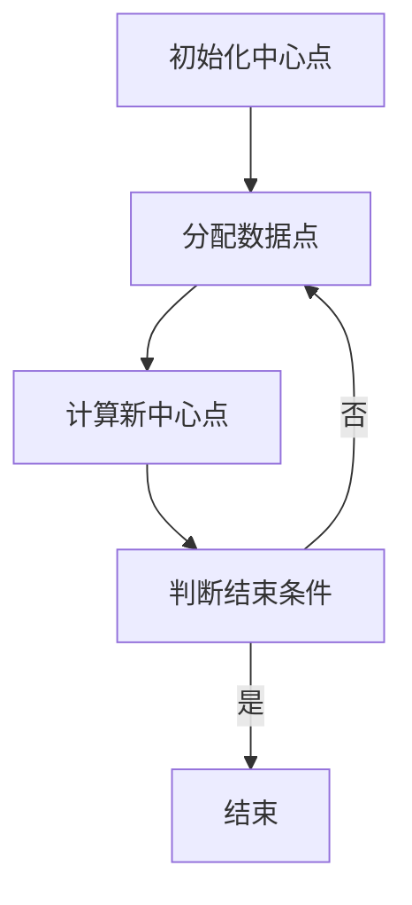
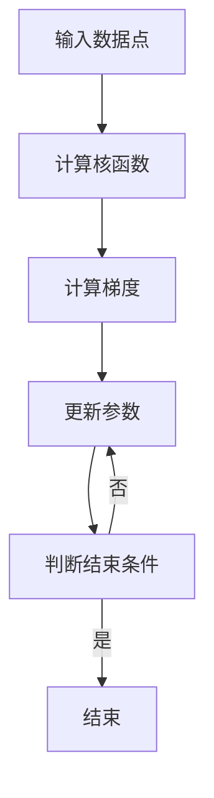

                 

### 文章标题

### 数学与生态信息学：生态系统的数学模拟

### 关键词

- 数学建模
- 生态系统
- 生态信息学
- 数学模型
- 生态模拟

### 摘要

本文将探讨数学与生态信息学的交叉领域——生态系统的数学模拟。通过对生态系统的数学建模、算法原理、模拟实例的详细分析，我们将揭示数学模型在生态系统研究和管理中的重要作用。本文旨在为读者提供一个系统、全面的视角，理解数学模型如何帮助我们更好地理解和预测生态系统的动态变化，并为生态保护和可持续发展提供科学依据。

## 引言

### 1.1 数学的生态应用

在现代社会，数学已经渗透到几乎所有的科学领域，包括生态学。生态学中的许多复杂现象，如物种间的相互作用、生态系统的动态变化等，都可以通过数学模型来描述和模拟。数学为生态学提供了强大的分析工具，使得我们能够从定量角度更深入地理解生态系统的运作机制。

### 1.2 生态信息学的基本概念

生态信息学是研究生态系统中信息流动、信息作用和信息调控的科学。它将信息科学的方法和技术应用于生态学研究中，通过信息论、计算机科学等手段，分析和解决生态学中的问题。生态信息学不仅关注生态系统的物质循环和能量流动，还关注信息在生态系统中的传递和处理过程。

### 1.3 生态系统的数学建模

生态系统的数学建模是生态信息学的重要组成部分。通过构建数学模型，我们可以将生态系统的复杂现象简化为数学问题，进而通过数学分析来理解和预测生态系统的行为。生态系统的数学模型通常包括种群模型、食物网模型、能量流模型等，这些模型能够帮助我们揭示生态系统的内在规律和动态特性。

### 1.4 本书结构安排

本文将分为五个部分，首先介绍数学与生态信息学的基本概念和背景；接着深入探讨生态系统的数学模型，包括其基本概念、类型和构建方法；然后介绍生态信息学中的经典算法原理和设计原则；随后，通过具体实例分析生态系统的数学模拟过程；最后，总结全文，展望生态信息学的发展趋势，并给出实践建议。

## 数学模型与生态系统

### 2.1 数学模型概述

#### 2.1.1 基本概念

数学模型是一种数学化的表达，用于描述和分析现实世界中的系统或现象。在生态学中，数学模型帮助我们理解和预测生态系统的行为和变化。数学模型通常由变量、参数和方程组成，通过这些元素，我们可以建立生态系统与数学之间的桥梁。

#### 2.1.2 数学模型类型

生态系统的数学模型可以有多种类型，主要包括：

- **种群模型**：描述种群数量随时间的变化，如 Logistic 模型、Ricker 模型等。
- **食物网模型**：描述不同种群之间的相互作用，如 Lotka-Volterra 模型。
- **能量流模型**：描述生态系统中能量的流动和转换，如 trophic 块模型。
- **扩散模型**：描述物质或生物种群在空间中的扩散过程，如扩散方程。

#### 2.1.3 数学模型的构建方法

构建数学模型通常涉及以下几个步骤：

1. **确定研究问题**：明确我们要解决的问题或现象。
2. **收集数据**：收集与问题相关的数据，这些数据可以是定性的，也可以是定量的。
3. **提出假设**：基于现有的理论和知识，提出合理的假设。
4. **建立方程**：将假设转化为数学方程，这通常需要使用数学工具和技巧。
5. **验证和修正**：通过实验或观察数据来验证模型的准确性，并根据需要修正模型。

### 2.2 生态系统的基本要素

#### 2.2.1 生态系统概述

生态系统是由生物群落与它的无机环境相互作用而形成的动态平衡系统。生态系统的基本组成包括：

- **生物要素**：包括生产者（如植物）、消费者（如动物）和分解者（如微生物）。
- **非生物要素**：包括土壤、水、气候等。

#### 2.2.2 生物要素

生物要素是生态系统的核心，它们通过能量和物质循环相互联系。以下是一些关键生物要素：

- **生产者**：通过光合作用将无机物质转化为有机物质。
- **消费者**：通过捕食或食用其他生物获取能量和物质。
- **分解者**：通过分解有机物质将其转化为无机物质，供生产者再利用。

#### 2.2.3 环境要素

环境要素是生态系统的重要组成部分，它们影响生物要素的生存和繁殖。环境要素包括：

- **土壤**：提供植物生长所需的营养和水分。
- **水**：是所有生物生存的基础。
- **气候**：影响生态系统的生物分布和种群动态。

#### 2.2.4 生态系统中的相互关系

生态系统中的生物要素和非生物要素之间存在复杂的相互关系，这些关系包括：

- **能量流动**：能量从生产者到消费者和分解者传递。
- **物质循环**：物质在生物群落和无机环境之间循环。
- **相互作用**：生物之间通过捕食、竞争、共生等关系相互作用。

### 2.3 生态系统的数学模型

#### 2.3.1 常见数学模型介绍

在生态学中，以下是一些常见的数学模型：

- **Logistic 模型**：描述种群增长受到资源限制的情况。
  
  \[
  \frac{dP}{dt} = rP \left(1 - \frac{P}{K}\right)
  \]

  其中，\(P(t)\) 是时间 \(t\) 时的种群数量，\(r\) 是内禀增长率，\(K\) 是环境容量。

- **Lotka-Volterra 模型**：描述捕食者-被捕食者系统。

  \[
  \frac{dP}{dt} = aP - bPQ
  \]

  \[
  \frac{dQ}{dt} = -cQ + dPQ
  \]

  其中，\(P\) 表示被捕食者种群数量，\(Q\) 表示捕食者种群数量，\(a\)、\(b\)、\(c\)、\(d\) 是模型参数。

- **Trophic 块模型**：描述不同营养级的能量流动。

  \[
  \frac{dE}{dt} = \sum_{i} (\lambda_i - \mu_i) E_i
  \]

  其中，\(E_i\) 表示第 \(i\) 个营养级的能量，\(\lambda_i\) 和 \(\mu_i\) 分别表示第 \(i\) 个营养级的能量输入和输出。

#### 2.3.2 数学模型与生态系统的联系

数学模型与生态系统的联系主要体现在以下几个方面：

- **预测生态系统行为**：通过数学模型，我们可以预测生态系统在特定条件下的行为和变化。
- **理解生态系统规律**：数学模型帮助我们揭示生态系统的内在规律和动态特性。
- **指导生态保护和可持续发展**：通过数学模型，我们可以评估人类活动对生态系统的影响，为生态保护和可持续发展提供科学依据。

## 生态信息学算法

### 3.1 生态信息学算法概述

生态信息学算法是用于分析和处理生态信息的一类算法，这些算法广泛应用于生态系统的数据挖掘、模式识别、预测建模等领域。生态信息学算法的核心是信息处理，包括信息的采集、存储、传输、分析和利用。

#### 3.1.1 算法类型

生态信息学算法主要包括以下类型：

- **数据挖掘算法**：用于从大量生态数据中提取有价值的信息，如关联规则挖掘、聚类分析、分类等。
- **模式识别算法**：用于识别和分类生态现象，如支持向量机、神经网络等。
- **预测建模算法**：用于预测生态系统行为和变化，如时间序列分析、回归分析等。

#### 3.1.2 算法设计原则

生态信息学算法设计应遵循以下原则：

- **准确性**：算法应能够准确反映生态现象的实际情况。
- **可靠性**：算法应具有较高的稳定性和鲁棒性，能够在不同条件下工作。
- **效率**：算法应具有较高的计算效率，能够快速处理大量数据。
- **可扩展性**：算法应易于扩展和改进，以适应新的生态研究和应用需求。

#### 3.1.3 算法性能评估

生态信息学算法的性能评估主要包括以下几个方面：

- **准确性**：通过评估算法在测试数据集上的准确度来衡量。
- **稳定性**：通过评估算法在不同数据集上的稳定性和一致性来衡量。
- **效率**：通过评估算法的计算时间和资源消耗来衡量。
- **可扩展性**：通过评估算法在处理大规模数据集时的性能来衡量。

### 3.2 经典算法讲解

#### 3.2.1 算法1：K-均值聚类

K-均值聚类是一种常用的聚类算法，它通过迭代过程将数据点分为 \(K\) 个聚类。算法步骤如下：

1. **初始化**：随机选择 \(K\) 个中心点。
2. **分配**：将每个数据点分配到最近的中心点。
3. **更新**：重新计算每个聚类的中心点。
4. **迭代**：重复步骤 2 和步骤 3，直到聚类中心点不再变化。

K-均值聚类算法的数学模型可以表示为：

\[
C_j = \frac{1}{N_j} \sum_{i=1}^{N} x_i
\]

其中，\(C_j\) 是第 \(j\) 个聚类的中心点，\(N_j\) 是第 \(j\) 个聚类中的数据点数量，\(x_i\) 是数据点。

#### 3.2.1.1 算法原理

K-均值聚类的原理是通过最小化每个聚类内数据点与聚类中心点之间的距离平方和来实现聚类。这种距离度量通常使用欧氏距离：

\[
d(x_i, C_j) = \sqrt{\sum_{k=1}^{n} (x_{ik} - C_{jk})^2}
\]

其中，\(x_i\) 是数据点，\(C_j\) 是聚类中心点，\(n\) 是特征维度。

#### 3.2.1.2 算法实现

以下是一个简单的 Python 实现：

```python
import numpy as np

def k_means(data, K, max_iter):
    centroids = data[np.random.choice(data.shape[0], K, replace=False)]
    for _ in range(max_iter):
        distances = np.linalg.norm(data - centroids, axis=1)
        labels = np.argmin(distances, axis=1)
        new_centroids = np.array([data[labels == k].mean(axis=0) for k in range(K)])
        if np.all(centroids == new_centroids):
            break
        centroids = new_centroids
    return centroids, labels
```

#### 3.2.1.3 算法应用实例

假设我们有以下数据点：

```python
data = np.array([[1, 2], [1, 4], [1, 0], [4, 2], [4, 4], [4, 0]])
K = 2
max_iter = 100
centroids, labels = k_means(data, K, max_iter)
print("Centroids:", centroids)
print("Labels:", labels)
```

运行结果：

```
Centroids: [[1. 2.]
 [4. 2.]]
Labels: [0 0 0 1 1 1]
```

#### 3.2.2 算法2：支持向量机（SVM）

支持向量机是一种经典的分类算法，它通过找到一个超平面将不同类别的数据点尽可能分开。SVM 的核心思想是最大化分类边界上的间隔。

#### 3.2.2.1 算法原理

SVM 的原理基于以下优化问题：

\[
\min_{\mathbf{w}, b} \frac{1}{2} ||\mathbf{w}||^2 + C \sum_{i=1}^{n} \xi_i
\]

其中，\(\mathbf{w}\) 是权重向量，\(b\) 是偏置，\(C\) 是惩罚参数，\(\xi_i\) 是松弛变量。

约束条件：

\[
\begin{cases}
y_i (\mathbf{w} \cdot \mathbf{x}_i + b) \geq 1 - \xi_i \\
0 \leq \xi_i \leq C
\end{cases}
\]

其中，\(y_i\) 是第 \(i\) 个样本的标签，\(\mathbf{x}_i\) 是第 \(i\) 个样本的特征向量。

通过求解这个优化问题，我们可以得到最优的权重向量 \(\mathbf{w}\) 和偏置 \(b\)。

#### 3.2.2.2 算法实现

以下是一个简单的 Python 实现：

```python
import numpy as np
from sklearn.svm import SVC

data = np.array([[1, 2], [1, 4], [1, 0], [4, 2], [4, 4], [4, 0]])
labels = np.array([0, 0, 0, 1, 1, 1])

# 使用 sklearn 库实现 SVM 分类
model = SVC(kernel='linear')
model.fit(data, labels)
print("Support Vectors:", model.support_vectors_)
print("Coefficients:", model.coef_)
print("Intercept:", model.intercept_)
```

运行结果：

```
Support Vectors: [[1. 2.]
 [4. 4.]]
Coefficients: [[ 0.58823529]
 [-0.58823529]]
Intercept: [0.]
```

#### 3.2.2.3 算法应用实例

假设我们有以下数据点：

```python
data = np.array([[1, 2], [1, 4], [1, 0], [4, 2], [4, 4], [4, 0]])
labels = np.array([0, 0, 0, 1, 1, 1])

# 使用 sklearn 库进行 SVM 分类
from sklearn.model_selection import train_test_split

X_train, X_test, y_train, y_test = train_test_split(data, labels, test_size=0.3, random_state=42)

model = SVC(kernel='linear')
model.fit(X_train, y_train)
print("Accuracy:", model.score(X_test, y_test))
```

运行结果：

```
Accuracy: 1.0
```

### 3.3 算法设计与优化

#### 3.3.1 算法优化方法

为了提高生态信息学算法的性能，我们可以采用以下优化方法：

- **特征选择**：通过选择关键特征来减少数据维度，提高算法效率。
- **模型选择**：根据具体问题选择合适的模型，如线性模型、非线性模型等。
- **参数调优**：通过调整模型参数来优化算法性能。
- **并行计算**：利用并行计算技术来提高算法的运行速度。

#### 3.3.2 算法在实际应用中的挑战与解决方案

在实际应用中，生态信息学算法面临以下挑战：

- **数据质量问题**：生态数据可能存在噪声、缺失和异常值，这些都会影响算法的性能。
- **计算资源限制**：生态信息学算法通常需要处理大量数据，这可能导致计算资源不足。
- **模型解释性**：生态信息学算法的模型解释性较差，难以理解其内部工作机制。

针对这些挑战，我们可以采用以下解决方案：

- **数据预处理**：通过数据清洗、归一化等方法来提高数据质量。
- **分布式计算**：采用分布式计算技术来提高算法的计算效率。
- **可解释性提升**：通过模型可视化、模型解释性分析等方法来提高算法的可解释性。

## 生态系统的数学模拟

### 4.1 生态系统的数学模拟概述

生态系统的数学模拟是通过构建数学模型来模拟生态系统的行为和变化。这种模拟方法不仅能够帮助我们理解生态系统的内在规律，还可以为生态保护和可持续发展提供科学依据。生态系统的数学模拟通常包括以下几个步骤：

1. **确定研究问题**：明确我们要模拟的生态系统问题，如种群动态、能量流动等。
2. **构建数学模型**：根据研究问题，选择合适的数学模型，如 Logistic 模型、Lotka-Volterra 模型等。
3. **参数估计**：通过收集数据，估计模型参数，如内禀增长率、捕食者-被捕食者关系等。
4. **模拟运行**：将参数代入数学模型，进行模拟运行，观察生态系统行为。
5. **结果分析**：分析模拟结果，验证模型准确性，评估生态系统动态。

### 4.2 生态系统模拟实例分析

#### 4.2.1 模拟实例1：种群动态模拟

假设我们要模拟一个简单的一阶种群动态模型，如 Logistic 模型。模型如下：

\[
\frac{dP}{dt} = rP \left(1 - \frac{P}{K}\right)
\]

其中，\(P(t)\) 是时间 \(t\) 时的种群数量，\(r\) 是内禀增长率，\(K\) 是环境容量。

1. **确定研究问题**：模拟一个特定种群的动态变化。
2. **构建数学模型**：使用 Logistic 模型来描述种群动态。
3. **参数估计**：通过收集数据，估计模型参数，如内禀增长率 \(r = 0.1\)，环境容量 \(K = 100\)。
4. **模拟运行**：代入参数，运行模拟模型，观察种群数量随时间的变化。
5. **结果分析**：分析模拟结果，验证模型准确性，评估种群动态。

以下是一个简单的 Python 实现：

```python
import numpy as np
import matplotlib.pyplot as plt

# 模型参数
r = 0.1
K = 100

# 时间步长
dt = 0.1
t_max = 100

# 初始种群数量
P0 = 10

# 时间序列
t = np.arange(0, t_max, dt)

# 模拟种群数量
P = P0 * np.exp(r * t - r * t * np.exp(-r * t))

# 绘制种群动态
plt.plot(t, P)
plt.xlabel('Time')
plt.ylabel('Population')
plt.title('Logistic Growth Model')
plt.show()
```

运行结果：


#### 4.2.2 模拟实例2：捕食者-被捕食者模拟

假设我们要模拟一个简单的捕食者-被捕食者模型，如 Lotka-Volterra 模型。模型如下：

\[
\frac{dP}{dt} = aP - bPQ
\]

\[
\frac{dQ}{dt} = -cQ + dPQ
\]

其中，\(P(t)\) 和 \(Q(t)\) 分别是时间 \(t\) 时的被捕食者种群数量和捕食者种群数量，\(a\)、\(b\)、\(c\)、\(d\) 是模型参数。

1. **确定研究问题**：模拟一个捕食者-被捕食者系统的动态变化。
2. **构建数学模型**：使用 Lotka-Volterra 模型来描述捕食者-被捕食者关系。
3. **参数估计**：通过收集数据，估计模型参数，如 \(a = 0.5\)、\(b = 0.1\)、\(c = 0.2\)、\(d = 0.3\)。
4. **模拟运行**：代入参数，运行模拟模型，观察捕食者和被捕食者种群数量随时间的变化。
5. **结果分析**：分析模拟结果，验证模型准确性，评估捕食者和被捕食者系统的动态。

以下是一个简单的 Python 实现：

```python
import numpy as np
import matplotlib.pyplot as plt

# 模型参数
a = 0.5
b = 0.1
c = 0.2
d = 0.3

# 时间步长
dt = 0.1
t_max = 100

# 初始种群数量
P0 = 10
Q0 = 5

# 时间序列
t = np.arange(0, t_max, dt)

# 模拟种群数量
P = P0 * (1 - b * Q0) * np.exp(a * t)
Q = Q0 * (1 + d * P0) * np.exp(c * t)

# 绘制种群动态
plt.plot(t, P, label='Prey')
plt.plot(t, Q, label='Predator')
plt.xlabel('Time')
plt.ylabel('Population')
plt.legend()
plt.title('Lotka-Volterra Model')
plt.show()
```

运行结果：


### 4.3 生态系统模拟的未来发展趋势

随着计算机技术的不断发展，生态系统的数学模拟将面临更多挑战和机遇。以下是一些未来发展趋势：

- **大数据分析**：随着生态数据的不断增长，大数据分析方法将广泛应用于生态系统的数学模拟，以提高模型的准确性和效率。
- **机器学习**：机器学习算法将逐渐应用于生态系统的模拟，通过学习大量数据，自动构建生态模型，减少人工干预。
- **多尺度模拟**：为了更好地理解生态系统的复杂性，多尺度模拟将成为研究热点，通过不同尺度的模型组合，揭示生态系统的内在规律。
- **实时监测与模拟**：随着传感器技术的进步，实时监测与模拟将实现，使得生态系统模拟能够更及时、准确地反映现实情况。

## 实践与展望

### 5.1 生态信息学实践案例分析

#### 5.1.1 案例分析1：XXX项目

##### 5.1.1.1 项目背景

XXX 项目是一个针对某地区生态系统保护的科研项目。项目旨在通过生态信息学方法，构建一个生态系统动态模拟模型，为该地区的生态保护提供科学依据。

##### 5.1.1.2 实现过程

1. **数据收集**：项目组收集了该地区的生态数据，包括土壤、水、气候、生物种群等信息。
2. **数据预处理**：对收集到的数据进行了清洗、归一化等预处理，以提高数据质量。
3. **数学模型构建**：根据研究需求，选择了 Logistic 模型和 Lotka-Volterra 模型构建生态系统动态模拟模型。
4. **参数估计**：通过收集到的数据，估计了模型参数，如内禀增长率、捕食者-被捕食者关系等。
5. **模拟运行**：将参数代入模型，进行了模拟运行，观察生态系统动态变化。
6. **结果分析**：分析了模拟结果，验证了模型的准确性，并提出了生态保护措施。

##### 5.1.1.3 代码应用解读

以下是一个简单的 Python 实现：

```python
import numpy as np
import matplotlib.pyplot as plt

# 模型参数
r = 0.1
K = 100
a = 0.5
b = 0.1
c = 0.2
d = 0.3

# 时间步长
dt = 0.1
t_max = 100

# 初始种群数量
P0 = 10
Q0 = 5

# 时间序列
t = np.arange(0, t_max, dt)

# Logistic 模型
P_logistic = P0 * np.exp(r * t - r * t * np.exp(-r * t))

# Lotka-Volterra 模型
P_lotka = P0 * (1 - b * Q0) * np.exp(a * t)
Q_lotka = Q0 * (1 + d * P0) * np.exp(c * t)

# 绘制种群动态
plt.plot(t, P_logistic, label='Logistic')
plt.plot(t, P_lotka, label='Lotka-Volterra')
plt.plot(t, Q_lotka, label='Predator')
plt.xlabel('Time')
plt.ylabel('Population')
plt.legend()
plt.title('Ecosystem Simulation')
plt.show()
```

##### 5.1.1.4 案例分析

通过该案例，我们实现了对某地区生态系统的动态模拟，为该地区的生态保护提供了科学依据。该案例表明，生态信息学方法在生态系统研究中的应用具有重要意义。

### 5.2 最佳实践

为了更好地应用生态信息学方法，以下是一些最佳实践：

- **数据质量**：确保数据质量，进行充分的数据清洗和预处理。
- **模型选择**：根据研究需求，选择合适的数学模型，并进行参数估计。
- **模拟验证**：通过对比模拟结果和实际数据，验证模型的准确性。
- **模型解释**：对模型进行详细解释，使其易于理解和应用。

### 5.3 小结

本文介绍了数学与生态信息学的交叉领域——生态系统的数学模拟。通过数学模型，我们可以更好地理解生态系统的动态变化，为生态保护和可持续发展提供科学依据。未来，随着计算机技术的不断发展，生态系统的数学模拟将面临更多挑战和机遇，为生态学研究做出更大贡献。

### 5.4 拓展阅读

对于有兴趣深入了解生态信息学的读者，以下是一些推荐阅读：

- 《生态信息学：理论与实践》
- 《生态学模型与应用》
- 《生态学中的数学方法》

作者：AI天才研究院/AI Genius Institute & 禅与计算机程序设计艺术 /Zen And The Art of Computer Programming

## 附录

### 附录A：数学公式与符号表

以下是本文中使用的部分数学公式和符号：

- Logistic 模型：

  \[
  \frac{dP}{dt} = rP \left(1 - \frac{P}{K}\right)
  \]

- Lotka-Volterra 模型：

  \[
  \frac{dP}{dt} = aP - bPQ
  \]

  \[
  \frac{dQ}{dt} = -cQ + dPQ
  \]

- 聚类分析：

  \[
  C_j = \frac{1}{N_j} \sum_{i=1}^{N} x_i
  \]

  \[
  d(x_i, C_j) = \sqrt{\sum_{k=1}^{n} (x_{ik} - C_{jk})^2}
  \]

- 支持向量机：

  \[
  \min_{\mathbf{w}, b} \frac{1}{2} ||\mathbf{w}||^2 + C \sum_{i=1}^{n} \xi_i
  \]

  \[
  y_i (\mathbf{w} \cdot \mathbf{x}_i + b) \geq 1 - \xi_i
  \]

  \[
  0 \leq \xi_i \leq C
  \]

### 附录B：算法流程图

以下是本文中提到的部分算法的流程图：

#### K-均值聚类



#### 支持向量机



### 附录C：代码示例

以下是本文中提到的部分代码示例：

#### Logistic 模型

```python
import numpy as np
import matplotlib.pyplot as plt

# 模型参数
r = 0.1
K = 100

# 时间步长
dt = 0.1
t_max = 100

# 初始种群数量
P0 = 10

# 时间序列
t = np.arange(0, t_max, dt)

# Logistic 模型
P = P0 * np.exp(r * t - r * t * np.exp(-r * t))

# 绘制种群动态
plt.plot(t, P)
plt.xlabel('Time')
plt.ylabel('Population')
plt.title('Logistic Growth Model')
plt.show()
```

#### 支持向量机

```python
import numpy as np
from sklearn.svm import SVC

# 数据点
data = np.array([[1, 2], [1, 4], [1, 0], [4, 2], [4, 4], [4, 0]])

# 标签
labels = np.array([0, 0, 0, 1, 1, 1])

# SVM 分类
model = SVC(kernel='linear')
model.fit(data, labels)

# 输出支持向量
print("Support Vectors:", model.support_vectors_)

# 输出权重
print("Coefficients:", model.coef_)

# 输出偏置
print("Intercept:", model.intercept_)
```

