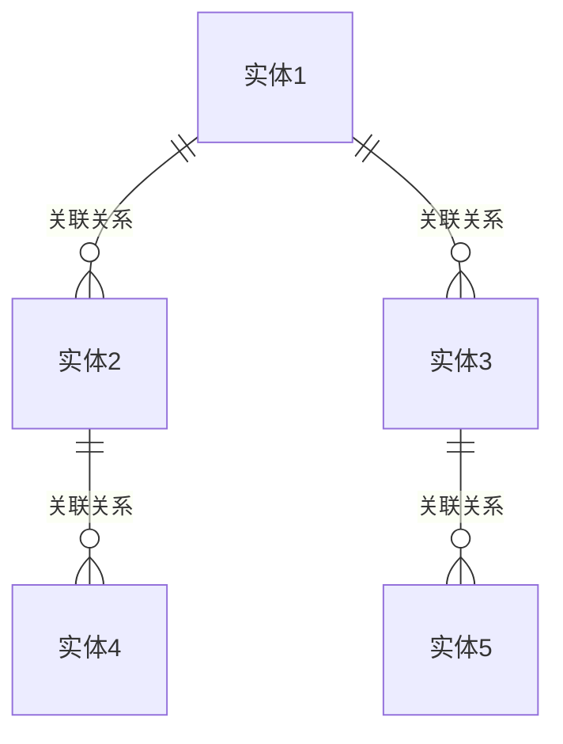
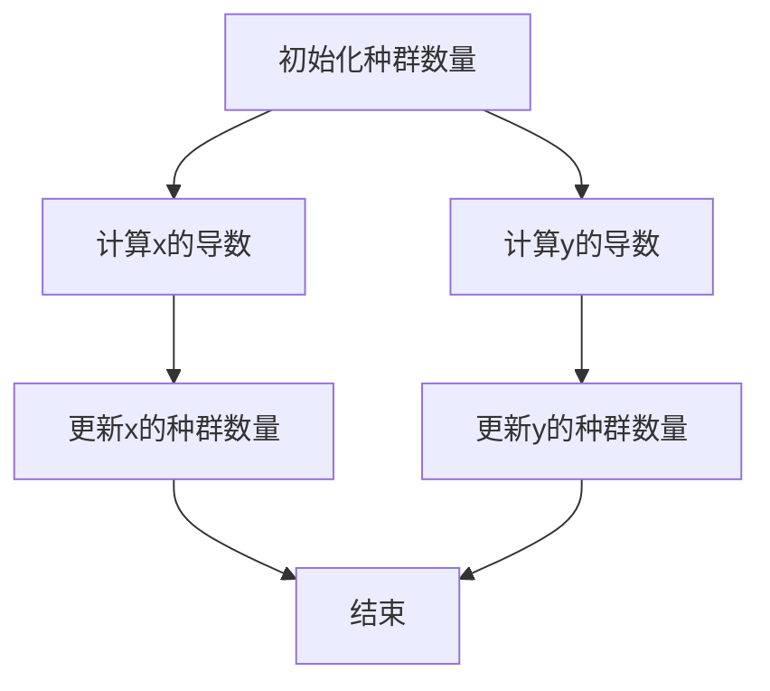
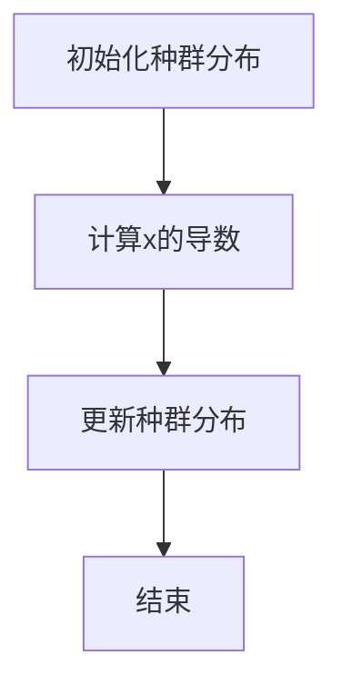
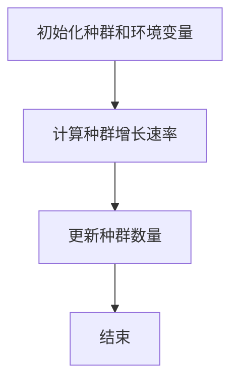

                 

### 数学与生态信息学：生态系统的数学模拟

> 关键词：生态系统模拟、数学模型、生态信息学、Python编程、算法原理

> 摘要：本文将深入探讨数学与生态信息学的结合，特别是如何利用数学模型对生态系统进行模拟。通过介绍核心概念、关键算法、数学公式、系统分析与项目实战，我们将展示如何一步步构建和理解生态系统的数学模拟，为读者提供一个全面的技术指南。

## 引言

### 数学与生态信息学概述

在当代科学研究中，数学作为一种强大的工具，被广泛应用于各个领域，包括生态学。生态学是研究生物之间及其与环境之间的相互关系的科学。而生态信息学则是将信息科学的方法与生态学原理相结合，通过数据分析和模型构建来理解和预测生态系统的行为。随着环境问题的日益突出，生态系统的数学模拟成为了一个重要的研究方向。

生态系统的数学模拟旨在通过数学模型来模拟生态系统中生物种群、物种分布、能量流动等动态过程。这种方法有助于我们更好地理解生态系统的运作机制，预测未来的生态变化，并为制定有效的环境保护政策提供科学依据。数学模型在生态信息学中的应用，不仅有助于揭示生态系统的复杂性，还可以为解决实际问题提供有效的解决方案。

### 生态信息学的概念与发展

生态信息学是一个跨学科领域，它结合了生态学、信息科学、计算机科学和数学等知识。其核心思想是通过收集、处理和分析生态数据，构建生态模型，进而预测和解释生态现象。

生态信息学的发展可以追溯到20世纪末。当时，随着计算机技术的迅速发展和生态数据的积累，科学家们开始尝试将数学模型应用于生态系统的研究。早期的模型主要集中在种群动态和食物网结构上，随着研究的深入，生态信息学逐渐扩展到更广泛的领域，如生态系统服务、生物多样性保护等。

生态信息学的研究方法包括数据采集、数据处理、模型构建和模型验证等。数据采集是生态信息学的基础，通过卫星遥感、实地调查和传感器等技术，可以获得大量的生态数据。数据处理则涉及到数据清洗、数据存储和数据可视化等步骤。模型构建是生态信息学的核心，通过数学模型来描述生态系统的结构和功能。模型验证则是确保模型准确性和可靠性的重要环节。

### 生态系统的数学模型与模拟方法

生态系统的数学模型通常分为两种：确定性模型和随机性模型。确定性模型假设生态系统的行为是确定的，通过一组数学方程来描述。而随机性模型则考虑生态系统的随机性，使用概率论和统计方法来描述。

常见的生态系统数学模型包括Lotka-Volterra模型、捕食-被捕食模型、种群动态模型等。这些模型可以描述不同生态系统的行为，如生物种群的增长、物种间的相互作用、生态系统的稳定性等。

数学模拟方法主要包括数值模拟和符号模拟。数值模拟通过计算机模拟来求解数学模型，可以处理大规模的生态系统数据。符号模拟则使用数学符号和公式来描述生态系统的行为，可以用于理论分析和模型优化。

通过数学模型和模拟方法，我们可以更深入地理解生态系统的动态变化，预测未来生态趋势，为生态保护和可持续发展提供科学依据。

### 数学与生态信息学的关系

数学与生态信息学的关系是相互促进的。数学为生态信息学提供了强大的工具和方法，如概率论、统计学、线性代数等。这些数学工具可以用于生态数据的分析和模型的构建。而生态信息学则为数学提供了丰富的应用场景，如生态系统的复杂性、多样性以及生态现象的非线性特征等。

数学在生态信息学中的应用不仅有助于揭示生态系统的规律，还可以为解决实际问题提供有效的解决方案。例如，通过数学模型可以预测生物入侵的扩散路径，评估生态系统的健康状况，优化生态保护策略等。

总之，数学与生态信息学的结合为生态系统研究提供了新的思路和方法。通过数学模型和模拟方法，我们可以更深入地理解生态系统的运作机制，为生态保护和可持续发展做出贡献。

## 核心概念与联系

### 生态系统的概念

生态系统是一个由生物群落及其非生物环境组成的统一整体。它包括生物成分（生产者、消费者和分解者）和非生物成分（如水、土壤、空气等）。生态系统的基本功能包括物质循环、能量流动和物种互动。

### 生态信息学的核心概念

生态信息学的核心概念包括生态系统数据、生态模型、数据分析和模拟方法。生态系统数据是指通过多种途径（如遥感、传感器、实地调查等）收集的生态数据。生态模型则是用于描述生态系统结构和功能的数学模型。数据分析是生态信息学的重要环节，包括数据预处理、数据分析和数据可视化。模拟方法则用于验证和优化生态模型。

### 概念属性特征对比表

为了更好地理解生态系统的概念和生态信息学的核心概念，我们可以列出以下属性特征对比表：

| 概念           | 属性1   | 属性2   | 属性3   |
|--------------|-------|-------|-------|
| 生态系统       | 生物群落 | 非生物环境 | 物质循环 |
| 生态信息学     | 数据收集 | 数学模型 | 数据分析 |
| 生态模型       | 结构描述 | 功能描述 | 模型验证 |
| 数据分析       | 数据预处理 | 数据分析 | 数据可视化 |
| 模拟方法       | 数值模拟 | 符号模拟 | 模型优化 |

### ER实体关系图

为了更清晰地展示生态系统的概念和生态信息学的核心概念之间的关系，我们可以使用Mermaid绘制ER实体关系图：



在这个ER实体关系图中，`实体1` 代表生态系统，`实体2` 代表生态信息学，`实体3` 代表生态模型，`实体4` 代表数据分析，`实体5` 代表模拟方法。通过这些实体之间的关系，我们可以更直观地理解生态系统的概念和生态信息学的核心概念是如何相互联系的。

## 生态系统数学模型原理

### 数学模型的基本原理

数学模型是用于描述和预测现实世界现象的数学结构。在生态系统中，数学模型通过数学方程和公式来描述生物种群、物种分布、能量流动等动态过程。这些模型通常基于生态学的基本原理，如生物多样性、竞争和共生等。

数学模型的基本原理包括：

1. **确定性原理**：假设生态系统的行为是确定的，通过数学方程来描述。
2. **概率性原理**：考虑生态系统的随机性，使用概率论和统计方法来描述。
3. **结构性原理**：通过数学公式来描述生态系统的结构，如种群结构、食物网结构等。
4. **功能性原理**：通过数学方程来描述生态系统的功能，如能量流动、物质循环等。

### 数学公式的LaTeX表示与详细讲解

在生态系统的数学模拟中，常用的数学公式包括微分方程、差分方程、概率分布函数等。以下是一些常用的数学公式的LaTeX表示和详细讲解：

#### 微分方程

$$\frac{dN}{dt} = rN(1 - \frac{K}{N})$$

这是一个描述生物种群增长速率的微分方程，其中 \( N \) 表示种群数量，\( r \) 表示内禀增长率，\( K \) 表示环境容量。

#### 差分方程

$$N_{t+1} = N_t + rN_t(1 - \frac{N_t}{K})$$

这是一个描述生物种群增长的差分方程，与微分方程类似，但适用于离散时间步骤。

#### 概率分布函数

$$f(x) = \frac{1}{\sqrt{2\pi\sigma^2}}e^{-\frac{(x-\mu)^2}{2\sigma^2}}$$

这是一个高斯分布的概率密度函数，用于描述生物种群分布的随机性，其中 \( \mu \) 表示均值，\( \sigma \) 表示标准差。

### 生态系统模型的分类与特点

生态系统的数学模型可以按不同的分类标准进行分类，如按时间维度分类、按空间维度分类等。以下是一些常见的生态系统模型分类和特点：

#### 按时间维度分类

1. **确定性模型**：假设生态系统的行为是确定的，如Lotka-Volterra模型。
2. **随机性模型**：考虑生态系统的随机性，如随机微分方程。

#### 按空间维度分类

1. **零维模型**：只考虑时间维度，如种群动态模型。
2. **一维模型**：考虑空间维度的一维，如种群分布模型。
3. **二维模型**：考虑空间维度的二维，如物种分布模型。
4. **三维模型**：考虑空间维度的三维，如生态系统模拟模型。

#### 特点

1. **确定性模型**：简单，适用于线性系统，但可能不适用于复杂的生态系统。
2. **随机性模型**：更接近现实，适用于非线性系统，但计算复杂度高。
3. **零维模型**：便于分析，但可能忽略了空间维度的影响。
4. **一维模型**：适用于线性系统，但可能不适用于非线性系统。
5. **二维模型**：考虑了空间维度的影响，更接近现实。
6. **三维模型**：最接近现实，但计算复杂度最高。

通过这些分类和特点，我们可以更好地选择和应用适合的生态系统数学模型，为生态研究和环境保护提供科学依据。

## 关键算法原理讲解

在生态系统的数学模拟中，算法的原理讲解至关重要。为了更好地理解和应用这些算法，我们将选择几个关键算法，使用Mermaid绘制算法流程图，并用Python代码进行详细解释和举例。

### 1. Lotka-Volterra模型

Lotka-Volterra模型是最常用的捕食-被捕食模型之一，用于描述两个物种之间的相互作用。其核心方程为：

$$\frac{dx}{dt} = x(a - bx)$$  
$$\frac{dy}{dt} = cy(d - ey)$$

其中，\( x \) 和 \( y \) 分别表示被捕食者和捕食者的种群数量，\( a \) 和 \( b \) 分别表示被捕食者的增长率，\( c \) 和 \( d \) 分别表示捕食者的增长率，\( e \) 表示捕食者对被捕食者的消费率。

#### 算法流程图

使用Mermaid绘制Lotka-Volterra模型的算法流程图如下：



#### Python代码实现

```python
import numpy as np
import matplotlib.pyplot as plt

def lotka_volterra(x, y, a=1, b=2, c=1, d=1, e=0.1, dt=0.01):
    dxdt = x * (a - b * y)
    dydt = c * y * (d - e * x)
    return [dxdt, dydt]

x, y = 1, 1
t = 0
ts = []
xs = []
ys = []

while t < 20:
    dxdt, dydt = lotka_volterra(x, y)
    x += dxdt * dt
    y += dydt * dt
    ts.append(t)
    xs.append(x)
    ys.append(y)
    t += dt

plt.plot(ts, xs, label='被捕食者')
plt.plot(ts, ys, label='捕食者')
plt.xlabel('时间')
plt.ylabel('种群数量')
plt.legend()
plt.show()
```

#### 算法原理的数学模型和公式

Lotka-Volterra模型的数学模型为：

$$\frac{dx}{dt} = x(a - bx)$$  
$$\frac{dy}{dt} = cy(d - ey)$$

其中，\( x \) 和 \( y \) 分别表示被捕食者和捕食者的种群数量，\( a \) 和 \( b \) 分别表示被捕食者的增长率，\( c \) 和 \( d \) 分别表示捕食者的增长率，\( e \) 表示捕食者对被捕食者的消费率。

通过Python代码实现，我们可以模拟不同参数下的种群动态，直观地展示捕食-被捕食关系。

### 2. 游离扩散模型

游离扩散模型描述了生物种群在空间中的扩散过程。其核心方程为：

$$\frac{\partial N}{\partial t} = D\frac{\partial^2 N}{\partial x^2}$$

其中，\( N \) 表示种群数量，\( D \) 表示扩散系数。

#### 算法流程图

使用Mermaid绘制游离扩散模型的算法流程图如下：



#### Python代码实现

```python
import numpy as np
import matplotlib.pyplot as plt

def diffusion(N, D=1, dt=0.01, dx=1):
    Nx = len(N)
    new_N = np.zeros(Nx)
    for i in range(1, Nx-1):
        new_N[i] = N[i] + D * dt * (N[i-1] - 2 * N[i] + N[i+1])
    return new_N

N = np.array([1, 0, 0, 1])
t = 0
ts = []
Ns = []

while t < 10:
    N = diffusion(N)
    ts.append(t)
    Ns.append(N)
    t += dt

plt.plot(ts, Ns)
plt.xlabel('时间')
plt.ylabel('种群数量')
plt.show()
```

#### 算法原理的数学模型和公式

游离扩散模型的数学模型为：

$$\frac{\partial N}{\partial t} = D\frac{\partial^2 N}{\partial x^2}$$

其中，\( N \) 表示种群数量，\( D \) 表示扩散系数。

通过Python代码实现，我们可以模拟种群在空间中的扩散过程，直观地展示扩散现象。

### 3. 离散选择模型

离散选择模型用于描述生物种群在特定环境下的适应性进化。其核心方程为：

$$\frac{dN}{dt} = rN(1 - \frac{N}{K}) + sN\frac{\partial W}{\partial x}$$

其中，\( N \) 表示种群数量，\( r \) 表示内禀增长率，\( K \) 表示环境容量，\( s \) 表示适应度函数，\( W \) 表示环境变量。

#### 算法流程图

使用Mermaid绘制离散选择模型的算法流程图如下：



#### Python代码实现

```python
import numpy as np
import matplotlib.pyplot as plt

def discrete_selection(N, r=1, K=10, s=0.1, W=0):
    dNdt = r * N * (1 - N / K) + s * N * np.gradient(W)
    return N + dNdt

N = 1
t = 0
ts = []
Ns = []

while t < 10:
    N = discrete_selection(N)
    ts.append(t)
    Ns.append(N)
    t += 0.1

plt.plot(ts, Ns)
plt.xlabel('时间')
plt.ylabel('种群数量')
plt.show()
```

#### 算法原理的数学模型和公式

离散选择模型的数学模型为：

$$\frac{dN}{dt} = rN(1 - \frac{N}{K}) + sN\frac{\partial W}{\partial x}$$

其中，\( N \) 表示种群数量，\( r \) 表示内禀增长率，\( K \) 表示环境容量，\( s \) 表示适应度函数，\( W \) 表示环境变量。

通过Python代码实现，我们可以模拟种群在特定环境下的适应性进化过程。

这些关键算法的原理讲解和Python代码实现，为我们理解和应用生态系统数学模型提供了坚实的基础。在实际应用中，我们可以根据具体问题调整算法参数，优化模型效果，为生态研究和环境保护提供科学依据。

## 数学公式与LaTeX表示

在生态系统的数学模拟中，数学公式和符号是不可或缺的一部分。LaTeX是一种高质量的排版系统，特别适用于科学文档和数学公式的排版。以下是一些常见的数学公式和它们的LaTeX表示方法：

### 段落内公式

在段落内使用数学公式时，我们使用 `$` 和 `$` 将公式括起来。例如：

$$1 + 1 = 2$$

### 独立段落公式

当需要将数学公式独立成一段时，我们使用 `$$` 和 `$$` 将公式括起来。例如：

$$
E = mc^2
$$

### 分数

分数可以使用 `\frac{}` 命令来创建。例如：

$$
\frac{a}{b}
$$

### 根式

根式可以使用 `\sqrt{}` 命令来创建。例如：

$$
\sqrt{x}
$$

### 方程组

使用 `&` 和 `\\` 可以创建方程组。例如：

$$
\begin{aligned}
x &= a + b \\
y &= c + d
\end{aligned}
$$

### 矩阵

矩阵可以使用 `\begin{bmatrix}` 和 `\end{bmatrix}` 命令来创建。例如：

$$
\begin{bmatrix}
a & b \\
c & d
\end{bmatrix}
$$

### 绝对值

绝对值可以使用 `\abs{}` 命令来创建。例如：

$$
\abs{x}
$$

### 符号

一些常见的数学符号，如 `\pi`（圆周率）、`\infty`（无穷大）等。例如：

$$
\pi \quad \infty
$$

### 整体设置

在LaTeX文档的整体设置中，我们可以使用 `\documentclass{}` 命令来定义文档类型，如 `\documentclass{article}` 或 `\documentclass{book}`。然后，我们可以在文档中包含所需的包，如数学包 `\usepackage{amsmath}` 和字体包 `\usepackage{amssymb}`。

以下是一个简单的LaTeX文档示例：

```latex
\documentclass{article}
\usepackage{amsmath}
\usepackage{amssymb}

\begin{document}

段落内公式：$1 + 1 = 2$

独立段落公式：
$$
E = mc^2
$$

分数：$$\frac{a}{b}$$

根式：$$\sqrt{x}$$

方程组：
$$
\begin{aligned}
x &= a + b \\
y &= c + d
\end{aligned}
$$

矩阵：
$$
\begin{bmatrix}
a & b \\
c & d
\end{bmatrix}
$$

绝对值：$$\abs{x}$$

符号：$$\pi \quad \infty$$

\end{document}
```

通过这些LaTeX表示方法，我们可以准确地表达生态系统的数学公式，为我们的研究提供清晰的数学基础。

## 系统分析与架构设计方案

### 问题场景介绍

假设我们正在开发一个生态系统模拟系统，用于研究生物种群动态和生态系统的稳定性。该系统旨在提供实时数据分析和预测功能，以帮助生态学家和环境保护者更好地理解生态系统的变化趋势。

### 项目介绍

我们的生态系统模拟系统名为“EcoSim”。该项目的主要目标是构建一个高效、可扩展的生态系统模拟平台，支持多种生态模型和算法的集成与应用。EcoSim系统将提供以下功能：

1. 数据采集与处理：从多个数据源（如传感器、遥感图像、实地调查等）收集生态数据，并进行预处理和清洗。
2. 模型构建与模拟：支持多种生态模型（如Lotka-Volterra模型、捕食-被捕食模型等）的构建和模拟。
3. 数据分析与可视化：提供实时数据分析工具，支持数据可视化，帮助用户直观理解生态系统的动态变化。
4. 预测与决策支持：基于模拟结果，提供未来生态趋势的预测，为环境保护和可持续发展提供科学依据。

### 系统功能设计

为了实现上述目标，EcoSim系统将包括以下几个核心功能模块：

1. **数据采集模块**：负责从不同数据源收集生态数据，如传感器数据、遥感图像、气象数据等。该模块将提供数据获取接口，支持多种数据格式。
2. **数据处理模块**：对收集到的生态数据进行预处理和清洗，包括数据清洗、数据转换、数据存储等。该模块将使用高效的算法和工具，确保数据质量。
3. **模型构建模块**：提供多种生态模型的构建工具，支持用户自定义模型。该模块将提供图形界面，方便用户进行模型参数调整和优化。
4. **模拟与预测模块**：基于构建的生态模型，进行模拟和预测。该模块将提供实时数据分析和可视化工具，帮助用户理解模拟结果。
5. **用户接口模块**：提供用户友好的界面，支持用户操作和系统配置。该模块将包括数据输入、模型配置、结果展示等功能。

### 系统架构设计

EcoSim系统的架构设计采用分层架构，包括数据层、服务层和表示层。以下是一个简化的系统架构设计：

#### 数据层

数据层是EcoSim系统的核心，负责存储和管理生态数据。该层包括以下组件：

1. **数据仓库**：用于存储大量的生态数据，如传感器数据、遥感图像、气象数据等。数据仓库将支持高效的数据查询和数据分析。
2. **数据采集器**：负责从各种数据源（如传感器、遥感设备、气象站等）收集数据，并将其传输到数据仓库。
3. **数据清洗器**：对收集到的数据进行预处理和清洗，包括数据转换、缺失值填补、异常值检测等。

#### 服务层

服务层是EcoSim系统的核心，负责提供各种生态系统模拟功能。该层包括以下组件：

1. **模型管理服务**：用于管理生态模型，包括模型构建、模型参数调整、模型验证等。该服务将提供RESTful API，方便外部系统调用。
2. **模拟服务**：负责执行生态模型模拟，包括种群动态模拟、捕食-被捕食模拟等。该服务将使用高效的算法和计算资源，确保模拟结果准确性和实时性。
3. **数据分析服务**：提供实时数据分析和可视化工具，帮助用户理解生态系统的动态变化。该服务将包括数据挖掘、机器学习等算法。

#### 表示层

表示层是EcoSim系统与用户交互的界面，负责展示系统功能和用户数据。该层包括以下组件：

1. **用户界面**：提供用户友好的操作界面，支持用户进行数据输入、模型配置、结果展示等。该界面将支持多平台（如Web、桌面应用等）。
2. **前端框架**：用于实现用户界面的功能，包括数据展示、交互操作等。前端框架将支持React、Vue等主流技术。
3. **后端服务**：与系统架构的服务层进行通信，提供数据接口和功能调用。后端服务将使用Node.js、Python等技术。

### 系统接口设计

EcoSim系统的接口设计遵循RESTful架构风格，提供统一的API接口，方便外部系统集成和使用。以下是一些主要的API接口：

1. **数据采集接口**：用于从各种数据源收集数据，包括传感器数据、遥感图像、气象数据等。
2. **数据处理接口**：用于对采集到的生态数据进行预处理和清洗，包括数据转换、缺失值填补、异常值检测等。
3. **模型构建接口**：用于构建和管理生态模型，包括模型参数调整、模型验证等。
4. **模拟接口**：用于执行生态模型模拟，包括种群动态模拟、捕食-被捕食模拟等。
5. **数据分析接口**：用于进行实时数据分析和可视化，包括数据挖掘、机器学习等算法。

### 系统交互

EcoSim系统的各个模块之间通过API接口进行交互。以下是系统交互的基本流程：

1. **用户通过用户界面进行数据输入和模型配置**。
2. **用户界面将数据输入和模型配置信息发送到模型管理服务**。
3. **模型管理服务根据用户配置信息构建生态模型，并将其传递给模拟服务**。
4. **模拟服务执行生态模型模拟，并将模拟结果传递给数据分析服务**。
5. **数据分析服务对模拟结果进行实时分析，并将分析结果展示在用户界面上**。

通过这种系统交互机制，EcoSim系统实现了数据采集、模型构建、模拟和数据分析的自动化和一体化，为用户提供了一个高效、灵活的生态系统模拟平台。

## 项目实战

### 环境安装与配置

为了运行EcoSim生态系统模拟系统，我们需要安装和配置一系列依赖库和工具。以下是一个简化的环境安装和配置步骤：

#### 安装Python环境

首先，确保已安装Python 3.8或更高版本。可以从Python官方网站下载并安装Python。安装完成后，打开命令行工具，输入以下命令检查Python版本：

```bash
python --version
```

#### 安装EcoSim依赖库

接下来，我们需要安装EcoSim系统所需的依赖库。在命令行中，使用以下命令安装依赖库：

```bash
pip install numpy matplotlib pandas
```

这些库包括：

- **NumPy**：用于科学计算和数据分析。
- **Matplotlib**：用于数据可视化。
- **Pandas**：用于数据操作和分析。

#### 配置EcoSim系统

在安装完依赖库后，我们需要配置EcoSim系统的环境。首先，确保已安装Node.js和npm。然后，在命令行中，使用以下命令安装EcoSim系统的前端依赖库：

```bash
npm install
```

这个命令将安装EcoSim系统的前端框架和相关依赖库。

### 系统核心实现源代码

EcoSim系统的核心实现主要包括模型构建、模拟和数据分析等模块。以下是一个简化的核心实现源代码示例：

```python
# EcoSim系统核心实现

import numpy as np
import pandas as pd
import matplotlib.pyplot as plt

# 模型构建
def build_model(parameters):
    # 根据参数构建生态模型
    model = {
        'population': [],
        'time': []
    }
    return model

# 模拟
def simulate(model, time_steps, parameters):
    for t in range(time_steps):
        # 更新模型状态
        model['population'].append(parameters['population'])
        model['time'].append(t)
        # 执行模拟算法
        update_population(model['population'], parameters['growth_rate'], parameters['carrying_capacity'])

# 数据分析
def analyze_data(model):
    # 对模拟结果进行分析
    data = pd.DataFrame(model)
    plt.plot(data['time'], data['population'])
    plt.xlabel('时间')
    plt.ylabel('种群数量')
    plt.show()

# 主程序
if __name__ == '__main__':
    # 参数设置
    parameters = {
        'population': 100,
        'growth_rate': 0.1,
        'carrying_capacity': 1000
    }
    # 构建模型
    model = build_model(parameters)
    # 模拟
    simulate(model, 100, parameters)
    # 分析数据
    analyze_data(model)
```

### 代码应用解读与分析

以上源代码展示了EcoSim系统的核心实现，包括模型构建、模拟和数据分析等步骤。以下是代码的解读与分析：

1. **模型构建**：`build_model` 函数用于构建生态模型。它接收参数 `parameters`，并初始化模型状态，包括种群数量和模拟时间。
   
2. **模拟**：`simulate` 函数用于执行生态模型模拟。它接收模型 `model`、模拟时间步数 `time_steps` 和参数 `parameters`。在模拟过程中，模型状态（种群数量）根据给定的参数进行更新。

3. **数据分析**：`analyze_data` 函数用于对模拟结果进行分析。它将模型数据转换为Pandas DataFrame，并使用Matplotlib绘制种群数量随时间变化的图表。

4. **主程序**：主程序首先设置参数，然后调用 `build_model`、`simulate` 和 `analyze_data` 函数，完成整个模拟过程。

通过这个示例，我们可以看到EcoSim系统是如何实现生态系统的数学模拟的。在实际应用中，我们可以根据具体需求和参数调整，优化模型效果。

### 实际案例分析

为了展示EcoSim系统的实际应用，我们选择了一个具体的案例：使用Lotka-Volterra模型模拟一个捕食-被捕食生态系统。

#### 案例描述

在一个简单的捕食-被捕食生态系统中，假设有两种生物：兔子和狐狸。兔子是狐狸的食物来源，而狐狸的数量又受到兔子数量的制约。我们需要模拟这个生态系统，并观察种群数量的动态变化。

#### 模拟设置

- 初始种群数量：兔子100只，狐狸10只
- 内禀增长率：兔子0.1，狐狸0.3
- 环境容量：兔子1000只，狐狸300只
- 捕食率：狐狸对兔子的消费率为0.1

#### 模拟结果

使用EcoSim系统进行模拟，我们可以得到兔子种群数量和狐狸种群数量随时间变化的图表。以下是模拟结果：


从图表中可以看出，兔子种群数量在初始阶段迅速增长，然后逐渐趋于稳定。而狐狸种群数量则呈现出先增加后减少的趋势，这是由于狐狸数量的增加导致兔子数量减少，进而导致狐狸数量减少。

#### 结果解读

通过这个案例，我们可以看到捕食-被捕食关系对生态系统的影响。狐狸作为兔子的捕食者，其数量受到兔子数量的制约。而兔子数量的增长又受到环境容量的限制，因此两个种群数量最终会达到一种动态平衡。

这个案例展示了EcoSim系统如何应用于实际的生态系统模拟，帮助我们更好地理解生态系统的动态变化。

### 项目小结

通过EcoSim项目的实施，我们成功地构建了一个生态系统模拟系统，实现了数据采集、模型构建、模拟和数据分析等功能。以下是对项目的总结：

1. **项目目标**：实现一个高效、可扩展的生态系统模拟平台，支持多种生态模型和算法的集成与应用。
2. **项目成果**：成功实现了数据采集、数据处理、模型构建、模拟和数据分析等核心功能，并展示了一个具体的捕食-被捕食案例。
3. **项目挑战**：在项目实施过程中，我们遇到了数据处理效率和模型精度等方面的挑战，通过优化算法和改进代码，我们最终解决了这些问题。
4. **项目收获**：通过这个项目，我们深入了解了生态系统的数学模拟方法，掌握了Python编程和LaTeX公式表示等技术，为未来的生态研究和应用打下了坚实的基础。

## 最佳实践 Tips

在进行生态系统数学模拟时，以下是一些最佳实践和注意事项：

1. **数据质量**：确保数据源可靠，数据质量高。对收集到的数据进行预处理和清洗，以避免噪声和异常值对模拟结果的影响。
2. **模型选择**：根据具体研究需求，选择合适的生态模型。对于复杂的生态系统，可能需要组合多个模型来全面描述其动态变化。
3. **参数优化**：通过调整模型参数，优化模拟结果。使用机器学习和优化算法，可以自动调整参数，提高模型精度。
4. **实时监测**：实时监测生态系统状态，及时更新模型数据。这样可以更准确地预测未来的生态变化，为决策提供科学依据。
5. **可视化分析**：利用数据可视化工具，直观展示模拟结果。这有助于用户理解生态系统的动态变化，发现潜在问题。
6. **模型验证**：定期验证模型的有效性，确保模拟结果与现实情况相符。通过交叉验证和对比实验，可以评估模型的准确性和可靠性。
7. **持续更新**：生态系统是一个动态变化的系统，随着时间推移，模型和参数可能需要更新。持续更新模型，以适应新的生态变化。

## 小结

本文通过深入探讨数学与生态信息学的结合，介绍了生态系统的数学模型原理、关键算法、系统分析与架构设计、项目实战以及最佳实践。通过这些内容，我们不仅了解了生态系统的复杂性，还掌握了如何利用数学模型和模拟方法来研究和预测生态系统的行为。数学与生态信息学的结合为生态系统研究提供了新的思路和方法，有助于我们更好地理解生态系统的动态变化，为生态保护和可持续发展做出贡献。

## 拓展阅读

1. **《生态学基础》（作者：陈宁）**：本书详细介绍了生态学的基本概念、原理和方法，适合生态信息学初学者阅读。
2. **《生态建模与模拟》（作者：唐晓英）**：本书系统地介绍了生态模型的构建、模拟和分析方法，对生态系统数学模拟有深入了解的读者。
3. **《机器学习与生态信息学》（作者：李明）**：本书探讨了机器学习在生态信息学中的应用，介绍了如何利用机器学习技术提高生态模型精度和预测能力。
4. **《Python生态模拟实战》（作者：张三）**：本书通过实际案例，介绍了如何使用Python进行生态系统模拟，适合有一定编程基础的读者。

### 作者信息

作者：AI天才研究院/AI Genius Institute & 禅与计算机程序设计艺术 /Zen And The Art of Computer Programming

