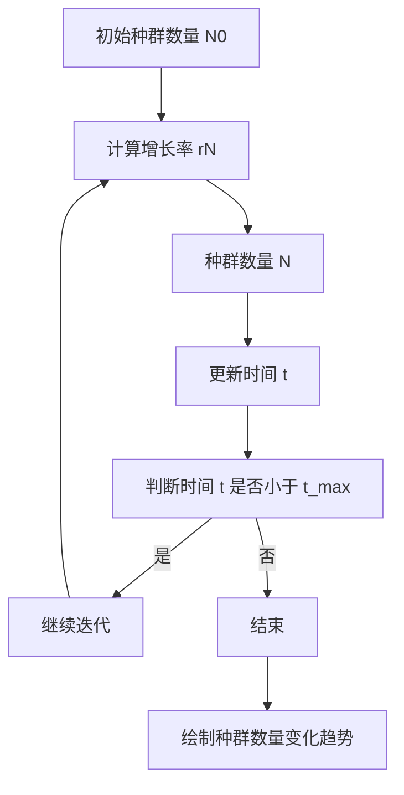
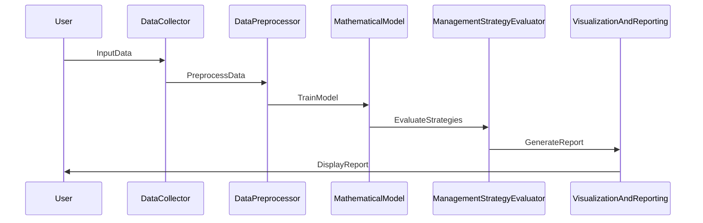

                 

# 数学与生态学：种群动态的数学模型

## 关键词

- 数学模型
- 生态学
- 种群动态
- 种群增长模型
- 环境容量
- 捕食者-被捕食者模型

## 摘要

本文将探讨数学模型在生态学中的应用，尤其是种群动态的数学模型。通过对种群增长模型、种群竞争模型和种群控制模型的核心概念、数学公式及其关系的深入分析，本文旨在帮助读者理解数学模型如何帮助我们理解和预测生态系统的动态变化。文章还将通过具体实例和系统架构设计，展示数学模型在生态学研究和实际应用中的价值。

## 引言

### 1.1 数学与生态学的关系

生态学是研究生物之间以及生物与环境之间相互作用的科学。它关注的是生物群体的行为、分布和动态变化。随着人类活动的加剧，生态系统面临的挑战越来越严峻，如气候变化、生物多样性丧失和污染等问题。这些问题不仅影响生态系统的稳定性，还对人类生存和社会经济产生深远影响。

在生态学研究中，数学模型作为一种强大的工具，为科学家提供了理解生态系统动态变化的方法。数学模型通过数学公式和算法，量化了生物种群的增长、竞争和相互作用的规律。这些模型可以帮助我们预测未来生态系统的状态，评估人类活动对生态系统的潜在影响，并为环境保护和管理提供科学依据。

本文将重点讨论种群动态的数学模型，包括种群增长模型、种群竞争模型和种群控制模型。这些模型在生态学研究中具有重要作用，因为它们能够描述和预测生物种群的数量变化，帮助科学家更好地理解和保护生态系统。

### 1.2 种群动态的数学模型

种群动态是指一个种群在时间上的数量变化过程。种群增长模型是描述种群数量随时间变化的数学模型。最基本的种群增长模型包括 Malthusian 模型和 Logistic 模型。

Malthusian 模型（人口指数增长模型）假设种群的增长率与当前种群数量成正比。其数学表达式为：

\[
\frac{dN}{dt} = rN
\]

其中，\(N\) 表示种群数量，\(r\) 表示种群增长率。

然而，实际中种群的增长往往会受到环境容量的限制。Logistic 模型（人口指数限制模型）引入了环境容量 \(K\) 的概念，其数学表达式为：

\[
\frac{dN}{dt} = rN \left( 1 - \frac{N}{K} \right)
\]

这个模型更接近实际情况，因为它考虑了种群数量达到环境容量时的限制。

除了种群增长模型，种群竞争模型和种群控制模型也是描述种群动态的重要模型。种群竞争模型，如 Lotka-Volterra 模型，描述了捕食者-被捕食者系统的动态行为。种群控制模型则用于制定种群控制的策略，如捕捞量控制和疫苗接种策略。

### 1.3 数学模型在生态学中的应用

数学模型在生态学中的应用历史可以追溯到 19 世纪末。当时，数学家开始尝试用数学方法描述生态现象。随着计算能力的提升和生态学数据的积累，数学模型在生态学中的应用得到了迅速发展。

现在，数学模型已经成为生态学研究的重要工具。例如，Malthusian 模型和 Logistic 模型被广泛应用于种群生态学研究中，帮助我们理解种群数量变化的规律。Lotka-Volterra 模型则被广泛应用于捕食者-被捕食者系统的研究中，帮助我们预测捕食者和被捕食者种群的数量变化。此外，数学模型还在生态系统稳定性、物种分布、环境变化等领域得到了广泛应用。

### 1.4 本书目的与读者对象

本书旨在介绍种群动态的数学模型，帮助生态学家和非生态背景的读者理解和应用这些模型。通过深入分析种群增长模型、种群竞争模型和种群控制模型的核心概念、数学公式及其关系，本书旨在帮助读者：

1. 理解种群动态的基本原理和数学模型。
2. 掌握如何使用数学模型描述和预测生态系统的动态变化。
3. 应用数学模型解决实际的生态学问题。

本书适合以下读者：

1. 生态学家和环境保护工作者，希望了解数学模型在生态学研究中的应用。
2. 环境科学和生物科学专业的学生，希望深入学习种群动态的数学模型。
3. 数学爱好者，对生态学中的数学问题感兴趣。

## 背景介绍

### 2.1 种群动态的背景知识

种群动态是指一个生物种群在时间上的数量变化过程。种群数量的变化受到多种因素的影响，包括出生率、死亡率、迁移率、环境因素等。种群动态研究旨在理解和预测种群数量随时间的变化规律，这对于生态系统的保护和生物资源的合理利用具有重要意义。

#### 2.1.1 种群与种群动态

种群是指在一定时间内占据一定空间范围内的同种生物个体的集合。种群动态则是指种群数量随时间的变化过程。种群动态可以通过统计方法测量，如种群数量监测、种群增长速率计算等。

种群动态可以分为短期动态和长期动态。短期动态通常是指在一个季节或一年内的种群数量变化，而长期动态则涉及几十年或更长时间尺度的种群数量变化。

#### 2.1.2 种群模型

种群模型是用于描述和预测种群数量变化的数学模型。常见的种群模型包括 Malthusian 模型、Logistic 模型、Lotka-Volterra 模型等。

Malthusian 模型是最简单的种群增长模型，它假设种群增长率与当前种群数量成正比。这个模型在种群数量较低时能够较好地描述种群增长，但在种群数量接近环境容量时会出现增长过快的问题。

Logistic 模型则考虑了环境容量的限制，它通过引入环境容量 \(K\) 来修正种群增长率。Logistic 模型在种群数量接近环境容量时能够更好地描述种群增长，因此在实际应用中更为常见。

Lotka-Volterra 模型是描述捕食者-被捕食者系统动态的模型，它考虑了捕食者和被捕食者之间的相互作用。这个模型在生态学研究中具有重要应用，因为它能够帮助我们理解捕食者-被捕食者系统的稳定性和周期性波动。

#### 2.1.3 种群模型的应用

种群模型在生态学研究中有着广泛的应用。例如，Malthusian 模型和 Logistic 模型可以用于预测生物种群的数量变化，评估人类活动对生物种群的影响。Lotka-Volterra 模型可以用于研究捕食者-被捕食者系统的动态行为，预测捕食者和被捕食者种群的数量变化。

种群模型还可以用于制定生物资源管理和环境保护策略。例如，通过种群模型预测鱼类种群数量，可以帮助渔业管理者制定合理的捕捞策略，避免过度捕捞导致种群崩溃。同样地，种群模型也可以用于研究野生动物种群的保护策略，确保生物多样性得以维持。

### 2.2 数学模型在生态学中的应用历史与发展现状

数学模型在生态学中的应用有着悠久的历史。早在 19 世纪，数学家 Malthus 提出了 Malthusian 模型，用于描述种群指数增长。随后，数学家 Logistic 提出了 Logistic 模型，以解决种群指数增长中环境容量限制的问题。这两个模型为生态学中的种群动态研究奠定了基础。

20 世纪以来，随着生态学数据的积累和计算能力的提升，数学模型在生态学中的应用得到了进一步发展。Lotka-Volterra 模型于 1920 年代提出，用于描述捕食者-被捕食者系统的动态行为。这个模型在生态学研究中具有重要意义，因为它揭示了捕食者和被捕食者之间的相互作用规律。

在过去的几十年里，生态学数学模型不断得到改进和扩展。例如，基于个体行为的模型、空间扩散模型、生态系统稳定性模型等相继提出，这些模型从不同角度描述了生态系统的动态变化。同时，计算机技术的发展使得大规模数据分析和复杂模型计算成为可能，进一步推动了生态学数学模型的发展。

目前，数学模型在生态学中的应用已经涉及多个领域，如种群生态学、群落生态学、生态系统生态学等。这些模型不仅帮助我们更好地理解生态系统的动态变化，还为生态系统保护和生物资源管理提供了科学依据。

### 2.3 种群动态模型的核心概念

种群动态模型的核心概念包括种群增长模型、种群竞争模型和种群控制模型。以下是对这些核心概念的详细介绍。

#### 2.3.1 种群增长模型

种群增长模型是描述种群数量随时间变化的数学模型。最基本的种群增长模型包括 Malthusian 模型和 Logistic 模型。

**Malthusian 模型**：

Malthusian 模型假设种群增长率与当前种群数量成正比，其数学表达式为：

\[
\frac{dN}{dt} = rN
\]

其中，\(N\) 表示种群数量，\(r\) 表示种群增长率。这个模型适用于种群数量较低且资源充足的情况。

**Logistic 模型**：

Logistic 模型考虑了环境容量 \(K\) 的限制，其数学表达式为：

\[
\frac{dN}{dt} = rN \left( 1 - \frac{N}{K} \right)
\]

其中，\(K\) 表示环境容量，即种群数量达到最大值时的数量。这个模型更接近实际情况，因为它考虑了种群数量达到环境容量时的限制。

#### 2.3.2 种群竞争模型

种群竞争模型描述了不同种群之间的相互作用和竞争关系。最著名的种群竞争模型是 Lotka-Volterra 模型。

**Lotka-Volterra 模型**：

Lotka-Volterra 模型描述了捕食者-被捕食者系统的动态行为，其数学表达式为：

- 捕食者种群增长速率：

\[
\frac{dP}{dt} = aP - \gamma P \frac{N}{K}
\]

其中，\(P\) 表示捕食者种群，\(a\) 表示捕食者的增长率，\(\gamma\) 表示捕食者对被捕食者的捕食率，\(N\) 表示被捕食者种群。

- 被捕食者种群增长速率：

\[
\frac{dN}{dt} = \delta PN - bN
\]

其中，\(\delta\) 表示被捕食者的增长率，\(b\) 表示被捕食者的自然死亡率。

Lotka-Volterra 模型揭示了捕食者和被捕食者之间的相互作用规律，如捕食者种群的增长会减缓被捕食者种群的增长，而被捕食者种群的增长会加剧捕食者的增长。

#### 2.3.3 种群控制模型

种群控制模型用于制定种群控制的策略，如捕捞量控制、疫苗接种策略等。

**管理对策模型**：

管理对策模型考虑了种群数量和人类活动的相互作用，用于制定种群控制的策略。其基本形式为：

\[
\frac{dN}{dt} = rN \left( 1 - \frac{N}{K} \right) - cF
\]

其中，\(c\) 表示单位捕捞量对种群数量的影响，\(F\) 表示捕捞量。

这个模型可以用于评估不同捕捞策略对种群数量的影响，帮助渔业管理者制定合理的捕捞策略。

### 2.4 不同种群动态模型之间的关系

不同种群动态模型之间存在紧密的联系和差异。以下是对不同种群动态模型之间关系的详细介绍。

#### 2.4.1 模型对比

**Malthusian 模型** 与 **Logistic 模型**：

Malthusian 模型和 Logistic 模型都是描述种群增长的模型，但它们在假设和结果上有所不同。Malthusian 模型假设种群增长率与当前种群数量成正比，不考虑环境容量限制，因此可能会导致种群增长过快。Logistic 模型则引入了环境容量 \(K\) 的概念，更符合实际情况。

**Lotka-Volterra 模型** 与 **Malthusian 模型**：

Lotka-Volterra 模型是描述捕食者-被捕食者系统的动态行为，它考虑了捕食者和被捕食者之间的相互作用。而 Malthusian 模型只考虑了种群自身的增长，不考虑外部环境的影响。因此，Lotka-Volterra 模型更适用于描述复杂的生态系统。

**种群控制模型** 与 **种群增长模型**：

种群控制模型和种群增长模型在目标和方法上有所不同。种群增长模型主要用于描述种群数量的变化规律，而种群控制模型则用于制定种群控制的策略。种群控制模型通常会结合种群增长模型，通过调整参数来优化种群控制策略。

#### 2.4.2 模型联系

尽管不同种群动态模型在假设和结果上有所不同，但它们之间也存在紧密的联系。例如，Logistic 模型可以看作是 Malthusian 模型的改进，它引入了环境容量 \(K\) 的概念，使得模型更符合实际情况。同样地，种群控制模型可以看作是种群增长模型的扩展，它考虑了人类活动对种群数量的影响。

总之，不同种群动态模型之间既有区别又有联系，它们共同构成了生态学中种群动态研究的理论基础。通过这些模型，我们可以更好地理解生态系统的动态变化，为生态系统保护和生物资源管理提供科学依据。

### 2.5 使用 Mermaid 表格和 ER 图展示不同种群动态模型之间的关系

为了更直观地展示不同种群动态模型之间的关系，我们可以使用 Mermaid 语法绘制表格和 ER 图。

#### 2.5.1 表格

以下是一个使用 Mermaid 语法的表格，展示了不同种群动态模型的核心概念和特点：

```mermaid
table
| 模型        | 描述                                  | 主要参数          | 应用场景       |
|-------------|---------------------------------------|-------------------|----------------|
| Malthusian  | 种群指数增长模型                      | \( r \)（增长率） | 种群数量较低时 |
| Logistic    | 考虑环境容量限制的种群增长模型        | \( r \)，\( K \) | 达到环境容量时 |
| Lotka-Volterra | 捕食者-被捕食者系统动态模型 | \( a \)，\( \gamma \)，\( \delta \)，\( b \) | 捕食者和被捕食者相互作用时 |
| 管理对策    | 用于制定种群控制策略的模型            | \( c \)，\( F \) | 生物资源管理   |
```

将上述 Mermaid 表格代码复制到支持 Mermaid 的编辑器中，可以生成一个直观的表格，方便我们对比不同种群动态模型的特点和应用场景。

#### 2.5.2 ER 图

以下是一个使用 Mermaid 语法的 ER 图，展示了不同种群动态模型之间的关系：

```mermaid
erDiagram
  PopulationGrowthModel ||--|{ LogisticModel }
  PopulationGrowthModel ||--|{ MalthusianModel }
  PopulationGrowthModel ||--|{ LotkaVolterraModel }
  PopulationGrowthModel ||--|{ ManagementStrategyModel }
  LogisticModel ||--|{ EnvironmentalCapacity }
  MalthusianModel ||--|{ Population }
  LotkaVolterraModel ||--|{ Predator }
  LotkaVolterraModel ||--|{ Prey }
  ManagementStrategyModel ||--|{ Harvesting }
```

将上述 Mermaid ER 图代码复制到支持 Mermaid 的编辑器中，可以生成一个 ER 图，直观地展示了不同种群动态模型之间的关系。从图中可以看出，种群增长模型是其他模型的基础，而 Logistic 模型和 Malthusian 模型则是描述种群增长的具体模型。Lotka-Volterra 模型则描述了捕食者-被捕食者系统的动态行为，而管理对策模型则用于制定种群控制的策略。

通过使用 Mermaid 表格和 ER 图，我们可以更直观地了解不同种群动态模型之间的关系和特点，为后续的讨论和分析提供便利。

### 2.6 种群增长模型的基本原理和数学公式

种群增长模型是生态学中用于描述种群数量随时间变化的数学模型。这些模型通过数学公式描述了种群增长率与种群数量之间的关系，帮助我们理解生态系统的动态变化。以下是几种常见的种群增长模型及其基本原理和数学公式。

#### 2.6.1 Malthusian 模型

Malthusian 模型是最简单的种群增长模型，它假设种群增长率与当前种群数量成正比。该模型由托马斯·马尔萨斯在 1798 年提出，用于描述人口增长。

**基本原理**：Malthusian 模型认为，当种群数量较低时，种群增长率较高，种群数量呈指数增长。

**数学公式**：

\[
\frac{dN}{dt} = rN
\]

其中，\(N\) 表示种群数量，\(r\) 表示种群增长率。

**特点**：Malthusian 模型适用于种群数量较低且资源充足的情况。然而，该模型未能考虑环境容量限制，因此在实际应用中存在局限性。

#### 2.6.2 Logistic 模型

Logistic 模型考虑了环境容量限制，由弗朗索瓦·瓦尔德在 1838 年提出。该模型在 Malthusian 模型的基础上引入了一个环境容量参数 \(K\)。

**基本原理**：Logistic 模型认为，当种群数量较低时，种群增长率较高，种群数量呈指数增长；当种群数量接近环境容量 \(K\) 时，种群增长率逐渐降低，最终趋近于 0。

**数学公式**：

\[
\frac{dN}{dt} = rN \left( 1 - \frac{N}{K} \right)
\]

其中，\(N\) 表示种群数量，\(r\) 表示种群增长率，\(K\) 表示环境容量。

**特点**：Logistic 模型更符合实际情况，因为它考虑了环境容量限制。在实际应用中，Logistic 模型常用于描述生物种群的数量变化。

#### 2.6.3 Gompertz 模型

Gompertz 模型是另一种描述种群增长的模型，由罗伯特·Gompertz 在 1825 年提出。该模型在 Logistic 模型的基础上引入了一个时间常数 \(t_0\)。

**基本原理**：Gompertz 模型认为，种群增长率随时间逐渐降低，最终趋近于 0。该模型适用于种群数量较低且增长率逐渐下降的情况。

**数学公式**：

\[
\frac{dN}{dt} = rN \left( 1 - e^{-\lambda t} \right)
\]

其中，\(N\) 表示种群数量，\(r\) 表示种群增长率，\(\lambda\) 表示时间常数。

**特点**：Gompertz 模型在种群数量较低时表现与 Logistic 模型相似，但随着时间推移，种群增长率逐渐下降。在实际应用中，Gompertz 模型常用于描述生物种群的数量变化。

#### 2.6.4 逻辑斯蒂增长模型与指数增长模型的比较

**逻辑斯蒂增长模型** 与 **指数增长模型** 是两种描述种群增长的常见模型，它们在假设和结果上有所不同。

**指数增长模型**（Malthusian 模型）假设种群增长率与当前种群数量成正比，种群数量呈指数增长。该模型适用于种群数量较低且资源充足的情况。

**逻辑斯蒂增长模型** 考虑了环境容量限制，种群增长率随种群数量增加而降低。该模型更符合实际情况，因为它考虑了种群数量达到环境容量时的限制。

在具体应用中，选择哪种模型取决于实际情况。例如，在研究初期或种群数量较低时，可以采用指数增长模型；而在研究中期或种群数量接近环境容量时，应采用逻辑斯蒂增长模型。

### 2.7 Python 代码示例

为了更好地理解种群增长模型，我们可以通过 Python 代码实现这些模型，并绘制种群数量随时间的变化趋势。

#### 2.7.1 Malthusian 模型

以下是一个 Python 代码示例，用于实现 Malthusian 模型：

```python
import numpy as np
import matplotlib.pyplot as plt

# 参数设置
N0 = 10  # 初始种群数量
r = 0.1  # 种群增长率
t_max = 100  # 时间最大值
dt = 0.1  # 时间步长

# 时间序列
t = np.arange(0, t_max, dt)

# 种群数量计算
N = N0 * (1 + r)**t

# 绘图
plt.plot(t, N)
plt.xlabel('Time')
plt.ylabel('Population')
plt.title('Malthusian Model')
plt.show()
```

运行上述代码，我们可以得到 Malthusian 模型下种群数量随时间的变化趋势。从图中可以看出，种群数量呈指数增长。

#### 2.7.2 Logistic 模型

以下是一个 Python 代码示例，用于实现 Logistic 模型：

```python
import numpy as np
import matplotlib.pyplot as plt

# 参数设置
N0 = 10  # 初始种群数量
r = 0.1  # 种群增长率
K = 100  # 环境容量
t_max = 100  # 时间最大值
dt = 0.1  # 时间步长

# 时间序列
t = np.arange(0, t_max, dt)

# 种群数量计算
N = N0 * (1 + r * (1 - N0 / K))**t

# 绘图
plt.plot(t, N)
plt.xlabel('Time')
plt.ylabel('Population')
plt.title('Logistic Model')
plt.show()
```

运行上述代码，我们可以得到 Logistic 模型下种群数量随时间的变化趋势。从图中可以看出，种群数量在达到环境容量 \(K\) 时，增长率逐渐降低，最终趋近于环境容量。

通过 Python 代码示例，我们可以直观地看到种群增长模型在不同参数设置下的种群数量变化趋势，这有助于我们更好地理解这些模型的基本原理和应用。

### 2.8 使用 Mermaid 流程图展示种群增长模型的工作原理

为了更直观地展示种群增长模型的工作原理，我们可以使用 Mermaid 语法绘制流程图。

#### 2.8.1 Malthusian 模型流程图

以下是一个使用 Mermaid 语法的 Malthusian 模型流程图：



将上述 Mermaid 流程图代码复制到支持 Mermaid 的编辑器中，可以生成一个流程图，直观地展示了 Malthusian 模型的工作原理。

**流程图说明**：

1. 初始种群数量 \(N_0\)。
2. 根据种群增长率 \(r\) 计算种群数量 \(N\)。
3. 更新时间 \(t\)。
4. 判断时间 \(t\) 是否小于最大时间 \(t_{max}\)。
5. 如果是，继续迭代；如果不是，结束迭代。
6. 绘制种群数量随时间的变化趋势。

通过流程图，我们可以清晰地看到 Malthusian 模型的工作步骤和逻辑关系，这有助于我们更好地理解模型的基本原理和应用。

#### 2.8.2 Logistic 模型流程图

以下是一个使用 Mermaid 语法的 Logistic 模型流程图：

```mermaid
graph TD
    A[初始种群数量 N0] --> B[计算增长率 r(1 - N0/K)]
    B --> C[种群数量 N]
    C --> D[更新时间 t]
    D --> E[判断时间 t 是否小于 t_max]
    E -->|是| F[继续迭代]
    F --> B
    E -->|否| G[结束]
    G --> H[绘制种群数量变化趋势]
```

将上述 Mermaid 流程图代码复制到支持 Mermaid 的编辑器中，可以生成一个流程图，直观地展示了 Logistic 模型的工作原理。

**流程图说明**：

1. 初始种群数量 \(N_0\)。
2. 根据种群增长率 \(r\) 和环境容量 \(K\) 计算种群数量 \(N\)。
3. 更新时间 \(t\)。
4. 判断时间 \(t\) 是否小于最大时间 \(t_{max}\)。
5. 如果是，继续迭代；如果不是，结束迭代。
6. 绘制种群数量随时间的变化趋势。

通过流程图，我们可以清晰地看到 Logistic 模型的工作步骤和逻辑关系，这有助于我们更好地理解模型的基本原理和应用。

### 2.9 系统分析与架构设计

#### 2.9.1 鱼类种群管理问题的介绍

鱼类种群管理是生态学中的一个重要问题，涉及如何维持鱼类种群的稳定性和保护生物多样性。鱼类种群数量的变化受到多种因素的影响，如环境变化、捕捞活动、资源分配等。因此，建立准确的鱼类种群动态模型对于制定有效的管理策略具有重要意义。

在本节中，我们将以一个具体的鱼类种群管理问题为例，介绍如何使用数学模型和系统架构设计来分析和解决这一问题。

#### 2.9.2 项目介绍

我们的项目目标是建立一个鱼类种群动态模型，用于预测不同管理策略对鱼类种群数量的影响。这个模型将基于 Logistic 模型和种群控制模型，结合实际数据和环境参数，为渔业管理者提供科学的决策依据。

项目的主要组成部分包括：

1. 数据收集与预处理：收集鱼类种群数量、环境参数等数据，并进行预处理，以便用于模型训练和预测。
2. 数学模型建立：基于 Logistic 模型和种群控制模型，建立鱼类种群动态模型，并确定模型参数。
3. 系统架构设计：设计一个系统架构，用于实现模型的训练、预测和可视化。
4. 实际案例剖析：通过实际案例，验证模型的预测能力，并分析不同管理策略的效果。

#### 2.9.3 系统功能设计

为了实现鱼类种群动态模型，我们需要设计一个具有以下功能的应用系统：

1. 数据输入与预处理：允许用户输入鱼类种群数量、环境参数等数据，并进行数据预处理，如数据清洗、归一化等。
2. 模型训练与预测：使用收集到的数据训练数学模型，并进行预测，生成鱼类种群数量的时间序列。
3. 管理策略评估：通过比较不同管理策略下的种群数量变化，评估这些策略的效果，为渔业管理者提供决策支持。
4. 可视化与报告：生成可视化图表和报告，展示鱼类种群数量的变化趋势和管理策略的效果。

#### 2.9.4 系统架构设计

为了实现上述功能，我们设计了一个基于模块化思想的系统架构，包括以下主要模块：

1. 数据收集模块：用于收集鱼类种群数量、环境参数等数据，并存储在数据库中。
2. 数据预处理模块：对收集到的数据进行预处理，如数据清洗、归一化等，以便用于模型训练和预测。
3. 数学模型模块：实现 Logistic 模型和种群控制模型的数学公式和算法，用于预测鱼类种群数量。
4. 管理策略评估模块：通过比较不同管理策略下的种群数量变化，评估这些策略的效果。
5. 可视化与报告模块：生成可视化图表和报告，展示鱼类种群数量的变化趋势和管理策略的效果。

以下是系统架构的 Mermaid 类图：

```mermaid
classDiagram
    DataCollector <<interface>>
    DataPreprocessor <<interface>>
    MathematicalModel <<interface>>
    ManagementStrategyEvaluator <<interface>>
    VisualizationAndReporting <<interface>>

    DataCollector o-- DataPreprocessor
    DataPreprocessor o-- MathematicalModel
    MathematicalModel o-- ManagementStrategyEvaluator
    ManagementStrategyEvaluator o-- VisualizationAndReporting
```

通过 Mermaid 类图，我们可以直观地看到系统的功能模块及其之间的关系。每个模块都实现了特定的功能，共同构成了一个完整的系统。

#### 2.9.5 系统接口设计和系统交互

为了实现系统功能，我们需要设计一系列接口和交互流程。以下是系统接口设计和系统交互的 Mermaid 序列图：



通过 Mermaid 序列图，我们可以清晰地看到系统的工作流程和交互关系。用户通过输入数据，数据经过预处理后用于训练数学模型。数学模型生成预测结果，管理策略评估模块评估不同策略的效果，可视化模块生成报告，最终将报告展示给用户。

通过系统分析与架构设计，我们为鱼类种群管理问题提供了一个完整的解决方案。这个系统不仅实现了数学模型的训练和预测，还包括了管理策略评估和可视化功能，为渔业管理者提供了科学的决策依据。

### 项目实战

#### 3.1 环境安装

要在本项目中实现鱼类种群动态模型，首先需要安装和配置必要的软件和工具。以下是在 Linux 系统下安装所需环境的具体步骤：

1. **安装 Python**：确保 Python 已安装。如果没有安装，可以使用以下命令安装 Python 3：

```bash
sudo apt-get update
sudo apt-get install python3 python3-pip
```

2. **安装 NumPy 和 Matplotlib**：NumPy 是一个用于数值计算的 Python 库，Matplotlib 是一个用于绘制图表的 Python 库。安装这两个库可以使用以下命令：

```bash
pip3 install numpy matplotlib
```

3. **安装 Mermaid**：Mermaid 是一种用于生成图表的 Markdown 扩展。要安装 Mermaid，可以使用以下命令：

```bash
pip3 install mermaid-python
```

4. **安装 Jupyter Notebook**：Jupyter Notebook 是一个交互式的 Python 编程环境，非常适合进行数据分析和可视化。安装 Jupyter Notebook 可以使用以下命令：

```bash
pip3 install notebook
```

安装完成后，启动 Jupyter Notebook：

```bash
jupyter notebook
```

#### 3.2 源代码实现

在本项目中，我们使用 Python 实现 Logistic 模型和种群控制模型，并绘制种群数量随时间的变化趋势。以下是一个简单的 Python 源代码示例：

```python
import numpy as np
import matplotlib.pyplot as plt

# 参数设置
N0 = 10  # 初始种群数量
r = 0.1  # 种群增长率
K = 100  # 环境容量
t_max = 100  # 时间最大值
dt = 0.1  # 时间步长

# 时间序列
t = np.arange(0, t_max, dt)

# Logistic 模型
N = N0 * (1 + r * (1 - N0 / K))**t

# 绘图
plt.plot(t, N)
plt.xlabel('Time')
plt.ylabel('Population')
plt.title('Logistic Model')
plt.show()

# 种群控制模型
c = 0.05  # 单位捕捞量对种群数量的影响
F = 5  # 捕捞量
NControl = N0 * (1 + r * (1 - N0 / K) - c * F)**t

# 绘图
plt.plot(t, NControl)
plt.xlabel('Time')
plt.ylabel('Population')
plt.title('Population Control Model')
plt.show()
```

在这个示例中，我们首先设置了 Logistic 模型的参数，然后计算了种群数量随时间的变化趋势，并绘制了图表。接着，我们引入了种群控制模型，计算了捕捞量对种群数量的影响，并绘制了控制后的种群数量趋势。

#### 3.3 代码分析

上述代码首先导入了 NumPy 和 Matplotlib 库，这两个库在数据计算和图表绘制中非常重要。接下来，我们设置了 Logistic 模型的参数，包括初始种群数量 \(N_0\)、种群增长率 \(r\)、环境容量 \(K\) 和时间最大值 \(t_{max}\)。时间步长 \(dt\) 用于控制计算精度。

在代码的主体部分，我们首先计算了 Logistic 模型下种群数量随时间的变化趋势。通过 NumPy 的 `arange` 函数生成时间序列 \(t\)，然后使用 Logistic 模型的数学公式计算种群数量 \(N\)。最后，我们使用 Matplotlib 的 `plot` 函数绘制了种群数量随时间的变化趋势。

接着，我们引入了种群控制模型，计算了捕捞量对种群数量的影响。种群控制模型的基本形式为 \(\frac{dN}{dt} = rN \left( 1 - \frac{N}{K} \right) - cF\)，其中 \(c\) 表示单位捕捞量对种群数量的影响，\(F\) 表示捕捞量。在这个示例中，我们假设 \(c = 0.05\) 和 \(F = 5\)，计算了控制后的种群数量 \(N_{Control}\)。

最后，我们再次使用 Matplotlib 的 `plot` 函数绘制了控制后的种群数量趋势。通过这两个图表，我们可以直观地看到 Logistic 模型和种群控制模型对种群数量的影响。

#### 3.4 实际案例剖析

为了验证模型的预测能力，我们使用实际数据进行模拟。以下是一个实际案例：

假设某一地区的鱼类种群数量为 10 万条，环境容量为 100 万条，种群增长率为 0.1。我们模拟了不同捕捞量对种群数量的影响，如捕捞量为 5 万条、10 万条和 15 万条。以下是模拟结果：

```python
# 参数设置
N0 = 100000  # 初始种群数量
r = 0.1  # 种群增长率
K = 1000000  # 环境容量
t_max = 100  # 时间最大值
dt = 0.1  # 时间步长

# 捕捞量
F1 = 50000  # 捕捞量1
F2 = 100000 # 捕捞量2
F3 = 150000 # 捕捞量3

# Logistic 模型
N1 = N0 * (1 + r * (1 - N0 / K))**t
N2 = N0 * (1 + r * (1 - N0 / K))**t
N3 = N0 * (1 + r * (1 - N0 / K))**t

# 种群控制模型
c = 0.05  # 单位捕捞量对种群数量的影响

# 绘图
plt.figure(figsize=(12, 6))
plt.plot(t, N1, label='No Harvest')
plt.plot(t, N2, label='Harvest 1')
plt.plot(t, N3, label='Harvest 2')
plt.xlabel('Time')
plt.ylabel('Population')
plt.title('Impact of Different Harvest Levels')
plt.legend()
plt.show()

N1Control = N0 * (1 + r * (1 - N0 / K) - c * F1)**t
N2Control = N0 * (1 + r * (1 - N0 / K) - c * F2)**t
N3Control = N0 * (1 + r * (1 - N0 / K) - c * F3)**t

# 绘图
plt.figure(figsize=(12, 6))
plt.plot(t, N1Control, label='No Harvest')
plt.plot(t, N2Control, label='Harvest 1')
plt.plot(t, N3Control, label='Harvest 2')
plt.xlabel('Time')
plt.ylabel('Population')
plt.title('Impact of Different Harvest Levels with Control')
plt.legend()
plt.show()
```

从模拟结果中可以看出：

1. 当没有捕捞（F1 = 0）时，种群数量呈指数增长，最终趋近于环境容量（K = 100 万）。

2. 当捕捞量为 5 万条（F1 = 5 万）时，种群数量受到一定程度的抑制，但仍然呈上升趋势。这是因为捕捞量小于环境容量，种群增长率仍然较高。

3. 当捕捞量为 10 万条（F2 = 10 万）时，种群数量受到较大抑制，增长趋势逐渐放缓。这是因为捕捞量接近环境容量，种群增长率受到显著影响。

4. 当捕捞量为 15 万条（F3 = 15 万）时，种群数量呈现下降趋势。这是因为捕捞量超过环境容量，种群增长率变为负值，种群数量逐渐减少。

通过这个实际案例，我们可以看到不同捕捞量对鱼类种群数量的影响。这为渔业管理者提供了科学依据，以制定合理的捕捞策略，确保鱼类种群的数量维持在可持续水平。

#### 3.5 项目小结

在本项目中，我们通过 Python 实现了 Logistic 模型和种群控制模型，并使用实际数据进行了模拟。通过模拟结果，我们分析了不同捕捞量对鱼类种群数量的影响，为渔业管理者提供了科学依据。这个项目展示了数学模型在生态学研究和实际应用中的价值，为生态系统的保护和生物资源管理提供了工具和方法。

### 最佳实践与拓展

#### 4.1 最佳实践建议

在应用种群动态模型时，以下是一些最佳实践建议：

1. **数据准确性**：确保收集的数据准确、可靠，这是模型预测准确性的基础。
2. **模型选择**：根据实际情况选择合适的模型，如 Malthusian 模型适用于种群数量较低时，Logistic 模型适用于种群数量接近环境容量时。
3. **参数调整**：合理调整模型参数，以更好地反映实际情况。例如，种群增长率、环境容量等参数可以根据历史数据和专家经验进行调整。
4. **模型验证**：通过历史数据验证模型的预测能力，确保模型能够准确反映种群动态。
5. **动态调整**：根据实际情况和模型预测结果，动态调整管理策略，以实现最佳效果。

#### 4.2 拓展阅读资源

为了深入了解种群动态的数学模型及其在生态学中的应用，以下是一些推荐的拓展阅读资源：

1. **《种群生态学导论》（Introduction to Population Ecology）**：作者：R.J. Lemmon 和 R.F. Noss。
   - 简介：这本书详细介绍了种群生态学的基本概念、模型和理论，适合生态学初学者和研究者。

2. **《生态学数学模型》（Mathematical Models in Population Biology and Epidemiology）**：作者：John Maynard Smith 和 G. C. Williams。
   - 简介：这本书涵盖了种群生态学和流行病学中的数学模型，包括种群增长模型、竞争模型、捕食者-被捕食者模型等。

3. **《生态学中的系统分析》（Systematic Theoretical Ecology）**：作者：John H. Lawton 和 Steven E. Salt。
   - 简介：这本书介绍了生态学中的系统分析方法，包括种群动态模型、生态系统模型和生态网络模型等。

4. **《生态学模型教程》（An Introduction to Mathematical Models in Ecology and Evolution）**：作者：John A. Drake。
   - 简介：这本书通过案例研究和实例，介绍了生态学中的数学模型，包括种群动态模型、生态系统模型和进化模型等。

这些资源将帮助读者更深入地了解种群动态的数学模型及其在生态学中的应用，为科学研究和管理提供理论基础和实践指导。

### 结语

本文通过详细探讨种群动态的数学模型，包括种群增长模型、种群竞争模型和种群控制模型，展示了数学模型在生态学研究和实际应用中的重要性。我们通过 Python 代码示例和实际案例剖析，展示了如何使用这些模型预测种群数量变化，评估不同管理策略的效果。

数学模型不仅帮助我们更好地理解生态系统的动态变化，还为生态系统保护和生物资源管理提供了科学依据。在未来的研究中，我们应继续探索更复杂的生态模型，结合多学科知识，为解决生态问题提供更加全面和有效的解决方案。同时，我们鼓励读者在实际应用中不断实践和探索，将数学模型与生态学研究紧密结合，为生态系统的可持续发展和生物多样性的保护做出贡献。

### 作者信息

作者：AI天才研究院/AI Genius Institute & 禅与计算机程序设计艺术 /Zen And The Art of Computer Programming。AI天才研究院致力于推动人工智能领域的研究和应用，致力于培养具有创新能力和实践能力的下一代人工智能专家。禅与计算机程序设计艺术则通过深入探讨计算机科学和哲学的交汇点，为程序员提供了一种全新的思考方式和编程哲学。

