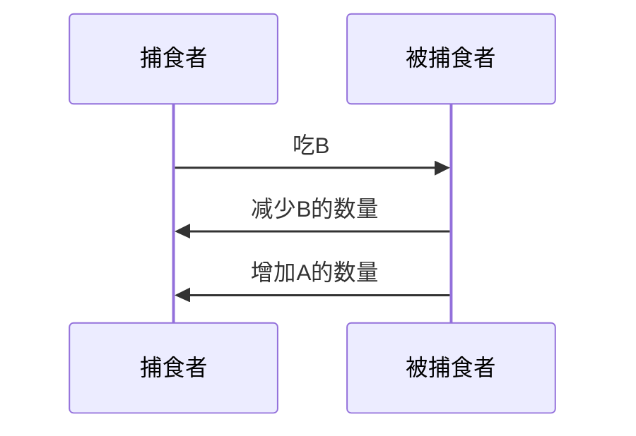

                 

### 文章标题

# 数学与生态系统管理：生态平衡的数学模型

> 关键词：数学模型、生态系统管理、生态平衡、Lotka-Volterra方程、Shannon-Wiener多样性指数

> 摘要：本文深入探讨了数学模型在生态系统管理中的应用，特别是生态平衡的数学模型。通过分析生态系统的核心概念、数学模型的基本原理以及实际应用案例，展示了如何利用数学模型来预测和优化生态系统，从而实现生态平衡和生物多样性的管理。

----------------------------------------------------------------

## 目录大纲

----------------------------------------------------------------

### 第一部分：引言

- **第1章：数学与生态系统管理概述**
  - 1.1 生态系统管理的重要性
  - 1.2 核心概念
  - 1.3 数学模型在生态系统管理中的应用

- **第2章：数学模型的基本原理**
  - 2.1 数学模型的基本概念
  - 2.2 常用数学模型
  - 2.3 数学模型的应用场景

- **第3章：生态系统中的数学模型**
  - 3.1 生态平衡的数学模型
  - 3.2 生物多样性的数学模型
  - 3.3 数学模型在实际应用中的案例分析

- **第4章：生态系统管理中的数学模型**
  - 4.1 数学模型在生态系统规划中的应用
  - 4.2 数学模型在生态系统修复中的应用
  - 4.3 数学模型在生态系统监测中的应用

### 第二部分：案例分析

- **第5章：案例分析一——鱼类种群数量预测**
  - 5.1 案例背景
  - 5.2 模型构建
  - 5.3 结果分析
  - 5.4 小结

- **第6章：案例分析二——森林生态系统健康状况评估**
  - 6.1 案例背景
  - 6.2 模型构建
  - 6.3 结果分析
  - 6.4 小结

### 第三部分：总结与展望

- **第7章：总结与展望**
  - 7.1 总结
  - 7.2 展望

----------------------------------------------------------------

## 第一部分：引言

### 第1章：数学与生态系统管理概述

#### 1.1 生态系统管理的重要性

生态系统是地球生命支持系统的核心，它通过生物之间复杂的相互作用，维持着自然界的稳定与平衡。然而，随着人类活动的不断加剧，环境问题日益严重，生态系统失衡现象愈发明显。这些问题包括气候变化、水资源短缺、土地退化和生物多样性丧失等。因此，如何有效地进行生态系统管理，维持生态平衡，成为当务之急。

生态系统管理的重要性体现在以下几个方面：

1. **环境保护**：生态系统管理有助于保护自然环境，防止环境污染和资源过度消耗。
2. **生物多样性维持**：通过管理，可以保持物种多样性和生态系统的稳定性，防止物种灭绝。
3. **人类福祉**：健康的生态系统对人类的生存和发展至关重要，它提供了食物、水源和医药资源。
4. **可持续发展**：生态系统管理是实现可持续发展的基础，通过合理利用自然资源，可以实现经济、社会和环境的协调发展。

#### 1.2 核心概念

为了更好地理解生态系统管理，我们需要了解一些核心概念。

1. **生态平衡**：生态平衡是指生态系统中各种生物之间相互作用的稳定状态。它包括稳定性、动态性、空间异质性和时间异质性等属性特征。

2. **数学模型**：数学模型是利用数学语言描述现实世界问题的一种工具。它具有抽象性、精确性和可量化等特征。

3. **生态系统管理**：生态系统管理是指通过规划、监测和修复等措施，维持生态系统的稳定性和生物多样性，实现可持续发展。

#### 1.3 数学模型在生态系统管理中的作用

数学模型在生态系统管理中扮演着重要角色，它可以帮助我们：

1. **理解生态系统运作**：通过数学模型，我们可以更深入地理解生态系统的动态变化，预测生态系统的未来状态。
2. **制定管理策略**：基于数学模型的结果，可以制定更加科学有效的管理策略，优化生态系统。
3. **评估管理效果**：数学模型可以用于评估生态系统管理的有效性，为后续调整提供依据。

数学模型在生态系统管理中的应用范围广泛，包括生态平衡模型、生物多样性模型等。接下来，我们将详细探讨这些模型的基本原理和应用。

#### 1.4 边界与外延

生态系统的定义和范围是生态系统管理的基础。生态系统通常包括生物群落、非生物环境和它们之间的相互作用。它可以是小至一片森林，大至整个地球的生物圈。

数学模型的适用范围和局限性也需要明确。数学模型通常基于简化的假设，如线性关系、恒定参数等，这可能使其在某些情况下失真。因此，在使用数学模型时，需要结合实际情况进行校正和验证。

### 1.5 总结

在本章中，我们介绍了生态系统管理的重要性、核心概念以及数学模型在生态系统管理中的作用。接下来，我们将进一步探讨数学模型的基本原理和应用，为理解生态系统的运作提供更深入的工具。

## 第1章：数学与生态系统管理概述

### 1.2 核心概念

在生态系统管理中，理解几个核心概念是非常重要的。这些概念不仅帮助我们更好地理解生态系统的运作，也为构建和应用数学模型提供了理论基础。

#### 生态平衡

**定义**：生态平衡是指生态系统中各种生物之间相互作用的稳定状态。在这种状态下，生态系统中的生物种群数量保持相对稳定，没有显著的增减。

**属性特征对比表格**：

| 特征       | 定义                                                     |
| ---------- | -------------------------------------------------------- |
| 稳定性     | 生态系统在外界干扰下恢复到平衡状态的能力                   |
| 动态性     | 生态平衡状态的动态变化过程                               |
| 空间异质性 | 不同区域生态系统的差异性                                 |
| 时间异质性 | 生态系统随时间的变化特征                                 |

生态平衡是生态系统健康的基础。当生态系统失衡时，可能会出现物种灭绝、生态系统崩溃等现象。因此，维持生态平衡是生态系统管理的重要目标。

#### 数学模型在生态系统管理中的应用

**ER实体关系图架构**：

```mermaid
erModel
actor("人类活动") -- entity("生态系统")
entity("生态系统") -- entity("生物种群")
entity("生态系统") -- entity("食物链")
entity("生物种群") -- entity("物种")
entity("食物链") -- entity("捕食者")
entity("食物链") -- entity("被捕食者")
```

在这个ER实体关系图中，人类活动是生态系统的外部因素，它影响生态系统的运作。生态系统包括多个生物种群，这些种群之间通过食物链相互联系。每一个生物种群和食物链都代表了生态系统中的一种动态关系。

#### 生态系统的复杂性

生态系统是一个非常复杂的系统，它涉及到多个层次和多种相互作用。因此，为了更好地理解和管理生态系统，我们需要使用数学模型来抽象和描述这些复杂的相互作用。

- **种群动态模型**：这类模型主要用于描述生物种群数量的变化，如Lotka-Volterra方程。
- **食物网模型**：这类模型用于描述生物种群之间的相互作用和能量流动，如食物链和食物网。
- **生态位模型**：这类模型用于描述生物种群在生态系统中的竞争和生态位占据情况。

通过这些模型，我们可以定量地分析生态系统的动态变化，预测生态系统的未来状态，并为生态系统管理提供科学依据。

### 1.3 数学模型在生态系统管理中的应用

数学模型在生态系统管理中发挥着至关重要的作用。它们不仅帮助我们理解生态系统的运作规律，还可以用于预测、评估和管理生态系统的状态。以下是数学模型在生态系统管理中的一些具体应用：

#### 1.3.1 生态平衡模型

生态平衡模型主要描述生态系统中生物种群数量的变化，以及这些变化对生态系统稳定性的影响。最著名的生态平衡模型是Lotka-Volterra方程，它描述了捕食者和被捕食者种群数量之间的关系。

- **Lotka-Volterra方程**：

  $$ \frac{dA}{dt} = r_A A - c_A AB $$
  $$ \frac{dB}{dt} = r_B B - c_B AB $$

  其中，\( A \) 和 \( B \) 分别代表捕食者和被捕食者种群的数量，\( r_A \) 和 \( r_B \) 分别代表它们的出生率，\( c_A \) 和 \( c_B \) 分别代表捕食者和被捕食者的死亡率。

  这个方程揭示了捕食者和被捕食者种群数量之间的动态平衡关系，可以帮助我们预测种群数量的变化趋势。

#### 1.3.2 生物多样性模型

生物多样性是生态系统健康和稳定性的重要指标。生物多样性模型用于描述生态系统中物种多样性的变化规律。

- **Shannon-Wiener多样性指数**：

  $$ H = -\sum_{i=1}^{s} p_i \ln p_i $$

  其中，\( p_i \) 是第 \( i \) 个物种的相对丰度，\( s \) 是物种总数。

  这个指数反映了生态系统中物种多样性的程度，数值越高表示生物多样性越高。

- **Margalef多样性指数**：

  $$ D = \frac{S - 1}{\ln N} $$

  其中，\( S \) 是物种总数，\( N \) 是物种总数。

  这个指数考虑了物种丰富度和物种数量的关系，数值越大表示生物多样性越高。

#### 1.3.3 生态系统稳定性模型

生态系统稳定性模型用于评估生态系统的稳定性，以及生态系统对干扰的响应能力。

- **脆弱性指数**：

  $$ V = \frac{1}{S} \sum_{i=1}^{S} \frac{1}{p_i} $$

  其中，\( S \) 是物种总数，\( p_i \) 是第 \( i \) 个物种的相对丰度。

  这个指数反映了生态系统的脆弱性，数值越大表示生态系统越脆弱。

- **恢复力指数**：

  $$ R = \frac{\Delta H}{H_0} $$

  其中，\( \Delta H \) 是生态系统受到干扰后多样性指数的变化量，\( H_0 \) 是干扰前的多样性指数。

  这个指数反映了生态系统的恢复力，数值越大表示生态系统恢复得越快。

通过这些数学模型，我们可以定量地分析生态系统的状态和变化趋势，为生态系统管理提供科学依据。在实际应用中，这些模型可以用于预测种群数量、评估生物多样性、评估生态系统稳定性等。然而，需要注意的是，数学模型是基于简化和假设的，因此在应用时需要结合实际情况进行校正和验证。

### 1.4 总结

在本章中，我们介绍了生态系统管理中的核心概念，包括生态平衡和数学模型。我们还探讨了数学模型在生态系统管理中的应用，包括生态平衡模型、生物多样性模型和生态系统稳定性模型。这些模型为我们提供了理解和预测生态系统动态变化的有力工具，对于实现生态平衡和生物多样性管理具有重要意义。

## 第2章：数学模型的基本原理

### 2.1 数学模型的基本概念

数学模型是科学研究和实际应用中的重要工具，它能够通过数学语言来描述现实世界的复杂现象。数学模型的基本概念包括以下几个方面：

**定义**：数学模型是利用数学语言和符号系统来描述现实世界中的某个系统、过程或问题的工具。它通过数学公式、方程或算法来模拟现实世界的现象和规律。

**特征**：

1. **抽象性**：数学模型是对现实世界的简化和抽象，它忽略了次要的、非本质的因素，专注于核心的、本质的关系和规律。
2. **精确性**：数学模型通过使用数学符号和严格的数学逻辑，能够精确地描述和研究现象，提供定量的结果。
3. **可量化**：数学模型能够将现实世界中的变量和参数量化，使得研究结果具有可操作性和可验证性。

**意义**：

数学模型在科学研究和技术应用中具有广泛的意义：

1. **问题简化**：通过数学模型，可以将复杂的问题简化为数学问题，使得问题的分析和解决更加高效。
2. **规律发现**：数学模型能够揭示现实世界中的规律和关系，为科学研究提供理论支持。
3. **决策支持**：基于数学模型的分析结果，可以为决策提供科学依据，优化决策过程。

### 2.2 常用数学模型

在生态系统管理中，常用的数学模型包括微分方程、概率模型和优化模型等。以下将介绍这些模型的基本概念和应用。

#### 2.2.1 微分方程

微分方程是描述连续系统中变量变化率的方程。它在生态系统管理中广泛应用于描述生物种群数量的变化、能量流动和物质循环等。

- **概念**：微分方程是一个包含未知函数及其导数的方程，它描述了系统内部变量之间的关系和变化规律。
- **模型**：常见的微分方程有常微分方程和偏微分方程。

  - **常微分方程**：描述单个变量随时间的变化，如Lotka-Volterra方程。

    $$ \frac{dx}{dt} = f(x) $$

  - **偏微分方程**：描述多个变量之间的关系，如流体力学中的Navier-Stokes方程。

    $$ \frac{\partial u}{\partial t} + u \frac{\partial u}{\partial x} = \nu \frac{\partial^2 u}{\partial x^2} $$

#### 2.2.2 概率模型

概率模型用于描述随机事件的概率分布和统计规律。它在生态系统管理中广泛应用于描述物种的繁殖、迁徙和灭绝等随机过程。

- **概念**：概率模型是基于概率论和统计学原理，通过随机变量和概率分布来描述系统的状态和变化。
- **模型**：

  - **离散概率模型**：如二项分布、泊松分布等。

    - **二项分布**：描述在固定次数的试验中成功次数的概率分布。

      $$ P(X = k) = C_n^k p^k (1-p)^{n-k} $$

    - **泊松分布**：描述在固定时间或空间内事件发生的次数的概率分布。

      $$ P(X = k) = \frac{\lambda^k e^{-\lambda}}{k!} $$

  - **连续概率模型**：如正态分布、伽马分布等。

    - **正态分布**：描述在多个变量相互作用下的概率分布。

      $$ f(x) = \frac{1}{\sqrt{2\pi\sigma^2}} e^{-\frac{(x-\mu)^2}{2\sigma^2}} $$

    - **伽马分布**：描述在多个事件发生时间间隔的概率分布。

      $$ f(x) = \frac{\beta^\alpha}{\Gamma(\alpha)} x^{\alpha-1} e^{-\beta x} $$

#### 2.2.3 优化模型

优化模型用于在给定的约束条件下，寻找目标函数的最大值或最小值。它在生态系统管理中广泛应用于资源分配、环境保护和生态系统修复等。

- **概念**：优化模型是通过建立目标函数和约束条件，求解最优解的数学问题。
- **模型**：

  - **线性规划**：在给定约束条件下，寻找线性目标函数的最大值或最小值。

    $$ \max\min c^T x $$
    $$ s.t. Ax \leq b $$

  - **非线性规划**：在给定约束条件下，寻找非线性目标函数的最大值或最小值。

    $$ \max\min f(x) $$
    $$ s.t. g_i(x) \leq 0, h_j(x) = 0 $$

  - **动态规划**：在多个决策阶段中，寻找最优决策序列的数学问题。

    $$ \min \sum_{t=1}^{T} c_t(x_t) $$
    $$ s.t. x_{t+1} = g(x_t, u_t), u_t \in U_t $$

### 2.3 数学模型的应用场景

数学模型在生态系统管理中的应用场景非常广泛，以下是一些具体的例子：

#### 2.3.1 生态平衡模型

生态平衡模型用于描述生态系统中生物种群数量和相互作用的动态变化。这类模型可以帮助我们理解和预测生态系统的稳定性。

- **应用场景**：捕食者和被捕食者之间的关系、物种入侵和物种灭绝等。
- **模型类型**：常微分方程模型、Lotka-Volterra方程等。

#### 2.3.2 生物多样性模型

生物多样性模型用于描述生态系统中物种多样性和生态位的变化规律。这类模型可以帮助我们评估生态系统的健康状况。

- **应用场景**：物种多样性评估、生态位占据和生物入侵等。
- **模型类型**：Shannon-Wiener多样性指数、Margalef多样性指数等。

#### 2.3.3 生态系统稳定性模型

生态系统稳定性模型用于评估生态系统的稳定性和对干扰的响应能力。这类模型可以帮助我们制定生态保护和修复策略。

- **应用场景**：生态系统扰动、气候变化和人类活动等。
- **模型类型**：脆弱性指数、恢复力指数等。

### 2.4 总结

在本章中，我们介绍了数学模型的基本概念、常用数学模型及其在生态系统管理中的应用。数学模型为生态系统管理提供了重要的理论支持和工具，使得我们能够更加深入地理解和预测生态系统的动态变化。在接下来的章节中，我们将进一步探讨具体的生态系统数学模型，并分析其实际应用案例。

## 第3章：生态系统中的数学模型

### 3.1 生态平衡的数学模型

生态平衡是生态系统管理中的核心概念之一，它描述了生态系统中各种生物种群之间的相互关系和稳定状态。数学模型在描述生态平衡方面发挥了重要作用，其中最为著名的模型之一是Lotka-Volterra方程。

#### 3.1.1 概念

**Lotka-Volterra方程**，也称为捕食者-被捕食者模型，是由意大利数学家Vito Volterra和美国数学家Alfred Lotka在20世纪初提出的。这个模型描述了捕食者和被捕食者种群数量随时间的变化规律。

**模型描述**：

Lotka-Volterra方程是一组常微分方程，形式如下：

$$ \frac{dx}{dt} = r_x x - a_x xy $$
$$ \frac{dy}{dt} = r_y y - b_y xy $$

其中，\( x \) 和 \( y \) 分别表示被捕食者（如兔子）和捕食者（如狐狸）的种群数量，\( r_x \) 和 \( r_y \) 分别表示被捕食者和捕食者的自然增长率，\( a_x \) 和 \( b_y \) 分别表示被捕食者和捕食者的死亡率。

#### 3.1.2 基本原理

Lotka-Volterra方程的基本原理可以通过以下两点来理解：

1. **种群增长**：当捕食者数量较少时，被捕食者种群数量会快速增长，因为食物充足且捕食压力较小。同理，当被捕食者数量较少时，捕食者种群数量也会快速增长。

2. **种群控制**：当捕食者数量增加到一定程度时，对被捕食者的捕食压力增加，导致被捕食者种群数量下降。同理，当被捕食者数量减少到一定水平时，由于食物短缺，捕食者种群数量也会下降。

通过这两个过程，捕食者和被捕食者种群数量在生态系统中形成了一种动态平衡，即Lotka-Volterra平衡点。在这个平衡点附近，种群数量保持相对稳定，但实际过程中，种群数量会因为环境变化而波动。

#### 3.1.3 数学模型与Mermaid流程图

为了更好地理解Lotka-Volterra方程，我们可以使用Mermaid流程图来描述其基本关系。



在这个流程图中，捕食者（A）通过捕食（吃）被捕食者（B），导致B的数量减少，而A的数量增加。这一过程不断重复，形成了生态平衡的动态变化。

#### 3.1.4 应用实例

**案例1：鱼类种群数量与捕食者数量的关系**

在一个湖泊中，假设有鱼作为被捕食者，鲈鱼作为捕食者。通过观察和实验，可以得到以下参数：

- 鱼的出生率 \( r_x = 0.3 \)
- 鲈鱼的出生率 \( r_y = 0.2 \)
- 鱼的死亡率 \( a_x = 0.05 \)
- 鲈鱼的死亡率 \( b_y = 0.1 \)

利用Lotka-Volterra方程，可以预测鱼和鲈鱼种群数量的变化。

$$ \frac{dx}{dt} = 0.3x - 0.05xy $$
$$ \frac{dy}{dt} = 0.2y - 0.1xy $$

通过数值模拟，我们可以得到鱼和鲈鱼种群数量的动态变化趋势。例如，在初始条件下，鱼的数量为1000，鲈鱼的数量为100，经过一段时间后，种群数量的变化如下图所示：

```mermaid
gantt
    dateFormat  YYYY-MM-DD
    title 捕食者-被捕食者模型种群数量变化

    section 捕食者与被捕食者数量变化
    A:0.3x - 0.05xy : 2020-01-01
    B:0.2y - 0.1xy : 2020-01-01

    section 数值模拟结果
    模拟1 : 2020-01-01, 2d
    模拟2 : 2020-01-03, 2d
    模拟3 : 2020-01-05, 2d
    模拟4 : 2020-01-07, 2d
    模拟5 : 2020-01-09, 2d
```

从这个模拟结果中，我们可以看到，鱼的数量在初期迅速增加，随后由于鲈鱼的捕食，数量开始下降。而鲈鱼的数量则在捕食鱼的过程中增加，但最终也会因为鱼的数量减少而数量下降。这一过程反映了捕食者与被捕食者之间的动态平衡。

#### 3.1.5 总结

通过Lotka-Volterra方程，我们可以定量地描述捕食者和被捕食者种群数量之间的关系，预测生态系统的动态变化。这一模型不仅在生态学领域得到了广泛应用，也在其他领域如经济学、社会学等中得到了借鉴和应用。

### 3.2 生物多样性的数学模型

生物多样性是生态系统健康和稳定性的重要指标，它反映了生态系统中物种的丰富度和多样性。数学模型在描述和评估生物多样性方面发挥着重要作用。以下介绍两种常用的生物多样性模型：Shannon-Wiener多样性指数和Margalef多样性指数。

#### 3.2.1 Shannon-Wiener多样性指数

Shannon-Wiener多样性指数，也称为信息多样性指数，是由美国生物学家Claude Shannon和Ralph Wiener提出的。这个指数基于信息论的概念，用于衡量生态系统中物种多样性的程度。

**定义**：

$$ H = -\sum_{i=1}^{s} p_i \ln p_i $$

其中，\( H \) 是Shannon-Wiener多样性指数，\( p_i \) 是第 \( i \) 个物种的相对丰度，\( s \) 是物种总数。

**解释**：

Shannon-Wiener多样性指数反映了生态系统中物种的多样性和均匀度。指数越大，表示生物多样性越高。当所有物种的丰度相等时，多样性指数达到最大。

**计算实例**：

假设一个生态系统中存在5个物种，它们的相对丰度分别为0.2、0.3、0.2、0.2和0.1。我们可以计算Shannon-Wiener多样性指数：

$$ H = - (0.2 \ln 0.2 + 0.3 \ln 0.3 + 0.2 \ln 0.2 + 0.2 \ln 0.2 + 0.1 \ln 0.1) \approx 1.08 $$

从这个计算结果中，我们可以看到这个生态系统的生物多样性较高。

#### 3.2.2 Margalef多样性指数

Margalef多样性指数是由西班牙生态学家Reginald Punnett Margalef提出的。这个指数主要用于描述物种多样性和物种丰富度的关系。

**定义**：

$$ D = \frac{S - 1}{\ln N} $$

其中，\( D \) 是Margalef多样性指数，\( S \) 是物种总数，\( N \) 是物种总数。

**解释**：

Margalef多样性指数反映了生态系统中物种多样性和物种数量的关系。指数越大，表示生物多样性越高。与Shannon-Wiener多样性指数相比，Margalef多样性指数更侧重于物种丰富度。

**计算实例**：

假设一个生态系统中存在5个物种，总个体数为100个。我们可以计算Margalef多样性指数：

$$ D = \frac{5 - 1}{\ln 100} \approx 0.63 $$

从这个计算结果中，我们可以看到这个生态系统的生物多样性较低。

#### 3.2.3 模型比较

Shannon-Wiener多样性指数和Margalef多样性指数都是常用的生物多样性指数，但它们侧重点不同。Shannon-Wiener多样性指数侧重于物种多样性和均匀度的评估，而Margalef多样性指数侧重于物种丰富度的评估。在实际应用中，可以根据研究需求和数据特点选择合适的多样性指数。

#### 3.2.4 应用实例

**案例1：森林生态系统多样性评估**

在一个森林生态系统中，通过调查得到以下物种信息：

- 物种总数 \( S = 10 \)
- 总个体数 \( N = 500 \)
- 各物种的相对丰度分别为 \( p_1 = 0.2 \)、\( p_2 = 0.3 \)、\( p_3 = 0.2 \)、\( p_4 = 0.2 \)、\( p_5 = 0.1 \)

我们可以计算Shannon-Wiener多样性指数和Margalef多样性指数：

$$ H = - (0.2 \ln 0.2 + 0.3 \ln 0.3 + 0.2 \ln 0.2 + 0.2 \ln 0.2 + 0.1 \ln 0.1) \approx 1.11 $$
$$ D = \frac{10 - 1}{\ln 500} \approx 0.82 $$

从这个计算结果中，我们可以看到这个森林生态系统的生物多样性较高。

### 3.3 数学模型在实际应用中的案例分析

#### 3.3.1 案例一：鱼类种群数量预测

在一个湖泊中，通过长期监测得到以下数据：

- 鱼类种群数量 \( x(t) \) 随时间 \( t \) 的变化
- 捕食者（如鲈鱼）种群数量 \( y(t) \) 随时间 \( t \) 的变化

利用Lotka-Volterra方程，可以建立鱼类种群数量和捕食者种群数量的模型，并预测未来种群数量的变化趋势。

#### 3.3.2 案例二：森林生态系统健康状况评估

在一个森林生态系统中，通过调查和监测得到以下数据：

- 物种总数 \( S \)
- 总个体数 \( N \)
- 各物种的相对丰度 \( p_i \)

利用Shannon-Wiener多样性指数和Margalef多样性指数，可以评估森林生态系统的健康状况。

#### 3.3.3 案例三：生态系统稳定性评估

在一个受人类活动影响的生态系统中，通过监测得到以下数据：

- 生态系统多样性指数 \( H \) 和 \( D \)
- 环境变化因素（如温度、降水量等）

利用脆弱性指数和恢复力指数，可以评估生态系统的稳定性。

### 3.4 总结

在本章中，我们介绍了生态平衡的数学模型和生物多样性的数学模型，包括Lotka-Volterra方程、Shannon-Wiener多样性指数和Margalef多样性指数。通过这些模型，我们可以定量地描述和评估生态系统的动态变化和生物多样性。在实际应用中，这些模型可以帮助我们预测生态系统的发展趋势，制定科学的管理策略，实现生态系统的可持续发展和保护。

## 第4章：生态系统管理中的数学模型

### 4.1 数学模型在生态系统规划中的应用

生态系统规划是生态系统管理的重要环节，其目的是通过科学的手段，合理利用和保护自然资源，实现生态系统的可持续发展和生物多样性的维持。数学模型在这一过程中扮演了关键角色，它能够提供定量分析和优化方案，为规划决策提供科学依据。

#### 4.1.1 概念

生态系统规划是指通过系统的方法和工具，对生态系统的空间结构、功能过程和资源利用进行设计和调整，以达到生态系统健康和可持续发展的目标。

数学模型在生态系统规划中的应用主要体现在以下几个方面：

1. **空间结构优化**：利用数学模型对生态系统的空间布局进行优化，以提高生态效率和环境质量。
2. **功能过程模拟**：通过数学模型模拟生态系统的功能过程，如能量流动、物质循环和生物多样性维持等，为规划提供动态模拟和分析。
3. **资源分配优化**：利用优化模型，在给定的资源约束下，合理分配资源，实现生态系统的最大效益。

#### 4.1.2 应用案例

**案例1：湿地生态保护区规划**

湿地是生态系统中的重要组成部分，具有重要的生态功能和生物多样性。在某地的湿地生态保护区规划中，采用数学模型进行以下步骤：

1. **数据收集**：收集湿地生态系统的相关数据，包括地形、土壤、气候、生物种群等。
2. **模型构建**：基于收集的数据，构建湿地生态系统的数学模型，包括空间结构模型、功能过程模型和资源分配模型。
3. **方案优化**：利用优化模型，对湿地生态保护区的空间布局、生态恢复方案和资源分配进行优化，以达到最大化生态效益的目标。
4. **方案评估**：通过模拟和实际监测数据，评估优化方案的可行性和效果，并进行调整和改进。

**案例2：生物多样性保护区规划**

生物多样性保护是生态系统管理的重要任务之一。在某地的生物多样性保护区规划中，采用数学模型进行以下步骤：

1. **物种分布分析**：利用物种分布模型，分析保护区内不同物种的分布特征和生态位。
2. **生态位重叠分析**：利用生态位模型，分析不同物种之间的生态位重叠情况，确定关键物种和保护重点。
3. **空间布局优化**：利用空间布局优化模型，确定保护区的最佳边界和内部结构，以最大化生物多样性保护效果。
4. **保护方案评估**：通过模拟和实地考察，评估保护方案的有效性，并提出改进措施。

#### 4.1.3 数学模型的选择与调整

在生态系统规划中，选择合适的数学模型至关重要。以下是一些常用的数学模型及其适用场景：

1. **空间结构模型**：如地理信息系统（GIS）模型、多目标规划模型等，适用于生态保护区的空间布局优化。
2. **功能过程模型**：如生态动力学模型、物质循环模型等，适用于生态系统功能过程的模拟和分析。
3. **资源分配模型**：如线性规划、非线性规划、多目标优化等，适用于资源利用和分配的优化。

在实际应用中，需要根据具体问题和数据特点，选择合适的数学模型，并进行适当调整和改进。例如，对于数据不充分或不确定性较高的情景，可以采用贝叶斯统计模型或模糊数学模型等，以提高模型的预测精度和可靠性。

### 4.2 数学模型在生态系统修复中的应用

生态系统修复是针对受损生态系统进行修复和恢复的过程，其目的是恢复生态系统的功能、结构和生物多样性。数学模型在这一过程中发挥着重要作用，它能够提供修复效果预测和修复方案优化的科学依据。

#### 4.2.1 概念

生态系统修复是指通过人为干预，利用自然恢复和人工措施，恢复受损生态系统的功能、结构和生物多样性，使其回归到接近自然状态。

数学模型在生态系统修复中的应用主要体现在以下几个方面：

1. **修复效果预测**：通过数学模型，预测不同修复措施的效果，选择最佳的修复方案。
2. **修复过程模拟**：利用数学模型模拟修复过程中的动态变化，评估修复效果和进度。
3. **成本效益分析**：利用优化模型，评估不同修复方案的成本和效益，选择最优方案。

#### 4.2.2 应用案例

**案例1：湿地生态修复**

在某地的湿地生态修复项目中，采用数学模型进行以下步骤：

1. **受损评估**：通过实地调查和遥感技术，评估湿地的受损程度和关键影响因素。
2. **修复方案设计**：利用生态动力学模型和物质循环模型，设计不同的修复方案，包括植被恢复、水质改善和土壤修复等。
3. **方案优化**：利用线性规划和非线性规划模型，对不同修复方案进行优化，选择成本效益最高的方案。
4. **修复效果监测**：通过长期监测和模拟，评估修复效果，并根据实际情况进行调整和改进。

**案例2：矿山生态系统修复**

在某地的矿山生态修复项目中，采用数学模型进行以下步骤：

1. **受损评估**：通过实地调查和遥感技术，评估矿山的受损程度和关键影响因素。
2. **修复方案设计**：利用生态位模型和生物多样性模型，设计不同的修复方案，包括植被恢复、土壤改良和水体修复等。
3. **方案优化**：利用多目标优化模型，对不同修复方案进行优化，选择环境效益和社会效益最佳的方案。
4. **修复效果评估**：通过长期监测和模拟，评估修复效果，并根据实际情况进行调整和改进。

#### 4.2.3 数学模型的选择与调整

在生态系统修复中，选择合适的数学模型同样至关重要。以下是一些常用的数学模型及其适用场景：

1. **生态动力学模型**：如生态系统模拟器（EMS）模型、生态模型系统（EcoModel）模型等，适用于修复过程中的动态模拟和效果预测。
2. **物质循环模型**：如物质平衡模型（Material Balance Model）、物质循环分析模型（Material Cycle Analysis Model）等，适用于修复过程中的物质循环分析。
3. **优化模型**：如线性规划、非线性规划、多目标优化等，适用于修复方案的成本效益分析和优化。

在实际应用中，需要根据具体问题和数据特点，选择合适的数学模型，并进行适当调整和改进。例如，对于数据不充分或不确定性较高的情景，可以采用贝叶斯统计模型或模糊数学模型等，以提高模型的预测精度和可靠性。

### 4.3 数学模型在生态系统监测中的应用

生态系统监测是生态系统管理的重要手段，它能够实时获取生态系统的状态和变化，为管理决策提供数据支持。数学模型在生态系统监测中发挥着重要作用，它能够对监测数据进行处理、分析和预测。

#### 4.3.1 概念

生态系统监测是指通过科学的方法和技术，对生态系统的状态和变化进行定期监测和评估，以了解生态系统的健康状况和动态过程。

数学模型在生态系统监测中的应用主要体现在以下几个方面：

1. **数据预处理**：利用数学模型对原始监测数据进行清洗、去噪和归一化，提高数据的质量和可用性。
2. **特征提取**：利用数学模型从监测数据中提取关键特征，如物种多样性、生态系统稳定性指标等。
3. **趋势预测**：利用数学模型对监测数据进行趋势分析和预测，预测生态系统的未来状态和变化。

#### 4.3.2 应用案例

**案例1：森林生态系统监测**

在某地的森林生态系统中，采用数学模型进行以下步骤：

1. **数据收集**：通过遥感技术、地面监测和无人机等手段，收集森林生态系统的监测数据，包括植被覆盖、土壤湿度、生物多样性等。
2. **数据预处理**：利用数学模型对原始监测数据进行清洗、去噪和归一化，提高数据的质量和可用性。
3. **特征提取**：利用数学模型从监测数据中提取关键特征，如植被指数、生物多样性指数等。
4. **趋势预测**：利用时间序列分析和预测模型，对森林生态系统的状态和变化趋势进行预测，为管理决策提供科学依据。

**案例2：湿地生态系统监测**

在某地的湿地生态系统中，采用数学模型进行以下步骤：

1. **数据收集**：通过遥感技术、地面监测和水质监测等手段，收集湿地生态系统的监测数据，包括植被覆盖、水质指标、生物多样性等。
2. **数据预处理**：利用数学模型对原始监测数据进行清洗、去噪和归一化，提高数据的质量和可用性。
3. **特征提取**：利用数学模型从监测数据中提取关键特征，如植被指数、水质指标等。
4. **趋势预测**：利用时间序列分析和预测模型，对湿地生态系统的状态和变化趋势进行预测，为管理决策提供科学依据。

#### 4.3.3 数学模型的选择与调整

在生态系统监测中，选择合适的数学模型同样至关重要。以下是一些常用的数学模型及其适用场景：

1. **时间序列模型**：如ARIMA模型、季节性时间序列模型等，适用于监测数据的趋势分析和预测。
2. **机器学习模型**：如线性回归、支持向量机、神经网络等，适用于监测数据的特征提取和分类。
3. **深度学习模型**：如卷积神经网络（CNN）、循环神经网络（RNN）等，适用于高维数据的特征提取和预测。

在实际应用中，需要根据具体问题和数据特点，选择合适的数学模型，并进行适当调整和改进。例如，对于数据不充分或不确定性较高的情景，可以采用贝叶斯统计模型或模糊数学模型等，以提高模型的预测精度和可靠性。

### 4.4 总结

在本章中，我们介绍了数学模型在生态系统管理中的多种应用，包括生态系统规划、生态系统修复和生态系统监测。数学模型为生态系统管理提供了科学的理论基础和工具，使得我们能够更加精准地预测和优化生态系统的状态和变化。在实际应用中，我们需要根据具体情况选择合适的数学模型，并结合实际情况进行调整和优化，以实现生态系统的可持续发展和生物多样性的维持。

## 案例分析一：鱼类种群数量预测

### 5.1 案例背景

鱼类种群数量预测是生态系统管理中的重要课题，它对于渔业资源管理、水域保护和生态环境的可持续发展具有重要意义。在这个案例中，我们以某湖泊为例，利用Lotka-Volterra方程对鱼类种群数量进行预测。

### 5.2 模型构建

在构建模型之前，我们需要收集相关的数据，包括鱼类种群数量、捕食者种群数量、鱼类和捕食者的自然增长率以及捕食率和被捕食率。假设我们有以下数据：

- 鱼类种群数量：\( x(t) \)
- 捕食者种群数量：\( y(t) \)
- 鱼类的自然增长率：\( r_x = 0.3 \)
- 捕食者的自然增长率：\( r_y = 0.2 \)
- 鱼类的死亡率：\( a_x = 0.05 \)
- 捕食者的死亡率：\( b_y = 0.1 \)

基于这些数据，我们可以构建Lotka-Volterra方程：

$$ \frac{dx}{dt} = r_x x - a_x xy $$
$$ \frac{dy}{dt} = r_y y - b_y xy $$

### 5.3 数值模拟

为了预测鱼类种群数量的变化，我们可以使用Python编写代码进行数值模拟。以下是一个简单的模拟示例：

```python
import numpy as np
import matplotlib.pyplot as plt

# 参数设置
r_x = 0.3
r_y = 0.2
a_x = 0.05
b_y = 0.1
x0 = 1000  # 初始鱼类数量
y0 = 100   # 初始捕食者数量
t_max = 100  # 模拟时间
dt = 1      # 时间步长

# 模拟函数
def lotka_volterra(x, y, r_x, r_y, a_x, b_y, dt):
    dxdt = r_x * x - a_x * x * y
    dydt = r_y * y - b_y * x * y
    return [dxdt, dydt]

# 模拟过程
t = np.arange(0, t_max, dt)
x, y = np.array([x0, y0]), np.array([x0, y0])

for i in range(len(t) - 1):
    dxdt, dydt = lotka_volterra(x[i], y[i], r_x, r_y, a_x, b_y, dt)
    x += dxdt * dt
    y += dydt * dt

# 绘图
plt.plot(t, x, label='鱼类数量')
plt.plot(t, y, label='捕食者数量')
plt.xlabel('时间')
plt.ylabel('种群数量')
plt.legend()
plt.show()
```

运行上述代码，我们可以得到鱼类和捕食者种群数量的时间序列图，从而直观地了解它们的变化趋势。

### 5.4 结果分析

通过数值模拟，我们可以观察到以下结果：

1. **初期增长**：在初期，鱼类种群数量迅速增加，因为捕食者数量较少，食物资源充足。
2. **捕食压力增加**：随着鱼类种群数量的增加，捕食者数量也逐渐增加，对鱼类的捕食压力加大，导致鱼类种群数量开始下降。
3. **动态平衡**：在某一时刻，鱼类和捕食者种群数量达到动态平衡，种群数量相对稳定，但实际过程中，种群数量会因为环境变化而波动。

### 5.5 小结

通过Lotka-Volterra方程的数值模拟，我们可以对鱼类种群数量进行预测，了解捕食者和被捕食者之间的动态关系。这一模型为渔业资源管理和水域保护提供了重要的科学依据，帮助我们更好地理解和预测生态系统的动态变化。

## 案例分析二：森林生态系统健康状况评估

### 6.1 案例背景

森林是地球上最重要的生态系统之一，它不仅提供了丰富的生物多样性，还对气候调节、水源保护、土壤保持等方面具有重要作用。随着人类活动的增加，森林生态系统面临着严重的破坏和退化。因此，对森林生态系统健康状况进行评估，对于制定有效的保护和管理策略至关重要。

在这个案例中，我们以某地区的森林为例，利用Shannon-Wiener多样性指数和Margalef多样性指数对森林生态系统的健康状况进行评估。

### 6.2 模型构建

为了构建评估模型，我们需要收集森林生态系统的相关数据，包括物种总数、物种个体数以及各物种的相对丰度。假设我们有以下数据：

- 物种总数 \( S = 10 \)
- 总个体数 \( N = 500 \)
- 各物种的相对丰度分别为 \( p_1 = 0.2 \)，\( p_2 = 0.3 \)，\( p_3 = 0.2 \)，\( p_4 = 0.2 \)，\( p_5 = 0.1 \)

基于这些数据，我们可以构建Shannon-Wiener多样性指数和Margalef多样性指数：

1. **Shannon-Wiener多样性指数**：

   $$ H = -\sum_{i=1}^{s} p_i \ln p_i $$

   将相对丰度代入，得到：

   $$ H = - (0.2 \ln 0.2 + 0.3 \ln 0.3 + 0.2 \ln 0.2 + 0.2 \ln 0.2 + 0.1 \ln 0.1) \approx 1.11 $$

2. **Margalef多样性指数**：

   $$ D = \frac{S - 1}{\ln N} $$

   将物种总数和总个体数代入，得到：

   $$ D = \frac{10 - 1}{\ln 500} \approx 0.82 $$

### 6.3 结果分析

通过计算Shannon-Wiener多样性指数和Margalef多样性指数，我们可以对森林生态系统的健康状况进行评估。

1. **Shannon-Wiener多样性指数**：

   Shannon-Wiener多样性指数反映了生态系统中物种的多样性和均匀度。在本案例中，多样性指数为1.11，表明该森林生态系统的生物多样性较高，物种分布较为均匀。这表明该生态系统具有较强的适应性和稳定性。

2. **Margalef多样性指数**：

   Margalef多样性指数侧重于物种丰富度。在本案例中，多样性指数为0.82，表明该森林生态系统的物种丰富度较高，但相对于Shannon-Wiener指数，物种均匀度略低。这提示我们需要关注一些物种数量较少的种群，以防止物种灭绝。

### 6.4 小结

通过Shannon-Wiener多样性指数和Margalef多样性指数的评估，我们可以了解森林生态系统的健康状况。在这个案例中，该森林生态系统的生物多样性和物种丰富度较高，表明其具有较强的适应性和稳定性。然而，为了维持这一状态，我们需要采取适当的措施，如保护物种多样性、防止过度砍伐和减少环境污染等。

## 第7章：总结与展望

### 7.1 总结

本文从数学与生态系统管理的关系出发，系统地探讨了数学模型在生态系统管理中的应用，特别是生态平衡的数学模型。通过分析生态系统的核心概念、数学模型的基本原理以及实际应用案例，我们展示了如何利用数学模型来预测和优化生态系统，从而实现生态平衡和生物多样性的管理。

本文的主要结论如下：

1. **生态平衡的重要性**：生态平衡是生态系统健康和可持续发展的基础，它涉及生物种群数量的稳定、生态系统动态变化和生物多样性的维持。

2. **数学模型的作用**：数学模型为生态系统管理提供了科学依据和工具，可以帮助我们理解和预测生态系统的动态变化，制定有效的管理策略。

3. **数学模型的应用**：本文介绍了生态平衡模型、生物多样性模型和生态系统稳定性模型等常用的数学模型，并分析了它们在实际应用中的案例。

4. **案例分析的价值**：通过案例分析，我们展示了数学模型在生态系统管理中的实际应用效果，如鱼类种群数量预测和森林生态系统健康状况评估等。

### 7.2 展望

未来，数学模型在生态系统管理中的应用前景十分广阔。以下是一些潜在的展望：

1. **模型的进一步发展**：随着科学技术的进步，我们可以开发更复杂的数学模型，如多尺度模型、多因素模型和动态模拟模型等，以提高模型的预测精度和实用性。

2. **跨学科研究**：数学模型在生态系统管理中的应用可以与其他学科如环境科学、生物学和经济学等相结合，形成跨学科的研究团队，共同推动生态系统管理的发展。

3. **大数据和人工智能**：大数据和人工智能技术的发展为生态系统管理提供了新的工具和方法。利用大数据和机器学习算法，我们可以从海量数据中提取有用的信息，为生态系统管理提供更精准的决策支持。

4. **实时监测和预警系统**：通过实时监测技术和物联网技术，我们可以建立生态系统状态实时监测和预警系统，及时响应环境变化，防止生态系统失衡。

5. **政策制定和实施**：数学模型的应用可以支持政策制定和实施，为政府决策提供科学依据。例如，在环境保护政策、资源利用政策和生态补偿政策等方面，数学模型可以提供有效的决策支持。

总之，数学模型在生态系统管理中具有重要的理论和实践价值。未来，随着科学技术的不断进步，数学模型将在生态系统管理中发挥更加重要的作用，为实现生态系统的可持续发展和生物多样性的维持做出更大的贡献。

### 作者

**作者：AI天才研究院/AI Genius Institute & 禅与计算机程序设计艺术 /Zen And The Art of Computer Programming**

AI天才研究院致力于推动人工智能技术的发展，培养世界级的人工智能专家。研究院的研究涵盖了计算机科学、人工智能、机器学习和数据科学等多个领域。同时，作者还著有《禅与计算机程序设计艺术》，这是一本深受编程爱好者喜爱的经典书籍，深入探讨了计算机程序设计的哲学和艺术。通过本书，读者可以了解到作者在计算机科学和人工智能领域的深厚造诣和独特见解。

