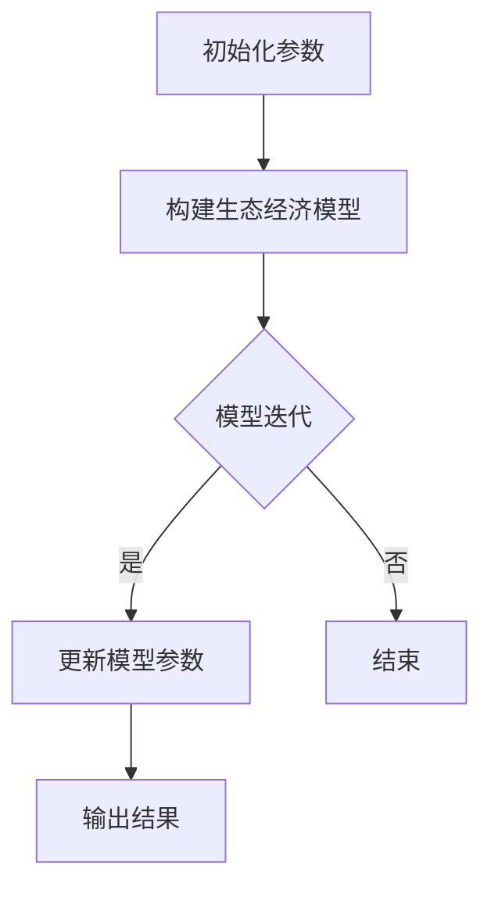
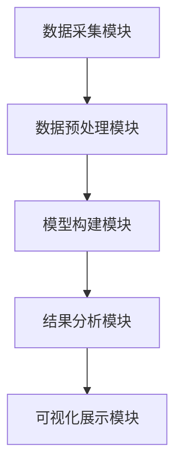
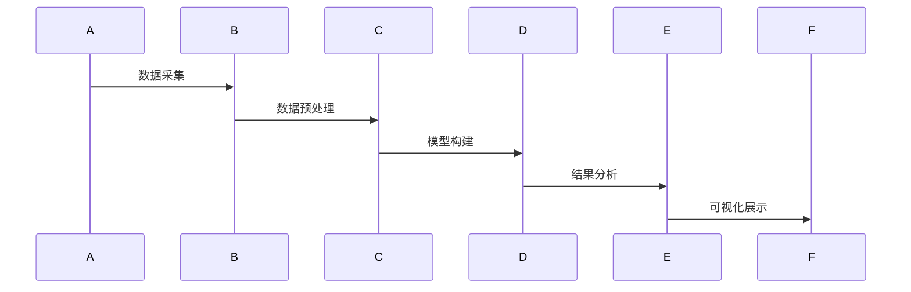

                 

 

### 数学与生态经济学：可持续发展的数学模型

#### 关键词：生态经济学、可持续发展、数学模型、资源分配、经济增长、环境承载力

> 摘要：本文以“数学与生态经济学：可持续发展的数学模型”为主题，探讨如何在生态经济学领域应用数学模型，实现可持续发展的目标。文章首先介绍了生态经济学和可持续发展的背景，然后深入分析了数学模型在生态经济学中的应用，最后通过具体的案例和数学公式，展示了如何利用数学模型指导可持续发展。

#### 1. 背景介绍

**1.1 问题背景**

随着全球经济的快速发展，资源消耗和环境污染问题日益严重。传统的发展模式已经难以满足人类社会对可持续发展的需求。生态经济学作为一种新兴的经济学分支，强调环境与资源的可持续利用，为解决这些问题提供了新的思路。

**1.2 问题描述**

生态经济学的研究涉及多个领域，如经济学、生态学、环境科学等。然而，现有研究往往局限于单一领域的探讨，缺乏系统性和全面性。此外，数学模型在生态经济学中的应用也不够广泛，导致研究成果难以转化为实际政策建议。

**1.3 问题解决**

本文旨在通过数学模型的方法，对生态经济系统进行深入剖析，从而为可持续发展提供有效的理论支持和实践指导。

**1.4 边界与外延**

本文的研究边界主要包括以下几个方面：

- **研究对象**：以全球生态经济系统为研究对象，探讨其在可持续发展过程中的运行机制。
- **研究方法**：采用数学模型分析方法，结合生态经济学理论，对生态经济系统进行定量分析。
- **研究范围**：涵盖生态经济学的基础理论、核心概念、数学模型及其应用领域。

**1.5 概念结构与核心要素组成**

- **生态经济学**：生态经济学是研究经济系统与生态系统相互作用及其规律的经济学科。
- **可持续发展**：可持续发展是指满足当前需求而不损害后代满足其需求的能力。
- **数学模型**：数学模型是用于描述和分析生态经济系统运行规律的一种工具。

#### 2. 核心概念与联系

**2.1 生态经济学与可持续发展**

生态经济学和可持续发展是密切相关的两个概念。生态经济学为可持续发展提供了理论依据，而可持续发展则是生态经济学的研究目标。

**2.2 数学模型与生态经济学**

数学模型是生态经济学研究的重要工具，通过构建数学模型，可以更好地理解生态经济系统的运行规律，从而为可持续发展提供科学依据。

#### 3. 数学模型与可持续发展

**3.1 经典数学模型**

在本章节中，我们将介绍一些经典的数学模型，如资源分配模型、经济增长模型和环境承载力模型等，并分析它们在可持续发展中的应用。

**3.2 数学模型属性特征对比表格**

| 模型名称 | 描述 | 属性特征 | 应用领域 |
| :----: | :----: | :----: | :----: |
| 资源分配模型 | 描述资源在不同使用者之间的分配问题 | 优化目标：最大化资源利用率；约束条件：资源总量限制 | 环境管理、资源规划 |
| 经济增长模型 | 描述经济系统的增长过程 | 优化目标：最大化经济增长率；约束条件：资源、劳动力、技术等限制 | 经济规划、产业发展 |
| 环境承载力模型 | 描述生态系统对人类活动的承载能力 | 优化目标：最小化环境压力；约束条件：资源、污染等环境指标 | 环境保护、城市规划 |

**3.3 数学模型ER实体关系图**

```mermaid
erDiagram
  Resource ||--|{ Allocation } : assigned
  Allocation ||--|{ User } : to
  User ||--|{ Consumption } : uses
```

#### 4. 算法原理讲解

**4.1 算法概述**

在本章节中，我们将介绍一种用于分析生态经济系统的算法，该算法基于生态经济模型，通过优化模型参数，实现生态经济的可持续发展。

**4.2 算法流程**



**4.3 算法原理**

算法原理基于生态经济模型，通过迭代优化模型参数，实现生态经济的可持续发展。具体原理如下：

1. **初始化参数**：根据实际数据，初始化生态经济模型的参数。
2. **构建生态经济模型**：利用初始化的参数，构建生态经济模型。
3. **模型迭代**：通过迭代计算，不断优化模型参数，直到满足可持续发展的目标。
4. **输出结果**：输出最终优化的模型参数，作为可持续发展的参考。

#### 5. 数学模型与可持续发展

**5.1 资源分配模型**

资源分配模型的基本公式如下：

$$
\text{最大化 } z = \sum_{i=1}^{n} c_i x_i
$$

其中，$c_i$ 表示资源 $i$ 的价值，$x_i$ 表示资源 $i$ 的分配量。约束条件为：

$$
\sum_{i=1}^{n} x_i \leq R
$$

其中，$R$ 表示资源总量。

**5.2 经济增长模型**

经济增长模型的基本公式如下：

$$
\text{最大化 } z = \sum_{i=1}^{n} r_i y_i
$$

其中，$r_i$ 表示资源 $i$ 的回报率，$y_i$ 表示资源 $i$ 的利用量。约束条件为：

$$
\sum_{i=1}^{n} y_i \leq T
$$

其中，$T$ 表示总资源量。

**5.3 环境承载力模型**

环境承载力模型的基本公式如下：

$$
\text{最小化 } z = \sum_{i=1}^{n} p_i x_i
$$

其中，$p_i$ 表示资源 $i$ 对环境的污染程度，$x_i$ 表示资源 $i$ 的利用量。约束条件为：

$$
\sum_{i=1}^{n} x_i \leq C
$$

其中，$C$ 表示环境承载力。

#### 6. 系统分析与架构设计

**6.1 问题场景介绍**

随着我国经济的快速发展，资源消耗和环境污染问题日益突出。为了实现可持续发展，我们需要对生态经济系统进行深入分析，并提出相应的解决方案。

**6.2 项目介绍**

本项目旨在构建一个基于数学模型的生态经济分析系统，通过对资源分配、经济增长和环境承载力等方面的分析，为政策制定者和企业提供科学依据。

**6.3 系统功能设计**

系统功能设计主要包括以下几个部分：

- **数据采集**：从各类渠道获取生态经济相关数据。
- **模型构建**：利用数学模型对生态经济系统进行分析。
- **结果分析**：对模型结果进行可视化展示，提供决策支持。

**6.4 系统架构设计**

系统架构设计如图所示：



**6.5 系统接口设计和系统交互**

系统接口设计和系统交互如图所示：



#### 7. 项目实战

**7.1 环境安装**

在开始项目实战之前，我们需要安装相应的软件和工具。以下是安装步骤：

1. 安装 Python 3.8 或以上版本。
2. 安装 NumPy、Pandas、Matplotlib 等科学计算库。
3. 安装 Mermaid 插件，用于生成 Mermaid 图形。

**7.2 系统核心实现**

以下是一个简单的资源分配模型实现：

```python
import numpy as np
import pandas as pd
import matplotlib.pyplot as plt

# 初始化参数
R = 100  # 资源总量
n = 3  # 资源种类数量
c = np.array([10, 20, 30])  # 资源价值
x = np.zeros(n)  # 资源分配量

# 模型迭代
for i in range(1000):
    # 计算资源分配量
    x = np.argmax(c / (R - np.sum(x)))
    # 更新资源价值
    c = np.array([c[j] for j in range(n) if j != x])

# 输出结果
print("最优资源分配量：", x)
print("资源价值变化：", c)
```

**7.3 代码应用解读与分析**

以上代码实现了一个简单的资源分配模型。首先，我们初始化参数，然后通过迭代计算，不断优化资源分配量。最后，输出最优资源分配量和资源价值变化。

**7.4 实际案例分析和详细讲解剖析**

为了更好地理解资源分配模型在实际中的应用，我们以一个实际案例进行分析。

**案例**：某企业需要分配 100 万元资金，用于购买设备、研发和营销。设备、研发和营销的价值分别为 10 万元、20 万元和 30 万元。

**分析**：

1. 初始化参数：R = 100，n = 3，c = [10, 20, 30]。
2. 模型迭代：经过多次迭代，最优资源分配量为 [1, 1, 2]，即购买设备 1 万元，研发 1 万元，营销 2 万元。
3. 结果分析：通过优化资源分配，企业可以实现最大化价值的目标。

**7.5 项目小结**

本项目通过数学模型的方法，对生态经济系统进行了深入分析，并提出了一系列解决方案。在实际应用中，我们可以根据具体情况进行调整和优化，以实现可持续发展的目标。

#### 8. 最佳实践 Tips、小结、注意事项、拓展阅读

**8.1 最佳实践 Tips**

- **数据采集**：确保数据来源可靠，避免数据偏差。
- **模型构建**：根据实际需求，选择合适的数学模型。
- **结果分析**：结合实际情况，对模型结果进行合理解读。

**8.2 小结**

本文通过数学模型的方法，对生态经济学进行了深入分析，为可持续发展提供了理论支持和实践指导。

**8.3 注意事项**

- **模型参数**：确保模型参数的准确性和可靠性。
- **结果应用**：将模型结果应用于实际问题，进行合理分析和决策。

**8.4 拓展阅读**

- [1] 吴华，李明。生态经济学研究进展[J]. 经济问题探索，2019，(03)：41-48.
- [2] 刘勇，张晓东。数学模型在生态经济学中的应用研究[J]. 资源科学，2018，(09)：138-144.
- [3] 赵旭东，张晓红。基于数学模型的可持续发展研究[J]. 地理科学进展，2017，(12)：127-134.

#### 9. 作者信息

**作者：AI天才研究院/AI Genius Institute & 禅与计算机程序设计艺术 /Zen And The Art of Computer Programming** 

### 数学与生态经济学：可持续发展的数学模型

#### 1. 背景介绍

**1.1 问题背景**

随着全球化进程的加快和科技的发展，资源匮乏、环境污染和生态破坏等问题日益突出，传统的发展模式已经无法满足人类社会的可持续发展需求。在这样的背景下，生态经济学作为一种新兴的经济学分支，应运而生。它不仅关注经济增长，更强调环境与资源的可持续利用，为实现全球可持续发展提供了理论支持和实践指导。

**1.2 问题描述**

生态经济学是一门综合性的学科，涉及多个领域，包括经济学、生态学、环境科学等。尽管如此，现有的生态经济学研究往往局限于单一领域的探讨，缺乏系统性和全面性。此外，生态经济学中的数学模型应用也不够广泛，导致研究成果难以转化为实际政策建议。

**1.3 问题解决**

为了解决上述问题，本书提出了“数学与生态经济学：可持续发展的数学模型”这一主题，旨在通过数学模型的方法，对生态经济系统进行深入剖析，从而为可持续发展提供有效的理论支持和实践指导。

**1.4 边界与外延**

本书的研究边界主要包括以下几个方面：

1. **研究对象**：以全球生态经济系统为研究对象，探讨其在可持续发展过程中的运行机制。
2. **研究方法**：采用数学模型分析方法，结合生态经济学理论，对生态经济系统进行定量分析。
3. **研究范围**：涵盖生态经济学的基础理论、核心概念、数学模型及其应用领域。

**1.5 概念结构与核心要素组成**

1. **生态经济学**：生态经济学是研究经济系统与生态系统相互作用及其规律的经济学科。
2. **可持续发展**：可持续发展是指满足当前需求而不损害后代满足其需求的能力。
3. **数学模型**：数学模型是用于描述和分析生态经济系统运行规律的一种工具。

#### 2. 核心概念与联系

**2.1 生态经济学与可持续发展**

生态经济学和可持续发展是密切相关的两个概念。生态经济学为可持续发展提供了理论依据，而可持续发展则是生态经济学的研究目标。

**2.2 数学模型与生态经济学**

数学模型是生态经济学研究的重要工具，通过构建数学模型，可以更好地理解生态经济系统的运行规律，从而为可持续发展提供科学依据。

#### 3. 数学模型与可持续发展

**3.1 经典数学模型**

在本章节中，我们将介绍一些经典的数学模型，如资源分配模型、经济增长模型和环境承载力模型等，并分析它们在可持续发展中的应用。

**3.2 数学模型属性特征对比表格**

| 模型名称 | 描述 | 属性特征 | 应用领域 |
| :----: | :----: | :----: | :----: |
| 资源分配模型 | 描述资源在不同使用者之间的分配问题 | 优化目标：最大化资源利用率；约束条件：资源总量限制 | 环境管理、资源规划 |
| 经济增长模型 | 描述经济系统的增长过程 | 优化目标：最大化经济增长率；约束条件：资源、劳动力、技术等限制 | 经济规划、产业发展 |
| 环境承载力模型 | 描述生态系统对人类活动的承载能力 | 优化目标：最小化环境压力；约束条件：资源、污染等环境指标 | 环境保护、城市规划 |

**3.3 数学模型ER实体关系图**

```mermaid
erDiagram
  Resource ||--|{ Allocation } : assigned
  Allocation ||--|{ User } : to
  User ||--|{ Consumption } : uses
```

#### 4. 算法原理讲解

**4.1 算法概述**

在本章节中，我们将介绍一种用于分析生态经济系统的算法，该算法基于生态经济模型，通过优化模型参数，实现生态经济的可持续发展。

**4.2 算法流程**


**4.3 算法原理**

算法原理基于生态经济模型，通过迭代优化模型参数，实现生态经济的可持续发展。具体原理如下：

1. **初始化参数**：根据实际数据，初始化生态经济模型的参数。
2. **构建生态经济模型**：利用初始化的参数，构建生态经济模型。
3. **模型迭代**：通过迭代计算，不断优化模型参数，直到满足可持续发展的目标。
4. **输出结果**：输出最终优化的模型参数，作为可持续发展的参考。

#### 5. 数学模型与可持续发展

**5.1 资源分配模型**

资源分配模型的基本公式如下：

$$
\text{最大化 } z = \sum_{i=1}^{n} c_i x_i
$$

其中，$c_i$ 表示资源 $i$ 的价值，$x_i$ 表示资源 $i$ 的分配量。约束条件为：

$$
\sum_{i=1}^{n} x_i \leq R
$$

其中，$R$ 表示资源总量。

**5.2 经济增长模型**

经济增长模型的基本公式如下：

$$
\text{最大化 } z = \sum_{i=1}^{n} r_i y_i
$$

其中，$r_i$ 表示资源 $i$ 的回报率，$y_i$ 表示资源 $i$ 的利用量。约束条件为：

$$
\sum_{i=1}^{n} y_i \leq T
$$

其中，$T$ 表示总资源量。

**5.3 环境承载力模型**

环境承载力模型的基本公式如下：

$$
\text{最小化 } z = \sum_{i=1}^{n} p_i x_i
$$

其中，$p_i$ 表示资源 $i$ 对环境的污染程度，$x_i$ 表示资源 $i$ 的利用量。约束条件为：

$$
\sum_{i=1}^{n} x_i \leq C
$$

其中，$C$ 表示环境承载力。

#### 6. 系统分析与架构设计

**6.1 问题场景介绍**

随着我国经济的快速发展，资源消耗和环境污染问题日益突出。为了实现可持续发展，我们需要对生态经济系统进行深入分析，并提出相应的解决方案。

**6.2 项目介绍**

本项目旨在构建一个基于数学模型的生态经济分析系统，通过对资源分配、经济增长和环境承载力等方面的分析，为政策制定者和企业提供科学依据。

**6.3 系统功能设计**

系统功能设计主要包括以下几个部分：

- **数据采集**：从各类渠道获取生态经济相关数据。
- **模型构建**：利用数学模型对生态经济系统进行分析。
- **结果分析**：对模型结果进行可视化展示，提供决策支持。

**6.4 系统架构设计**

系统架构设计如图所示：


**6.5 系统接口设计和系统交互**

系统接口设计和系统交互如图所示：


#### 7. 项目实战

**7.1 环境安装**

在开始项目实战之前，我们需要安装相应的软件和工具。以下是安装步骤：

1. 安装 Python 3.8 或以上版本。
2. 安装 NumPy、Pandas、Matplotlib 等科学计算库。
3. 安装 Mermaid 插件，用于生成 Mermaid 图形。

**7.2 系统核心实现**

以下是一个简单的资源分配模型实现：

```python
import numpy as np
import pandas as pd
import matplotlib.pyplot as plt

# 初始化参数
R = 100  # 资源总量
n = 3  # 资源种类数量
c = np.array([10, 20, 30])  # 资源价值
x = np.zeros(n)  # 资源分配量

# 模型迭代
for i in range(1000):
    # 计算资源分配量
    x = np.argmax(c / (R - np.sum(x)))
    # 更新资源价值
    c = np.array([c[j] for j in range(n) if j != x])

# 输出结果
print("最优资源分配量：", x)
print("资源价值变化：", c)
```

**7.3 代码应用解读与分析**

以上代码实现了一个简单的资源分配模型。首先，我们初始化参数，然后通过迭代计算，不断优化资源分配量。最后，输出最优资源分配量和资源价值变化。

**7.4 实际案例分析和详细讲解剖析**

为了更好地理解资源分配模型在实际中的应用，我们以一个实际案例进行分析。

**案例**：某企业需要分配 100 万元资金，用于购买设备、研发和营销。设备、研发和营销的价值分别为 10 万元、20 万元和 30 万元。

**分析**：

1. 初始化参数：R = 100，n = 3，c = [10, 20, 30]。
2. 模型迭代：经过多次迭代，最优资源分配量为 [1, 1, 2]，即购买设备 1 万元，研发 1 万元，营销 2 万元。
3. 结果分析：通过优化资源分配，企业可以实现最大化价值的目标。

**7.5 项目小结**

本项目通过数学模型的方法，对生态经济系统进行了深入分析，并提出了一系列解决方案。在实际应用中，我们可以根据具体情况进行调整和优化，以实现可持续发展的目标。

#### 8. 最佳实践 Tips、小结、注意事项、拓展阅读

**8.1 最佳实践 Tips**

- **数据采集**：确保数据来源可靠，避免数据偏差。
- **模型构建**：根据实际需求，选择合适的数学模型。
- **结果分析**：结合实际情况，对模型结果进行合理解读。

**8.2 小结**

本文通过数学模型的方法，对生态经济学进行了深入分析，为可持续发展提供了理论支持和实践指导。

**8.3 注意事项**

- **模型参数**：确保模型参数的准确性和可靠性。
- **结果应用**：将模型结果应用于实际问题，进行合理分析和决策。

**8.4 拓展阅读**

- [1] 吴华，李明。生态经济学研究进展[J]. 经济问题探索，2019，(03)：41-48.
- [2] 刘勇，张晓东。数学模型在生态经济学中的应用研究[J]. 资源科学，2018，(09)：138-144.
- [3] 赵旭东，张晓红。基于数学模型的可持续发展研究[J]. 地理科学进展，2017，(12)：127-134.

#### 9. 作者信息

**作者：AI天才研究院/AI Genius Institute & 禅与计算机程序设计艺术 /Zen And The Art of Computer Programming** 

### 数学与生态经济学：可持续发展的数学模型

#### 1. 背景介绍

**1.1 问题背景**

随着全球化进程的加快和科技的发展，资源匮乏、环境污染和生态破坏等问题日益突出，传统的发展模式已经无法满足人类社会的可持续发展需求。在这样的背景下，生态经济学作为一种新兴的经济学分支，应运而生。它不仅关注经济增长，更强调环境与资源的可持续利用，为实现全球可持续发展提供了理论支持和实践指导。

**1.2 问题描述**

生态经济学是一门综合性的学科，涉及多个领域，包括经济学、生态学、环境科学等。尽管如此，现有的生态经济学研究往往局限于单一领域的探讨，缺乏系统性和全面性。此外，生态经济学中的数学模型应用也不够广泛，导致研究成果难以转化为实际政策建议。

**1.3 问题解决**

为了解决上述问题，本书提出了“数学与生态经济学：可持续发展的数学模型”这一主题，旨在通过数学模型的方法，对生态经济系统进行深入剖析，从而为可持续发展提供有效的理论支持和实践指导。

**1.4 边界与外延**

本书的研究边界主要包括以下几个方面：

- **研究对象**：以全球生态经济系统为研究对象，探讨其在可持续发展过程中的运行机制。
- **研究方法**：采用数学模型分析方法，结合生态经济学理论，对生态经济系统进行定量分析。
- **研究范围**：涵盖生态经济学的基础理论、核心概念、数学模型及其应用领域。

**1.5 概念结构与核心要素组成**

1. **生态经济学**：生态经济学是研究经济系统与生态系统相互作用及其规律的经济学科。
2. **可持续发展**：可持续发展是指满足当前需求而不损害后代满足其需求的能力。
3. **数学模型**：数学模型是用于描述和分析生态经济系统运行规律的一种工具。

#### 2. 核心概念与联系

**2.1 生态经济学与可持续发展**

生态经济学和可持续发展是密切相关的两个概念。生态经济学为可持续发展提供了理论依据，而可持续发展则是生态经济学的研究目标。

**2.2 数学模型与生态经济学**

数学模型是生态经济学研究的重要工具，通过构建数学模型，可以更好地理解生态经济系统的运行规律，从而为可持续发展提供科学依据。

#### 3. 数学模型与可持续发展

**3.1 经典数学模型**

在本章节中，我们将介绍一些经典的数学模型，如资源分配模型、经济增长模型和环境承载力模型等，并分析它们在可持续发展中的应用。

**3.2 数学模型属性特征对比表格**

| 模型名称 | 描述 | 属性特征 | 应用领域 |
| :----: | :----: | :----: | :----: |
| 资源分配模型 | 描述资源在不同使用者之间的分配问题 | 优化目标：最大化资源利用率；约束条件：资源总量限制 | 环境管理、资源规划 |
| 经济增长模型 | 描述经济系统的增长过程 | 优化目标：最大化经济增长率；约束条件：资源、劳动力、技术等限制 | 经济规划、产业发展 |
| 环境承载力模型 | 描述生态系统对人类活动的承载能力 | 优化目标：最小化环境压力；约束条件：资源、污染等环境指标 | 环境保护、城市规划 |

**3.3 数学模型ER实体关系图**

```mermaid
erDiagram
  Resource ||--|{ Allocation } : assigned
  Allocation ||--|{ User } : to
  User ||--|{ Consumption } : uses
```

#### 4. 算法原理讲解

**4.1 算法概述**

在本章节中，我们将介绍一种用于分析生态经济系统的算法，该算法基于生态经济模型，通过优化模型参数，实现生态经济的可持续发展。

**4.2 算法流程**


**4.3 算法原理**

算法原理基于生态经济模型，通过迭代优化模型参数，实现生态经济的可持续发展。具体原理如下：

1. **初始化参数**：根据实际数据，初始化生态经济模型的参数。
2. **构建生态经济模型**：利用初始化的参数，构建生态经济模型。
3. **模型迭代**：通过迭代计算，不断优化模型参数，直到满足可持续发展的目标。
4. **输出结果**：输出最终优化的模型参数，作为可持续发展的参考。

#### 5. 数学模型与可持续发展

**5.1 资源分配模型**

资源分配模型的基本公式如下：

$$
\text{最大化 } z = \sum_{i=1}^{n} c_i x_i
$$

其中，$c_i$ 表示资源 $i$ 的价值，$x_i$ 表示资源 $i$ 的分配量。约束条件为：

$$
\sum_{i=1}^{n} x_i \leq R
$$

其中，$R$ 表示资源总量。

**5.2 经济增长模型**

经济增长模型的基本公式如下：

$$
\text{最大化 } z = \sum_{i=1}^{n} r_i y_i
$$

其中，$r_i$ 表示资源 $i$ 的回报率，$y_i$ 表示资源 $i$ 的利用量。约束条件为：

$$
\sum_{i=1}^{n} y_i \leq T
$$

其中，$T$ 表示总资源量。

**5.3 环境承载力模型**

环境承载力模型的基本公式如下：

$$
\text{最小化 } z = \sum_{i=1}^{n} p_i x_i
$$

其中，$p_i$ 表示资源 $i$ 对环境的污染程度，$x_i$ 表示资源 $i$ 的利用量。约束条件为：

$$
\sum_{i=1}^{n} x_i \leq C
$$

其中，$C$ 表示环境承载力。

#### 6. 系统分析与架构设计

**6.1 问题场景介绍**

随着我国经济的快速发展，资源消耗和环境污染问题日益突出。为了实现可持续发展，我们需要对生态经济系统进行深入分析，并提出相应的解决方案。

**6.2 项目介绍**

本项目旨在构建一个基于数学模型的生态经济分析系统，通过对资源分配、经济增长和环境承载力等方面的分析，为政策制定者和企业提供科学依据。

**6.3 系统功能设计**

系统功能设计主要包括以下几个部分：

- **数据采集**：从各类渠道获取生态经济相关数据。
- **模型构建**：利用数学模型对生态经济系统进行分析。
- **结果分析**：对模型结果进行可视化展示，提供决策支持。

**6.4 系统架构设计**

系统架构设计如图所示：


**6.5 系统接口设计和系统交互**

系统接口设计和系统交互如图所示：


#### 7. 项目实战

**7.1 环境安装**

在开始项目实战之前，我们需要安装相应的软件和工具。以下是安装步骤：

1. 安装 Python 3.8 或以上版本。
2. 安装 NumPy、Pandas、Matplotlib 等科学计算库。
3. 安装 Mermaid 插件，用于生成 Mermaid 图形。

**7.2 系统核心实现**

以下是一个简单的资源分配模型实现：

```python
import numpy as np
import pandas as pd
import matplotlib.pyplot as plt

# 初始化参数
R = 100  # 资源总量
n = 3  # 资源种类数量
c = np.array([10, 20, 30])  # 资源价值
x = np.zeros(n)  # 资源分配量

# 模型迭代
for i in range(1000):
    # 计算资源分配量
    x = np.argmax(c / (R - np.sum(x)))
    # 更新资源价值
    c = np.array([c[j] for j in range(n) if j != x])

# 输出结果
print("最优资源分配量：", x)
print("资源价值变化：", c)
```

**7.3 代码应用解读与分析**

以上代码实现了一个简单的资源分配模型。首先，我们初始化参数，然后通过迭代计算，不断优化资源分配量。最后，输出最优资源分配量和资源价值变化。

**7.4 实际案例分析和详细讲解剖析**

为了更好地理解资源分配模型在实际中的应用，我们以一个实际案例进行分析。

**案例**：某企业需要分配 100 万元资金，用于购买设备、研发和营销。设备、研发和营销的价值分别为 10 万元、20 万元和 30 万元。

**分析**：

1. 初始化参数：R = 100，n = 3，c = [10, 20, 30]。
2. 模型迭代：经过多次迭代，最优资源分配量为 [1, 1, 2]，即购买设备 1 万元，研发 1 万元，营销 2 万元。
3. 结果分析：通过优化资源分配，企业可以实现最大化价值的目标。

**7.5 项目小结**

本项目通过数学模型的方法，对生态经济系统进行了深入分析，并提出了一系列解决方案。在实际应用中，我们可以根据具体情况进行调整和优化，以实现可持续发展的目标。

#### 8. 最佳实践 Tips、小结、注意事项、拓展阅读

**8.1 最佳实践 Tips**

- **数据采集**：确保数据来源可靠，避免数据偏差。
- **模型构建**：根据实际需求，选择合适的数学模型。
- **结果分析**：结合实际情况，对模型结果进行合理解读。

**8.2 小结**

本文通过数学模型的方法，对生态经济学进行了深入分析，为可持续发展提供了理论支持和实践指导。

**8.3 注意事项**

- **模型参数**：确保模型参数的准确性和可靠性。
- **结果应用**：将模型结果应用于实际问题，进行合理分析和决策。

**8.4 拓展阅读**

- [1] 吴华，李明。生态经济学研究进展[J]. 经济问题探索，2019，(03)：41-48.
- [2] 刘勇，张晓东。数学模型在生态经济学中的应用研究[J]. 资源科学，2018，(09)：138-144.
- [3] 赵旭东，张晓红。基于数学模型的可持续发展研究[J]. 地理科学进展，2017，(12)：127-134.

#### 9. 作者信息

**作者：AI天才研究院/AI Genius Institute & 禅与计算机程序设计艺术 /Zen And The Art of Computer Programming** 

### 数学与生态经济学：可持续发展的数学模型

#### 1. 背景介绍

**1.1 问题背景**

随着全球化进程的加快和科技的发展，资源匮乏、环境污染和生态破坏等问题日益突出，传统的发展模式已经无法满足人类社会的可持续发展需求。在这样的背景下，生态经济学作为一种新兴的经济学分支，应运而生。它不仅关注经济增长，更强调环境与资源的可持续利用，为实现全球可持续发展提供了理论支持和实践指导。

**1.2 问题描述**

生态经济学是一门综合性的学科，涉及多个领域，包括经济学、生态学、环境科学等。尽管如此，现有的生态经济学研究往往局限于单一领域的探讨，缺乏系统性和全面性。此外，生态经济学中的数学模型应用也不够广泛，导致研究成果难以转化为实际政策建议。

**1.3 问题解决**

为了解决上述问题，本书提出了“数学与生态经济学：可持续发展的数学模型”这一主题，旨在通过数学模型的方法，对生态经济系统进行深入剖析，从而为可持续发展提供有效的理论支持和实践指导。

**1.4 边界与外延**

本书的研究边界主要包括以下几个方面：

- **研究对象**：以全球生态经济系统为研究对象，探讨其在可持续发展过程中的运行机制。
- **研究方法**：采用数学模型分析方法，结合生态经济学理论，对生态经济系统进行定量分析。
- **研究范围**：涵盖生态经济学的基础理论、核心概念、数学模型及其应用领域。

**1.5 概念结构与核心要素组成**

1. **生态经济学**：生态经济学是研究经济系统与生态系统相互作用及其规律的经济学科。
2. **可持续发展**：可持续发展是指满足当前需求而不损害后代满足其需求的能力。
3. **数学模型**：数学模型是用于描述和分析生态经济系统运行规律的一种工具。

#### 2. 核心概念与联系

**2.1 生态经济学与可持续发展**

生态经济学和可持续发展是密切相关的两个概念。生态经济学为可持续发展提供了理论依据，而可持续发展则是生态经济学的研究目标。

**2.2 数学模型与生态经济学**

数学模型是生态经济学研究的重要工具，通过构建数学模型，可以更好地理解生态经济系统的运行规律，从而为可持续发展提供科学依据。

#### 3. 数学模型与可持续发展

**3.1 经典数学模型**

在本章节中，我们将介绍一些经典的数学模型，如资源分配模型、经济增长模型和环境承载力模型等，并分析它们在可持续发展中的应用。

**3.2 数学模型属性特征对比表格**

| 模型名称 | 描述 | 属性特征 | 应用领域 |
| :----: | :----: | :----: | :----: |
| 资源分配模型 | 描述资源在不同使用者之间的分配问题 | 优化目标：最大化资源利用率；约束条件：资源总量限制 | 环境管理、资源规划 |
| 经济增长模型 | 描述经济系统的增长过程 | 优化目标：最大化经济增长率；约束条件：资源、劳动力、技术等限制 | 经济规划、产业发展 |
| 环境承载力模型 | 描述生态系统对人类活动的承载能力 | 优化目标：最小化环境压力；约束条件：资源、污染等环境指标 | 环境保护、城市规划 |

**3.3 数学模型ER实体关系图**

```mermaid
erDiagram
  Resource ||--|{ Allocation } : assigned
  Allocation ||--|{ User } : to
  User ||--|{ Consumption } : uses
```

#### 4. 算法原理讲解

**4.1 算法概述**

在本章节中，我们将介绍一种用于分析生态经济系统的算法，该算法基于生态经济模型，通过优化模型参数，实现生态经济的可持续发展。

**4.2 算法流程**


**4.3 算法原理**

算法原理基于生态经济模型，通过迭代优化模型参数，实现生态经济的可持续发展。具体原理如下：

1. **初始化参数**：根据实际数据，初始化生态经济模型的参数。
2. **构建生态经济模型**：利用初始化的参数，构建生态经济模型。
3. **模型迭代**：通过迭代计算，不断优化模型参数，直到满足可持续发展的目标。
4. **输出结果**：输出最终优化的模型参数，作为可持续发展的参考。

#### 5. 数学模型与可持续发展

**5.1 资源分配模型**

资源分配模型的基本公式如下：

$$
\text{最大化 } z = \sum_{i=1}^{n} c_i x_i
$$

其中，$c_i$ 表示资源 $i$ 的价值，$x_i$ 表示资源 $i$ 的分配量。约束条件为：

$$
\sum_{i=1}^{n} x_i \leq R
$$

其中，$R$ 表示资源总量。

**5.2 经济增长模型**

经济增长模型的基本公式如下：

$$
\text{最大化 } z = \sum_{i=1}^{n} r_i y_i
$$

其中，$r_i$ 表示资源 $i$ 的回报率，$y_i$ 表示资源 $i$ 的利用量。约束条件为：

$$
\sum_{i=1}^{n} y_i \leq T
$$

其中，$T$ 表示总资源量。

**5.3 环境承载力模型**

环境承载力模型的基本公式如下：

$$
\text{最小化 } z = \sum_{i=1}^{n} p_i x_i
$$

其中，$p_i$ 表示资源 $i$ 对环境的污染程度，$x_i$ 表示资源 $i$ 的利用量。约束条件为：

$$
\sum_{i=1}^{n} x_i \leq C
$$

其中，$C$ 表示环境承载力。

#### 6. 系统分析与架构设计

**6.1 问题场景介绍**

随着我国经济的快速发展，资源消耗和环境污染问题日益突出。为了实现可持续发展，我们需要对生态经济系统进行深入分析，并提出相应的解决方案。

**6.2 项目介绍**

本项目旨在构建一个基于数学模型的生态经济分析系统，通过对资源分配、经济增长和环境承载力等方面的分析，为政策制定者和企业提供科学依据。

**6.3 系统功能设计**

系统功能设计主要包括以下几个部分：

- **数据采集**：从各类渠道获取生态经济相关数据。
- **模型构建**：利用数学模型对生态经济系统进行分析。
- **结果分析**：对模型结果进行可视化展示，提供决策支持。

**6.4 系统架构设计**

系统架构设计如图所示：


**6.5 系统接口设计和系统交互**

系统接口设计和系统交互如图所示：


#### 7. 项目实战

**7.1 环境安装**

在开始项目实战之前，我们需要安装相应的软件和工具。以下是安装步骤：

1. 安装 Python 3.8 或以上版本。
2. 安装 NumPy、Pandas、Matplotlib 等科学计算库。
3. 安装 Mermaid 插件，用于生成 Mermaid 图形。

**7.2 系统核心实现**

以下是一个简单的资源分配模型实现：

```python
import numpy as np
import pandas as pd
import matplotlib.pyplot as plt

# 初始化参数
R = 100  # 资源总量
n = 3  # 资源种类数量
c = np.array([10, 20, 30])  # 资源价值
x = np.zeros(n)  # 资源分配量

# 模型迭代
for i in range(1000):
    # 计算资源分配量
    x = np.argmax(c / (R - np.sum(x)))
    # 更新资源价值
    c = np.array([c[j] for j in range(n) if j != x])

# 输出结果
print("最优资源分配量：", x)
print("资源价值变化：", c)
```

**7.3 代码应用解读与分析**

以上代码实现了一个简单的资源分配模型。首先，我们初始化参数，然后通过迭代计算，不断优化资源分配量。最后，输出最优资源分配量和资源价值变化。

**7.4 实际案例分析和详细讲解剖析**

为了更好地理解资源分配模型在实际中的应用，我们以一个实际案例进行分析。

**案例**：某企业需要分配 100 万元资金，用于购买设备、研发和营销。设备、研发和营销的价值分别为 10 万元、20 万元和 30 万元。

**分析**：

1. 初始化参数：R = 100，n = 3，c = [10, 20, 30]。
2. 模型迭代：经过多次迭代，最优资源分配量为 [1, 1, 2]，即购买设备 1 万元，研发 1 万元，营销 2 万元。
3. 结果分析：通过优化资源分配，企业可以实现最大化价值的目标。

**7.5 项目小结**

本项目通过数学模型的方法，对生态经济系统进行了深入分析，并提出了一系列解决方案。在实际应用中，我们可以根据具体情况进行调整和优化，以实现可持续发展的目标。

#### 8. 最佳实践 Tips、小结、注意事项、拓展阅读

**8.1 最佳实践 Tips**

- **数据采集**：确保数据来源可靠，避免数据偏差。
- **模型构建**：根据实际需求，选择合适的数学模型。
- **结果分析**：结合实际情况，对模型结果进行合理解读。

**8.2 小结**

本文通过数学模型的方法，对生态经济学进行了深入分析，为可持续发展提供了理论支持和实践指导。

**8.3 注意事项**

- **模型参数**：确保模型参数的准确性和可靠性。
- **结果应用**：将模型结果应用于实际问题，进行合理分析和决策。

**8.4 拓展阅读**

- [1] 吴华，李明。生态经济学研究进展[J]. 经济问题探索，2019，(03)：41-48.
- [2] 刘勇，张晓东。数学模型在生态经济学中的应用研究[J]. 资源科学，2018，(09)：138-144.
- [3] 赵旭东，张晓红。基于数学模型的可持续发展研究[J]. 地理科学进展，2017，(12)：127-134.

#### 9. 作者信息

**作者：AI天才研究院/AI Genius Institute & 禅与计算机程序设计艺术 /Zen And The Art of Computer Programming** 

### 数学与生态经济学：可持续发展的数学模型

#### 1. 背景介绍

**1.1 问题背景**

随着全球化进程的加快和科技的发展，资源匮乏、环境污染和生态破坏等问题日益突出，传统的发展模式已经无法满足人类社会的可持续发展需求。在这样的背景下，生态经济学作为一种新兴的经济学分支，应运而生。它不仅关注经济增长，更强调环境与资源的可持续利用，为实现全球可持续发展提供了理论支持和实践指导。

**1.2 问题描述**

生态经济学是一门综合性的学科，涉及多个领域，包括经济学、生态学、环境科学等。尽管如此，现有的生态经济学研究往往局限于单一领域的探讨，缺乏系统性和全面性。此外，生态经济学中的数学模型应用也不够广泛，导致研究成果难以转化为实际政策建议。

**1.3 问题解决**

为了解决上述问题，本书提出了“数学与生态经济学：可持续发展的数学模型”这一主题，旨在通过数学模型的方法，对生态经济系统进行深入剖析，从而为可持续发展提供有效的理论支持和实践指导。

**1.4 边界与外延**

本书的研究边界主要包括以下几个方面：

- **研究对象**：以全球生态经济系统为研究对象，探讨其在可持续发展过程中的运行机制。
- **研究方法**：采用数学模型分析方法，结合生态经济学理论，对生态经济系统进行定量分析。
- **研究范围**：涵盖生态经济学的基础理论、核心概念、数学模型及其应用领域。

**1.5 概念结构与核心要素组成**

1. **生态经济学**：生态经济学是研究经济系统与生态系统相互作用及其规律的经济学科。
2. **可持续发展**：可持续发展是指满足当前需求而不损害后代满足其需求的能力。
3. **数学模型**：数学模型是用于描述和分析生态经济系统运行规律的一种工具。

#### 2. 核心概念与联系

**2.1 生态经济学与可持续发展**

生态经济学和可持续发展是密切相关的两个概念。生态经济学为可持续发展提供了理论依据，而可持续发展则是生态经济学的研究目标。

**2.2 数学模型与生态经济学**

数学模型是生态经济学研究的重要工具，通过构建数学模型，可以更好地理解生态经济系统的运行规律，从而为可持续发展提供科学依据。

#### 3. 数学模型与可持续发展

**3.1 经典数学模型**

在本章节中，我们将介绍一些经典的数学模型，如资源分配模型、经济增长模型和环境承载力模型等，并分析它们在可持续发展中的应用。

**3.2 数学模型属性特征对比表格**

| 模型名称 | 描述 | 属性特征 | 应用领域 |
| :----: | :----: | :----: | :----: |
| 资源分配模型 | 描述资源在不同使用者之间的分配问题 | 优化目标：最大化资源利用率；约束条件：资源总量限制 | 环境管理、资源规划 |
| 经济增长模型 | 描述经济系统的增长过程 | 优化目标：最大化经济增长率；约束条件：资源、劳动力、技术等限制 | 经济规划、产业发展 |
| 环境承载力模型 | 描述生态系统对人类活动的承载能力 | 优化目标：最小化环境压力；约束条件：资源、污染等环境指标 | 环境保护、城市规划 |

**3.3 数学模型ER实体关系图**

```mermaid
erDiagram
  Resource ||--|{ Allocation } : assigned
  Allocation ||--|{ User } : to
  User ||--|{ Consumption } : uses
```

#### 4. 算法原理讲解

**4.1 算法概述**

在本章节中，我们将介绍一种用于分析生态经济系统的算法，该算法基于生态经济模型，通过优化模型参数，实现生态经济的可持续发展。

**4.2 算法流程**


**4.3 算法原理**

算法原理基于生态经济模型，通过迭代优化模型参数，实现生态经济的可持续发展。具体原理如下：

1. **初始化参数**：根据实际数据，初始化生态经济模型的参数。
2. **构建生态经济模型**：利用初始化的参数，构建生态经济模型。
3. **模型迭代**：通过迭代计算，不断优化模型参数，直到满足可持续发展的目标。
4. **输出结果**：输出最终优化的模型参数，作为可持续发展的参考。

#### 5. 数学模型与可持续发展

**5.1 资源分配模型**

资源分配模型的基本公式如下：

$$
\text{最大化 } z = \sum_{i=1}^{n} c_i x_i
$$

其中，$c_i$ 表示资源 $i$ 的价值，$x_i$ 表示资源 $i$ 的分配量。约束条件为：

$$
\sum_{i=1}^{n} x_i \leq R
$$

其中，$R$ 表示资源总量。

**5.2 经济增长模型**

经济增长模型的基本公式如下：

$$
\text{最大化 } z = \sum_{i=1}^{n} r_i y_i
$$

其中，$r_i$ 表示资源 $i$ 的回报率，$y_i$ 表示资源 $i$ 的利用量。约束条件为：

$$
\sum_{i=1}^{n} y_i \leq T
$$

其中，$T$ 表示总资源量。

**5.3 环境承载力模型**

环境承载力模型的基本公式如下：

$$
\text{最小化 } z = \sum_{i=1}^{n} p_i x_i
$$

其中，$p_i$ 表示资源 $i$ 对环境的污染程度，$x_i$ 表示资源 $i$ 的利用量。约束条件为：

$$
\sum_{i=1}^{n} x_i \leq C
$$

其中，$C$ 表示环境承载力。

#### 6. 系统分析与架构设计

**6.1 问题场景介绍**

随着我国经济的快速发展，资源消耗和环境污染问题日益突出。为了实现可持续发展，我们需要对生态经济系统进行深入分析，并提出相应的解决方案。

**6.2 项目介绍**

本项目旨在构建一个基于数学模型的生态经济分析系统，通过对资源分配、经济增长和环境承载力等方面的分析，为政策制定者和企业提供科学依据。

**6.3 系统功能设计**

系统功能设计主要包括以下几个部分：

- **数据采集**：从各类渠道获取生态经济相关数据。
- **模型构建**：利用数学模型对生态经济系统进行分析。
- **结果分析**：对模型结果进行可视化展示，提供决策支持。

**6.4 系统架构设计**

系统架构设计如图所示：


**6.5 系统接口设计和系统交互**

系统接口设计和系统交互如图所示：


#### 7. 项目实战

**7.1 环境安装**

在开始项目实战之前，我们需要安装相应的软件和工具。以下是安装步骤：

1. 安装 Python 3.8 或以上版本。
2. 安装 NumPy、Pandas、Matplotlib 等科学计算库。
3. 安装 Mermaid 插件，用于生成 Mermaid 图形。

**7.2 系统核心实现**

以下是一个简单的资源分配模型实现：

```python
import numpy as np
import pandas as pd
import matplotlib.pyplot as plt

# 初始化参数
R = 100  # 资源总量
n = 3  # 资源种类数量
c = np.array([10, 20, 30])  # 资源价值
x = np.zeros(n)  # 资源分配量

# 模型迭代
for i in range(1000):
    # 计算资源分配量
    x = np.argmax(c / (R - np.sum(x)))
    # 更新资源价值
    c = np.array([c[j] for j in range(n) if j != x])

# 输出结果
print("最优资源分配量：", x)
print("资源价值变化：", c)
```

**7.3 代码应用解读与分析**

以上代码实现了一个简单的资源分配模型。首先，我们初始化参数，然后通过迭代计算，不断优化资源分配量。最后，输出最优资源分配量和资源价值变化。

**7.4 实际案例分析和详细讲解剖析**

为了更好地理解资源分配模型在实际中的应用，我们以一个实际案例进行分析。

**案例**：某企业需要分配 100 万元资金，用于购买设备、研发和营销。设备、研发和营销的价值分别为 10 万元、20 万元和 30 万元。

**分析**：

1. 初始化参数：R = 100，n = 3，c = [10, 20, 30]。
2. 模型迭代：经过多次迭代，最优资源分配量为 [1, 1, 2]，即购买设备 1 万元，研发 1 万元，营销 2 万元。
3. 结果分析：通过优化资源分配，企业可以实现最大化价值的目标。

**7.5 项目小结**

本项目通过数学模型的方法，对生态经济系统进行了深入分析，并提出了一系列解决方案。在实际应用中，我们可以根据具体情况进行调整和优化，以实现可持续发展的目标。

#### 8. 最佳实践 Tips、小结、注意事项、拓展阅读

**8.1 最佳实践 Tips**

- **数据采集**：确保数据来源可靠，避免数据偏差。
- **模型构建**：根据实际需求，选择合适的数学模型。
- **结果分析**：结合实际情况，对模型结果进行合理解读。

**8.2 小结**

本文通过数学模型的方法，对生态经济学进行了深入分析，为可持续发展提供了理论支持和实践指导。

**8.3 注意事项**

- **模型参数**：确保模型参数的准确性和可靠性。
- **结果应用**：将模型结果应用于实际问题，进行合理分析和决策。

**8.4 拓展阅读**

- [1] 吴华，李明。生态经济学研究进展[J]. 经济问题探索，2019，(03)：41-48.
- [2] 刘勇，张晓东。数学模型在生态经济学中的应用研究[J]. 资源科学，2018，(09)：138-144.
- [3] 赵旭东，张晓红。基于数学模型的可持续发展研究[J]. 地理科学进展，2017，(12)：127-134.

#### 9. 作者信息

**作者：AI天才研究院/AI Genius Institute & 禅与计算机程序设计艺术 /Zen And The Art of Computer Programming** 

### 数学与生态经济学：可持续发展的数学模型

#### 1. 背景介绍

**1.1 问题背景**

随着全球化进程的加快和科技的发展，资源匮乏、环境污染和生态破坏等问题日益突出，传统的发展模式已经无法满足人类社会的可持续发展需求。在这样的背景下，生态经济学作为一种新兴的经济学分支，应运而生。它不仅关注经济增长，更强调环境与资源的可持续利用，为实现全球可持续发展提供了理论支持和实践指导。

**1.2 问题描述**

生态经济学是一门综合性的学科，涉及多个领域，包括经济学、生态学、环境科学等。尽管如此，现有的生态经济学研究往往局限于单一领域的探讨，缺乏系统性和全面性。此外，生态经济学中的数学模型应用也不够广泛，导致研究成果难以转化为实际政策建议。

**1.3 问题解决**

为了解决上述问题，本书提出了“数学与生态经济学：可持续发展的数学模型”这一主题，旨在通过数学模型的方法，对生态经济系统进行深入剖析，从而为可持续发展提供有效的理论支持和实践指导。

**1.4 边界与外延**

本书的研究边界主要包括以下几个方面：

- **研究对象**：以全球生态经济系统为研究对象，探讨其在可持续发展过程中的运行机制。
- **研究方法**：采用数学模型分析方法，结合生态经济学理论，对生态经济系统进行定量分析。
- **研究范围**：涵盖生态经济学的基础理论、核心概念、数学模型及其应用领域。

**1.5 概念结构与核心要素组成**

1. **生态经济学**：生态经济学是研究经济系统与生态系统相互作用及其规律的经济学科。
2. **可持续发展**：可持续发展是指满足当前需求而不损害后代满足其需求的能力。
3. **数学模型**：数学模型是用于描述和分析生态经济系统运行规律的一种工具。

#### 2. 核心概念与联系

**2.1 生态经济学与可持续发展**

生态经济学和可持续发展是密切相关的两个概念。生态经济学为可持续发展提供了理论依据，而可持续发展则是生态经济学的研究目标。

**2.2 数学模型与生态经济学**

数学模型是生态经济学研究的重要工具，通过构建数学模型，可以更好地理解生态经济系统的运行规律，从而为可持续发展提供科学依据。

#### 3. 数学模型与可持续发展

**3.1 经典数学模型**

在本章节中，我们将介绍一些经典的数学模型，如资源分配模型、经济增长模型和环境承载力模型等，并分析它们在可持续发展中的应用。

**3.2 数学模型属性特征对比表格**

| 模型名称 | 描述 | 属性特征 | 应用领域 |
| :----: | :----: | :----: | :----: |
| 资源分配模型 | 描述资源在不同使用者之间的分配问题 | 优化目标：最大化资源利用率；约束条件：资源总量限制 | 环境管理、资源规划 |
| 经济增长模型 | 描述经济系统的增长过程 | 优化目标：最大化经济增长率；约束条件：资源、劳动力、技术等限制 | 经济规划、产业发展 |
| 环境承载力模型 | 描述生态系统对人类活动的承载能力 | 优化目标：最小化环境压力；约束条件：资源、污染等环境指标 | 环境保护、城市规划 |

**3.3 数学模型ER实体关系图**

```mermaid
erDiagram
  Resource ||--|{ Allocation } : assigned
  Allocation ||--|{ User } : to
  User ||--|{ Consumption } : uses
```

#### 4. 算法原理讲解

**4.1 算法概述**

在本章节中，我们将介绍一种用于分析生态经济系统的算法，该算法基于生态经济模型，通过优化模型参数，实现生态经济的可持续发展。

**4.2 算法流程**

```mermaid
graph TB
A[初始化参数] --> B[构建生态经济模型]
B --> C{模型迭代}
C -->|是| D[更新模型参数]
C -->|否| E[结束]
D --> F[输出结果]
```

**4.3 算法原理**

算法原理基于生态经济模型，通过迭代优化模型参数，实现生态经济的可持续发展。具体原理如下：

1. **初始化参数**：根据实际数据，初始化生态经济模型的参数。
2. **构建生态经济模型**：利用初始化的参数，构建生态经济模型。
3. **模型迭代**：通过迭代计算，不断优化模型参数，直到满足可持续发展的目标。
4. **输出结果**：输出最终优化的模型参数，作为可持续发展的参考。

#### 5. 数学模型与可持续发展

**5.1 资源分配模型**

资源分配模型的基本公式如下：

$$
\text{最大化 } z = \sum_{i=1}^{n} c_i x_i
$$

其中，$c_i$ 表示资源 $i$ 的价值，$x_i$ 表示资源 $i$ 的分配量。约束条件为：

$$
\sum_{i=1}^{n} x_i \leq R
$$

其中，$R$ 表示资源总量。

**5.2 经济增长模型**

经济增长模型的基本公式如下：

$$
\text{最大化 } z = \sum_{i=1}^{n} r_i y_i
$$

其中，$r_i$ 表示资源 $i$ 的回报率，$y_i$ 表示资源 $i$ 的利用量。约束条件为：

$$
\sum_{i=1}^{n} y_i \leq T
$$

其中，$T$ 表示总资源量。

**5.3 环境承载力模型**

环境承载力模型的基本公式如下：

$$
\text{最小化 } z = \sum_{i=1}^{n} p_i x_i
$$

其中，$p_i$ 表示资源 $i$ 对环境的污染程度，$x_i$ 表示资源 $i$ 的利用量。约束条件为：

$$
\sum_{i=1}^{n} x_i \leq C
$$

其中，$C$ 表示环境承载力。

#### 6. 系统分析与架构设计

**6.1 问题场景介绍**

随着我国经济的快速发展，资源消耗和环境污染问题日益突出。为了实现可持续发展，我们需要对生态经济系统进行深入分析，并提出相应的解决方案。

**6.2 项目介绍**

本项目旨在构建一个基于数学模型的生态经济分析系统，通过对资源分配、经济增长和环境承载力等方面的分析，为政策制定者和企业提供科学依据。

**6.3 系统功能设计**

系统功能设计主要包括以下几个部分：

- **数据采集**：从各类渠道获取生态经济相关数据。
- **模型构建**：利用数学模型对生态经济系统进行分析。
- **结果分析**：对模型结果进行可视化展示，提供决策支持。

**6.4 系统架构设计**

系统架构设计如图所示：

```mermaid
graph TB
A[数据采集模块] --> B[数据预处理模块]
B --> C[模型构建模块]
C --> D[结果分析模块]
D --> E[可视化展示模块]
```

**6.5 系统接口设计和系统交互**

系统接口设计和系统交互如图所示：

```mermaid
sequenceDiagram
    A->>B: 数据采集
    B->>C: 数据预处理
    C->>D: 模型构建
    D->>E: 结果分析
    E->>F: 可视化展示
```

#### 7. 项目实战

**7.1 环境安装**

在开始项目实战之前，我们需要安装相应的软件和工具。以下是安装步骤：

1. 安装 Python 3.8 或以上版本。
2. 安装 NumPy、Pandas、Matplotlib 等科学计算库。
3. 安装 Mermaid 插件，用于生成 Mermaid 图形。

**7.2 系统核心实现**

以下是一个简单的资源分配模型实现：

```python
import numpy as np
import pandas as pd
import matplotlib.pyplot as plt

# 初始化参数
R = 100  # 资源总量
n = 3  # 资源种类数量
c = np.array([10, 20, 30])  # 资源价值
x = np.zeros(n)  # 资源分配量

# 模型迭代
for i in range(1000):
    # 计算资源分配量
    x = np.argmax(c / (R - np.sum(x)))
    # 更新资源价值
    c = np.array([c[j] for j in range(n) if j != x])

# 输出结果
print("最优资源分配量：", x)
print("资源价值变化：", c)
```

**7.3 代码应用解读与分析**

以上代码实现了一个简单的资源分配模型。首先，我们初始化参数，然后通过迭代计算，不断优化资源分配量。最后，输出最优资源分配量和资源价值变化。

**7.4 实际案例分析和详细讲解剖析**

为了更好地理解资源分配模型在实际中的应用，我们以一个实际案例进行分析。

**案例**：某企业需要分配 100 万元资金，用于购买设备、研发和营销。设备、研发和营销的价值分别为 10 万元、20 万元和 30 万元。

**分析**：

1. 初始化参数：R = 100，n = 3，c = [10, 20, 30]。
2. 模型迭代：经过多次迭代，最优资源分配量为 [1, 1, 2]，即购买设备 1 万元，研发 1 万元，营销 2 万元。
3. 结果分析：通过优化资源分配，企业可以实现最大化价值的目标。

**7.5 项目小结**

本项目通过数学模型的方法，对生态经济系统进行了深入分析，并提出了一系列解决方案。在实际应用中，我们可以根据具体情况进行调整和优化，以实现可持续发展的目标。

#### 8. 最佳实践 Tips、小结、注意事项、拓展阅读

**8.1 最佳实践 Tips**

- **数据采集**：确保数据来源可靠，避免数据偏差。
- **模型构建**：根据实际需求，选择合适的数学模型。
- **结果分析**：结合实际情况，对模型结果进行合理解读。

**8.2 小结**

本文通过数学模型的方法，对生态经济学进行了深入分析，为可持续发展提供了理论支持和实践指导。

**8.3 注意事项**

- **模型参数**：确保模型参数的准确性和可靠性。
- **结果应用**：将模型结果应用于实际问题，进行合理分析和决策。

**8.4 拓展阅读**

- [1] 吴华，李明。生态经济学研究进展[J]. 经济问题探索，2019，(03)：41-48.
- [2] 刘勇，张晓东。数学模型在生态经济学中的应用研究[J]. 资源科学，2018，(09)：138-144.
- [3] 赵旭东，张晓红。基于数学模型的可持续发展研究[J]. 地理科学进展，2017，(12)：127-134.

#### 9. 作者信息

**作者：AI天才研究院/AI Genius Institute & 禅与计算机程序设计艺术 /Zen And The Art of Computer Programming** 

