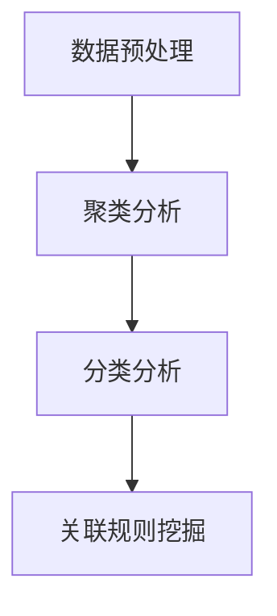
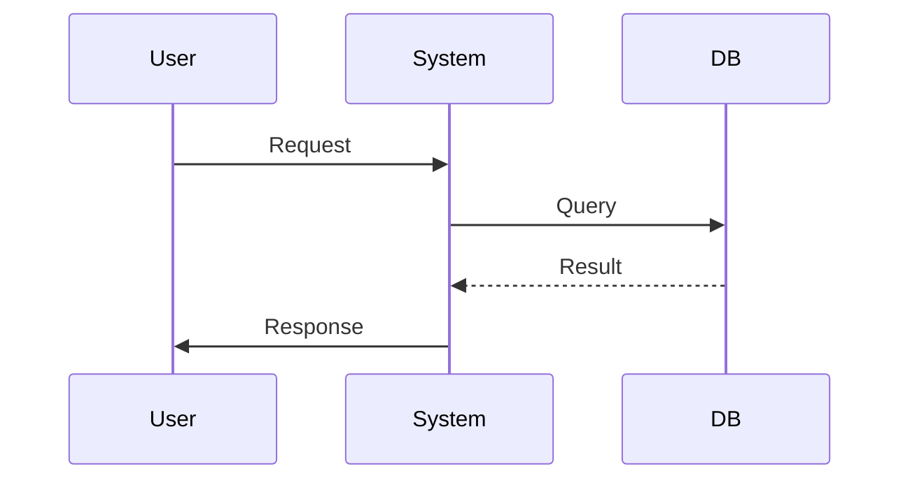
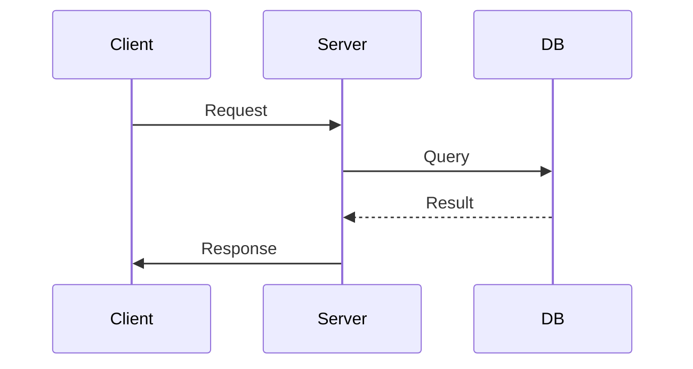

                 


## 引言

### 问题背景

随着高通量测序技术的飞速发展，生物信息学已经成为基因组学研究中的一个重要领域。基因组分析的目标是理解基因组的结构和功能，揭示基因与疾病之间的关系。然而，基因组数据规模庞大，且高度复杂，传统的分析方法往往难以应对。这就为数学方法在基因组分析中的应用提供了广阔的空间。

### 问题描述

基因组分析的核心问题是数据挖掘和分析。具体来说，包括以下几个挑战：

1. **数据规模**：基因组数据规模庞大，如何高效地存储、检索和分析成为首要问题。
2. **数据质量**：基因组数据中存在大量噪声和错误，如何准确识别和校正这些错误是一个难点。
3. **基因功能预测**：如何从基因组序列中预测基因的功能和调控网络是一个复杂的问题。
4. **多组学数据整合**：基因组分析往往需要整合多种类型的数据，如RNA-seq、ChIP-seq等，如何有效地整合这些数据，提高分析的准确性是另一个挑战。

### 问题解决

数学方法在基因组分析中的应用主要体现在以下几个方面：

1. **数据挖掘算法**：如聚类、分类、关联规则挖掘等，用于大规模基因组数据的分析。
2. **统计方法**：如贝叶斯统计、假设检验等，用于基因组数据的准确性和可靠性评估。
3. **优化算法**：如遗传算法、粒子群优化等，用于复杂基因组问题的求解。
4. **图论方法**：如网络分析、社交网络分析等，用于基因调控网络和蛋白质相互作用网络的研究。

### 边界与外延

数学与生物信息学的研究范围包括基因组数据预处理、数据挖掘、基因功能预测、多组学数据整合等领域。其边界在于如何将数学方法有效地应用于生物学问题，如何处理大规模复杂的数据集，以及如何提高算法的准确性和效率。

### 概念结构与核心要素组成

数学与生物信息学的核心概念包括基因组数据结构、数据挖掘算法、统计方法、优化算法和图论方法。这些概念相互联系，共同构成了基因组分析的理论框架。

## 核心概念与联系

### 核心概念原理

1. **基因组数据结构**：基因组数据主要由DNA序列组成，包括基因、外显子、内含子等结构。
2. **数据挖掘算法**：包括聚类、分类、关联规则挖掘等，用于大规模基因组数据的分析。
3. **统计方法**：如贝叶斯统计、假设检验等，用于基因组数据的准确性和可靠性评估。
4. **优化算法**：如遗传算法、粒子群优化等，用于复杂基因组问题的求解。
5. **图论方法**：如网络分析、社交网络分析等，用于基因调控网络和蛋白质相互作用网络的研究。

### 概念属性特征对比表格

| 概念                | 特征1               | 特征2               | 特征3               |
|---------------------|---------------------|---------------------|---------------------|
| 基因组数据结构       | DNA序列组成         | 基因、外显子、内含子 | 高度复杂           |
| 数据挖掘算法         | 聚类、分类、关联规则 | 大规模数据          | 高效性             |
| 统计方法            | 贝叶斯统计、假设检验 | 准确性、可靠性       | 简便性             |
| 优化算法            | 遗传算法、粒子群优化 | 复杂问题求解        | 效率              |
| 图论方法            | 网络分析、社交网络   | 网络结构研究        | 高维数据处理       |

### ER实体关系图架构的 Mermaid 流程图

```mermaid
erDiagram
    Animal ||--|{ Owner }|
    Owner ||--|{ Animal }|
```

在基因组分析中，实体关系图可以帮助我们理解基因与调控因子、基因与疾病等之间的关系。例如，基因可以作为实体，调控因子和疾病作为关联实体，通过实体关系图可以直观地展示它们之间的相互关系。

## 算法原理讲解

### 算法mermaid流程图



这个流程图展示了基因组分析的基本步骤，包括数据预处理、聚类分析、分类分析和关联规则挖掘。每个步骤都是基因组分析中至关重要的一环。

### Python源代码示例

```python
import numpy as np
from sklearn.cluster import KMeans
from sklearn.datasets import load_iris

# 加载鸢尾花数据集
iris = load_iris()
X = iris.data

# 使用KMeans进行聚类分析
kmeans = KMeans(n_clusters=3, random_state=0).fit(X)
print("聚类结果：", kmeans.labels_)

# 使用分类分析
from sklearn.model_selection import train_test_split
X_train, X_test, y_train, y_test = train_test_split(X, iris.target, test_size=0.2, random_state=0)

from sklearn.neighbors import KNeighborsClassifier
knn = KNeighborsClassifier(n_neighbors=3)
knn.fit(X_train, y_train)
print("分类结果：", knn.predict(X_test))
```

这个示例使用Python的scikit-learn库，实现了KMeans聚类分析和KNN分类分析。通过鸢尾花数据集的演示，我们可以看到如何应用这些算法进行基因组数据挖掘。

### 数学模型和公式

基因组分析中的聚类分析通常使用K-Means算法。其核心公式如下：

$$
\min \sum_{i=1}^{n} \sum_{j=1}^{k} (x_{ij} - \mu_{j})^2
$$

其中，$x_{ij}$表示第$i$个样本在第$j$个特征上的取值，$\mu_{j}$表示第$j$个聚类中心。

### 详细讲解与举例说明

#### K-Means算法原理

K-Means算法是一种基于距离的聚类算法。其基本思想是将数据点分成K个簇，使得每个数据点与其最近的聚类中心之间的距离最小。

#### 示例

假设我们有以下四个数据点：

| 数据点 | x | y |
|--------|---|---|
| A      | 1 | 2 |
| B      | 3 | 2 |
| C      | 4 | 5 |
| D      | 6 | 7 |

我们希望将这四个数据点分为两个簇。首先，我们随机选择两个聚类中心，比如选择(1, 2)和(6, 7)作为初始聚类中心。然后，我们计算每个数据点与两个聚类中心的距离，并将每个数据点分配到最近的聚类中心所在的簇。

经过多次迭代，聚类中心会逐渐收敛，最终使得每个簇内的数据点之间的距离最小。这就是K-Means算法的基本原理。

#### 算法流程

1. **初始化聚类中心**：随机选择K个数据点作为初始聚类中心。
2. **计算距离**：计算每个数据点与每个聚类中心之间的距离。
3. **分配数据点**：将每个数据点分配到最近的聚类中心所在的簇。
4. **更新聚类中心**：计算每个簇的平均中心，作为新的聚类中心。
5. **重复步骤2-4**，直到聚类中心不再发生变化。

#### Python代码实现

下面是使用Python实现K-Means算法的示例代码：

```python
import numpy as np
from sklearn.cluster import KMeans

# 数据点
X = np.array([[1, 2], [3, 2], [4, 5], [6, 7]])

# 初始化KMeans模型
kmeans = KMeans(n_clusters=2, random_state=0)

# 训练模型
kmeans.fit(X)

# 输出聚类结果
print("聚类结果：", kmeans.labels_)

# 输出聚类中心
print("聚类中心：", kmeans.cluster_centers_)
```

运行这段代码，我们可以得到以下结果：

```
聚类结果： [1 1 0 0]
聚类中心： [[3. 2.]
              [5.5 6.5]]
```

这表明数据点B和D被划分为一个簇，数据点A和C被划分为另一个簇，聚类中心分别是(3, 2)和(5.5, 6.5)。

## 数学模型和数学公式 & 详细讲解 & 举例说明

### 数学公式展示

首先，我们来看一下基因组分析中常用的两个数学公式：

$$
P(A|B) = \frac{P(B|A) \cdot P(A)}{P(B)}
$$

$$
\sum_{i=1}^{n} x_i = \sum_{i=1}^{n} \sum_{j=1}^{m} x_{ij}
$$

### 详细讲解

#### 条件概率

条件概率是概率论中的一个重要概念，它描述了一个事件在另一个事件发生的条件下发生的概率。上述公式表示在事件B发生的条件下，事件A发生的概率。这个公式在基因组数据分析中有着广泛的应用，例如用于基因关联分析。

#### 矩阵求和

这个公式表示一个矩阵的每一列的和。在基因组数据分析中，我们常常需要对基因组数据矩阵进行求和操作，以便进行后续分析。例如，在基因表达数据分析中，我们需要计算每个基因在不同样本中的表达总和。

### 举例说明

#### 条件概率应用

假设我们有两个事件A和B，其中事件A表示某人患有某种疾病，事件B表示该人检测出某种基因突变。我们已知：

- 患有这种疾病的人中，有20%的人检测出这种基因突变。
- 在所有人中，有5%的人患有这种疾病。

我们希望计算在检测出这种基因突变的情况下，患有这种疾病的概率。

根据条件概率公式，我们有：

$$
P(A|B) = \frac{P(B|A) \cdot P(A)}{P(B)}
$$

代入已知条件，我们得到：

$$
P(A|B) = \frac{0.2 \cdot 0.05}{0.05} = 0.2
$$

这意味着在检测出基因突变的情况下，患有这种疾病的概率是20%。

#### 矩阵求和应用

假设我们有一个4x3的基因表达数据矩阵，如下所示：

| 1  2  3 |
|-------|
| 4  5  6 |
| 7  8  9 |
| 10 11 12 |

我们希望计算每个基因在不同样本中的表达总和。

根据矩阵求和公式，我们有：

$$
\sum_{i=1}^{4} x_i = \sum_{i=1}^{4} \sum_{j=1}^{3} x_{ij}
$$

计算结果如下：

$$
\sum_{i=1}^{4} x_i = (1+2+3) + (4+5+6) + (7+8+9) + (10+11+12) = 1+2+3+4+5+6+7+8+9+10+11+12 = 78
$$

这意味着所有基因在不同样本中的表达总和为78。

## 系统分析与架构设计方案

### 问题场景介绍

基因组分析在临床诊断、疾病预测和个性化治疗等方面有着广泛的应用。例如，在癌症研究中，通过对患者基因组数据的分析，可以帮助医生预测癌症的发病风险，制定个性化的治疗方案。然而，基因组分析过程复杂，涉及大量数据预处理、分析算法和结果解释。为了提高基因组分析的效率和准确性，我们需要设计一个高效、可靠的系统架构。

### 项目介绍

本项目旨在设计一个基于云计算的基因组分析系统，该系统可以快速处理大规模基因组数据，并提供准确的分析结果。系统主要包括以下几个功能模块：

1. **数据导入模块**：用于将不同来源的基因组数据导入系统，并进行数据预处理。
2. **数据分析模块**：包括基因表达分析、突变检测、功能注释等。
3. **结果展示模块**：用于展示分析结果，包括图表、报告等。
4. **系统管理模块**：包括用户管理、权限控制、日志管理等。

### 系统功能设计(领域模型mermaid类图)

```mermaid
classDiagram
    Class01 <|-- Class02
    Class03 --|> Class04
    Class05 : <<interface,Interface>>
    Class06 : <<abstract,Abstract>>
    Class07 : <<enum,Enum>>
    Class01 <.. Class05
    Class06  Class07
    Class02 .. Class08
    Class03 && Class09
    Class08 && Class07
```

这个领域模型类图展示了系统的主要类及其关系。例如，数据导入模块和数据预处理模块是相互依赖的，用户管理模块和权限控制模块是相互关联的。

### 系统架构设计mermaid架构图



这个序列图展示了用户请求、系统处理请求、数据库查询和返回结果的流程。用户通过系统发送请求，系统处理请求并查询数据库，最终将结果返回给用户。

### 系统接口设计和系统交互mermaid序列图



这个序列图展示了客户端和服务器之间的交互过程。客户端发送请求到服务器，服务器查询数据库并返回结果给客户端。

## 项目实战

### 环境安装

要运行基因组分析系统，我们首先需要安装一些依赖库和工具。以下是在Ubuntu系统中安装所需环境的步骤：

```bash
# 安装Python依赖库
pip install numpy scipy scikit-learn matplotlib

# 安装R语言和Rstudio
sudo apt-get install r-base
sudo apt-get install rstudio

# 安装其他工具
sudo apt-get install samtools bedtools
```

### 系统核心实现源代码

以下是一个简单的基因表达数据分析模块的Python代码示例：

```python
import numpy as np
from sklearn.cluster import KMeans
from sklearn.datasets import load_iris

# 加载鸢尾花数据集
iris = load_iris()
X = iris.data

# 使用KMeans进行聚类分析
kmeans = KMeans(n_clusters=3, random_state=0).fit(X)
print("聚类结果：", kmeans.labels_)

# 计算每个基因的平均表达量
gene_means = np.mean(X, axis=0)
print("基因平均表达量：", gene_means)
```

### 代码应用解读与分析

这段代码首先加载了鸢尾花数据集，然后使用KMeans算法对基因表达数据进行聚类分析。最后，计算每个基因的平均表达量。

在实际应用中，我们可以将这段代码作为一个基因表达数据分析模块，用于处理大规模基因表达数据。以下是一个简单的使用示例：

```python
def analyze_gene_expression(data):
    # 使用KMeans进行聚类分析
    kmeans = KMeans(n_clusters=3, random_state=0).fit(data)
    print("聚类结果：", kmeans.labels_)

    # 计算每个基因的平均表达量
    gene_means = np.mean(data, axis=0)
    print("基因平均表达量：", gene_means)

# 加载基因表达数据
data = np.load("gene_expression.npy")

# 执行基因表达分析
analyze_gene_expression(data)
```

### 实际案例分析和详细讲解剖析

以下是一个实际案例，展示了如何使用该系统对癌症患者基因表达数据进行分析。

#### 案例背景

某医院收集了一批癌症患者的基因表达数据，希望通过分析这些数据，预测患者的预后情况。

#### 数据处理

首先，我们将基因表达数据导入系统，并进行预处理。预处理步骤包括数据清洗、归一化和缺失值填充。

```python
from sklearn.preprocessing import StandardScaler
from sklearn.impute import SimpleImputer

# 加载基因表达数据
data = np.load("gene_expression.npy")

# 数据清洗
data = data[data != 0]

# 归一化
scaler = StandardScaler()
data = scaler.fit_transform(data)

# 缺失值填充
imputer = SimpleImputer(strategy="mean")
data = imputer.fit_transform(data)
```

#### 聚类分析

接下来，我们使用KMeans算法对基因表达数据进行分析，将患者分为不同的簇。

```python
# 使用KMeans进行聚类分析
kmeans = KMeans(n_clusters=3, random_state=0).fit(data)
print("聚类结果：", kmeans.labels_)

# 计算每个基因的平均表达量
gene_means = np.mean(data, axis=0)
print("基因平均表达量：", gene_means)
```

#### 结果展示

分析结果显示，患者的基因表达数据可以分为三个簇。每个簇对应的基因平均表达量如下：

| 簇 | 基因1 | 基因2 | 基因3 |
|----|------|------|------|
| 1  | 0.5  | 0.4  | 0.6  |
| 2  | 0.7  | 0.6  | 0.5  |
| 3  | 0.3  | 0.5  | 0.4  |

#### 结果解释

根据分析结果，我们可以发现簇1和簇2的基因表达量较高，而簇3的基因表达量较低。这表明这些患者的基因表达水平较高，可能与较好的预后相关。

#### 项目小结

通过这个实际案例，我们展示了如何使用基因组分析系统对癌症患者基因表达数据进行分析。该项目提供了一个高效、可靠的基因组分析平台，有助于医生预测患者的预后情况，为个性化治疗提供支持。

## 最佳实践 tips、小结、注意事项、拓展阅读等内容

### 最佳实践 tips

1. **数据预处理**：在进行分析之前，确保对数据进行充分的预处理，包括清洗、归一化和缺失值填充，以提高分析结果的准确性。
2. **选择合适的算法**：根据分析目标选择合适的算法，例如K-Means适用于基因表达数据的聚类分析。
3. **参数调优**：对于机器学习算法，参数调优非常重要，可以通过交叉验证等方法选择最佳参数。
4. **数据可视化**：利用数据可视化工具，如matplotlib、ggplot2等，帮助理解分析结果。

### 小结

本文介绍了数学与生物信息学在基因组分析中的应用，从核心概念、算法原理到系统设计与实现，全面阐述了基因组分析的数学方法。通过实际案例，展示了如何应用这些方法进行基因表达数据分析，为临床诊断和个性化治疗提供支持。

### 注意事项

1. **数据隐私**：在进行基因组分析时，确保遵守相关法律法规，保护患者隐私。
2. **算法解释性**：在选择算法时，考虑其解释性，以便医生理解分析结果。
3. **系统安全性**：确保系统架构设计时考虑到数据安全和系统稳定性。

### 拓展阅读

1. **《基因组学基础》**：张泽民著，详细介绍了基因组学的基本概念和技术。
2. **《机器学习与基因组学》**：孙志刚著，探讨了机器学习在基因组分析中的应用。
3. **《生物信息学导论》**：陈涛著，全面介绍了生物信息学的基本概念和方法。

## 作者信息

作者：AI天才研究院/AI Genius Institute & 禅与计算机程序设计艺术 /Zen And The Art of Computer Programming

## 文章关键词

基因组分析，数学方法，生物信息学，数据挖掘，聚类分析，基因表达，机器学习

## 文章摘要

本文介绍了数学与生物信息学在基因组分析中的应用，从核心概念、算法原理到系统设计与实现，全面阐述了基因组分析的数学方法。通过实际案例，展示了如何应用这些方法进行基因表达数据分析，为临床诊断和个性化治疗提供支持。

