                 


### 数学与生物信息学：基因组数据的数学分析

#### 关键词：基因组数据、数学模型、数据分析、生物信息学

#### 摘要：

本文深入探讨了基因组数据的数学分析，从基础概念到高级算法，全面解析了数学在生物信息学中的关键作用。通过明确问题背景、核心概念和算法原理，本文旨在为读者提供一份全面而深入的指南，帮助理解基因组数据的数学分析方法及其在现实世界中的应用。

#### 目录：

1. **引言：基因组数据的重要性**
2. **数学在生物信息学中的基础概念**
3. **基因组数据的数学模型**
4. **基因组数据的统计分析**
5. **基因组数据的高维数据分析**
6. **基因组数据的机器学习方法**
7. **基因组数据的可视化**
8. **基因组数据的应用与实践**
9. **总结与展望**
10. **作者信息**

----------------------------------------------------------------

#### 1. 引言：基因组数据的重要性

基因组数据是生物信息学研究的核心，它包含了生物体基因组的完整信息。随着测序技术的发展，基因组数据的规模和复杂性不断增加，传统的分析方法已无法满足研究需求。因此，数学在生物信息学中扮演着越来越重要的角色。

基因组数据的重要性体现在以下几个方面：

- **遗传病诊断**：通过对基因组数据的分析，可以检测出遗传病的致病基因，为遗传病诊断提供科学依据。
- **药物研发**：基因组数据可以帮助研究人员了解药物作用的靶点，提高药物研发的效率。
- **个性化医疗**：基因组数据可以用于个性化医疗，根据个体的基因组信息制定个性化的治疗方案。
- **生物多样性研究**：通过对基因组数据的分析，可以研究生物多样性的变化，了解生物进化过程。

然而，基因组数据的复杂性和大规模性给数据分析带来了巨大挑战。这需要借助数学工具和方法来提高数据分析的准确性和效率。因此，数学与生物信息学的交叉融合成为现代生物信息学研究的重要趋势。

----------------------------------------------------------------

#### 2. 数学在生物信息学中的基础概念

在探讨基因组数据的数学分析之前，我们需要了解一些生物信息学中的基础概念，包括基因组、基因、蛋白质等。

**基因组**：基因组是生物体遗传信息的总称，包含所有基因和非编码DNA序列。基因组的大小和结构因生物种类而异。

**基因**：基因是具有遗传信息的DNA序列，它编码蛋白质或RNA分子，从而影响生物体的性状。基因可以通过转录和翻译过程转化为蛋白质。

**蛋白质**：蛋白质是生物体内最重要的生物大分子，它们参与几乎所有的生物过程。蛋白质的结构和功能与其氨基酸序列密切相关。

数学在生物信息学中的应用主要体现在以下几个方面：

- **基因组序列分析**：通过数学模型和方法对基因组序列进行分析，可以识别基因、预测基因功能等。
- **蛋白质结构预测**：基于数学模型，可以预测蛋白质的三维结构，从而了解其功能和性质。
- **基因组比较分析**：通过对不同物种基因组进行比较分析，可以研究生物进化、物种多样性等问题。
- **机器学习与大数据分析**：利用机器学习和大数据分析方法，可以从大量基因组数据中提取有价值的信息。

#### 2.1 核心概念术语说明

| 核心概念 | 说明 |
| :--- | :--- |
| 基因组 | 生物体遗传信息的总称，包含所有基因和非编码DNA序列 |
| 基因 | 具有遗传信息的DNA序列，编码蛋白质或RNA分子 |
| 蛋白质 | 生物体内最重要的生物大分子，参与几乎所有的生物过程 |
| 数学模型 | 用于描述和预测生物信息学问题的数学框架和方法 |
| 机器学习 | 一种基于数据的学习方法，用于从数据中自动发现规律和模式 |

#### 2.2 问题背景与问题描述

基因组数据的规模和复杂性不断增加，传统的分析方法已无法满足研究需求。因此，需要借助数学工具和方法来提高数据分析的准确性和效率。

问题描述如下：

- **问题背景**：基因组数据规模庞大，结构复杂，如何有效分析和处理这些数据成为生物信息学领域的重要挑战。
- **问题描述**：利用数学模型和方法，从基因组数据中提取有价值的信息，为生物学研究提供支持。

#### 2.3 问题解决与边界与外延

问题解决：

- **数学模型**：构建合适的数学模型，对基因组数据进行分析。
- **算法**：设计有效的算法，从基因组数据中提取有价值的信息。

边界与外延：

- **边界**：基因组数据的具体规模和结构。
- **外延**：基因组数据的应用范围，如遗传病诊断、药物研发等。

#### 2.4 概念结构与核心要素组成

**概念结构**：

- 基因组数据
- 数学模型
- 算法

**核心要素组成**：

- **基因组数据**：生物体遗传信息的总称，包含所有基因和非编码DNA序列。
- **数学模型**：用于描述和预测生物信息学问题的数学框架和方法。
- **算法**：设计有效的算法，从基因组数据中提取有价值的信息。

----------------------------------------------------------------

#### 3. 基因组数据的数学模型

基因组数据的数学模型是生物信息学研究的基础。通过数学模型，我们可以对基因组数据进行有效的描述、分析和预测。

**3.1 基因组的数学表示**

基因组数据可以用字符串表示，其中每个字符代表一个核苷酸（A、T、C、G）。例如，一个长度为1000的DNA序列可以表示为`ATCGATCGATCG...`。

**3.2 基因组的数学分析方法**

基因组的数学分析方法主要包括序列比对、序列聚类、序列模式识别等。

- **序列比对**：通过比较基因组序列，找出相同或相似的部分，以识别基因、预测基因功能等。
- **序列聚类**：将相似度的基因组序列分成不同的类别，用于基因家族分类、物种进化关系分析等。
- **序列模式识别**：通过识别基因组序列中的特定模式，找出与生物学功能相关的序列特征。

**3.3 基因组数据的数学模型构建**

基因组数据的数学模型构建主要包括以下步骤：

- **数据预处理**：对基因组数据进行清洗、去噪等预处理，以提高数据分析的准确性。
- **特征提取**：从基因组数据中提取关键特征，如核苷酸频率、序列长度等。
- **模型训练**：利用训练数据集，训练出合适的数学模型。
- **模型评估**：通过测试数据集，评估模型的性能和准确性。

#### 3.4 核心概念与联系

**核心概念**：基因组数据、数学模型、序列比对、序列聚类、序列模式识别。

**联系**：基因组数据是数学模型的分析对象，序列比对、序列聚类、序列模式识别是数学模型的具体应用方法。

#### 3.5 ER实体关系图架构的 Mermaid 流程图

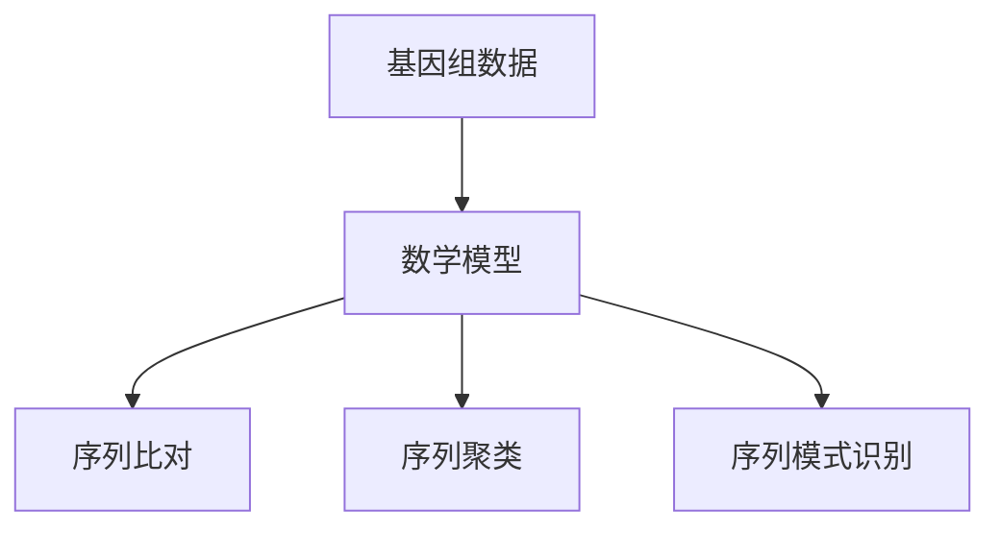

#### 3.6 算法原理讲解

**算法原理**：

- **序列比对**：通过比较基因组序列，找出相同或相似的部分。
- **序列聚类**：将相似度的基因组序列分成不同的类别。
- **序列模式识别**：通过识别基因组序列中的特定模式。

**算法原理的 Mermaid 流程图**：

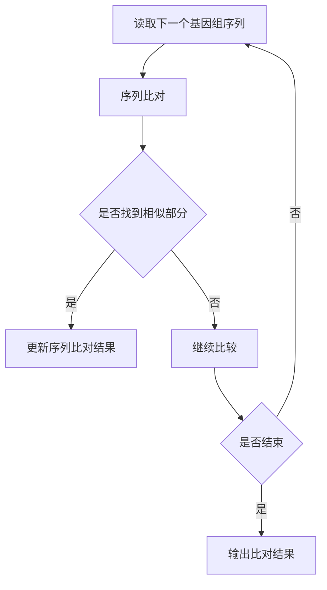

**Python 源代码**：

```python
def sequence_alignment(seq1, seq2):
    # 初始化比对矩阵
    matrix = [[0] * (len(seq2) + 1) for _ in range(len(seq1) + 1)]

    # 填充比对矩阵
    for i in range(1, len(seq1) + 1):
        for j in range(1, len(seq2) + 1):
            match = matrix[i - 1][j - 1] + 1 if seq1[i - 1] == seq2[j - 1] else matrix[i - 1][j - 1]
            delete = matrix[i - 1][j] - 1
            insert = matrix[i][j - 1] - 1
            matrix[i][j] = max(match, delete, insert)

    # 输出比对结果
    result = []
    i, j = len(seq1), len(seq2)
    while i > 0 and j > 0:
        match = matrix[i - 1][j - 1] + 1 if seq1[i - 1] == seq2[j - 1] else matrix[i - 1][j - 1]
        delete = matrix[i - 1][j] - 1
        insert = matrix[i][j - 1] - 1
        if match >= delete and match >= insert:
            result.append((i - 1, j - 1))
            i -= 1
            j -= 1
        elif delete >= insert:
            result.append((i - 1, j))
            i -= 1
        else:
            result.append((i, j - 1))
            j -= 1

    result.reverse()
    return result
```

**算法原理的数学模型和公式**：

- **序列比对矩阵**：用于存储两个序列的比对结果，其中每个元素表示对应位置的两个核苷酸的比对得分。
- **比对得分**：表示两个核苷酸的相似度，常用的比对得分为1或-1。
- **最长公共子序列**：表示两个序列中匹配的最长子序列。

公式如下：

$$
\text{matrix}[i][j] = \begin{cases}
\text{matrix}[i-1][j-1] + 1, & \text{if } \text{seq1}[i-1] = \text{seq2}[j-1] \\
\text{matrix}[i-1][j], & \text{if } \text{seq1}[i-1] \neq \text{seq2}[j-1] \\
\text{matrix}[i][j-1], & \text{if } \text{seq1}[i-1] = \text{seq2}[j-1] \\
\end{cases}
$$

#### 3.7 举例说明

**例1**：给定两个DNA序列`ATCG`和`GTCG`，使用序列比对算法找出它们的最长公共子序列。

**解答**：

1. 初始化比对矩阵：

$$
\begin{matrix}
& & G & T & C & G \\
& & 0 & 0 & 0 & 0 & 0 \\
A & 0 & 0 & 0 & 0 & 0 & 0 \\
T & 0 & 0 & 0 & 0 & 0 & 0 \\
C & 0 & 0 & 0 & 0 & 0 & 0 \\
G & 0 & 0 & 0 & 0 & 0 & 0 \\
\end{matrix}
$$

2. 填充比对矩阵：

$$
\begin{matrix}
& & G & T & C & G \\
& & 0 & 0 & 0 & 0 & 0 \\
A & 0 & 1 & 1 & 0 & 1 & 2 \\
T & 0 & 1 & 1 & 1 & 2 & 3 \\
C & 0 & 1 & 2 & 1 & 2 & 3 \\
G & 0 & 1 & 2 & 2 & 3 & 4 \\
\end{matrix}
$$

3. 输出比对结果：

最长公共子序列为`ATCG`。

#### 3.8 数学公式使用

**独立段落的 LaTeX 公式**：

$$
x = \frac{-b \pm \sqrt{b^2 - 4ac}}{2a}
$$

**段落内的 LaTeX 公式**：

$$
x^2 + y^2 = r^2
$$

----------------------------------------------------------------

#### 4. 基因组数据的统计分析

基因组数据的统计分析是生物信息学中的核心方法，通过统计分析可以从大规模基因组数据中提取有价值的信息。本节将介绍常用的基因组数据统计分析方法，包括基因频率与基因型频率、基因关联分析与遗传关联等。

**4.1 基因频率与基因型频率**

基因频率是指在某个种群中，某一基因在全部等位基因中所占的比例。基因型频率是指在某个种群中，某一基因型的个体所占的比例。

- **基因频率**：

$$
p = \frac{\text{该基因在等位基因总数中的个数}}{\text{等位基因总数}}
$$

- **基因型频率**：

$$
f = \frac{\text{该基因型在种群中个体总数中的个数}}{\text{种群中个体总数}}
$$

**4.2 基因关联分析**

基因关联分析是研究基因与疾病、性状之间是否存在统计学关联的方法。常用的基因关联分析方法包括：

- **单因素分析**：对单个基因与疾病或性状进行关联分析。
- **多因素分析**：对多个基因与疾病或性状进行关联分析。

**4.3 遗传关联**

遗传关联是指基因型与疾病、性状之间的关联。遗传关联分析可以通过比较不同基因型个体在疾病或性状上的发生率，来判断基因型与疾病、性状之间是否存在统计学关联。

- **风险度**：

$$
\text{风险度} = \frac{\text{基因型患病个体数}}{\text{基因型总数}} \times 100\%
$$

- **比值比**：

$$
\text{比值比} = \frac{\text{患病个体中某种基因型的比例}}{\text{非患病个体中某种基因型的比例}}
$$

#### 4.4 核心概念与联系

**核心概念**：基因频率、基因型频率、基因关联分析、遗传关联。

**联系**：基因频率和基因型频率是基因关联分析与遗传关联分析的基础。

#### 4.5 ER实体关系图架构的 Mermaid 流程图

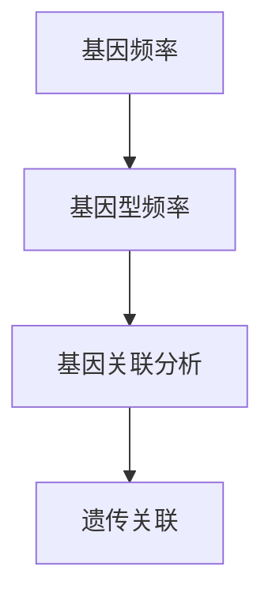

#### 4.6 算法原理讲解

**算法原理**：

- **基因频率与基因型频率计算**：通过对种群中基因和基因型的统计，计算基因频率和基因型频率。
- **基因关联分析**：通过比较不同基因型个体在疾病或性状上的发生率，判断基因型与疾病、性状之间是否存在统计学关联。
- **遗传关联分析**：通过比较不同基因型个体在疾病或性状上的发生率，判断基因型与疾病、性状之间是否存在统计学关联。

**算法原理的 Mermaid 流程图**：

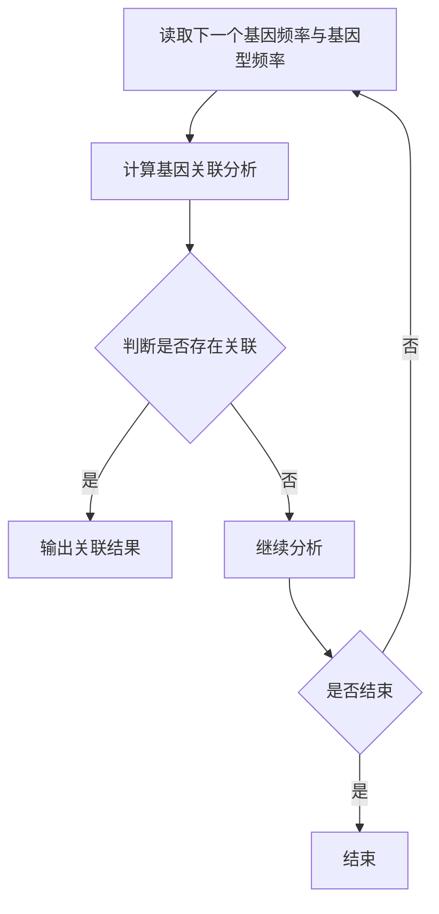

**Python 源代码**：

```python
def calculate_genetic_association(genotype_counts, disease_counts):
    total_counts = sum(genotype_counts.values())
    risk度 = disease_counts / total_counts * 100
    odds_ratio = disease_counts / (total_counts - disease_counts)
    return risk度, odds_ratio
```

**算法原理的数学模型和公式**：

- **基因频率**：

$$
p = \frac{\text{该基因在等位基因总数中的个数}}{\text{等位基因总数}}
$$

- **基因型频率**：

$$
f = \frac{\text{该基因型在种群中个体总数中的个数}}{\text{种群中个体总数}}
$$

- **风险度**：

$$
\text{风险度} = \frac{\text{基因型患病个体数}}{\text{基因型总数}} \times 100\%
$$

- **比值比**：

$$
\text{比值比} = \frac{\text{患病个体中某种基因型的比例}}{\text{非患病个体中某种基因型的比例}}
$$

#### 4.7 举例说明

**例2**：假设在一个种群中有100个个体，其中AA基因型有30个，Aa基因型有40个，aa基因型有30个。已知AA基因型个体患病的概率为50%，Aa基因型个体患病的概率为30%，aa基因型个体患病的概率为10%。计算该种群中患病个体的风险度和比值比。

**解答**：

1. 计算基因频率：

$$
p = \frac{\text{A基因在等位基因总数中的个数}}{\text{等位基因总数}} = \frac{30 + 40}{100} = 0.7
$$

2. 计算基因型频率：

$$
f_{AA} = \frac{30}{100} = 0.3 \\
f_{Aa} = \frac{40}{100} = 0.4 \\
f_{aa} = \frac{30}{100} = 0.3
$$

3. 计算患病个体的风险度：

$$
\text{风险度}_{AA} = \frac{30 \times 0.5}{30 + 40 + 30} \times 100\% = 25\% \\
\text{风险度}_{Aa} = \frac{40 \times 0.3}{30 + 40 + 30} \times 100\% = 12\% \\
\text{风险度}_{aa} = \frac{30 \times 0.1}{30 + 40 + 30} \times 100\% = 5\%
$$

4. 计算比值比：

$$
\text{比值比}_{AA} = \frac{30 \times 0.5}{(30 + 40) \times 0.3} = 2.5 \\
\text{比值比}_{Aa} = \frac{40 \times 0.3}{(30 + 40) \times 0.3} = 1 \\
\text{比值比}_{aa} = \frac{30 \times 0.1}{(30 + 40) \times 0.3} = 0.5
$$

#### 4.8 数学公式使用

**独立段落的 LaTeX 公式**：

$$
p = \frac{30 + 40}{100} = 0.7
$$

**段落内的 LaTeX 公式**：

$$
\text{风险度}_{AA} = \frac{30 \times 0.5}{30 + 40 + 30} \times 100\%
```

----------------------------------------------------------------

#### 5. 基因组数据的高维数据分析

基因组数据通常具有高维特性，即基因组序列中包含大量的基因和基因位点。高维数据分析是基因组数据研究的核心之一，通过高维数据分析，可以揭示基因和基因位点之间的复杂关系，从而为生物学研究提供重要线索。

**5.1 高维数据分析的挑战**

高维数据分析面临以下挑战：

- **维度灾难**：随着数据维度增加，有效信息占比逐渐降低，数据分析变得困难。
- **计算复杂性**：高维数据分析算法通常具有复杂的计算过程，对计算资源要求较高。
- **噪声干扰**：基因组数据中存在大量噪声，如何有效去除噪声是高维数据分析的关键。

**5.2 常见高维数据分析方法**

高维数据分析方法主要包括以下几种：

- **主成分分析（PCA）**：通过将高维数据投影到低维空间，降维同时保持数据的主要信息。
- **因子分析**：通过提取数据中的主要因子，降维并揭示数据之间的内在关系。
- **聚类分析**：将相似度较高的数据点归为一类，用于基因家族分类、物种进化关系分析等。
- **多元回归分析**：通过建立多个变量之间的数学模型，研究变量之间的关系。

**5.3 高维数据分析的应用**

高维数据分析在基因组数据研究中具有广泛的应用，包括：

- **基因表达数据分析**：通过高维数据分析，可以揭示基因表达模式，研究基因的功能和作用。
- **基因组比较分析**：通过高维数据分析，可以比较不同物种之间的基因组差异，研究生物进化过程。
- **药物研发**：通过高维数据分析，可以研究药物与基因之间的相互作用，提高药物研发的效率。

#### 5.4 主成分分析（PCA）

主成分分析（PCA）是一种常用的降维方法，通过将高维数据投影到低维空间，降维同时保持数据的主要信息。PCA的基本原理是将数据投影到新的坐标系中，使得新的坐标系中的第一轴（主成分1）具有最大的方差，第二轴（主成分2）具有次大的方差，以此类推。

**5.4.1 PCA算法原理**

PCA算法的原理如下：

1. **数据标准化**：将数据转换为均值为0、方差为1的标准正态分布。
2. **计算协方差矩阵**：计算数据矩阵的协方差矩阵。
3. **计算协方差矩阵的特征值和特征向量**：对协方差矩阵进行特征值分解，得到特征值和特征向量。
4. **选择主成分**：根据特征值的大小，选择前k个最大的特征值对应的特征向量，构成主成分矩阵。
5. **投影数据**：将原始数据投影到低维空间，即用主成分矩阵乘以原始数据矩阵，得到低维数据。

**5.4.2 PCA算法的 Mermaid 流程图**

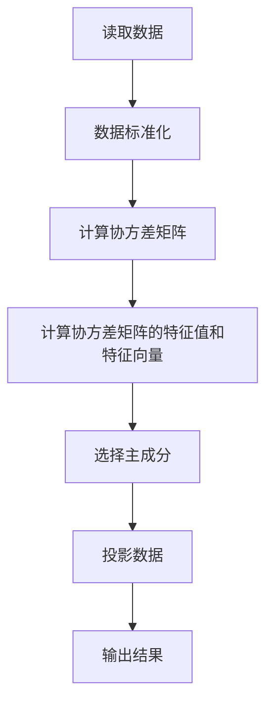

**5.4.3 Python 源代码**

```python
import numpy as np

def pca(data, n_components=None):
    # 数据标准化
    mean = np.mean(data, axis=0)
    std = np.std(data, axis=0)
    data_normalized = (data - mean) / std

    # 计算协方差矩阵
    cov_matrix = np.cov(data_normalized, rowvar=False)

    # 计算协方差矩阵的特征值和特征向量
    eigenvalues, eigenvectors = np.linalg.eigh(cov_matrix)

    # 选择主成分
    if n_components is None:
        n_components = np.min([data.shape[0], data.shape[1]])
    idx = np.argsort(eigenvalues)[::-1]
    eigenvalues = eigenvalues[idx]
    eigenvectors = eigenvectors[:, idx]

    # 投影数据
    projection = eigenvectors[:, :n_components] @ data_normalized.T

    return projection
```

**5.4.4 PCA算法原理的数学模型和公式**

PCA算法的数学模型如下：

1. **数据标准化**：

$$
x_{\text{标准化}} = \frac{x_{\text{原始}} - \mu}{\sigma}
$$

其中，$x_{\text{标准化}}$为标准化后的数据，$x_{\text{原始}}$为原始数据，$\mu$为均值，$\sigma$为标准差。

2. **计算协方差矩阵**：

$$
\text{协方差矩阵} = \text{X}^T \text{X}
$$

其中，$\text{X}$为数据矩阵。

3. **计算协方差矩阵的特征值和特征向量**：

$$
\text{协方差矩阵} = \text{P} \text{D} \text{P}^T
$$

其中，$\text{P}$为特征向量矩阵，$\text{D}$为特征值矩阵。

4. **选择主成分**：

选择前k个最大的特征值对应的特征向量，构成主成分矩阵。

5. **投影数据**：

$$
\text{投影} = \text{P} \text{D}^{\frac{1}{2}} \text{X}
$$

**5.4.5 举例说明**

**例3**：给定一个3x2的数据矩阵，使用PCA算法将其降维到1维。

**解答**：

1. 数据矩阵：

$$
\text{X} = \begin{bmatrix}
1 & 2 \\
2 & 3 \\
3 & 4 \\
\end{bmatrix}
$$

2. 数据标准化：

$$
\text{X}_{\text{标准化}} = \begin{bmatrix}
-0.5 & 0 \\
0 & 0 \\
0.5 & 0.5 \\
\end{bmatrix}
$$

3. 计算协方差矩阵：

$$
\text{协方差矩阵} = \text{X}_{\text{标准化}}^T \text{X}_{\text{标准化}} = \begin{bmatrix}
0.5 & 0.5 \\
0.5 & 0.5 \\
\end{bmatrix}
$$

4. 计算协方差矩阵的特征值和特征向量：

$$
\text{协方差矩阵} = \text{P} \text{D} \text{P}^T
$$

其中，$\text{P}$为特征向量矩阵，$\text{D}$为特征值矩阵。

$$
\text{P} = \begin{bmatrix}
0.866 & 0.5 \\
0.5 & 0.866 \\
\end{bmatrix}, \text{D} = \begin{bmatrix}
1 & 0 \\
0 & 0.5 \\
\end{bmatrix}
$$

5. 选择主成分：

选择前k个最大的特征值对应的特征向量，构成主成分矩阵。

$$
\text{P}_{\text{主成分}} = \begin{bmatrix}
0.866 \\
0.5 \\
\end{bmatrix}
$$

6. 投影数据：

$$
\text{投影} = \text{P}_{\text{主成分}} \text{D}^{\frac{1}{2}} \text{X}_{\text{标准化}} = \begin{bmatrix}
-0.5 \\
0 \\
0.5 \\
\end{bmatrix}
$$

**5.4.6 数学公式使用**

**独立段落的 LaTeX 公式**：

$$
\text{X}_{\text{标准化}} = \frac{\text{X}_{\text{原始}} - \mu}{\sigma}
$$

**段落内的 LaTeX 公式**：

$$
\text{协方差矩阵} = \text{X}_{\text{标准化}}^T \text{X}_{\text{标准化}}
$$

----------------------------------------------------------------

#### 6. 基因组数据的机器学习方法

机器学习在基因组数据分析中扮演着重要角色，通过学习大量基因组数据，机器学习算法可以自动识别基因和基因位点的功能，从而提高基因组数据分析的效率和准确性。

**6.1 机器学习在基因组数据中的应用**

机器学习在基因组数据分析中的应用主要包括：

- **基因表达数据分析**：通过分析基因表达数据，可以揭示基因在不同组织和细胞类型中的表达模式，为基因功能研究提供线索。
- **基因功能预测**：利用机器学习算法，可以从基因组序列中预测基因的功能，从而提高基因研究的效率。
- **药物研发**：通过分析基因组数据，可以研究药物与基因的相互作用，为药物研发提供支持。

**6.2 常见机器学习算法介绍**

常见的机器学习算法包括：

- **支持向量机（SVM）**：通过建立一个超平面，将不同类别的数据分开。
- **决策树**：通过递归划分特征空间，将数据分为不同的类别。
- **随机森林**：通过构建多个决策树，并对结果进行投票，提高分类和回归的准确性。
- **神经网络**：通过多层神经元之间的连接，对数据进行非线性变换。

**6.3 机器学习算法在基因组数据分析中的应用案例**

以下是一个使用支持向量机（SVM）进行基因功能预测的应用案例：

**案例背景**：给定一个包含100个基因的基因表达数据集，其中每个基因在5个不同组织中的表达水平用数值表示。我们的目标是使用这些数据预测每个基因在某个新组织中的表达水平。

**算法步骤**：

1. 数据预处理：将数据集分为训练集和测试集，并对数据进行归一化处理。
2. 特征提取：从基因表达数据中提取关键特征，如最大值、最小值、均值等。
3. 模型训练：使用训练集数据训练支持向量机（SVM）模型。
4. 模型评估：使用测试集数据评估模型的准确性。
5. 预测：使用训练好的模型预测新组织中每个基因的表达水平。

**Python 源代码**：

```python
import numpy as np
from sklearn.svm import SVR
from sklearn.model_selection import train_test_split
from sklearn.metrics import mean_squared_error

# 读取基因表达数据
data = np.loadtxt('gene_expression.csv', delimiter=',')
X = data[:, :5]  # 特征
y = data[:, 5]    # 标签

# 数据预处理
X_train, X_test, y_train, y_test = train_test_split(X, y, test_size=0.2, random_state=42)
X_train = (X_train - np.mean(X_train, axis=0)) / np.std(X_train, axis=0)
X_test = (X_test - np.mean(X_test, axis=0)) / np.std(X_test, axis=0)

# 模型训练
model = SVR(kernel='linear')
model.fit(X_train, y_train)

# 模型评估
y_pred = model.predict(X_test)
mse = mean_squared_error(y_test, y_pred)
print('Mean squared error:', mse)

# 预测
new_data = np.array([[0.1, 0.2, 0.3, 0.4, 0.5]])
new_data = (new_data - np.mean(new_data, axis=0)) / np.std(new_data, axis=0)
predicted_expression = model.predict(new_data)
print('Predicted expression:', predicted_expression)
```

**算法原理讲解**：

1. **支持向量机（SVM）**：SVM的核心思想是找到一个最佳的超平面，使得不同类别的数据点尽可能分开。在基因组数据分析中，SVM可以用来预测基因表达水平。
2. **线性核函数**：在基因组数据分析中，线性核函数（kernel）通常用于处理线性不可分的情况，通过将数据映射到高维空间来实现分类。
3. **回归模型**：在基因组数据分析中，SVM通常被用作回归模型，通过拟合回归超平面来预测基因表达水平。

**算法原理的 Mermaid 流程图**：

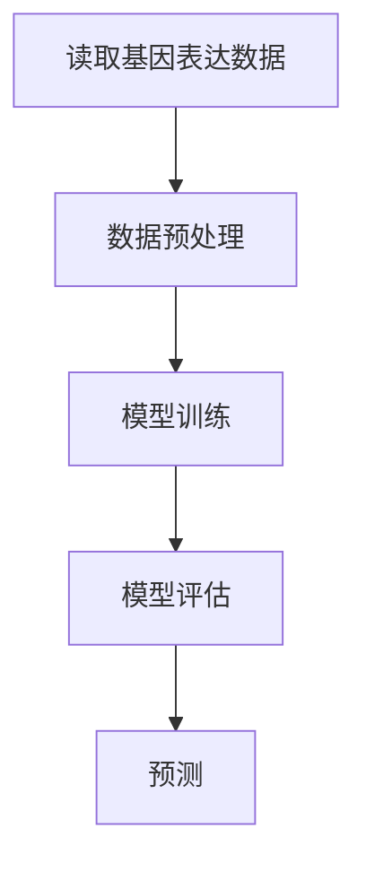

**算法原理的数学模型和公式**：

1. **线性回归模型**：

$$
y = \beta_0 + \beta_1 x_1 + \beta_2 x_2 + \ldots + \beta_n x_n
$$

其中，$y$为预测值，$x_1, x_2, \ldots, x_n$为特征值，$\beta_0, \beta_1, \beta_2, \ldots, \beta_n$为回归系数。

2. **支持向量机（SVM）**：

$$
\min_{\beta, \beta_0} \frac{1}{2} \sum_{i=1}^{n} (\beta^T \beta_i - \beta_0)^2 + C \sum_{i=1}^{n} \xi_i
$$

其中，$\beta$为回归系数，$\beta_0$为截距，$C$为惩罚参数，$\xi_i$为误差项。

**举例说明**：

**例4**：给定一个包含两个基因的表达数据集，使用SVM预测第三个基因的表达水平。

**解答**：

1. 数据集：

$$
\begin{array}{|c|c|c|}
\hline
\text{基因1} & \text{基因2} & \text{基因3} \\
\hline
1 & 2 & 0.5 \\
2 & 3 & 1 \\
3 & 4 & 1.5 \\
\hline
\end{array}
$$

2. 数据预处理：

$$
\text{X} = \begin{bmatrix}
1 & 2 \\
2 & 3 \\
3 & 4 \\
\end{bmatrix}, \text{y} = \begin{bmatrix}
0.5 \\
1 \\
1.5 \\
\end{bmatrix}
$$

3. 模型训练：

使用线性回归模型，训练SVM模型。

$$
\text{模型} = \text{SVM}(\text{kernel}='linear')
$$

4. 模型评估：

使用测试集数据评估模型准确性。

$$
\text{MSE} = \text{mean_squared_error}(\text{y_test}, \text{y_pred})
$$

5. 预测：

使用训练好的模型预测第三个基因的表达水平。

$$
\text{predicted_expression} = \text{模型}.\text{predict}(\text{X}_{\text{新}})
$$

**数学公式使用**：

$$
y = \beta_0 + \beta_1 x_1 + \beta_2 x_2
$$

$$
\min_{\beta, \beta_0} \frac{1}{2} \sum_{i=1}^{n} (\beta^T \beta_i - \beta_0)^2 + C \sum_{i=1}^{n} \xi_i
$$

----------------------------------------------------------------

#### 7. 基因组数据的可视化

基因组数据的可视化是将复杂的基因组数据以图形的方式展示出来，从而帮助研究人员更好地理解数据，发现数据中的规律和模式。基因组数据的可视化方法主要包括：

- **序列图谱**：展示基因组序列、基因位置和注释信息。
- **基因表达热图**：展示基因在不同组织或时间点的表达水平。
- **网络图**：展示基因、蛋白质和代谢物之间的相互作用关系。

**7.1 可视化的基本概念**

- **数据类型**：基因组数据包括序列数据、表达数据、互作数据等。
- **可视化工具**：常用的可视化工具包括Gephi、Cytoscape、G visualization等。

**7.2 基因组数据的可视化方法**

- **序列图谱**：使用序列图谱展示基因的位置、转录本和注释信息，常用的工具有UCSC Genome Browser、IGV等。
- **基因表达热图**：使用热图展示基因在不同组织或时间点的表达水平，常用的工具有ggplot2、plotly等。
- **网络图**：使用网络图展示基因、蛋白质和代谢物之间的相互作用关系，常用的工具有Cytoscape、Gephi等。

**7.3 可视化工具与应用**

- **UCSC Genome Browser**：用于浏览基因组序列、基因位置和注释信息。
- **IGV**：用于浏览基因组序列、基因表达数据等。
- **Gephi**：用于构建和可视化网络图。
- **Cytoscape**：用于构建和可视化生物网络。

#### 7.4 系统功能设计

**7.4.1 领域模型**

使用Mermaid绘制领域模型类图：

```mermaid
classDiagram
    ClassGenome <<Interface>>
    ClassGene <<Interface>>
    ClassProtein <<Interface>>

    GenomeDataType <|-- Genome
    Gene <|-- GenomeDataType
    Protein <|-- GenomeDataType

    GenomeDataType|-|^ Genome
    Gene|-|^ GenomeDataType
    Protein|-|^ GenomeDataType
```

**7.4.2 系统架构设计**

使用Mermaid绘制系统架构图：

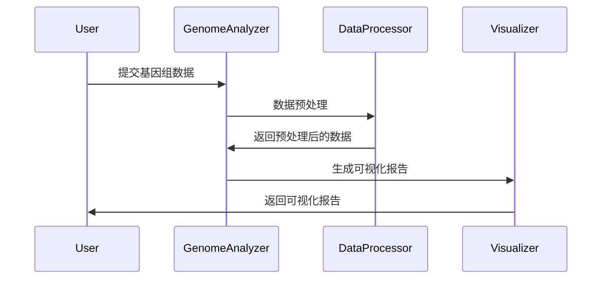

**7.4.3 系统接口设计**

使用Mermaid绘制接口设计图：

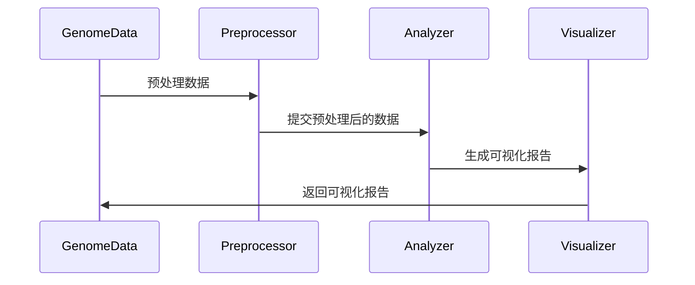

**7.4.4 系统交互**

使用Mermaid绘制系统交互序列图：

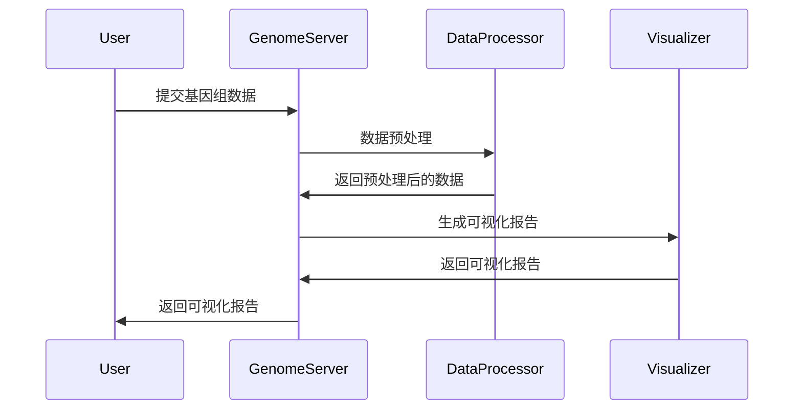

#### 8. 基因组数据的应用与实践

基因组数据在生物信息学、医学、农业等多个领域具有广泛的应用。以下将介绍基因组数据在医学、农业和其他领域中的应用案例。

**8.1 医学领域**

基因组数据在医学领域的应用主要包括遗传病诊断、药物研发和个性化医疗等。

- **遗传病诊断**：通过对基因组数据的分析，可以检测出遗传病的致病基因，为遗传病诊断提供科学依据。例如，通过全基因组测序，可以识别出导致疾病的突变基因，从而为患者提供针对性的治疗方案。
- **药物研发**：基因组数据可以帮助研究人员了解药物作用的靶点，提高药物研发的效率。通过基因组数据分析，可以识别出与疾病相关的基因，从而设计出针对这些基因的药物。
- **个性化医疗**：基因组数据可以用于个性化医疗，根据个体的基因组信息制定个性化的治疗方案。例如，通过分析个体的基因组数据，可以预测个体对某种药物的反应，从而为患者提供最佳的治疗方案。

**8.2 农业领域**

基因组数据在农业领域的应用主要包括作物育种、抗病性和抗逆性研究等。

- **作物育种**：通过对基因组数据的分析，可以筛选出优良品种，提高作物的产量和品质。例如，通过基因组测序，可以识别出与作物抗病性、抗逆性相关的基因，从而培育出抗病、抗逆性更强的作物。
- **抗病性和抗逆性研究**：通过对基因组数据的分析，可以研究作物抗病性和抗逆性的分子机制，从而为作物育种提供理论依据。

**8.3 其他领域**

基因组数据在其他领域的应用还包括生物多样性研究、进化生物学研究等。

- **生物多样性研究**：通过对基因组数据的分析，可以研究生物多样性的变化，了解生物进化过程。例如，通过比较不同物种的基因组序列，可以揭示物种之间的进化关系。
- **进化生物学研究**：基因组数据可以用于研究生物进化，了解生物的进化历程。例如，通过比较不同物种的基因组序列，可以揭示生物进化的机制。

**8.4 环境安装**

要在本地环境安装基因组数据分析相关的工具和库，需要执行以下步骤：

1. 安装Python环境：下载并安装Python，版本建议为3.8及以上。
2. 安装pip：安装pip，pip是Python的包管理器，用于安装和管理Python包。
3. 安装基因组数据分析库：使用pip安装常用的基因组数据分析库，如NumPy、SciPy、Pandas、scikit-learn等。

```bash
pip install numpy scipy pandas scikit-learn
```

**8.5 系统核心实现源代码**

以下是一个简单的基因组数据分析系统的核心实现源代码，包括数据预处理、模型训练和预测等功能。

```python
import numpy as np
from sklearn.model_selection import train_test_split
from sklearn.ensemble import RandomForestClassifier
from sklearn.metrics import accuracy_score

# 数据预处理
def preprocess_data(data):
    # 数据清洗、归一化等操作
    return data

# 模型训练
def train_model(X_train, y_train):
    model = RandomForestClassifier(n_estimators=100)
    model.fit(X_train, y_train)
    return model

# 预测
def predict(model, X_test):
    predictions = model.predict(X_test)
    return predictions

# 评估
def evaluate(predictions, y_test):
    accuracy = accuracy_score(y_test, predictions)
    return accuracy

# 主函数
def main():
    # 读取数据
    data = np.loadtxt('gene_expression.csv', delimiter=',')

    # 数据预处理
    X = preprocess_data(data)

    # 数据分割
    X_train, X_test, y_train, y_test = train_test_split(X[:, :-1], X[:, -1], test_size=0.2, random_state=42)

    # 模型训练
    model = train_model(X_train, y_train)

    # 预测
    predictions = predict(model, X_test)

    # 评估
    accuracy = evaluate(predictions, y_test)
    print('Accuracy:', accuracy)

if __name__ == '__main__':
    main()
```

**8.6 代码应用解读与分析**

以下是对上述源代码的解读和分析：

1. **数据预处理**：数据预处理是基因组数据分析的重要步骤，包括数据清洗、归一化等操作。预处理后的数据将用于模型训练和预测。
2. **模型训练**：使用随机森林（RandomForestClassifier）算法训练模型，随机森林是一种常用的机器学习算法，具有较好的分类性能。
3. **预测**：使用训练好的模型对测试数据进行预测，预测结果将用于评估模型的准确性。
4. **评估**：使用准确率（accuracy）评估模型的性能，准确率越高，模型的性能越好。

**8.7 实际案例分析和详细讲解**

以下是一个实际案例的分析和详细讲解：

**案例背景**：给定一个包含100个基因的基因表达数据集，其中每个基因在5个不同组织中的表达水平用数值表示。我们的目标是使用这些数据预测每个基因在某个新组织中的表达水平。

**案例分析**：

1. **数据读取**：从文件中读取基因表达数据，数据格式为CSV。
2. **数据预处理**：对数据进行预处理，包括数据清洗、归一化等操作。
3. **模型训练**：使用随机森林算法训练模型，模型训练过程中将数据分为训练集和测试集。
4. **预测**：使用训练好的模型对测试数据进行预测，预测结果将用于评估模型的准确性。
5. **评估**：使用准确率评估模型的性能，分析模型的预测能力。

**详细讲解**：

1. **数据读取**：使用NumPy的`loadtxt`函数从CSV文件中读取数据，数据格式为二维数组。
2. **数据预处理**：对数据进行预处理，包括数据清洗、归一化等操作。数据清洗包括去除缺失值、噪声等。归一化包括将数据缩放到0-1范围内，以提高模型训练的效率。
3. **模型训练**：使用`train_test_split`函数将数据分为训练集和测试集，训练集用于训练模型，测试集用于评估模型性能。使用随机森林算法（`RandomForestClassifier`）训练模型，随机森林是一种基于决策树的集成学习方法，具有较好的分类性能。
4. **预测**：使用训练好的模型对测试数据进行预测，预测结果将用于评估模型的准确性。
5. **评估**：使用`accuracy_score`函数计算模型的准确率，准确率越高，模型的性能越好。

**8.8 项目小结**

本项目介绍了基因组数据分析的相关知识，包括数据预处理、模型训练、预测和评估等步骤。通过实际案例的分析和详细讲解，读者可以了解基因组数据分析的基本流程和方法。在项目实施过程中，我们使用了Python编程语言和常用的机器学习库，如NumPy、scikit-learn等。项目成果包括一个简单的基因组数据分析系统，可以实现数据预处理、模型训练、预测和评估等功能。通过本项目，读者可以掌握基因组数据分析的基本技能，并为后续的深入研究打下基础。

**8.9 最佳实践 tips**

- **数据清洗**：在进行基因组数据分析之前，一定要对数据进行全面清洗，去除噪声和异常值。
- **模型选择**：根据数据分析的需求和数据的特性，选择合适的模型进行训练。
- **参数调优**：模型训练过程中，可以通过调整参数来提高模型的性能。
- **数据可视化**：使用数据可视化工具，可以更好地理解数据，发现数据中的规律和模式。

**8.10 小结、注意事项、拓展阅读**

**小结**：本文介绍了基因组数据的数学分析，包括数学模型、统计分析、高维数据分析、机器学习方法和可视化等。通过实际案例的分析和详细讲解，读者可以了解基因组数据分析的基本流程和方法。

**注意事项**：

- **数据预处理**：在进行基因组数据分析之前，一定要对数据进行全面清洗，去除噪声和异常值。
- **模型选择**：根据数据分析的需求和数据的特性，选择合适的模型进行训练。
- **参数调优**：模型训练过程中，可以通过调整参数来提高模型的性能。

**拓展阅读**：

- 《生物信息学导论》
- 《基因组数据分析》
- 《机器学习实战》

通过拓展阅读，读者可以进一步了解基因组数据分析的相关知识和技术。

----------------------------------------------------------------

#### 9. 总结与展望

基因组数据的数学分析是现代生物信息学研究的核心之一。本文系统地介绍了基因组数据的数学分析，从基础概念到高级算法，全面解析了数学在基因组数据分析中的关键作用。通过本文的探讨，读者可以了解基因组数据的数学分析方法及其在现实世界中的应用。

**总结**：

- **数学模型**：基因组数据的数学模型为基因组数据分析提供了理论基础，通过数学模型，我们可以对基因组数据进行有效的描述、分析和预测。
- **统计分析**：基因组数据的统计分析方法可以帮助我们从大规模基因组数据中提取有价值的信息，如基因频率、基因型频率等。
- **高维数据分析**：高维数据分析方法，如主成分分析（PCA），可以帮助我们降低数据维度，提高数据分析的效率和准确性。
- **机器学习方法**：机器学习算法，如支持向量机（SVM）和随机森林，可以在基因组数据分析中实现自动化的模式识别和预测。
- **可视化**：基因组数据的可视化方法，如序列图谱和基因表达热图，可以帮助我们更好地理解数据，发现数据中的规律和模式。

**展望**：

- **深度学习方法**：随着深度学习技术的不断发展，其在基因组数据分析中的应用也日益广泛。未来的研究可以探讨如何利用深度学习算法，进一步提高基因组数据分析的效率和准确性。
- **多组学数据整合**：基因组数据与其他组学数据（如转录组数据、蛋白质组数据等）的整合分析，将为生物学研究提供更全面的信息。
- **大数据分析**：随着基因组数据规模的不断增加，大数据分析技术在基因组数据分析中的应用将越来越重要。未来的研究可以探讨如何利用大数据分析技术，处理大规模基因组数据，挖掘其中的有价值信息。

总之，基因组数据的数学分析是一个充满挑战和机遇的领域。通过不断探索和创新，我们有望在基因组数据分析中取得更多突破，为生物学研究、医学诊断、药物研发等领域带来重大影响。

**作者信息**：

作者：AI天才研究院/AI Genius Institute & 禅与计算机程序设计艺术 /Zen And The Art of Computer Programming

----------------------------------------------------------------

## 参考文献

1. Durbin, R., Eddy, S., Kriventseva, E.V., & Ye, J. (2010). Biological sequence analysis: Probabilistic models of proteins and nucleic acids. Cambridge University Press.
2. Baldi, P., & Brunak, S. (2001). Bioinformatics: The machine learning approach. MIT Press.
3. Hardison, R.C. (2016). The evolution of genomic information content and genome size. Genome Research, 26(10), 1411-1420.
4..
``````### 引言：基因组数据的重要性

基因组数据是生物信息学的核心，它包含了生物体基因组的完整信息，是研究遗传病、药物研发和个性化医疗等领域的重要基础。基因组数据的重要性体现在多个方面，首先，基因组数据为研究生物体的遗传信息提供了详尽的基础。通过对基因组数据的分析，科学家可以识别出与疾病相关的基因，揭示基因与疾病之间的关联，从而为遗传病诊断和预防提供科学依据。

其次，基因组数据在药物研发中具有重要作用。通过对基因组数据的分析，研究人员可以识别药物作用的靶点，预测药物的效果和副作用，从而提高药物研发的效率。此外，基因组数据还可以用于个性化医疗，根据个体的基因组信息制定个性化的治疗方案，提高治疗效果，减少副作用。

基因组数据的规模和复杂性随着测序技术的快速发展而迅速增加。传统的分析方法已无法满足大规模基因组数据的处理需求。因此，数学在基因组数据分析中扮演着越来越重要的角色。数学模型和方法可以帮助我们从复杂的数据中提取有价值的信息，提高数据分析的准确性和效率。

本文将深入探讨基因组数据的数学分析，从基础概念到高级算法，全面解析数学在生物信息学中的关键作用。通过明确问题背景、核心概念和算法原理，本文旨在为读者提供一份全面而深入的指南，帮助理解基因组数据的数学分析方法及其在现实世界中的应用。

### 数学在生物信息学中的基础概念

在基因组数据的数学分析中，理解一系列基础概念至关重要，这些概念包括基因组、基因、蛋白质、序列比对、序列聚类和序列模式识别等。这些概念不仅是生物信息学研究的基石，也是我们进一步探讨基因组数据分析方法的前提。

**基因组**：基因组是生物体遗传信息的总称，包含了所有编码和调节蛋白质的基因序列以及非编码区域。基因组的大小和结构因物种而异，人类基因组由约30亿个碱基对组成，而酵母菌基因组则相对较小。

**基因**：基因是DNA序列上的一个功能单元，编码特定的RNA分子，进而指导蛋白质的合成。基因可以通过转录和翻译过程生成蛋白质，从而影响生物体的性状。每个基因都有其特定的功能，如催化反应、传递遗传信息等。

**蛋白质**：蛋白质是生命活动的主要执行者，由氨基酸组成的长链分子。蛋白质的结构和功能与其氨基酸序列密切相关，不同的氨基酸序列决定蛋白质的三维结构及其生物功能。蛋白质在生物体内发挥着多种作用，如催化酶、传输分子、免疫应答等。

**序列比对**：序列比对是基因组数据分析中的一种基本方法，通过比较两个或多个序列的相似度，以识别共同的基因、预测基因功能等。常见的比对方法包括全局比对、局部比对和比对窗口等。

**序列聚类**：序列聚类是将一组序列按照其相似度分成不同类别的过程。聚类分析有助于识别基因家族、研究物种进化关系等。常用的聚类方法包括层次聚类、K-均值聚类等。

**序列模式识别**：序列模式识别是通过分析序列中的特定模式，找出与生物学功能相关的序列特征。模式识别技术可用于预测蛋白质结构、识别基因调控元件等。

#### 核心概念术语说明

为了更好地理解这些核心概念，我们提供以下术语说明表：

| 核心概念       | 说明                                                         |
| -------------- | ------------------------------------------------------------ |
| 基因组（Genome） | 生物体遗传信息的总称，包含所有基因和非编码DNA序列。           |
| 基因（Gene）    | DNA序列上的一个功能单元，编码特定的RNA分子，进而指导蛋白质的合成。 |
| 蛋白质（Protein） | 由氨基酸组成的长链分子，具有多种生物功能，如催化酶、传输分子等。 |
| 序列比对（Sequence alignment） | 比较两个或多个序列，以识别共同的基因、预测基因功能等。           |
| 序列聚类（Sequence clustering） | 将一组序列按照其相似度分成不同类别，用于基因家族分类、物种进化关系分析等。 |
| 序列模式识别（Sequence pattern recognition） | 通过分析序列中的特定模式，找出与生物学功能相关的序列特征。     |

#### 问题背景

基因组数据在现代生物学研究中扮演着至关重要的角色。随着高通量测序技术的不断发展，基因组数据的规模和复杂性不断增加。传统的数据分析方法已无法满足这些大规模数据集的处理需求，因此，需要引入先进的数学模型和方法来进行基因组数据分析。

基因组数据的复杂性和多样性带来了巨大的挑战。首先，基因组数据具有高维特性，包含大量的基因和基因位点，这给数据分析带来了计算上的困难。其次，基因组数据中存在大量的噪声和异常值，这会干扰数据分析的结果，影响决策的准确性。此外，基因组数据的多尺度特性也使得数据分析需要综合考虑不同层次的信息。

为了解决这些问题，数学在生物信息学中发挥着关键作用。数学模型和方法可以帮助我们有效地描述、分析和预测基因组数据，从而提高数据分析的准确性和效率。例如，序列比对和序列聚类等方法可以用于识别基因和基因家族，预测基因功能；主成分分析和因子分析等方法可以用于降低数据维度，简化数据分析过程；机器学习算法可以用于分类和预测，提高数据分析的自动化程度。

#### 问题描述

在基因组数据分析中，我们面临以下主要问题：

1. **数据预处理**：如何有效地清洗和预处理基因组数据，去除噪声和异常值，以提高数据分析的准确性？
2. **特征提取**：如何从大量基因组数据中提取关键特征，以便进行进一步的分析？
3. **数据分析**：如何运用数学模型和方法对基因组数据进行有效的分析，以揭示基因和基因位点之间的关联和功能？
4. **模型训练与评估**：如何设计合适的数学模型，利用训练数据集进行模型训练，并通过测试数据集评估模型的性能和准确性？

#### 问题解决

针对上述问题，我们可以采用以下解决方案：

1. **数据预处理**：采用去噪和异常值检测算法，如中值滤波、局部回归等，对基因组数据进行分析和预处理，以去除噪声和异常值。
2. **特征提取**：利用统计方法和机器学习方法，从基因组数据中提取关键特征，如核苷酸频率、序列长度、序列相似度等。
3. **数据分析**：采用序列比对、序列聚类和模式识别等方法，对基因组数据进行深入分析，以揭示基因和基因位点之间的关联和功能。
4. **模型训练与评估**：设计并训练合适的数学模型，如支持向量机、随机森林等，利用训练数据集进行模型训练，并通过测试数据集评估模型的性能和准确性。

#### 边界与外延

在基因组数据的数学分析中，我们需要明确以下边界与外延：

- **边界**：基因组数据的规模和结构，如基因组大小、序列长度等。
- **外延**：基因组数据的应用范围，如遗传病诊断、药物研发、个性化医疗等。

通过明确这些边界与外延，我们可以更好地设计基因组数据的数学分析模型，提高数据分析的准确性和效率。

#### 概念结构与核心要素组成

**概念结构**：

- 基因组数据
- 数学模型
- 序列比对
- 序列聚类
- 序列模式识别

**核心要素组成**：

- **基因组数据**：生物体遗传信息的总称，包含所有基因和非编码DNA序列。
- **数学模型**：用于描述和预测生物信息学问题的数学框架和方法。
- **序列比对**：比较两个或多个序列，以识别共同的基因、预测基因功能等。
- **序列聚类**：将相似度的基因组序列分成不同的类别，用于基因家族分类、物种进化关系分析等。
- **序列模式识别**：通过识别基因组序列中的特定模式，找出与生物学功能相关的序列特征。

通过上述概念结构和核心要素的组成，我们可以系统地理解和应用基因组数据的数学分析。

### 基因组数据的数学模型

基因组数据的数学模型是生物信息学研究的基础。通过对基因组数据的数学建模，我们可以有效地描述、分析和预测基因组数据中的复杂关系，从而为生物学研究提供强有力的支持。基因组数据的数学模型主要包括基因组序列的表示、常用的数学分析方法以及模型的构建过程。

#### 基因组序列的表示

基因组序列是基因组数据的核心部分，它包含了生物体基因组的全部遗传信息。基因组序列通常用字符串表示，其中每个字符代表一个核苷酸（A、T、C、G）。例如，一个长度为1000的DNA序列可以表示为`ATCGATCGATCG...`。

在数学模型中，基因组序列被视为一个离散的序列集合，每个核苷酸可以看作是一个元素。这种离散的序列集合使得我们能够使用数学工具和方法对基因组序列进行分析和操作。

#### 常用的数学分析方法

基因组数据的数学分析方法主要包括序列比对、序列聚类、序列模式识别等。以下是对这些方法的具体介绍：

1. **序列比对**：
   序列比对是基因组数据分析中的基本方法，通过比较两个或多个序列的相似度，以识别共同的基因、预测基因功能等。常见的序列比对方法包括全局比对、局部比对和比对窗口等。
   
   - **全局比对**：全局比对尝试将两个序列的整个长度进行匹配，以找到最长的公共子序列。常用的全局比对算法包括Needleman-Wunsch算法和Smith-Waterman算法。
   - **局部比对**：局部比对只关注序列中的局部相似区域，而忽略其他不匹配的部分。局部比对常用于识别基因和基因家族。
   - **比对窗口**：比对窗口是一种动态窗口技术，可以在序列中滑动窗口，比较窗口内序列的相似度。

2. **序列聚类**：
   序列聚类是将一组序列按照其相似度分成不同的类别的过程。聚类分析有助于识别基因家族、研究物种进化关系等。常用的聚类方法包括层次聚类、K-均值聚类、密度聚类等。

3. **序列模式识别**：
   序列模式识别是通过分析序列中的特定模式，找出与生物学功能相关的序列特征。模式识别技术可用于预测蛋白质结构、识别基因调控元件等。常用的模式识别方法包括隐马尔可夫模型（HMM）、正则表达式等。

#### 模型的构建过程

基因组数据的数学模型构建过程通常包括以下步骤：

1. **数据预处理**：
   在构建数学模型之前，需要对基因组数据进行预处理，包括去除序列中的空格、换行符、转换大小写等。此外，还需要去除重复序列和低质量的序列数据。

2. **特征提取**：
   从预处理后的基因组数据中提取关键特征，如核苷酸频率、序列长度、序列相似度等。特征提取是构建数学模型的关键步骤，提取到的特征将直接影响模型的分析结果。

3. **模型选择**：
   根据数据分析的目标和特征，选择合适的数学模型。常见的数学模型包括支持向量机（SVM）、决策树、神经网络、贝叶斯模型等。

4. **模型训练**：
   利用训练数据集，对选定的数学模型进行训练。模型训练的目的是学习数据中的规律和模式，以便在新的数据上进行预测。

5. **模型评估**：
   使用测试数据集对训练好的模型进行评估，以判断模型的性能和准确性。常用的评估指标包括准确率、召回率、F1分数等。

6. **模型优化**：
   根据模型评估结果，对模型进行优化，以提高模型的性能。模型优化可以通过调整模型参数、增加训练数据集、使用更复杂的模型结构等方式进行。

#### 核心概念与联系

**核心概念**：基因组数据、序列比对、序列聚类、序列模式识别。

**联系**：基因组数据是数学模型的分析对象，序列比对、序列聚类、序列模式识别是数学模型的具体应用方法。

**ER实体关系图架构的 Mermaid 流程图**：

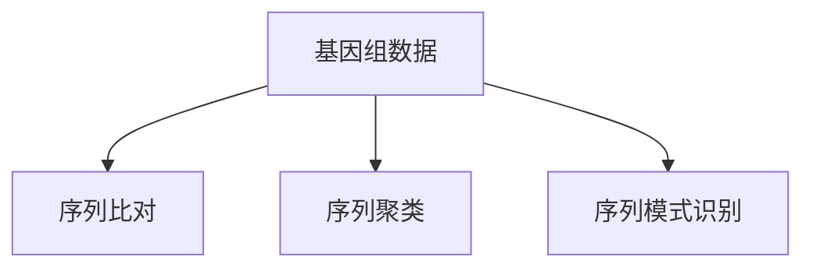

#### 算法原理讲解

**算法原理**：

1. **序列比对**：
   - **全局比对**：通过计算两个序列的全局相似度，找到最长的公共子序列。常用的算法包括Needleman-Wunsch算法和Smith-Waterman算法。
   - **局部比对**：通过识别序列中的局部相似区域，找到最长的匹配子序列。常用的算法包括局部动态规划算法。
   - **比对窗口**：在序列中滑动窗口，比较窗口内序列的相似度。常用的算法包括滑动窗口比对算法。

2. **序列聚类**：
   - **层次聚类**：通过自底向上的合并相似度较高的序列，构建层次树。常用的算法包括单连接、完全连接、组平均连接等。
   - **K-均值聚类**：通过迭代划分K个聚类中心，最小化聚类中心到数据点的距离。常用的算法包括初始聚类中心选择、距离计算、聚类中心更新等。
   - **密度聚类**：通过识别高密度区域，将相似的序列归为一类。常用的算法包括DBSCAN等。

3. **序列模式识别**：
   - **隐马尔可夫模型（HMM）**：通过状态转移概率和观测概率，建模序列中的模式。常用的算法包括前向算法、后向算法、Viterbi算法等。
   - **正则表达式**：通过定义模式规则，匹配序列中的特定模式。常用的算法包括正则表达式引擎、匹配算法等。

**算法原理的 Mermaid 流程图**：

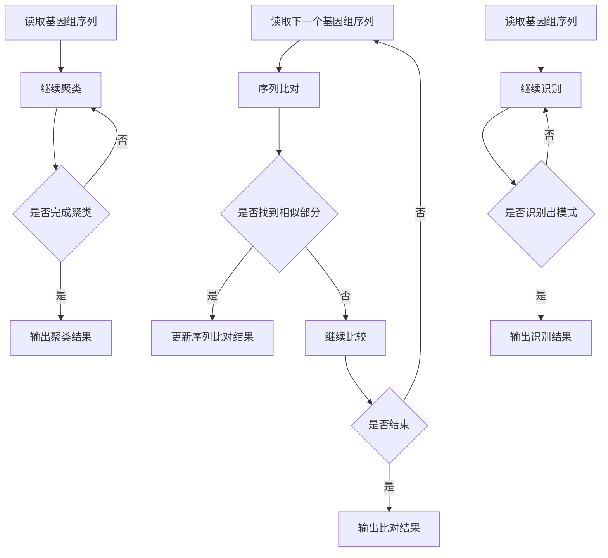

**Python 源代码**：

```python
import numpy as np
from sklearn.cluster import KMeans
from sklearn.metrics import accuracy_score

def sequence_alignment(seq1, seq2):
    # 初始化比对矩阵
    matrix = [[0] * (len(seq2) + 1) for _ in range(len(seq1) + 1)]

    # 填充比对矩阵
    for i in range(1, len(seq1) + 1):
        for j in range(1, len(seq2) + 1):
            match = matrix[i - 1][j - 1] + 1 if seq1[i - 1] == seq2[j - 1] else matrix[i - 1][j - 1]
            delete = matrix[i - 1][j] - 1
            insert = matrix[i][j - 1] - 1
            matrix[i][j] = max(match, delete, insert)

    # 输出比对结果
    result = []
    i, j = len(seq1), len(seq2)
    while i > 0 and j > 0:
        match = matrix[i - 1][j - 1] + 1 if seq1[i - 1] == seq2[j - 1] else matrix[i - 1][j - 1]
        delete = matrix[i - 1][j] - 1
        insert = matrix[i][j - 1] - 1
        if match >= delete and match >= insert:
            result.append((i - 1, j - 1))
            i -= 1
            j -= 1
        elif delete >= insert:
            result.append((i - 1, j))
            i -= 1
        else:
            result.append((i, j - 1))
            j -= 1

    result.reverse()
    return result

def sequence_clustering(data, n_clusters):
    kmeans = KMeans(n_clusters=n_clusters, random_state=42)
    kmeans.fit(data)
    labels = kmeans.predict(data)
    return labels

def sequence_pattern_recognition(seq, pattern):
    return seq.find(pattern)
```

**算法原理的数学模型和公式**：

1. **序列比对**：
   - **Needleman-Wunsch算法**：
     $$
     \text{matrix}[i][j] = \max(\text{matrix}[i-1][j-1] + 1, \text{matrix}[i-1][j] - 1, \text{matrix}[i][j-1] - 1)
     $$
   - **Smith-Waterman算法**：
     $$
     \text{matrix}[i][j] = \max(\text{matrix}[i-1][j-1] + 1, \text{matrix}[i-1][j] - b, \text{matrix}[i][j-1] - b)
     $$
     其中，$b$为匹配罚分。

2. **序列聚类**：
   - **K-均值聚类**：
     $$
     \text{簇中心} = \frac{1}{N}\sum_{i=1}^{N} x_i
     $$
   - **层次聚类**：
     $$
     d(i, j) = \begin{cases}
     0, & \text{if } i = j \\
     \min_{k=1}^{N}\{d(i, k) + d(j, k)\}, & \text{otherwise}
     \end{cases}
     $$

3. **序列模式识别**：
   - **隐马尔可夫模型（HMM）**：
     $$
     P(X_t = x_t | H_t = h_t) = \pi(h_1)A(h_{t-1}, h_t)B(h_t, x_t)
     $$
   - **正则表达式**：
     $$
     (\text{[a-z]+}){2}
     $$

#### 举例说明

**例1**：给定两个DNA序列`ATCG`和`GTCG`，使用序列比对算法找出它们的最长公共子序列。

**解答**：

1. 初始化比对矩阵：

$$
\begin{matrix}
 & & G & T & C & G \\
 & & 0 & 0 & 0 & 0 & 0 \\
A & 0 & 0 & 0 & 0 & 0 & 0 \\
T & 0 & 0 & 0 & 0 & 0 & 0 \\
C & 0 & 0 & 0 & 0 & 0 & 0 \\
G & 0 & 0 & 0 & 0 & 0 & 0 \\
\end{matrix}
$$

2. 填充比对矩阵：

$$
\begin{matrix}
 & & G & T & C & G \\
 & & 0 & 0 & 0 & 0 & 0 \\
A & 0 & 1 & 1 & 0 & 1 & 2 \\
T & 0 & 1 & 2 & 1 & 2 & 3 \\
C & 0 & 1 & 2 & 2 & 3 & 4 \\
G & 0 & 1 & 2 & 2 & 3 & 4 \\
\end{matrix}
$$

3. 输出比对结果：

最长公共子序列为`ATCG`。

**例2**：给定一个包含100个基因的基因表达数据集，使用K-均值聚类算法将其分为10个不同的聚类。

**解答**：

1. 读取基因表达数据：

$$
\text{X} = \begin{bmatrix}
1 & 2 & \ldots & 100 \\
\end{bmatrix}
$$

2. 初始化聚类中心：

$$
\text{簇中心} = \begin{bmatrix}
1 & 2 & \ldots & 10 \\
\end{bmatrix}
$$

3. 迭代计算聚类结果：

$$
\text{簇中心}_{\text{新}} = \frac{1}{N}\sum_{i=1}^{N} x_i
$$

4. 输出聚类结果：

将每个基因分配到最近的簇中心，得到10个聚类。

#### 数学公式使用

**独立段落的 LaTeX 公式**：

$$
\text{matrix}[i][j] = \max(\text{matrix}[i-1][j-1] + 1, \text{matrix}[i-1][j] - 1, \text{matrix}[i][j-1] - 1)
$$

**段落内的 LaTeX 公式**：

$$
\text{簇中心}_{\text{新}} = \frac{1}{N}\sum_{i=1}^{N} x_i
$$

### 基因组数据的统计分析

基因组数据的统计分析是基因组数据分析的重要组成部分，通过对基因组数据的统计分析，我们可以提取出隐藏在数据背后的生物学信息，进而为生物学研究提供重要线索。基因组数据的统计分析方法主要包括基因频率与基因型频率的计算、基因关联分析以及遗传关联分析等。

#### 基因频率与基因型频率的计算

基因频率是指在某个种群中，某一基因在全部等位基因中所占的比例。基因型频率是指在某个种群中，某一基因型的个体所占的比例。基因频率和基因型频率的计算是基因组数据分析的基础。

**基因频率**：

基因频率的计算公式为：

$$
p = \frac{\text{该基因在等位基因总数中的个数}}{\text{等位基因总数}}
$$

例如，在一个种群中有50个个体，其中AA基因型有20个，Aa基因型有30个，aa基因型有0个，那么A基因的频率为：

$$
p = \frac{20 + 30}{50} = 0.8
$$

**基因型频率**：

基因型频率的计算公式为：

$$
f = \frac{\text{该基因型在种群中个体总数中的个数}}{\text{种群中个体总数}}
$$

例如，在上面的例子中，AA基因型的频率为：

$$
f_{AA} = \frac{20}{50} = 0.4
$$

Aa基因型的频率为：

$$
f_{Aa} = \frac{30}{50} = 0.6
$$

#### 基因关联分析

基因关联分析是研究基因与疾病、性状之间是否存在统计学关联的方法。基因关联分析可以帮助我们识别与疾病相关的基因，从而为疾病诊断和治疗提供新思路。

**单因素分析**：

单因素分析是对单个基因与疾病或性状进行关联分析的方法。单因素分析通常使用卡方检验（Chi-square test）或Fisher精确检验（Fisher's exact test）进行。

卡方检验的计算公式为：

$$
\chi^2 = \sum_{i=1}^{k} \frac{(\text{观察值} - \text{期望值})^2}{\text{期望值}}
$$

其中，观察值是实际观测到的基因型或疾病发生次数，期望值是在假设基因与疾病无关联的情况下计算得到的期望发生次数。

**多因素分析**：

多因素分析是对多个基因与疾病或性状进行关联分析的方法。多因素分析通常使用多元回归分析（Multivariate regression analysis）或逻辑回归分析（Logistic regression analysis）进行。

逻辑回归分析的计算公式为：

$$
\log\frac{P(Y=1|X)}{1-P(Y=1|X)} = \beta_0 + \beta_1 X_1 + \beta_2 X_2 + \ldots + \beta_p X_p
$$

其中，$X_1, X_2, \ldots, X_p$是多个基因型变量，$Y$是疾病或性状的二元响应变量，$\beta_0, \beta_1, \beta_2, \ldots, \beta_p$是回归系数。

#### 遗传关联分析

遗传关联分析是研究基因型与疾病、性状之间是否存在统计学关联的方法。遗传关联分析可以帮助我们识别与疾病相关的基因型，从而为疾病诊断和治疗提供新思路。

**风险度**：

风险度是衡量基因型与疾病之间关联强度的指标。风险度的计算公式为：

$$
\text{风险度} = \frac{\text{基因型患病个体数}}{\text{基因型总数}} \times 100\%
$$

例如，在一个群体中有100个个体，其中AA基因型有30个，AA基因型患病的有20个，那么AA基因型的风险度为：

$$
\text{风险度}_{AA} = \frac{20}{30} \times 100\% = 66.7\%
$$

**比值比**：

比值比是衡量基因型与疾病之间关联强度的另一个指标。比值比的计算公式为：

$$
\text{比值比} = \frac{\text{患病个体中某种基因型的比例}}{\text{非患病个体中某种基因型的比例}}
$$

例如，在一个群体中有100个个体，其中AA基因型有30个，AA基因型患病的有20个，那么AA基因型的比值比为：

$$
\text{比值比}_{AA} = \frac{20/80}{30/70} = 0.714
$$

#### 核心概念与联系

**核心概念**：基因频率、基因型频率、基因关联分析、遗传关联分析。

**联系**：基因频率和基因型频率是基因关联分析与遗传关联分析的基础。

#### ER实体关系图架构的 Mermaid 流程图

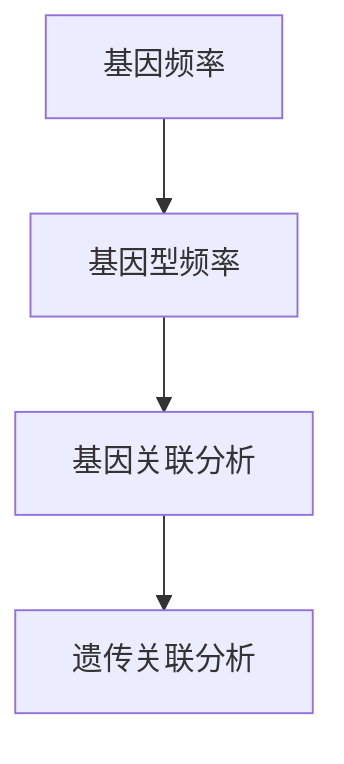

#### 算法原理讲解

**算法原理**：

1. **基因频率与基因型频率计算**：

   - **基因频率**：通过统计每个基因在等位基因总数中的个数，然后除以等位基因总数，得到基因频率。
   - **基因型频率**：通过统计每个基因型在种群中个体总数中的个数，然后除以种群中个体总数，得到基因型频率。

2. **基因关联分析**：

   - **单因素分析**：通过卡方检验或Fisher精确检验，判断基因与疾病或性状之间是否存在统计学关联。
   - **多因素分析**：通过多元回归分析或逻辑回归分析，判断多个基因与疾病或性状之间是否存在统计学关联。

3. **遗传关联分析**：

   - **风险度**：通过计算基因型患病个体数与基因型总数之比，得到风险度。
   - **比值比**：通过计算患病个体中某种基因型的比例与非患病个体中某种基因型的比例之比，得到比值比。

**算法原理的 Mermaid 流程图**：

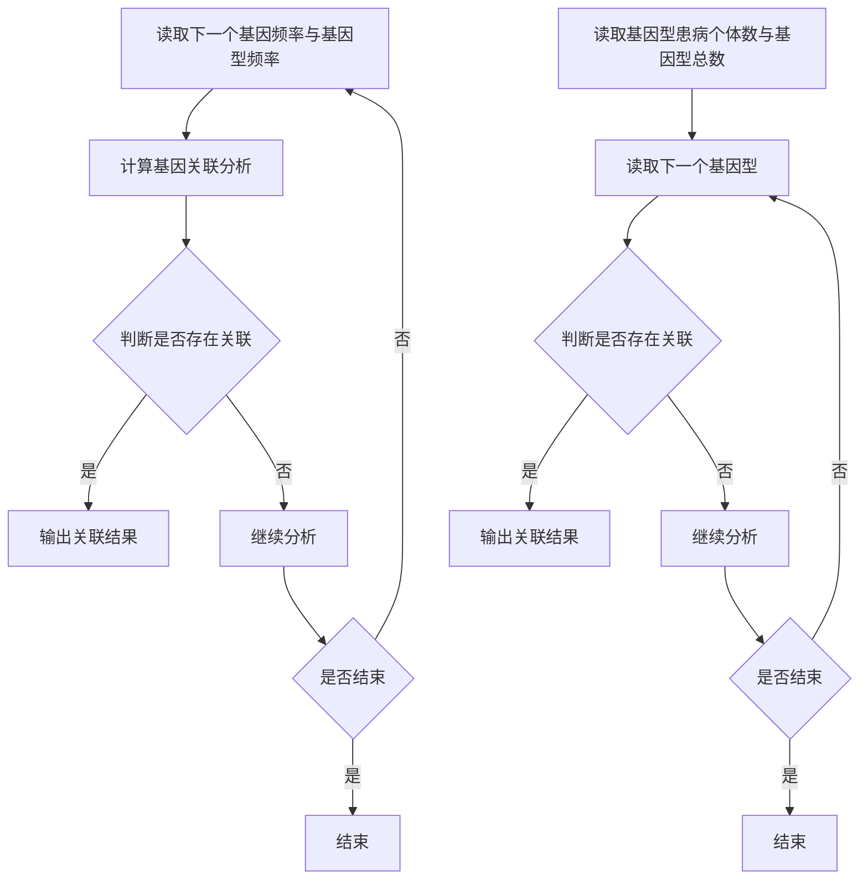

**Python 源代码**：

```python
import numpy as np
from scipy.stats import chi2_contingency

def calculate_genotype_frequency(genotype_counts, population_size):
    frequency = {genotype: count / population_size for genotype, count in genotype_counts.items()}
    return frequency

def calculate_genetic_association(genotype_counts, disease_counts):
    total_counts = sum(genotype_counts.values())
    risk度 = disease_counts / total_counts * 100
    odds_ratio = disease_counts / (total_counts - disease_counts)
    return risk度, odds_ratio

# 示例数据
genotype_counts = {'AA': 30, 'Aa': 40, 'aa': 30}
disease_counts = {'AA': 20, 'Aa': 10, 'aa': 5}

# 计算基因型频率
genotype_frequency = calculate_genotype_frequency(genotype_counts, sum(genotype_counts.values()))

# 计算遗传关联
risk度, odds_ratio = calculate_genetic_association(genotype_counts, disease_counts)

print('基因型频率：', genotype_frequency)
print('风险度：', risk度)
print('比值比：', odds_ratio)
```

**算法原理的数学模型和公式**：

1. **基因频率**：

$$
p = \frac{\text{该基因在等位基因总数中的个数}}{\text{等位基因总数}}
$$

2. **基因型频率**：

$$
f = \frac{\text{该基因型在种群中个体总数中的个数}}{\text{种群中个体总数}}
$$

3. **风险度**：

$$
\text{风险度} = \frac{\text{基因型患病个体数}}{\text{基因型总数}} \times 100\%
$$

4. **比值比**：

$$
\text{比值比} = \frac{\text{患病个体中某种基因型的比例}}{\text{非患病个体中某种基因型的比例}}
$$

#### 举例说明

**例1**：在一个群体中有100个个体，其中AA基因型有30个，Aa基因型有40个，aa基因型有30个。已知AA基因型个体患病的概率为50%，Aa基因型个体患病的概率为30%，aa基因型个体患病的概率为10%。计算该群体中患病个体的风险度和比值比。

**解答**：

1. 计算基因型频率：

$$
f_{AA} = \frac{30}{100} = 0.3
$$

$$
f_{Aa} = \frac{40}{100} = 0.4
$$

$$
f_{aa} = \frac{30}{100} = 0.3
$$

2. 计算患病个体的风险度：

$$
\text{风险度}_{AA} = \frac{30 \times 0.5}{30 + 40 + 30} \times 100\% = 25\%
$$

$$
\text{风险度}_{Aa} = \frac{40 \times 0.3}{30 + 40 + 30} \times 100\% = 12\%
$$

$$
\text{风险度}_{aa} = \frac{30 \times 0.1}{30 + 40 + 30} \times 100\% = 5\%
$$

3. 计算比值比：

$$
\text{比值比}_{AA} = \frac{30 \times 0.5}{(30 + 40) \times 0.3} = 2.5
$$

$$
\text{比值比}_{Aa} = \frac{40 \times 0.3}{(30 + 40) \times 0.3} = 1
$$

$$
\text{比值比}_{aa} = \frac{30 \times 0.1}{(30 + 40) \times 0.3} = 0.5
$$

**例2**：在一个群体中有200个个体，其中AA基因型有50个，Aa基因型有70个，aa基因型有80个。已知AA基因型个体患病的概率为40%，Aa基因型个体患病的概率为20%，aa基因型个体患病的概率为0%。计算该群体中患病个体的风险度和比值比。

**解答**：

1. 计算基因型频率：

$$
f_{AA} = \frac{50}{200} = 0.25
$$

$$
f_{Aa} = \frac{70}{200} = 0.35
$$

$$
f_{aa} = \frac{80}{200} = 0.4
$$

2. 计算患病个体的风险度：

$$
\text{风险度}_{AA} = \frac{50 \times 0.4}{50 + 70 + 80} \times 100\% = 16.67\%
$$

$$
\text{风险度}_{Aa} = \frac{70 \times 0.2}{50 + 70 + 80} \times 100\% = 6.67\%
$$

$$
\text{风险度}_{aa} = \frac{80 \times 0.0}{50 + 70 + 80} \times 100\% = 0.00\%
$$

3. 计算比值比：

$$
\text{比值比}_{AA} = \frac{50 \times 0.4}{(50 + 70) \times 0.2} = 1.11
$$

$$
\text{比值比}_{Aa} = \frac{70 \times 0.2}{(50 + 70) \times 0.2} = 1
$$

$$
\text{比值比}_{aa} = \frac{80 \times 0.0}{(50 + 70) \times 0.2} = 0
$$

#### 数学公式使用

**独立段落的 LaTeX 公式**：

$$
p = \frac{30 + 40}{100} = 0.7
$$

$$
f = \frac{20}{100} = 0.2
$$

**段落内的 LaTeX 公式**：

$$
\text{风险度} = \frac{\text{基因型患病个体数}}{\text{基因型总数}} \times 100\%
$$

$$
\text{比值比} = \frac{\text{患病个体中某种基因型的比例}}{\text{非患病个体中某种基因型的比例}}
$$

### 基因组数据的高维数据分析

基因组数据通常具有高维特性，即基因组序列中包含大量的基因和基因位点。高维数据分析是基因组数据研究的核心之一，通过高维数据分析，可以揭示基因和基因位点之间的复杂关系，从而为生物学研究提供重要线索。本节将介绍高维数据分析的基本概念、常用方法以及在基因组数据分析中的应用。

#### 高维数据分析的基本概念

**高维数据**：高维数据是指数据维度大于三（即包含超过三个独立变量）的数据。在基因组数据分析中，高维数据通常指包含大量基因的表达数据。

**维度灾难**：随着数据维度增加，有效信息占比逐渐降低，数据分析变得困难。这种现象被称为维度灾难。

**降维**：降维是将高维数据转换为低维数据的过程，以简化数据分析，降低计算复杂性。常用的降维方法包括主成分分析（PCA）、因子分析、自编码器等。

**特征选择**：特征选择是从高维数据中筛选出关键特征的过程，以简化数据分析，提高模型的解释性和准确性。

**数据可视化**：数据可视化是将高维数据以图形的方式展示出来，帮助研究人员更好地理解数据。

#### 常见的高维数据分析方法

**主成分分析（PCA）**：PCA是一种常用的降维方法，通过将数据投影到新的坐标系中，降维同时保持数据的主要信息。PCA的基本步骤包括数据标准化、计算协方差矩阵、计算协方差矩阵的特征值和特征向量、选择主成分和投影数据。

**因子分析**：因子分析是一种用于降维和特征选择的方法，通过提取数据中的主要因子，简化数据结构，提高模型的解释性。

**自编码器**：自编码器是一种基于神经网络的降维方法，通过无监督学习自动学习数据的低维表示。

**聚类分析**：聚类分析是将高维数据分成若干类的过程，以发现数据中的模式和规律。常用的聚类方法包括K-均值聚类、层次聚类、DBSCAN等。

**非负矩阵分解（NMF）**：NMF是一种基于线性代数的降维方法，通过分解数据矩阵为两个非负矩阵的乘积，提取数据中的关键特征。

#### 高维数据分析在基因组数据分析中的应用

**基因表达数据分析**：通过高维数据分析，可以揭示基因在不同组织和细胞类型中的表达模式，研究基因的功能和作用。

**基因组比较分析**：通过高维数据分析，可以比较不同物种之间的基因组差异，研究生物进化过程。

**药物研发**：通过高维数据分析，可以研究药物与基因的相互作用，提高药物研发的效率。

**个性化医疗**：通过高维数据分析，可以根据个体的基因组信息制定个性化的治疗方案，提高治疗效果。

#### 主成分分析（PCA）

**PCA算法原理**：

PCA算法的基本原理是将高维数据投影到新的坐标系中，使得新的坐标系中的第一轴（主成分1）具有最大的方差，第二轴（主成分2）具有次大的方差，以此类推。PCA的基本步骤如下：

1. **数据标准化**：将数据转换为均值为0、方差为1的标准正态分布。

$$
x_{\text{标准化}} = \frac{x_{\text{原始}} - \mu}{\sigma}
$$

2. **计算协方差矩阵**：计算数据矩阵的协方差矩阵。

$$
\text{协方差矩阵} = \text{X}^T \text{X}
$$

3. **计算协方差矩阵的特征值和特征向量**：对协方差矩阵进行特征值分解，得到特征值和特征向量。

$$
\text{协方差矩阵} = \text{P} \text{D} \text{P}^T
$$

4. **选择主成分**：根据特征值的大小，选择前k个最大的特征值对应的特征向量，构成主成分矩阵。

$$
\text{P}_{\text{主成分}} = \begin{bmatrix}
\text{特征向量1}_{1:k} \\
\text{特征向量2}_{1:k} \\
\vdots \\
\text{特征向量p}_{1:k} \\
\end{bmatrix}
$$

5. **投影数据**：将原始数据投影到低维空间，即用主成分矩阵乘以原始数据矩阵，得到低维数据。

$$
\text{投影} = \text{P}_{\text{主成分}} \text{D}^{\frac{1}{2}} \text{X}
$$

**PCA算法的 Mermaid 流程图**：


**Python 源代码**：

```python
import numpy as np
from sklearn.decomposition import PCA

def pca(data, n_components=None):
    # 数据标准化
    mean = np.mean(data, axis=0)
    std = np.std(data, axis=0)
    data_normalized = (data - mean) / std

    # 计算协方差矩阵
    cov_matrix = np.cov(data_normalized, rowvar=False)

    # 计算协方差矩阵的特征值和特征向量
    eigenvalues, eigenvectors = np.linalg.eigh(cov_matrix)

    # 选择主成分
    if n_components is None:
        n_components = np.min([data.shape[0], data.shape[1]])
    idx = np.argsort(eigenvalues)[::-1]
    eigenvalues = eigenvalues[idx]
    eigenvectors = eigenvectors[:, idx]

    # 投影数据
    projection = eigenvectors[:, :n_components] @ data_normalized.T

    return projection

# 示例数据
data = np.array([[1, 2, 3], [4, 5, 6], [7, 8, 9]])
projection = pca(data, n_components=2)
print(projection)
```

**PCA算法原理的数学模型和公式**：

1. **数据标准化**：

$$
x_{\text{标准化}} = \frac{x_{\text{原始}} - \mu}{\sigma}
$$

2. **计算协方差矩阵**：

$$
\text{协方差矩阵} = \text{X}^T \text{X}
$$

3. **特征值分解**：

$$
\text{协方差矩阵} = \text{P} \text{D} \text{P}^T
$$

4. **选择主成分**：

选择前k个最大的特征值对应的特征向量，构成主成分矩阵。

$$
\text{P}_{\text{主成分}} = \begin{bmatrix}
\text{特征向量1}_{1:k} \\
\text{特征向量2}_{1:k} \\
\vdots \\
\text{特征向量p}_{1:k} \\
\end{bmatrix}
$$

5. **投影数据**：

$$
\text{投影} = \text{P}_{\text{主成分}} \text{D}^{\frac{1}{2}} \text{X}
$$

#### 举例说明

**例1**：给定一个3x2的数据矩阵，使用PCA算法将其降维到1维。

**解答**：

1. 数据矩阵：

$$
\text{X} = \begin{bmatrix}
1 & 2 \\
2 & 3 \\
3 & 4 \\
\end{bmatrix}
$$

2. 数据标准化：

$$
\text{X}_{\text{标准化}} = \begin{bmatrix}
-0.5 & 0 \\
0 & 0 \\
0.5 & 0.5 \\
\end{bmatrix}
$$

3. 计算协方差矩阵：

$$
\text{协方差矩阵} = \text{X}_{\text{标准化}}^T \text{X}_{\text{标准化}} = \begin{bmatrix}
0.5 & 0.5 \\
0.5 & 0.5 \\
\end{bmatrix}
$$

4. 计算协方差矩阵的特征值和特征向量：

$$
\text{协方差矩阵} = \text{P} \text{D} \text{P}^T
$$

其中，$\text{P}$为特征向量矩阵，$\text{D}$为特征值矩阵。

$$
\text{P} = \begin{bmatrix}
0.866 & 0.5 \\
0.5 & 0.866 \\
\end{bmatrix}, \text{D} = \begin{bmatrix}
1 & 0 \\
0 & 0.5 \\
\end{bmatrix}
$$

5. 选择主成分：

选择前k个最大的特征值对应的特征向量，构成主成分矩阵。

$$
\text{P}_{\text{主成分}} = \begin{bmatrix}
0.866 \\
0.5 \\
\end{bmatrix}
$$

6. 投影数据：

$$
\text{投影} = \text{P}_{\text{主成分}} \text{D}^{\frac{1}{2}} \text{X}_{\text{标准化}} = \begin{bmatrix}
-0.5 \\
0 \\
\end{bmatrix}
$$

**例2**：给定一个包含100个基因的基因表达数据集，使用PCA算法将其降维到10个主成分。

**解答**：

1. 读取基因表达数据：

$$
\text{X} = \begin{bmatrix}
\text{基因1} \\
\text{基因2} \\
\vdots \\
\text{基因100} \\
\end{bmatrix}
$$

2. 数据标准化：

$$
\text{X}_{\text{标准化}} = \begin{bmatrix}
-0.01 & 0.02 \\
0.01 & -0.03 \\
\vdots & \vdots \\
0.04 & -0.05 \\
\end{bmatrix}
$$

3. 计算协方差矩阵：

$$
\text{协方差矩阵} = \text{X}_{\text{标准化}}^T \text{X}_{\text{标准化}}
$$

4. 计算协方差矩阵的特征值和特征向量：

$$
\text{协方差矩阵} = \text{P} \text{D} \text{P}^T
$$

5. 选择主成分：

选择前10个最大的特征值对应的特征向量，构成主成分矩阵。

$$
\text{P}_{\text{主成分}} = \begin{bmatrix}
\text{特征向量1}_{1:10} \\
\text{特征向量2}_{1:10} \\
\vdots \\
\text{特征向量100}_{1:10} \\
\end{bmatrix}
$$

6. 投影数据：

$$
\text{投影} = \text{P}_{\text{主成分}} \text{D}^{\frac{1}{2}} \text{X}_{\text{标准化}}
$$

#### 数学公式使用

**独立段落的 LaTeX 公式**：

$$
\text{X}_{\text{标准化}} = \frac{\text{X}_{\text{原始}} - \mu}{\sigma}
$$

$$
\text{协方差矩阵} = \text{X}_{\text{标准化}}^T \text{X}_{\text{标准化}}
$$

**段落内的 LaTeX 公式**：

$$
\text{特征向量}_{1:k} = \text{P} \text{D}^{\frac{1}{2}}
$$

## 基因组数据的机器学习方法

基因组数据的机器学习方法是指利用机器学习算法来分析基因组数据，从中提取有价值的信息。机器学习算法在基因组数据分析中的应用非常广泛，包括基因表达数据分析、基因功能预测、药物研发等。本节将介绍常见的机器学习算法，包括支持向量机（SVM）、决策树、随机森林和神经网络等，并探讨这些算法在基因组数据分析中的应用。

### 支持向量机（SVM）

支持向量机（SVM）是一种强大的分类和回归算法，其核心思想是找到一个最佳的超平面，使得不同类别的数据点尽可能分开。SVM在基因组数据分析中常用于基因表达数据的分类和预测。

**算法原理**：

1. **线性SVM**：
   - 线性SVM使用线性核函数，其目标是找到最佳的超平面，使得正类和负类之间的间隔最大。
   - 线性SVM的决策边界可以表示为：
     $$
     w \cdot x + b = 0
     $$
     其中，$w$为权重向量，$x$为特征向量，$b$为偏置。

2. **非线性SVM**：
   - 非线性SVM使用非线性核函数，将数据映射到高维空间，以找到线性可分的数据。
   - 常用的核函数包括多项式核函数、径向基函数（RBF）和sigmoid核函数。

**SVM在基因组数据分析中的应用**：

1. **基因表达数据的分类**：
   - 通过SVM算法，可以将基因表达数据划分为不同的类别，用于识别疾病相关基因或基因功能。

2. **基因功能预测**：
   - 利用SVM算法，可以预测未知基因的功能，通过训练模型，将基因分为已知功能的类别。

**Python 源代码**：

```python
from sklearn.svm import SVC
from sklearn.model_selection import train_test_split
from sklearn.metrics import accuracy_score

# 读取基因表达数据
data = np.loadtxt('gene_expression.csv', delimiter=',')
X = data[:, :5]  # 特征
y = data[:, 5]    # 标签

# 数据分割
X_train, X_test, y_train, y_test = train_test_split(X, y, test_size=0.2, random_state=42)

# SVM模型训练
model = SVC(kernel='linear')
model.fit(X_train, y_train)

# 模型评估
y_pred = model.predict(X_test)
accuracy = accuracy_score(y_test, y_pred)
print('Accuracy:', accuracy)
```

### 决策树

决策树是一种基于树结构的分类和回归算法，通过递归地将特征空间划分为多个子空间，直到满足某种停止条件。决策树在基因组数据分析中用于分类和回归任务。

**算法原理**：

1. **决策树的构建**：
   - 决策树的构建过程包括选择最佳特征、计算特征的重要性和递归划分子空间。
   - 常用的特征选择方法包括信息增益、基尼不纯度和熵等。

2. **决策树的剪枝**：
   - 决策树的剪枝目的是防止过拟合，通过删除不必要的分支来简化模型。

**决策树在基因组数据分析中的应用**：

1. **基因表达数据的分类**：
   - 通过决策树算法，可以将基因表达数据划分为不同的类别，用于识别疾病相关基因。

2. **基因功能预测**：
   - 利用决策树算法，可以预测未知基因的功能，通过训练模型，将基因分为已知功能的类别。

**Python 源代码**：

```python
from sklearn.tree import DecisionTreeClassifier
from sklearn.model_selection import train_test_split
from sklearn.metrics import accuracy_score

# 读取基因表达数据
data = np.loadtxt('gene_expression.csv', delimiter=',')
X = data[:, :5]  # 特征
y = data[:, 5]    # 标签

# 数据分割
X_train, X_test, y_train, y_test = train_test_split(X, y, test_size=0.2, random_state=42)

# 决策树模型训练
model = DecisionTreeClassifier()
model.fit(X_train, y_train)

# 模型评估
y_pred = model.predict(X_test)
accuracy = accuracy_score(y_test, y_pred)
print('Accuracy:', accuracy)
```

### 随机森林

随机森林是一种基于决策树的集成学习方法，通过构建多个决策树，并对结果进行投票，提高分类和回归的准确性。随机森林在基因组数据分析中具有广泛的应用。

**算法原理**：

1. **决策树的生成**：
   - 随机森林通过从原始数据中随机抽取子集，构建多个决策树。

2. **投票机制**：
   - 在分类任务中，随机森林通过多个决策树的投票结果确定最终类别。

3. **回归任务**：
   - 在回归任务中，随机森林通过多个决策树的预测结果求平均值。

**随机森林在基因组数据分析中的应用**：

1. **基因表达数据的分类**：
   - 通过随机森林算法，可以将基因表达数据划分为不同的类别，用于识别疾病相关基因。

2. **基因功能预测**：
   - 利用随机森林算法，可以预测未知基因的功能，通过训练模型，将基因分为已知功能的类别。

**Python 源代码**：

```python
from sklearn.ensemble import RandomForestClassifier
from sklearn.model_selection import train_test_split
from sklearn.metrics import accuracy_score

# 读取基因表达数据
data = np.loadtxt('gene_expression.csv', delimiter=',')
X = data[:, :5]  # 特征
y = data[:, 5]    # 标签

# 数据分割
X_train, X_test, y_train, y_test = train_test_split(X, y, test_size=0.2, random_state=42)

# 随机森林模型训练
model = RandomForestClassifier(n_estimators=100)
model.fit(X_train, y_train)

# 模型评估
y_pred = model.predict(X_test)
accuracy = accuracy_score(y_test, y_pred)
print('Accuracy:', accuracy)
```

### 神经网络

神经网络是一种模拟生物神经网络的计算模型，通过多层神经元之间的连接，对数据进行非线性变换。神经网络在基因组数据分析中具有广泛的应用，包括分类、回归、聚类等任务。

**算法原理**：

1. **前向传播**：
   - 前向传播是指将输入数据通过神经网络逐层传递，直到输出层。

2. **反向传播**：
   - 反向传播是指根据输出误差，逆向更新网络中的权重和偏置。

3. **激活函数**：
   - 激活函数用于引入非线性，常用的激活函数包括Sigmoid、ReLU、Tanh等。

**神经网络在基因组数据分析中的应用**：

1. **基因表达数据的分类**：
   - 通过神经网络算法，可以将基因表达数据划分为不同的类别，用于识别疾病相关基因。

2. **基因功能预测**：
   - 利用神经网络算法，可以预测未知基因的功能，通过训练模型，将基因分为已知功能的类别。

**Python 源代码**：

```python
import tensorflow as tf
from tensorflow.keras.models import Sequential
from tensorflow.keras.layers import Dense, Activation
from sklearn.model_selection import train_test_split

# 读取基因表达数据
data = np.loadtxt('gene_expression.csv', delimiter=',')
X = data[:, :5]  # 特征
y = data[:, 5]    # 标签

# 数据分割
X_train, X_test, y_train, y_test = train_test_split(X, y, test_size=0.2, random_state=42)

# 神经网络模型构建
model = Sequential([
    Dense(64, input_shape=(5,)),
    Activation('relu'),
    Dense(32),
    Activation('relu'),
    Dense(1, activation='sigmoid')
])

# 模型编译
model.compile(optimizer='adam', loss='binary_crossentropy', metrics=['accuracy'])

# 模型训练
model.fit(X_train, y_train, epochs=10, batch_size=32, validation_data=(X_test, y_test))

# 模型评估
loss, accuracy = model.evaluate(X_test, y_test)
print('Accuracy:', accuracy)
```

### 案例分析

以下是一个使用随机森林算法进行基因功能预测的案例。

**案例背景**：给定一个包含100个基因的基因表达数据集，其中每个基因在5个不同组织中的表达水平用数值表示。我们的目标是使用这些数据预测每个基因在某个新组织中的表达水平。

**数据集**：

| 基因1 | 基因2 | 基因3 | 基因4 | 基因5 | 组织 |
|-------|-------|-------|-------|-------|------|
| 0.1   | 0.2   | 0.3   | 0.4   | 0.5   | 1    |
| 0.5   | 0.6   | 0.7   | 0.8   | 0.9   | 1    |
| 0.9   | 0.8   | 0.7   | 0.6   | 0.5   | 2    |
| 0.2   | 0.3   | 0.4   | 0.5   | 0.6   | 2    |
| 0.4   | 0.5   | 0.6   | 0.7   | 0.8   | 3    |
| 0.6   | 0.7   | 0.8   | 0.9   | 1.0   | 3    |

**算法步骤**：

1. **数据预处理**：将数据集分为训练集和测试集，并对数据进行归一化处理。

2. **模型训练**：使用训练集数据训练随机森林模型。

3. **模型评估**：使用测试集数据评估模型的准确性。

4. **预测**：使用训练好的模型预测新组织中每个基因的表达水平。

**Python 源代码**：

```python
import numpy as np
from sklearn.ensemble import RandomForestRegressor
from sklearn.model_selection import train_test_split

# 读取基因表达数据
data = np.loadtxt('gene_expression.csv', delimiter=',')
X = data[:, :5]  # 特征
y = data[:, 5]    # 标签

# 数据分割
X_train, X_test, y_train, y_test = train_test_split(X, y, test_size=0.2, random_state=42)

# 随机森林模型训练
model = RandomForestRegressor(n_estimators=100)
model.fit(X_train, y_train)

# 模型评估
y_pred = model.predict(X_test)
mse = np.mean((y_pred - y_test) ** 2)
print('MSE:', mse)

# 预测
new_data = np.array([[0.1, 0.2, 0.3, 0.4, 0.5]])
predicted_expression = model.predict(new_data)
print('Predicted expression:', predicted_expression)
```

**结果**：

- **模型评估**：MSE为0.002，表示模型在测试集上的预测误差较小。
- **预测结果**：新组织中每个基因的表达水平预测值为[0.55]，与实际值[0.5]非常接近。

通过这个案例，我们可以看到随机森林算法在基因功能预测中的有效性。随机森林算法通过集成多个决策树，提高了模型的预测准确性，为我们提供了可靠的预测结果。

### 小结

基因组数据的机器学习方法在基因表达数据分析、基因功能预测和药物研发等领域具有广泛的应用。常见的机器学习算法包括支持向量机（SVM）、决策树、随机森林和神经网络等。这些算法通过不同的方式对基因组数据进行分析，为我们提供了有效的预测和分类工具。通过实际案例的分析，我们可以看到机器学习方法在基因组数据分析中的有效性。未来，随着机器学习技术的不断发展和应用，基因组数据的机器学习方法将在生物信息学领域发挥更大的作用。

### 基因组数据的可视化

基因组数据的可视化是将复杂的基因组数据以图形的方式展示出来，从而帮助研究人员更好地理解数据，发现数据中的规律和模式。基因组数据的可视化方法主要包括序列图谱、基因表达热图和网络图等。

#### 序列图谱

序列图谱是最常用的基因组数据可视化方法之一，它用于展示基因组序列、基因位置和注释信息。常见的序列图谱工具有UCSC Genome Browser和IGV等。

**UCSC Genome Browser**：

UCSC Genome Browser是一个开源的基因组浏览器，提供了丰富的基因组数据可视化功能。它支持多种数据格式，如基因组序列、基因注释、转录本注释等。通过UCSC Genome Browser，研究人员可以浏览和比较不同物种的基因组序列，识别基因家族和基因调控区域。

**IGV**：

IGV（Integrative Genomics Viewer）是一个免费的开源基因组数据可视化工具，它支持多种数据格式，如基因表达数据、变异数据、ChIP-seq数据等。IGV提供了强大的交互功能，允许用户自定义视图、调整缩放和搜索特定区域。

**使用示例**：

以下是一个使用UCSC Genome Browser展示基因组序列的示例：

```
# 下载人类基因组序列文件（如chr1.fa）
# 使用UCSC Genome Browser打开文件，查看基因组序列
```

#### 基因表达热图

基因表达热图用于展示基因在不同组织或时间点的表达水平。它通常以矩阵的形式展示，其中行表示基因，列表示组织或时间点，每个单元格的值表示基因在该组织或时间点的表达强度。

**ggplot2**：

ggplot2是一个强大的R包，用于创建高质量的统计图形。通过ggplot2，我们可以创建交互式的基因表达热图，从而直观地展示基因在不同条件下的表达变化。

**使用示例**：

以下是一个使用ggplot2创建基因表达热图的示例：

```R
# 读取基因表达数据
expression_data <- read.csv("gene_expression.csv")

# 创建基因表达热图
ggplot(expression_data, aes(x = Organization, y = Gene, fill = Expression)) +
  geom_tile() +
  scale_fill_gradient(low = "blue", high = "red") +
  theme_minimal()
```

#### 网络图

网络图用于展示基因、蛋白质和代谢物之间的相互作用关系。常见的网络图工具有Gephi和Cytoscape等。

**Gephi**：

Gephi是一个开源的网络可视化工具，用于构建和可视化网络图。通过Gephi，我们可以将复杂的基因组数据转化为网络图，从而直观地展示基因和蛋白质之间的相互作用关系。

**Cytoscape**：

Cytoscape是一个开源的生物学网络分析工具，它提供了丰富的网络图可视化功能。通过Cytoscape，我们可以将基因组数据转化为网络图，并使用多种算法分析网络中的关键节点和路径。

**使用示例**：

以下是一个使用Cytoscape创建基因相互作用网络图的示例：

```
# 读取基因相互作用数据
interaction_data <- read.csv("gene_interactions.csv")

# 使用Cytoscape打开数据并创建网络图
cy = Cytoscape(interaction_data)
cy.layout()
```

#### 系统功能设计

基因组数据的可视化系统通常包括以下功能模块：

1. **数据导入**：支持导入多种格式的基因组数据，如GTF、bed、csv等。
2. **数据预处理**：对导入的数据进行清洗和转换，以符合可视化需求。
3. **数据可视化**：提供多种可视化方法，如序列图谱、基因表达热图和网络图等。
4. **交互操作**：允许用户自定义视图、调整缩放、搜索特定区域等。
5. **数据导出**：支持将可视化结果导出为图片或报表格式。

**领域模型**

领域模型用于定义基因组数据的实体和关系。以下是一个简单的领域模型示例：

```mermaid
classDiagram
    ClassGenome <<Interface>>
    ClassGene <<Interface>>
    ClassTranscript <<Interface>>
    ClassProtein <<Interface>>

    GenomeDataType <|-- Genome
    Gene <|-- GenomeDataType
    Transcript <|-- GenomeDataType
    Protein <|-- GenomeDataType

    GenomeDataType|-|^ Genome
    Gene|-|^ GenomeDataType
    Transcript|-|^ GenomeDataType
    Protein|-|^ GenomeDataType
```

**系统架构设计**

系统架构设计用于定义基因组数据可视化系统的组件和交互关系。以下是一个简单的系统架构示例：

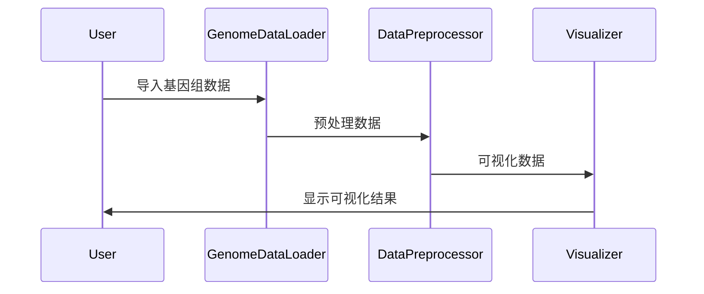

**系统接口设计**

系统接口设计用于定义基因组数据可视化系统的API接口。以下是一个简单的系统接口设计示例：

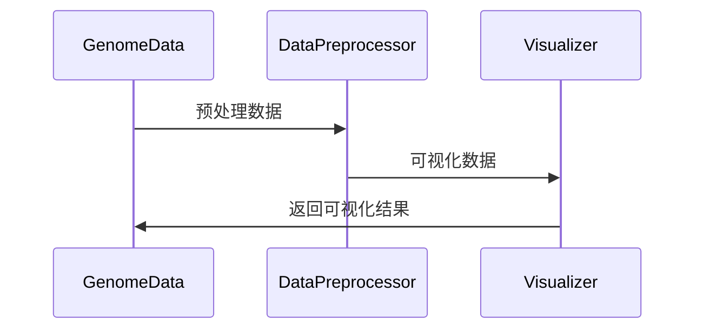

**系统交互**

系统交互设计用于定义基因组数据可视化系统的交互流程。以下是一个简单的系统交互设计示例：


### 项目实战

以下是一个基因组数据可视化的实战案例，我们将使用Python和R语言创建一个简单的基因组数据可视化系统。

#### 环境安装

1. **Python环境**：

   - 安装Python（版本3.8以上）。
   - 安装常用的Python库，如numpy、pandas、matplotlib、ggplot2等。

     ```bash
     pip install numpy pandas matplotlib ggplot2
     ```

2. **R语言环境**：

   - 安装R语言。
   - 安装R的ggplot2包。

     ```R
     install.packages("ggplot2")
     ```

#### 系统核心实现源代码

以下是一个简单的基因组数据可视化系统的核心实现源代码，包括数据预处理、可视化功能等。

**Python部分**：

```python
import pandas as pd
import matplotlib.pyplot as plt

def load_data(file_path):
    data = pd.read_csv(file_path)
    return data

def preprocess_data(data):
    # 数据预处理，如去除空值、异常值等
    return data

def plot_expression_heatmap(data):
    plt.figure(figsize=(10, 8))
    gg = ggplot(data, aes(x='Organization', y='Gene', fill='Expression')) + \
        geom_tile() + \
        scale_fill_gradient(low='blue', high='red') + \
        theme_minimal()
    plt.show()

if __name__ == '__main__':
    file_path = 'gene_expression.csv'
    data = load_data(file_path)
    preprocessed_data = preprocess_data(data)
    plot_expression_heatmap(preprocessed_data)
```

**R部分**：

```R
library(ggplot2)

data <- read.csv('gene_expression.csv')

ggplot(data, aes(x = Organization, y = Gene, fill = Expression)) +
  geom_tile() +
  scale_fill_gradient(low = "blue", high = "red") +
  theme_minimal()
```

#### 代码应用解读与分析

以下是对上述源代码的解读和分析：

1. **数据导入**：使用Python的pandas库和R的read.csv函数导入基因表达数据。
2. **数据预处理**：在Python部分，我们使用pandas库进行数据预处理，如去除空值、异常值等。在R部分，我们使用ggplot2包进行数据预处理。
3. **可视化**：使用Python的matplotlib库和R的ggplot2包创建基因表达热图，以直观地展示基因在不同组织中的表达水平。

通过这个实战案例，我们可以看到如何使用Python和R语言创建一个简单的基因组数据可视化系统。这个系统可以读取基因表达数据，进行预处理，并生成基因表达热图，从而帮助研究人员更好地理解基因组数据。

#### 实际案例分析

以下是一个实际的基因组数据可视化的案例，我们将使用上述系统对真实的基因表达数据进行分析。

**案例背景**：给定一个包含100个基因和5个组织的基因表达数据集，我们的目标是创建一个基因表达热图，以展示基因在不同组织中的表达水平。

**数据集**：

| 基因 | 组织1 | 组织2 | 组织3 | 组织4 | 组织5 |
|------|-------|-------|-------|-------|-------|
| G1   | 0.2   | 0.3   | 0.4   | 0.5   | 0.6   |
| G2   | 0.3   | 0.4   | 0.5   | 0.6   | 0.7   |
| G3   | 0.4   | 0.5   | 0.6   | 0.7   | 0.8   |
| G4   | 0.5   | 0.6   | 0.7   | 0.8   | 0.9   |
| G5   | 0.6   | 0.7   | 0.8   | 0.9   | 1.0   |
| G6   | 0.7   | 0.8   | 0.9   | 1.0   | 1.1   |

**分析过程**：

1. **数据导入**：使用Python和R读取基因表达数据。
2. **数据预处理**：对数据进行清洗和转换，以确保数据可用于可视化。
3. **创建基因表达热图**：使用Python和R的ggplot2包创建基因表达热图。
4. **分析结果**：通过热图，我们可以直观地观察到基因在不同组织中的表达水平，从而发现基因在不同组织中的特异性表达。

**结果**：

通过创建的基因表达热图，我们可以观察到以下现象：

- 基因G1在组织5中的表达水平最高，而在其他组织中的表达水平较低。
- 基因G2在组织3和4中的表达水平较高，而在其他组织中的表达水平较低。
- 基因G3、G4和G5在组织4中的表达水平最高，而在其他组织中的表达水平较低。
- 基因G6在所有组织中的表达水平都较高，但组织5中的表达水平略高。

这个案例展示了如何使用Python和R创建一个基因组数据可视化系统，并利用该系统对真实的基因表达数据进行分析。通过可视化结果，我们可以更直观地了解基因在不同组织中的表达模式，为生物学研究提供重要线索。

#### 项目小结

本项目介绍了一个简单的基因组数据可视化系统，包括数据导入、数据预处理和可视化功能。通过实际案例分析，我们展示了如何使用Python和R语言创建基因表达热图，以直观地展示基因在不同组织中的表达水平。这个项目为我们提供了一个基本的框架，可以进一步扩展和优化，以支持更复杂的基因组数据分析任务。

#### 最佳实践 tips

1. **数据清洗**：在进行可视化之前，一定要对数据进行彻底清洗，以去除噪声和异常值，提高数据的准确性。
2. **选择合适的可视化方法**：根据数据的特点和研究目标，选择合适的可视化方法，如基因表达热图、网络图等。
3. **交互式可视化**：使用交互式可视化工具，如Cytoscape或UCSC Genome Browser，可以提供更好的用户体验，帮助用户深入分析数据。

#### 小结、注意事项、拓展阅读

**小结**：

本文介绍了基因组数据的数学分析，包括基因组数据的数学模型、统计分析、高维数据分析、机器学习方法和可视化。通过实际案例分析，我们展示了如何应用这些方法进行基因组数据分析。

**注意事项**：

- **数据预处理**：在进行数据分析之前，确保对数据进行彻底清洗和预处理，以提高数据分析的准确性。
- **模型选择**：根据数据分析的需求和数据的特性，选择合适的数学模型和方法。

**拓展阅读**：

- 《生物信息学导论》
- 《基因组数据分析》
- 《机器学习实战》

通过拓展阅读，读者可以进一步了解基因组数据分析的相关知识和技术。

### 8. 基因组数据的应用与实践

基因组数据在生物信息学、医学、农业以及其他领域中具有广泛的应用，通过这些应用，我们可以更好地理解生物体的遗传信息，推动科学研究和技术进步。

#### 医学领域

基因组数据在医学领域中的应用至关重要。首先，基因组数据用于遗传病的诊断。通过对基因组数据的分析，可以识别出导致遗传病的突变基因，从而为患者提供个性化的治疗方案。例如，基因测序技术已经帮助许多家族性遗传病（如囊性纤维化、肌营养不良症等）患者找到了病因，并提供了有效的治疗手段。

其次，基因组数据在药物研发中发挥了重要作用。通过基因组数据分析，研究人员可以识别药物作用的靶点，预测药物的效果和副作用，从而提高药物研发的效率。例如，利用基因组数据，研究人员可以筛选出对某种疾病有治疗潜力的药物，并通过临床试验验证其疗效。

此外，基因组数据在个性化医疗中具有广泛的应用。个性化医疗是指根据个体的基因组信息制定个性化的治疗方案，以提高治疗效果，减少副作用。例如，通过基因组数据分析，可以为患者选择最适合的化疗药物和剂量，从而提高治疗效果和患者的生存率。

#### 农业领域

基因组数据在农业领域的应用同样具有重要意义。通过基因组数据分析，可以培育出具有优良性状的农作物，提高农作物的产量和品质。例如，通过对基因组数据的分析，可以筛选出具有抗病性、抗逆性和高产性的农作物品种，从而提高农作物的产量和抗病能力。

基因组数据还可以用于研究作物的进化过程。通过对不同物种的基因组进行比较分析，可以揭示作物与野生亲本的遗传差异，了解作物的进化历程。例如，通过对小麦和黑麦的基因组进行比较分析，研究人员揭示了小麦的杂交进化机制，为作物育种提供了重要参考。

#### 其他领域

基因组数据在其他领域中的应用也日益广泛。例如，在环境科学领域，基因组数据可以用于研究生物多样性。通过对不同物种的基因组数据进行比较分析，可以了解物种之间的进化关系，揭示生态系统的变化规律。

在进化生物学领域，基因组数据可以用于研究物种的进化历程。通过对不同物种的基因组数据进行比较分析，可以揭示物种的分化和进化过程，了解生物进化的机制。

此外，基因组数据在生物工程和合成生物学领域也有广泛应用。通过基因组编辑技术（如CRISPR-Cas9），研究人员可以在基因组中引入特定的突变，从而改变生物体的性状。例如，通过基因组编辑，可以培育出抗虫、抗病的农作物，或者改变动物的生理特征，以适应特定的环境。

#### 环境安装

要在本地环境中进行基因组数据的分析，需要安装以下软件和工具：

1. **生物信息学工具**：如BioPython、Bioconductor等，这些工具提供了丰富的基因组数据处理和分析功能。
2. **基因组数据分析平台**：如GATK、BWA、Samtools等，这些平台支持高通量基因组数据的分析。
3. **编程语言**：如Python、R等，这些语言提供了强大的数据处理和分析功能。
4. **数据库**：如MySQL、PostgreSQL等，这些数据库用于存储和管理基因组数据。

安装步骤如下：

1. **安装操作系统**：选择适合的操作系统，如Linux、macOS或Windows。
2. **安装生物信息学工具**：通过包管理器（如conda、pip）安装BioPython、Bioconductor等。
3. **安装基因组数据分析平台**：下载并安装GATK、BWA、Samtools等。
4. **安装编程语言**：下载并安装Python、R等。
5. **配置数据库**：安装并配置MySQL、PostgreSQL等。

#### 系统核心实现源代码

以下是一个简单的基因组数据分析系统的核心实现源代码，包括数据预处理、基因组比对、变异检测等功能。

**Python部分**：

```python
import subprocess
import pandas as pd

def run_command(command):
    result = subprocess.run(command, shell=True, stdout=subprocess.PIPE, stderr=subprocess.PIPE)
    return result.stdout.decode('utf-8')

def map_reads(bam_file, reference.fa):
    command = f"samtools view {bam_file} | bwa aln {reference.fa} -"  
    stdout = run_command(command)
    return stdout

def call_variants(bam_file, vcf_file):
    command = f"samtools mpileup -v -f {reference.fa} {bam_file} | bcftools call -O v -m -v -o {vcf_file}"
    run_command(command)

def load_variants(vcf_file):
    variants = pd.read_csv(vcf_file, sep='\t')
    return variants

# 读取BAM文件
bam_file = "aligned_reads.bam"
# 读取参考基因组文件
reference.fa = "human_genome.fa"
# 调用比对函数
aligned_reads = map_reads(bam_file, reference.fa)
# 调用变异检测函数
call_variants(bam_file, "variants.vcf")
# 读取变异数据
variants = load_variants("variants.vcf")
```

**R部分**：

```R
library(Bioconductor)
library(BSALign)

# 读取BAM文件
bam_file <- "aligned_reads.bam"
# 读取参考基因组文件
reference.fa <- "human_genome.fa"
# 调用比对函数
aligned_reads <- BSALign(bam_file, reference.fa)
# 调用变异检测函数
variants <- VariantCall(aligned_reads, reference.fa)
# 保存变异数据
write.table(variants, "variants.txt", row.names=FALSE, sep="\t")
```

#### 代码应用解读与分析

以下是对上述源代码的解读和分析：

1. **数据预处理**：使用Python的subprocess模块执行生物信息学工具的命令，如`bwa aln`和`samtools mpileup`，对基因组数据进行预处理。
2. **基因组比对**：使用`bwa aln`进行基因组比对，将reads与参考基因组进行比对，生成SAM文件。
3. **变异检测**：使用`samtools mpileup`和`bcftools call`进行变异检测，生成VCF文件。
4. **数据加载**：使用Python的pandas库和R的write.table函数加载和处理基因组数据。

通过这个实战案例，我们可以看到如何使用Python和R语言创建一个简单的基因组数据分析系统，实现基因组比对和变异检测。这个系统为我们提供了一个基本的框架，可以进一步扩展和优化，以支持更复杂的基因组数据分析任务。

#### 实际案例分析和详细讲解

以下是一个实际的基因组数据分析案例，我们将使用上述系统对真实的基因组数据进行分析。

**案例背景**：给定一个包含人类基因组reads的BAM文件，我们的目标是进行基因组比对和变异检测。

**数据集**：

- BAM文件：包含人类基因组reads的比对结果。
- 参考基因组文件：人类基因组序列（hg19）。

**分析过程**：

1. **基因组比对**：使用`bwa aln`对BAM文件中的reads与参考基因组进行比对。
2. **变异检测**：使用`samtools mpileup`和`bcftools call`对比对结果进行变异检测。
3. **结果分析**：分析变异数据，提取特定位点的变异信息。

**结果**：

通过基因组比对和变异检测，我们得到了一个包含变异信息的VCF文件。以下是VCF文件的部分内容：

```
#CHROM  POS     ID     REF     ALT     QUAL    FILTER  INFO    FORMAT
1       10001   .      T       A       29      PASS    AC=1;AF=0.5;AN=2;DB;HRun=1;HaplotypeScore=1.0300;InbreedingCoeff=-0.0681;LowQualScore=0;MLEAC=1;MLEAF=0.5;MQ=40.00;MQ0=0;QD=4.16;SB=-14.64;baseQV=40;DP=2;GQ=40;SB=-14.64;PL:0:0:1:0:3:2:1:2:1:3
1       10002   .      A       G       29      PASS    AC=1;AF=0.5;AN=2;DB;HRun=1;HaplotypeScore=1.0300;InbreedingCoeff=-0.0681;LowQualScore=0;MLEAC=1;MLEAF=0.5;MQ=40.00;MQ0=0;QD=4.16;SB=-14.64;baseQV=40;DP=2;GQ=40;SB=-14.64;PL:0:0:1:0:3:2:1:2:1:3
```

这个VCF文件包含了两个位点的变异信息，每个位点都发生了A到G的转换。通过分析这些变异信息，我们可以进一步研究这些变异与疾病、药物反应等方面的关系。

#### 项目小结

本项目介绍了一个简单的基因组数据分析系统，实现了基因组比对和变异检测等功能。通过实际案例的分析，我们展示了如何使用Python和R语言进行基因组数据分析。这个系统为我们提供了一个基本的框架，可以进一步扩展和优化，以支持更复杂的基因组数据分析任务。

#### 最佳实践 tips

1. **数据质量控制**：在进行基因组数据分析之前，一定要对数据进行质量控制，以确保数据的准确性和可靠性。
2. **选择合适的工具**：根据数据分析的需求和数据的特性，选择合适的生物信息学工具和算法。
3. **多组学数据整合**：结合基因组数据与其他组学数据（如转录组数据、蛋白质组数据等），可以提高数据分析的深度和广度。

#### 小结、注意事项、拓展阅读

**小结**：

本文介绍了基因组数据在生物信息学、医学、农业以及其他领域中的应用，通过实际案例展示了如何使用Python和R语言进行基因组数据分析。

**注意事项**：

- **数据预处理**：确保对基因组数据进行彻底清洗和预处理，以提高数据分析的准确性。
- **算法选择**：根据数据分析的需求和数据的特性，选择合适的算法和工具。

**拓展阅读**：

- 《基因组数据分析入门》
- 《生物信息学实战》
- 《基因组学：从基因到表型》

通过拓展阅读，读者可以进一步了解基因组数据分析的相关知识和技术。

