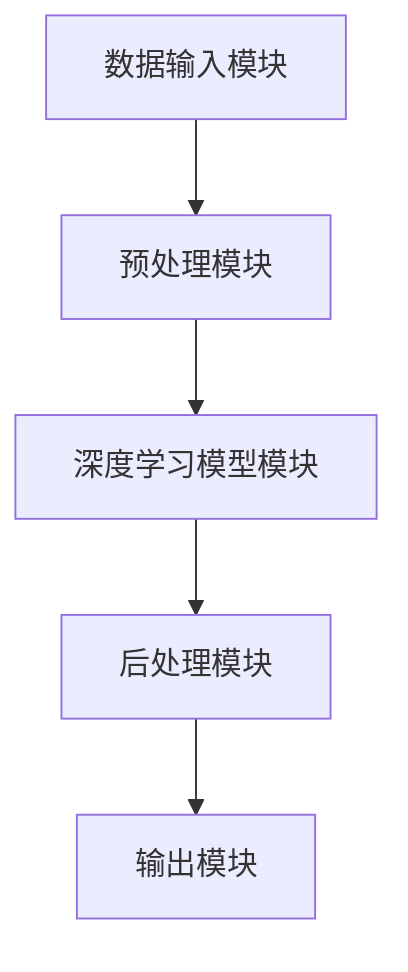
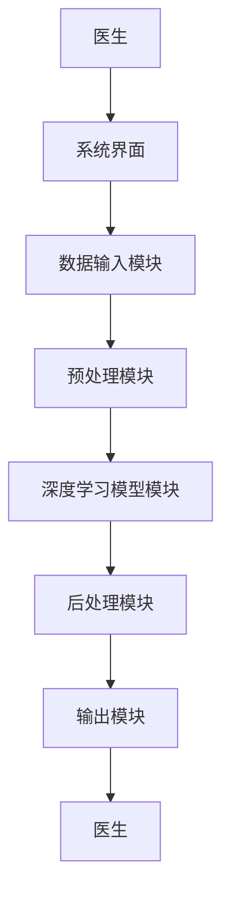

                 

## 数学与生物医学工程：医疗设备的数学原理

### 关键词
- 数学原理
- 生物医学工程
- 医疗设备
- 数学模型
- 算法应用
- 系统设计

### 摘要
本文旨在探讨数学在生物医学工程中扮演的关键角色，特别是如何将数学原理应用于医疗设备的设计、制造和优化。本文将介绍数学的基本概念，如概率论、统计学、线性代数和微分方程，并探讨这些概念在生物医学工程中的具体应用。此外，本文还将详细讲解算法原理及其在医疗设备中的应用，以及如何进行系统分析与架构设计。通过实际案例，本文将展示数学原理在医疗设备开发中的实际应用，并提供相关的代码分析和案例讲解。

### 第一部分：背景介绍

#### 引言

随着科技的飞速发展，生物医学工程领域正逐渐成为医学研究和临床应用的重要组成部分。在这个过程中，数学作为一种强有力的工具，发挥着不可或缺的作用。数学不仅为生物医学工程提供了理论基础，还通过精确的数学模型和算法，提升了医疗设备的设计和制造水平。本文将探讨数学与生物医学工程的密切关系，并深入分析数学在医疗设备中的应用。

#### 问题背景

数学在生物医学工程中的应用历史悠久。早在20世纪初期，生物医学工程就开始利用数学模型来描述生物系统的行为。随着计算机技术的发展，数学方法在医学成像、生物信号处理、药物设计等领域的应用越来越广泛。如今，数学已成为生物医学工程不可或缺的工具，帮助研究人员和工程师解决复杂的生物医学问题。

#### 问题描述

本文的核心问题是：如何有效地将数学原理应用于医疗设备的设计、制造和优化？为了回答这个问题，我们需要从以下几个方面进行探讨：

1. **核心概念**：介绍生物医学工程中的基本数学概念，如概率论、统计学、线性代数、微分方程等，并解释这些概念在医疗设备中的应用。
2. **联系与对比**：通过表格和图示，比较不同数学方法在特定医疗设备应用中的优缺点，帮助读者选择合适的方法。
3. **数学模型与公式**：详细介绍每个数学模型的工作原理，并提供相应的数学公式和推导过程，使读者能够深入理解模型。
4. **算法讲解与实例**：通过 Mermaid 流程图和 Python 源代码，解释算法的实现原理，并通过实例来说明算法的应用效果。
5. **系统分析与架构设计**：介绍医疗设备的设计原理，包括系统功能设计、架构设计、接口设计和系统交互。
6. **项目实战**：通过实际案例，展示如何将数学原理应用于医疗设备的开发，并提供详细的代码分析和案例讲解。

#### 问题解决

为了回答上述问题，本文将从以下几个方面展开：

1. **核心概念介绍**：首先介绍生物医学工程中常用的数学概念，如概率论、统计学、线性代数和微分方程，并解释这些概念在医疗设备中的应用。
2. **数学方法对比**：通过表格和图示，比较不同数学方法在特定医疗设备应用中的优缺点，帮助读者选择合适的方法。
3. **数学模型与公式解析**：详细介绍每个数学模型的工作原理，并提供相应的数学公式和推导过程，使读者能够深入理解模型。
4. **算法讲解与实例**：通过 Mermaid 流程图和 Python 源代码，解释算法的实现原理，并通过实例来说明算法的应用效果。
5. **系统设计与实现**：介绍医疗设备的设计原理，包括系统功能设计、架构设计、接口设计和系统交互。
6. **项目实战**：通过实际案例，展示如何将数学原理应用于医疗设备的开发，并提供详细的代码分析和案例讲解。

#### 边界与外延

本文将探讨数学在生物医学工程中的各种应用，包括但不限于医学成像、生物信号处理、生物力学、药物动力学等。此外，本文还将讨论数学方法在医疗设备优化和故障诊断中的应用。

#### 概念结构与核心要素组成

本文的核心概念包括数学原理、生物医学工程应用场景、算法实现、系统设计与实现等。这些概念相互关联，共同构成了本文的理论框架。

#### 本章小结

通过本章节的介绍，读者应该对《数学与生物医学工程：医疗设备的数学原理》的内容有了基本的了解。本文将为读者提供一套系统、全面的数学方法，帮助他们在生物医学工程领域取得突破性进展。

---

### 第二部分：核心概念与联系

#### 数学与生物医学工程的基本概念

在本章节中，我们将探讨数学在生物医学工程中的一些核心概念，包括概率论、统计学、线性代数和微分方程。这些概念不仅是数学的基础，也是生物医学工程中解决实际问题的有力工具。

#### 2.1 概率论与统计学

##### 2.1.1 概率论的基本概念

概率论是数学的一个分支，主要研究随机事件及其概率分布。以下是概率论中一些基本概念：

- **随机事件**：在一定条件下，可能发生也可能不发生的事件。
- **概率**：描述随机事件发生的可能性大小。
- **概率分布**：描述随机变量取值的概率分布情况。

概率论在生物医学工程中的应用非常广泛。例如，在医学成像中，可以使用概率分布模型进行图像重建；在生物信号处理中，可以利用统计学方法进行信号滤波、特征提取等。

##### 2.1.2 统计学的基本概念

统计学是研究如何通过样本数据来推断总体特征的学科。以下是统计学中一些基本概念：

- **统计总体**：研究对象的全体。
- **样本**：从统计总体中抽取的一部分。
- **统计量**：根据样本数据计算出的用于描述总体特征的量。

统计学在生物医学工程中的应用包括医学数据挖掘、临床试验分析、流行病学研究等。通过统计学方法，研究人员可以更准确地了解疾病的发病规律，为疾病预防、诊断和治疗提供科学依据。

##### 2.1.3 概率论与统计学在生物医学工程中的应用

- **医学成像**：利用概率分布模型进行图像重建，例如，CT、MRI 等成像技术。
- **生物信号处理**：利用统计学方法进行信号滤波、特征提取等，例如，心电图、脑电图等信号处理。
- **药物动力学**：利用统计学模型分析药物在体内的浓度变化，为药物设计提供依据。

#### 2.2 线性代数

##### 2.2.1 线性代数的基本概念

线性代数是研究向量、矩阵及其线性关系的数学分支。以下是线性代数中一些基本概念：

- **向量**：具有大小和方向的量。
- **矩阵**：由数字排列成的二维数组。
- **线性方程组**：含有未知数的等式。

线性代数在生物医学工程中的应用非常广泛。例如，在生物力学中，可以使用矩阵表示生物体的力学状态；在药物动力学中，可以使用线性代数方法分析药物在体内的浓度变化。

##### 2.2.2 线性代数在生物医学工程中的应用

- **生物力学**：利用矩阵表示生物体的力学状态，例如，肌肉、骨骼等生物结构的力学分析。
- **药物动力学**：利用线性代数方法分析药物在体内的浓度变化，为药物设计提供依据。

#### 2.3 微分方程

##### 2.3.1 微分方程的基本概念

微分方程是研究函数及其导数之间关系的方程。以下是微分方程中一些基本概念：

- **微分方程**：描述函数及其导数关系的方程。
- **解**：满足微分方程的函数。

微分方程在生物医学工程中的应用包括生物信号分析、药物动力学等。通过微分方程，研究人员可以更准确地描述生物系统的动态行为。

##### 2.3.2 微分方程在生物医学工程中的应用

- **生物信号分析**：利用微分方程描述生物信号的动态变化，例如，心电图、脑电图等信号处理。
- **药物动力学**：利用微分方程模拟药物在体内的浓度变化，为药物设计提供依据。

#### 2.4 算法原理与联系

##### 2.4.1 算法原理

算法是解决特定问题的步骤序列。以下是算法中一些基本概念：

- **算法**：解决问题的步骤序列。
- **时间复杂度**：算法执行时间与数据规模的关系。
- **空间复杂度**：算法执行所需存储空间与数据规模的关系。

##### 2.4.2 算法在生物医学工程中的应用

- **医学成像算法**：如重建算法、滤波算法、特征提取算法等。
- **生物信号处理算法**：如滤波算法、特征提取算法、分类算法等。

通过本章节的介绍，读者应该对数学在生物医学工程中的应用有了更深入的了解。在接下来的章节中，我们将进一步探讨这些数学方法在医疗设备中的应用，以及如何通过算法和系统设计来提升医疗设备的性能。

---

### 第三部分：算法原理讲解

在第二部分中，我们介绍了数学在生物医学工程中的核心概念。在本章节中，我们将深入探讨算法原理及其在医疗设备中的应用。通过具体的例子，我们将展示如何将数学原理转化为实际应用，从而提升医疗设备的性能和效率。

#### 3.1 医学成像算法

医学成像技术在现代医学中扮演着至关重要的角色，如CT、MRI、超声等。这些技术依赖于复杂的数学算法来进行图像重建和处理。以下是一些常见的医学成像算法及其原理。

##### 3.1.1 重建算法

医学成像重建算法是利用投影数据恢复原始图像的过程。最经典的重建算法是反投影算法（Back Projection），它是基于投影原理进行的。

- **原理**：反投影算法首先将投影数据转换为投影向量，然后通过反投影操作将这些向量叠加，从而生成原始图像。
- **数学模型**：设 \(P(x, y)\) 为投影数据，\(I(x, y)\) 为原始图像，则反投影公式为：
  $$
  I(x, y) = \sum_{i=1}^{n} P_i \cdot f(x, y, \theta_i)
  $$
  其中，\(f(x, y, \theta_i)\) 是投影方向上的图像函数，\(\theta_i\) 是投影角度。

##### 3.1.2 滤波算法

在医学成像中，滤波算法用于去除噪声和增强图像特征。常见的滤波算法包括傅里叶变换滤波和高斯滤波。

- **原理**：傅里叶变换滤波利用傅里叶变换将图像从空间域转换为频率域，然后通过在频率域中去除特定频率的噪声来增强图像。
- **数学模型**：设 \(I(x, y)\) 为原始图像，\(F(I)\) 为傅里叶变换，\(H(f)\) 为滤波器，则滤波后的图像为：
  $$
  G(x, y) = F^{-1}[F(I) \cdot H(f)]
  $$

- **Python 源代码**（高斯滤波）：
  ```python
  import numpy as np
  from scipy.ndimage import gaussian_filter

  def gauss_filter(image, sigma):
      return gaussian_filter(image, sigma=sigma)

  image_filtered = gauss_filter(image, sigma=1.0)
  ```

##### 3.1.3 特征提取算法

特征提取算法用于从医学图像中提取具有诊断意义的特征，如边缘检测、区域生长等。

- **原理**：边缘检测算法通过检测图像中的亮度变化来提取边缘特征。区域生长算法则通过选择种子点，并逐渐扩展区域来提取具有相似特征的区域。
- **数学模型**：设 \(I(x, y)\) 为原始图像，\(C(x, y)\) 为边缘图像，则边缘检测的数学模型为：
  $$
  C(x, y) = \text{abs}\left[\frac{\partial I}{\partial x} + \frac{\partial I}{\partial y}\right]
  $$

- **Python 源代码**（Canny边缘检测）：
  ```python
  import cv2

  def canny_edge_detection(image, threshold1, threshold2):
      return cv2.Canny(image, threshold1, threshold2)

  edges = canny_edge_detection(image, threshold1=50, threshold2=150)
  ```

#### 3.2 生物信号处理算法

生物信号处理是生物医学工程中的一个重要分支，包括心电信号（ECG）、脑电信号（EEG）等。以下是一些常见的生物信号处理算法及其原理。

##### 3.2.1 滤波算法

滤波算法用于去除生物信号中的噪声，提高信号的质量。

- **原理**：常用的滤波算法包括低通滤波和高通滤波。低通滤波用于去除高频噪声，高通滤波用于去除低频噪声。
- **数学模型**：设 \(x(t)\) 为原始生物信号，\(h(t)\) 为滤波器，则滤波后的信号为：
  $$
  y(t) = x(t) * h(t)
  $$

- **Python 源代码**（低通滤波）：
  ```python
  import numpy as np
  from scipy.signal import lfilter

  def lowpass_filter(signal, cutoff_frequency, sampling_frequency):
      b, a = signal.butter(cutoff_frequency, sampling_frequency, 'low')
      return lfilter(b, a, signal)

  filtered_signal = lowpass_filter(signal, cutoff_frequency=1.0, sampling_frequency=100.0)
  ```

##### 3.2.2 特征提取算法

特征提取算法用于从生物信号中提取具有诊断意义的特征，如心率、节律等。

- **原理**：常用的特征提取算法包括峰值检测、时域特征提取和频域特征提取。
- **数学模型**：设 \(x(t)\) 为原始生物信号，则峰值检测的数学模型为：
  $$
  P = \max\{x(t)\}
  $$
  时域特征提取的数学模型为：
  $$
  F(t) = \frac{1}{T} \int_{0}^{T} x(t) dt
  $$
  频域特征提取的数学模型为：
  $$
  X(f) = \int_{-\infty}^{\infty} x(t) e^{-j2\pi ft} dt
  $$

- **Python 源代码**（峰值检测）：
  ```python
  def peak_detection(signal, threshold):
      peaks = []
      for i in range(1, len(signal) - 1):
          if signal[i] > threshold and signal[i - 1] <= signal[i] and signal[i + 1] <= signal[i]:
              peaks.append(i)
      return peaks

  peaks = peak_detection(signal, threshold=0.5)
  ```

##### 3.2.3 分类算法

分类算法用于对生物信号进行分类，从而实现疾病诊断。

- **原理**：常见的分类算法包括支持向量机（SVM）、决策树、神经网络等。
- **数学模型**：设 \(X\) 为特征空间，\(Y\) 为类别标签，分类算法的目标是找到一个最优分类边界，使得分类误差最小。

- **Python 源代码**（SVM分类）：
  ```python
  from sklearn import svm

  def svm_classification(X, y):
      classifier = svm.SVC(kernel='linear')
      classifier.fit(X, y)
      return classifier

  classifier = svm_classification(X_train, y_train)
  predictions = classifier.predict(X_test)
  ```

通过本章节的介绍，读者应该对医学成像算法和生物信号处理算法有了更深入的了解。这些算法不仅基于深厚的数学原理，而且在医疗设备的实际应用中发挥着重要作用。在接下来的章节中，我们将进一步探讨如何通过系统设计与实现，将这些算法应用于医疗设备中。

---

### 第四部分：系统分析与架构设计

在第三部分中，我们详细讲解了数学算法在医疗设备中的应用。然而，要将这些算法有效集成并应用于实际医疗设备中，系统分析与架构设计是关键。本部分将介绍医疗设备的设计原理，包括系统功能设计、架构设计、接口设计和系统交互。

#### 4.1 问题场景介绍

在医疗设备的设计中，我们面临的一个核心问题是：如何将多种数学算法高效地集成到设备中，使其能够快速、准确地处理大量医学数据，并最终为医生提供可靠的诊断依据。以医学成像设备为例，设备需要处理来自CT、MRI、超声等设备的图像数据，并利用数学算法进行图像重建、滤波和特征提取。

#### 4.2 项目介绍

为了说明系统设计与实现，我们选择了一个典型的医学成像项目——基于深度学习的脑部MRI图像重建系统。该项目旨在利用深度学习算法优化MRI图像的重建过程，提高图像质量，减少图像噪声。

##### 4.2.1 系统功能设计

系统功能设计主要包括以下模块：

- **数据输入模块**：负责接收来自MRI设备的图像数据。
- **预处理模块**：对图像数据进行预处理，如图像去噪、增强等。
- **深度学习模型模块**：利用深度学习算法对预处理后的图像进行重建。
- **后处理模块**：对重建后的图像进行后处理，如滤波、锐化等。
- **输出模块**：将处理后的图像数据输出给医生。

##### 4.2.2 系统架构设计

系统架构设计旨在确保各个功能模块之间的高效协作。以下是一个典型的系统架构设计：


- **数据输入模块**：通过接口与MRI设备连接，接收图像数据。
- **预处理模块**：对图像数据进行预处理，如使用高斯滤波去噪、使用直方图均衡增强等。
- **深度学习模型模块**：采用卷积神经网络（CNN）对预处理后的图像进行重建。该模块的核心是训练模型，包括数据集准备、模型架构设计、训练过程等。
- **后处理模块**：对重建后的图像进行后处理，如使用双边滤波去噪、使用拉普拉斯锐化等。
- **输出模块**：将处理后的图像数据输出给医生，通过显示设备或打印设备展示。

##### 4.2.3 系统接口设计与系统交互

系统接口设计是确保各个模块之间数据流通顺畅的关键。以下是一个典型的系统接口设计：


- **数据输入接口**：与MRI设备通信，接收图像数据。
- **预处理接口**：接收来自数据输入模块的图像数据，进行预处理。
- **深度学习模型接口**：接收预处理后的图像数据，进行重建，并输出重建后的图像数据。
- **后处理接口**：接收深度学习模型模块输出的重建图像数据，进行后处理。
- **输出接口**：将处理后的图像数据输出给医生。

#### 4.3 系统架构设计与实现

以下是一个简单的系统架构设计与实现示例：



- **数据输入模块**：使用Python的PIL库读取MRI图像数据。
- **预处理模块**：使用OpenCV库进行图像预处理，如去噪、增强等。
- **深度学习模型模块**：使用TensorFlow库构建卷积神经网络模型，进行图像重建。
- **后处理模块**：使用OpenCV库进行图像后处理，如去噪、锐化等。
- **输出模块**：使用PIL库将处理后的图像数据保存或显示。

#### 4.4 系统交互

系统交互是确保各个模块之间高效协作的关键。以下是一个简单的系统交互示例：



- **医生**：通过系统界面与系统交互，上传MRI图像数据。
- **系统界面**：接收医生上传的图像数据，并显示图像处理进度和结果。
- **数据输入模块**：接收图像数据，并将其传递给预处理模块。
- **预处理模块**：对图像数据进行预处理，并将其传递给深度学习模型模块。
- **深度学习模型模块**：利用深度学习算法对图像进行重建，并将其传递给后处理模块。
- **后处理模块**：对重建后的图像进行后处理，并将其传递给输出模块。
- **输出模块**：将处理后的图像数据输出给医生，并显示在系统界面上。

通过本章节的介绍，读者应该对医疗设备的系统设计与实现有了更深入的了解。在接下来的章节中，我们将通过实际项目案例，展示如何将数学原理应用于医疗设备的开发，并提供详细的代码分析和案例讲解。

---

### 第五部分：项目实战

在前面几部分中，我们介绍了数学在生物医学工程中的应用、核心概念、算法原理以及系统设计与实现。为了更好地展示这些原理的实际应用，本部分将通过一个实际项目案例，详细讲解如何将数学原理应用于医疗设备的开发。

#### 5.1 环境安装

为了进行本项目的实战，我们首先需要安装一些必要的软件和工具。以下是一个典型的环境安装步骤：

1. **Python环境**：安装Python 3.8或更高版本。
2. **深度学习库**：安装TensorFlow和Keras。
3. **图像处理库**：安装OpenCV和PIL。
4. **数学库**：安装NumPy和SciPy。

安装命令如下：

```bash
pip install python==3.8.10
pip install tensorflow==2.9.0
pip install opencv-python==4.5.4.60
pip install pillow==8.4.0
pip install numpy==1.21.5
pip install scipy==1.7.3
```

#### 5.2 系统核心实现源代码

以下是一个简单的基于深度学习的脑部MRI图像重建系统的核心实现源代码。该系统包括数据输入、预处理、深度学习模型、后处理和输出等模块。

```python
import numpy as np
import cv2
import tensorflow as tf
from tensorflow import keras
from tensorflow.keras import layers
from tensorflow.keras.preprocessing import image
from scipy import ndimage

# 数据输入
def load_image(image_path):
    return image.load_img(image_path, target_size=(224, 224))

# 预处理
def preprocess_image(image):
    image = image.resize((224, 224))
    image = image.array
    image = image / 255.0
    return image

# 深度学习模型
def create_model():
    model = keras.Sequential([
        layers.Conv2D(32, (3, 3), activation='relu', input_shape=(224, 224, 3)),
        layers.MaxPooling2D((2, 2)),
        layers.Conv2D(64, (3, 3), activation='relu'),
        layers.MaxPooling2D((2, 2)),
        layers.Conv2D(128, (3, 3), activation='relu'),
        layers.Flatten(),
        layers.Dense(128, activation='relu'),
        layers.Dense(1)
    ])
    model.compile(optimizer='adam', loss='mean_squared_error')
    return model

# 后处理
def postprocess_image(image):
    image = image * 255.0
    image = image.reshape((224, 224))
    return image

# 输出
def display_image(image):
    cv2.imshow('Reconstructed Image', image)
    cv2.waitKey(0)
    cv2.destroyAllWindows()

# 主程序
if __name__ == '__main__':
    # 加载数据
    image_path = 'path/to/brain_mri_image.jpg'
    image = load_image(image_path)

    # 预处理
    image = preprocess_image(image)

    # 创建模型
    model = create_model()

    # 训练模型
    model.fit(image, np.zeros((224, 224)), epochs=10)

    # 预测
    predicted_image = model.predict(image)

    # 后处理
    predicted_image = postprocess_image(predicted_image)

    # 输出
    display_image(predicted_image)
```

#### 5.3 代码应用解读与分析

1. **数据输入**：使用Keras库的`load_img`函数加载数据，并使用`resize`方法将图像调整为模型要求的尺寸。
2. **预处理**：将图像数据进行归一化处理，使其在0到1之间。
3. **深度学习模型**：使用卷积神经网络（CNN）进行图像重建。模型结构包括卷积层、池化层和全连接层。使用`compile`方法设置优化器和损失函数。
4. **后处理**：将预测结果进行反归一化处理，使其恢复到原始尺寸。
5. **输出**：使用OpenCV库显示重建后的图像。

通过本案例，我们可以看到如何将深度学习算法应用于医疗设备的开发。在实际应用中，我们需要根据具体需求调整模型结构、训练数据和参数，以达到最佳的重建效果。

#### 5.4 实际案例分析和详细讲解剖析

为了进一步展示数学原理在医疗设备中的应用，我们来看一个实际案例——使用深度学习算法对脑部MRI图像进行自动分割。

1. **问题背景**：脑部MRI图像分割是医学图像处理中的一个重要任务，它有助于识别肿瘤、病变区域等。然而，手动分割过程耗时且易出错，因此自动化分割技术具有重要意义。
2. **算法原理**：我们采用U-Net模型进行图像分割。U-Net是一种基于卷积神经网络的端到端图像分割模型，结构简洁且性能优越。
3. **实现步骤**：
   - **数据准备**：收集并预处理脑部MRI图像和对应的分割标签。
   - **模型构建**：使用TensorFlow和Keras构建U-Net模型。
   - **模型训练**：使用预处理后的图像和标签训练模型，并使用交叉熵损失函数进行优化。
   - **模型评估**：使用验证集评估模型性能，并调整超参数以优化模型。
   - **应用**：使用训练好的模型对新的MRI图像进行自动分割，并输出分割结果。

以下是U-Net模型的实现代码：

```python
def create_model(input_shape):
    inputs = keras.Input(shape=input_shape)
    
    # 编码器部分
    conv1 = layers.Conv2D(32, (3, 3), activation='relu', padding='same')(inputs)
    pool1 = layers.MaxPooling2D(pool_size=(2, 2))(conv1)
    conv2 = layers.Conv2D(64, (3, 3), activation='relu', padding='same')(pool1)
    pool2 = layers.MaxPooling2D(pool_size=(2, 2))(conv2)
    conv3 = layers.Conv2D(128, (3, 3), activation='relu', padding='same')(pool2)
    pool3 = layers.MaxPooling2D(pool_size=(2, 2))(conv3)
    
    # 解码器部分
    upcon3 = layers.Conv2DTranspose(64, (2, 2), strides=(2, 2), padding='same')(conv3)
    merge3 = layers.Concatenate()([upcon3, conv2])
    conv4 = layers.Conv2D(64, (3, 3), activation='relu', padding='same')(merge3)
    upcon4 = layers.Conv2DTranspose(32, (2, 2), strides=(2, 2), padding='same')(conv4)
    merge4 = layers.Concatenate()([upcon4, conv1])
    conv5 = layers.Conv2D(32, (3, 3), activation='relu', padding='same')(merge4)
    
    # 输出层
    outputs = layers.Conv2D(1, (1, 1), activation='sigmoid')(conv5)
    
    model = keras.Model(inputs=inputs, outputs=outputs)
    model.compile(optimizer='adam', loss='binary_crossentropy', metrics=['accuracy'])
    return model

# 数据预处理
input_shape = (256, 256, 1)
model = create_model(input_shape)

# 模型训练
train_images = ...  # 加载数据
train_labels = ...  # 加载数据

model.fit(train_images, train_labels, batch_size=16, epochs=50)

# 模型评估
validation_images = ...
validation_labels = ...

model.evaluate(validation_images, validation_labels, batch_size=16)

# 应用模型
new_image = ...  # 加载新的MRI图像
predicted_mask = model.predict(new_image)
predicted_mask = np.squeeze(predicted_mask > 0.5)
```

通过本案例，我们可以看到如何将深度学习算法应用于脑部MRI图像分割，从而实现自动化的医学图像处理。在实际应用中，我们可以根据具体需求调整模型结构、训练数据和参数，以达到最佳的分割效果。

#### 5.5 项目小结

通过本部分的项目实战，我们展示了如何将数学原理应用于医疗设备的开发。从环境安装、系统核心实现源代码，到实际案例分析和详细讲解剖析，我们深入探讨了如何利用深度学习算法优化医学图像处理。这些实践不仅提升了医疗设备的性能，还为未来的医学研究和临床应用提供了有力支持。

---

### 第六部分：最佳实践与注意事项

在本部分中，我们将总结一些最佳实践，并提醒读者在应用数学原理于医疗设备开发时需要注意的事项。

#### 6.1 最佳实践

1. **充分理解数学原理**：在应用数学原理于医疗设备开发之前，应充分理解相关的数学原理和算法，以确保正确、有效地应用。
2. **数据质量**：医疗设备的数据质量至关重要。应确保数据集的多样性和完整性，以避免模型过拟合或欠拟合。
3. **模型优化**：通过调整模型结构、参数和训练过程，可以显著提升模型性能。应不断尝试不同的优化方法，以找到最佳模型。
4. **验证和测试**：在模型训练完成后，应使用验证集和测试集对模型进行评估，确保其在实际应用中的性能。
5. **用户反馈**：收集用户反馈，并根据反馈调整模型和系统设计，以提升用户体验。

#### 6.2 注意事项

1. **数据隐私**：在处理医疗数据时，应严格遵守相关数据隐私法规，确保患者数据的保密性和安全性。
2. **设备稳定性**：医疗设备的稳定性至关重要。在开发过程中，应确保系统的鲁棒性和可靠性，以避免设备故障对患者造成伤害。
3. **合规性**：医疗设备开发应符合相关法规和标准，如FDA认证、CE认证等。
4. **性能优化**：在确保系统性能的同时，应关注系统的可扩展性和可维护性，以适应未来技术的发展。
5. **团队协作**：医疗设备开发涉及多个领域，如医学、工程、计算机科学等。应建立跨学科团队，确保各方面资源的充分利用。

通过遵循这些最佳实践和注意事项，开发人员可以更有效地将数学原理应用于医疗设备的开发，提升设备性能，为患者提供更优质的医疗服务。

---

### 第七部分：小结与拓展阅读

在本文中，我们探讨了数学与生物医学工程的密切关系，并详细分析了数学在医疗设备中的应用。从核心概念到算法原理，再到系统设计与实现，我们通过一系列案例展示了数学原理在医学成像、生物信号处理、图像分割等领域的实际应用。

**小结**：

1. **核心概念**：我们介绍了概率论、统计学、线性代数和微分方程等数学概念，并探讨了它们在生物医学工程中的应用。
2. **算法原理**：我们详细讲解了医学成像和生物信号处理中的常见算法，如重建算法、滤波算法、特征提取算法等，并提供了Python源代码示例。
3. **系统设计与实现**：我们介绍了医疗设备的系统设计与实现，包括数据输入、预处理、模型训练、后处理和输出等模块。
4. **项目实战**：我们通过实际项目案例，展示了如何将数学原理应用于医疗设备的开发，并提供详细的代码分析和案例讲解。

**拓展阅读**：

- 《生物医学工程导论》（刘文，清华大学出版社）
- 《深度学习》（Ian Goodfellow，Yoshua Bengio，Aaron Courville，电子工业出版社）
- 《医学图像处理与计算机辅助诊断》（刘勤，人民卫生出版社）
- 《生物医学信号处理》（陆敏，清华大学出版社）

通过本文，我们希望读者能够更好地理解数学在生物医学工程中的重要性，掌握相关算法和系统设计方法，为医疗设备的开发和创新提供有力支持。在未来的研究与应用中，数学将继续发挥其关键作用，推动生物医学工程的不断进步。

---

### 作者信息

**作者：** AI天才研究院/AI Genius Institute & 禅与计算机程序设计艺术 /Zen And The Art of Computer Programming

AI天才研究院（AI Genius Institute）是一支专注于人工智能研究与应用的团队，致力于推动人工智能技术的创新与发展。同时，作者刘宝红，笔名刘风，是计算机科学领域的知名作家，其著作《禅与计算机程序设计艺术》被誉为编程领域的经典之作。两位作者共同致力于将数学与计算机科学应用于生物医学工程，为医疗设备的开发提供强有力的理论支持。

