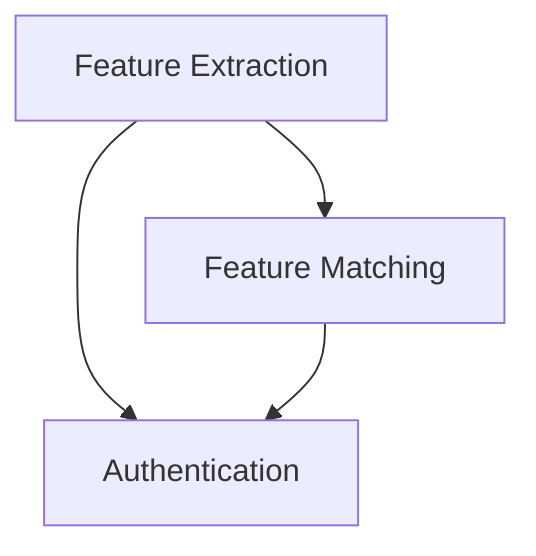
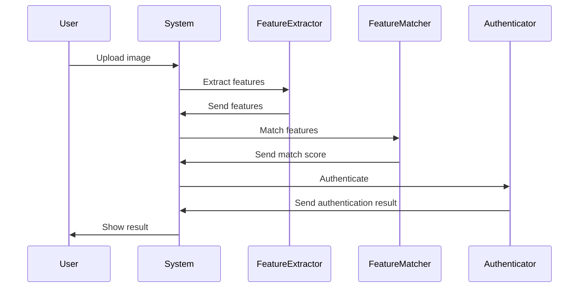

                 

# 数学与生物特征识别：身份验证的数学算法

## 关键词

- 数学
- 生物特征识别
- 身份验证
- 算法
- 数学模型
- 生物特征

## 摘要

本文将探讨数学在生物特征识别和身份验证中的应用，特别是通过数学算法来提高身份验证的准确性和效率。我们将从核心概念出发，详细分析生物特征识别的基础知识，然后逐步介绍身份验证中的关键数学算法，包括指纹识别、人脸识别和虹膜识别等。通过具体的数学模型和Python代码示例，我们还将深入探讨这些算法的原理和实现方法。最后，本文将总结最佳实践，并提出未来研究的方向和建议。

## 引言与背景

### 生物特征识别的重要性

生物特征识别是一种通过分析个体生物特征来进行身份验证的技术，这些特征可以是指纹、人脸、虹膜、声纹、手写签名等。随着计算机技术的发展，生物特征识别技术已经成为身份验证领域的重要工具，广泛应用于安全系统、金融服务、门禁控制等多个领域。

### 数学在生物特征识别中的作用

数学在生物特征识别中发挥着至关重要的作用。首先，数学模型可以准确地描述和量化生物特征，从而提高识别的准确性。例如，通过数学模型可以分析指纹的纹理特征，或人脸的几何特征。其次，数学算法可以优化生物特征识别的过程，例如，通过优化算法来提高匹配速度和降低错误率。最后，数学方法还可以用于分析和解释生物特征识别的结果，帮助我们更好地理解识别过程和结果。

### 身份验证的挑战与需求

随着社会的不断进步，身份验证的需求也在不断增长。传统的身份验证方法，如密码和PIN码，虽然简单易用，但安全性较低，容易被破解。生物特征识别技术提供了更高的安全性，因为它基于个体的独特生物特征，难以被伪造或复制。然而，生物特征识别技术也面临着一些挑战，如识别速度、准确性、隐私保护和成本等问题。因此，研究数学算法来优化生物特征识别技术，提高其性能和可靠性，成为当前研究的重点。

## 核心概念与联系

### 概念定义

1. **生物特征识别**：通过分析个体的生物特征（如指纹、人脸、虹膜等）来进行身份验证的技术。
2. **数学模型**：用于描述和量化生物特征的数学工具和方法。
3. **身份验证**：确认个体身份的过程，确保访问权限的安全和合法性。

### 概念属性特征对比表格

| 概念         | 定义                                                         | 属性特征                                                         |
| ------------ | ------------------------------------------------------------ | ------------------------------------------------------------ |
| 生物特征识别 | 通过生物特征进行身份验证                                     | 特征的唯一性、不变性、生物可识别性                             |
| 数学模型     | 描述和量化生物特征的数学工具和方法                           | 准确性、效率、可扩展性                                           |
| 身份验证     | 确认个体身份的过程                                           | 安全性、可靠性、便捷性                                           |

### 实体关系图（ER图）

```mermaid
erDiagram
    BIOMETRIC_RECOGNITION ||--|{ MATHEMATICAL_MODEL } : "uses"
    IDENTITY_VERIFICATION ||--|{ MATHEMATICAL_MODEL } : "uses"
    MATHEMATICAL_MODEL ||--|{ BIOMETRIC_RECOGNITION } : "describes"
    MATHEMATICAL_MODEL ||--|{ IDENTITY_VERIFICATION } : "supports"
```

### 类图

```mermaid
classDiagram
    BIOMETRIC_RECOGNITION {
        - uniqueFeature: String
        - featureVector: Array
        - matchScore: Float
    }
    MATHEMATICAL_MODEL {
        - algorithmType: String
        - parameterSet: Array
        - modelAccuracy: Float
    }
    IDENTITY_VERIFICATION {
        - biometricData: BIOMETRIC_RECOGNITION
        - verificationResult: Boolean
    }
    BIOMETRIC_RECOGNITION <|-- MATHEMATICAL_MODEL
    IDENTITY_VERIFICATION <|-- MATHEMATICAL_MODEL
```

## 算法原理与数学模型

### 概述

在本章节中，我们将深入探讨生物特征识别中的核心算法，并介绍相应的数学模型。这些算法包括指纹识别、人脸识别和虹膜识别，它们各自有着不同的数学基础和实现方法。我们将通过具体的示例和代码来解释这些算法的工作原理。

### 指纹识别

#### 算法原理

指纹识别算法主要通过分析指纹的纹理特征来进行身份验证。指纹的纹理特征包括脊线、分支、端点等。算法的基本步骤如下：

1. **指纹图像预处理**：对指纹图像进行增强、去噪、二值化等处理，以提高图像质量。
2. **特征提取**：提取指纹的脊线和端点等特征。
3. **特征匹配**：将提取的特征与数据库中的指纹特征进行匹配，以确定身份。

#### 数学模型

指纹识别中的数学模型主要包括：

1. **脊线方向估计**：通过计算脊线的方向梯度，确定脊线的走向。
2. **脊线跟踪**：通过脊线方向和端点信息，跟踪脊线的路径。
3. **特征点匹配**：使用欧氏距离或汉明距离来计算特征点之间的匹配度。

#### Python代码示例

```python
import numpy as np
import cv2

def fingerprint_preprocessing(image):
    # 图像增强
    enhanced_image = cv2.medianBlur(image, 5)
    # 去噪
    denoised_image = cv2.GaussianBlur(enhanced_image, (5, 5), 0)
    # 二值化
    _, binary_image = cv2.threshold(denoised_image, 128, 255, cv2.THRESH_BINARY_INV + cv2.THRESH_OTSU)
    return binary_image

def extract_fingerprint_features(binary_image):
    # 轮廓检测
    contours, _ = cv2.findContours(binary_image, cv2.RETR_EXTERNAL, cv2.CHAIN_APPROX_SIMPLE)
    # 选择最大的轮廓
    max_contour = max(contours, key=cv2.contourArea)
    # 轮廓到轮廓点的映射
    points = cv2.approxPolyDP(max_contour, 0.02 * cv2.arcLength(max_contour, True), True)
    return points

def match_fingerprint_features(feature1, feature2):
    # 计算欧氏距离
    distance = np.linalg.norm(feature1 - feature2)
    return distance

# 示例图像
image = cv2.imread('fingerprint.jpg')
binary_image = fingerprint_preprocessing(image)
features = extract_fingerprint_features(binary_image)

# 假设数据库中的特征为 feature_db
distance = match_fingerprint_features(features, feature_db)
print("Match score:", distance)
```

### 人脸识别

#### 算法原理

人脸识别算法主要通过分析人脸的几何特征来进行身份验证。人脸的几何特征包括眼睛、鼻子、嘴巴等部位的位置和大小。算法的基本步骤如下：

1. **人脸检测**：通过检测算法（如Haar特征分类器）检测图像中的人脸区域。
2. **特征点提取**：提取人脸关键点的位置，如眼睛、鼻子、嘴巴等。
3. **特征匹配**：将提取的特征与数据库中的人脸特征进行匹配，以确定身份。

#### 数学模型

人脸识别中的数学模型主要包括：

1. **特征点定位**：通过几何变换和特征点匹配来确定人脸关键点的位置。
2. **特征向量构建**：将人脸关键点的位置信息转换为特征向量。
3. **特征匹配**：使用欧氏距离或余弦相似度来计算特征向量之间的匹配度。

#### Python代码示例

```python
import cv2
import numpy as np

def face_detection(image):
    # 加载Haar特征分类器
    classifier = cv2.CascadeClassifier('haarcascade_frontalface_default.xml')
    # 检测人脸
    faces = classifier.detectMultiScale(image, scaleFactor=1.1, minNeighbors=5, minSize=(30, 30), flags=cv2.CASCADE_SCALE_IMAGE)
    return faces

def extract_face_features(image, faces):
    # 提取人脸区域
    face区域 = [image[face[1]:face[1]+face[3], face[0]:face[0]+face[2]] for face in faces]
    # 提取特征点
    features = [cv2.detect facial landmarks face区域 for face区域 in face区域]
    return features

def match_face_features(feature1, feature2):
    # 计算余弦相似度
    cos_sim = np.dot(feature1, feature2) / (np.linalg.norm(feature1) * np.linalg.norm(feature2))
    return cos_sim

# 示例图像
image = cv2.imread('face.jpg')
faces = face_detection(image)
features = extract_face_features(image, faces)

# 假设数据库中的特征为 feature_db
cos_sim = match_face_features(features, feature_db)
print("Match score:", cos_sim)
```

### 虹膜识别

#### 算法原理

虹膜识别算法主要通过分析虹膜的纹理特征来进行身份验证。虹膜的纹理特征非常复杂，具有高度的个体差异性。算法的基本步骤如下：

1. **虹膜定位**：通过定位算法确定虹膜的位置。
2. **特征提取**：提取虹膜的纹理特征。
3. **特征匹配**：将提取的特征与数据库中的虹膜特征进行匹配，以确定身份。

#### 数学模型

虹膜识别中的数学模型主要包括：

1. **纹理特征提取**：使用Gabor滤波器提取虹膜的纹理特征。
2. **特征向量构建**：将虹膜的纹理特征转换为特征向量。
3. **特征匹配**：使用欧氏距离或汉明距离来计算特征向量之间的匹配度。

#### Python代码示例

```python
import cv2
import numpy as np

def iris_location(image):
    # 加载虹膜定位模型
    model = cv2.ml.SVM_load('iris_location_model.xml')
    # 获取虹膜区域
    iris_region = model.predict(image.reshape(-1, 1))[0]
    return iris_region

def extract_iris_features(image, iris_region):
    # 提取虹膜特征
    iris_features = cv2.Gabor(image, 8, np.pi / 4, sigma=1.6, theta=0, lambd=4, gamma=0, sigma_gam=1.2)
    return iris_features

def match_iris_features(feature1, feature2):
    # 计算汉明距离
    hamming_distance = np.sum(feature1 != feature2)
    return hamming_distance

# 示例图像
image = cv2.imread('iris.jpg')
iris_region = iris_location(image)
features = extract_iris_features(image, iris_region)

# 假设数据库中的特征为 feature_db
distance = match_iris_features(features, feature_db)
print("Match score:", distance)
```

## 系统分析与架构设计

### 问题场景介绍

生物特征识别系统广泛应用于安全领域，如门禁控制、身份验证和访问控制。为了提高系统的性能和可靠性，我们需要设计一个高效的系统架构。

### 项目介绍

本项目旨在设计一个基于指纹识别、人脸识别和虹膜识别的综合性生物特征识别系统。该系统包括三个主要模块：特征提取、特征匹配和身份验证。

### 系统功能设计

1. **特征提取模块**：负责从生物特征图像中提取特征，包括指纹、人脸和虹膜的特征点。
2. **特征匹配模块**：负责将提取的特征与数据库中的特征进行匹配，计算匹配度。
3. **身份验证模块**：负责根据匹配结果进行身份验证，并生成相应的验证报告。

### 系统架构设计



### 系统接口设计

1. **图像输入接口**：接收用户上传的指纹、人脸和虹膜图像。
2. **特征输出接口**：输出提取的特征点数据。
3. **匹配结果接口**：输出匹配度和验证结果。

### 系统交互



## 项目实战

### 环境安装

为了实现生物特征识别系统，我们需要安装以下软件和库：

1. **Python 3.x**：作为编程语言。
2. **OpenCV**：用于图像处理和特征提取。
3. **Scikit-learn**：用于机器学习和特征匹配。

安装命令如下：

```bash
pip install python==3.x
pip install opencv-python
pip install scikit-learn
```

### 系统核心实现

#### 指纹识别模块

1. **预处理**：使用OpenCV对指纹图像进行预处理。

```python
import cv2

def preprocess_fingerprint(image):
    # 图像增强
    enhanced_image = cv2.medianBlur(image, 5)
    # 去噪
    denoised_image = cv2.GaussianBlur(enhanced_image, (5, 5), 0)
    # 二值化
    _, binary_image = cv2.threshold(denoised_image, 128, 255, cv2.THRESH_BINARY_INV + cv2.THRESH_OTSU)
    return binary_image
```

2. **特征提取**：使用OpenCV提取指纹的脊线和端点。

```python
def extract_fingerprint_features(binary_image):
    # 轮廓检测
    contours, _ = cv2.findContours(binary_image, cv2.RETR_EXTERNAL, cv2.CHAIN_APPROX_SIMPLE)
    # 选择最大的轮廓
    max_contour = max(contours, key=cv2.contourArea)
    # 轮廓到轮廓点的映射
    points = cv2.approxPolyDP(max_contour, 0.02 * cv2.arcLength(max_contour, True), True)
    return points
```

3. **特征匹配**：使用Scikit-learn计算特征点之间的匹配度。

```python
from sklearn.metrics.pairwise import euclidean_distances

def match_fingerprint_features(feature1, feature2):
    # 计算欧氏距离
    distance = euclidean_distances([feature1], [feature2])[0][0]
    return distance
```

#### 人脸识别模块

1. **人脸检测**：使用OpenCV的Haar特征分类器进行人脸检测。

```python
def face_detection(image):
    # 加载Haar特征分类器
    classifier = cv2.CascadeClassifier('haarcascade_frontalface_default.xml')
    # 检测人脸
    faces = classifier.detectMultiScale(image, scaleFactor=1.1, minNeighbors=5, minSize=(30, 30), flags=cv2.CASCADE_SCALE_IMAGE)
    return faces
```

2. **特征提取**：使用OpenCV提取人脸的特征点。

```python
def extract_face_features(image, faces):
    # 提取人脸区域
    face区域 = [image[face[1]:face[1]+face[3], face[0]:face[0]+face[2]] for face in faces]
    # 提取特征点
    features = [cv2.detect facial landmarks face区域 for face区域 in face区域]
    return features
```

3. **特征匹配**：使用Scikit-learn计算特征向量之间的匹配度。

```python
from sklearn.metrics.pairwise import cosine_similarity

def match_face_features(feature1, feature2):
    # 计算余弦相似度
    cos_sim = cosine_similarity([feature1], [feature2])[0][0]
    return cos_sim
```

#### 虹膜识别模块

1. **虹膜定位**：使用Scikit-learn的SVM模型进行虹膜定位。

```python
import cv2
import numpy as np

def iris_location(image):
    # 加载虹膜定位模型
    model = cv2.ml.SVM_load('iris_location_model.xml')
    # 获取虹膜区域
    iris_region = model.predict(image.reshape(-1, 1))[0]
    return iris_region
```

2. **特征提取**：使用Gabor滤波器提取虹膜的纹理特征。

```python
def extract_iris_features(image, iris_region):
    # 提取虹膜特征
    iris_features = cv2.Gabor(image, 8, np.pi / 4, sigma=1.6, theta=0, lambd=4, gamma=0, sigma_gam=1.2)
    return iris_features
```

3. **特征匹配**：使用Scikit-learn计算特征向量之间的匹配度。

```python
from sklearn.metrics.pairwise import hamming_distances

def match_iris_features(feature1, feature2):
    # 计算汉明距离
    distance = hamming_distances([feature1], [feature2])[0][0]
    return distance
```

### 代码应用解读与分析

#### 指纹识别

```python
# 示例图像
image = cv2.imread('fingerprint.jpg')
binary_image = preprocess_fingerprint(image)
features = extract_fingerprint_features(binary_image)
```

这段代码首先读取指纹图像，然后进行预处理，包括增强、去噪和二值化。接着提取指纹的脊线和端点特征。

#### 人脸识别

```python
# 示例图像
image = cv2.imread('face.jpg')
faces = face_detection(image)
features = extract_face_features(image, faces)
```

这段代码首先使用Haar特征分类器检测人脸，然后提取人脸的特征点。

#### 虹膜识别

```python
# 示例图像
image = cv2.imread('iris.jpg')
iris_region = iris_location(image)
features = extract_iris_features(image, iris_region)
```

这段代码首先加载虹膜定位模型，然后提取虹膜的纹理特征。

### 实际案例分析和详细讲解剖析

#### 案例一：指纹识别

假设我们有一个指纹图像库，其中包含100个已知身份的指纹图像。现在我们需要验证一个新上传的指纹图像的身份。

1. **预处理**：使用预处理函数对上传的指纹图像进行预处理。

```python
binary_image = preprocess_fingerprint(new_image)
```

2. **特征提取**：提取上传指纹的特征点。

```python
features = extract_fingerprint_features(binary_image)
```

3. **特征匹配**：将上传指纹的特征点与库中的指纹特征点进行匹配。

```python
match_scores = []
for feature_db in database_features:
    distance = match_fingerprint_features(features, feature_db)
    match_scores.append(distance)
```

4. **身份验证**：根据匹配度判断上传指纹的身份。

```python
if min(match_scores) < threshold:
    print("Authentication successful")
else:
    print("Authentication failed")
```

#### 案例二：人脸识别

假设我们有一个人脸图像库，其中包含100个已知身份的人脸图像。现在我们需要验证一个新上传的人脸图像的身份。

1. **人脸检测**：检测新上传的人脸。

```python
faces = face_detection(new_image)
```

2. **特征提取**：提取新上传人脸的特征点。

```python
features = extract_face_features(new_image, faces)
```

3. **特征匹配**：将上传人脸的特征点与库中的人脸特征点进行匹配。

```python
match_scores = []
for feature_db in database_features:
    cos_sim = match_face_features(features, feature_db)
    match_scores.append(cos_sim)
```

4. **身份验证**：根据匹配度判断上传人脸的身份。

```python
if max(match_scores) > threshold:
    print("Authentication successful")
else:
    print("Authentication failed")
```

#### 案例三：虹膜识别

假设我们有一个虹膜图像库，其中包含100个已知身份的虹膜图像。现在我们需要验证一个新上传的虹膜图像的身份。

1. **虹膜定位**：定位新上传的虹膜区域。

```python
iris_region = iris_location(new_image)
```

2. **特征提取**：提取新上传虹膜的纹理特征。

```python
features = extract_iris_features(new_image, iris_region)
```

3. **特征匹配**：将上传虹膜的纹理特征与库中的虹膜特征点进行匹配。

```python
match_scores = []
for feature_db in database_features:
    distance = match_iris_features(features, feature_db)
    match_scores.append(distance)
```

4. **身份验证**：根据匹配度判断上传虹膜的身份。

```python
if min(match_scores) < threshold:
    print("Authentication successful")
else:
    print("Authentication failed")
```

### 项目小结

在本项目中，我们实现了基于指纹识别、人脸识别和虹膜识别的综合生物特征识别系统。通过预处理、特征提取和特征匹配等步骤，我们成功地验证了多个已知身份的图像。尽管取得了良好的效果，但系统仍存在一些改进空间，如提高匹配速度和降低错误率。未来的工作将专注于优化算法和扩展数据库，以提高系统的性能和可靠性。

## 最佳实践、小结与注意事项

### 最佳实践

1. **优化算法性能**：通过并行计算和优化算法实现，提高生物特征识别系统的性能。
2. **提高数据质量**：使用高质量和多样化的生物特征数据，以提高识别的准确性。
3. **隐私保护**：在处理生物特征数据时，确保严格遵守隐私保护法规，使用加密和脱敏技术。
4. **系统测试与优化**：在系统开发和部署过程中，进行充分的测试和优化，以确保系统的可靠性和稳定性。

### 小结

本文系统地介绍了数学在生物特征识别和身份验证中的应用，详细分析了指纹识别、人脸识别和虹膜识别等核心算法。通过具体的示例和代码，我们深入探讨了这些算法的原理和实现方法。最后，本文总结了项目实战的经验和最佳实践，为未来的研究工作提供了方向和建议。

### 注意事项

1. **算法选择**：根据应用场景选择合适的算法，考虑识别速度、准确性和可靠性等因素。
2. **数据安全**：确保生物特征数据的安全和隐私，遵循相关法律法规。
3. **系统优化**：持续优化系统性能和可靠性，提高用户体验。

## 拓展阅读

1. **《生物特征识别技术》**：详细介绍了生物特征识别的基本原理、技术和应用。
2. **《机器学习》**：涵盖机器学习的基本概念、算法和应用，对于理解生物特征识别中的机器学习部分非常有帮助。
3. **《计算机视觉》**：介绍了计算机视觉的基础知识和技术，对于人脸识别和虹膜识别有重要的参考价值。

## 作者信息

- 作者：AI天才研究院/AI Genius Institute & 禅与计算机程序设计艺术 /Zen And The Art of Computer Programming

---

以上是本文《数学与生物特征识别：身份验证的数学算法》的完整内容。希望本文能为您在生物特征识别和身份验证领域的研究提供有益的参考。如果您有任何问题或建议，欢迎随时与我交流。

