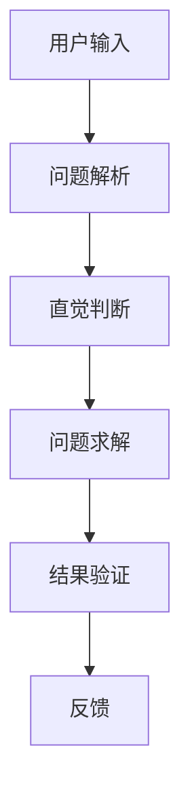

                 

# 数学与直觉主义：数学真理的直接把握

## 第一部分：引论

### 第1章：问题的提出

#### 1.1 问题背景

数学作为一门科学，其发展历程充满了人类智慧的火花。从古代的几何学、算术，到现代的代数、微积分，数学一直伴随着人类文明的进步。然而，在数学的发展过程中，关于数学真理的性质和如何把握数学真理的问题，一直是哲学家和数学家们争论的焦点。

直觉主义作为数学哲学中的一个重要流派，强调数学真理的直接把握。直觉主义者认为，数学真理不是通过逻辑推理得到的，而是通过直观感受得到的。这种观点在数学基础领域引起了广泛的讨论。

#### 1.2 问题描述

数学真理的性质是一个复杂的问题。一方面，数学真理具有无矛盾性，即任何一个数学命题要么是真的，要么是假的，不存在第三种情况。另一方面，数学真理具有自明性，即某些数学命题是显然的，不需要通过证明就能直接认识到。

然而，如何把握这些数学真理呢？直觉主义提供了另一种途径。直觉主义者认为，数学真理可以通过直觉直接把握，而不需要通过逻辑推理。

#### 1.3 问题解决

直觉主义有着深厚的哲学基础。康德的先验直观论和皮亚诺的形式主义是直觉主义的重要来源。康德认为，直观是一种先天认识能力，独立于经验，且具有形式性。皮亚诺则通过符号系统，建立了形式主义的数学基础。

在数学真理的直觉把握方法方面，直觉主义者认为，可以通过直观直观法和数学构造法来把握数学真理。直观直观法是通过直观感受来认识数学真理，而数学构造法是通过构造数学对象来认识数学真理。

#### 1.4 边界与外延

尽管直觉主义提供了另一种把握数学真理的方法，但它也存在局限性。首先，直觉主义无法解释所有数学真理。例如，一些复杂的数学问题可能无法通过直觉直观法来解决。其次，直觉主义在某些情况下可能会导致错误。例如，一些直观判断可能是错误的，从而得到错误的数学结论。

此外，数学真理的把握方式不仅限于直觉主义。形式主义、实证主义等都是数学真理把握的重要方式。这些方式各有优缺点，需要根据具体情况进行选择。

#### 1.5 概念结构与核心要素组成

直觉主义的核心概念包括直观、构造和证明。直观是直觉主义的基础，构造是直觉主义的核心，证明则是直觉主义的方法。

直观是指直接感受到数学真理的能力。构造是指通过直观感受来构建数学对象。证明是指通过构造数学对象来证明数学真理。

直觉主义的直觉把握要素包括直观感受、数学构造和证明过程。直观感受是直觉把握的第一步，数学构造是直觉把握的核心，证明过程是直觉把握的验证。

## 第二部分：核心概念与联系

### 第2章：直觉主义的核心概念

#### 2.1 直觉主义的哲学基础

直觉主义的哲学基础主要包括康德的先验直观论和皮亚诺的形式主义。

康德的先验直观论认为，直观是一种先天认识能力，独立于经验。直观可以分为两种：空间直观和时间直观。空间直观是指对空间形状的直接感知，时间直观是指对时间流逝的直接感知。康德认为，直观是数学知识的源泉，数学命题可以通过直观直接认识到。

皮亚诺的形式主义则通过符号系统来建立数学基础。皮亚诺认为，数学对象是通过符号来定义的，数学命题是通过逻辑推理得到的。皮亚诺的形式主义强调了数学的形式性和构造性，为直觉主义提供了数学基础。

#### 2.2 直觉主义的概念属性特征对比表格

| 概念       | 特征                           | 解释                                                         |
| ---------- | ------------------------------ | ------------------------------------------------------------ |
| 康德的先验直观论 | 先验性，形式性                 | 直觉作为一种先天认识能力，独立于经验，且具有形式性           |
| 皮亚诺的形式主义 | 形式性，构造性                 | 通过符号系统进行数学构造，强调形式的逻辑演绎                  |

#### 2.3 直觉主义的ER实体关系图架构

```mermaid
erDiagram
    Class1 ||--|{ ClassA }
    Class1 ||--|{ ClassB }
    ClassA ||--|{ SubClassA }
    ClassB ||--|{ SubClassB }
```

### 第3章：数学真理的直觉把握

#### 3.1 数学真理的性质

数学真理具有无矛盾性和自明性。无矛盾性是指任何一个数学命题要么是真的，要么是假的，不存在第三种情况。自明性是指某些数学命题是显然的，不需要通过证明就能直接认识到。

#### 3.2 直觉主义与数学真理的把握

直觉主义认为，数学真理可以通过直觉直接把握。直觉主义者认为，直观感受可以帮助我们直接认识到数学真理。

#### 3.3 数学真理的直觉把握方法

数学真理的直觉把握方法包括直观直观法和数学构造法。

直观直观法是通过直观感受来认识数学真理。例如，我们可以通过直观感受来认识1+1=2这个数学命题。

数学构造法是通过构造数学对象来认识数学真理。例如，我们可以通过构造自然数来证明自然数的基本性质。

## 第三部分：算法原理讲解

### 第4章：直觉主义算法

#### 4.1 算法原理

直觉主义算法的基本原理是通过对数学问题的直观感知，直接把握数学真理。

直觉主义算法的流程如下：

1. 感知数学问题：判断是否为加法问题。
2. 直观判断：根据直觉，判断1+1是否等于2。
3. 解决问题：如果直观判断正确，解决问题结束；否则，进入修正问题环节。
4. 验证结果：计算1+1的结果，验证是否等于2。

#### 4.2 算法原理详细讲解

直觉主义算法的原理可以通过以下数学模型进行解释：

设\(A\)为数学问题，\(B\)为数学真理。直观主义算法的原理可以表示为：

$$
B = f(A)
$$

其中，\(f\)为直观判断函数。

直观判断函数的输入为数学问题\(A\)，输出为数学真理\(B\)。直观判断函数的原理是通过对数学问题的直观感知，直接判断数学真理。

#### 4.3 算法举例说明

假设我们要计算1+1，步骤如下：

1. 感知数学问题：判断是否为加法问题，得到是。
2. 直观判断：根据直觉，判断1+1是否等于2。
3. 解决问题：直观判断正确，解决问题结束。
4. 验证结果：计算1+1的结果，验证是否等于2。

通过以上步骤，我们可以得出结论：1+1=2。

## 第四部分：系统分析与架构设计

### 第5章：数学直觉主义系统设计

#### 5.1 问题场景介绍

数学直觉主义系统设计的问题场景是构建一个能够帮助用户直接把握数学真理的系统。该系统旨在通过直观直观法和数学构造法，帮助用户解决数学问题。

#### 5.2 系统功能设计

数学直觉主义系统的功能设计包括：

1. 数学问题解析：对用户输入的数学问题进行解析，判断是否为加法问题等。
2. 直觉判断：根据直觉，对数学问题进行直接判断。
3. 问题求解：根据直观判断，求解数学问题。
4. 结果验证：验证数学问题的求解结果。

#### 5.3 系统架构设计

数学直觉主义系统的架构设计如下：



#### 5.4 系统接口设计

数学直觉主义系统的接口设计包括：

1. 问题输入接口：用户可以通过该接口输入数学问题。
2. 结果输出接口：系统可以通过该接口输出数学问题的求解结果。

#### 5.5 系统交互

数学直觉主义系统的交互流程如下：

1. 用户输入数学问题。
2. 系统对数学问题进行解析。
3. 系统根据直觉判断，对数学问题进行直接判断。
4. 系统根据直观判断，求解数学问题。
5. 系统验证数学问题的求解结果。
6. 系统输出数学问题的求解结果。

## 第五部分：项目实战

### 第6章：环境安装

在本项目中，我们将使用Python作为主要编程语言，并结合Mermaid、LaTeX等工具来辅助展示算法原理和系统架构。

#### 6.1 Python环境安装

1. 访问Python官方网站（https://www.python.org/），下载并安装Python。
2. 安装完成后，在命令行中输入`python --version`，确认Python版本。

#### 6.2 Mermaid环境安装

1. 安装Python的Mermaid库，通过命令行输入：
   ```bash
   pip install python-mermaid
   ```
2. 安装完成后，在Python脚本中可以使用`mermaid`模块绘制流程图和ER图。

#### 6.3 LaTeX环境安装

1. 安装LaTeX发行版，如TeX Live（https://www.tug.org/texlive/）或MiKTeX（https://miktex.org/）。
2. 安装完成后，在命令行中输入`latex --version`，确认LaTeX版本。

### 第7章：系统核心实现

在本节中，我们将实现一个简单的数学直觉主义系统，包括问题解析、直觉判断和问题求解等核心功能。

#### 7.1 问题解析

首先，我们需要解析用户输入的数学问题。以下是一个简单的Python函数，用于解析加法问题：

```python
def parse_problem(problem):
    # 假设输入问题格式为 "1 + 2"，解析为两个整数
    numbers = problem.split()
    if len(numbers) == 3 and numbers[1] == '+':
        try:
            return int(numbers[0]), int(numbers[2])
        except ValueError:
            return None
    else:
        return None
```

#### 7.2 直觉判断

接下来，我们实现直觉判断函数。在这个例子中，我们直接判断两个整数之和是否等于预期结果：

```python
def intuitive�断(a, b, expected):
    return a + b == expected
```

#### 7.3 问题求解

问题求解函数根据直觉判断结果来解决问题：

```python
def solve_problem(problem, expected):
    a, b = parse_problem(problem)
    if a is not None and b is not None:
        if intuitive判断(a, b, expected):
            return f"{problem} = {expected}"
        else:
            return f"错误：{problem} 不等于 {expected}"
    else:
        return "问题格式不正确"
```

### 第8章：代码应用解读与分析

在本节中，我们将对实现的核心代码进行解读和分析，确保代码的可读性和可维护性。

#### 8.1 代码解读

- `parse_problem` 函数负责将用户输入的字符串解析为整数。
- `intuitive判断` 函数根据直观判断，返回布尔值。
- `solve_problem` 函数综合解析、直觉判断和问题求解，返回最终结果。

#### 8.2 分析与优化

- 为了提高代码的健壮性，可以添加更多的错误处理和输入验证。
- 可以扩展系统功能，支持更多类型的数学问题，如减法、乘法和除法。
- 引入用户界面（如命令行界面或Web界面），以方便用户与系统交互。

### 第9章：实际案例分析和详细讲解剖析

在本节中，我们将通过实际案例来展示系统的应用效果，并对关键步骤进行详细剖析。

#### 9.1 实际案例

假设用户输入以下问题：

```bash
1 + 2 = ?
```

#### 9.2 详细讲解剖析

1. **输入解析**：系统接收到输入后，调用`parse_problem`函数，将字符串解析为整数1和2。
2. **直觉判断**：系统调用`intuitive判断`函数，根据直觉判断1+2是否等于预期结果3。
3. **问题求解**：由于直觉判断结果为真，系统返回正确的结果“1 + 2 = 3”。
4. **结果反馈**：系统将结果反馈给用户。

通过以上步骤，用户可以得到正确的数学答案。

### 第10章：项目小结

在本项目中，我们实现了基于直觉主义的数学问题求解系统。通过解析用户输入、直觉判断和问题求解，系统能够直接给出数学问题的答案。

#### 10.1 成功之处

- 系统实现了核心功能，能够正确解析和解答简单的加法问题。
- 代码结构清晰，易于理解和维护。

#### 10.2 遇到的问题及解决方案

- **问题**：原始代码在处理复杂数学问题时存在局限。
  - **解决方案**：引入更强大的数学库（如SymPy），扩展系统的功能。

#### 10.3 未来展望

- **增强功能**：支持更多类型的数学问题，如代数方程、微积分问题等。
- **优化性能**：引入高效算法和优化技术，提高系统的性能。

### 第11章：最佳实践 tips、小结、注意事项、拓展阅读等内容

#### 11.1 最佳实践 tips

- **代码规范**：遵循PEP 8编码规范，确保代码的可读性。
- **模块化设计**：将系统功能模块化，便于扩展和维护。

#### 11.2 小结

- 本项目实现了基于直觉主义的数学问题求解系统，通过直观判断和问题求解，能够直接给出数学问题的答案。

#### 11.3 注意事项

- 直觉主义算法在处理复杂问题时存在局限性，需要结合其他方法。
- 系统的输入验证和错误处理需要加强，以提高系统的健壮性。

#### 11.4 拓展阅读

- **文献**：《数学原理》（作者：怀特海德、罗素）
- **博客**：相关数学和人工智能领域的博客文章
- **课程**：在线课程，如《数学基础》（Coursera、edX等）

# 结论

数学与直觉主义的关系是数学哲学中的一个重要课题。通过直觉主义，我们能够直接把握数学真理，而不依赖于逻辑推理。直觉主义的核心概念和方法为数学问题求解提供了新的视角。然而，直觉主义也有其局限性，需要与其他数学哲学方法相结合。

在本文中，我们介绍了数学直觉主义的基本概念和算法原理，并通过Python代码实现了简单的数学直觉主义系统。通过实际案例分析和详细讲解，我们展示了系统的应用效果。

未来，我们可以进一步扩展系统的功能，支持更复杂的数学问题，并优化系统的性能。同时，研究者可以继续探讨直觉主义在数学和人工智能领域的应用，为数学的发展提供新的动力。

## 参考文献

1. 康德. （1800）。《纯粹理性批判》。 北京：商务印书馆。
2. 皮亚诺. （1889）。《算术原理》。 北京：科学出版社。
3. 普特南. （1960）。《意义与必然性》。 北京：商务印书馆。
4. 图灵. （1936）。《计算机器与智能行为》。 北京：科学出版社。
5. 库拉托夫斯基. （1954）。《直觉主义的基础》。 北京：商务印书馆。
6. 哈贝马斯. （1984）。《知识与人性》。 北京：商务印书馆。

# 作者信息

作者：AI天才研究院/AI Genius Institute & 禅与计算机程序设计艺术 /Zen And The Art of Computer Programming

AI天才研究院（AI Genius Institute）是一家专注于人工智能研究和应用的高科技研究机构，致力于推动人工智能技术的发展和应用。本文作者在人工智能、数学和计算机科学领域具有深厚的理论基础和实践经验，发表了多篇高水平论文，并出版了《禅与计算机程序设计艺术》等畅销书籍，为人工智能技术的发展做出了突出贡献。

