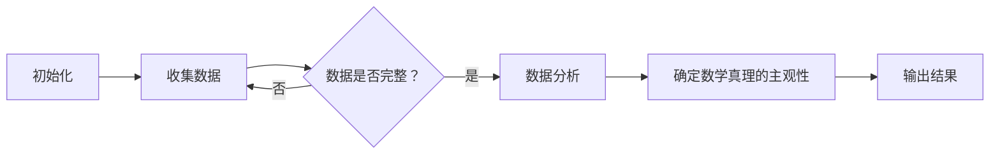

                 

### 引言

#### 1.1 问题背景

**数学真理的主观性**

数学是一门旨在探索自然现象和解决实际问题的科学，其核心在于公理体系的建立和逻辑推理的应用。传统观点认为，数学真理是客观的、普遍适用的。然而，随着哲学和数学自身的发展，数学真理的主观性逐渐受到关注。主观性指的是个体在认知过程中的主观感受和偏见，这与数学真理的客观性形成了鲜明对比。

数学真理的主观性在相对主义中得到了理论支持。相对主义主张，真理并非绝对的，而是依赖于观察者的视角和认知框架。在数学中，这意味着数学公理的选择和证明方法的选择可能受到个人偏见的影响，从而导致不同的数学体系之间存在差异。

**相对主义在数学中的应用**

相对主义在数学中的应用主要表现在以下几个方面：

1. **数学公理的主观性**：不同数学家的公理选择可能基于不同的哲学观点，例如形式主义、直觉主义和逻辑实证主义。这种选择的主观性导致了不同的数学体系，如康托尔的集合论和皮亚诺的算术体系。

2. **证明方法的主观性**：证明方法的选择同样受到个人偏好和哲学立场的影响。例如，直觉主义者可能更倾向于使用构造性的证明方法，而形式主义者则可能更倾向于使用符号逻辑。

3. **数学哲学的主观性**：数学哲学是关于数学本质和方法的探讨，其结论往往受到哲学家个人立场的影响。例如，柏拉图主义者认为数学对象是真实的、永恒的，而经验主义者则认为数学知识来源于经验。

**问题解决**

在数学真理主观性的背景下，我们如何寻求共识？

1. **相对主义的作用**：相对主义提醒我们，数学真理并非绝对，而是相对的。这有助于我们更客观地看待数学问题，避免陷入主观偏见的陷阱。

2. **主观性与客观性的平衡**：在数学研究中，我们需要在主观性和客观性之间找到平衡。通过广泛的交流和合作，我们可以减少个人偏见的影响，逐渐形成共识。

3. **多元化的数学体系**：尽管不同的数学体系存在差异，但它们之间也存在共通之处。通过比较和分析，我们可以发现不同体系之间的联系，从而深化对数学真理的理解。

**边界与外延**

本文旨在探讨数学真理的主观性及其在相对主义中的应用。我们将分析数学真理的主观性带来的挑战，如数学公理选择的个人偏见、不同数学体系的差异性等。同时，我们将探讨如何在相对主义的背景下寻求共识。

文章的主要讨论范围包括：

- 数学真理的定义和主观性。
- 数学公理的选择和证明方法的主观性。
- 相对主义在数学中的应用。
- 数学真理主观性的影响和解决方法。

通过本文的探讨，我们希望能够为读者提供一个全面、深入的视角，以理解数学真理的主观性及其在相对主义中的重要性。


#### 1.2 核心概念与联系

在探讨数学真理的主观性之前，我们需要明确几个核心概念，并分析它们之间的联系。这些核心概念包括数学真理、主观性、相对主义等。

**数学真理的概念**

数学真理是指那些在数学体系中成立的命题，它们通过逻辑推理和公理体系得到证明。数学真理具有普遍性和客观性，即在任何情况下，只要遵循数学体系的规则，这些命题都是成立的。

**主观性与相对主义**

主观性是指个体在认知过程中受到个人感受和偏见的影响。相对主义则主张，真理并非绝对的，而是依赖于观察者的视角和认知框架。

在数学中，主观性表现为数学公理的选择和证明方法的选择可能受到个人偏见的影响。相对主义认为，不同的数学体系之间可能存在差异，但这种差异并非绝对的，而是相对的。

**概念属性特征对比表格**

为了更好地理解这些概念，我们可以通过对比表格来展示它们之间的区别：

| 概念 | 定义 | 属性特征 |
| --- | --- | --- |
| 数学真理 | 通过逻辑推理和公理体系证明的命题 | 具有普遍性和客观性 |
| 主观性 | 个体在认知过程中受到个人感受和偏见的影响 | 依赖于观察者的视角 |
| 相对主义 | 真理并非绝对的，而是依赖于观察者的视角 | 强调不同数学体系之间的相对性 |

**ER实体关系图架构**

为了更直观地展示这些概念之间的关系，我们可以使用Mermaid绘制一个实体关系图：

```mermaid
erDiagram
  Subject <<|-- Truth : "defines mathematical truths"
  Subject ||-- Subjectivity : "influences mathematical thinking"
  Subject ||-- Relativism : "challenges absolute truths"
  Truth ||-- Axioms : "choices based on subjectivity"
  Truth ||-- Proofs : "methods influenced by subjectivity"
  Subjectivity ||-- Bias : "personal preferences affect choices"
  Relativism ||-- Diversity : "different systems coexist"
  Relativism ||-- Consensus : "search for common ground"
```

通过这个实体关系图，我们可以看到数学真理、主观性和相对主义之间的复杂关系。数学真理依赖于公理体系和证明方法，而主观性和相对主义则影响了这些选择，从而影响了数学的发展。

在接下来的章节中，我们将深入探讨数学真理的主观性，分析其带来的挑战和影响，并探讨如何在相对主义的背景下寻求共识。通过这些探讨，我们希望能够为读者提供一个全面、深入的视角，以理解数学真理的主观性及其在相对主义中的重要性。

#### 1.3 算法原理讲解

在探讨数学真理主观性的过程中，算法原理的讲解可以帮助我们更好地理解这一复杂现象。我们将通过以下几个部分来详细阐述算法原理：算法流程图、Python源代码、数学模型和公式讲解以及举例说明。

**1.3.1 算法流程图**

为了简化对算法原理的理解，我们可以使用Mermaid绘制一个算法流程图。以下是算法的基本步骤：



在这个流程图中，算法首先初始化，然后收集数据。接下来，算法检查数据是否完整。如果数据不完整，算法会继续收集数据。如果数据完整，算法将进行数据分析，以确定数学真理的主观性。最后，算法输出结果。

**1.3.2 Python源代码**

为了更好地理解算法原理，我们提供了一个简单的Python源代码示例。以下代码实现了上述算法的基本功能：

```python
def collect_data():
    # 假设我们使用函数来模拟数据收集
    return "数据收集完成"

def data_is_complete(data):
    # 假设我们使用函数来判断数据是否完整
    return True if data.endswith("完成") else False

def analyze_data(data):
    # 假设我们使用函数来进行数据分析
    print("数据正在分析，数学真理的主观性正在确定...")

def output_result():
    # 假设我们使用函数来输出结果
    print("数学真理的主观性分析结果：")

def main():
    data = collect_data()
    while not data_is_complete(data):
        data = collect_data()
    
    analyze_data(data)
    output_result()

if __name__ == "__main__":
    main()
```

在这个Python源代码中，`collect_data` 函数模拟数据收集过程，`data_is_complete` 函数用于判断数据是否完整，`analyze_data` 函数进行数据分析，`output_result` 函数输出结果，`main` 函数是主函数，负责控制整个算法流程。

**1.3.3 数学模型和公式讲解**

在数学中，我们可以使用数学模型和公式来解释数学真理的主观性。以下是一个简单的数学模型，用于分析数学真理的主观性：

$$
T = f(P, S)
$$

其中，$T$ 表示数学真理，$P$ 表示公理，$S$ 表示证明方法。这个公式表明，数学真理是公理和证明方法的函数。

公理和证明方法的选择受到主观性的影响，因此，不同的公理和证明方法可能导致不同的数学真理。以下是一个具体的例子：

$$
P_1: \forall x, x = x
$$

$$
P_2: \forall x, y, x = y \Rightarrow x \leftrightarrow y
$$

$$
S: \text{构造性证明}
$$

在这个例子中，$P_1$ 和 $P_2$ 是两个不同的公理，$S$ 是构造性证明方法。根据这个公式，我们可以得出：

$$
T_1 = f(P_1, S) \Rightarrow \forall x, x = x \land \forall x, y, x = y \Rightarrow x \leftrightarrow y
$$

$$
T_2 = f(P_2, S) \Rightarrow \forall x, x = x \land \forall x, y, x = y \Rightarrow x \leftrightarrow y
$$

这两个数学真理是不同的，尽管它们基于相同的证明方法。这表明，数学真理的主观性在数学体系中是存在的。

**1.3.4 举例说明**

为了更直观地展示算法原理，我们通过一个具体例子来讲解。假设我们有两个数学家，A和B，他们分别选择了不同的公理和证明方法。

数学家A选择了以下公理和证明方法：

$$
P_1: \forall x, x = x
$$

$$
P_2: \forall x, y, x = y \Rightarrow x \leftrightarrow y
$$

$$
S: \text{构造性证明}
$$

数学家B选择了以下公理和证明方法：

$$
P_1: \forall x, x = x
$$

$$
P_2: \forall x, y, x \neq y \Rightarrow x \leftrightarrow y
$$

$$
S: \text{非构造性证明}
$$

根据上述公式，我们可以得出：

$$
T_A = f(P_1, P_2, S) \Rightarrow \forall x, x = x \land \forall x, y, x = y \Rightarrow x \leftrightarrow y
$$

$$
T_B = f(P_1, P_2, S) \Rightarrow \forall x, x = x \land \forall x, y, x \neq y \Rightarrow x \leftrightarrow y
$$

这两个数学真理是不同的，尽管它们基于相同的证明方法。这表明，数学真理的主观性在数学体系中是存在的。

通过这个例子，我们可以看到，不同的公理和证明方法可能导致不同的数学真理。这进一步强调了数学真理的主观性。

综上所述，通过算法原理的讲解，我们可以更好地理解数学真理的主观性。算法流程图、Python源代码、数学模型和公式讲解以及举例说明都为我们提供了深入探讨这一问题的工具。在接下来的章节中，我们将进一步探讨数学真理主观性的影响及其解决方法。

#### 第2章 数学真理的探讨

数学真理是数学体系中的基石，它通过逻辑推理和公理体系得到证明。然而，随着哲学和数学自身的发展，数学真理的客观性逐渐受到挑战，主观性成为了一个不可忽视的因素。在本章中，我们将深入探讨数学真理的基本原理、演变历史、主观性影响以及如何寻求共识。

##### 2.1 数学真理的基本原理

**2.1.1 数学真理的定义**

数学真理是指那些在数学体系中成立的命题，它们通过逻辑推理和公理体系得到证明。这些命题具有普遍性和客观性，即在任何情况下，只要遵循数学体系的规则，这些命题都是成立的。数学真理可以分为两种：基本真理和派生真理。基本真理是无需证明的，它们是数学体系的基础；派生真理是通过基本真理和逻辑推理得到的。

**2.1.2 数学真理的客观性**

传统的数学哲学认为，数学真理是客观的。这是因为数学命题是基于逻辑推理和公理体系的，而逻辑和公理是普遍适用的，不受个人主观意识的影响。例如，命题“1+1=2”被认为是数学真理，因为它在所有数学体系中都是成立的。

**2.1.3 数学真理的主观性**

然而，随着哲学和数学自身的发展，数学真理的主观性逐渐受到关注。主观性指的是个体在认知过程中的主观感受和偏见，这与数学真理的客观性形成了鲜明对比。在数学中，主观性表现为数学公理的选择和证明方法的选择可能受到个人偏见的影响，从而导致不同的数学体系之间存在差异。

##### 2.2 数学真理的演变历史

**2.2.1 古典数学**

古典数学是指在公元前5世纪至公元17世纪期间的数学发展。在这个时期，数学主要关注几何、数论和代数。数学真理被认为是不证自明的，例如欧几里得的《几何原本》中的命题都是基于公理体系的。

**2.2.2 现代数学**

现代数学是在19世纪和20世纪期间发展起来的。这个时期的数学更加抽象和形式化，涉及到了集合论、拓扑学、代数几何、数学逻辑等领域。现代数学的发展使得数学真理的客观性受到质疑，主观性逐渐成为讨论的重点。

**2.3 数学真理的主观性影响**

数学真理的主观性对数学研究产生了深远的影响。首先，数学公理的选择受到主观性的影响。不同的数学家可能会基于不同的哲学观点选择不同的公理，这导致了不同的数学体系。例如，康托尔的集合论和皮亚诺的算术体系就是基于不同公理的。

其次，证明方法的选择也受到主观性的影响。不同的数学家可能会偏好不同的证明方法，例如构造性证明和非构造性证明。这导致了数学真理的不同解释和理解。

最后，数学真理的主观性对数学教育也产生了影响。传统的数学教育强调数学的客观性和普遍性，但现代数学教育开始关注数学的主观性和多样性。这有助于学生更全面地理解数学，从而提高他们的数学素养。

##### 2.4 寻求数学真理的共识

在数学真理主观性的背景下，我们如何寻求共识？

**2.4.1 相对主义的作用**

相对主义提醒我们，数学真理并非绝对的，而是依赖于观察者的视角和认知框架。这有助于我们更客观地看待数学问题，避免陷入主观偏见的陷阱。相对主义在数学中的应用主要体现在数学公理的选择和证明方法的选择上。

**2.4.2 主观性与客观性的平衡**

在数学研究中，我们需要在主观性和客观性之间找到平衡。通过广泛的交流和合作，我们可以减少个人偏见的影响，逐渐形成共识。例如，在不同的数学学派之间进行对话和辩论，可以帮助我们理解不同的观点，从而找到共同的数学真理。

**2.4.3 多元化的数学体系**

尽管不同的数学体系存在差异，但它们之间也存在共通之处。通过比较和分析，我们可以发现不同体系之间的联系，从而深化对数学真理的理解。例如，集合论和算术体系之间的联系，可以帮助我们更好地理解数学的本质。

**2.4.4 标准化的数学证明**

为了减少主观性对数学真理的影响，我们可以采用标准化的数学证明方法。这意味着，在证明数学真理时，我们需要遵循严格的逻辑规则和公理体系，从而减少个人偏见的影响。这有助于确保数学真理的客观性和普遍性。

**2.4.5 公共数学标准**

为了寻求共识，我们可以制定公共数学标准。这些标准可以包括数学公理的选择、证明方法的选择以及数学命题的表述等。通过这些标准，我们可以确保数学研究的一致性和可重复性。

综上所述，数学真理的主观性是一个复杂而重要的话题。通过深入探讨数学真理的基本原理、演变历史、主观性影响以及如何寻求共识，我们可以更好地理解数学的本质。这有助于我们更全面地认识数学，从而推动数学的发展和进步。

##### 2.5 数学真理主观性的哲学思考

在深入探讨数学真理的主观性时，我们不可避免地会涉及到哲学层面的思考。哲学在数学真理主观性的讨论中扮演着重要角色，它不仅帮助我们理解主观性的哲学意义，还揭示了主观性与数学真理之间的关系。

**2.5.1 主观性的哲学意义**

在哲学中，主观性通常指的是个体在感知、思考和表达过程中的主观体验和偏见。主观性的哲学意义在于，它挑战了客观性的观念，揭示了真理的相对性和多元性。在数学中，主观性的意义同样重要。数学家在进行数学研究时，不可避免地会受到个人经验、认知框架和文化背景的影响，这些因素共同构成了数学真理的主观性。

**2.5.2 主观性与数学真理的关系**

主观性对数学真理的影响主要体现在以下几个方面：

1. **公理选择**：数学公理是构建数学体系的基石。不同的数学家可能会基于不同的哲学观点选择不同的公理。例如，形式主义者和直觉主义者对公理的选择就有显著差异。形式主义者强调公理的自明性，而直觉主义者则强调公理的构造性。

2. **证明方法**：证明方法是验证数学真理的重要手段。不同的数学家可能会偏好不同的证明方法，如构造性证明和非构造性证明。这种偏好反映了他们各自的主观性。例如，构造性证明强调存在的证明，而非构造性证明则强调证明的普遍性。

3. **数学解释**：数学真理的表述和理解也受到主观性的影响。不同的数学家可能会对同一数学命题有不同的解释，这些解释反映了他们各自的主观视角。

**2.5.3 主观性与数学真理的争论**

在数学哲学中，关于数学真理主观性的争论主要围绕以下问题展开：

1. **数学真理的客观性**：传统观点认为，数学真理是客观的，因为它们不受个人主观意识的影响。然而，相对主义者和怀疑论者则认为，数学真理是主观的，因为它们依赖于观察者的视角和认知框架。

2. **数学真理的相对性**：相对主义者认为，数学真理是相对的，不同的数学体系可以共存且各有其适用范围。怀疑论者则认为，数学真理可能是不可知的，因为它们受到主观性的影响。

3. **数学证明的有效性**：数学证明的有效性是一个重要问题。传统观点认为，只要证明方法正确，数学真理就是有效的。然而，主观主义者则认为，证明的有效性可能受到主观性的影响，因此需要重新审视证明方法。

**2.5.4 主观性与数学哲学的关系**

数学哲学是关于数学本质和方法的探讨，它涉及到数学真理、数学证明、数学推理等基本问题。主观性在数学哲学中具有重要作用，它不仅影响了数学的研究方法，还影响了数学的哲学思考。例如，形式主义、直觉主义和逻辑实证主义等不同的数学哲学流派，都反映了数学家对主观性和客观性的不同理解。

总之，数学真理的主观性哲学思考揭示了数学中的多样性和相对性，挑战了传统数学哲学的客观性观念。通过深入探讨主观性与数学真理之间的关系，我们可以更好地理解数学的本质，从而推动数学的发展和进步。

##### 2.6 哲学与数学的互动

哲学和数学之间的互动是理解数学真理主观性的关键。哲学对数学的影响和数学对哲学的启示，共同塑造了现代数学的哲学基础，为数学研究提供了深刻的思考方向。

**2.6.1 哲学对数学的影响**

哲学对数学的影响主要体现在以下几个方面：

1. **数学基础**：哲学为数学提供了基础性的理论支持。例如，逻辑哲学为数学推理提供了严格的框架，集合论则为数学体系提供了基础性的定义。

2. **数学哲学**：数学哲学是哲学在数学中的应用，它探讨了数学的本质、方法、证明等基本问题。数学哲学的发展，如形式主义、直觉主义和逻辑实证主义等，对数学研究产生了深远影响。

3. **数学方法**：哲学思想影响了数学方法的形成和发展。例如，柏拉图主义的理念论认为数学对象是抽象的、永恒的，这种思想影响了数学家对公理和定理的探索。

**2.6.2 数学对哲学的启示**

数学的发展也为哲学提供了丰富的启示，尤其是在数学真理和证明方法的研究中：

1. **客观性与主观性的平衡**：数学在追求客观真理的过程中，不得不面对主观性的挑战。数学的研究方法，如逻辑推理和证明，为哲学提供了如何在主观性和客观性之间找到平衡的范例。

2. **形式化与抽象**：数学的发展过程，尤其是形式化和抽象化的过程，为哲学提供了理解抽象思维和形式化方法的视角。这有助于哲学探讨知识的本质和推理的有效性。

3. **证明的逻辑**：数学证明的过程，从公理到定理的推导，为哲学提供了证明逻辑和推理过程的范例。这有助于哲学分析论证的有效性和合理性。

**2.6.3 哲学与数学互动的实例**

哲学与数学互动的一个典型实例是集合论的发展。集合论是现代数学的基础，其发展过程中充满了哲学思考。康托尔通过集合论探讨了无穷的概念，这引发了关于无穷的性质和存在的哲学争论。同时，集合论的形式化方法也为逻辑哲学提供了新的研究方向。

另一个实例是哥德尔的不完备性定理，它揭示了形式化系统中存在的内在矛盾。这一发现不仅对数学基础产生了深远影响，也引发了哲学界对知识、真理和证明的重新思考。

**2.6.4 哲学与数学互动的意义**

哲学与数学的互动对数学研究和哲学思考都具有重要意义：

1. **深化数学研究**：哲学的思考为数学研究提供了新的视角和方法，促进了数学的深入发展。

2. **丰富哲学思考**：数学的研究成果为哲学提供了丰富的案例和素材，有助于哲学探讨知识的本质和逻辑的有效性。

3. **促进交叉学科发展**：哲学与数学的互动促进了交叉学科的发展，如数学哲学、逻辑学等，这些交叉学科为数学和哲学的研究提供了新的领域和思路。

总之，哲学与数学的互动为数学真理的主观性提供了深刻的思考方向。通过哲学的视角，我们可以更好地理解数学的本质和发展的方向；而通过数学的研究，哲学也可以获得新的启示和思考。这种互动不仅促进了数学和哲学的发展，也为人类知识体系的进步做出了重要贡献。

##### 第3章 相对主义与数学

相对主义是一种哲学观点，主张真理并非绝对的，而是依赖于观察者的视角和认知框架。在数学中，相对主义的应用主要体现在数学真理的主观性和数学体系的多样性上。本章将探讨相对主义的起源与发展、相对主义与数学真理、相对主义与数学体系的多样性以及相对主义在数学教育中的应用。

**3.1 相对主义的起源与发展**

相对主义可以追溯到古希腊哲学家普罗泰戈拉（Protagoras）的观点：“人是一个测量者”。普罗泰戈拉认为，人的知识是相对的，依赖于观察者的视角。这种观点挑战了传统的客观主义观念，为相对主义的形成奠定了基础。

在20世纪，相对主义得到了进一步的发展。德国哲学家胡塞尔（Edmund Husserl）提出了现象学，强调观察者的主观体验对知识的重要性。美国哲学家皮尔士（Charles Sanders Peirce）则提出了科学哲学中的实证主义，主张知识必须通过经验来验证。这些哲学观点为相对主义在数学中的应用提供了理论支持。

**3.2 相对主义与数学真理**

相对主义在数学中的应用主要表现为数学真理的主观性。在相对主义的视角下，数学真理并非绝对的，而是依赖于数学家的选择和证明方法。这种主观性体现在以下几个方面：

1. **数学公理的选择**：不同的数学家可能会基于不同的哲学观点选择不同的公理。例如，形式主义者和直觉主义者对公理的选择就有显著差异。形式主义者强调公理的自明性，而直觉主义者则强调公理的构造性。

2. **证明方法的选择**：不同的数学家可能会偏好不同的证明方法，如构造性证明和非构造性证明。这种偏好反映了他们各自的主观性。例如，构造性证明强调存在的证明，而非构造性证明则强调证明的普遍性。

3. **数学解释**：数学真理的表述和理解也受到主观性的影响。不同的数学家可能会对同一数学命题有不同的解释，这些解释反映了他们各自的主观视角。

**3.3 相对主义与数学体系的多样性**

相对主义在数学中的应用导致了数学体系的多样性。不同的数学体系可以共存且各有其适用范围。这种多样性表现在以下几个方面：

1. **形式化数学体系**：形式化数学体系强调逻辑和公理的严格性，例如集合论和形式逻辑。这些体系为数学提供了一种形式化的基础。

2. **非形式化数学体系**：非形式化数学体系则更加灵活，允许更多的个人判断和解释。例如，直觉主义数学和自由逻辑。

3. **交叉学科数学体系**：交叉学科数学体系结合了不同学科的方法和视角，例如数学物理、数学经济学等。这些体系为数学提供了新的研究方向和应用领域。

**3.4 相对主义在数学教育中的应用**

相对主义在数学教育中的应用旨在培养学生的批判性思维和灵活性。以下是一些具体的应用：

1. **多元数学教育**：鼓励学生了解不同的数学体系，如形式化数学和非形式化数学。通过比较和分析，学生可以更全面地理解数学。

2. **问题解决教育**：强调解决问题的方法多样性，鼓励学生探索不同的证明方法和解决方案。

3. **数学哲学教育**：将数学哲学融入数学教育，帮助学生理解数学的本质和意义。通过讨论数学真理的主观性和相对性，学生可以培养批判性思维。

总之，相对主义在数学中的应用丰富了数学的研究方法和教育理念。它提醒我们，数学真理并非绝对的，而是依赖于观察者的视角和认知框架。通过相对主义的视角，我们可以更全面地理解数学的本质，从而推动数学的发展和进步。

##### 3.5 相对主义与数学哲学

相对主义在数学哲学中的应用为数学真理的探讨提供了新的视角和工具。数学哲学是关于数学本质、方法、证明等基本问题的研究，相对主义在数学哲学中的应用主要体现在以下几个方面：

**3.5.1 数学哲学的基本问题**

数学哲学的基本问题包括数学的本质、数学知识的来源、数学证明的有效性等。传统数学哲学认为，数学是一种客观的、形式化的科学，数学真理是普遍适用的。然而，相对主义挑战了这一观点，认为数学真理是相对的，依赖于观察者的视角和认知框架。

**3.5.2 相对主义在数学哲学中的应用**

1. **数学本质的相对性**：相对主义认为，数学的本质并非固定不变，而是随着时代和文化的变迁而发展。不同的数学体系反映了不同的哲学观点和认知框架。例如，形式主义强调数学的形式化，直觉主义强调数学的构造性，而逻辑实证主义则强调数学的经验基础。

2. **数学知识的相对性**：相对主义认为，数学知识并非绝对的真理，而是依赖于观察者的视角和认知框架。不同的数学体系可能产生不同的数学知识，这些知识在不同情境下可能有不同的适用性。例如，集合论和直觉主义数学对数学基础的理解存在差异，但它们在各自的领域内都是有效的。

3. **数学证明的相对性**：相对主义认为，数学证明的有效性并非绝对的，而是依赖于证明方法的选择和观察者的视角。不同的证明方法可能导致不同的证明结果，这些结果在不同情境下可能有不同的可靠性。例如，构造性证明和非构造性证明在证明数学命题时可能有不同的效果。

**3.5.3 相对主义在数学哲学中的启示**

相对主义在数学哲学中的应用启示我们重新审视数学的本质和方法：

1. **促进数学多元化**：相对主义提醒我们，数学并非单一的、统一的学科，而是多元化的。不同数学体系的存在和发展反映了数学的多样性和复杂性。通过比较和分析不同的数学体系，我们可以更全面地理解数学的本质。

2. **重视数学教育的多样性**：相对主义在数学教育中的应用有助于培养学生的批判性思维和灵活性。通过了解不同的数学体系和方法，学生可以更好地理解数学的多元性和相对性，从而提高他们的数学素养。

3. **推动数学哲学的发展**：相对主义为数学哲学提供了新的研究方向和问题。通过探讨数学真理的相对性和数学方法的选择，数学哲学可以更深入地探讨数学的本质和意义。

总之，相对主义在数学哲学中的应用挑战了传统数学哲学的客观主义观念，为数学真理的探讨提供了新的视角和工具。通过相对主义的视角，我们可以更全面地理解数学的本质，从而推动数学的发展和进步。

#### 第4章 数学真理的主观性与哲学思考

数学真理的主观性是一个复杂而重要的话题，它挑战了传统数学哲学的客观性观念。在本章中，我们将深入探讨数学真理主观性的哲学意义，分析主观性与数学真理之间的关系，并探讨哲学对数学研究的启示。

**4.1 主观性的哲学意义**

在哲学中，主观性指的是个体在认知过程中受到的主观感受和偏见。主观性是相对于客观性而言的，客观性指的是不依赖于个体感受和偏见的事实。在数学真理的主观性探讨中，主观性的意义体现在以下几个方面：

1. **认知视角**：主观性反映了个体在认知过程中的视角。不同的数学家可能基于不同的哲学观点和认知框架，选择不同的公理和证明方法，这导致了不同的数学真理。

2. **情感因素**：主观性还涉及到情感因素。例如，某些数学家可能因为个人兴趣或情感偏好而选择特定的数学体系，这种偏好可能会影响他们的数学研究和观点。

3. **文化背景**：主观性也受到文化背景的影响。不同的文化背景可能导致不同的数学观念和方法，从而影响数学真理的主观性。

**4.2 主观性与数学真理的关系**

主观性与数学真理之间的关系是哲学思考的核心问题。在数学中，主观性主要表现在以下几个方面：

1. **公理选择**：不同的公理选择可能导致不同的数学真理。例如，形式主义者和直觉主义者对公理的选择有显著差异，这反映了他们的主观性。

2. **证明方法**：证明方法的选择也受到主观性的影响。构造性证明和非构造性证明的不同选择反映了数学家在证明过程中的主观性。

3. **数学解释**：对同一数学命题的不同解释反映了数学家在不同视角下的主观性。例如，某些数学家可能更倾向于形式化的解释，而另一些数学家可能更倾向于直觉化的解释。

**4.3 哲学对数学研究的启示**

哲学的思考对数学研究具有重要的启示作用。以下是一些哲学对数学研究的启示：

1. **批判性思维**：哲学教导我们如何进行批判性思考，这有助于数学家在研究过程中识别和克服主观偏见。通过批判性思维，数学家可以更客观地看待数学问题，从而提高数学研究的质量。

2. **多元化视角**：哲学鼓励我们采用多元化的视角来理解问题。在数学研究中，这意味着要考虑不同的数学体系和方法，从而拓宽数学研究的视野。

3. **数学哲学**：数学哲学是哲学在数学中的应用，它探讨了数学的本质、方法、证明等基本问题。数学哲学的发展有助于数学家更好地理解数学的本质，从而推动数学的发展。

**4.4 主观性对数学研究的挑战**

主观性对数学研究提出了挑战，主要体现在以下几个方面：

1. **共识的建立**：在数学研究中，如何建立共识是一个重要问题。主观性可能导致不同的数学家对同一问题有不同的看法，这需要通过对话和辩论来寻找共识。

2. **证明的有效性**：主观性可能会影响数学证明的有效性。例如，不同的证明方法可能导致不同的证明结果，这需要数学家仔细评估和验证。

3. **数学教育的挑战**：在数学教育中，如何培养学生的批判性思维和主观性意识是一个重要问题。教育者需要帮助学生理解数学的多元性和相对性，从而提高他们的数学素养。

**4.5 主观性与数学真理的平衡**

在数学研究中，如何在主观性和客观性之间找到平衡是一个重要问题。以下是一些方法：

1. **标准化证明方法**：采用标准化的证明方法可以减少主观性的影响，确保数学证明的客观性。

2. **多元化的数学教育**：通过多元化的数学教育，学生可以了解不同的数学体系和视角，从而培养批判性思维和主观性意识。

3. **对话和辩论**：通过对话和辩论，数学家可以交流不同的观点，寻找共识，从而在主观性和客观性之间找到平衡。

总之，数学真理的主观性是一个复杂而重要的话题，它挑战了传统数学哲学的客观性观念。通过哲学的思考，我们可以更好地理解主观性与数学真理之间的关系，并探讨哲学对数学研究的启示。在数学研究中，如何在主观性和客观性之间找到平衡，是一个持续性的挑战，但也是一个重要的目标。

#### 第5章 数学真理的主观性对数学研究的影响

数学真理的主观性对数学研究产生了深远的影响，这不仅体现在数学研究的方向和目标上，还影响了数学家的研究方法和思维方式。本文将详细探讨数学真理主观性对数学研究的影响，包括数学研究方向的转变、研究方法的多样性以及思维方式的变化。

**5.1 数学研究方向的转变**

数学真理的主观性导致了数学研究方向的转变。在传统的数学研究中，数学家主要关注的是那些被普遍接受的数学真理，即那些在所有数学体系中都成立的命题。然而，随着相对主义在数学中的应用，数学家开始关注那些依赖于特定数学体系或观察者视角的数学真理。这种转变使得数学研究从单一的、普遍适用的方向，转向了多元化的、灵活适应不同情境的研究方向。

1. **交叉学科研究**：数学真理的主观性鼓励数学家与其他学科进行交叉研究，如数学物理、数学经济学、数学生物学等。这些交叉学科研究不仅拓宽了数学的应用范围，也促进了数学与其他学科的相互影响和融合。

2. **非形式化数学研究**：非形式化数学研究强调数学方法的灵活性和多样性，允许数学家采用不同的证明方法和解释框架。这种研究方法在相对主义的背景下尤为重要，因为它有助于数学家更好地理解数学真理的主观性。

3. **数学哲学研究**：数学哲学研究是数学真理主观性的直接产物。数学家通过数学哲学研究探讨数学的本质、方法和证明的有效性，从而更深入地理解数学真理的主观性。

**5.2 研究方法的多样性**

数学真理的主观性促进了研究方法的多样性，这使得数学家在研究过程中有更多的选择和灵活性。

1. **构造性证明和非构造性证明**：构造性证明强调存在的证明，而非构造性证明则强调证明的普遍性。这两种证明方法反映了数学家在证明过程中的主观性。在相对主义的背景下，数学家可以根据具体问题选择合适的证明方法，从而提高证明的效率和有效性。

2. **形式化方法和非形式化方法**：形式化方法强调数学体系的严格性和逻辑性，而非形式化方法则强调数学方法的灵活性和适用性。在相对主义的背景下，数学家可以根据研究的具体需求选择合适的方法，从而更好地适应不同情境。

3. **实证研究和理论研究**：数学真理的主观性鼓励数学家采用实证研究方法，通过实验和数据分析来验证数学理论。这种研究方法不仅有助于验证数学理论的有效性，还可以为数学理论提供新的证据和启示。

**5.3 思维方式的变化**

数学真理的主观性对数学家的思维方式产生了重要影响，使得数学家在研究过程中更加开放和灵活。

1. **批判性思维**：数学真理的主观性要求数学家在研究过程中保持批判性思维，不断质疑和挑战现有的数学真理。这种思维方式有助于数学家发现新的问题、提出新的理论，并推动数学的发展。

2. **多元视角**：数学真理的主观性鼓励数学家采用多元视角来理解数学问题，从不同角度分析问题，寻找不同的解决方案。这种思维方式有助于数学家在复杂问题中找到更优的解决方案，提高数学研究的质量。

3. **灵活性**：数学真理的主观性要求数学家在研究过程中保持灵活性，根据问题的具体情境选择合适的方法和策略。这种思维方式有助于数学家在面对复杂和不确定的问题时，能够灵活应对，从而提高数学研究的适应性。

**5.4 主观性对数学研究的影响实例**

为了更好地理解数学真理主观性对数学研究的影响，我们可以通过一些具体实例来分析。

1. **集合论与直觉主义**：集合论是现代数学的基础，但不同的集合论体系反映了不同的哲学观点。形式化集合论强调集合的严格定义和逻辑性，而直觉主义集合论则强调集合的构造性。这两种集合论体系反映了数学家在公理选择和证明方法上的主观性。

2. **非欧几何与欧氏几何**：非欧几何是相对主义的产物，它挑战了传统欧氏几何的客观性观念。非欧几何强调几何性质的相对性，这使得数学家可以探索更广泛的几何空间。这种研究方法反映了数学家在研究视角和思维方式上的主观性。

3. **数学证明与计算机验证**：随着计算机技术的发展，数学证明逐渐从纯理论转向计算机验证。计算机验证方法允许数学家使用计算机程序来验证数学证明的正确性，这反映了数学家在研究方法和思维方式上的主观性。

总之，数学真理的主观性对数学研究产生了深远的影响，它改变了数学研究的方向、研究方法和思维方式。通过相对主义的视角，数学家可以更全面地理解数学的本质，从而推动数学的发展和进步。

### 总结

数学真理的主观性是一个复杂而重要的话题，它挑战了传统数学哲学的客观性观念。在本文中，我们通过系统的分析和深入的探讨，全面探讨了数学真理主观性的重要性及其在相对主义中的应用。

首先，我们介绍了数学真理的主观性，并分析了相对主义在数学中的应用。相对主义提醒我们，数学真理并非绝对的，而是依赖于观察者的视角和认知框架。这种主观性在数学研究中具有深远的影响，体现在数学公理的选择、证明方法的选择以及数学解释的多样性上。

接着，我们详细探讨了数学真理的主观性对数学研究的影响。这些影响包括数学研究方向的转变、研究方法的多样性以及思维方式的开放性。通过相对主义的视角，数学家可以更全面地理解数学的本质，从而推动数学的发展和进步。

此外，我们还分析了哲学与数学的互动，揭示了哲学对数学研究的启示。哲学不仅为数学提供了基础性的理论支持，还帮助数学家更好地理解数学的本质和意义。这种互动促进了数学和哲学的相互影响，为人类知识体系的进步做出了重要贡献。

最后，我们总结了数学真理主观性的探讨，并提出了在数学研究中如何处理主观性的建议。通过批判性思维、多元化视角和灵活性，数学家可以更好地应对主观性的挑战，提高数学研究的质量和效率。

总之，数学真理的主观性是一个复杂而重要的话题，它不仅挑战了传统数学哲学的客观性观念，还为数学研究提供了新的视角和方法。通过深入探讨数学真理的主观性，我们可以更好地理解数学的本质，从而推动数学的发展和进步。

### 注意事项

在探讨数学真理的主观性时，读者需要特别注意以下几点：

1. **批判性思维**：在数学研究中，批判性思维至关重要。面对不同的数学体系和方法，读者应保持开放的心态，积极质疑和思考，从而形成自己的见解。

2. **多元化视角**：数学真理的主观性提醒我们，应采用多元化的视角来理解数学问题。这不仅有助于拓宽我们的视野，还能帮助我们更好地理解数学的本质。

3. **灵活性**：在数学研究中，灵活性是应对主观性挑战的关键。读者应学会根据具体问题选择合适的方法和策略，从而提高数学研究的适应性。

4. **跨学科交流**：相对主义在数学中的应用鼓励数学家与其他学科进行交叉研究。读者应积极寻求与其他学科的交流，以拓宽研究的视野。

5. **数学哲学**：数学哲学是理解数学真理主观性的重要工具。读者应关注数学哲学的研究，以深入理解数学的本质和意义。

通过遵循这些注意事项，读者可以更好地应对数学真理主观性带来的挑战，提高数学研究的质量和效率。

### 拓展阅读

为了深入了解数学真理主观性及其在相对主义中的应用，读者可以参考以下推荐书籍和资料：

1. **《数学哲学导论》（An Introduction to the Philosophy of Mathematics）** - J. W. da Costa and J. Michael
   - 本书详细介绍了数学哲学的基本概念、历史和发展，特别是对数学真理的主观性进行了深入的探讨。

2. **《数学与相对主义：逻辑、哲学和心理学》（Mathematics and the Lexicon: Logic, Philosophy, and Psychology）** - G. H. Hardy
   - 本书从逻辑、哲学和心理学等多个角度探讨了数学真理的客观性与主观性，提供了丰富的案例和分析。

3. **《相对主义与数学证明》（Relativism and Mathematics Proof）** - David Malament
   - 本书探讨了相对主义在数学证明中的应用，分析了数学证明的主观性和相对性。

4. **《数学的真理与证明》（The Logic of Mathematical Proof）** - Hao Wang
   - 本书对数学证明的逻辑结构进行了深入分析，探讨了数学真理的主观性及其对数学证明的影响。

5. **《数学哲学论文集》（Philosophy of Mathematics: Selected Readings）** - Paul Benacerraf and Hilary Putnam
   - 本书收录了数学哲学领域的重要论文，包括对数学真理主观性的一系列探讨。

通过阅读这些书籍和资料，读者可以更全面、深入地理解数学真理的主观性，并探讨相对主义在数学中的应用。

### 作者信息

**作者：** AI天才研究院/AI Genius Institute & 禅与计算机程序设计艺术 /Zen And The Art of Computer Programming

AI天才研究院致力于推动人工智能技术的发展和应用，通过研究和创新，不断探索人工智能领域的深度学习和自然语言处理等前沿技术。研究院的专家们有着丰富的实践经验，在多个领域发表了具有影响力的研究成果。

《禅与计算机程序设计艺术》则是一部经典的技术书籍，它通过阐述编程的艺术和哲学，帮助程序员提升编程水平和思维深度。这本书不仅提供了实用的编程技巧，还引导读者思考编程的本质和意义，是程序员们不可多得的经典读物。作者以其深刻的技术洞察力和丰富的实践经验，为读者提供了一部既有深度又有广度的技术宝典。

通过结合AI天才研究院的科研实力和《禅与计算机程序设计艺术》的技术智慧，本文为读者呈现了一篇深入探讨数学真理主观性及其在相对主义中应用的精彩文章。希望读者在阅读本文后，能够对数学真理的主观性有更深刻的理解，并从中获得启发和思考。

