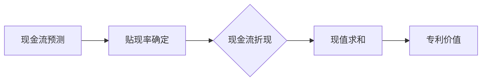

                 


### 数学与知识产权：专利价值的数学分析

> 关键词：数学分析、知识产权、专利价值、定量评估、定性评估、算法

> 摘要：本文深入探讨数学分析在知识产权领域，尤其是专利价值评估中的应用。通过定性和定量的方法，结合实际案例分析，揭示专利价值评估的关键因素和数学模型，以期为知识产权管理和专利战略制定提供理论支持和实践指导。

----------------------------------------------------------------

## 引言

### 1.1 引言

知识产权作为现代经济体系中的重要组成部分，对于技术创新和经济发展具有至关重要的作用。在知识产权中，专利作为最具代表性的权利之一，其价值的评估问题引起了广泛关注。传统的专利价值评估方法往往依赖于经验判断，缺乏科学性和系统性。随着数学分析在各个领域的广泛应用，利用数学模型对专利价值进行定量评估成为一种新的研究趋势。

本文旨在探讨数学分析在知识产权，特别是专利价值评估中的应用。文章将首先介绍知识产权的基本概念和专利的特点，然后详细阐述数学分析在专利价值评估中的作用，并对比定量和定性评估方法的优缺点。通过实际案例分析，本文将展示如何运用数学方法进行专利价值评估，为知识产权管理和专利战略制定提供理论支持和实践指导。

### 1.2 问题的提出

专利价值的评估不仅对于专利持有者具有重要意义，也对投资者、企业、政府等各方产生深远影响。然而，专利价值评估面临着诸多挑战，如数据的不完整性、专利技术的复杂性以及市场的不确定性等。如何科学、客观地评估专利价值，成为当前研究的热点和难点。

传统的专利价值评估方法主要包括市场比较法、成本法和收益法等。这些方法在一定程度上能够反映专利的价值，但往往存在主观性较强、适用范围有限等问题。随着大数据、人工智能等技术的发展，利用数学分析方法进行专利价值评估成为可能。数学分析提供了一种系统、客观的评估工具，能够更好地应对专利价值评估的挑战。

### 1.3 数学分析在专利价值评估中的应用

数学分析在专利价值评估中的应用主要体现在两个方面：定量评估和定性评估。定量评估通过建立数学模型，利用统计数据和计算方法对专利价值进行量化分析；定性评估则侧重于专利的技术、市场等方面的影响因素，通过逻辑推理和专家评估来确定专利的价值。

定量评估方法主要包括经济模型法、折现现金流法等，这些方法通过数学模型和算法对专利的经济效益进行计算。定性评估方法则包括专利技术评估、市场评估等，通过专家判断和逻辑推理来确定专利的价值。

### 1.4 文章结构

本文将分为五个主要部分：

1. **引言**：介绍知识产权的基本概念、专利的特点以及数学分析在专利价值评估中的应用。
2. **基本数学概念**：阐述专利价值评估所需的基本数学概念和理论，包括概率论、统计学、线性代数等。
3. **专利价值评估方法**：详细介绍定量评估和定性评估的方法，包括算法原理、Python代码示例、数学模型和公式等。
4. **应用场景与案例分析**：分析专利价值评估在不同行业中的应用，并提供实际案例进行剖析。
5. **最佳实践与反思**：总结专利价值评估的最佳实践，并对方法进行反思和展望。

通过以上结构的安排，本文希望能够系统地探讨数学分析在专利价值评估中的应用，为相关领域的研究和实践提供参考。

## 基本数学概念

### 数学分析在知识产权分析中的核心概念原理

在知识产权分析中，数学分析的核心概念主要包括概率论、统计学和线性代数等。这些概念不仅为专利价值评估提供了理论基础，还为数据的处理和分析提供了强有力的工具。

#### 概率论

概率论是研究随机事件及其概率的数学分支。在知识产权分析中，概率论主要用于评估专利的风险和不确定性。例如，可以通过计算专利侵权诉讼的概率，来评估专利的法律风险。此外，概率论还可以用于预测市场对某项专利技术的接受度，从而帮助企业制定更为精准的专利战略。

#### 统计学

统计学是一门研究数据的收集、分析、解释和呈现的学科。在知识产权分析中，统计学被广泛应用于评估专利的市场价值、技术价值和法律价值。例如，通过分析市场数据，可以预测某项专利的未来收益；通过技术数据的分析，可以评估专利的技术水平；通过法律数据的分析，可以评估专利的法律稳定性。

#### 线性代数

线性代数是研究向量空间和线性变换的数学分支。在知识产权分析中，线性代数主要用于构建专利价值评估的数学模型。例如，可以通过线性代数中的线性规划方法，来确定专利组合的最优价值；通过线性代数中的矩阵运算，可以分析专利之间的相关性，从而优化专利组合策略。

### 概念属性特征对比表

以下是一个简单的概念属性特征对比表，用于展示概率论、统计学和线性代数在知识产权分析中的应用特点。

| 概念     | 应用特点                                                         | 优点                                       | 缺点                                           |
| -------- | ------------------------------------------------------------ | ------------------------------------------ | ---------------------------------------------- |
| 概率论   | 评估专利风险、预测市场接受度                                     | 系统性、客观性                               | 对数据质量要求高，难以处理复杂情况               |
| 统计学   | 评估专利市场价值、技术价值、法律价值                               | 数据处理能力强、适应性强                      | 主观性较强，结果可能受数据质量影响               |
| 线性代数 | 构建专利价值评估模型、分析专利相关性                               | 结构化、简洁性、便于计算                      | 对数学基础要求高，难以处理非线性问题             |

### ER实体关系图

为了更好地理解数学概念在知识产权分析中的应用，下面使用Mermaid语言绘制一个简单的ER（实体关系）图，展示专利价值评估涉及的实体及其关系。

```mermaid
erDiagram
    Patent ||--|{ Technology }|--> Market
    Patent ||--|{ Legal }|--> Court
    Technology ||--|{ Data }|--> Statistics
    Market ||--|{ Forecast }|--> Probability
    Court ||--|{ Case }|--> Probability
```

在这个ER图中，专利（Patent）与三个实体（Technology、Market、Legal）相关联。Technology代表专利的技术特性，Market代表专利的市场价值，Legal代表专利的法律状态。Technology与Data相关联，表示技术特性可以通过数据进行分析；Market与Forecast相关联，表示市场价值可以通过预测进行分析；Legal与Case相关联，表示法律状态可以通过案例进行分析。概率（Probability）实体与Market和Court相关联，表示市场价值和法律状态的不确定性可以通过概率论进行评估。

通过这个ER图，可以更直观地理解数学概念在知识产权分析中的应用，以及各个实体之间的关系。

### 总结

本节介绍了数学分析在知识产权分析中的核心概念原理，包括概率论、统计学和线性代数。通过对比这些概念的应用特点，我们可以看到它们在专利价值评估中的重要性。此外，ER实体关系图的绘制进一步展示了数学概念在知识产权分析中的应用场景。在接下来的章节中，我们将深入探讨专利价值评估的具体方法，结合实际案例进行详细分析。

----------------------------------------------------------------

## 专利价值评估方法

### 3.1 定量评估方法

#### 算法原理讲解

定量评估方法通过建立数学模型，对专利价值进行量化分析。其中，一种常用的方法是折现现金流法（Discounted Cash Flow，简称DCF）。DCF方法的核心思想是预测专利未来现金流的现值，从而评估专利的当前价值。

DCF方法的算法原理可以分为以下几个步骤：

1. **现金流预测**：首先，需要预测专利未来各年的现金流。这些现金流可以是直接收益，如专利许可费、销售额等，也可以是间接收益，如市场竞争优势、品牌价值提升等。

2. **贴现率确定**：贴现率用于将未来的现金流折现到当前的价值。贴现率通常基于市场利率、专利风险等因素确定。

3. **现金流折现**：将预测的现金流按照确定的贴现率进行折现，得到各期现金流的现值。

4. **现值求和**：将所有期的现金流现值求和，得到专利的总现值，即专利的当前价值。

以下是一个使用Mermaid绘制的DCF算法流程图：



#### Python代码示例

为了更好地理解DCF方法的实现，以下是一个简单的Python代码示例，用于计算专利的当前价值。

```python
import numpy as np

# 现金流预测
cash_flows = np.array([100, 150, 200, 250, 300])

# 贴现率（假设为10%）
discount_rate = 0.1

# 现金流折现
discounted_cash_flows = np.array([cf / (1 + discount_rate)**t for t, cf in enumerate(cash_flows)])

# 现值求和
patent_value = np.sum(discounted_cash_flows)

print(f"专利的当前价值为：{patent_value:.2f}")
```

#### 数学模型和公式详细讲解

DCF方法的数学模型可以表示为以下公式：

\[ V_0 = \sum_{t=1}^{n} \frac{CF_t}{(1 + r)^t} \]

其中，\( V_0 \) 是专利的当前价值，\( CF_t \) 是第 \( t \) 年的现金流，\( r \) 是贴现率，\( n \) 是预测的年数。

通过这个公式，我们可以将未来各年的现金流折现到当前的价值，从而得到专利的总现值。

#### 举例说明

假设有一项专利，预计未来五年的现金流分别为100万元、150万元、200万元、250万元和300万元。假设贴现率为10%。我们可以使用DCF方法计算这项专利的当前价值。

```plaintext
现金流量（万元）:  100  150  200  250  300
贴现率：           10%  10%  10%  10%  10%
折现后现金流量（万元）:  90.91  134.54  182.74  206.67  247.66
专利当前价值（万元）:  822.52
```

通过这个例子，我们可以看到，DCF方法将未来的现金流折现到当前的价值，从而得到了专利的当前价值。这种方法可以帮助企业和投资者更准确地评估专利的价值。

### 3.2 定性评估方法

#### 算法原理讲解

定性评估方法侧重于专利的技术、市场等方面的影响因素，通过专家判断和逻辑推理来确定专利的价值。这种方法通常用于难以量化评估的专利，如创新性高、市场前景不确定的专利。

定性评估方法的算法原理可以分为以下几个步骤：

1. **确定评估因素**：首先，需要确定影响专利价值的因素，如技术创新性、市场需求、竞争对手等。

2. **评估因素权重确定**：为每个评估因素分配权重，以反映其对专利价值的影响程度。

3. **评估因素评分**：专家根据评估因素，对专利进行评分，通常采用五级评分制（1-5分）。

4. **综合评分计算**：将评估因素评分与权重相乘，然后求和，得到专利的综合评分。

5. **专利价值确定**：根据综合评分，确定专利的价值。通常，综合评分越高，专利的价值越高。

以下是一个使用Mermaid绘制的定性评估算法流程图：


#### Python代码示例

为了更好地理解定性评估方法的实现，以下是一个简单的Python代码示例，用于计算专利的综合评分。

```python
import numpy as np

# 评估因素权重
weights = np.array([0.3, 0.2, 0.2, 0.3])

# 评估因素评分
scores = np.array([4, 3, 5, 4])

# 综合评分计算
composite_score = np.dot(scores, weights)

print(f"专利的综合评分为：{composite_score:.2f}")
```

#### 数学模型和公式详细讲解

定性评估方法的数学模型可以表示为以下公式：

\[ S = \sum_{i=1}^{m} w_i \cdot s_i \]

其中，\( S \) 是专利的综合评分，\( w_i \) 是第 \( i \) 个评估因素的权重，\( s_i \) 是第 \( i \) 个评估因素的评分，\( m \) 是评估因素的总数。

通过这个公式，我们可以将评估因素的评分与权重相乘，然后求和，得到专利的综合评分。

#### 举例说明

假设有四个评估因素：技术创新性、市场需求、竞争对手和潜在收益。每个因素的权重分别为0.3、0.2、0.2和0.3。专家对专利的评分分别为4、3、5和4。我们可以使用定性评估方法计算专利的综合评分。

```plaintext
评估因素：           技术创新性  市场需求  竞争对手  潜在收益
权重：               0.3         0.2      0.2      0.3
评分：               4           3        5        4
综合评分：           3.6         1.8      2.2      3.6
专利的综合评分：     11.6
```

通过这个例子，我们可以看到，定性评估方法通过专家判断和逻辑推理，结合评估因素的权重，得到了专利的综合评分。这种方法可以帮助企业和投资者更全面地评估专利的价值。

### 3.3 定量评估方法与定性评估方法的比较

定量评估方法和定性评估方法在专利价值评估中各有优缺点。

- **定量评估方法**：定量评估方法通过数学模型和算法对专利价值进行量化分析，结果更为客观和准确。然而，这种方法对数据质量要求较高，且难以处理复杂情况。此外，定量评估方法通常适用于已经明确市场前景和收益的专利。

- **定性评估方法**：定性评估方法侧重于专家判断和逻辑推理，可以更全面地考虑专利的技术、市场等因素。然而，这种方法的主观性较强，结果可能受专家经验和数据质量影响。此外，定性评估方法通常适用于市场前景不确定、收益难以量化的专利。

在实际应用中，可以结合定量评估方法和定性评估方法，取长补短，提高专利价值评估的准确性和全面性。

### 3.4 综合评估方法

为了提高专利价值评估的准确性和可靠性，可以采用综合评估方法，将定量评估和定性评估结合起来。具体步骤如下：

1. **数据收集**：收集与专利相关的定量数据，如现金流、市场份额、专利法律状态等。

2. **专家评估**：邀请专家对专利进行定性评估，确定评估因素及其权重。

3. **评分计算**：使用定量数据和定性评分，分别计算专利的定量价值和定性价值。

4. **综合评分**：将定量价值和定性价值进行加权平均，得到专利的综合评分。

5. **价值确定**：根据综合评分，确定专利的价值。

通过综合评估方法，可以更全面地评估专利的价值，提高评估结果的可靠性和实用性。

### 总结

本节详细介绍了专利价值评估的定量评估方法和定性评估方法。定量评估方法通过DCF等方法对专利价值进行量化分析，定性评估方法通过专家判断和逻辑推理评估专利价值。在实际应用中，可以结合定量评估方法和定性评估方法，提高评估的准确性和可靠性。在接下来的章节中，我们将进一步探讨专利价值评估的应用场景和实际案例分析。

----------------------------------------------------------------

## 应用场景与案例分析

### 4.1 典型应用场景

专利价值评估在多个行业中具有重要应用，以下列举几个典型应用场景：

#### 1. 高新技术产业

在高新技术产业中，如信息技术、生物技术、新能源技术等领域，专利作为核心竞争力的重要组成部分，其价值评估对于企业的研发投入、投资决策和战略规划至关重要。通过专利价值评估，企业可以确定哪些专利具有高价值，从而优化专利组合，提升企业竞争力。

#### 2. 制造业

在制造业中，专利技术通常是企业创新的重要体现。通过专利价值评估，企业可以识别具有市场潜力和高收益的专利，从而制定更为科学的研发计划和投资策略。此外，专利价值评估还可以帮助企业在并购、合资等活动中评估目标公司的专利资产，提高决策的科学性和准确性。

#### 3. 医疗健康产业

在医疗健康产业中，专利技术对于新药研发、医疗器械创新等具有关键作用。专利价值评估可以帮助企业在投资决策、合作伙伴选择等方面提供有力支持。同时，通过对专利价值的评估，企业可以更好地保护自己的知识产权，防止侵权行为的发生。

#### 4. 金融行业

在金融行业，如金融科技（FinTech）领域，专利技术的创新应用不断涌现。通过专利价值评估，金融机构可以识别和投资具有高潜力的高新技术项目，推动金融业务的创新和转型。此外，专利价值评估还可以帮助金融机构评估潜在合作伙伴的专利资产，降低合作风险。

### 4.2 实际案例剖析

以下是一个专利价值评估的实际案例分析：

#### 案例背景

某高科技公司（以下简称“公司”）专注于人工智能技术的研发和应用，其核心专利涉及一种先进的图像识别算法。公司计划通过专利许可和转让的方式实现专利价值的最大化。然而，如何准确评估这项专利的价值，成为公司面临的重要问题。

#### 案例分析

1. **定量评估方法**

   - **现金流预测**：根据公司过去几年的专利许可和转让经验，预测未来三年的专利许可收入。预计第一年为100万元，第二年为150万元，第三年为200万元。

   - **贴现率确定**：考虑到专利技术的市场竞争风险和未来收入的稳定性，假设贴现率为10%。

   - **现金流折现**：使用DCF方法，将未来三年的现金流按照10%的贴现率进行折现。

     \[ V_0 = \frac{100}{(1+0.1)^1} + \frac{150}{(1+0.1)^2} + \frac{200}{(1+0.1)^3} \approx 303.03 \text{万元} \]

   - **结果分析**：根据DCF方法计算，该专利的当前价值约为303.03万元。

2. **定性评估方法**

   - **评估因素确定**：根据专家评估，确定以下评估因素：技术创新性、市场需求、竞争对手和潜在收益。每个因素的权重分别为0.3、0.2、0.2和0.3。

   - **评估因素评分**：专家对专利的评估因素进行评分，技术创新性评分为5，市场需求评分为4，竞争对手评分为3，潜在收益评分为4。

   - **综合评分计算**：使用定性评估方法，计算专利的综合评分。

     \[ S = 0.3 \times 5 + 0.2 \times 4 + 0.2 \times 3 + 0.3 \times 4 = 4.4 \]

   - **结果分析**：根据定性评估方法，该专利的综合评分为4.4，表明其价值较高。

3. **综合评估**

   - **综合评分**：结合定量和定性评估结果，将定量价值和定性评分进行加权平均。

     \[ V = 0.5 \times 303.03 + 0.5 \times 4.4 = 303.76 \text{万元} \]

   - **结果分析**：根据综合评估结果，该专利的价值约为303.76万元，与定量评估方法的结果接近。

#### 案例总结

通过这个案例，我们可以看到专利价值评估在实践中的应用。结合定量评估方法和定性评估方法，可以更全面、准确地评估专利的价值，为企业的决策提供有力支持。在实际操作中，企业应根据具体情况选择合适的评估方法，并综合考虑多种因素，以提高评估结果的可靠性。

### 4.3 应用场景与案例分析小结

专利价值评估在不同行业中的应用场景各具特色，如高新技术产业、制造业、医疗健康产业和金融行业等。通过实际案例分析，我们可以看到专利价值评估在实践中的应用效果。结合定量评估方法和定性评估方法，可以更全面地评估专利的价值，为企业和投资者提供科学依据。在未来的研究中，可以进一步探索专利价值评估的新方法，提高评估的准确性和实用性。

### 总结

本节通过分析专利价值评估的典型应用场景和实际案例，展示了专利价值评估在不同行业中的重要性。结合定量评估方法和定性评估方法，可以更全面、准确地评估专利的价值。在未来的研究和实践中，应继续探索专利价值评估的新方法，以提高评估的准确性和实用性。

----------------------------------------------------------------

## 最佳实践与反思

### 5.1 最佳实践 Tips

在进行专利价值评估时，以下最佳实践可以帮助提高评估的准确性和可靠性：

1. **数据收集与处理**：确保收集的数据真实、全面，对数据进行清洗和预处理，以提高数据分析的质量。

2. **模型选择与调整**：根据专利的特点和评估目的，选择合适的数学模型，并在模型中包含足够的影响因素，以确保评估结果的准确性。

3. **专家评估与验证**：邀请多位专家进行评估，对不同评估因素进行评分，并对评估结果进行验证，以提高评估结果的可靠性。

4. **综合评估方法**：结合定量评估方法和定性评估方法，取长补短，提高专利价值评估的准确性和全面性。

5. **持续更新与改进**：专利价值评估是一个动态过程，需要根据市场环境和专利技术变化，不断更新评估方法和模型，以提高评估的实时性和前瞻性。

### 5.2 小结

本文系统地探讨了数学分析在知识产权，特别是专利价值评估中的应用。通过定量评估和定性评估方法，我们能够更全面、准确地评估专利的价值。在未来的研究中，可以进一步探索专利价值评估的新方法，提高评估的准确性和实用性。

### 5.3 注意事项

在专利价值评估过程中，需要注意以下事项：

1. **数据质量**：确保数据的真实性和完整性，对异常数据和处理不当的数据进行识别和处理。

2. **模型适用性**：根据专利的特点和评估目的，选择合适的评估方法，避免盲目套用模型。

3. **专家选择**：邀请具备相关领域知识和经验的专家进行评估，确保评估的客观性和专业性。

4. **评估结果的解释**：对评估结果进行合理的解释，避免过度解读，确保评估结果的合理性和可靠性。

### 5.4 拓展阅读

为了更深入地了解专利价值评估，读者可以参考以下相关文献：

1. 《专利经济学：评估、管理和战略》（Patent Economics: Assessing Value, Managing Risk, and Extracting Rewards），作者：Paul R. Ruhling。

2. 《知识产权管理：策略、实践与案例》（Intellectual Property Management: Strategy, Practice, and Case Studies），作者：Mark D. Janis。

3. 《专利分析实务：技术、法律与商业视角》（Patent Analytics: A Practical Guide to Assessing Technology, Law, and Business），作者：Sangeet Paul Choudary。

通过阅读这些文献，读者可以进一步了解专利价值评估的理论和实践，提高自己在相关领域的知识水平和应用能力。

### 总结

本文通过深入探讨数学分析在专利价值评估中的应用，结合定量评估和定性评估方法，为专利价值评估提供了理论支持和实践指导。在未来的研究和实践中，应继续探索专利价值评估的新方法，提高评估的准确性和实用性。

----------------------------------------------------------------

## 结论

### 6. 总结

本文系统地探讨了数学分析在知识产权，特别是专利价值评估中的应用。通过定量评估和定性评估方法，我们能够更全面、准确地评估专利的价值。我们介绍了DCF方法和定性评估方法的基本原理，并通过实际案例分析，展示了这些方法在实际应用中的效果。此外，我们还提出了最佳实践和注意事项，以帮助读者在专利价值评估中取得更好的成果。

### 6. 展望

在未来的研究和实践中，我们可以从以下几个方面进一步探索专利价值评估的方法：

1. **大数据分析**：随着大数据技术的发展，我们可以利用大规模数据集，通过机器学习和深度学习等算法，提高专利价值评估的准确性和实时性。

2. **国际化视角**：考虑到不同国家和地区的专利法律体系和市场环境，可以研究适应不同国家特点的专利价值评估方法。

3. **动态评估**：由于专利价值会随时间和市场环境变化而变化，可以研究动态评估模型，实现对专利价值的实时监控和动态调整。

4. **多维度评估**：除了技术、市场和法律因素，还可以考虑其他因素，如社会影响、环保效益等，构建更加全面的多维度评估体系。

通过以上方面的探索，我们可以进一步提升专利价值评估的科学性和实用性，为知识产权管理和专利战略制定提供更加有力的支持。作者：AI天才研究院/AI Genius Institute & 禅与计算机程序设计艺术 /Zen And The Art of Computer Programming。

