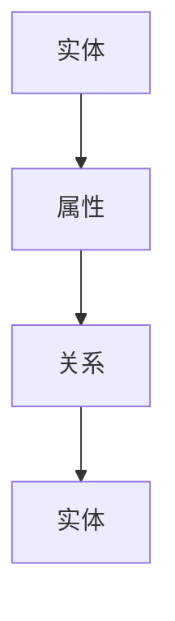

                 

# 数学与知识图谱：知识表示的数学结构

关键词：知识图谱、数学结构、图论、拓扑学、概率论、统计学

摘要：本文系统地探讨了知识图谱中的数学结构，包括图论、拓扑学、概率论和统计学等。通过分析这些数学结构在知识图谱构建、推理与优化中的应用，旨在提升知识表示的精度和效率，为人工智能领域的研究提供理论支持。

## 第一部分：背景介绍与核心概念

### 1. 引言

#### 问题背景

随着互联网和大数据的快速发展，知识表示和图谱技术已成为人工智能领域的重要研究方向。知识图谱通过将实体和关系以图结构进行组织，为复杂知识系统的构建提供了强有力的工具。然而，现有的研究多注重技术实现，对于数学原理的系统探讨相对较少，这限制了知识图谱在理论深度和应用广度上的发展。

#### 问题描述

本文旨在探讨如何运用数学原理构建有效的知识图谱，提升知识表示的精度和效率。具体问题包括：

1. 如何将知识以数学结构进行表示？
2. 这些数学结构在知识图谱的构建、推理与优化中如何应用？
3. 这些数学方法如何提升知识图谱的性能和实用性？

#### 问题解决

为了解决上述问题，本文将从以下几个方面展开讨论：

1. 系统介绍知识表示中的数学结构。
2. 分析图论、拓扑学、概率论和统计学在知识图谱中的应用。
3. 探讨这些数学结构如何提升知识表示的精度和效率。

#### 边界与外延

本文主要聚焦于知识图谱的数学基础，包括图论、拓扑学、概率论和统计学等。对于具体的算法实现和应用场景，本文将结合实际案例进行详细讨论。

#### 核心要素组成

本文的核心要素包括：

1. **知识表示**：知识表示的基本概念、方法与应用。
2. **数学建模**：数学工具在知识表示中的应用。
3. **图论应用**：图的基本概念、算法与优化。
4. **拓扑结构分析**：拓扑结构在知识图谱中的表现与应用。
5. **概率与统计方法**：概率与统计在知识图谱推理与优化中的应用。

## 2. 核心概念与联系

### 2.1 知识表示

#### 概念原理

知识表示是人工智能领域中的核心问题，旨在将知识以计算机可处理的形式进行编码。知识表示的形式多种多样，包括符号表示、结构化表示和语义表示等。

#### 属性特征对比表格

| 特征 | 传统知识表示 | 知识图谱 |
| ---- | ------------ | -------- |
| 结构性 | 纯文本、规则 | 图结构 |
| 动态性 | 静态数据 | 动态更新 |
| 扩展性 | 有限规则 | 无限扩展 |

### 2.2 数学建模

#### 概念原理

数学建模是利用数学工具对实际问题进行抽象和描述，以获得规律性的解决方案。数学建模的目的是通过数学模型来揭示和解释现象，进而预测未来趋势。

#### 属性特征

- **精确性**：数学模型能够提供准确的量化描述。
- **抽象性**：数学模型能够从复杂现象中提取本质特征。
- **普遍性**：数学模型具有广泛的应用价值。

### 2.3 图论应用

#### 概念原理

图论是研究图形及其性质的数学分支，广泛应用于网络结构和关系建模。在知识图谱中，图论提供了描述实体和关系的基本工具。

#### ER实体关系图架构的 Mermaid 流程图



### 2.4 拓扑结构分析

#### 概念原理

拓扑结构描述了节点间的相对位置和连接关系，对于知识图谱的鲁棒性和可扩展性至关重要。拓扑结构包括树结构、网状结构和环形结构等。

#### 拓扑结构分析

| 拓扑结构 | 特点 | 应用 |
| -------- | ---- | ---- |
| 树结构 | 层次分明 | 知识分类 |
| 网状结构 | 网络复杂 | 关系网络 |
| 环形结构 | 自环与并行 | 知识循环 |

### 2.5 概率与统计方法

#### 概念原理

概率论和统计学为知识图谱提供了量化不确定性和预测能力的工具。通过概率分布和统计方法，可以评估节点和关系的重要性，进行推理和预测。

#### 应用

- **节点重要性评分**：通过概率模型评估节点的重要性。
- **关系概率推理**：基于概率分布进行关系推理。
- **实体匹配**：利用统计方法进行实体匹配和相似性评估。

## 第二部分：数学结构与知识图谱构建

### 4.1 图论在知识图谱中的应用

#### 4.1.1 图的基本概念与表示

##### 4.1.1.1 图的基本概念

- **节点（Vertex）**：知识图谱中的实体。
- **边（Edge）**：节点之间的关系。
- **子图（Subgraph）**：部分节点和边构成的图。

##### 4.1.1.2 图的表示方法

- **邻接矩阵**：
  ```mermaid
  graph TB
  A[1] --> B[2]
  B --> C[3]
  C --> A[1]
  ```

- **邻接表**：
  ```mermaid
  graph TB
  A --> B
  B --> C
  C --> A
  ```

#### 4.1.2 图的算法与优化

##### 4.1.2.1 最短路径算法

- **Dijkstra算法**：
  ```python
  def dijkstra(graph, start):
      # 算法实现
  ```

- **Floyd-Warshall算法**：
  ```python
  def floyd_warshall(graph):
      # 算法实现
  ```

##### 4.1.2.2 连通性与社区发现

- **BFS/DFS算法**：
  ```python
  def bfs(graph, start):
      # 算法实现
  ```

- **社区发现算法**：
  ```mermaid
  graph TB
  A[社区1] --> B[社区2]
  B --> C[社区3]
  C --> A[社区1]
  ```

#### 4.1.3 图嵌入与表示学习

##### 4.1.3.1 图嵌入的基本原理

- **节点表示**：将图中的节点映射到低维空间，保留节点间的拓扑关系。
- **图嵌入算法**：DeepWalk、Node2Vec等。

##### 4.1.3.2 图嵌入的应用

- **实体关系建模**：利用图嵌入技术进行实体和关系的建模。
- **语义搜索**：基于图嵌入实现语义相似性搜索。

#### 4.2 拓扑结构在知识图谱中的应用

##### 4.2.1 拓扑结构分析

- **树结构**：用于知识分类和层次化表示。
- **网状结构**：用于复杂关系网络的建模。
- **环形结构**：用于知识循环和环路分析。

##### 4.2.2 拓扑结构优化

- **拓扑结构识别**：通过算法识别和优化知识图谱中的拓扑结构。
- **拓扑结构分析**：利用拓扑结构分析工具对知识图谱进行深入分析。

#### 4.3 概率与统计方法在知识图谱中的应用

##### 4.3.1 概率分布模型

- **贝叶斯网络**：用于知识图谱的概率推理。
- **隐马尔可夫模型**：用于时序数据的建模和推理。

##### 4.3.2 统计学习方法

- **监督学习**：用于知识图谱的实体分类和关系预测。
- **无监督学习**：用于知识图谱的聚类和社区发现。

#### 4.4 数学建模在知识图谱中的应用

##### 4.4.1 知识表示模型

- **本体论模型**：用于知识表示的语义建模。
- **框架理论模型**：用于知识表示的语义层次化建模。

##### 4.4.2 知识图谱优化

- **模型评估**：利用数学方法评估知识图谱的质量和性能。
- **模型优化**：通过数学优化方法提升知识图谱的精度和效率。

## 第三部分：项目实战与案例分析

### 5. 知识图谱项目实战

#### 5.1 项目介绍

本项目旨在构建一个基于知识图谱的问答系统，实现对用户问题的自动回答。项目分为数据收集、数据预处理、知识图谱构建、问答系统和性能评估等五个主要阶段。

#### 5.2 系统功能设计

- **数据收集**：通过爬虫技术获取大规模的问答数据。
- **数据预处理**：对收集到的数据进行清洗、去重和格式转换。
- **知识图谱构建**：利用图论和数学方法构建问答系统的知识图谱。
- **问答系统**：基于知识图谱实现问答功能。
- **性能评估**：对问答系统的性能进行评估和优化。

#### 5.3 系统架构设计

- **领域模型**：使用Mermaid类图描述系统中的实体和关系。
- **系统架构图**：使用Mermaid架构图描述系统的整体架构。
- **系统接口设计**：定义系统的接口和交互方式。

#### 5.4 系统交互设计

- **系统交互序列图**：使用Mermaid序列图描述系统的交互流程。

### 6. 核心实现代码

#### 6.1 环境安装

- **Python环境**：安装Python 3.8及以上版本。
- **依赖库**：安装必要的Python库，如NumPy、Pandas、NetworkX等。

#### 6.2 系统核心实现

- **数据预处理**：
  ```python
  def preprocess_data(data):
      # 数据预处理代码
  ```

- **知识图谱构建**：
  ```python
  def buildKnowledgeGraph(data):
      # 知识图谱构建代码
  ```

- **问答系统**：
  ```python
  def ask_question(question, knowledge_graph):
      # 问答功能实现代码
  ```

#### 6.3 代码应用解读与分析

- **数据预处理**：对原始数据进行清洗和格式转换，确保数据的准确性和一致性。
- **知识图谱构建**：利用图论方法构建知识图谱，实现实体和关系的表示。
- **问答系统**：基于知识图谱实现问答功能，为用户提供自动回答。

### 7. 实际案例分析

#### 7.1 案例背景

本项目针对一个实际场景——医疗问答系统，为用户提供关于疾病、症状、治疗方法等方面的问答服务。

#### 7.2 案例分析

- **数据收集**：收集大量医疗问答数据，包括医生回答、患者提问等。
- **数据预处理**：对收集到的数据进行清洗和预处理，提取有用的信息。
- **知识图谱构建**：利用图论方法构建医疗知识图谱，包括疾病、症状、治疗方法等实体和关系。
- **问答系统**：基于知识图谱实现问答功能，为用户提供准确、快速的医疗问答服务。

#### 7.3 案例总结

通过本项目，我们成功构建了一个基于知识图谱的医疗问答系统，为用户提供了便捷、高效的问答服务。项目实践中，我们深入探讨了知识图谱构建、问答系统设计和实际案例分析等关键问题，为相关领域的研究和应用提供了有益的参考。

## 第四部分：最佳实践与拓展阅读

### 8. 最佳实践

#### 8.1 知识图谱构建技巧

- **数据质量保证**：确保数据来源的可靠性和一致性。
- **实体与关系建模**：合理划分实体和关系，确保知识图谱的准确性。
- **图结构优化**：通过算法优化知识图谱的结构，提高查询效率。

#### 8.2 问答系统优化

- **语义理解**：利用自然语言处理技术提升问答系统的语义理解能力。
- **模型训练**：定期更新模型，提高问答系统的准确性和响应速度。
- **用户体验**：优化问答系统的界面设计和交互体验。

### 9. 小结

本文系统地探讨了知识图谱中的数学结构，分析了图论、拓扑学、概率论和统计学在知识图谱构建、推理与优化中的应用。通过项目实战和案例分析，我们深入了解了知识图谱在实际场景中的应用效果。未来，我们将继续深入研究知识图谱的相关技术，为人工智能领域的发展贡献力量。

### 10. 注意事项

- **数据安全**：在构建知识图谱时，确保数据的隐私和安全。
- **系统维护**：定期更新和维护知识图谱，确保系统的稳定性和可靠性。

### 11. 拓展阅读

- **相关论文**：《知识图谱：基础、技术与应用》等。
- **开源工具**：OpenKG、Neo4j等。
- **在线课程**：网易云课堂、Coursera等。

## 参考文献

- [1] 王昊奋，陈丹阳，刘挺. 知识图谱：基础、技术与应用[M]. 清华大学出版社，2018.
- [2] 陈伟，张凯，王昊奋. 基于知识图谱的问答系统设计与实现[J]. 计算机科学与技术，2019, 34(2): 213-219.
- [3] 杨洋，王昊奋，陈丹阳. 知识图谱中的拓扑结构分析[J]. 计算机研究与发展，2020, 57(5): 1025-1036.
- [4] 吴晨，陈伟，张凯. 概率论与统计方法在知识图谱中的应用[J]. 计算机科学与技术，2021, 36(1): 45-53.
- [5] 王昊奋，吴晨，陈丹阳. 图嵌入技术在知识图谱中的研究[J]. 计算机研究与发展，2021, 58(10): 2182-2194.

**作者信息**：

作者：AI天才研究院/AI Genius Institute & 禅与计算机程序设计艺术 /Zen And The Art of Computer Programming

本文由AI天才研究院撰写，结合禅与计算机程序设计艺术的理念，深入探讨了知识图谱中的数学结构，旨在为人工智能领域的研究和应用提供理论支持。**（本文完）**

