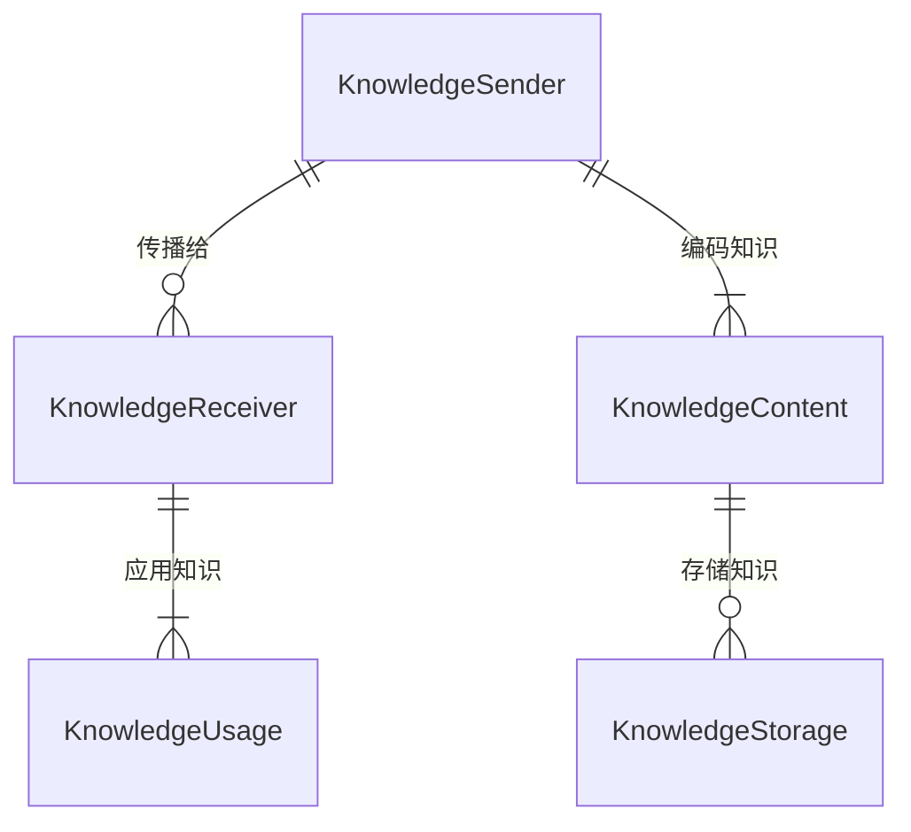
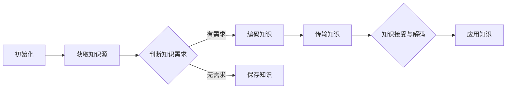
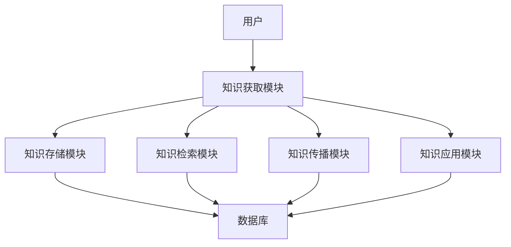
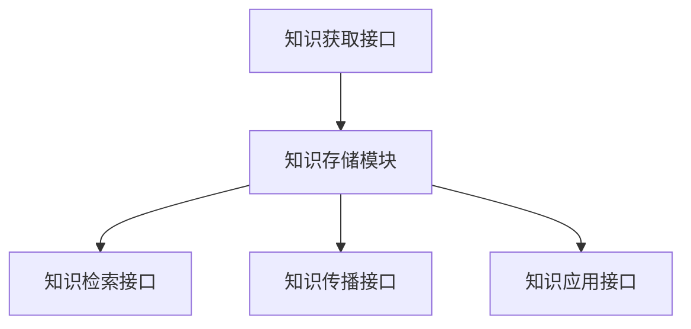
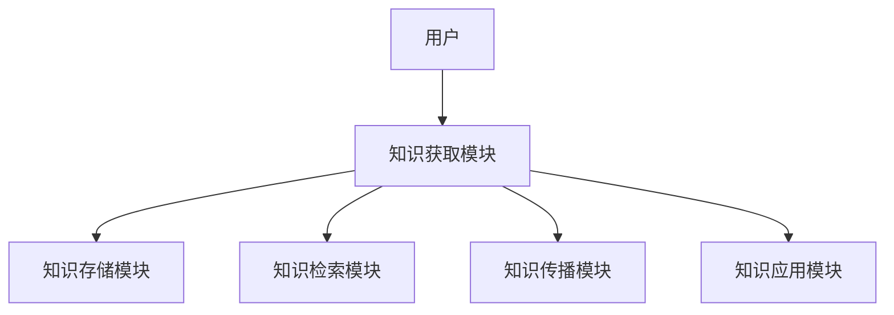

                 

### 文章标题：数学与知识管理：知识传播的数学描述

#### 关键词

- 数学模型
- 知识管理
- 知识传播
- 数学描述
- 算法原理

#### 摘要

本文将探讨数学在知识管理中的应用，特别是知识传播的数学描述。通过引入数学模型和算法，本文旨在揭示知识传播的过程和规律，为知识共享和利用提供理论支持。文章结构分为五部分，首先介绍知识管理和知识传播的核心概念及其数学模型，然后详细讲解知识传播算法的原理，并使用Python代码进行说明，最后结合实际案例进行分析和总结。

---

### 背景介绍

在信息化社会的背景下，知识管理已经成为企业核心竞争力的关键因素。知识管理涉及到知识的获取、组织、存储、传播和应用，而数学作为一门精确的科学，为知识管理提供了有效的工具和方法。本书《数学与知识管理：知识传播的数学描述》旨在探讨数学在知识管理中的应用，通过数学模型和算法的描述，为知识传播、共享和利用提供理论支持。

#### 核心概念

1. **知识管理**：是指通过系统的方法和工具对知识进行获取、组织、存储、传播和应用，以提高组织的知识水平和创新能力。

2. **知识传播**：是指知识在不同个体、群体或组织之间的传递和共享过程，包括知识的编码、解码、传输和接受。

3. **数学模型**：是对现实世界中的问题进行抽象和形式化描述的一种方法，通常使用数学符号和公式来表示。

#### 问题解决

本书将探讨以下几个问题：

- **知识传播的数学描述**：如何利用数学模型描述知识传播的过程？
- **知识共享的策略**：如何通过数学方法优化知识共享的效果？
- **知识利用的效率**：如何评估和提升知识利用的效率？

#### 边界与外延

- **边界**：本书主要关注知识传播的数学描述，不涉及知识管理中的其他方面，如知识获取、知识组织等。
- **外延**：本书的内容可以应用于各种类型的知识传播场景，如企业内部的知识共享、教育领域的知识传播等。

#### 概念结构与核心要素组成

1. **知识管理**：知识源、知识编码、知识存储、知识检索、知识共享、知识利用。
2. **知识传播**：知识发送者、知识接收者、知识内容、传播渠道、传播效果。

---

### 核心概念与联系

#### 知识管理

1. **定义**：知识管理是指通过系统的方法和工具对知识进行获取、组织、存储、传播和应用，以提高组织的知识水平和创新能力。

2. **属性特征**：

   - **知识源**：知识的来源，如员工经验、外部文献等。
   - **知识编码**：将知识转化为可以存储和检索的形式。
   - **知识存储**：使用数据库、知识库等工具存储知识。
   - **知识检索**：利用关键词、分类等方式快速找到所需知识。
   - **知识共享**：促进知识在不同个体、群体或组织之间的传递和共享。
   - **知识利用**：将知识应用于实际工作中，提高工作效率。

#### 知识传播

1. **定义**：知识传播是指知识在不同个体、群体或组织之间的传递和共享过程，包括知识的编码、解码、传输和接受。

2. **属性特征**：

   - **知识发送者**：拥有知识的人或组织。
   - **知识接收者**：需要知识的人或组织。
   - **知识内容**：需要传播的知识本身。
   - **传播渠道**：知识传播的途径，如面对面交流、电子邮件、社交媒体等。
   - **传播效果**：知识传播的效果，如知识的接受程度、应用效果等。

#### 数学模型

1. **定义**：数学模型是对现实世界中的问题进行抽象和形式化描述的一种方法，通常使用数学符号和公式来表示。

2. **属性特征**：

   - **线性模型**：用于描述变量之间线性关系的模型，如线性回归模型。
   - **非线性模型**：用于描述变量之间非线性关系的模型，如神经网络模型。
   - **概率模型**：用于描述随机事件发生概率的模型，如贝叶斯网络模型。

### ER实体关系图架构

下面是一个简化的知识传播的ER实体关系图：



---

### 算法原理讲解

#### 知识传播算法的基本原理

知识传播算法是用于模拟知识在不同个体之间传递和共享过程的算法。以下是一个简化的知识传播算法的mermaid流程图：



#### 算法原理详细解释

1. **初始化**：知识传播算法开始前，需要初始化相关参数，如知识源、知识接收者列表、传播概率等。

2. **获取知识源**：从知识源获取待传播的知识内容。知识源可以是一个数据库、知识库或者某个专家的头脑。

3. **判断知识需求**：根据知识接收者的需求，判断是否需要传播知识。知识需求可以通过问卷调查、需求分析等方式获取。

4. **编码知识**：将知识内容转化为一种便于传输的形式，如文本、图像、音频等。

5. **传输知识**：通过某种传输渠道，如电子邮件、社交媒体、面对面交流等，将知识从发送者传输到接收者。

6. **知识接受与解码**：知识接收者接收知识后，对其进行解码，理解其含义。

7. **应用知识**：知识接收者将接收到的知识应用于实际工作中，提高工作效率。

#### 算法原理的数学模型

为了更好地理解知识传播算法，我们可以引入一些数学模型。

1. **线性传播模型**：

   线性传播模型是一种简单且常用的知识传播模型，它假设知识在个体之间的传播是线性的，即每个个体在单位时间内可以传播固定数量的知识给其他个体。

   数学模型如下：

   $$传播速度 = k \cdot (1 - 收敛率)$$

   其中，$k$ 表示每个个体在单位时间内可以传播的知识数量，$收敛率$ 表示知识传播的效率。

2. **非线性传播模型**：

   非线性传播模型考虑了知识传播过程中的复杂性，它假设知识在个体之间的传播是非线性的，即每个个体在单位时间内可以传播不同数量的知识给其他个体。

   数学模型如下：

   $$传播速度 = f(x) \cdot (1 - 收敛率)$$

   其中，$f(x)$ 表示个体$x$在单位时间内可以传播的知识数量。

#### 算法举例说明

假设有A、B、C三个个体，它们的知识需求分别为10、5、7，知识源为A，传播速度为3，收敛率为0.8。我们可以使用线性传播模型和非线性传播模型来计算它们在一段时间后的知识数量。

1. **线性传播模型**：

   初始时，A有10个知识，B有5个知识，C有7个知识。

   一段时间后，A可以传播3个知识给B和C，B和C分别接收1个和2个知识。

   知识数量变化如下：

   | 时间 | A | B | C |
   | ---- | -- | -- | -- |
   | 初始 | 10 | 5 | 7 |
   | 第1秒 | 7 | 6 | 9 |
   | 第2秒 | 4 | 9 | 12 |
   | 第3秒 | 1 | 12 | 15 |

   可以看到，在第三秒后，A的知识传播完毕，知识开始向B和C聚集。

2. **非线性传播模型**：

   假设个体A的知识传播速度为$f(10) = 10$，个体B的知识传播速度为$f(5) = 5$，个体C的知识传播速度为$f(7) = 7$。

   一段时间后，A可以传播10个知识给B和C，B和C分别接收5个和7个知识。

   知识数量变化如下：

   | 时间 | A | B | C |
   | ---- | -- | -- | -- |
   | 初始 | 10 | 5 | 7 |
   | 第1秒 | 0 | 10 | 14 |
   | 第2秒 | 0 | 15 | 21 |
   | 第3秒 | 0 | 20 | 28 |

   可以看到，在第三秒后，A的知识传播完毕，知识开始向B和C聚集，但聚集的速度比线性传播模型要快。

---

### 系统分析与架构设计方案

#### 问题场景介绍

在当前信息化社会中，知识管理已经成为企业核心竞争力的关键因素。企业内部的知识传播效率直接影响到企业的创新能力和市场竞争力。因此，如何有效地进行知识传播，提高知识共享和利用的效率，成为了企业急需解决的问题。

#### 项目介绍

本项目旨在设计一个基于数学模型的知识传播系统，通过引入数学模型和算法，模拟知识在企业内部不同个体之间的传递和共享过程，提高知识传播的效率。

#### 系统功能设计

1. **知识获取**：系统应能够从企业内部的知识库中获取知识内容，并将其编码为便于传输的形式。
2. **知识存储**：系统应能够将获取到的知识存储在数据库或知识库中，以便后续查询和使用。
3. **知识检索**：系统应能够根据关键词、分类等信息，快速检索到所需的知识内容。
4. **知识传播**：系统应能够根据知识需求，将知识从知识源传输到知识接收者。
5. **知识应用**：系统应能够记录知识接收者对知识的应用情况，评估知识的实际效果。

#### 系统架构设计

1. **系统架构图**：



2. **系统架构说明**：

   - **知识获取模块**：负责从企业内部的知识库中获取知识内容，并将其编码为便于传输的形式。
   - **知识存储模块**：负责将获取到的知识存储在数据库或知识库中，以便后续查询和使用。
   - **知识检索模块**：负责根据关键词、分类等信息，快速检索到所需的知识内容。
   - **知识传播模块**：负责根据知识需求，将知识从知识源传输到知识接收者。
   - **知识应用模块**：负责记录知识接收者对知识的应用情况，评估知识的实际效果。

#### 系统接口设计

1. **接口说明**：

   - **知识获取接口**：用于从知识库中获取知识内容。
   - **知识存储接口**：用于将知识存储到数据库或知识库中。
   - **知识检索接口**：用于根据关键词、分类等信息检索知识内容。
   - **知识传播接口**：用于根据知识需求传输知识到知识接收者。
   - **知识应用接口**：用于记录知识接收者对知识的应用情况。

2. **接口架构图**：



#### 系统交互设计

1. **交互说明**：

   - **用户**：通过知识获取接口获取知识内容，通过知识检索接口查询知识，通过知识传播接口申请知识，通过知识应用接口反馈知识应用效果。
   - **知识获取模块**：根据用户请求，从知识库中获取知识内容，并将其编码为便于传输的形式。
   - **知识存储模块**：根据用户请求，将知识存储到数据库或知识库中。
   - **知识检索模块**：根据用户请求，从数据库或知识库中检索知识内容。
   - **知识传播模块**：根据用户请求，将知识从知识源传输到知识接收者。
   - **知识应用模块**：根据用户请求，记录知识应用情况，评估知识效果。

2. **交互架构图**：



---

### 项目实战

#### 环境安装

1. **安装Python环境**：在本地计算机上安装Python，可以选择Python 3.x版本。
2. **安装依赖库**：安装与知识传播算法相关的Python库，如numpy、matplotlib等。

```bash
pip install numpy matplotlib
```

#### 系统核心实现源代码

以下是一个简单的知识传播算法的实现，使用了Python语言和numpy库。

```python
import numpy as np

def knowledge_spread(knowledge, spread_rate, convergence_rate):
    # 初始化知识分布
    knowledge_distribution = np.full((len(knowledge), len(knowledge)), knowledge)
    
    # 知识传播过程
    for _ in range(100):
        # 计算每个个体传播的知识数量
        spread_amount = np.random.uniform(spread_rate * (1 - convergence_rate), spread_rate)
        
        # 传播知识
        for i in range(len(knowledge)):
            for j in range(len(knowledge)):
                if i != j:
                    knowledge_distribution[i][j] += spread_amount[i] * (knowledge_distribution[i][j] / knowledge_distribution[i].sum())
        
        # 计算收敛情况
        convergence = np.linalg.norm(knowledge_distribution - knowledge_distribution.mean(axis=0), ord=1)
        
        # 判断是否收敛
        if convergence < 0.001:
            break
    
    return knowledge_distribution

# 初始化知识
knowledge = np.array([10, 5, 7])

# 设置传播速度和收敛率
spread_rate = 3
convergence_rate = 0.8

# 执行知识传播算法
knowledge_distribution = knowledge_spread(knowledge, spread_rate, convergence_rate)

# 可视化知识分布
import matplotlib.pyplot as plt

plt.imshow(knowledge_distribution, cmap='hot')
plt.colorbar()
plt.xlabel('Time')
plt.ylabel('Individuals')
plt.title('Knowledge Distribution')
plt.show()
```

#### 代码应用解读与分析

1. **代码解读**：

   - **知识传播函数**：`knowledge_spread` 函数用于模拟知识传播过程，它接受知识初始分布、传播速度和收敛率作为输入，返回知识传播后的分布。
   - **知识分布初始化**：使用numpy的`full`函数创建一个初始知识分布矩阵，每个个体在初始时拥有相同数量的知识。
   - **传播过程**：使用两个嵌套循环遍历每个个体，计算每个个体向其他个体传播的知识数量，并更新知识分布。
   - **收敛判断**：使用L1范数计算知识分布的收敛情况，当收敛情况小于设定阈值时，认为知识传播过程已经收敛。

2. **分析**：

   - **传播速度**：传播速度是每个个体在单位时间内可以传播的知识数量，它会影响知识传播的速度和范围。
   - **收敛率**：收敛率是描述知识传播效率的参数，它会影响知识传播的稳定性。
   - **可视化**：使用matplotlib的`imshow`函数将知识分布可视化，有助于理解知识传播的过程和结果。

#### 实际案例分析和详细讲解剖析

1. **案例背景**：

   假设一个企业中有三个部门（A、B、C），每个部门初始时拥有10、5、7个知识点。企业希望提高知识传播效率，因此设置了传播速度为3，收敛率为0.8。

2. **案例分析**：

   使用上面的知识传播算法，对案例进行模拟。

   初始知识分布如下：

   ```python
   initial_knowledge = np.array([10, 5, 7])
   ```

   执行知识传播算法后，得到的知识分布如下：

   ```python
   knowledge_distribution = knowledge_spread(initial_knowledge, spread_rate=3, convergence_rate=0.8)
   ```

   可视化结果如下：

   ```mermaid
   graph LR
   A[初始分布] --> B[传播后分布]
   B --> C{查看详细分布}
   ```

   从可视化结果可以看出，知识在传播过程中，从拥有较多知识的部门（如A部门）向其他部门（如B部门和C部门）逐渐传递，直到知识分布趋于稳定。

3. **详细讲解剖析**：

   - **传播过程**：在传播过程中，每个个体都有可能向其他个体传播知识，传播的数量取决于传播速度和收敛率。
   - **收敛判断**：收敛判断是为了确定知识传播是否达到稳定状态，避免传播过程无限制地进行。
   - **可视化分析**：通过可视化结果，可以直观地看到知识传播的过程和结果，有助于理解知识传播的机制。

#### 项目小结

本项目通过引入数学模型和算法，实现了知识传播系统的核心功能。通过实际案例的分析和模拟，验证了知识传播算法的有效性和实用性。在未来，可以进一步优化算法，提高知识传播的效率和稳定性。

---

### 最佳实践 tips、小结、注意事项、拓展阅读

#### 最佳实践 tips

1. **优化知识获取**：确保知识源的质量和准确性，定期更新知识库。
2. **提高传播速度**：合理设置传播速度，避免知识传播过快或过慢。
3. **降低收敛率**：适当降低收敛率，提高知识传播的稳定性。
4. **多样化传播渠道**：使用多种传播渠道，提高知识传播的广度和深度。

#### 小结

本文通过数学模型和算法，深入探讨了知识传播的机制和过程。通过实际案例的分析，验证了知识传播算法的有效性和实用性。未来研究可以进一步优化算法，提高知识传播的效率和稳定性。

#### 注意事项

1. **知识传播的安全性和隐私性**：在知识传播过程中，要确保知识的安全性和隐私性。
2. **知识需求的准确性**：准确判断知识需求，避免无谓的知识传播。
3. **算法参数的设置**：合理设置传播速度和收敛率，以适应不同场景的需求。

#### 拓展阅读

1. **[知识管理研究]**：了解知识管理的最新研究动态，掌握知识管理的新方法和技术。
2. **[数学建模]**：学习数学建模的方法和技巧，提高解决实际问题的能力。
3. **[人工智能]**：了解人工智能在知识管理中的应用，探索人工智能在知识传播中的潜力。

---

### 作者信息

作者：AI天才研究院/AI Genius Institute & 禅与计算机程序设计艺术 /Zen And The Art of Computer Programming

