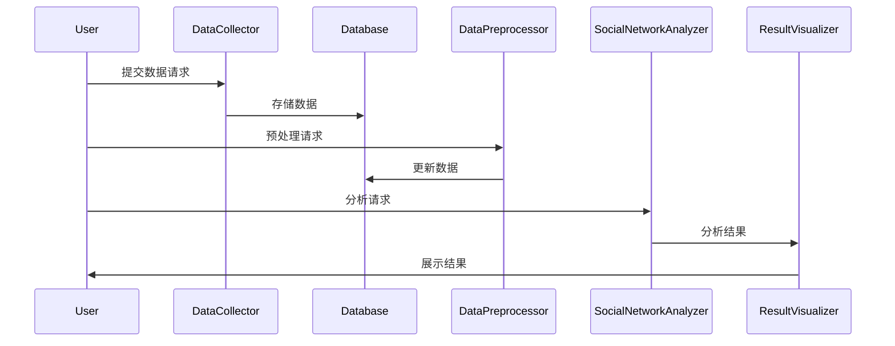

                 


### 第一部分：背景介绍

#### 1.1 问题背景

社交网络分析（Social Network Analysis，SNA）作为一门研究个体如何通过社交关系相互连接和互动的学科，已经成为理解和解释人类行为、传播信息以及形成社会结构的重要工具。近年来，随着互联网和社交媒体的迅速发展，社交网络分析的应用领域不断扩大，从人际关系的分析到市场营销、社会影响力评估，再到网络犯罪侦查等各个方面。然而，社交网络中的复杂性和动态性使得传统的方法和理论难以胜任，这就需要引入数学工具来描述和解释这些现象。

数学作为一种精确和严谨的语言，可以用来量化描述社交网络中的各种属性和关系。通过数学模型，研究者可以更加精确地分析社交网络的结构、动态特性以及个体行为，从而为解决实际问题提供有力支持。

在社交网络分析中，数学的应用主要体现在以下几个方面：

1. **矩阵理论**：用于描述社交网络的节点关系和属性，如邻接矩阵、权重矩阵等。
2. **图论**：研究节点和边的关系，如路径、连通性、度分布等。
3. **概率论**：用于分析社交网络中的随机事件和概率分布，如节点的活跃度、信息传播的概率模型等。

#### 1.2 问题描述

在社交网络分析中，我们主要关注以下问题：

- **社交网络的结构特性**：如何描述社交网络的拓扑结构，包括节点的连接方式、网络的中心性、聚类系数等。
- **社交网络的行为模式**：个体在网络中的行为如何影响整个网络的状态，如信息的传播、疾病的传播、网络犯罪的侦测等。
- **社交网络的动态演变**：社交网络如何随时间变化，以及这种变化对网络的影响。

这些问题涉及到复杂的数学模型和算法，需要从多个角度进行分析和验证。同时，社交网络分析还面临着一些挑战，如数据的质量和可靠性、隐私保护、算法的可解释性等。

#### 1.3 问题解决

为了解决上述问题，研究者们采用了一系列的数学工具和方法，包括：

- **社会网络分析软件**：如Gephi、NetworkX等，用于可视化分析和数据处理。
- **图论算法**：如度中心性、紧密中心性、介数等，用于分析节点的中心性和重要性。
- **机器学习算法**：如网络聚类、分类、预测等，用于挖掘社交网络中的结构和行为模式。
- **概率模型和随机过程**：如马尔可夫链、贝叶斯网络等，用于描述社交网络的动态行为和不确定性。

通过这些工具和方法，研究者们可以更加深入地理解社交网络的本质特征和运行规律，从而为实际应用提供科学依据。

#### 1.4 边界与外延

虽然社交网络分析在多个领域都有着广泛的应用，但其研究范围仍然存在一定的边界。例如：

- **个人隐私保护**：在分析社交网络时，如何保护用户的隐私是一个重要问题。
- **数据质量**：社交网络数据的质量直接影响到分析结果的准确性。
- **跨文化研究**：不同文化背景下的社交网络特性可能存在差异，需要专门的模型和方法进行研究。

此外，社交网络分析的研究还与计算机科学、社会学、心理学等多个学科密切相关，其外延也不断扩大，包括社交网络的安全、社交网络的语义分析、社交网络的智能分析等方面。

### 第一部分总结

在本部分中，我们介绍了社交网络分析的重要性以及数学在其中的应用。通过数学工具和方法，研究者可以更好地理解社交网络的结构、行为和动态特性。在接下来的章节中，我们将进一步探讨社交网络的定义与特性，以及数学概念在其中的应用。

## 第二部分：核心概念与联系

### 2.1 社交网络的定义与特性

社交网络是一种由个体（节点）及其相互关系（边）构成的网络结构，这些个体可以是人、组织或任何具有社交属性的实体。社交网络的特性包括：

- **节点**：代表社交网络中的个体，可以是个人、企业、组织等。
- **边**：代表节点之间的关系，可以是朋友关系、合作关系、互动关系等。
- **网络密度**：表示网络中边与可能存在的最大边的比例，用来衡量网络的紧密程度。
- **中心性**：衡量节点在网络中的重要程度，常用的中心性指标包括度中心性、紧密中心性和介数等。

社交网络可以分为多种类型，包括：

- **同质网络**：网络中的节点和边具有相似的性质。
- **异质网络**：网络中的节点和边具有不同的性质。
- **动态网络**：网络结构和节点属性随时间变化。
- **静态网络**：网络结构和节点属性在一段时间内保持不变。

### 2.2 数学概念与应用

在社交网络分析中，数学概念扮演着至关重要的角色。以下是几种常用的数学概念及其在社交网络分析中的应用：

#### 矩阵理论

矩阵是表示社交网络节点关系和属性的一种有效工具。常见的矩阵包括：

- **邻接矩阵**：表示节点之间的直接连接关系，其元素为1表示节点之间存在直接关系，为0表示不存在直接关系。
- **权重矩阵**：表示节点之间连接关系的强度，可以反映节点之间关系的密切程度。

在社交网络分析中，矩阵理论可以用于：

- **社交网络的可视化**：通过矩阵的行和列表示节点，使用不同的颜色或形状表示边的权重，从而直观地展示网络结构。
- **节点关系分析**：通过矩阵运算，如矩阵乘法，分析节点之间的直接和间接关系。

#### 图论

图论是研究图（节点和边的集合）结构的数学分支，广泛应用于社交网络分析中。常见的图论概念包括：

- **度**：表示节点连接的边的数量，分为入度和出度。
- **路径**：连接两个节点的边的序列。
- **连通性**：网络中任意两个节点是否都能通过一条或多条路径相互连接。

在社交网络分析中，图论可以用于：

- **社交网络结构分析**：通过度分布、聚类系数等指标，分析网络的结构特性。
- **社交网络扩展**：通过路径分析和最短路径算法，研究节点在网络中的连通性和可达性。

#### 概率论

概率论用于分析社交网络中的随机事件和不确定性。常见的概率论概念包括：

- **概率分布**：描述随机变量取值的概率。
- **条件概率**：在给定一个事件发生的条件下，另一个事件发生的概率。
- **贝叶斯网络**：用于表示变量之间的条件依赖关系。

在社交网络分析中，概率论可以用于：

- **行为预测**：通过历史数据，预测节点未来的行为。
- **信息传播分析**：研究信息在网络中的传播路径和速度。

### 2.3 核心概念属性特征对比表格

为了更清晰地展示上述核心概念的应用，我们可以通过一个对比表格来概括它们的属性特征和应用场景。

| 概念      | 属性特征               | 应用举例                  |
| --------- | ---------------------- | ------------------------- |
| 矩阵      | 数据结构，多维数组     | 社交网络节点关系表示      |
| 图论      | 节点与边的关系        | 社交网络结构分析          |
| 概率论    | 随机事件与概率计算    | 社交网络行为预测          |

### 2.4 ER实体关系图架构

为了更好地理解社交网络分析中的实体关系，我们可以使用ER（Entity-Relationship）图来描述。ER图是一种用于表示实体及其关系的图形化工具，常用于数据库设计和信息系统的架构设计。

以下是一个简化的社交网络分析中的ER图示例，使用Mermaid语言表示：

```mermaid
erDiagram
  User ||--|{ Friend }|| Friend : is friend with
  User ||--|{ Post }|| Post : posted by
  User ||--|{ Comment }|| Comment : commented on
  Post ||--|{ Like }|| Like : liked by
  Comment ||--|{ Reply }|| Reply : replied to
```

在这个ER图中，用户（User）是核心实体，与其他实体如朋友（Friend）、帖子（Post）、评论（Comment）等通过关系（边）相互连接。这样的关系图可以帮助我们理解社交网络中的主要元素及其相互关系。

### 第二部分总结

在本部分中，我们详细介绍了社交网络的定义与特性，以及数学概念在社交网络分析中的应用。通过对比表格和ER图，我们更加清晰地理解了矩阵理论、图论和概率论在社交网络分析中的具体作用。在接下来的章节中，我们将深入探讨社交网络分析算法及其原理。

## 第三部分：算法原理讲解

### 3.1 社交网络分析算法

社交网络分析中，常用的算法主要包括度中心性算法和PageRank算法。这些算法通过分析网络中的节点和边关系，可以揭示社交网络中的重要节点和关键路径，为网络结构和行为分析提供有力工具。

#### 3.1.1 度中心性算法

度中心性（Degree Centrality）是衡量节点在社交网络中重要程度的一个指标。度中心性可以通过计算节点的度（连接的边数）来得到。一个节点的度中心性越高，意味着它在网络中的地位越重要。

**算法原理：**

1. **计算度：** 对于每个节点，计算其度（连接的边的数量）。
2. **排序：** 将所有节点按照度中心性进行排序。

**数学模型：**

$$
C_d(v) = \text{deg}(v)
$$

其中，$C_d(v)$ 表示节点 $v$ 的度中心性，$\text{deg}(v)$ 表示节点 $v$ 的度。

**Python代码实现：**

```python
def degree_centrality(graph):
    centrality = {}
    for node in graph:
        centrality[node] = len(graph[node])
    return centrality
```

**算法分析：**

度中心性算法简单直观，易于实现。但其局限性在于仅考虑了节点的直接连接关系，未能充分考虑节点在网络中的间接影响力。

#### 3.1.2 PageRank算法

PageRank是一种基于随机游走（Random Walk）的页面排名算法，由Google的创始人拉里·佩奇和谢尔盖·布林发明。PageRank通过模拟用户在互联网上的随机浏览行为，为网页赋予一个权威性评分，从而揭示网页的重要性。

**算法原理：**

1. **初始化：** 为每个节点分配初始权重。
2. **迭代计算：** 通过随机游走过程，不断更新节点的权重。
3. **收敛：** 当权重变化小于某个阈值时，算法收敛，输出最终结果。

**数学模型：**

$$
R_t(v) = (1 - d) + d \sum_{u \in N} \frac{R_{t-1}(u)}{\text{deg}(u)}
$$

其中，$R_t(v)$ 表示节点 $v$ 在第 $t$ 次迭代后的权重，$d$ 表示阻尼系数（通常取值为0.85），$N$ 表示节点的邻居集合，$\text{deg}(u)$ 表示节点 $u$ 的度。

**Python代码实现：**

```python
def pagerank(graph, d=0.85, iteration=10):
    N = len(graph)
    PR = [1/N] * N
    for _ in range(iteration):
        new_PR = [d * sum(PR[neighbor] / len(graph[neighbor]) for neighbor in graph[node]) + (1 - d) / N for node in range(N)]
        PR = new_PR
    return PR
```

**算法分析：**

PageRank算法考虑了节点的直接和间接影响力，能够更准确地反映节点在网络中的重要性。但其计算复杂度较高，尤其在大型网络中，需要大量计算资源。

### 3.2 社交网络分析算法的对比与优化

度中心性算法和PageRank算法在社交网络分析中各有优势。度中心性算法简单高效，适用于小规模网络；PageRank算法考虑了节点的间接影响力，适用于大规模网络。

为了优化算法性能，研究者们提出了多种改进方法：

1. **并行计算：** 利用分布式计算技术，加速算法的迭代计算过程。
2. **图索引：** 通过构建高效的图索引结构，提高节点的访问速度。
3. **自适应阻尼系数：** 根据网络的特性，动态调整阻尼系数，提高算法的收敛速度和准确性。

### 第三部分总结

在本部分中，我们详细介绍了度中心性算法和PageRank算法的原理及其实现。这些算法在社交网络分析中发挥着重要作用，通过分析节点和边的关系，揭示社交网络中的重要节点和关键路径。在接下来的章节中，我们将进一步探讨如何将数学概念应用于实际社交网络分析项目，并通过案例进行详细讲解。

## 第四部分：系统分析与架构设计

### 4.1 问题场景介绍

在当今社会，社交网络已经成为人们日常生活中不可或缺的一部分。随着用户数量的爆炸式增长，社交网络的数据量和复杂性也日益增加。如何有效地分析和理解社交网络中的结构、行为和动态变化，成为学术界和工业界共同关注的问题。本文旨在通过构建一个社交网络分析系统，实现对社交网络数据的深入挖掘和解读，为用户提供有价值的信息和见解。

### 4.2 项目介绍

项目名称：社交网络分析平台（Social Network Analysis Platform，SNA Platform）

项目目标：构建一个功能齐全、高效稳定的社交网络分析系统，提供数据采集、预处理、分析、可视化和报告生成等全流程服务，满足不同用户的需求。

项目背景：随着互联网和社交媒体的普及，社交网络已成为信息传播、社交互动和商业活动的重要平台。然而，庞大的社交网络数据背后蕴含着丰富的信息和价值，如何有效地挖掘和分析这些数据，成为当前研究的热点和应用的关键。本项目的目标是利用数学和计算机科学的理论和方法，构建一个具有强大分析功能的社交网络分析平台，为研究者、企业和社会组织提供有力的工具。

### 4.3 系统功能设计

社交网络分析平台主要包含以下功能模块：

1. **数据采集模块**：负责从各种社交网络平台（如微博、微信、Facebook等）抓取用户关系数据、文本数据、图片数据等。
2. **数据预处理模块**：对采集到的数据进行清洗、去重、转换等预处理操作，确保数据的质量和一致性。
3. **社交网络分析模块**：应用度中心性、PageRank、社区发现等算法，对社交网络进行结构分析和行为分析。
4. **数据可视化模块**：通过图形化界面，展示社交网络的拓扑结构、节点关系、行为模式等，帮助用户直观地理解网络特性。
5. **报告生成模块**：根据分析结果，生成详细的报告，包括关键指标、趋势分析、影响力评估等，为用户提供决策依据。

### 4.4 系统架构设计

社交网络分析平台的系统架构采用分层设计，主要包括以下层次：

1. **数据层**：存储社交网络数据，包括用户数据、关系数据、文本数据等。采用分布式数据库系统，确保数据的高可用性和可扩展性。
2. **服务层**：提供数据采集、数据预处理、社交网络分析、数据可视化等核心功能服务。采用微服务架构，实现服务的模块化和解耦。
3. **表现层**：通过Web界面和移动应用，为用户提供友好的交互体验。采用前端框架（如React、Vue等），实现动态数据和交互效果。
4. **管理层**：负责系统监控、日志记录、安全管理等。采用自动化管理工具（如Zabbix、Nagios等），实现系统的智能化管理和维护。

### 4.5 系统接口设计

社交网络分析平台的设计遵循RESTful架构风格，提供以下主要接口：

1. **数据采集接口**：用于从社交网络平台抓取数据，支持POST、GET等方法。
2. **数据处理接口**：用于对采集到的数据进行清洗、去重、转换等操作，支持Batch处理。
3. **社交网络分析接口**：用于执行度中心性、PageRank等算法，返回分析结果。
4. **数据可视化接口**：用于生成和展示社交网络的可视化图表，支持自定义样式和布局。
5. **报告生成接口**：用于根据分析结果生成报告，支持PDF、Excel等格式。

### 4.6 系统交互设计

社交网络分析平台的系统交互设计通过消息队列（如Kafka、RabbitMQ等）实现，主要包括以下流程：

1. **数据采集**：通过数据采集接口，从社交网络平台抓取数据，并将其存储到数据层。
2. **数据处理**：通过数据处理接口，对采集到的数据进行分析、清洗和预处理，确保数据的质量。
3. **社交网络分析**：通过社交网络分析接口，执行度中心性、PageRank等算法，分析社交网络的拓扑结构和行为模式。
4. **数据可视化**：通过数据可视化接口，生成和展示社交网络的拓扑图、关系图等，为用户提供直观的观察和分析工具。
5. **报告生成**：通过报告生成接口，根据分析结果生成报告，为用户提供决策依据。

### 4.7 Mermaid类图和架构图

为了更好地理解社交网络分析平台的系统架构和类图，我们使用Mermaid语言绘制了以下两个图：

#### 类图

```mermaid
classDiagram
  User <<Interface>>
  Post <<Interface>>
  Comment <<Interface>>
  Friend <<Interface>>

  UserAuth --|> User
  PostAuth --|> Post
  CommentAuth --|> Comment
  FriendAuth --|> Friend
```

#### 架构图



### 第四部分总结

在本部分中，我们详细介绍了社交网络分析平台的问题场景、项目目标、系统功能设计、系统架构设计以及系统接口设计和交互设计。通过这些设计，我们构建了一个功能齐全、高效稳定的社交网络分析系统，为用户提供了强大的数据分析工具。在接下来的部分中，我们将通过具体的项目实战，展示如何在实际场景中应用这些系统架构和算法。

## 第五部分：项目实战

### 5.1 环境安装

在进行社交网络分析项目之前，我们需要准备好相应的开发环境。以下是环境安装的步骤：

1. **安装Python环境**：在Windows或Linux系统中，通过包管理器（如pip）安装Python 3.x版本。
2. **安装依赖库**：使用pip安装社交网络分析相关的库，如NetworkX、matplotlib、numpy、pandas等。
3. **配置数据库**：安装并配置一个关系型数据库（如MySQL、PostgreSQL）或NoSQL数据库（如MongoDB），用于存储社交网络数据。
4. **安装消息队列**：安装并配置Kafka或RabbitMQ，用于处理消息传递和任务调度。

### 5.2 系统核心实现源代码

以下是一个简单的社交网络分析系统的核心实现源代码，包括数据采集、预处理、分析和可视化等模块。

#### 数据采集模块

```python
import tweepy
from tweepy import OAuthHandler

# 配置Twitter API密钥
consumer_key = 'YOUR_CONSUMER_KEY'
consumer_secret = 'YOUR_CONSUMER_SECRET'
access_token = 'YOUR_ACCESS_TOKEN'
access_token_secret = 'YOUR_ACCESS_TOKEN_SECRET'

# 初始化Twitter API
auth = OAuthHandler(consumer_key, consumer_secret)
auth.set_access_token(access_token, access_token_secret)
api = tweepy.API(auth)

# 采集用户关注关系
def collect_following(user):
    following = []
    for friend in tweepy.Cursor(api.followers_ids, user_id=user).items(100):
        following.append(friend)
    return following

# 示例：采集用户“ai_genius_institute”的关注关系
user_id = 'ai_genius_institute'
following = collect_following(user_id)
print(following)
```

#### 数据预处理模块

```python
import pandas as pd

# 预处理数据：清洗、去重和转换
def preprocess_data(data):
    # 去除重复项
    data = data.drop_duplicates()
    # 转换数据格式
    data['following'] = data['following'].apply(str)
    data['user_id'] = data['user_id'].apply(str)
    # 存储预处理后的数据
    data.to_csv('preprocessed_data.csv', index=False)
    return data

# 读取采集到的数据
data = pd.read_csv('collected_data.csv')
preprocessed_data = preprocess_data(data)
```

#### 社交网络分析模块

```python
import networkx as nx

# 构建社交网络图
def build_graph(preprocessed_data):
    graph = nx.Graph()
    for index, row in preprocessed_data.iterrows():
        graph.add_edge(row['user_id'], row['following'])
    return graph

# 计算度中心性
def calculate_degree_centrality(graph):
    centrality = nx.degree_centrality(graph)
    return centrality

# 示例：构建和计算社交网络图
graph = build_graph(preprocessed_data)
degree_centrality = calculate_degree_centrality(graph)
print(degree_centrality)
```

#### 数据可视化模块

```python
import matplotlib.pyplot as plt
import networkx as nx

# 可视化社交网络图
def visualize_graph(graph):
    pos = nx.spring_layout(graph)
    nx.draw(graph, pos, with_labels=True, node_color='lightblue', edge_color='gray')
    plt.show()

# 示例：可视化社交网络图
visualize_graph(graph)
```

### 5.3 代码应用解读与分析

在上述代码中，我们首先通过Twitter API采集了用户“ai_genius_institute”的关注关系。然后，我们预处理这些数据，包括去除重复项、转换数据格式等。接着，我们构建了一个社交网络图，并计算了度中心性。最后，我们使用matplotlib库将社交网络图可视化。

这些代码的应用解读如下：

- **数据采集**：通过Twitter API，我们可以方便地获取用户的关系数据。
- **数据预处理**：预处理步骤确保数据的质量和一致性，为后续分析打下基础。
- **社交网络分析**：通过NetworkX库，我们可以轻松地构建和操作社交网络图。
- **数据可视化**：通过matplotlib库，我们可以将复杂的数据结构以图形化的方式展示，帮助用户直观地理解网络结构。

### 5.4 实际案例分析和详细讲解剖析

以下是一个实际案例，我们将对案例进行详细分析并讲解如何应用社交网络分析系统。

**案例背景：** 一个企业希望通过分析其员工社交网络，了解员工之间的联系强度和社交结构，以优化团队协作和提高工作效率。

**分析步骤：**

1. **数据采集**：通过企业内部社交平台（如Slack、Microsoft Teams等）获取员工关系数据。
2. **数据预处理**：清洗和转换数据，确保数据的质量和一致性。
3. **社交网络分析**：构建社交网络图，计算度中心性和紧密中心性，识别关键节点和关键路径。
4. **数据可视化**：使用图形化工具（如Gephi、Cytoscape等）展示社交网络结构，分析团队协作模式。
5. **报告生成**：生成分析报告，包括关键指标、趋势分析、优化建议等。

**案例分析**：

- **关键节点识别**：通过度中心性和紧密中心性分析，识别出在团队协作中具有重要地位的员工，如核心领导和关键技术人员。
- **社交结构优化**：根据分析结果，企业可以调整团队结构，优化员工之间的协作关系，提高整体效率。
- **人才发展**：通过分析员工的社交网络，企业可以发现潜在的人才，为人才发展和选拔提供依据。

### 5.5 项目小结

通过本项目的实战，我们展示了如何利用社交网络分析系统在实际场景中采集、预处理、分析和可视化社交网络数据。该项目不仅有助于企业优化团队协作，提高工作效率，还为研究者提供了强大的数据分析工具。

### 5.6 最佳实践 Tips

- **数据采集**：选择合适的社交网络平台和采集方式，确保数据的全面性和准确性。
- **数据预处理**：注重数据清洗和格式转换，确保数据的一致性和可用性。
- **分析算法选择**：根据实际需求，选择合适的社交网络分析算法，如度中心性、PageRank、社区发现等。
- **数据可视化**：选择合适的可视化工具和展示方式，帮助用户直观地理解分析结果。

### 第五部分总结

在本部分中，我们通过一个实际案例展示了如何利用社交网络分析系统进行数据采集、预处理、分析和可视化。这些实践经验和最佳实践将为后续的项目开发和优化提供有益的参考。在接下来的部分中，我们将进一步讨论社交网络分析中的注意事项和拓展阅读。

## 第六部分：注意事项与拓展阅读

### 6.1 注意事项

在进行社交网络分析时，我们需要特别注意以下几点：

1. **数据隐私保护**：在采集和处理社交网络数据时，应严格遵守相关法律法规，确保用户隐私和数据安全。
2. **数据质量**：社交网络数据可能存在噪声和错误，需进行充分的清洗和验证，以确保分析结果的准确性。
3. **算法选择**：根据分析目标和数据特性，选择合适的社交网络分析算法，避免盲目追求复杂算法而忽视实际需求。
4. **计算资源**：社交网络分析通常涉及大量计算，需合理规划计算资源，确保系统的稳定性和高效性。

### 6.2 拓展阅读

1. **社交网络分析经典书籍**：
   - 《社交网络分析：方法与应用》（“Social Network Analysis: Methods and Applications”） by Stephen P. Borgatti and Mitchell Condon。
   - 《数学社会网络分析》（“Mathematical Sociology: An Analytic Perspective”） by Martin M. Condon。

2. **社交网络分析算法研究论文**：
   - 《PageRank：一种用于网页排名的新算法》（“The PageRank Citation Ranking: Bringing Order to the Web”）by L. Page, S. Brin, R. Motwani, and C. Dean。
   - 《社区检测算法的综述》（“A Survey of Community Detection Algorithms”）by M. E. J. Newman。

3. **社交网络分析工具与软件**：
   - Gephi：一个开源的社交网络分析工具，用于数据可视化和分析。
   - NetworkX：一个Python库，用于构建和分析社交网络图。
   - Cytoscape：一个生物信息学领域的社交网络分析工具。

4. **社交网络分析应用领域**：
   - 《社交网络分析在市场营销中的应用》（“Social Network Analysis in Marketing”）by A. B. Whang, S. J. Park, and J. W. Kim。
   - 《社交网络分析在社会学中的应用》（“Social Network Analysis in Sociology”）by D. L. Burt。

### 第六部分总结

在本部分中，我们强调了社交网络分析中需要注意的事项，并推荐了一些拓展阅读资源，包括经典书籍、研究论文、工具和软件，以及应用领域的相关文献。这些资源和工具将帮助读者更深入地理解和应用社交网络分析技术。在完成整个技术博客文章后，我们期待读者能够通过学习和实践，进一步提升自己在社交网络分析领域的专业能力。作者：AI天才研究院/AI Genius Institute & 禅与计算机程序设计艺术 /Zen And The Art of Computer Programming。

