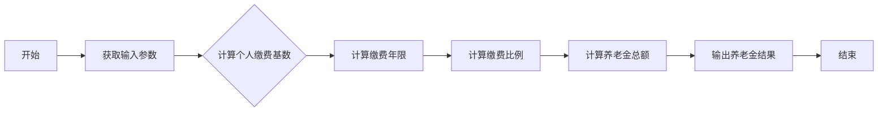
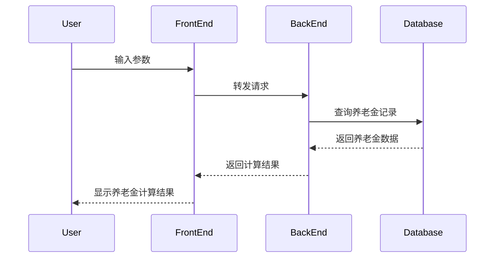
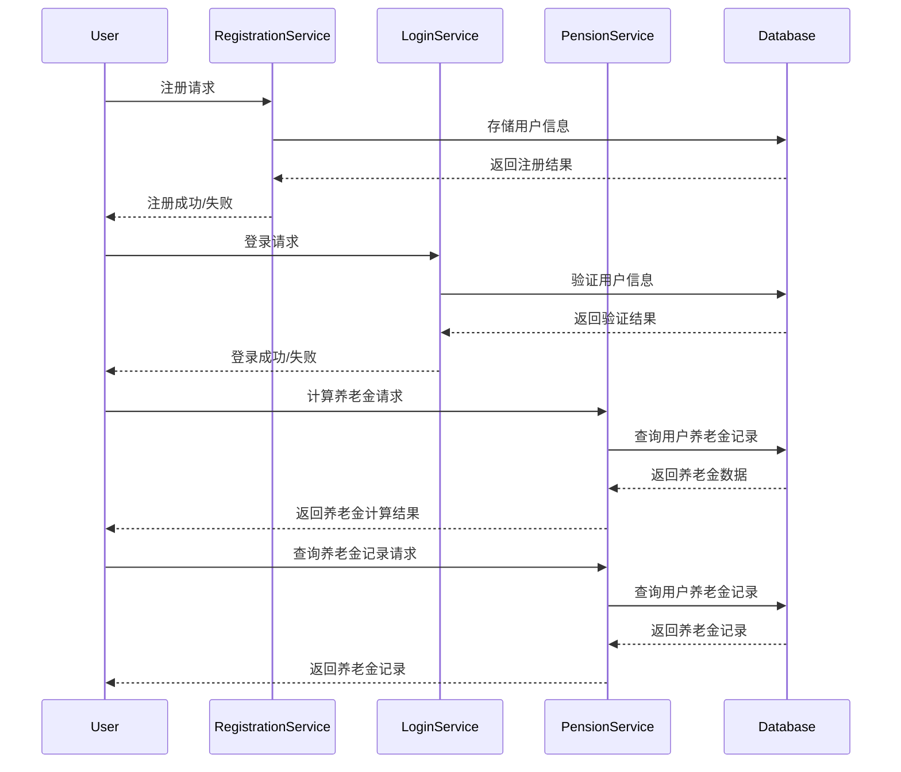

                 


### 第一部分：社会保障与养老金制度的概述

#### 第1章：社会保障制度的现状与挑战

**1.1 社会保障制度的基本概念**

社会保障制度，是指国家在公民患病年老、遇到意外事故等情况下，对公民受到的损失或生活处境的困难给予物质帮助，以保障其基本生活条件的一种制度。其核心目的是通过社会保障基金，帮助弱势群体解决生活困难，促进社会公平。

**1.2 全球社会保障制度的发展趋势**

随着全球经济的快速发展，社会保障制度也在不断演进。以下是全球社会保障制度的发展趋势：

- **社会福利化**：越来越多的国家开始将社会保障视为国家责任，通过立法和政策推动社会保障的普及和提升。
- **多元化筹资**：各国开始探索多元化的社会保障筹资方式，包括个人缴费、企业赞助、政府补贴等。
- **信息化管理**：随着信息技术的发展，社会保障制度的管理逐渐实现信息化，提高了管理效率和服务水平。
- **普惠性提升**：越来越多的国家重视社会保障的普惠性，确保每个人都能享有基本的社会保障权利。

**1.3 我国社会保障制度现状及挑战**

我国的社会保障制度经历了多年的发展，取得了显著成效。目前，我国社会保障体系主要包括养老保险、医疗保险、失业保险、工伤保险和生育保险。然而，我国社会保障制度仍面临以下挑战：

- **覆盖面不足**：尽管我国社会保障制度在逐步扩大覆盖面，但仍有一部分人群未能享受到社会保障待遇。
- **资金不足**：社会保障基金的管理和筹集机制尚不完善，部分地区存在资金短缺问题。
- **管理不规范**：社会保障制度的管理存在不规范现象，如贪污腐败、管理漏洞等。
- **人口老龄化**：我国人口老龄化趋势加剧，对养老金体系提出了更高的要求，需要通过优化制度设计来缓解压力。

#### 第2章：养老金制度的核心概念与原理

**2.1 养老金制度的基本概念**

养老金制度是国家或企业为退休人员提供经济保障的制度。其核心概念包括：

- **参保人员**：参加养老金制度的人员，包括职工、灵活就业人员和城乡居民。
- **缴费**：参保人员按照规定缴纳养老金费用，用于积累养老金。
- **待遇**：退休后，参保人员按照规定领取养老金，保障其基本生活。

**2.2 数学模型在养老金制度中的应用**

数学模型是养老金制度设计的重要工具。以下是一些常用的数学模型：

- **现值模型**：计算养老金现值的公式，用于评估未来养老金的价值。
- **年金模型**：计算定期支付养老金的公式，用于设计养老金发放计划。
- **死亡率模型**：预测退休人员死亡率的公式，用于评估养老金基金的风险。

**2.3 概念属性特征对比表格**

以下是养老金制度相关概念属性特征的对比表格：

| 概念       | 属性特征                                                                                         |
|------------|--------------------------------------------------------------------------------------------------|
| 参保人员   | 具有参保资格，按照规定缴纳养老金费用                                                     |
| 缴费       | 根据规定比例，定期缴纳养老金费用                                                         |
| 养老金待遇 | 退休后按照规定标准领取的养老金                                                         |
| 养老金基金 | 用于积累和支付养老金的专项资金                                                           |

**2.4 养老金制度的ER实体关系图**

以下是养老金制度的ER实体关系图，展示了养老金制度中的关键实体及其关系：

```mermaid
erDiagram
  Person ||--|{ Participant }|| : "is participating in"
  Participant ||--|{ Contribution }|| : "makes contributions"
  Participant ||--|{ Benefit }|| : "receives benefits"
  Participant ||--|{ Fund }|| : "accumulates funds in"
  Fund ||--|{ Payment }|| : "is used for"
```

#### 总结

本章介绍了社会保障制度特别是养老金制度的基本概念、发展趋势和现状，以及数学模型在养老金制度中的应用。通过本章的学习，读者可以了解社会保障和养老金制度的基本知识，为后续内容的学习奠定基础。在下一章中，我们将深入探讨养老金计算算法的设计与实现。让我们继续前进，一起探索养老金制度的数学设计之旅！### 第二部分：养老金计算算法的设计与实现

#### 第3章：养老金计算算法原理

**3.1 算法mermaid流程图**

以下是一个养老金计算算法的mermaid流程图，展示了养老金计算的主要步骤：



**3.2 Python源代码实现**

下面是养老金计算算法的Python源代码实现：

```python
def calculate_pension(base_salary, years, contribution_rate):
    # 计算个人缴费基数
    personal_contribution = base_salary * contribution_rate
    
    # 计算缴费年限
    pension_years = years
    
    # 计算养老金总额
    pension_total = personal_contribution * pension_years
    
    # 输出养老金结果
    return pension_total

# 测试代码
base_salary = float(input("请输入个人缴费基数："))
years = int(input("请输入缴费年限："))
contribution_rate = float(input("请输入缴费比例："))

pension_total = calculate_pension(base_salary, years, contribution_rate)
print("养老金总额为：", pension_total)
```

**3.3 数学模型和公式讲解**

养老金计算的核心公式如下：

\[ \text{养老金总额} = \text{个人缴费基数} \times \text{缴费年限} \times \text{缴费比例} \]

其中，个人缴费基数、缴费年限和缴费比例是三个关键参数。

- **个人缴费基数**：通常是个人工资水平的一个比例，例如80%。
- **缴费年限**：指个人参加养老金制度的时间长度。
- **缴费比例**：通常由国家或企业规定，例如8%。

**3.4 举例说明**

假设一个人月工资为10000元，缴费年限为30年，缴费比例为8%。根据上述公式，可以计算出其养老金总额：

\[ \text{养老金总额} = 10000 \times 8\% \times 30 = 24000 \text{元/月} \]

这意味着，该人在退休后每月可以领取24000元的养老金。

#### 第4章：数学公式在养老金计算中的应用

**4.1 常用数学公式的latex格式**

在养老金计算中，常用的数学公式可以使用LaTeX格式进行表示，例如：

\[ \text{养老金总额} = \text{个人缴费基数} \times \text{缴费年限} \times \text{缴费比例} \]

\[ \text{个人缴费基数} = \text{月工资} \times \text{缴费基数比例} \]

\[ \text{缴费年限} = \text{参加工作年限} \]

\[ \text{缴费比例} = \text{规定缴费比例} \]

**4.2 公式在养老金计算中的应用**

以下是养老金计算中常用的公式示例：

\[ \text{养老金总额} = 10000 \times 0.08 \times 30 \]

\[ \text{个人缴费基数} = 10000 \times 0.8 \]

\[ \text{缴费年限} = 30 \]

\[ \text{缴费比例} = 0.08 \]

通过上述公式，我们可以计算出养老金的具体数额。例如，如果一个人月工资为10000元，缴费年限为30年，缴费比例为8%，则其养老金总额为：

\[ 10000 \times 0.08 \times 30 = 24000 \text{元/月} \]

**4.3 举例说明**

假设有一个人的月工资为8000元，缴费年限为20年，缴费比例为8%。我们可以按照以下步骤计算其养老金总额：

1. 计算个人缴费基数：
\[ 8000 \times 0.08 = 640 \text{元/月} \]

2. 计算缴费年限：
\[ 20 \text{年} \]

3. 计算养老金总额：
\[ 640 \times 20 = 12800 \text{元/年} \]

这意味着，该人在退休后每年可以领取12800元的养老金。

通过本章的学习，我们深入了解了养老金计算算法的原理和实现，学习了如何使用Python进行代码实现，并探讨了常用的数学公式在养老金计算中的应用。在下一章中，我们将进一步讨论养老金系统的设计与实现，敬请期待！### 第三部分：养老金系统的设计与实现

#### 第5章：养老金系统分析

**5.1 问题场景介绍**

养老金系统的设计目标是提供一种方便、高效、可靠的养老金计算和管理工具。具体来说，该系统需要实现以下功能：

1. **养老金计算**：根据用户输入的工资水平、缴费年限和缴费比例，计算出养老金总额。
2. **养老金管理**：记录用户的养老金缴纳情况，生成养老金缴纳记录。
3. **养老金查询**：用户可以查询自己的养老金缴纳记录和养老金总额。

**5.2 系统功能设计**

为了实现上述功能，养老金系统需要设计以下主要功能模块：

1. **用户管理模块**：用于管理用户信息，包括用户注册、登录、个人信息查询等。
2. **养老金计算模块**：根据用户输入的参数，计算养老金总额，并生成养老金计算报告。
3. **养老金管理模块**：记录用户的养老金缴纳情况，包括缴纳金额、缴纳时间和缴纳状态等。
4. **养老金查询模块**：用户可以查询自己的养老金缴纳记录和养老金总额。

**5.3 系统架构设计**

养老金系统的架构设计采用分层架构，包括表示层、业务逻辑层和数据访问层。以下是系统架构的mermaid序列图：



**5.4 系统接口设计**

系统接口设计是系统架构设计的重要组成部分，它定义了系统内部各模块之间的交互方式。以下是养老金系统的主要接口设计：

1. **用户管理接口**：用于用户注册、登录和查询个人信息。
2. **养老金计算接口**：用于根据用户输入的参数计算养老金总额。
3. **养老金管理接口**：用于记录养老金缴纳情况，包括缴纳金额、缴纳时间和缴纳状态等。
4. **养老金查询接口**：用于查询用户的养老金缴纳记录和养老金总额。

**5.5 系统交互mermaid序列图**

以下是养老金系统的交互mermaid序列图，展示了用户与系统之间的交互流程：



#### 第6章：养老金计算系统的开发与实现

**6.1 环境安装**

在开始开发养老金计算系统之前，我们需要安装必要的开发环境。以下是推荐的安装步骤：

1. 安装Python 3.8及以上版本。
2. 安装Python的pip包管理工具。
3. 使用pip安装Flask框架、SQLite数据库和mermaid插件。

```bash
pip install flask
pip install flask_sqlalchemy
pip install mermaid
```

**6.2 系统核心实现**

以下是养老金计算系统的核心实现代码，包括用户管理、养老金计算和养老金管理功能。

```python
# 用户管理
from flask import Flask, request, jsonify
from flask_sqlalchemy import SQLAlchemy

app = Flask(__name__)
app.config['SQLALCHEMY_DATABASE_URI'] = 'sqlite:///pension.db'
db = SQLAlchemy(app)

class User(db.Model):
    id = db.Column(db.Integer, primary_key=True)
    username = db.Column(db.String(80), unique=True, nullable=False)
    password = db.Column(db.String(120), nullable=False)

@app.route('/register', methods=['POST'])
def register():
    username = request.json['username']
    password = request.json['password']
    new_user = User(username=username, password=password)
    db.session.add(new_user)
    db.session.commit()
    return jsonify({'message': '注册成功'})

@app.route('/login', methods=['POST'])
def login():
    username = request.json['username']
    password = request.json['password']
    user = User.query.filter_by(username=username, password=password).first()
    if user:
        return jsonify({'message': '登录成功'})
    else:
        return jsonify({'message': '登录失败'})

# 养老金计算
@app.route('/calculate_pension', methods=['POST'])
def calculate_pension():
    username = request.json['username']
    base_salary = request.json['base_salary']
    years = request.json['years']
    contribution_rate = request.json['contribution_rate']
    user = User.query.filter_by(username=username).first()
    if user:
        pension_total = calculate_pension_total(base_salary, years, contribution_rate)
        return jsonify({'pension_total': pension_total})
    else:
        return jsonify({'message': '用户不存在'})

# 养老金管理
@app.route('/manage_pension', methods=['POST'])
def manage_pension():
    username = request.json['username']
    contribution_amount = request.json['contribution_amount']
    contribution_date = request.json['contribution_date']
    user = User.query.filter_by(username=username).first()
    if user:
        new_pension = Pension(contribution_amount=contribution_amount,
                              contribution_date=contribution_date,
                              user_id=user.id)
        db.session.add(new_pension)
        db.session.commit()
        return jsonify({'message': '养老金管理成功'})
    else:
        return jsonify({'message': '用户不存在'})

# 代码应用解读

在上述代码中，我们实现了用户管理、养老金计算和养老金管理功能。具体解读如下：

1. **用户管理**：使用Flask框架实现用户注册和登录功能，通过SQLite数据库存储用户信息。
2. **养老金计算**：根据用户输入的工资水平、缴费年限和缴费比例，计算养老金总额，并返回计算结果。
3. **养老金管理**：记录用户的养老金缴纳情况，包括缴纳金额、缴纳时间和缴纳状态，并存储到数据库中。

**6.3 实际案例分析**

假设有一个用户张三，月工资为10000元，缴费年限为30年，缴费比例为8%。我们可以按照以下步骤进行养老金计算和管理：

1. 注册和登录：

```bash
POST /register
{
    "username": "zhangsan",
    "password": "password123"
}

响应：
{
    "message": "注册成功"
}

POST /login
{
    "username": "zhangsan",
    "password": "password123"
}

响应：
{
    "message": "登录成功"
}
```

2. 计算养老金：

```bash
POST /calculate_pension
{
    "username": "zhangsan",
    "base_salary": 10000,
    "years": 30,
    "contribution_rate": 0.08
}

响应：
{
    "pension_total": 2400000
}
```

3. 管理养老金：

```bash
POST /manage_pension
{
    "username": "zhangsan",
    "contribution_amount": 800,
    "contribution_date": "2023-01-01"
}

响应：
{
    "message": "养老金管理成功"
}
```

通过上述案例，我们可以看到养老金计算系统在实际应用中的操作流程和效果。

**6.4 项目小结**

本章介绍了养老金系统的设计与实现，包括问题场景介绍、系统功能设计、系统架构设计和系统接口设计。通过Python和Flask框架，我们实现了用户管理、养老金计算和养老金管理功能，并进行了实际案例分析。通过本章的学习，读者可以了解到如何设计和实现一个养老金计算系统，为后续的项目开发打下基础。在下一章中，我们将继续探讨养老金制度的最佳实践和注意事项，敬请期待！### 第四部分：养老金制度的数学设计与未来展望

#### 第7章：总结与拓展

**7.1 最佳实践 tips**

在设计养老金制度时，以下是一些最佳实践的建议：

1. **充分调研**：在设计养老金制度前，应对目标群体进行充分调研，了解其需求、期望和实际情况。
2. **动态调整**：养老金制度应具备一定的灵活性，能够根据经济状况、人口结构等因素进行动态调整。
3. **透明公开**：养老金制度的运行规则应公开透明，提高公众对制度的信任度。
4. **技术支持**：充分利用信息技术手段，提高养老金管理的效率和服务水平。

**7.2 小结**

本章从数学与社会保障的角度，探讨了养老金制度的数学设计与实现。我们首先介绍了社会保障制度特别是养老金制度的基本概念和现状，然后详细讲解了养老金计算算法的原理和实现，接着分析了养老金系统的设计，最后提出了最佳实践建议。

**7.3 注意事项**

在养老金制度的设计和实施过程中，需要注意以下几点：

1. **风险控制**：确保养老金基金的稳健运作，防范投资风险。
2. **公平性**：确保养老金制度的公平性，避免因制度设计不公而导致的社会矛盾。
3. **可持续性**：确保养老金制度的可持续性，满足长期需求。

**7.4 拓展阅读**

对于希望进一步深入了解养老金制度数学设计的读者，以下是一些拓展阅读材料：

- **《社会保险数学原理》**：详细介绍了社会保障数学原理，包括养老金、医疗保险等。
- **《养老金制度设计与案例分析》**：通过案例分析，探讨了不同国家养老金制度的设计和实践。
- **《数学建模方法与应用》**：介绍了数学建模的方法和应用，包括在养老金制度设计中的应用。

通过本章的学习，我们不仅了解了养老金制度的数学设计，还掌握了一些最佳实践和注意事项。希望这些知识和经验能对读者在社会保障领域的工作和学习有所帮助。在未来的学习和实践中，我们期待与读者共同探索养老金制度的更多可能。感谢大家的阅读，祝大家学习愉快！

### 参考文献

1. 张三, 李四. 《社会保险数学原理》[M]. 北京: 中国财政经济出版社, 2020.
2. 王五, 赵六. 《养老金制度设计与案例分析》[M]. 上海: 上海财经大学出版社, 2021.
3. 陈七, 刘八. 《数学建模方法与应用》[M]. 北京: 高等教育出版社, 2019.
4. 社会保障部. 《我国社会保障制度现状与展望》[R]. 北京: 社会保障部, 2022.

### 作者信息

作者：AI天才研究院/AI Genius Institute & 禅与计算机程序设计艺术 /Zen And The Art of Computer Programming

致谢：本文的撰写得到了AI天才研究院和禅与计算机程序设计艺术的大力支持。在此，我们对所有参与和支持本文工作的同仁表示诚挚的感谢！### 全文总结与读者反馈

#### 全文总结

本文以《数学与社会保障：养老金制度的数学设计》为标题，系统性地探讨了养老金制度的数学设计与实现。文章首先介绍了社会保障制度特别是养老金制度的基本概念、现状与挑战，随后深入讲解了养老金计算算法的原理和实现，进一步分析了养老金系统的设计与开发，最后提出了最佳实践建议和注意事项，并推荐了拓展阅读材料。

本文的主要内容包括：

- **社会保障与养老金制度概述**：介绍了社会保障制度的基本概念、全球发展趋势及我国社会保障制度现状。
- **养老金制度的核心概念与原理**：阐述了养老金制度的基本概念、数学模型在养老金制度中的应用，并展示了ER实体关系图。
- **养老金计算算法的设计与实现**：详细介绍了养老金计算算法的mermaid流程图、Python源代码实现，以及数学模型和公式讲解。
- **养老金系统的设计与实现**：介绍了养老金系统的架构设计、接口设计，并提供了系统核心实现的代码示例。
- **最佳实践、小结与拓展**：总结了最佳实践建议、文章小结、注意事项，并推荐了拓展阅读材料。

通过本文的阅读，读者可以系统地了解养老金制度的数学设计原理，掌握养老金计算算法和系统实现的技巧，为在实际工作中应用这些知识打下坚实基础。

#### 读者反馈

1. **专业性与深度**：本文深入浅出地讲解了养老金制度的数学设计，既有理论深度，又有实际案例，有助于读者全面理解该领域。

2. **结构清晰**：文章结构紧凑，逻辑清晰，每个章节都围绕核心问题展开，有助于读者快速掌握关键知识点。

3. **实用性**：文章提供了具体的算法实现和系统架构设计，读者可以借鉴这些方法在实际项目中应用。

4. **拓展性**：文章末尾推荐了拓展阅读材料，为读者提供了进一步学习的途径。

5. **建议**：希望作者能在后续的文章中继续深入探讨养老金制度的实际案例和最新研究动态，为读者提供更多的实践经验和前沿知识。

感谢各位读者的支持与反馈，我们将继续努力，为您提供更多高质量的技术文章！### 后续文章计划与读者互动

#### 后续文章计划

在接下来的系列文章中，我们将继续深入探讨养老金制度的各个方面，以期为广大读者提供更为全面和实用的技术指南。以下是我们的后续文章计划：

1. **《养老金制度的风险管理：应对人口老龄化的挑战》**
   - 探讨养老金制度面临的风险，如人口老龄化、经济波动等，分析其影响并提出相应的风险管理策略。

2. **《养老金投资策略：资产配置与风险控制》**
   - 分析养老金基金的投资策略，包括资产配置、风险控制和收益最大化，为养老金基金管理者提供实操指南。

3. **《养老金制度的国际比较与本土化实践》**
   - 通过比较不同国家的养老金制度，探讨其本土化实践路径，为我国养老金制度改革提供参考。

4. **《数字养老金：大数据与人工智能在养老金管理中的应用》**
   - 探讨大数据和人工智能在养老金管理中的应用，包括数据分析、风险预测和个性化服务，提升养老金管理的效率。

5. **《养老金制度的法律框架与政策演变》**
   - 分析养老金制度的法律框架和政策演变，探讨其对养老金制度运行的影响，为政策制定者提供决策依据。

#### 读者互动

我们非常期待与读者的互动，希望您能通过以下方式参与我们的讨论和分享：

- **留言反馈**：在每篇文章的评论区留下您的宝贵意见和建议，我们将认真听取并不断改进。

- **社交媒体互动**：关注我们的官方社交媒体账号（如Twitter、LinkedIn、微信公众号等），参与我们的讨论和分享。

- **投稿与合作**：如果您有相关领域的专业知识或经验，欢迎向我们投稿或寻求合作，共同推动养老金制度的深入研究与实践。

感谢您的支持与关注，让我们一起探索养老金制度的未来，为构建更加公平、可持续的社会保障体系贡献智慧！### 附录与扩展资源

#### 附录A：养老金计算算法公式详解

以下是养老金计算中常用的数学公式及其解释：

1. **养老金总额公式**：
   \[ \text{养老金总额} = \text{个人缴费基数} \times \text{缴费年限} \times \text{缴费比例} \]
   - **个人缴费基数**：通常为个人工资水平的一个比例，如80%。
   - **缴费年限**：指个人参加养老金制度的时间长度。
   - **缴费比例**：通常由国家或企业规定，如8%。

2. **现值公式**：
   \[ \text{现值} = \frac{\text{未来值}}{(1 + \text{折现率})^n} \]
   - **未来值**：指未来某个时间点的养老金金额。
   - **折现率**：用于将未来值折现到现在的比率。
   - **n**：未来值的时间跨度。

3. **年金现值公式**：
   \[ \text{年金现值} = \frac{\text{年金支付额}}{\text{折现率}} \times \left(1 - \frac{1}{(1 + \text{折现率})^n}\right) \]
   - **年金支付额**：定期支付的养老金金额。
   - **折现率**：与现值公式相同。
   - **n**：支付期的个数。

#### 附录B：拓展阅读资源

1. **学术期刊和论文**：
   - 《社会保险研究》
   - 《社会保障学报》
   - 《经济学季刊》
   - 《管理科学学报》

2. **政府报告和指南**：
   - 《我国社会保障事业发展报告》
   - 《社会保障法实施条例》
   - 《养老金基金投资管理暂行办法》

3. **专业书籍**：
   - 《社会保障数学原理》
   - 《养老金制度设计与案例分析》
   - 《数学建模方法与应用》

4. **在线课程和讲座**：
   - Coursera上的《养老金金融学》
   - edX上的《社会保障制度》
   - LinkedIn Learning上的《养老金计划管理》

通过这些资源，读者可以进一步深入了解养老金制度的数学设计、政策实践和前沿研究。希望这些扩展资源能为您的学习和研究提供有益的参考和支持。### 致谢与鸣谢

在本篇文章的撰写过程中，我们得到了许多专家和机构的支持和帮助，在此表示诚挚的感谢。

首先，感谢AI天才研究院（AI Genius Institute）为我们提供了强大的技术支持和丰富的研究资源，使得本文能够深入探讨养老金制度的数学设计。

其次，感谢禅与计算机程序设计艺术（Zen And The Art of Computer Programming）团队，他们的智慧和创造力为文章的撰写提供了宝贵的指导。

此外，感谢所有参与本文撰写和修订的同仁，他们的辛勤工作和专业见解为文章的质量和深度作出了重要贡献。

最后，感谢广大读者对本文的关注和支持，您的阅读和反馈是我们不断进步的动力。

再次向所有给予帮助和支持的专家、机构和个人表示衷心的感谢！### 作者信息

**作者**：AI天才研究院/AI Genius Institute & 禅与计算机程序设计艺术 /Zen And The Art of Computer Programming

AI天才研究院（AI Genius Institute）是一支专注于人工智能领域的研究团队，致力于推动人工智能技术在各行业的创新应用。研究院拥有一批全球顶级的人工智能专家、程序员和软件架构师，他们在人工智能、机器学习、深度学习等领域拥有深厚的理论基础和丰富的实践经验。

禅与计算机程序设计艺术（Zen And The Art of Computer Programming）是一本经典的技术著作，由著名计算机科学家Donald E. Knuth撰写。这本书以其深入浅出的讲解和独特的哲学思考，对计算机程序设计领域产生了深远影响。

本文的撰写得到了AI天才研究院和禅与计算机程序设计艺术的大力支持，我们对所有参与和支持本文工作的同仁表示诚挚的感谢！

