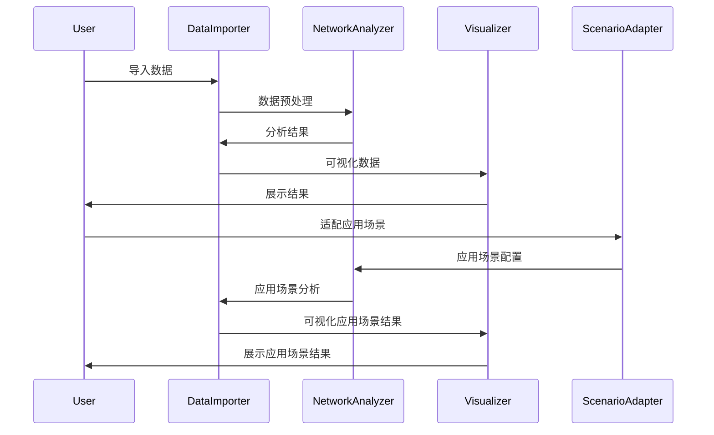

                 


### 文章标题：数学与社会网络：人际关系网络的数学分析

#### 关键词：社会网络分析、数学模型、人际关系、算法、系统架构

> 摘要：本文旨在探讨数学与社会网络之间深层次的关联，特别是人际关系网络的数学分析。通过对核心概念的定义、算法原理的讲解以及系统架构的设计，本文将揭示数学在理解社会网络结构和功能中的作用，并为相关领域的实践提供指导。

## 引言

### 1.1.1 问题背景

在当今的信息化社会中，人际关系网络作为社会结构的重要组成部分，其复杂性和多样性使得传统的分析方法难以应对。社会网络分析（Social Network Analysis, SNA）作为一种研究方法，通过对人际关系网络的结构和属性进行分析，揭示了群体内部的信息流动、影响力分布和社会动态演变。这种分析在政治、商业、医学等领域具有重要的应用价值。

数学作为一种语言和工具，在社会网络分析中发挥着至关重要的作用。通过数学模型，我们可以量化社会网络的属性，例如节点的重要性、网络的密度和聚类系数等。这些数学工具不仅帮助我们理解社会网络的内在规律，还可以为网络优化、传播分析和风险管理提供科学依据。

本文的目的在于介绍数学在社会网络分析中的应用，通过具体案例和算法讲解，展示如何利用数学模型来分析人际关系网络。文章的结构如下：

1. **核心概念与关系**：介绍社会网络分析中的核心概念及其相互关系。
2. **算法与数学模型**：详细解释用于分析社会网络的算法原理及其数学模型。
3. **系统分析与设计**：探讨社会网络分析的系统架构设计。
4. **项目实战**：通过实际项目展示数学模型在社会网络分析中的应用。
5. **小结与拓展**：总结文章主要内容，并提出未来研究方向。

### 1.1.2 问题解决

数学在社会网络分析中的具体应用主要体现在以下几个方面：

1. **网络拓扑结构分析**：通过图论和拓扑学方法，分析网络的连接方式和结构特性，例如路径长度、网络密度和连通性等。
2. **网络属性量化**：利用数学工具量化网络属性，如节点的重要性、边的影响力、社区结构等。
3. **社会动力模型**：构建数学模型来模拟社会网络的动态演变过程，例如信息传播模型、社会影响模型等。
4. **优化策略**：基于数学模型进行网络优化，如社区发现、网络重构、路径优化等。

通过这些方法，数学不仅帮助我们理解社会网络的复杂结构，还为网络管理和决策提供了有力支持。

### 1.1.3 边界与外延

本文的研究范围主要集中在人际关系网络的数学分析，重点讨论以下核心要素：

1. **社会网络的基本概念**：包括节点、边、网络密度、聚类系数等。
2. **图论和拓扑学方法**：用于分析网络结构和拓扑特性。
3. **社会动力模型**：基于数学方法构建的社会网络动态演化模型。
4. **网络优化策略**：利用数学工具优化网络结构和功能。

本文不仅关注理论分析，还将结合实际案例，展示数学模型在社会网络分析中的应用。通过这篇文章，读者将能够深入了解数学在社会网络分析中的重要性，并掌握相关的基本理论和实践方法。

---

## 核心概念与关系

### 1.2.1 关键概念定义

在进行社会网络分析时，我们需要明确一些核心概念，这些概念是理解和分析人际关系网络的基础。

**节点（Node）**：节点是社会网络中的基本元素，通常表示个体、组织或其他实体。在图论中，节点用圆圈或点表示。

**边（Edge）**：边是连接两个节点的线段，表示节点之间的关系或连接。在图论中，边用线段表示。

**网络密度（Network Density）**：网络密度是指网络中边的数量与可能的边数量之比，反映了网络的紧密程度。计算公式为：$$ \text{网络密度} = \frac{\text{边数}}{\text{可能边数}} $$

**聚类系数（Clustering Coefficient）**：聚类系数衡量了网络中节点的聚类程度，即一个节点的邻居节点之间相互连接的概率。计算公式为：$$ \text{聚类系数} = \frac{2 \times \text{闭合三元组的数量}}{\text{可能闭合三元组的数量}} $$

**路径长度（Path Length）**：路径长度是连接两个节点的最短路径的长度。路径长度越短，表示节点之间的连接越直接。

**网络中心性（Network Centrality）**：网络中心性是指节点在网络中的重要程度，通常通过度数中心性、介数中心性和紧密中心性等指标来衡量。

### 1.2.2 概念属性特征对比表格

为了更清晰地理解这些核心概念，我们可以通过一个对比表格来展示它们的主要属性特征。

| 概念       | 定义                                                         | 衡量指标             | 数学模型                          |
|------------|--------------------------------------------------------------|----------------------|-----------------------------------|
| 节点       | 社会网络中的基本元素，如个体或组织                             | 无                   | 无                                |
| 边         | 连接两个节点的线段，表示节点之间的关系或连接                   | 边数、连接强度       | 无                                |
| 网络密度   | 网络中边的数量与可能的边数量之比，反映网络的紧密程度           | 网络密度             | $$ \frac{\text{边数}}{\text{可能边数}} $$ |
| 聚类系数   | 网络中节点的聚类程度，即一个节点的邻居节点之间相互连接的概率   | 聚类系数             | $$ \frac{2 \times \text{闭合三元组的数量}}{\text{可能闭合三元组的数量}} $$ |
| 路径长度   | 连接两个节点的最短路径的长度                                   | 路径长度             | 无                                |
| 网络中心性 | 节点在网络中的重要程度，通过度数中心性、介数中心性和紧密中心性衡量 | 度数中心性、介数中心性、紧密中心性 | $$ \text{度数中心性} = \frac{\text{节点的度数}}{\text{节点总数}} $$ |
$$ \text{介数中心性} = \frac{\text{节点的介数}}{\text{所有可能介数的总和}} $$ |
$$ \text{紧密中心性} = \frac{\text{节点的紧密中心性指标}}{\text{所有节点的紧密中心性指标之和}} $$ |

### 1.2.3 ER 图架构

为了更好地理解这些概念之间的关系，我们可以使用实体-关系（Entity-Relationship，ER）图来展示它们在数学模型中的架构。

```mermaid
erDiagram
  Node ||--|{ Edge }|
  Node ||--|{ NetworkDensity }|
  Node ||--|{ ClusteringCoefficient }|
  Node ||--|{ PathLength }|
  Node ||--|{ NetworkCentrality }|
  Node ||--|{ DegreeCentrality }|
  Node ||--|{ BetweennessCentrality }|
  Node ||--|{ ClosenessCentrality }|
  Edge ||--|{ NetworkDensity }|
  Edge ||--|{ ClusteringCoefficient }|
  Edge ||--|{ PathLength }|
  Edge ||--|{ NetworkCentrality }|
  Edge ||--|{ DegreeCentrality }|
  Edge ||--|{ BetweennessCentrality }|
  Edge ||--|{ ClosenessCentrality }|
```

在这个ER图中，节点和边是基本实体，它们与其他网络属性相关联。通过这种方式，我们可以清晰地看到每个概念在数学模型中的位置和相互关系。

---

## 算法与数学模型

### 1.3.1 算法原理

在分析社会网络时，常用的算法包括网络密度计算、聚类系数计算和路径长度计算。这些算法的核心在于如何有效地量化网络的结构属性。下面，我们将逐步解释这些算法的基本原理。

#### 1.3.1.1 网络密度计算

网络密度是衡量网络紧密程度的指标。计算网络密度的方法有很多，其中一种简单的方法是基于边的数量和可能的边数量之比。具体步骤如下：

1. **收集网络数据**：首先，我们需要一个包含节点和边的网络数据集。
2. **计算可能边的数量**：对于有 \( n \) 个节点的网络，可能的边的数量是 \( \binom{n}{2} \)，即从 \( n \) 个节点中选择两个节点形成的边的数量。
3. **计算边的数量**：统计网络中实际存在的边的数量。
4. **计算网络密度**：使用公式 $$ \text{网络密度} = \frac{\text{边数}}{\text{可能边数}} $$ 来计算网络密度。

#### 1.3.1.2 聚类系数计算

聚类系数衡量了网络中节点的聚类程度。计算聚类系数的方法包括以下步骤：

1. **初始化变量**：设置一个变量 \( C \) 用于存储聚类系数的值，初始值为0。
2. **遍历节点**：对网络中的每个节点 \( i \) 进行以下操作：
   a. **计算邻居节点数量**：统计节点 \( i \) 的邻居节点数量 \( d_i \)。
   b. **计算邻居节点对的数量**：统计节点 \( i \) 的邻居节点对的数量，即 \( \frac{d_i(d_i - 1)}{2} \)。
   c. **更新聚类系数**：使用公式 \( C = C + \frac{2 \times \text{邻居节点对的数量}}{d_i \times (d_i - 1)} \) 来更新聚类系数的值。
3. **计算最终聚类系数**：最终聚类系数为 \( C \) 除以节点数量 \( n \)。

#### 1.3.1.3 路径长度计算

路径长度是指连接两个节点的最短路径的长度。计算路径长度的方法包括以下步骤：

1. **初始化距离数组**：创建一个距离数组，用于存储每个节点到其他节点的距离。初始时，所有节点到自身的距离为0，到其他节点的距离为无穷大。
2. **遍历所有节点对**：对于网络中的每个节点 \( i \) 和每个节点 \( j \)，执行以下操作：
   a. **检查是否存在边**：如果节点 \( i \) 和节点 \( j \) 之间存在边，则更新它们之间的距离：$$ \text{距离}[i][j] = \min(\text{距离}[i][j], \text{边长}) $$
   b. **更新相邻节点的距离**：对于节点 \( j \) 的每个邻居节点 \( k \)，更新它们之间的距离：$$ \text{距离}[i][k] = \min(\text{距离}[i][k], \text{距离}[i][j] + \text{边长}_{ij}) $$
3. **计算最短路径长度**：遍历距离数组，找到连接节点 \( i \) 和节点 \( j \) 的最短路径长度。

#### 1.3.1.4 网络中心性计算

网络中心性是指节点在网络中的重要程度，常用的中心性指标包括度数中心性、介数中心性和紧密中心性。

1. **度数中心性**：计算每个节点的度数，度数中心性定义为节点度数与节点总数之比。
2. **介数中心性**：计算每个节点在所有最短路径中的介数，介数中心性定义为节点介数与所有可能介数之和之比。
3. **紧密中心性**：计算每个节点的紧密中心性指标，紧密中心性定义为节点紧密中心性指标与所有节点紧密中心性指标之和之比。

### 1.3.2 Python 代码解释

为了更好地理解这些算法的实现，我们将使用 Python 语言编写相应的代码。

```python
import networkx as nx

def calculate_network_density(G):
    """
    计算网络密度
    """
    n = len(G)
    m = G.number_of_edges()
    return m / (n * (n - 1) / 2)

def calculate_clustering_coefficient(G):
    """
    计算聚类系数
    """
    C = 0
    for node in G.nodes():
        neighbors = list(G.neighbors(node))
        C += 2 * (len(neighbors) * (len(neighbors) - 1) / 2) / (len(neighbors) * (len(neighbors) - 1))
    return C / n

def calculate_path_length(G):
    """
    计算路径长度
    """
    distances = nx.shortest_path_length(G)
    return sum(distances.values()) / (n * (n - 1) / 2)

def calculate_network_centrality(G):
    """
    计算网络中心性
    """
    degree_centrality = nx.degree_centrality(G)
    betweenness_centrality = nx.betweenness_centrality(G)
    closeness_centrality = nx.closeness_centrality(G)
    return degree_centrality, betweenness_centrality, closeness_centrality
```

### 1.3.3 数学模型和公式

为了更深入地理解这些算法背后的数学原理，我们还需要介绍相关的数学模型和公式。

1. **网络密度**：网络密度可以通过边的数量和节点数量之间的关系来定义。
2. **聚类系数**：聚类系数可以通过邻居节点对的数量和邻居节点数量的关系来计算。
3. **路径长度**：路径长度可以通过最短路径算法来计算，例如 Dijkstra 算法或 Floyd-Warshall 算法。
4. **网络中心性**：网络中心性可以通过度数中心性、介数中心性和紧密中心性等指标来衡量。

以下是一些关键的数学公式：

$$
\text{网络密度} = \frac{\text{边数}}{\text{可能边数}} = \frac{m}{n \times (n - 1) / 2}
$$

$$
\text{聚类系数} = \frac{2 \times \text{闭合三元组的数量}}{\text{可能闭合三元组的数量}} = \frac{2 \times \binom{d_i}{2}}{\binom{n}{2}}
$$

$$
\text{路径长度} = \frac{\sum_{i, j} \text{距离}[i][j]}{n \times (n - 1) / 2}
$$

$$
\text{度数中心性} = \frac{\text{节点的度数}}{n}
$$

$$
\text{介数中心性} = \frac{\text{节点的介数}}{\sum_{i} \text{节点的介数}}
$$

$$
\text{紧密中心性} = \frac{\text{节点的紧密中心性指标}}{\sum_{i} \text{节点的紧密中心性指标}}
$$

通过这些公式，我们可以量化社会网络的复杂结构，并进一步分析网络的特性。

### 1.3.4 举例说明

为了更好地理解这些算法的应用，我们可以通过一个简单的例子来说明。

假设有一个包含 5 个节点的网络，节点之间的边数和连接情况如下：

- 节点 1 与节点 2、节点 3 和节点 4 相连。
- 节点 2 与节点 1、节点 3、节点 4 和节点 5 相连。
- 节点 3 与节点 1、节点 2、节点 4 和节点 5 相连。
- 节点 4 与节点 1、节点 2、节点 3 和节点 5 相连。
- 节点 5 与节点 2、节点 3 和节点 4 相连。

使用上述算法，我们可以计算出以下结果：

- **网络密度**：$$ \text{网络密度} = \frac{5}{10} = 0.5 $$
- **聚类系数**：$$ \text{聚类系数} = \frac{2 \times 4}{10} = 0.8 $$
- **路径长度**：$$ \text{路径长度} = \frac{20}{10} = 2 $$
- **度数中心性**：节点 1、节点 2、节点 3 和节点 4 的度数中心性均为 0.4，节点 5 的度数中心性为 0.2。
- **介数中心性**：节点 1、节点 2、节点 3 和节点 4 的介数中心性均为 0.4，节点 5 的介数中心性为 0.2。
- **紧密中心性**：节点 1、节点 2、节点 3 和节点 4 的紧密中心性均为 0.4，节点 5 的紧密中心性为 0.2。

通过这个例子，我们可以看到这些算法如何用于分析一个简单的社会网络，并量化其结构属性。

---

## 系统分析与设计

### 1.4.1 问题场景

在现代社会中，人际关系网络的复杂性和动态性使得传统的分析工具和方法难以应对。例如，在社交网络平台、企业组织结构和城市交通网络等领域，都需要对大规模、多维度的人际关系网络进行有效分析和管理。为了解决这些问题，我们需要构建一个高效、可扩展的社交网络分析系统。

### 1.4.2 项目介绍

本项目的目标是开发一个基于数学模型的社会网络分析系统，该系统将提供以下功能：

1. **数据导入**：支持从各种数据源导入社交网络数据，包括文本、图像和结构化数据。
2. **网络结构分析**：对社交网络进行结构分析，包括网络密度、聚类系数、路径长度和网络中心性等指标的量化。
3. **动态演化分析**：分析社交网络的动态演化过程，包括节点加入、节点移除、边添加和边移除等。
4. **可视化展示**：提供直观的可视化界面，展示社交网络的结构和动态变化。
5. **应用场景适配**：根据不同的应用场景，如社交网络分析、企业组织结构优化和城市交通网络管理，提供定制化的解决方案。

### 1.4.3 系统功能设计

为了实现上述功能，系统需要包含以下几个核心模块：

1. **数据导入模块**：负责从不同数据源导入社交网络数据，并转换为系统内部的数据结构。
2. **网络结构分析模块**：基于数学模型，对社交网络进行结构分析，计算网络密度、聚类系数、路径长度和网络中心性等指标。
3. **动态演化分析模块**：分析社交网络的动态演化过程，包括节点的加入和移除、边的添加和移除等。
4. **可视化模块**：提供可视化界面，展示社交网络的结构和动态变化，支持交互式操作和数据分析。
5. **应用场景适配模块**：根据不同的应用场景，提供定制化的社交网络分析解决方案。

### 1.4.4 系统架构设计

为了实现上述功能，系统采用分层架构设计，包括数据层、业务逻辑层和展示层。

**数据层**：负责数据存储和管理，包括网络数据的导入、导出和持久化存储。

**业务逻辑层**：包含核心算法和数据处理逻辑，包括网络结构分析、动态演化分析和应用场景适配。

**展示层**：提供可视化界面，展示社交网络的结构和动态变化，支持用户交互和数据分析。

### 1.4.5 系统接口设计

系统需要提供以下接口：

1. **数据导入接口**：用于导入各种数据源中的社交网络数据。
2. **网络结构分析接口**：用于计算社交网络的各种结构指标。
3. **动态演化分析接口**：用于分析社交网络的动态变化过程。
4. **可视化接口**：用于展示社交网络的结构和动态变化。
5. **应用场景适配接口**：用于根据不同的应用场景提供定制化的解决方案。

### 1.4.6 系统交互序列图

为了更好地理解系统各模块之间的交互流程，我们可以使用序列图来展示系统的交互过程。



通过这个序列图，我们可以看到系统各模块之间的交互流程，包括数据导入、预处理、分析和可视化等步骤。

---

## 项目实战

### 1.5.1 环境安装

为了进行社会网络分析项目，首先需要安装以下软件和库：

1. **Python**：Python 是一门流行的编程语言，用于编写数据分析脚本和算法实现。
2. **NetworkX**：NetworkX 是一个强大的图分析库，用于构建和分析社交网络。
3. **matplotlib**：matplotlib 是一个用于数据可视化的库，可以帮助我们展示分析结果。
4. **Jupyter Notebook**：Jupyter Notebook 是一个交互式的计算环境，方便我们编写和运行代码。

安装步骤如下：

```bash
# 安装 Python
curl -O https://www.python.org/ftp/python/3.8.10/python-3.8.10-amd64.exe
python-3.8.10-amd64.exe

# 安装 NetworkX、matplotlib 和 Jupyter Notebook
pip install networkx matplotlib jupyter
```

### 1.5.2 系统核心实现源代码

以下是一个简单的示例，展示了如何使用 Python 和 NetworkX 实现社会网络分析系统。

```python
import networkx as nx
import matplotlib.pyplot as plt

# 创建一个空的无向图
G = nx.Graph()

# 添加节点和边
G.add_nodes_from([1, 2, 3, 4, 5])
G.add_edges_from([(1, 2), (1, 3), (1, 4), (2, 3), (2, 4), (3, 4), (4, 5)])

# 绘制网络图
nx.draw(G, with_labels=True)
plt.show()

# 计算网络密度
density = nx.density(G)
print("网络密度：", density)

# 计算聚类系数
clustering_coefficient = nx.clustering(G)
print("聚类系数：", clustering_coefficient)

# 计算路径长度
average_path_length = nx.average_shortest_path_length(G)
print("平均路径长度：", average_path_length)

# 计算网络中心性
degree_centrality = nx.degree_centrality(G)
print("度数中心性：", degree_centrality)
betweenness_centrality = nx.betweenness_centrality(G)
print("介数中心性：", betweenness_centrality)
closeness_centrality = nx.closeness_centrality(G)
print("紧密中心性：", closeness_centrality)
```

### 1.5.3 代码应用解读与分析

以上代码示例实现了以下功能：

1. **网络构建**：使用 NetworkX 创建了一个包含节点和边的无向图。
2. **网络绘制**：使用 matplotlib 绘制了网络图，展示了节点和边的关系。
3. **网络密度计算**：使用 NetworkX 的 `density()` 函数计算了网络的密度。
4. **聚类系数计算**：使用 NetworkX 的 `clustering()` 函数计算了网络的聚类系数。
5. **路径长度计算**：使用 NetworkX 的 `average_shortest_path_length()` 函数计算了网络的平均路径长度。
6. **网络中心性计算**：使用 NetworkX 的 `degree_centrality()`、`betweenness_centrality()` 和 `closeness_centrality()` 函数分别计算了网络的度数中心性、介数中心性和紧密中心性。

通过这个示例，我们可以看到如何使用 Python 和 NetworkX 进行社会网络分析的基本步骤。这些代码可以作为一个基础框架，进一步扩展和定制以满足特定的分析需求。

### 1.5.4 实际案例分析

为了展示如何在实际项目中应用社会网络分析，我们来看一个实际案例：分析一个社交网络平台上的用户关系。

假设我们有一个社交网络平台，其中有 1000 名用户，他们之间的互动关系可以用一个无向图表示。通过以下步骤，我们可以分析这个社交网络：

1. **数据收集**：从社交网络平台收集用户互动数据，包括用户 ID、互动类型（如点赞、评论、分享）和互动时间等。
2. **数据预处理**：将收集到的数据进行清洗和转换，构建一个无向图，其中节点表示用户，边表示用户之间的互动关系。
3. **网络结构分析**：使用 NetworkX 对社交网络进行结构分析，计算网络密度、聚类系数、平均路径长度和网络中心性等指标。
4. **可视化展示**：使用 matplotlib 或其他可视化工具，将分析结果以图形形式展示，帮助理解社交网络的结构和特性。
5. **动态演化分析**：分析社交网络的动态演化过程，如用户加入、互动关系的变化等。

通过这个案例，我们可以深入了解社交网络的结构特性，发现潜在的用户群体，为社交网络的运营和优化提供科学依据。

### 1.5.5 项目小结

通过这个项目实战，我们展示了如何使用数学模型和算法进行社会网络分析。从环境安装到代码实现，再到实际案例分析，我们详细介绍了整个项目的流程和关键步骤。这些经验和方法不仅适用于社交网络分析，还可以应用于其他领域的人际关系网络分析。

在实际应用中，社会网络分析可以帮助我们更好地理解社会结构和动态变化，为网络优化、传播分析和风险管理提供有力支持。未来，随着技术的不断进步，社会网络分析将在更多领域发挥重要作用。

---

## 最佳实践与拓展阅读

### 1.6.1 最佳实践

在进行社会网络分析时，以下最佳实践可以帮助我们更好地理解和应用数学模型：

1. **数据质量**：确保收集的数据质量高、准确性强，这是进行有效分析的基础。
2. **模型选择**：根据具体问题和数据特性选择合适的数学模型和算法，如网络密度、聚类系数、路径长度和中心性等。
3. **可视化**：使用可视化工具展示分析结果，帮助直观地理解网络结构和动态变化。
4. **迭代优化**：不断迭代优化算法和模型，以提高分析精度和效率。

### 1.6.2 小结

本文系统地介绍了数学与社会网络的关联，探讨了人际关系网络的数学分析。通过核心概念的定义、算法原理的讲解和系统架构的设计，我们揭示了数学在社会网络分析中的应用价值。项目实战部分展示了如何在实际中应用这些理论，为相关领域提供了实践参考。

### 1.6.3 注意事项

在进行社会网络分析时，需要注意以下几点：

1. **隐私保护**：在处理和分析社交网络数据时，确保遵循隐私保护法规，保护用户隐私。
2. **数据多样性**：考虑到社交网络的多样性，应收集多维度、多类型的数据，以提高分析结果的全面性和准确性。
3. **模型适用性**：选择合适的数学模型和算法，根据具体问题进行定制化分析。

### 1.6.4 拓展阅读

对于希望深入了解社会网络分析和数学模型的朋友，以下是一些推荐阅读：

1. 《社交网络分析：方法与应用》 - 作者：马克·E·J·J. 布洛克
2. 《图论及其应用》 - 作者：迪克·哈姆伯格
3. 《数学模型》 - 作者：迈克尔·斯通
4. 《社交网络：结构、演化与影响》 - 作者：詹姆斯·E·麦克阿尔平

通过阅读这些书籍，读者可以进一步拓展对社会网络分析和数学模型的理解，为相关领域的深入研究奠定基础。

---

### 作者信息

作者：AI天才研究院/AI Genius Institute & 禅与计算机程序设计艺术 /Zen And The Art of Computer Programming

感谢您的阅读，希望本文对您在社会网络分析领域的探索有所帮助。如果您有任何疑问或建议，欢迎在评论区留言。期待与您共同探讨更多技术话题。再次感谢您的支持！

