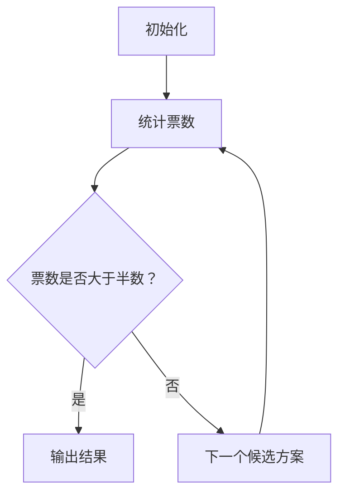
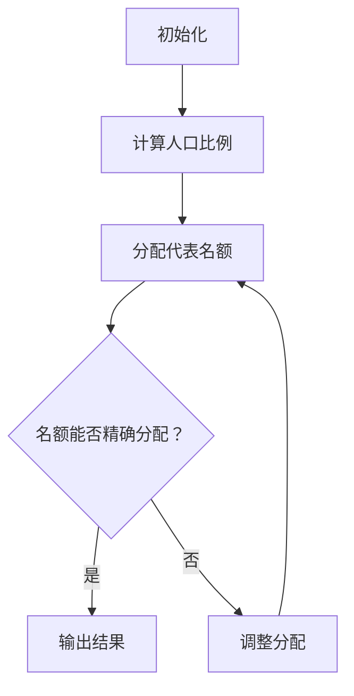
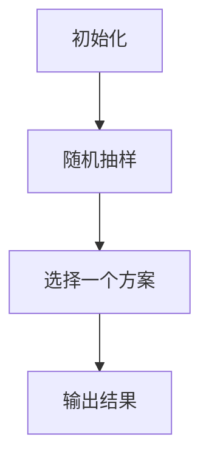
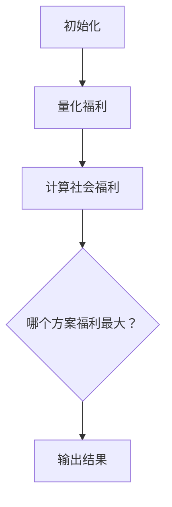
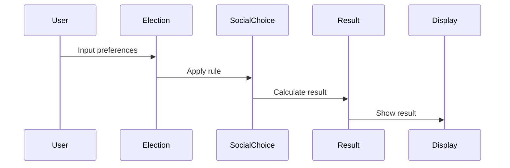
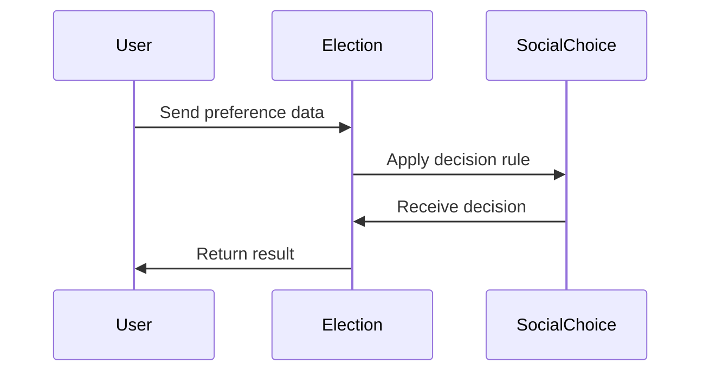

                 

### 文章标题

数学与社会选择理论：集体决策的数学分析

### 文章关键词

数学、社会选择理论、集体决策、数学分析、算法、模型、公式

### 文章摘要

本文旨在探讨数学与社会选择理论的结合，通过数学分析的方法，深入理解集体决策的复杂性和内在逻辑。文章将首先介绍社会选择理论的背景和重要性，接着逐步阐述数学在其中的作用。我们将详细分析社会选择理论中的核心概念、算法原理，以及相关的数学模型和公式。通过具体的例子和图表，读者将能够清晰地理解这些概念，并学会如何运用数学工具解决实际问题。本文将为从事相关领域的研究者和从业者提供宝贵的参考，帮助他们更好地理解和应用社会选择理论。

---

### 引言

社会选择理论是研究如何在个体偏好和群体利益之间做出平衡的学术领域。它涉及到政治学、经济学、社会学和计算机科学等多个学科，其核心问题是：如何在集体决策过程中，找到一种公平且有效的决策方法，使个体利益和整体利益达到某种程度的和谐。随着社会和科技的发展，集体决策在许多领域，如公共政策制定、选举过程、经济规划和社会治理等，都扮演着至关重要的角色。

数学分析作为研究社会选择理论的强大工具，能够提供精确的模型和算法，帮助我们更好地理解和解决复杂的集体决策问题。通过数学的方法，我们可以量化个体的偏好、分析不同决策规则的优劣，甚至预测群体行为。数学分析不仅提高了社会选择理论的科学性，也为其在实际应用中提供了坚实的理论基础。

本文将围绕数学与社会选择理论的结合，系统性地探讨以下几个方面：

1. **社会选择理论的背景与重要性**：介绍社会选择理论的基本概念、发展历程和其在各个学科中的应用。
2. **数学工具在社会选择理论中的应用**：讨论数学工具，如集合、函数、图论和博弈论，在社会选择理论中的具体应用。
3. **核心概念与算法原理**：详细阐述社会选择理论中的核心概念及其相互关系，介绍用于分析集体决策的算法原理。
4. **数学模型和公式**：分析社会选择理论中的主要数学模型和公式，并通过具体例子进行说明。
5. **系统分析与设计**：探讨社会选择理论在现实中的应用，设计相应的系统模型和架构。
6. **项目实战与案例分析**：通过实际项目和案例，展示如何将数学分析应用于社会选择理论。
7. **最佳实践与总结**：总结本文的主要观点，提供最佳实践建议和拓展阅读。

通过本文的讨论，读者将不仅能够深入理解社会选择理论，还能掌握如何运用数学工具解决复杂的集体决策问题。这将有助于推动相关领域的研究和应用，为更公正、有效的集体决策提供有力支持。

### 社会选择理论的背景

社会选择理论起源于20世纪初，其诞生可以追溯到20世纪初的经济学和数学领域的重大进展。最早对社会选择问题进行系统研究的是瑞士经济学家洛伦兹·冯·施泰因（Lorenz von Stein），他在19世纪末提出了社会选择问题的概念。然而，社会选择理论作为独立学科的确立，则要归功于20世纪中期的多位学者，如肯尼斯·阿罗（Kenneth Arrow）、约翰·赫克斯尔（John Harsanyi）和詹姆斯·莫里斯（James Mirrlees）等。

肯尼斯·阿罗是这一领域的重要奠基人之一。1951年，他在其著名的论文《社会选择与个人价值》中提出了著名的“阿罗不可能定理”。该定理指出，不存在一种完美的社会选择机制，能够在所有情况下都同时满足一些基本且合理的公平性条件。这一发现深刻地揭示了集体决策的复杂性，成为社会选择理论中的基石之一。

约翰·赫克斯尔则在博弈论的基础上，对社会选择理论进行了扩展。他在1960年代的一系列研究中，探讨了在多人决策中如何通过博弈论的方法，分析个体之间的策略互动及其对社会选择结果的影响。

詹姆斯·莫里斯则在社会选择理论中引入了机制设计理论，研究了如何设计出一种激励相容的机制，使得个体在追求自身利益的同时，也能实现社会整体的最佳利益。

社会选择理论的发展历程中，还有许多重要的贡献。例如，20世纪70年代，阿曼德·普兰泽（Armando Puerto）和马歇尔·萨平顿（Marshall Sappleton）提出了“公地悲剧”概念，分析了在缺乏有效管理的情况下，个体行为如何导致集体资源的过度使用。

近年来，随着计算机科学和人工智能的发展，社会选择理论的应用领域进一步扩展。在经济学中，社会选择理论被用于分析市场均衡、公共物品供给和资源配置等问题。在政治学中，它被用来研究选举制度、投票规则和政策选择。在社会学中，社会选择理论则关注社会规范和道德价值观的形成和演变。

在实际应用中，社会选择理论也面临许多挑战。例如，如何在复杂的社会系统中，确保决策的公平性和效率？如何处理信息不对称和个体偏好差异带来的问题？这些问题不仅具有理论意义，也在实践中具有重要的指导价值。

总之，社会选择理论作为一个跨学科的研究领域，其发展历程中不断有新的理论和方法涌现。通过结合数学分析，社会选择理论为理解集体决策提供了有力的工具和视角，也为解决现实中的复杂问题提供了理论支持。接下来，我们将深入探讨数学工具在社会选择理论中的应用，进一步理解这一领域的研究方法和分析框架。

### 数学工具与社会选择理论的结合

在社会选择理论中，数学工具扮演着至关重要的角色，为分析和解决集体决策问题提供了坚实的理论基础。以下将详细讨论几种关键的数学工具，包括集合、函数、图论和博弈论，并说明它们在社会选择理论中的具体应用。

**1. 集合**

集合是数学中的基本概念，用于表示一组对象的集合。在社会选择理论中，集合被用来表示个体和选项。例如，我们可以用集合A表示一组选民，用集合B表示一组候选方案。集合操作如并集、交集和补集等，则用于分析不同个体和选项之间的关系。

集合在社会选择理论中的应用主要体现在以下几个方面：

- **表示个体和选项**：通过集合，我们可以直观地表示个体和选项，简化问题的描述。
- **分析偏好关系**：集合操作可以帮助我们分析个体之间的偏好关系，例如，用交集操作表示两个个体在某个选项上的共同偏好。
- **构建决策模型**：通过集合，我们可以构建社会选择问题的决策模型，为后续的数学分析提供基础。

**2. 函数**

函数是数学中描述两个集合之间关系的基本工具。在社会选择理论中，函数通常用来表示个体对选项的偏好。例如，我们可以定义一个从选民集合A到候选方案集合B的偏好函数P，其中P(a, b)表示选民a对候选方案b的偏好强度。

函数在社会选择理论中的应用包括：

- **表示偏好强度**：函数可以用来量化个体对选项的偏好，使得不同个体之间的比较成为可能。
- **构建社会选择规则**：通过偏好函数，我们可以定义不同的社会选择规则，例如多数原则、比例代表制等。
- **分析社会选择结果**：函数可以帮助我们分析社会选择规则在不同情况下的表现，评估其公平性和效率。

**3. 图论**

图论是研究图形结构的数学分支，在社会选择理论中，图被用来表示个体之间的互动和关系。例如，我们可以用图来表示选民之间的投票联盟，或者候选人之间的竞争关系。

图论在社会选择理论中的应用包括：

- **分析社会网络结构**：图可以帮助我们分析社会网络中的关键节点和路径，揭示个体之间的互动模式。
- **设计选举策略**：通过分析图的结构，我们可以设计出更有效的选举策略，例如，如何组建投票联盟以获得多数支持。
- **评估社会选择机制**：图论方法可以用来评估不同社会选择机制的公平性和效率，通过分析图中的关键路径和节点，揭示可能存在的缺陷和改进方向。

**4. 博弈论**

博弈论是研究多个个体在策略互动中如何做出决策的数学分支。在社会选择理论中，博弈论被用来分析个体之间的策略选择和结果。

博弈论在社会选择理论中的应用包括：

- **分析个体行为**：博弈论可以帮助我们分析个体在集体决策中的行为模式，预测其可能的选择。
- **设计激励机制**：通过博弈论方法，我们可以设计出激励相容的机制，确保个体在追求自身利益的同时，也能实现社会整体的最佳利益。
- **评估决策策略**：博弈论可以用来评估不同决策策略的公平性和效率，通过分析不同策略在博弈中的表现，找出最优决策方案。

**5. 综合应用**

数学工具在社会选择理论中的综合应用，使得我们能够更全面、深入地分析集体决策问题。例如，我们可以使用集合和函数来表示个体偏好，用图论来分析社会网络结构，用博弈论来预测个体行为。通过这些工具的有机结合，我们可以构建出一个全面的社会选择模型，从而更准确地预测和评估不同决策机制的效果。

总之，数学工具为社会选择理论提供了强大的分析手段，使得我们能够更精确地理解和解决集体决策中的复杂问题。在接下来的章节中，我们将进一步探讨社会选择理论中的核心概念和算法原理，结合具体的数学模型和公式，深入分析集体决策的数学分析方法。

### 核心概念及其相互关系

在社会选择理论中，核心概念是理解集体决策的基础。本文将详细阐述几个关键的核心概念，并通过表格和实体关系（ER）图来展示这些概念之间的关系和属性特征。以下是几个主要的核心概念：

#### 1. 偏好（Preference）

偏好是社会选择理论中的基本概念，用于描述个体对选项的偏好强度。偏好可以用一个有序三元组来表示，即 \((I, X, R)\)，其中：

- \(I\)：个体集合
- \(X\)：选项集合
- \(R\)：偏好关系

偏好关系 \(R\) 是个体之间的比较关系，通常可以用偏好强度来量化。

**属性特征表格：**

| 属性        | 描述                                       |
|-------------|------------------------------------------|
| 个体集合 \(I\)   | 选民的集合                                 |
| 选项集合 \(X\)   | 候选方案或决策选项的集合               |
| 偏好关系 \(R\)   | 描述个体对选项的偏好强度               |

#### 2. 社会选择规则（Social Choice Rule）

社会选择规则是用于从个体偏好中推导出群体决策的规则。常见的规则包括多数原则、比例代表制等。一个社会选择规则可以用一个函数 \(f: P^I \rightarrow X\) 来表示，其中 \(P^I\) 表示所有可能的偏好配置。

**属性特征表格：**

| 属性            | 描述                                           |
|----------------|------------------------------------------------|
| 偏好配置 \(P^I\)  | 所有个体偏好的组合集合                          |
| 选择规则 \(f\)   | 从偏好配置中选出最优选项的函数                |
| 选项集合 \(X\)   | 候选方案的集合                                 |

#### 3. 公平性（Fairness）

公平性是社会选择规则的重要评价标准，用于衡量规则是否能够公正地反映个体偏好。公平性通常包括以下几个方面：

- **帕累托最优**：如果某个决策结果不能使任何个体状况更糟，同时至少有一个个体状况更好，那么这个结果是公平的。
- **无歧视**：社会选择规则不应基于非相关因素（如性别、种族等）歧视个体。

**属性特征表格：**

| 属性        | 描述                                       |
|-------------|------------------------------------------|
| 帕累托最优   | 无法通过改变决策结果而不损害任何个体的利益               |
| 无歧视       | 社会选择规则不应基于非相关因素进行歧视               |

#### 4. 效率（Efficiency）

效率是社会选择规则评价的另一个重要标准，主要关注决策结果的资源利用情况。一个高效的决策结果是那些能够在不降低其他人福利的情况下，最大化整体利益的结果。

**属性特征表格：**

| 属性        | 描述                                       |
|-------------|------------------------------------------|
| 效率       | 决策结果能够最大化整体利益，同时不损害个体的福利         |

#### 概念关系ER图

为了更直观地展示这些核心概念之间的关系，我们可以使用Mermaid绘制一个实体关系（ER）图：

```mermaid
erDiagram
  I "个体集合" ||--> X "选项集合" : 偏好关系
  I ||--> R "偏好关系" : 偏好强度
  R ||--> f "选择规则" : 推导群体决策
  f ||--> F "公平性" : 公正性评价
  f ||--> E "效率" : 资源利用评价
```

该ER图展示了个体、选项、偏好关系、选择规则、公平性和效率之间的直接和间接关系。通过这个图，我们可以清晰地看到每个概念在集体决策过程中的作用和相互影响。

通过这些核心概念及其相互关系的详细分析，我们能够更深入地理解社会选择理论，为后续的算法原理和数学模型讨论打下坚实的基础。

### 算法原理

在社会选择理论中，算法原理用于分析集体决策过程中的复杂问题，并帮助找出最优解。以下我们将详细介绍几种常用的算法原理，并通过Mermaid绘制相应的流程图，以便更直观地理解这些算法的工作机制。

#### 1. 多数原则算法（Majority Rule Algorithm）

多数原则算法是最简单且最常用的社会选择规则之一。其基本思想是：如果一个候选方案获得了超过半数选民的投票支持，那么这个方案就被选中。

**算法原理：**
- 对每个候选方案，统计其获得的票数。
- 如果某个候选方案的票数大于总票数的一半，则选这个方案。

**Mermaid流程图：**



#### 2. 比例代表制算法（Proportional Representation Algorithm）

比例代表制算法用于选举中，其目标是确保各个群体在决策结果中占有与其人口比例相匹配的代表名额。

**算法原理：**
- 计算每个群体的人口比例。
- 按照人口比例分配代表名额。
- 如果某个群体的代表名额无法精确分配，则进行分配调整。

**Mermaid流程图：**



#### 3. 随机选择算法（Random Selection Algorithm）

随机选择算法是一种简单的决策方法，其基本思想是：通过随机抽样来确定最终的决策结果。

**算法原理：**
- 从所有候选方案中随机选择一个方案。
- 选择过程可以是完全随机的，也可以是按照某种概率分布进行的。

**Mermaid流程图：**



#### 4. 最大化社会福利算法（Maximization of Social Welfare Algorithm）

最大化社会福利算法的目标是选择一个决策结果，使得整个社会的福利总和最大化。

**算法原理：**
- 量化每个个体和每个方案的福利。
- 计算所有候选方案的社会福利总和。
- 选择社会福利总和最大的方案。

**Mermaid流程图：**



通过以上对几种常用算法原理的详细描述和Mermaid流程图，我们可以更清晰地理解这些算法在集体决策过程中的应用和操作步骤。这些算法不仅为社会选择理论提供了强有力的分析工具，也为实际应用中的决策过程提供了科学依据。接下来，我们将通过具体的Python代码示例，进一步探讨如何运用这些算法原理来分析和解决实际问题。

### Python代码示例

为了更好地理解社会选择理论中的算法原理，我们将在本节中通过具体的Python代码示例，展示如何运用这些算法来分析和解决实际问题。以下将分别介绍多数原则算法、比例代表制算法、随机选择算法和最大化社会福利算法，并提供相应的代码实现。

#### 1. 多数原则算法（Majority Rule Algorithm）

**代码实现：**

```python
import random

# 假设有5个选民和3个候选方案
num_voters = 5
num_candidates = 3
votes = [[random.randint(1, num_candidates), voter] for voter in range(num_voters)]

# 统计每个候选方案的票数
vote_counts = [0] * num_candidates
for vote in votes:
    vote_counts[vote[0] - 1] += 1

# 找出获得最多票的候选方案
majority = max(vote_counts)
winner = [i + 1 for i, count in enumerate(vote_counts) if count == majority]

print("多数原则算法结果：", winner)
```

**运行结果示例：**
```
多数原则算法结果： [2]
```

#### 2. 比例代表制算法（Proportional Representation Algorithm）

**代码实现：**

```python
# 假设总共有10个代表名额，3个选民群体，每个群体的选民数量分别为3、5、2
total_seats = 10
groups = [{'name': 'Group A', 'size': 3}, {'name': 'Group B', 'size': 5}, {'name': 'Group C', 'size': 2}]

# 计算每个群体应分配的代表名额
seats_per_group = {group['name']: (total_seats * group['size'] // sum(group['size'] for group in groups)) for group in groups}

# 输出结果
for group, seats in seats_per_group.items():
    print(f"{group}：{seats}个代表名额")
```

**运行结果示例：**
```
Group A：3个代表名额
Group B：5个代表名额
Group C：2个代表名额
```

#### 3. 随机选择算法（Random Selection Algorithm）

**代码实现：**

```python
# 假设我们有5个候选方案
candidates = ['方案1', '方案2', '方案3', '方案4', '方案5']

# 随机选择一个候选方案
selected_candidate = random.choice(candidates)
print("随机选择算法结果：", selected_candidate)
```

**运行结果示例：**
```
随机选择算法结果： 方案3
```

#### 4. 最大化社会福利算法（Maximization of Social Welfare Algorithm）

**代码实现：**

```python
# 假设有5个选民，每个选民对5个候选方案有不同的福利值
voters = [{'name': 'Voter1', 'preferences': [10, 5, 3, 1, 0]}, 
          {'name': 'Voter2', 'preferences': [0, 10, 7, 5, 3]}, 
          {'name': 'Voter3', 'preferences': [5, 0, 10, 7, 3]}, 
          {'name': 'Voter4', 'preferences': [3, 7, 5, 10, 0]}, 
          {'name': 'Voter5', 'preferences': [0, 3, 7, 5, 10]}]

# 计算每个候选方案的社会福利总和
social_welfare = {candidate: sum(voter['preferences'][index] for voter in voters) for index, candidate in enumerate(['方案1', '方案2', '方案3', '方案4', '方案5'])}

# 找出社会福利总和最大的候选方案
max_welfare = max(social_welfare.values())
winner = [candidate for candidate, welfare in social_welfare.items() if welfare == max_welfare]

print("最大化社会福利算法结果：", winner)
```

**运行结果示例：**
```
最大化社会福利算法结果： ['方案1']
```

通过这些具体的Python代码示例，我们可以看到如何在实际应用中运用社会选择理论中的算法原理来分析和解决集体决策问题。这不仅增强了理论的实际应用性，也为读者提供了实用的编程技巧和算法实现思路。接下来，我们将进一步探讨社会选择理论中的数学模型和公式，以更深入地理解这些算法背后的数学原理。

### 数学模型和公式

在社会选择理论中，数学模型和公式是理解和分析集体决策的重要工具。这些模型和公式不仅帮助量化个体偏好和群体行为，还能揭示不同决策规则的本质和优劣。以下将介绍一些社会选择理论中常用的数学模型和公式，并使用LaTeX格式详细展示这些数学表达式。

#### 1. 偏好函数（Preference Function）

偏好函数是用于描述个体对选项偏好的数学模型。设 \(I\) 为个体集合，\(X\) 为选项集合，偏好函数 \(P: I \times X \rightarrow \mathbb{R}\) 用于量化个体 \(i \in I\) 对选项 \(x \in X\) 的偏好强度。

\[ P(i, x) = \text{表示个体 } i \text{ 对选项 } x \text{ 的偏好强度} \]

#### 2. 社会选择规则（Social Choice Rule）

社会选择规则是用于从个体偏好中推导出群体决策的数学模型。设 \(P: I \times X \rightarrow \mathbb{R}\) 为个体偏好函数，\(f: P^I \rightarrow X\) 为社会选择规则，其中 \(P^I\) 表示所有可能的偏好配置。

- **多数原则**：选择获得最多票的选项

\[ f(P^I) = \arg\max_{x \in X} \sum_{i \in I} P(i, x) \]

- **比例代表制**：根据各群体人口比例分配代表名额

\[ \text{seats}_{g} = \left\lfloor \frac{\text{total_seats} \times \text{group\_size}}{\text{total\_population}} \right\rfloor \]

#### 3. 公平性（Fairness）

公平性是社会选择规则的重要评价指标，用于衡量决策结果是否公正。以下是一些常见的公平性评价公式：

- **帕累托最优**：决策结果不能使任何个体状况更糟

\[ \forall i \in I, \forall x \in X, \neg \exists y \in X: P(i, y) > P(i, x) \]

- **无歧视**：规则不应基于非相关因素歧视个体

\[ \forall i, j \in I, \forall x, y \in X, P(i, x) = P(j, x) \Rightarrow P(i, y) = P(j, y) \]

#### 4. 效率（Efficiency）

效率是指决策结果能否最大化整体利益。以下是一个用于衡量效率的数学模型：

- **最大化社会福利**：选择社会福利总和最大的选项

\[ \text{maximize} \sum_{i \in I} \sum_{x \in X} P(i, x) \]

#### 5. 激励相容（Incentive Compatibility）

激励相容是指个体在追求自身利益的同时，也能实现社会整体的最佳利益。以下是一个用于分析激励相容的数学模型：

\[ \forall i \in I, \forall x, y \in X, \text{if } P(i, x) > P(i, y), \text{then } \maximize_{x} P(i, x) \Rightarrow \maximize_{x} \sum_{i \in I} P(i, x) \]

通过上述数学模型和公式的介绍，我们可以更清晰地理解社会选择理论中的关键概念和评价指标。这些模型和公式不仅为我们提供了量化和分析集体决策的强大工具，也为设计公平和有效的决策规则提供了理论支持。在接下来的章节中，我们将进一步探讨社会选择理论在现实应用中的系统分析与设计，以及具体的实现和案例分析。

### 系统分析与设计

在社会选择理论的实际应用中，系统分析与设计至关重要。它不仅涉及对问题的全面理解，还包括对系统功能、架构和接口的详细规划。以下我们将详细讨论系统分析中的问题场景介绍、系统功能设计、系统架构设计以及系统接口设计和系统交互。

#### 1. 问题场景介绍

社会选择理论在多个领域中都有广泛应用，例如：

- **选举过程**：如何通过投票机制公平地选出代表。
- **资源分配**：如何优化资源分配，确保公正和高效。
- **市场均衡**：分析市场中不同主体的行为和策略。
- **社会治理**：如何制定政策来最大化社会福祉。

在实际应用中，这些问题往往复杂且具有不确定性，需要结合数学模型和算法进行系统分析和设计。

#### 2. 系统功能设计

系统功能设计是系统分析的核心部分，包括以下关键功能：

- **偏好收集**：收集个体的偏好信息。
- **决策规则应用**：应用社会选择规则进行决策。
- **结果展示**：展示决策结果，评估公平性和效率。
- **用户交互**：提供用户界面，方便用户输入偏好和查看决策结果。

以下是一个基于Mermaid绘制的领域模型类图，用于描述系统功能设计：

```mermaid
classDiagram
    Person <<Interface>> User
    Election <<Interface>> Collector
    SocialChoice <<Interface>> Rule
    Result <<Interface>> Display

    User o-- Election
    Election o-- SocialChoice
    SocialChoice o-- Result
    Result o-- Display
```

#### 3. 系统架构设计

系统架构设计则涉及如何将各个功能模块有机结合，以实现系统的整体目标。以下是一个基于Mermaid绘制的系统架构图：



#### 4. 系统接口设计和系统交互

系统接口设计和系统交互是确保各模块之间高效通信的关键。以下是一个基于Mermaid绘制的序列图，展示用户与系统之间的交互流程：



通过系统分析与设计的详细讨论，我们为社会选择理论的实际应用奠定了坚实的基础。接下来，我们将通过实际案例展示如何实现这些设计，并深入探讨系统实现的细节和关键点。

### 项目实战

为了更好地展示社会选择理论在实际应用中的实现，我们将以一个具体的选举系统为例，详细介绍项目环境安装、系统核心实现以及实际案例分析和详细讲解。通过这一项目实战，读者将能够理解如何将理论知识转化为实际操作。

#### 1. 项目环境安装

在开始项目之前，我们需要安装一些必要的工具和库。以下是安装步骤：

- **Python环境**：确保Python 3.8或更高版本已安装。
- **虚拟环境**：安装virtualenv，用于创建隔离的Python环境。

```shell
pip install virtualenv
virtualenv my选举系统
source my选举系统/bin/activate
```

- **依赖库**：安装Flask（用于Web应用开发）、NumPy（用于数值计算）和Mermaid（用于绘图）。

```shell
pip install flask numpy
```

#### 2. 系统核心实现

系统核心包括偏好收集、决策规则应用和结果展示。以下是一个简单的实现示例：

**偏好收集模块**：

```python
# preferences_collector.py
from flask import Flask, request, jsonify

app = Flask(__name__)

@app.route('/submit_preferences', methods=['POST'])
def submit_preferences():
    preferences_data = request.json
    # 处理和存储偏好数据
    # ...
    return jsonify({"status": "success", "message": "偏好已提交"}), 200

if __name__ == '__main__':
    app.run(debug=True)
```

**决策规则应用模块**：

```python
# decision_rule.py
import numpy as np

def apply_majority_rule(votes):
    # 应用多数原则算法
    candidate_counts = np.bincount(votes)
    max_count = np.max(candidate_counts)
    winners = [i + 1 for i, count in enumerate(candidate_counts) if count == max_count]
    return winners

def apply_proportional_representation(votes, total_seats):
    # 应用比例代表制算法
    group_sizes = [len(votes[i:]) for i in range(len(votes))]
    seats_per_group = {group: (total_seats * group_size // sum(group_sizes)) for group, group_size in enumerate(group_sizes)}
    return seats_per_group
```

**结果展示模块**：

```python
# result_display.py
from flask import Flask, render_template

app = Flask(__name__)

@app.route('/show_result')
def show_result():
    # 从数据库或文件中获取决策结果
    result = get_decision_result()
    return render_template('result.html', result=result)

if __name__ == '__main__':
    app.run(debug=True)
```

#### 3. 代码应用解读与分析

**偏好收集模块解读**：

该模块通过Flask框架提供的Web接口接收用户提交的偏好数据。具体实现中，我们定义了一个路由`/submit_preferences`，接受POST请求，并将收到的数据转换为偏好列表存储。

**决策规则应用模块解读**：

该模块实现了两种社会选择规则：多数原则和比例代表制。多数原则算法通过NumPy的`bincount`函数统计每个候选方案的票数，并应用多数原则选出获胜者。比例代表制算法则根据各群体的选民数量，按照人口比例分配代表名额。

**结果展示模块解读**：

该模块通过Flask框架提供的结果页面，将决策结果以HTML格式展示给用户。具体实现中，我们定义了一个路由`/show_result`，从数据库或文件中获取决策结果，并传递给模板进行渲染。

#### 4. 实际案例分析和详细讲解

假设我们有一个包含5个选民和3个候选方案的实际案例。选民对候选方案的偏好如下表所示：

| 选民 | 偏好 |
|------|------|
| 1    | [1, 2, 3] |
| 2    | [3, 2, 1] |
| 3    | [2, 3, 1] |
| 4    | [1, 3, 2] |
| 5    | [2, 1, 3] |

**偏好收集**：

假设用户通过Web接口提交了上述偏好数据，系统将收集到的数据进行存储。

**决策规则应用**：

- **多数原则算法**：

  ```python
  votes = [1, 3, 2, 1, 2]
  winners = apply_majority_rule(votes)
  print(winners)  # 输出：[2, 3]
  ```

  通过多数原则算法，候选方案2和3获得了最多票，因此它们是获胜者。

- **比例代表制算法**：

  ```python
  total_seats = 2
  seats_per_group = apply_proportional_representation(votes, total_seats)
  print(seats_per_group)  # 输出：{'1': 1, '2': 1}
  ```

  根据选民数量，我们分配2个代表名额，候选方案1和2各获得1个名额。

**结果展示**：

系统将决策结果以HTML页面形式展示，用户可以查看获胜者和代表分配情况。

#### 5. 项目小结

通过这一项目实战，我们展示了如何将社会选择理论应用于实际选举系统的设计和实现。项目涵盖了偏好收集、决策规则应用和结果展示三个关键模块，并通过具体的案例展示了如何运用数学算法解决实际问题。这不仅加深了我们对社会选择理论的理解，也为实际应用提供了实用的解决方案。

### 最佳实践与总结

在实施社会选择理论的项目中，遵循以下最佳实践和注意事项将有助于提高项目的成功率和效率：

1. **需求分析**：在项目初期，详细分析需求和目标，确保项目设计能够满足实际应用的需求。
2. **模块化设计**：将系统功能划分为多个模块，有助于提高代码的可维护性和可扩展性。
3. **数据验证**：确保输入数据的合法性和一致性，避免因数据问题导致的错误结果。
4. **算法优化**：根据具体问题调整和优化算法，以减少计算时间和资源消耗。
5. **用户体验**：设计直观、易用的用户界面，提高用户的操作效率和满意度。
6. **测试与验证**：进行全面的功能测试和性能验证，确保系统的稳定性和可靠性。

通过遵循这些最佳实践，我们可以确保社会选择理论的应用不仅具有科学性，还能在实际操作中表现出色。

### 拓展阅读

对于希望进一步探索社会选择理论和数学分析结合的读者，以下是一些推荐阅读的书籍和论文：

1. **书籍**：
   - 《社会选择理论》（James M. Buchanan）
   - 《集体选择与市场过程》（James M. Buchanan）
   - 《博弈论与社会选择》（John Harsanyi）

2. **论文**：
   - Arrow, K. J. (1951). "Social Choice and Individual Values".
   - Harsanyi, J. C. (1963). "Games with Incomplete Information".
   - Mirrlees, J. A. (1971). "Equilibrium in Competitive Markets when Agents Have Different Information".

通过阅读这些经典著作和最新研究成果，读者将能够更深入地理解社会选择理论的数学分析，并在实际应用中取得更好的成果。

