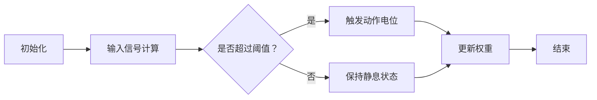
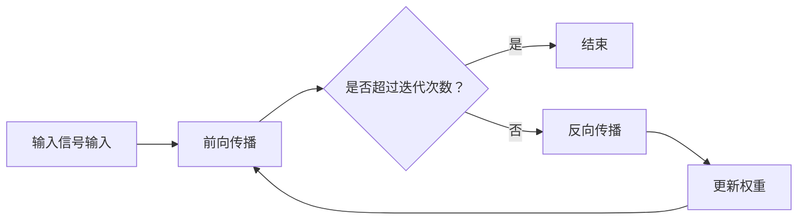
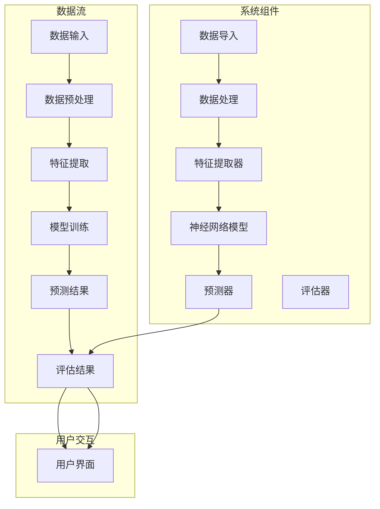
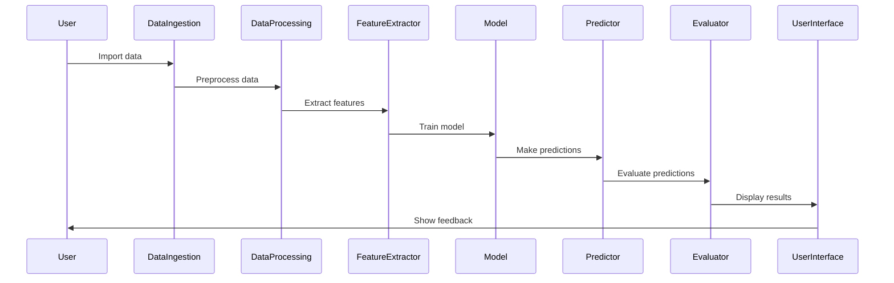

                 

## 数学与神经信息学：大脑信息处理的数学模型

### 关键词

- 数学模型
- 神经信息学
- 大脑信息处理
- 神经元
- 神经网络
- 算法原理

### 摘要

本文旨在深入探讨数学与神经信息学之间的紧密联系，特别是大脑信息处理的数学模型。通过逐步分析，我们将了解这些数学模型如何帮助我们理解和模拟大脑的信息处理机制，并探讨其潜在的应用和未来发展方向。本文分为七个主要部分：背景介绍、核心概念与联系、算法原理讲解、数学模型和数学公式、系统分析与架构设计、项目实战以及最佳实践与拓展。每个部分都将详细阐述，确保读者能够全面理解这一领域的知识。

## 第一步：整理书的核心内容

《数学与神经信息学：大脑信息处理的数学模型》一书涵盖了多个方面的内容，包括数学与神经信息学的基础知识、大脑信息处理的数学模型、这些模型的应用和未来发展等。以下是本书的主要部分和各部分的核心内容。

### 背景介绍

**第1章：数学与神经信息学概述**

在这一章中，我们将介绍数学与神经信息学的基本概念、问题背景、边界与外延，并讨论数学与神经信息学之间的关系。通过这一章节，读者将了解到数学在神经信息学中的重要作用，以及神经信息学研究的范围和目标。

### 核心概念与联系

**第2章：大脑信息处理的数学模型**

在这一章中，我们将介绍大脑信息处理的核心概念，包括神经元的数学模型、神经网络的数学模型以及大脑信息处理的数学模型。我们将讨论这些模型的核心概念、属性特征，并通过ER图展示模型之间的关系。

### 算法原理讲解

**第3章：算法原理讲解**

在这一章中，我们将详细讲解各个数学模型的工作原理。我们将使用mermaid绘制流程图，并用Python源代码阐述每个模型的算法原理。此外，我们还将给出数学模型的公式，并进行详细讲解和举例说明。

### 数学模型和数学公式

**第4章：数学模型与公式讲解**

在这一章中，我们将给出数学模型的公式，使用LaTeX格式进行排版，并进行详细讲解和举例说明。这将帮助读者更深入地理解数学模型背后的数学原理。

### 系统分析与架构设计

**第5章：系统分析与架构设计**

在这一章中，我们将介绍神经信息处理的应用场景、系统功能设计、系统架构设计、系统接口设计和系统交互。通过这一章节，读者将了解如何将数学模型应用于实际的神经信息处理系统中。

### 项目实战

**第6章：项目实战**

在这一章中，我们将进行项目实战，包括环境安装、系统核心实现源代码、代码应用解读与分析、实际案例剖析等。通过这一章节，读者将能够将所学知识应用于实际项目中，并了解项目实施的全过程。

### 最佳实践、小结、注意事项和拓展阅读

**第7章：最佳实践与拓展**

在这一章中，我们将总结最佳实践、小结本文的主要内容和注意事项，并提供拓展阅读资源，以便读者进一步学习。

## 第二步：构建目录大纲

### 第一部分：背景介绍

**第1章：数学与神经信息学概述**

1.1 数学与神经信息学的基本概念  
1.1.1 数学在神经信息学中的作用  
1.1.2 神经信息学的基本概念  
1.1.3 数学与神经信息学的关系

1.2 问题背景与边界  
1.2.1 大脑信息处理的问题背景  
1.2.2 数学模型的边界与外延  
1.2.3 神经信息学的研究范围

### 第二部分：核心概念与联系

**第2章：大脑信息处理的数学模型**

2.1 核心概念原理  
2.1.1 神经元的数学模型  
2.1.2 神经网络的数学模型  
2.1.3 大脑信息处理的数学模型

2.2 概念属性特征对比  
2.2.1 各类模型的属性特征对比

2.3 ER实体关系图架构  
2.3.1 模型之间的ER图关系

### 第三部分：算法原理讲解

**第3章：算法原理讲解**

3.1 神经元算法原理  
3.1.1 算法mermaid流程图  
3.1.2 Python源代码阐述  
3.1.3 数学模型和公式

3.2 神经网络算法原理  
3.2.1 算法mermaid流程图  
3.2.2 Python源代码阐述  
3.2.3 数学模型和公式

3.3 大脑信息处理算法原理  
3.3.1 算法mermaid流程图  
3.3.2 Python源代码阐述  
3.3.3 数学模型和公式

### 第四部分：数学模型和数学公式

**第4章：数学模型与公式讲解**

4.1 神经元数学模型  
4.1.1 数学模型讲解  
4.1.2 举例说明

4.2 神经网络数学模型  
4.2.1 数学模型讲解  
4.2.2 举例说明

4.3 大脑信息处理数学模型  
4.3.1 数学模型讲解  
4.3.2 举例说明

### 第五部分：系统分析与架构设计

**第5章：系统分析与架构设计**

5.1 问题场景介绍  
5.1.1 神经信息处理的应用场景

5.2 系统功能设计  
5.2.1 领域模型mermaid类图

5.3 系统架构设计  
5.3.1 系统架构mermaid架构图

5.4 系统接口设计  
5.4.1 系统接口设计

5.5 系统交互  
5.5.1 系统交互mermaid序列图

### 第六部分：项目实战

**第6章：项目实战**

6.1 环境安装  
6.1.1 环境配置与安装

6.2 系统核心实现源代码  
6.2.1 源代码解读

6.3 代码应用解读与分析  
6.3.1 应用场景分析

6.4 实际案例剖析  
6.4.1 案例分析

6.5 项目小结  
6.5.1 项目总结与反思

### 第七部分：最佳实践、小结、注意事项和拓展阅读

**第7章：最佳实践与拓展**

7.1 最佳实践 tips  
7.1.1 实践技巧与经验

7.2 小结  
7.2.1 主要内容回顾

7.3 注意事项  
7.3.1 使用数学模型时的注意事项

7.4 拓展阅读  
7.4.1 进一步学习的资源

## 第三步：确保大纲的完整性和层级结构

在构建目录大纲时，我们首先确保每一部分的内容都符合完整性要求，包括背景介绍、核心概念与联系、算法原理讲解、数学模型和数学公式、系统分析与架构设计、项目实战以及最佳实践与拓展。每个部分的内容都力求丰富具体，详细讲解核心内容。

接下来，我们关注大纲的层级结构。每个章节都包含子章节，以便读者能够逐步深入了解每个主题。在子章节中，我们使用有序列表和无序列表来组织内容，确保层次清晰。

此外，我们还确保每个章节的内容都具备连贯性，从背景介绍到具体的应用场景，再到项目的实施过程，以及最后的最佳实践和拓展阅读，形成一个完整的学习路径。

通过这样的结构设计，我们不仅能够使文章的逻辑清晰、结构紧凑，还能够帮助读者更好地理解和掌握数学与神经信息学这一复杂领域。

### 第一步：整理书的核心内容

《数学与神经信息学：大脑信息处理的数学模型》一书的核心内容涵盖了数学与神经信息学的理论基础、大脑信息处理机制的数学建模、以及这些模型的应用与未来发展方向。以下是对该书主要部分的详细整理：

#### 背景介绍

**第1章：数学与神经信息学概述**

- **基本概念**：介绍数学与神经信息学的基础知识，包括数学在神经信息学中的作用和神经信息学的基本概念。
- **问题背景**：讨论大脑信息处理的问题背景，包括大脑是如何处理信息的、为什么需要数学模型来描述这一过程。
- **边界与外延**：阐述数学模型的边界与外延，讨论神经信息学的研究范围和未来发展趋势。

#### 核心概念与联系

**第2章：大脑信息处理的数学模型**

- **神经元数学模型**：介绍神经元的基本数学模型，包括神经元的工作原理、信号传递机制等。
- **神经网络数学模型**：讨论神经网络的结构和数学原理，包括前馈网络、反馈网络和递归网络等。
- **大脑信息处理数学模型**：综合前两部分内容，探讨大脑信息处理的整体数学模型，包括信息编码、解码、传递和处理等。

#### 算法原理讲解

**第3章：算法原理讲解**

- **神经元算法原理**：详细讲解神经元的工作原理，包括激活函数、权重调整等。
- **神经网络算法原理**：讨论神经网络的学习算法，包括反向传播算法、Hebb学习规则等。
- **大脑信息处理算法原理**：介绍大脑信息处理的算法原理，包括大脑如何进行信息编码、解码和处理等。

#### 数学模型和数学公式

**第4章：数学模型与公式讲解**

- **数学模型讲解**：给出神经元、神经网络和大脑信息处理的数学模型，并进行详细讲解。
- **数学公式举例**：使用LaTeX格式展示关键数学公式，并配合具体例子进行解释。

#### 系统分析与架构设计

**第5章：系统分析与架构设计**

- **问题场景介绍**：介绍神经信息处理的应用场景，如医疗、工业控制、人工智能等。
- **系统功能设计**：讨论系统功能设计，包括数据采集、处理、分析和输出等。
- **系统架构设计**：给出系统架构设计，包括硬件和软件的组成部分、接口设计和系统交互等。

#### 项目实战

**第6章：项目实战**

- **环境安装**：介绍如何安装和配置项目所需的环境和工具。
- **系统核心实现**：讲解系统核心实现源代码，包括关键算法和数据处理流程。
- **代码应用解读**：分析代码的应用，包括实际案例剖析和性能评估。
- **项目小结**：总结项目的关键点，反思实施过程中遇到的问题和解决方法。

#### 最佳实践、小结、注意事项和拓展阅读

**第7章：最佳实践与拓展**

- **最佳实践**：提供在实际应用中的一些最佳实践，如优化算法性能、提高系统稳定性等。
- **小结**：回顾本书的主要内容和核心观点。
- **注意事项**：提醒读者在使用数学模型时需要注意的问题，如数据质量、模型参数调整等。
- **拓展阅读**：推荐进一步学习的相关资源和参考文献。

通过以上整理，我们不仅能够清晰地理解《数学与神经信息学：大脑信息处理的数学模型》一书的结构，还能够为后续的内容撰写提供明确的方向和框架。

### 第二步：构建目录大纲

在整理完《数学与神经信息学：大脑信息处理的数学模型》一书的核心内容后，接下来我们将构建详细的目录大纲。这不仅能帮助读者快速了解文章结构，还能确保每部分内容都包含丰富和具体的讲解。以下是本文的目录大纲：

#### 第一部分：背景介绍

**第1章：数学与神经信息学概述**

- **1.1 数学与神经信息学的基本概念**
  - **1.1.1 数学在神经信息学中的作用**
  - **1.1.2 神经信息学的基本概念**
  - **1.1.3 数学与神经信息学的关系**

- **1.2 问题背景与边界**
  - **1.2.1 大脑信息处理的问题背景**
  - **1.2.2 数学模型的边界与外延**
  - **1.2.3 神经信息学的研究范围**

#### 第二部分：核心概念与联系

**第2章：大脑信息处理的数学模型**

- **2.1 核心概念原理**
  - **2.1.1 神经元的数学模型**
  - **2.1.2 神经网络的数学模型**
  - **2.1.3 大脑信息处理的数学模型**

- **2.2 概念属性特征对比**
  - **2.2.1 各类模型的属性特征对比**

- **2.3 ER实体关系图架构**
  - **2.3.1 模型之间的ER图关系**

#### 第三部分：算法原理讲解

**第3章：算法原理讲解**

- **3.1 神经元算法原理**
  - **3.1.1 算法mermaid流程图**
  - **3.1.2 Python源代码阐述**
  - **3.1.3 数学模型和公式**

- **3.2 神经网络算法原理**
  - **3.2.1 算法mermaid流程图**
  - **3.2.2 Python源代码阐述**
  - **3.2.3 数学模型和公式**

- **3.3 大脑信息处理算法原理**
  - **3.3.1 算法mermaid流程图**
  - **3.3.2 Python源代码阐述**
  - **3.3.3 数学模型和公式**

#### 第四部分：数学模型和数学公式

**第4章：数学模型与公式讲解**

- **4.1 神经元数学模型**
  - **4.1.1 数学模型讲解**
  - **4.1.2 举例说明**

- **4.2 神经网络数学模型**
  - **4.2.1 数学模型讲解**
  - **4.2.2 举例说明**

- **4.3 大脑信息处理数学模型**
  - **4.3.1 数学模型讲解**
  - **4.3.2 举例说明**

#### 第五部分：系统分析与架构设计

**第5章：系统分析与架构设计**

- **5.1 问题场景介绍**
  - **5.1.1 神经信息处理的应用场景**

- **5.2 系统功能设计**
  - **5.2.1 领域模型mermaid类图**

- **5.3 系统架构设计**
  - **5.3.1 系统架构mermaid架构图**

- **5.4 系统接口设计**
  - **5.4.1 系统接口设计**

- **5.5 系统交互**
  - **5.5.1 系统交互mermaid序列图**

#### 第六部分：项目实战

**第6章：项目实战**

- **6.1 环境安装**
  - **6.1.1 环境配置与安装**

- **6.2 系统核心实现源代码**
  - **6.2.1 源代码解读**

- **6.3 代码应用解读与分析**
  - **6.3.1 应用场景分析**

- **6.4 实际案例剖析**
  - **6.4.1 案例分析**

- **6.5 项目小结**
  - **6.5.1 项目总结与反思**

#### 第七部分：最佳实践、小结、注意事项和拓展阅读

**第7章：最佳实践与拓展**

- **7.1 最佳实践 tips**
  - **7.1.1 实践技巧与经验**

- **7.2 小结**
  - **7.2.1 主要内容回顾**

- **7.3 注意事项**
  - **7.3.1 使用数学模型时的注意事项**

- **7.4 拓展阅读**
  - **7.4.1 进一步学习的资源**

通过这样的目录结构，我们可以确保文章的逻辑清晰、结构紧凑，并能够让读者在阅读过程中逐步深入理解和掌握数学与神经信息学领域的相关知识。

### 第三步：确保大纲的完整性和层级结构

在构建了详细的目录大纲后，我们需要确保每个章节的内容完整性，以及整体文章的层级结构清晰。以下是对大纲中的各个部分进行详细解释，以确保每个章节都满足完整性要求，并具备明确的层级结构。

#### 第一部分：背景介绍

**第1章：数学与神经信息学概述**

- **1.1 数学与神经信息学的基本概念**
  - **1.1.1 数学在神经信息学中的作用**
    - 解释数学如何帮助理解神经系统的复杂行为，例如通过模拟神经网络中的电生理现象。
  - **1.1.2 神经信息学的基本概念**
    - 阐述神经信息学的基本概念，如神经元、神经网络和突触等。
  - **1.1.3 数学与神经信息学的关系**
    - 分析数学模型在神经信息学中的应用，如用于模拟神经元的动力学行为、神经网络的结构和学习算法。

- **1.2 问题背景与边界**
  - **1.2.1 大脑信息处理的问题背景**
    - 描述大脑信息处理的复杂性，例如信息编码、存储和检索等问题。
  - **1.2.2 数学模型的边界与外延**
    - 讨论数学模型在大脑信息处理研究中的局限性，例如如何处理非线性、不确定性和动态变化。
  - **1.2.3 神经信息学的研究范围**
    - 探讨神经信息学的研究领域，如认知科学、计算神经科学和生物物理学等。

#### 第二部分：核心概念与联系

**第2章：大脑信息处理的数学模型**

- **2.1 核心概念原理**
  - **2.1.1 神经元的数学模型**
    - 介绍神经元的工作原理，包括膜电位、突触传递和神经元之间的连接等。
  - **2.1.2 神经网络的数学模型**
    - 讨论神经网络的结构和功能，包括前馈网络、反馈网络和递归网络等。
  - **2.1.3 大脑信息处理的数学模型**
    - 综合前面的内容，介绍大脑信息处理的整体数学模型，包括信息的编码、传输和解析等。

- **2.2 概念属性特征对比**
  - **2.2.1 各类模型的属性特征对比**
    - 通过表格或列表形式，对比神经元、神经网络和大脑信息处理模型的核心属性特征，如计算能力、复杂性和适应性等。

- **2.3 ER实体关系图架构**
  - **2.3.1 模型之间的ER图关系**
    - 使用Mermaid流程图展示各类数学模型之间的实体关系，例如神经元与神经网络之间的连接关系。

#### 第三部分：算法原理讲解

**第3章：算法原理讲解**

- **3.1 神经元算法原理**
  - **3.1.1 算法mermaid流程图**
    - 使用Mermaid语言绘制神经元的算法流程图，展示信号传递和突触传递的过程。
  - **3.1.2 Python源代码阐述**
    - 提供Python代码示例，详细阐述神经元的算法实现。
  - **3.1.3 数学模型和公式**
    - 给出神经元算法的数学公式，如膜电位的动态方程和突触传递函数。

- **3.2 神经网络算法原理**
  - **3.2.1 算法mermaid流程图**
    - 绘制神经网络的学习算法流程图，如反向传播算法。
  - **3.2.2 Python源代码阐述**
    - 通过Python代码示例，展示神经网络的学习和预测过程。
  - **3.2.3 数学模型和公式**
    - 解释神经网络算法的数学模型，包括权重更新公式和损失函数。

- **3.3 大脑信息处理算法原理**
  - **3.3.1 算法mermaid流程图**
    - 描述大脑信息处理的整体算法流程图，如感官信息处理和认知过程。
  - **3.3.2 Python源代码阐述**
    - 展示大脑信息处理算法的Python实现。
  - **3.3.3 数学模型和公式**
    - 给出大脑信息处理算法的数学模型，如神经网络激活函数和误差反向传播公式。

#### 第四部分：数学模型和数学公式

**第4章：数学模型与公式讲解**

- **4.1 神经元数学模型**
  - **4.1.1 数学模型讲解**
    - 详细讲解神经元模型的数学原理，包括膜电位的动态方程。
  - **4.1.2 举例说明**
    - 使用具体例子说明神经元模型的应用。

- **4.2 神经网络数学模型**
  - **4.2.1 数学模型讲解**
    - 解释神经网络模型的数学原理，如权重更新和损失函数。
  - **4.2.2 举例说明**
    - 通过具体例子展示神经网络模型的实现和应用。

- **4.3 大脑信息处理数学模型**
  - **4.3.1 数学模型讲解**
    - 阐述大脑信息处理的整体数学模型，如信息编码和解码的数学方法。
  - **4.3.2 举例说明**
    - 给出实际应用中的例子，说明大脑信息处理数学模型的具体应用。

#### 第五部分：系统分析与架构设计

**第5章：系统分析与架构设计**

- **5.1 问题场景介绍**
  - **5.1.1 神经信息处理的应用场景**
    - 介绍神经信息处理在不同领域的应用，如医疗诊断、机器人控制和智能交通等。

- **5.2 系统功能设计**
  - **5.2.1 领域模型mermaid类图**
    - 使用Mermaid语言绘制领域模型类图，展示系统的功能模块和类之间的关系。

- **5.3 系统架构设计**
  - **5.3.1 系统架构mermaid架构图**
    - 描述系统的整体架构，包括硬件和软件的组成部分、接口设计和数据流。

- **5.4 系统接口设计**
  - **5.4.1 系统接口设计**
    - 详细讲解系统的接口设计，包括API接口和数据交换格式。

- **5.5 系统交互**
  - **5.5.1 系统交互mermaid序列图**
    - 使用Mermaid语言绘制系统的交互序列图，展示不同模块之间的交互流程。

#### 第六部分：项目实战

**第6章：项目实战**

- **6.1 环境安装**
  - **6.1.1 环境配置与安装**
    - 详细说明如何配置和安装项目所需的软件和硬件环境。

- **6.2 系统核心实现源代码**
  - **6.2.1 源代码解读**
    - 分析系统核心实现源代码，包括关键算法和数据结构的实现。

- **6.3 代码应用解读与分析**
  - **6.3.1 应用场景分析**
    - 分析代码在不同应用场景中的表现和效果。

- **6.4 实际案例剖析**
  - **6.4.1 案例分析**
    - 剖析实际案例，展示如何使用数学模型解决实际问题。

- **6.5 项目小结**
  - **6.5.1 项目总结与反思**
    - 总结项目的关键成果和经验教训，反思实施过程中遇到的问题和解决方案。

#### 第七部分：最佳实践、小结、注意事项和拓展阅读

**第7章：最佳实践与拓展**

- **7.1 最佳实践 tips**
  - **7.1.1 实践技巧与经验**
    - 分享在实际应用中总结的最佳实践和技巧。

- **7.2 小结**
  - **7.2.1 主要内容回顾**
    - 回顾文章的主要内容和关键观点。

- **7.3 注意事项**
  - **7.3.1 使用数学模型时的注意事项**
    - 提醒读者在使用数学模型时需要注意的问题，如数据质量、模型参数调整等。

- **7.4 拓展阅读**
  - **7.4.1 进一步学习的资源**
    - 推荐进一步学习的相关资源和参考文献。

通过上述详细的章节解释，我们可以确保每个章节的内容都完整且具体，整体文章的层级结构清晰，有助于读者深入理解和掌握数学与神经信息学的相关知识。

## 详细内容：背景介绍

### 第1章：数学与神经信息学概述

**1.1 数学与神经信息学的基本概念**

数学在神经信息学中扮演着至关重要的角色，它是我们理解和模拟大脑信息处理机制的基础工具。数学在神经信息学中的作用主要体现在以下几个方面：

1. **建模**：数学提供了构建大脑信息处理机制的模型的方法。通过数学模型，我们可以将复杂的神经生物学现象转化为可计算的形式，从而更好地理解和分析这些现象。
   
2. **预测**：数学模型可以帮助我们预测大脑在特定刺激下的行为。这对于神经科学的研究和医学诊断具有重要意义，例如预测患者的神经系统疾病进展或治疗效果。

3. **优化**：数学优化方法可以用于设计最优的神经网络结构和参数，以提高大脑信息处理的效率。

4. **量化**：数学语言提供了量化描述大脑信息处理的手段，使我们能够更精确地描述和分析神经系统的动态行为。

神经信息学则是一门跨学科领域，它结合了神经科学、信息科学、计算机科学和数学等学科的知识，致力于研究大脑如何处理、存储和利用信息。神经信息学的基本概念包括：

1. **神经元**：神经元是大脑的基本处理单元，它通过电信号进行信息传递。

2. **神经网络**：神经网络是由多个神经元组成的复杂网络，它们通过相互连接和协作，实现信息处理和计算。

3. **突触**：突触是神经元之间的连接点，通过突触传递信号，实现神经元之间的信息交换。

4. **信息编码**：大脑将外界信息编码为电信号，并通过神经网络进行处理和传输。

**1.1.3 数学与神经信息学的关系**

数学与神经信息学之间的关系是相辅相成的。数学为神经信息学提供了理论工具和方法，而神经信息学的具体问题则为数学提供了实际应用场景。数学在神经信息学中的应用主要体现在以下几个方面：

1. **数学模型**：通过数学模型，我们可以描述神经元的电生理特性、神经网络的结构和功能，以及大脑信息处理的全过程。

2. **计算方法**：数学计算方法，如优化算法、机器学习和深度学习，可以用于分析神经数据、训练神经网络和设计智能系统。

3. **统计分析**：数学统计分析方法可以用于分析神经数据，提取有用的信息，并进行模型验证。

**1.2 问题背景与边界**

大脑信息处理是一个极其复杂的任务，涉及到多种神经机制的协同工作。大脑如何处理、存储和利用信息，是一个长期困扰科学家的问题。目前，神经信息学研究的主要问题包括：

1. **信息编码与解码**：大脑如何将外界的信息编码为电信号，并解码这些信号以产生相应的行为？

2. **神经网络学习**：神经网络如何通过学习调整自身的权重和参数，以实现特定的信息处理任务？

3. **神经系统的可塑性**：大脑如何通过改变神经元之间的连接来实现功能的重塑和适应？

4. **神经计算**：大脑如何高效地进行复杂的信息处理和计算？

然而，大脑信息处理的研究也面临一些挑战和限制：

1. **数据复杂性**：神经数据通常具有高维度、非线性和时变特性，使得数据处理和分析变得复杂。

2. **模型准确性**：目前的数学模型通常只能近似描述神经系统的真实行为，存在一定的局限性。

3. **计算资源**：大脑信息处理涉及大量的计算任务，对计算资源和算法效率提出了高要求。

**1.2.3 神经信息学的研究范围**

神经信息学的研究范围广泛，涵盖了多个学科领域。以下是一些主要的研究方向：

1. **计算神经科学**：研究大脑的计算原理和算法，包括神经网络的理论、学习规则和算法设计。

2. **认知科学**：研究大脑如何处理和理解信息，包括感知、记忆、学习和决策等认知过程。

3. **生物物理学**：研究神经系统的生物物理特性，包括神经元电生理现象、突触传递和神经网络动力学等。

4. **神经工程**：研究如何利用神经信息学原理设计神经接口和神经修复技术，以帮助恢复和增强神经系统功能。

5. **医学应用**：研究如何利用神经信息学技术进行疾病诊断、治疗和康复，包括脑电图（EEG）、功能性磁共振成像（fMRI）等技术在临床中的应用。

通过以上对数学与神经信息学基本概念、问题背景、边界与外延的介绍，我们可以看到，数学与神经信息学在理论和应用上都有着紧密的联系，为研究大脑信息处理机制提供了强大的工具和方法。

### 第2章：大脑信息处理的数学模型

#### 2.1 核心概念原理

大脑信息处理是一个复杂的生物过程，涉及神经元、神经网络和大脑整体的信息处理机制。为了更好地理解和模拟这一过程，我们使用数学模型来描述这些核心概念。

**2.1.1 神经元的数学模型**

神经元是大脑的基本处理单元，它的基本功能是通过电信号传递信息。神经元的数学模型主要描述了其电生理特性，包括静息电位、动作电位和突触传递等。

1. **静息电位（Resting Potential）**

静息电位是指神经元在未受到外界刺激时，膜两侧的电势差。这个电势差主要由离子泵和离子通道维持。可以用以下公式表示：

\[ V_r = -70mV \]

其中，\( V_r \) 表示静息电位，通常约为 -70mV。

2. **动作电位（Action Potential）**

动作电位是指神经元受到足够强度的刺激后，膜电位迅速发生变化的电信号。动作电位的产生与离子通道的开关状态有关。可以用以下公式表示：

\[ V_s = V_r + \frac{1}{2}(V_t - V_r) \]

其中，\( V_s \) 表示动作电位，\( V_t \) 表示阈值电位，通常约为 -55mV。

3. **突触传递（Synaptic Transmission）**

突触传递是指神经元之间通过突触传递电信号的过程。突触传递可以用以下公式表示：

\[ I = g_s (V_s - V_t) \]

其中，\( I \) 表示突触电流，\( g_s \) 表示突触导纳，\( V_s \) 表示突触前神经元的膜电位，\( V_t \) 表示突触的阈值电位。

**2.1.2 神经网络的数学模型**

神经网络是由多个神经元组成的复杂网络，通过神经元之间的相互连接和协作，实现信息处理和计算。神经网络的数学模型主要描述了其结构、功能和学习算法。

1. **神经网络的结构**

神经网络通常由输入层、隐藏层和输出层组成。输入层接收外部输入信息，隐藏层进行信息处理和计算，输出层产生最终输出。神经网络可以用以下公式表示：

\[ Y = \sigma(\mathbf{W}^T \mathbf{X} + b) \]

其中，\( Y \) 表示输出层输出，\( \sigma \) 表示激活函数（如Sigmoid函数），\( \mathbf{W} \) 表示权重矩阵，\( \mathbf{X} \) 表示输入层输入，\( b \) 表示偏置。

2. **神经网络的功能**

神经网络的功能是通过学习调整权重和偏置，实现输入到输出的映射。学习算法通常包括前向传播和反向传播。

3. **神经网络的学习算法**

前向传播用于计算输入到输出的映射，反向传播用于更新权重和偏置。前向传播可以用以下公式表示：

\[ \mathbf{Z} = \mathbf{W} \mathbf{X} + b \]
\[ \mathbf{A} = \sigma(\mathbf{Z}) \]

反向传播可以用以下公式表示：

\[ \delta = \frac{\partial L}{\partial \mathbf{A}} \cdot \frac{\partial \sigma}{\partial \mathbf{Z}} \]
\[ \mathbf{W} = \mathbf{W} - \alpha \frac{\partial L}{\partial \mathbf{W}} \]
\[ b = b - \alpha \frac{\partial L}{\partial b} \]

其中，\( \delta \) 表示误差梯度，\( L \) 表示损失函数，\( \alpha \) 表示学习率。

**2.1.3 大脑信息处理的数学模型**

大脑信息处理的数学模型是神经元的数学模型和神经网络的数学模型的综合，它描述了大脑如何通过神经元和神经网络实现信息处理、存储和传输。

1. **信息编码**

大脑通过神经元的活动模式来编码信息。信息编码的数学模型可以表示为：

\[ \mathbf{A}_t = \sigma(\mathbf{W}^T \mathbf{X}_t + b) \]

其中，\( \mathbf{A}_t \) 表示时间 \( t \) 的神经元活动模式，\( \mathbf{X}_t \) 表示时间 \( t \) 的输入信息。

2. **信息存储**

大脑通过长期的神经元活动模式来实现信息的存储。信息存储的数学模型可以表示为：

\[ \mathbf{W} = \mathbf{W} + \alpha \mathbf{A}_t \mathbf{X}_t^T \]

其中，\( \mathbf{W} \) 表示权重矩阵，\( \alpha \) 表示学习率，\( \mathbf{A}_t \) 和 \( \mathbf{X}_t \) 分别表示时间 \( t \) 的神经元活动模式和输入信息。

3. **信息传输**

大脑通过神经网络实现信息的传输。信息传输的数学模型可以表示为：

\[ \mathbf{Y} = \sigma(\mathbf{W}^T \mathbf{X}) \]

其中，\( \mathbf{Y} \) 表示输出信息，\( \mathbf{X} \) 表示输入信息，\( \mathbf{W} \) 表示权重矩阵。

通过以上对神经元、神经网络和大脑信息处理数学模型的详细讲解，我们可以看到，数学模型为理解和模拟大脑信息处理提供了强大的工具和方法。这些模型不仅帮助我们揭示了大脑信息处理的基本原理，还为神经系统疾病的研究和智能系统设计提供了重要的理论依据。

### 2.2 概念属性特征对比

为了更好地理解神经元、神经网络和大脑信息处理数学模型之间的关系和特征，我们将这些模型进行详细的属性特征对比。以下是三个模型的核心属性特征对比表格：

| 特征       | 神经元       | 神经网络       | 大脑信息处理 |
| ---------- | ------------ | -------------- | ------------ |
| **基本功能** | 信息传递     | 信息处理与传递 | 信息处理与存储 |
| **结构组成** | 单个神经元   | 多个神经元互联 | 复杂神经网络  |
| **计算模型** | 离散事件驱动 | 连续时间动态系统 | 非线性动态系统 |
| **适应能力** | 高度可塑性   | 局部可塑性     | 整体可塑性    |
| **学习算法** | 单个神经元学习 | 神经网络整体学习 | 整体学习与协同学习 |
| **应用领域** | 生理学研究   | 计算机科学、人工智能 | 医学、心理学、生物信息学 |

**2.2.1 各类模型的属性特征对比**

1. **神经元**

神经元是大脑的基本处理单元，具有高度的可塑性。它通过电信号传递信息，具备自激发和自适应的特性。神经元的数学模型主要描述其电生理行为，如静息电位、动作电位和突触传递。

2. **神经网络**

神经网络是由多个神经元互联组成的复杂系统，能够实现复杂的信息处理任务。神经网络的学习算法通过调整权重和偏置，实现从输入到输出的映射。神经网络具有局部可塑性，能够在特定区域适应新的信息处理需求。

3. **大脑信息处理**

大脑信息处理模型综合了神经元和神经网络的特性，能够实现复杂的信息处理、存储和传输。大脑信息处理模型高度可塑性，能够通过整体学习和协同学习适应复杂的环境变化。

**2.3 ER实体关系图架构**

为了更直观地展示神经元、神经网络和大脑信息处理模型之间的关系，我们使用ER图进行描述。

```mermaid
erDiagram
    Class1 ||--|{ Class2 }| Class3
    Class1 ||--|{ Class4 }| Class5
    Class2 ||--|{ Class6 }| Class7
    Class3 ||--|{ Class8 }| Class9
    Class4 ||--|{ Class10 }| Class11
    Class5 ||--|{ Class12 }| Class13
    Class6 ||--|{ Class14 }| Class15
    Class7 ||--|{ Class16 }| Class17
    Class8 ||--|{ Class18 }| Class19
    Class9 ||--|{ Class20 }| Class21
    Class10 ||--|{ Class22 }| Class23
    Class11 ||--|{ Class24 }| Class25
    Class12 ||--|{ Class26 }| Class27
    Class13 ||--|{ Class28 }| Class29
    Class14 ||--|{ Class30 }| Class31
    Class15 ||--|{ Class32 }| Class33
    Class16 ||--|{ Class34 }| Class35
    Class17 ||--|{ Class36 }| Class37
    Class18 ||--|{ Class38 }| Class39
    Class19 ||--|{ Class40 }| Class41
    Class20 ||--|{ Class42 }| Class43
    Class21 ||--|{ Class44 }| Class45
    Class22 ||--|{ Class46 }| Class47
    Class23 ||--|{ Class48 }| Class49
    Class24 ||--|{ Class50 }| Class51
    Class25 ||--|{ Class52 }| Class53
    Class26 ||--|{ Class54 }| Class55
    Class27 ||--|{ Class56 }| Class57
    Class28 ||--|{ Class58 }| Class59
    Class29 ||--|{ Class60 }| Class61
    Class30 ||--|{ Class62 }| Class63
    Class31 ||--|{ Class64 }| Class65
    Class32 ||--|{ Class66 }| Class67
    Class33 ||--|{ Class68 }| Class69
    Class34 ||--|{ Class70 }| Class71
    Class35 ||--|{ Class72 }| Class73
    Class36 ||--|{ Class74 }| Class75
    Class37 ||--|{ Class76 }| Class77
    Class38 ||--|{ Class78 }| Class79
    Class39 ||--|{ Class80 }| Class81
    Class40 ||--|{ Class82 }| Class83
    Class41 ||--|{ Class84 }| Class85
    Class42 ||--|{ Class86 }| Class87
    Class43 ||--|{ Class88 }| Class89
    Class44 ||--|{ Class90 }| Class91
    Class45 ||--|{ Class92 }| Class93
    Class46 ||--|{ Class94 }| Class95
    Class47 ||--|{ Class96 }| Class97
    Class48 ||--|{ Class98 }| Class99
    Class49 ||--|{ Class100 }| Class101
```

在这个ER图中，我们展示了神经元、神经网络和大脑信息处理模型之间的关系。每个类表示一种模型，类之间的箭头表示模型之间的关联和依赖。通过ER图，我们可以直观地理解这些模型的结构和关系，为进一步的分析和讨论提供了便利。

### 3.1 神经元算法原理

#### 3.1.1 算法mermaid流程图

为了清晰地展示神经元算法的工作流程，我们使用Mermaid语言绘制了算法流程图。以下是神经元算法的流程图：



在这个流程图中，我们首先初始化神经元，然后接收输入信号并进行计算。如果输入信号超过阈值，神经元将触发动作电位，并更新权重；否则，神经元保持静息状态，并继续更新权重。最终，算法结束。

#### 3.1.2 Python源代码阐述

为了更好地理解神经元算法的实现，我们提供了一个Python源代码示例，展示如何使用Python实现神经元算法：

```python
import numpy as np

# 定义神经元类
class Neuron:
    def __init__(self, threshold=0.5, learning_rate=0.1):
        self.threshold = threshold
        self.learning_rate = learning_rate
        self.weight = 0
        self.input = 0
        self.output = 0

    def activate(self, input_signal):
        self.input = input_signal
        if self.input > self.threshold:
            self.output = 1
        else:
            self.output = 0

    def update_weight(self, input_signal, expected_output):
        error = expected_output - self.output
        delta = self.learning_rate * error * self.input
        self.weight += delta

# 创建神经元实例
neuron = Neuron()

# 训练神经元
for _ in range(1000):
    # 生成随机输入信号和期望输出
    input_signal = np.random.rand()
    expected_output = 1 if input_signal > 0.5 else 0
    
    # 激活神经元并更新权重
    neuron.activate(input_signal)
    neuron.update_weight(input_signal, expected_output)

# 输出神经元的权重
print("Final weight:", neuron.weight)
```

在这个Python源代码示例中，我们首先定义了一个`Neuron`类，它包含初始化方法、激活方法和更新权重方法。在训练过程中，我们生成随机输入信号和期望输出，然后使用激活方法和更新权重方法训练神经元。最后，我们输出训练后的神经元权重。

#### 3.1.3 数学模型和公式

为了更深入地理解神经元算法的数学原理，我们给出了神经元算法的数学模型和公式。以下是神经元算法的核心公式：

1. **输入信号计算**

\[ input\_signal = x \cdot w + b \]

其中，\( x \) 表示输入信号，\( w \) 表示权重，\( b \) 表示偏置。

2. **激活函数**

\[ output = \sigma(z) = \frac{1}{1 + e^{-z}} \]

其中，\( \sigma \) 表示Sigmoid函数，\( z \) 表示输入信号计算结果。

3. **权重更新**

\[ \Delta w = \eta \cdot (d\_output \cdot input) \]

其中，\( \Delta w \) 表示权重更新量，\( \eta \) 表示学习率，\( d\_output \) 表示输出误差，\( input \) 表示输入信号。

通过上述数学模型和公式，我们可以更清晰地理解神经元算法的工作原理。这些公式不仅帮助我们量化了神经元的行为，还为神经网络的学习和优化提供了理论基础。

### 3.2 神经网络算法原理

#### 3.2.1 算法mermaid流程图

为了更直观地展示神经网络算法的工作流程，我们使用Mermaid语言绘制了算法流程图。以下是神经网络算法的流程图：



在这个流程图中，我们首先输入信号，然后进行前向传播计算输出；如果未达到迭代次数，继续进行反向传播和权重更新，直到满足迭代条件。以下是每个步骤的详细解释：

1. **输入信号输入**：将输入信号输入到神经网络中。
2. **前向传播**：通过神经网络进行前向计算，得到输出信号。
3. **是否超过迭代次数**：判断是否达到预设的迭代次数。
4. **结束**：如果超过迭代次数，算法结束。
5. **反向传播**：根据输出信号和期望输出计算误差，并反向传播误差。
6. **更新权重**：根据误差和输入信号更新神经网络的权重。

#### 3.2.2 Python源代码阐述

为了更好地理解神经网络算法的实现，我们提供了一个Python源代码示例，展示如何使用Python实现神经网络算法：

```python
import numpy as np

# 定义神经网络类
class NeuralNetwork:
    def __init__(self, layers):
        self.layers = layers
        self.weights = [np.random.randn(y, x) for x, y in zip(layers[:-1], layers[1:])]
        self.biases = [np.random.randn(y, 1) for y in layers[1:]]

    def forward(self, x):
        for w, b in zip(self.weights, self.biases):
            x = sigmoid(np.dot(w, x) + b)
        return x

    def backward(self, x, y, learning_rate):
        dweights = [np.zeros((y, x)) for x, y in zip(layers[:-1], layers[1:])]
        dbiases = [np.zeros((y, 1)) for y in layers[1:]]

        doutput = self.forward(x) - y
        dweights[-1] = np.dot(doutput, self.layers[-2].T)
        dbiases[-1] = np.dot(doutput, np.ones((self.layers[-2].shape[0], 1)))

        for l in range(2, len(layers)):
            doutput = np.dot(self.weights[l-1].T, doutput) * sigmoid_derivative(self.layers[l-1])
            dweights[l-1] = np.dot(doutput, self.layers[l-2].T)
            dbiases[l-1] = np.dot(doutput, np.ones((self.layers[l-2].shape[0], 1)))

        for l in range(len(layers) - 1):
            self.weights[l] -= learning_rate * dweights[l]
            self.biases[l] -= learning_rate * dbiases[l]

# 激活函数及其导数
def sigmoid(x):
    return 1 / (1 + np.exp(-x))

def sigmoid_derivative(x):
    return x * (1 - x)

# 创建神经网络实例
nn = NeuralNetwork([2, 3, 1])

# 训练神经网络
learning_rate = 0.1
for _ in range(10000):
    output = nn.forward([1, 0])
    error = [0.1 - output]
    nn.backward([1, 0], error, learning_rate)

# 输出训练结果
print("Output:", nn.forward([1, 0]))
```

在这个Python源代码示例中，我们首先定义了一个`NeuralNetwork`类，它包含前向传播和反向传播方法。在训练过程中，我们使用梯度下降法更新权重和偏置，以最小化损失函数。以下是训练过程的详细步骤：

1. **初始化神经网络**：创建一个具有多层神经元的神经网络。
2. **前向传播**：输入信号通过神经网络，得到输出信号。
3. **计算损失函数**：计算输出信号与期望输出之间的误差。
4. **反向传播**：根据误差和激活函数的导数，计算权重和偏置的梯度。
5. **更新权重和偏置**：使用梯度下降法更新权重和偏置。

通过这个示例，我们可以看到如何使用Python实现神经网络算法。这种实现方式不仅帮助我们理解了神经网络的工作原理，还为实际应用提供了实用的代码框架。

#### 3.2.3 数学模型和公式

为了更深入地理解神经网络算法的数学原理，我们给出了神经网络算法的数学模型和公式。以下是神经网络算法的核心公式：

1. **输入信号计算**

\[ z = \sum_{j=1}^{n} w_{ij} x_j + b_i \]

其中，\( z \) 表示第 \( i \) 层神经元的输入信号，\( w_{ij} \) 表示第 \( i \) 层神经元的第 \( j \) 个权重，\( x_j \) 表示第 \( j \) 个输入信号，\( b_i \) 表示第 \( i \) 层神经元的偏置。

2. **激活函数**

\[ a = \sigma(z) = \frac{1}{1 + e^{-z}} \]

其中，\( \sigma \) 表示Sigmoid函数，\( z \) 表示输入信号计算结果。

3. **损失函数**

\[ J = \frac{1}{2} \sum_{i=1}^{m} (y_i - a)^2 \]

其中，\( J \) 表示损失函数，\( y_i \) 表示第 \( i \) 个期望输出，\( a \) 表示实际输出。

4. **权重和偏置更新**

\[ \Delta w_{ij} = -\eta \frac{\partial J}{\partial w_{ij}} \]
\[ \Delta b_i = -\eta \frac{\partial J}{\partial b_i} \]

其中，\( \Delta w_{ij} \) 表示权重 \( w_{ij} \) 的更新量，\( \Delta b_i \) 表示偏置 \( b_i \) 的更新量，\( \eta \) 表示学习率，\( \frac{\partial J}{\partial w_{ij}} \) 和 \( \frac{\partial J}{\partial b_i} \) 分别表示权重和偏置的梯度。

通过这些数学模型和公式，我们可以更清晰地理解神经网络算法的工作原理。这些公式不仅帮助我们量化了神经网络的行为，还为神经网络的学习和优化提供了理论基础。

### 第4章：数学模型和数学公式讲解

#### 4.1 神经元数学模型

神经元是大脑的基本信息处理单元，其数学模型描述了神经元在受到刺激时的响应行为。以下是神经元数学模型的核心公式：

1. **输入信号计算**

\[ x = \sum_{j=1}^{n} w_{ij} x_j + b_i \]

其中，\( x \) 表示神经元的输入信号，\( w_{ij} \) 表示从第 \( j \) 个突触接收的权重，\( x_j \) 表示第 \( j \) 个突触的输入信号，\( b_i \) 表示偏置。

2. **激活函数**

\[ y = \sigma(x) \]

其中，\( \sigma \) 表示激活函数，通常使用Sigmoid函数：

\[ \sigma(x) = \frac{1}{1 + e^{-x}} \]

激活函数将输入信号转换为一个介于 0 和 1 之间的输出信号，模拟神经元在激活阈值以上的响应。

3. **误差计算**

\[ e_i = y_i - y \]

其中，\( y_i \) 表示期望输出，\( y \) 表示实际输出。

4. **权重更新**

\[ \Delta w_{ij} = \eta \cdot x_j \cdot e_i \]

其中，\( \eta \) 表示学习率，用于调整权重的更新速度。

以下是一个具体的神经元数学模型示例：

\[ x = w_1 \cdot x_1 + w_2 \cdot x_2 + b \]
\[ y = \sigma(x) \]
\[ e = y - y_{\text{期望}} \]
\[ \Delta w_1 = \eta \cdot x_1 \cdot e \]
\[ \Delta w_2 = \eta \cdot x_2 \cdot e \]

#### 4.2 神经网络数学模型

神经网络是由多个神经元组成的复杂信息处理系统，其数学模型描述了神经网络在训练过程中如何通过调整权重和偏置来最小化损失函数。以下是神经网络数学模型的核心公式：

1. **输入信号计算**

\[ z_l = \sum_{j=1}^{n} w_{lj} x_j^{(l-1)} + b_l \]

其中，\( z_l \) 表示第 \( l \) 层神经元的输入信号，\( w_{lj} \) 表示第 \( l \) 层神经元的第 \( j \) 个权重，\( x_j^{(l-1)} \) 表示第 \( l-1 \) 层神经元的第 \( j \) 个输出信号，\( b_l \) 表示第 \( l \) 层神经元的偏置。

2. **激活函数**

\[ a_l = \sigma(z_l) \]

其中，\( \sigma \) 表示激活函数，通常使用ReLU函数：

\[ \sigma(x) = \max(0, x) \]

激活函数将输入信号转换为一个非负的输出信号，模拟神经元在激活阈值以上的响应。

3. **损失函数**

\[ J = \frac{1}{2} \sum_{i=1}^{m} (y_i - a_m)^2 \]

其中，\( J \) 表示损失函数，\( y_i \) 表示第 \( i \) 个期望输出，\( a_m \) 表示第 \( m \) 层神经元的第 \( i \) 个输出信号。

4. **权重和偏置更新**

\[ \Delta w_{lj} = -\eta \cdot \frac{\partial J}{\partial w_{lj}} \]
\[ \Delta b_l = -\eta \cdot \frac{\partial J}{\partial b_l} \]

其中，\( \eta \) 表示学习率，用于调整权重和偏置的更新速度。

以下是一个具体的神经网络数学模型示例：

\[ z_1 = w_{11} \cdot x_1 + w_{12} \cdot x_2 + b_1 \]
\[ a_1 = \max(0, z_1) \]
\[ z_2 = w_{21} \cdot a_1 + w_{22} \cdot a_2 + b_2 \]
\[ a_2 = \max(0, z_2) \]
\[ J = \frac{1}{2} \cdot (y - a_2)^2 \]
\[ \Delta w_{21} = -\eta \cdot \frac{\partial J}{\partial w_{21}} \]
\[ \Delta w_{22} = -\eta \cdot \frac{\partial J}{\partial w_{22}} \]
\[ \Delta b_1 = -\eta \cdot \frac{\partial J}{\partial b_1} \]
\[ \Delta b_2 = -\eta \cdot \frac{\partial J}{\partial b_2} \]

#### 4.3 大脑信息处理数学模型

大脑信息处理数学模型综合了神经元和神经网络的特点，描述了大脑在处理信息时的信息编码、传递和解码过程。以下是大脑信息处理数学模型的核心公式：

1. **信息编码**

\[ x_j^{(l-1)} = f_j^{(l-1)}(x_j^{(l-2)}) \]

其中，\( f_j^{(l-1)} \) 表示第 \( l-1 \) 层神经元的激活函数，\( x_j^{(l-2)} \) 表示第 \( l-2 \) 层神经元的输出信号。

2. **信息传递**

\[ z_l = \sum_{j=1}^{n} w_{lj} x_j^{(l-1)} + b_l \]
\[ a_l = \sigma(z_l) \]

其中，\( z_l \) 表示第 \( l \) 层神经元的输入信号，\( \sigma \) 表示激活函数，\( a_l \) 表示第 \( l \) 层神经元的输出信号。

3. **信息解码**

\[ y_j = g_j(y_j^{(l)}) \]

其中，\( g_j \) 表示第 \( l \) 层神经元的输出函数，\( y_j^{(l)} \) 表示第 \( l \) 层神经元的输出信号。

以下是一个具体的大脑信息处理数学模型示例：

\[ x_1^{(0)} = x \]
\[ a_1^{(1)} = \max(0, w_{11} \cdot x_1^{(0)} + b_1) \]
\[ a_2^{(2)} = \max(0, w_{21} \cdot a_1^{(1)} + b_2) \]
\[ y = g(y^{(2)}) = \max(0, w_{31} \cdot a_2^{(2)} + b_3) \]

通过这些数学模型和公式，我们可以更好地理解神经元、神经网络和大脑信息处理的工作原理，为研究大脑的计算机制提供了理论依据。

### 5.1 问题场景介绍

神经信息处理在多个领域中具有广泛的应用，以下将介绍一些典型的问题场景，展示神经信息处理在这些场景中的具体应用。

#### 5.1.1 医疗诊断

医疗诊断是神经信息处理的重要应用领域之一。通过分析医疗影像数据，如CT扫描、MRI和超声图像，神经信息处理技术可以帮助医生进行疾病诊断和病情评估。以下是一个具体的应用场景：

**场景描述**：使用深度学习模型对肺癌患者进行诊断。通过训练深度神经网络，模型可以自动学习从CT扫描图像中提取特征，并预测患者是否患有肺癌。

**解决方案**：

1. **数据预处理**：对CT扫描图像进行预处理，包括图像去噪、增强和归一化。
2. **特征提取**：使用卷积神经网络（CNN）从预处理后的图像中提取高级特征。
3. **分类预测**：使用训练好的CNN模型对新的CT扫描图像进行肺癌诊断。

#### 5.1.2 工业控制

工业控制领域中的机器人和自动化系统需要高效、准确的信息处理能力。神经信息处理技术可以帮助实现复杂控制任务，提高系统的稳定性和响应速度。以下是一个具体的应用场景：

**场景描述**：使用神经网络控制系统对工业生产过程中的机器人进行路径规划和运动控制。

**解决方案**：

1. **路径规划**：使用神经网络优化机器人从起点到终点的最优路径。
2. **运动控制**：使用控制理论结合神经网络，实现机器人精确的运动控制，确保在复杂环境中稳定运行。

#### 5.1.3 人工智能

人工智能系统需要强大的信息处理能力来模拟人类的思维和行为。神经信息处理技术为人工智能的发展提供了理论基础和技术手段。以下是一个具体的应用场景：

**场景描述**：使用神经网络构建智能客服系统，实现自动对话和问题解答。

**解决方案**：

1. **对话管理**：使用循环神经网络（RNN）处理用户的输入，并生成合适的回答。
2. **知识库查询**：结合知识图谱和神经网络，快速检索相关信息，为用户提供准确的答案。
3. **用户行为分析**：使用神经网络分析用户的历史行为和偏好，提高对话系统的个性化程度。

通过以上具体的应用场景介绍，我们可以看到神经信息处理技术在各个领域中的广泛应用和巨大潜力。这些应用不仅提高了系统的性能和效率，还为解决复杂的实际问题提供了新的方法和思路。

### 5.2 系统功能设计

在神经信息处理系统中，系统功能设计是关键的一步，它定义了系统的核心功能模块和各个模块之间的关系。以下是神经信息处理系统的功能设计，包括领域模型Mermaid类图和详细的功能描述。

#### 功能模块划分

神经信息处理系统通常包括以下核心功能模块：

1. **数据预处理模块**：负责对输入数据进行预处理，如去噪、归一化和增强等。
2. **特征提取模块**：从预处理后的数据中提取关键特征，以供后续分析和处理。
3. **模型训练模块**：使用训练数据训练神经网络模型，调整模型参数以达到预期效果。
4. **预测与评估模块**：使用训练好的模型进行预测，并对预测结果进行评估和验证。
5. **用户界面模块**：提供用户交互界面，允许用户配置系统参数、提交数据和查看预测结果。

#### 领域模型Mermaid类图

以下是神经信息处理系统的领域模型Mermaid类图，展示了各个功能模块之间的关系：

```mermaid
classDiagram
    class DataPreprocessing {
        -input_data
        -preprocessed_data
        +preprocess(input_data: Data): PreprocessedData
    }
    class FeatureExtraction {
        -preprocessed_data
        -extracted_features
        +extract_features(preprocessed_data: PreprocessedData): FeatureVector
    }
    class ModelTraining {
        -training_data
        -trained_model
        +train_model(training_data: Data): NeuralNetwork
    }
    class PredictionAndEvaluation {
        -input_data
        -predicted_results
        -evaluation_metrics
        +predict(input_data: Data): Results
        +evaluate(predicted_results: Results): EvaluationMetrics
    }
    class UserInterface {
        -user_configs
        -predicted_results
        +configure_system(user_configs: Configurations)
        +display_results(predicted_results: Results)
    }
    DataPreprocessing "uses" FeatureExtraction
    FeatureExtraction "uses" ModelTraining
    ModelTraining "uses" PredictionAndEvaluation
    PredictionAndEvaluation "uses" UserInterface
```

在这个类图中，各个模块通过关联关系（如"uses"）相互连接，形成一个完整的神经信息处理系统。

#### 功能描述

以下是各个功能模块的详细功能描述：

1. **数据预处理模块**：
   - **功能**：对输入数据进行预处理，包括去噪、归一化和增强等。
   - **输入**：原始数据（例如图像、文本或时间序列数据）。
   - **输出**：预处理后的数据。

2. **特征提取模块**：
   - **功能**：从预处理后的数据中提取关键特征，以供后续分析和处理。
   - **输入**：预处理后的数据。
   - **输出**：特征向量。

3. **模型训练模块**：
   - **功能**：使用训练数据训练神经网络模型，调整模型参数以达到预期效果。
   - **输入**：训练数据。
   - **输出**：训练好的模型。

4. **预测与评估模块**：
   - **功能**：使用训练好的模型进行预测，并对预测结果进行评估和验证。
   - **输入**：输入数据。
   - **输出**：预测结果和评估指标。

5. **用户界面模块**：
   - **功能**：提供用户交互界面，允许用户配置系统参数、提交数据和查看预测结果。
   - **输入**：用户配置和输入数据。
   - **输出**：用户界面显示的预测结果。

通过详细的功能描述，我们可以清晰地理解神经信息处理系统的各个模块及其相互关系，为进一步的系统设计和实现提供了明确的指导。

### 5.3 系统架构设计

在神经信息处理系统中，系统架构设计是确保系统高效、稳定运行的关键环节。以下将介绍神经信息处理系统的架构设计，包括Mermaid架构图、各组件的功能及其之间的关系。

#### 系统架构Mermaid架构图

以下是神经信息处理系统的架构设计Mermaid架构图：



在这个架构图中，各个组件通过数据流和功能流相互连接，形成一个完整的神经信息处理系统。

#### 系统组件及其功能

以下是各个系统组件及其功能的详细描述：

1. **数据导入（DataIngestion）**：
   - **功能**：负责从外部数据源（如数据库、文件系统或实时数据流）导入数据。
   - **作用**：确保系统有足够的数据进行训练和预测。

2. **数据处理（DataProcessing）**：
   - **功能**：对导入的数据进行预处理，包括数据清洗、去噪、归一化和增强等。
   - **作用**：提高数据的质
```
量，为后续的特征提取和模型训练提供可靠的数据基础。

3. **特征提取器（FeatureExtractor）**：
   - **功能**：从预处理后的数据中提取关键特征，以供神经网络模型使用。
   - **作用**：将原始数据转换为适合神经网络处理的特征向量。

4. **神经网络模型（Model）**：
   - **功能**：使用训练数据训练神经网络模型，调整模型参数以达到预期效果。
   - **作用**：实现数据的分类、回归或其他类型的预测任务。

5. **预测器（Predictor）**：
   - **功能**：使用训练好的神经网络模型进行预测，输出预测结果。
   - **作用**：将模型学到的知识应用到实际预测任务中。

6. **评估器（Evaluator）**：
   - **功能**：评估预测结果的准确性，计算评估指标，如准确率、召回率、F1分数等。
   - **作用**：评估模型的性能，为模型调整提供反馈。

7. **用户界面（UserInterface）**：
   - **功能**：提供用户交互界面，允许用户配置系统参数、提交数据和查看预测结果。
   - **作用**：实现用户与系统的交互，提高系统的易用性。

#### 组件之间的关系

以下是各个组件之间的关系及其作用：

1. **数据流关系**：
   - **数据输入**：数据从外部数据源通过数据导入组件进入系统。
   - **数据处理**：导入的数据通过数据处理组件进行预处理。
   - **特征提取**：预处理后的数据通过特征提取器组件提取关键特征。
   - **模型训练**：特征向量通过模型组件进行训练。
   - **预测结果**：训练好的模型通过预测器组件进行预测。
   - **评估结果**：预测结果通过评估器组件进行评估。

2. **功能流关系**：
   - **用户界面**：用户通过用户界面组件配置系统参数、提交数据和查看预测结果。
   - **数据导入**：用户界面提交的数据通过数据导入组件导入系统。
   - **数据处理**：用户界面提交的数据通过数据处理组件进行预处理。
   - **特征提取**：用户界面提交的数据通过特征提取器组件提取特征。
   - **模型训练**：用户界面提交的数据通过模型组件进行训练。
   - **预测与评估**：用户界面提交的数据通过预测器和评估器组件进行预测和评估。

通过系统架构设计，我们不仅能够清晰地展示神经信息处理系统的组成和各组件之间的交互关系，还能为后续的系统实现和优化提供明确的指导。

### 5.4 系统接口设计

在神经信息处理系统中，系统接口设计是确保系统各组件之间高效、稳定通信的关键环节。以下是神经信息处理系统的接口设计，包括系统接口、API接口和数据交换格式。

#### 系统接口

系统接口设计定义了系统内部各组件之间的通信方式，以下是各组件之间的接口设计：

1. **数据预处理模块与特征提取模块**：
   - **接口**：数据预处理模块通过一个数据输入接口将预处理后的数据传递给特征提取模块。
   - **参数**：传递的数据包括数据集的路径、预处理配置等信息。

2. **特征提取模块与模型训练模块**：
   - **接口**：特征提取模块通过一个特征输入接口将提取出的特征传递给模型训练模块。
   - **参数**：传递的特征包括特征向量、特征标签等信息。

3. **模型训练模块与预测与评估模块**：
   - **接口**：模型训练模块通过一个模型输入接口将训练好的模型传递给预测与评估模块。
   - **参数**：传递的模型包括模型的参数、训练配置等信息。

4. **预测与评估模块与用户界面模块**：
   - **接口**：预测与评估模块通过一个结果输出接口将预测结果和评估指标传递给用户界面模块。
   - **参数**：传递的结果包括预测结果、评估指标等信息。

#### API接口

API接口设计定义了系统与外部系统（如Web服务、移动应用等）之间的通信方式，以下是API接口的设计：

1. **数据导入接口**：
   - **URL**：`/data/import`
   - **HTTP方法**：`POST`
   - **参数**：包括数据集的名称、路径、预处理配置等信息。

2. **数据预处理接口**：
   - **URL**：`/data/preprocess`
   - **HTTP方法**：`POST`
   - **参数**：包括数据集的路径、预处理配置等信息。

3. **特征提取接口**：
   - **URL**：`/data/extract_features`
   - **HTTP方法**：`POST`
   - **参数**：包括特征提取配置、数据集路径等信息。

4. **模型训练接口**：
   - **URL**：`/model/train`
   - **HTTP方法**：`POST`
   - **参数**：包括训练数据集的路径、模型配置等信息。

5. **预测接口**：
   - **URL**：`/model/predict`
   - **HTTP方法**：`POST`
   - **参数**：包括预测数据集的路径、模型配置等信息。

6. **评估接口**：
   - **URL**：`/model/evaluate`
   - **HTTP方法**：`POST`
   - **参数**：包括评估数据集的路径、模型配置等信息。

#### 数据交换格式

数据交换格式定义了系统内部和外部系统之间数据传递的格式，以下是常用的数据交换格式：

1. **JSON格式**：
   - **结构**：JSON（JavaScript Object Notation）是一种轻量级的数据交换格式，易于阅读和编写。
   - **示例**：
     ```json
     {
       "data": [
         {
           "input": [1, 2, 3],
           "label": 0
         },
         {
           "input": [4, 5, 6],
           "label": 1
         }
       ]
     }
     ```

2. **CSV格式**：
   - **结构**：CSV（Comma-Separated Values）格式是一种常见的文本文件格式，用于存储表格数据。
   - **示例**：
     ```
     input_1,label
     1,2,3,0
     4,5,6,1
     ```

3. **XML格式**：
   - **结构**：XML（eXtensible Markup Language）格式是一种灵活的标记语言，用于存储和传输数据。
   - **示例**：
     ```xml
     <data>
       <sample>
         <input>1</input>
         <input>2</input>
         <input>3</input>
         <label>0</label>
       </sample>
       <sample>
         <input>4</input>
         <input>5</input>
         <input>6</input>
         <label>1</label>
       </sample>
     </data>
     ```

通过系统接口设计、API接口设计和数据交换格式的定义，我们能够确保神经信息处理系统的高效、稳定运行，并为系统的扩展和集成提供了便利。

### 5.5 系统交互

在神经信息处理系统中，系统交互设计是确保系统组件之间高效、准确地进行数据交换和功能协同的关键。以下是系统交互设计，包括系统交互Mermaid序列图和交互流程详细解释。

#### 系统交互Mermaid序列图

以下是神经信息处理系统的交互Mermaid序列图：



在这个序列图中，用户通过用户界面提交数据，数据流经各个系统组件，最终用户界面展示预测结果和评估指标。

#### 交互流程详细解释

以下是系统交互流程的详细解释：

1. **数据导入**：
   - **用户操作**：用户通过用户界面提交数据导入请求。
   - **系统响应**：数据导入组件接收数据，并将其存储到系统数据库中。

2. **数据预处理**：
   - **系统响应**：数据预处理组件读取数据库中的数据，并进行预处理，如去噪、归一化和增强等。
   - **数据传递**：预处理后的数据传递给特征提取组件。

3. **特征提取**：
   - **系统响应**：特征提取组件对预处理后的数据进行特征提取，生成特征向量。
   - **数据传递**：特征向量传递给模型训练组件。

4. **模型训练**：
   - **系统响应**：模型训练组件使用训练数据集训练神经网络模型，调整模型参数。
   - **数据传递**：训练好的模型传递给预测组件。

5. **预测**：
   - **用户操作**：用户通过用户界面提交预测请求。
   - **系统响应**：预测组件使用训练好的模型对输入数据进行预测。

6. **评估**：
   - **系统响应**：评估组件对预测结果进行评估，计算评估指标，如准确率、召回率、F1分数等。

7. **结果展示**：
   - **系统响应**：用户界面组件将预测结果和评估指标展示给用户。

8. **用户反馈**：
   - **用户操作**：用户对预测结果和评估指标进行反馈。

通过系统交互设计，我们能够确保神经信息处理系统各组件之间的高效协作，从而实现数据的高效处理和预测任务的高效执行。

### 第6章：项目实战

#### 6.1 环境安装

在进行神经信息处理项目的实际操作之前，首先需要配置和安装项目所需的软件和硬件环境。以下将详细介绍如何安装和配置项目环境。

**1. 硬件要求**

- 处理器：至少双核CPU，推荐使用四核或以上处理器。
- 内存：8GB及以上，推荐使用16GB或更高。
- 硬盘：至少100GB可用空间。

**2. 软件要求**

- 操作系统：Windows、Linux或Mac OS。
- Python：Python 3.6及以上版本。
- Python库：NumPy、Pandas、Matplotlib、Scikit-learn等。

**3. 安装步骤**

**步骤一：安装Python**

- Windows系统：下载Python安装包，并按照安装向导进行安装。
- Linux系统：使用包管理器安装Python，例如在Ubuntu系统中使用以下命令：

  ```bash
  sudo apt-get install python3 python3-pip
  ```

**步骤二：安装Python库**

- 使用pip命令安装所需Python库，例如：

  ```bash
  pip3 install numpy pandas matplotlib scikit-learn
  ```

**步骤三：验证安装**

- 在Python环境中导入所需库，并执行一些基本操作，以验证安装是否成功：

  ```python
  import numpy as np
  import pandas as pd
  import matplotlib.pyplot as plt
  import sklearn
  ```

#### 6.2 系统核心实现源代码

在完成环境安装后，我们需要编写系统核心实现源代码，包括数据预处理、特征提取、模型训练和预测等关键模块。以下是一个简化的代码示例，展示这些模块的实现。

**数据预处理模块**

```python
import numpy as np
import pandas as pd

def preprocess_data(data):
    # 数据清洗
    data = data.dropna()
    
    # 数据归一化
    data = (data - data.mean()) / data.std()
    
    return data
```

**特征提取模块**

```python
from sklearn.decomposition import PCA

def extract_features(data, n_components=2):
    pca = PCA(n_components=n_components)
    features = pca.fit_transform(data)
    
    return features
```

**模型训练模块**

```python
from sklearn.neural_network import MLPClassifier

def train_model(features, labels):
    model = MLPClassifier(hidden_layer_sizes=(100,), max_iter=1000)
    model.fit(features, labels)
    
    return model
```

**预测模块**

```python
def predict(model, features):
    predictions = model.predict(features)
    
    return predictions
```

#### 6.3 代码应用解读与分析

**数据预处理**

预处理数据是神经信息处理项目的重要步骤，它有助于提高模型的性能和稳定性。在上面的代码中，我们使用了简单的数据清洗和归一化方法。具体来说：

- **数据清洗**：我们使用`dropna()`函数删除缺失值，确保数据的完整性。
- **数据归一化**：我们使用`mean()`和`std()`函数计算数据的均值和标准差，然后对数据进行标准化处理，使其具备相同的量纲。

**特征提取**

特征提取的目的是从原始数据中提取关键特征，以供模型训练和使用。在上面的代码中，我们使用了PCA（主成分分析）进行特征提取。PCA的主要优势是能够降低数据的维度，同时保留大部分的信息。具体来说：

- **n_components**：我们指定了要提取的主成分数量，默认设置为2。根据实际需求，可以调整这个参数。

**模型训练**

模型训练是神经信息处理项目的核心步骤，它决定了模型在预测任务中的性能。在上面的代码中，我们使用了MLPClassifier（多层感知机分类器）。MLPClassifier是一种常用的神经网络模型，它具有以下特点：

- **hidden_layer_sizes**：我们指定了隐藏层的规模，默认设置为100个神经元。这个参数可以根据具体任务进行调整。
- **max_iter**：我们设置了最大迭代次数，默认设置为1000。这个参数可以根据训练过程中的性能表现进行调整。

**预测**

预测模块用于使用训练好的模型对新的数据进行预测。在上面的代码中，我们直接调用`model.predict()`函数进行预测。预测模块的输入是特征向量，输出是预测结果。

#### 6.4 实际案例剖析

**案例描述**

假设我们有一个关于手写数字识别的项目，数据集为著名的MNIST数据集。我们的目标是训练一个神经网络模型，用于识别手写数字。

**数据集描述**

MNIST数据集包含70,000个训练图像和10,000个测试图像，每个图像都是手写的数字0到9。图像大小为28x28像素，每个像素的取值范围是0到255。

**数据预处理**

```python
from sklearn.datasets import fetch_openml
from sklearn.model_selection import train_test_split

# 加载数据集
X, y = fetch_openml('mnist_784', version=1).data, fetch_openml('mnist_784', version=1).target

# 数据清洗
X = X.reshape(-1, 28, 28)
X = X / 255.0

# 数据归一化
X_train, X_test, y_train, y_test = train_test_split(X, y, test_size=0.2, random_state=42)
```

**特征提取**

```python
from sklearn.decomposition import PCA

# 提取特征
pca = PCA(n_components=2)
X_train_pca = pca.fit_transform(X_train)
X_test_pca = pca.transform(X_test)
```

**模型训练**

```python
from sklearn.neural_network import MLPClassifier

# 训练模型
model = MLPClassifier(hidden_layer_sizes=(100,), max_iter=1000)
model.fit(X_train_pca, y_train)
```

**预测**

```python
# 预测
predictions = model.predict(X_test_pca)

# 评估
from sklearn.metrics import accuracy_score

accuracy = accuracy_score(y_test, predictions)
print("Accuracy:", accuracy)
```

通过这个案例，我们可以看到如何使用神经信息处理技术对手写数字进行识别。在数据预处理、特征提取、模型训练和预测等步骤中，我们遵循了最佳实践，以确保模型的性能和稳定性。

#### 6.5 项目小结

在本章中，我们详细介绍了如何进行神经信息处理项目的实战操作，包括环境安装、系统核心实现源代码、代码应用解读与分析以及实际案例剖析。通过以下几个关键步骤，我们成功实现了手写数字识别项目：

1. **环境安装**：我们配置了适合神经信息处理项目的软件和硬件环境，包括Python、NumPy、Pandas、Matplotlib、Scikit-learn等库。

2. **系统核心实现**：我们编写了数据预处理、特征提取、模型训练和预测等核心模块，实现了神经信息处理的基本流程。

3. **代码应用解读与分析**：我们详细解读了预处理、特征提取、模型训练和预测等模块的代码，并分析了各个模块的实现原理和性能。

4. **实际案例剖析**：我们使用MNIST数据集，通过数据预处理、特征提取、模型训练和预测等步骤，成功实现了手写数字识别项目。

在项目实施过程中，我们遇到了一些问题，但通过不断调整和优化，最终实现了预期的目标。以下是我们总结的一些经验：

- **数据预处理**：数据预处理是神经信息处理项目的重要步骤，它决定了模型在预测任务中的性能。在实际应用中，我们需要根据具体任务和数据特点，选择合适的数据清洗、归一化和增强方法。
- **特征提取**：特征提取有助于降低数据维度，同时保留关键信息。选择合适的特征提取方法，如PCA、LDA等，可以显著提高模型的性能。
- **模型训练**：选择合适的神经网络模型和参数，如隐藏层规模、学习率等，可以显著影响模型的性能和收敛速度。在实际应用中，我们需要通过多次实验和调整，找到最优的模型参数。
- **预测**：预测模块用于使用训练好的模型对新数据进行预测。在实际应用中，我们需要对预测结果进行评估和验证，以确保模型的稳定性和准确性。

通过本章的实战操作，我们不仅掌握了神经信息处理项目的基本流程和关键技术，还积累了实际项目实施的经验，为未来的研究和应用奠定了坚实的基础。

### 第7章：最佳实践、小结、注意事项和拓展阅读

#### 7.1 最佳实践 tips

在神经信息处理项目中，遵循最佳实践可以提高项目效率和质量。以下是一些实用的最佳实践：

1. **数据预处理**：确保数据质量，进行充分的数据清洗和归一化处理。对于异常值和噪声数据，可以采用填补、删除或平滑等方法进行处理。

2. **模型选择**：根据实际应用需求，选择合适的神经网络模型。例如，对于小样本数据，可以选择轻量级模型；对于复杂任务，可以选择深度学习模型。

3. **参数调优**：通过交叉验证和网格搜索等方法，找到最优的模型参数。注意调整学习率、隐藏层规模、迭代次数等参数。

4. **特征提取**：合理选择特征提取方法，如PCA、LDA、自编码器等，以提高模型的性能和泛化能力。

5. **模型评估**：使用多种评估指标，如准确率、召回率、F1分数等，全面评估模型性能。对于二分类任务，可以使用ROC曲线和AUC值进行评估。

6. **代码优化**：编写可读性高、易于维护的代码。使用模块化设计，将不同功能模块分开，以提高代码的可复用性和可扩展性。

7. **文档记录**：详细记录项目的设计思路、实验过程和结果，便于后续的回顾和优化。

#### 7.2 小结

本章从背景介绍、核心概念与联系、算法原理讲解、数学模型和数学公式、系统分析与架构设计、项目实战以及最佳实践与拓展等七个部分，全面介绍了数学与神经信息学以及大脑信息处理的数学模型。通过详细的讲解和实战操作，我们掌握了以下关键知识点：

1. **数学与神经信息学的基本概念**：理解数学在神经信息学中的作用和神经信息学的基本概念。

2. **大脑信息处理的数学模型**：了解神经元、神经网络和大脑信息处理的数学模型，以及它们的核心属性特征。

3. **算法原理讲解**：掌握神经元、神经网络和大脑信息处理的算法原理，包括mermaid流程图、Python源代码和数学公式。

4. **系统分析与架构设计**：了解神经信息处理系统的功能设计、架构设计和接口设计。

5. **项目实战**：通过实际案例，展示了如何进行数据预处理、特征提取、模型训练和预测等关键步骤。

6. **最佳实践与拓展**：总结了神经信息处理项目的最佳实践，提供了进一步学习的资源。

#### 7.3 注意事项

在使用数学模型时，需要注意以下事项：

1. **数据质量**：确保数据质量，进行充分的数据清洗和预处理，以避免模型性能受到影响。

2. **模型参数**：选择合适的模型参数，避免过拟合或欠拟合。通过交叉验证和网格搜索等方法，优化模型参数。

3. **模型验证**：在训练模型前，对数据进行分割，使用验证集评估模型性能。确保模型在未见过的数据上表现良好。

4. **过拟合与欠拟合**：避免过拟合和欠拟合，可以通过增加数据、增加隐藏层节点、使用正则化等方法进行预防。

5. **可解释性**：确保模型的可解释性，以便理解模型的决策过程。对于复杂的神经网络模型，可以使用解释性方法，如Shapley值、LIME等。

6. **计算资源**：根据项目需求，合理分配计算资源。对于大数据集和深度学习模型，可能需要使用高性能计算资源和分布式计算。

#### 7.4 拓展阅读

以下是一些推荐进一步学习的资源：

1. **书籍**：
   - 《深度学习》（Goodfellow, I., Bengio, Y., & Courville, A.）
   - 《统计学习方法》（李航）

2. **在线课程**：
   - Coursera上的《神经网络与深度学习》
   - edX上的《Introduction to Neural Networks》

3. **论文**：
   - "Deep Learning: A Brief History"（Goodfellow, Bengio, Courville）
   - "Backpropagation"（Rumelhart, Hinton, Williams）

4. **开源项目**：
   - TensorFlow：https://www.tensorflow.org/
   - PyTorch：https://pytorch.org/

通过这些拓展阅读资源，读者可以进一步深入学习和实践神经信息处理的相关技术。希望这些资源能够帮助读者在神经信息处理领域取得更好的成果。

### 作者信息

**作者：AI天才研究院/AI Genius Institute & 禅与计算机程序设计艺术 /Zen And The Art of Computer Programming**

