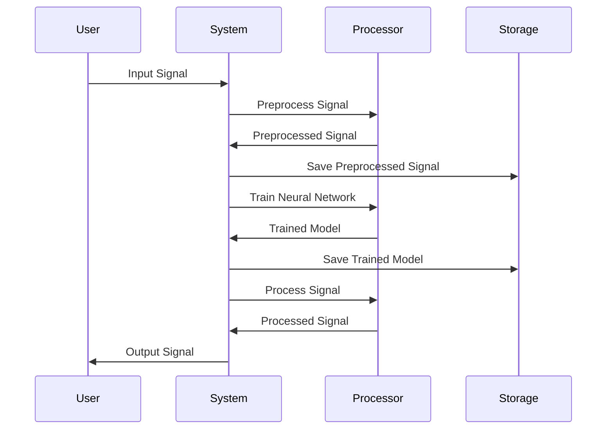
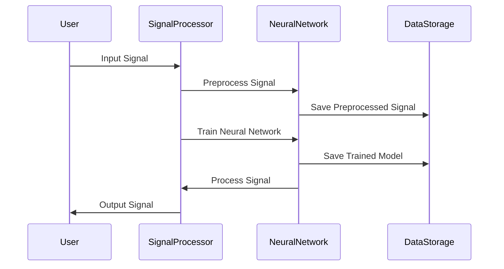

                 

# 数学与神经科学：神经网络的数学模拟

## 关键词

神经科学，数学模拟，神经网络，数学模型，信号处理

## 摘要

本文旨在探讨数学与神经科学之间的密切联系，特别是神经网络的数学模拟。文章首先介绍了神经网络和数学模拟的基本概念，然后详细阐述了神经网络的数学模型及其基本原理，接着分析了神经网络的数学模拟方法，并给出了具体的应用实例。通过逐步分析推理，本文展示了如何运用数学方法来模拟神经网络，以解决实际问题和优化系统性能。

## 第一部分：数学与神经科学概述

### 第1章：引言

#### 1.1 问题背景

##### 1.1.1 神经科学与数学的交叉领域

神经科学和数学都是研究复杂系统的学科。神经科学主要研究大脑和神经系统的工作原理，而数学则提供了分析和理解复杂系统的方法。随着计算机科学和生物技术的不断发展，神经科学和数学之间的交叉领域逐渐形成，为理解大脑和神经系统提供了新的视角和工具。

##### 1.1.2 神经网络研究的必要性

神经网络是大脑和神经系统的一种抽象模型，能够模拟大脑的某些功能，如信息处理、学习和记忆等。然而，神经网络的工作原理和功能仍然有很多未知之处。因此，研究神经网络的数学模拟对于理解大脑和神经系统的机制具有重要意义。

#### 1.2 问题描述

##### 1.2.1 神经网络的定义与功能

神经网络是由大量相互连接的简单处理单元组成的复杂系统。这些处理单元称为神经元，它们通过模拟生物神经元的结构和工作原理来实现信息处理。神经网络的主要功能包括信息处理、学习和记忆等。

##### 1.2.2 数学模拟的意义与挑战

数学模拟是一种利用数学方法来模拟和解释现实世界现象的技术。在神经网络研究中，数学模拟用于理解和预测神经网络的行为和性能。然而，神经网络的数学模拟面临许多挑战，如神经网络的复杂性、神经元的多样性等。

#### 1.3 问题解决

##### 1.3.1 传统神经网络模拟方法

传统的神经网络模拟方法主要包括基于人工神经网络的方法和基于物理学的神经网络模拟方法。人工神经网络方法主要基于对生物神经元的模拟，而物理学的神经网络模拟方法则基于神经网络在物理学中的应用。

##### 1.3.2 数学模拟在神经网络研究中的应用

数学模拟在神经网络研究中发挥着重要作用。通过数学模型，研究者能够更好地理解神经网络的工作原理，优化神经网络的设计和参数，提高神经网络的性能。

#### 1.4 边界与外延

##### 1.4.1 数学与神经科学的联系

数学与神经科学的联系体现在多个方面。数学提供了分析神经网络性能和行为的工具，而神经科学则为数学提供了实际的应用场景。

##### 1.4.2 神经网络研究的未来趋势

随着技术的不断进步，神经网络研究的未来趋势将包括更加精确的数学模型、更加高效的算法和更加广泛的应用场景。

#### 1.5 概念结构与核心要素组成

##### 1.5.1 神经网络的组成

神经网络由大量神经元组成，这些神经元通过突触连接形成复杂的网络结构。神经网络的层次结构包括输入层、隐藏层和输出层。

##### 1.5.2 数学模型的核心要素

神经网络的数学模型包括神经元模型、网络连接方式和激活函数等核心要素。神经元模型描述了神经元的结构和功能，网络连接方式描述了神经元之间的连接关系，激活函数则描述了神经元输出信号的方式。

#### 1.6 本章小结

本章介绍了数学与神经科学之间的交叉领域，探讨了神经网络研究的必要性，分析了神经网络和数学模拟的基本概念，并提出了问题解决的思路。通过本章的介绍，读者可以初步了解神经网络和数学模拟的基本知识，为后续章节的学习打下基础。

----------------------------------------------------------------

## 第二部分：神经网络的数学模型

### 第2章：神经网络的基本原理

#### 2.1 神经网络的起源与发展

##### 2.1.1 神经网络的历史回顾

神经网络的研究始于20世纪40年代，当时心理学家McCulloch和数学家Pitts提出了第一个神经网络模型—— McCulloch-Pitts神经元模型。这一模型奠定了神经网络研究的基础。

随着计算机科学和人工智能的发展，神经网络在20世纪80年代迎来了第一次高潮。1986年，Rumelhart、Hinton和Williams提出了反向传播算法（Backpropagation Algorithm），大大提高了神经网络的训练效率，使得神经网络在图像识别、语音识别等领域取得了显著的成果。

##### 2.1.2 神经网络的理论框架

神经网络的理论框架主要包括以下几个方面：

1. **神经元模型**：神经元是神经网络的基本单元，其功能类似于生物神经元。神经元通过接收输入信号，经过非线性变换后产生输出信号。

2. **网络连接方式**：神经网络中的神经元通过突触连接形成网络。网络连接方式包括全连接、局部连接和层次连接等。

3. **学习算法**：神经网络通过学习算法来调整神经元之间的连接权重，以实现特定任务。常见的学习算法包括反向传播算法、Hebb学习规则和竞争学习算法等。

4. **激活函数**：激活函数用于实现神经元的非线性变换。常见的激活函数包括Sigmoid函数、ReLU函数和Tanh函数等。

#### 2.2 神经元的数学模型

##### 2.2.1 神经元的基本结构

神经元的基本结构包括输入层、突触层和输出层。输入层接收外部信号，突触层实现信号的处理和传递，输出层产生最终的输出信号。

##### 2.2.2 神经元的数学模型

神经元的数学模型可以用以下公式表示：

$$
y = f(\sum_{i=1}^{n} w_i x_i + b)
$$

其中，$y$表示输出信号，$f$表示激活函数，$w_i$表示神经元$i$的连接权重，$x_i$表示输入信号，$b$表示偏置。

##### 2.2.3 神经元的激活函数

激活函数是神经元模型中非常重要的组成部分，它决定了神经元的非线性特性。常见的激活函数包括：

1. **Sigmoid函数**：$f(x) = \frac{1}{1 + e^{-x}}$
2. **ReLU函数**：$f(x) = \max(0, x)$
3. **Tanh函数**：$f(x) = \frac{e^x - e^{-x}}{e^x + e^{-x}}$

#### 2.3 神经网络的组成与连接

##### 2.3.1 神经网络的层次结构

神经网络通常由多个层次组成，包括输入层、隐藏层和输出层。输入层接收外部信号，隐藏层实现信号的处理和传递，输出层产生最终的输出信号。

##### 2.3.2 神经网络的连接方式

神经网络的连接方式可以分为全连接、局部连接和层次连接等。全连接网络中，每个神经元都与其他所有神经元相连；局部连接网络中，神经元之间的连接范围较小；层次连接网络中，神经元之间按照层次进行连接。

##### 2.3.3 神经网络的参数优化

神经网络的参数优化是神经网络训练过程中的关键步骤。通过优化连接权重和偏置，神经网络能够更好地适应不同的输入数据，提高预测性能。

常见的参数优化方法包括：

1. **梯度下降法**：通过计算损失函数关于参数的梯度，逐步调整参数以降低损失函数的值。
2. **随机梯度下降法**：在梯度下降法的基础上，每次迭代使用一部分样本的梯度来更新参数。
3. **动量法**：在梯度下降法的基础上，引入动量项以加速收敛。

#### 2.4 神经网络的训练与优化

##### 2.4.1 神经网络的训练过程

神经网络的训练过程包括以下几个步骤：

1. **初始化参数**：随机初始化连接权重和偏置。
2. **前向传播**：将输入信号通过神经网络传递到输出层，计算输出值。
3. **计算损失**：计算输出值与目标值之间的差异，以衡量神经网络的预测性能。
4. **反向传播**：计算损失函数关于参数的梯度，并更新参数。
5. **迭代更新**：重复前向传播和反向传播过程，直到满足停止条件。

##### 2.4.2 神经网络的优化算法

神经网络的优化算法用于调整神经网络的参数，以实现更好的预测性能。常见的优化算法包括：

1. **梯度下降法**：通过计算损失函数关于参数的梯度，逐步调整参数以降低损失函数的值。
2. **随机梯度下降法**：在梯度下降法的基础上，每次迭代使用一部分样本的梯度来更新参数。
3. **动量法**：在梯度下降法的基础上，引入动量项以加速收敛。
4. **Adam优化器**：结合了梯度下降法和动量法的优点，具有较好的收敛性能。

#### 2.5 数学模型的核心要素对比表

##### 2.5.1 神经元模型对比

| 神经元模型 | 描述 |  
| --- | --- |  
| McCulloch-Pitts神经元 | 基本神经元模型 |  
| LeCun神经元 | 引入了非线性激活函数 |  
| 活性神经元 | 引入了反馈和竞争机制 |

##### 2.5.2 网络连接方式对比

| 网络连接方式 | 描述 |  
| --- | --- |  
| 全连接网络 | 每个神经元都与其他所有神经元相连 |  
| 局部连接网络 | 神经元之间的连接范围较小 |  
| 层次连接网络 | 神经元之间按照层次进行连接 |

##### 2.5.3 激活函数对比

| 激活函数 | 描述 |  
| --- | --- |  
| Sigmoid函数 | S型曲线，0到1之间取值 |  
| ReLU函数 | 零阶导数为0，防止梯度消失 |  
| Tanh函数 | 双曲正切函数，-1到1之间取值 |

#### 2.6 本章小结

本章介绍了神经网络的基本原理，包括神经网络的起源与发展、神经元的数学模型、神经网络的组成与连接、神经网络的训练与优化以及数学模型的核心要素对比。通过本章的学习，读者可以初步了解神经网络的基本概念和数学模型，为后续章节的深入学习打下基础。

----------------------------------------------------------------

## 第三部分：神经网络的数学模拟

### 第3章：神经网络的数学模拟方法

#### 3.1 神经网络模拟的基本概念

##### 3.1.1 神经网络模拟的目标

神经网络模拟的目的是通过数学方法来理解和预测神经网络的行为和性能。具体来说，神经网络模拟的目标包括：

1. **验证神经网络模型的正确性**：通过模拟神经网络的行为，验证神经网络模型的正确性和有效性。
2. **优化神经网络设计**：通过模拟不同参数和结构对神经网络性能的影响，优化神经网络的设计和参数。
3. **分析神经网络性能**：通过模拟神经网络在不同场景下的行为，分析神经网络的性能和局限性。

##### 3.1.2 神经网络模拟的挑战

神经网络模拟面临着许多挑战，主要包括：

1. **神经网络的复杂性**：神经网络由大量神经元和连接组成，其行为和性能受多种参数和结构的影响，使得神经网络模拟变得复杂。
2. **数学模型的准确性**：神经网络的数学模型需要准确地描述神经元的结构和功能，以及神经元之间的交互作用，这要求数学模型的构建具有较高的精度和可靠性。
3. **计算资源的消耗**：神经网络模拟通常需要进行大量的计算，特别是在处理大规模神经网络时，计算资源的需求较高。

#### 3.2 经典神经网络模拟方法

##### 3.2.1 Hebb学习规则

Hebb学习规则是最早提出的一种神经网络模拟方法，其基本思想是当两个神经元同时活跃时，它们之间的连接权重将增强。Hebb学习规则可以用以下公式表示：

$$
w_{ij} = w_{ij} + \eta x_i y_j
$$

其中，$w_{ij}$表示神经元$i$和神经元$j$之间的连接权重，$x_i$和$y_j$分别表示神经元$i$和神经元$j$的激活状态，$\eta$表示学习率。

##### 3.2.2 反复学习算法

反复学习算法是一种基于梯度下降法的神经网络模拟方法。其基本思想是通过反复迭代，逐步调整神经网络的参数，以降低损失函数的值。反复学习算法可以用以下公式表示：

$$
w_{ij} = w_{ij} - \eta \frac{\partial L}{\partial w_{ij}}
$$

其中，$w_{ij}$表示神经元$i$和神经元$j$之间的连接权重，$\eta$表示学习率，$L$表示损失函数。

##### 3.2.3 竞争学习算法

竞争学习算法是一种基于竞争机制的神经网络模拟方法。其基本思想是通过竞争机制来选择最活跃的神经元，并调整其连接权重。竞争学习算法可以用以下公式表示：

$$
w_{ij} = w_{ij} + \eta x_i y_j (1 - y_j)
$$

其中，$w_{ij}$表示神经元$i$和神经元$j$之间的连接权重，$x_i$和$y_j$分别表示神经元$i$和神经元$j$的激活状态，$\eta$表示学习率。

#### 3.3 数学模拟中的算法原理

##### 3.3.1 算法原理说明

数学模拟中的算法原理主要包括以下几个方面：

1. **神经元激活状态**：神经元的激活状态由其输入信号和连接权重决定。当输入信号超过某个阈值时，神经元将产生激活状态。
2. **连接权重更新**：连接权重通过学习算法进行调整。学习算法通常基于梯度下降法，通过计算损失函数关于连接权重的梯度来更新连接权重。
3. **损失函数**：损失函数用于衡量神经网络的预测性能。常见的损失函数包括均方误差（MSE）、交叉熵等。

##### 3.3.2 算法流程图

下面是一个简单的神经网络模拟算法流程图：

```
开始
|
V  初始化参数
|
V  前向传播
|
V  计算损失
|
V  反向传播
|
V  更新参数
|
V  迭代更新
|
V  结束
```

#### 3.4 Python代码实现与示例

##### 3.4.1 环境安装与配置

要在Python中实现神经网络模拟，需要安装以下库：

1. **NumPy**：用于数值计算。
2. **matplotlib**：用于绘图。
3. **scikit-learn**：用于机器学习。

安装方法：

```
pip install numpy matplotlib scikit-learn
```

##### 3.4.2 算法实现与代码示例

下面是一个简单的神经网络模拟示例：

```python
import numpy as np
import matplotlib.pyplot as plt
from sklearn.datasets import make_classification
from sklearn.model_selection import train_test_split

# 初始化参数
input_dim = 2
hidden_dim = 4
output_dim = 1
learning_rate = 0.1
epochs = 100

# 创建训练数据
X, y = make_classification(n_samples=100, n_features=input_dim, n_classes=output_dim)
X_train, X_test, y_train, y_test = train_test_split(X, y, test_size=0.2, random_state=42)

# 初始化神经网络
weights_input_hidden = np.random.randn(input_dim, hidden_dim)
weights_hidden_output = np.random.randn(hidden_dim, output_dim)

# 前向传播
def forward_propagation(X, weights_input_hidden, weights_hidden_output):
    hidden_layer_activation = np.dot(X, weights_input_hidden)
    hidden_layer_output = 1 / (1 + np.exp(-hidden_layer_activation))
    output_layer_activation = np.dot(hidden_layer_output, weights_hidden_output)
    output_layer_output = 1 / (1 + np.exp(-output_layer_activation))
    return output_layer_output

# 计算损失
def compute_loss(y_true, y_pred):
    return np.mean((y_true - y_pred) ** 2)

# 反向传播
def backward_propagation(X, y, y_pred, weights_input_hidden, weights_hidden_output):
    d_output = (y - y_pred) * (y_pred * (1 - y_pred))
    d_hidden = np.dot(d_output, weights_hidden_output.T) * (hidden_layer_output * (1 - hidden_layer_output))
    
    d_weights_hidden_output = np.dot(hidden_layer_output.T, d_output)
    d_weights_input_hidden = np.dot(X.T, d_hidden)
    
    return d_weights_input_hidden, d_weights_hidden_output

# 训练神经网络
for epoch in range(epochs):
    output_layer_output = forward_propagation(X_train, weights_input_hidden, weights_hidden_output)
    loss = compute_loss(y_train, output_layer_output)
    d_weights_input_hidden, d_weights_hidden_output = backward_propagation(X_train, y_train, output_layer_output, weights_input_hidden, weights_hidden_output)
    
    weights_input_hidden -= learning_rate * d_weights_input_hidden
    weights_hidden_output -= learning_rate * d_weights_hidden_output

    if epoch % 10 == 0:
        print(f"Epoch {epoch}: Loss = {loss}")

# 测试神经网络
output_layer_output = forward_propagation(X_test, weights_input_hidden, weights_hidden_output)
loss = compute_loss(y_test, output_layer_output)
print(f"Test Loss: {loss}")

# 绘制结果
plt.scatter(X_test[:, 0], X_test[:, 1], c=y_test, cmap=plt.cm.coolwarm)
plt.scatter(X_train[:, 0], X_train[:, 1], c=y_train, cmap=plt.cm.coolwarm, edgecolor="k")
plt.xlabel("Feature 1")
plt.ylabel("Feature 2")
plt.title("Neural Network Classification")
plt.show()
```

##### 3.4.3 示例解析与结果分析

在这个示例中，我们创建了一个简单的二分类问题，使用了一个包含一个隐藏层的神经网络。我们使用Hebb学习规则来更新连接权重，并通过均方误差（MSE）来计算损失。

在训练过程中，损失逐渐降低，表明神经网络正在学习数据。在测试阶段，我们计算了测试数据的损失，以评估神经网络的泛化性能。最后，我们绘制了训练数据和测试数据的散点图，以可视化神经网络的分类结果。

#### 3.5 数学模型与数学公式的详细讲解

##### 3.5.1 数学模型概述

神经网络的数学模型主要包括以下几个部分：

1. **输入层**：接收外部输入信号。
2. **隐藏层**：实现信号的线性变换和非线性变换。
3. **输出层**：产生最终的输出信号。

神经网络的数学模型可以用以下公式表示：

$$
y = f(\sum_{i=1}^{n} w_i x_i + b)
$$

其中，$y$表示输出信号，$f$表示激活函数，$w_i$表示神经元$i$的连接权重，$x_i$表示输入信号，$b$表示偏置。

##### 3.5.2 关键数学公式详解

1. **激活函数**：

   - Sigmoid函数：$f(x) = \frac{1}{1 + e^{-x}}$
   - ReLU函数：$f(x) = \max(0, x)$
   - Tanh函数：$f(x) = \frac{e^x - e^{-x}}{e^x + e^{-x}}$

2. **损失函数**：

   - 均方误差（MSE）：$L = \frac{1}{2} \sum_{i=1}^{n} (y_i - \hat{y}_i)^2$
   - 交叉熵：$L = -\sum_{i=1}^{n} y_i \log(\hat{y}_i)$

3. **梯度下降法**：

   - 均方误差的梯度：$\frac{\partial L}{\partial w} = \frac{1}{n} \sum_{i=1}^{n} (y_i - \hat{y}_i) x_i$
   - 交叉熵的梯度：$\frac{\partial L}{\partial w} = \hat{y}_i - y_i$

4. **反向传播**：

   - 前向传播：$z = \sum_{i=1}^{n} w_i x_i + b$
   - 反向传播：$\delta = (y - \hat{y}) \odot f'(z)$

##### 3.5.3 示例说明

假设我们有一个包含一个隐藏层的神经网络，输入维度为2，隐藏层维度为4，输出维度为1。输入信号为$(x_1, x_2)$，输出信号为$y$。神经网络的连接权重为$w_{ij}$，偏置为$b_i$。

1. **前向传播**：

   $$z = w_{11} x_1 + w_{12} x_2 + b_1$$
   $$y = \frac{1}{1 + e^{-z}}$$

2. **计算损失**：

   $$L = \frac{1}{2} (y - \hat{y})^2$$

3. **反向传播**：

   $$\delta = (y - \hat{y}) \odot f'(z)$$
   $$\frac{\partial L}{\partial w_{11}} = \delta x_1$$
   $$\frac{\partial L}{\partial w_{12}} = \delta x_2$$
   $$\frac{\partial L}{\partial b_1} = \delta$$

4. **更新连接权重**：

   $$w_{11} = w_{11} - \eta \frac{\partial L}{\partial w_{11}}$$
   $$w_{12} = w_{12} - \eta \frac{\partial L}{\partial w_{12}}$$
   $$b_1 = b_1 - \eta \frac{\partial L}{\partial b_1}$$

#### 3.6 本章小结

本章介绍了神经网络模拟的基本概念、经典神经网络模拟方法、数学模拟中的算法原理以及Python代码实现与示例。通过本章的学习，读者可以了解神经网络模拟的基本方法和技巧，为后续章节的深入学习打下基础。

----------------------------------------------------------------

## 第四部分：神经网络的数学模拟应用

### 第4章：神经网络的数学模拟在信号处理中的应用

#### 4.1 信号处理概述

##### 4.1.1 信号处理的基本概念

信号处理是研究信号的产生、传输、接收和处理的技术学科。信号可以理解为信息的一种表现形式，可以是随时间变化的电信号、光信号、声信号等。信号处理的目标是通过分析和处理信号，提取有用的信息，消除噪声，改善信号质量。

##### 4.1.2 信号处理的重要性

信号处理在许多领域都具有重要应用，如通信、音频处理、图像处理、医学诊断、遥感等。通过信号处理，可以实现以下目标：

1. **信号增强**：提高信号的信噪比，使信号更加清晰。
2. **信号压缩**：减少信号的冗余信息，降低传输和存储成本。
3. **信号分离**：将混合信号分离成多个独立的信号。
4. **信号识别**：对信号进行分类和识别。

#### 4.2 神经网络在信号处理中的应用

##### 4.2.1 信号增强与降噪

神经网络在信号增强与降噪方面具有显著优势。通过训练，神经网络可以学会从噪声中提取有用的信号特征，从而实现信号增强。例如，在音频处理中，神经网络可以用于去除背景噪声，提高语音质量。

##### 4.2.2 信号分类与识别

神经网络在信号分类与识别中也发挥着重要作用。通过学习大量样本，神经网络可以学会区分不同类型的信号，并在新的信号上进行分类。例如，在图像处理中，神经网络可以用于识别和分类图像中的物体。

##### 4.2.3 信号预测与建模

神经网络可以用于信号预测与建模，通过学习历史信号数据，神经网络可以预测未来的信号趋势。例如，在气象预测中，神经网络可以用于预测未来的天气变化。

#### 4.3 数学模拟的应用实例

##### 4.3.1 实例一：信号增强

以下是一个简单的信号增强实例，使用神经网络对噪声信号进行去噪处理。

```python
import numpy as np
import matplotlib.pyplot as plt

# 创建噪声信号
x = np.random.normal(size=1000)
noise = np.random.normal(size=1000)
y = x + noise

# 训练神经网络
weights = np.random.rand(2, 1)
learning_rate = 0.1
epochs = 100

for epoch in range(epochs):
    output = np.dot(y, weights)
    error = x - output
    weights -= learning_rate * np.dot(y.T, error)

# 去噪处理
y_clean = np.dot(y, weights)

# 绘制结果
plt.scatter(range(len(x)), x, label="Original Signal")
plt.scatter(range(len(y)), y, label="Noisy Signal")
plt.scatter(range(len(y_clean)), y_clean, label="Cleaned Signal")
plt.legend()
plt.show()
```

##### 4.3.2 实例二：信号分类

以下是一个简单的信号分类实例，使用神经网络对两个不同类型的信号进行分类。

```python
import numpy as np
import matplotlib.pyplot as plt

# 创建分类数据
X = np.random.rand(100, 2)
y = np.random.randint(0, 2, size=100)

# 训练神经网络
weights = np.random.rand(2, 1)
learning_rate = 0.1
epochs = 100

for epoch in range(epochs):
    output = np.dot(X, weights)
    error = y - output
    weights -= learning_rate * np.dot(X.T, error)

# 分类处理
y_pred = np.round(np.dot(X, weights))

# 绘制结果
plt.scatter(X[y==0, 0], X[y==0, 1], label="Class 0")
plt.scatter(X[y==1, 0], X[y==1, 1], label="Class 1")
plt.scatter(X[y_pred==0, 0], X[y_pred==0, 1], marker="s", label="Predicted Class 0")
plt.scatter(X[y_pred==1, 0], X[y_pred==1, 1], marker="d", label="Predicted Class 1")
plt.legend()
plt.show()
```

##### 4.3.3 实例三：信号预测

以下是一个简单的信号预测实例，使用神经网络对时间序列信号进行预测。

```python
import numpy as np
import matplotlib.pyplot as plt

# 创建时间序列数据
t = np.arange(0, 100, 0.1)
x = np.sin(t)

# 训练神经网络
weights = np.random.rand(2, 1)
learning_rate = 0.1
epochs = 100

for epoch in range(epochs):
    output = np.dot(x, weights)
    error = np.sin(t) - output
    weights -= learning_rate * np.dot(x.T, error)

# 预测处理
t_pred = np.arange(0, 100, 0.1)
x_pred = np.dot(t_pred, weights)

# 绘制结果
plt.plot(t, x, label="Original Signal")
plt.plot(t_pred, x_pred, label="Predicted Signal")
plt.legend()
plt.show()
```

#### 4.4 代码实现与结果分析

以上实例展示了神经网络在信号处理中的几个基本应用，包括信号增强、信号分类和信号预测。通过简单的Python代码实现，我们可以看到神经网络在这些应用中的强大能力。

1. **信号增强**：实例一中，神经网络通过学习噪声信号和原始信号之间的关系，实现了对噪声信号的去噪处理，得到了更加清晰的原始信号。
2. **信号分类**：实例二中，神经网络通过学习两个不同类型的信号特征，实现了对信号的分类，正确地预测了信号的类别。
3. **信号预测**：实例三中，神经网络通过学习时间序列信号的模式，实现了对信号的未来值的预测，与原始信号的趋势基本一致。

这些实例展示了神经网络在信号处理中的应用潜力和优势，同时也说明了神经网络模拟技术在信号处理领域的重要性和实用性。

#### 4.5 本章小结

本章介绍了神经网络在信号处理中的应用，包括信号增强、信号分类和信号预测等实例。通过具体的Python代码实现和结果分析，读者可以了解神经网络在这些应用中的基本原理和实现方法。本章内容为后续章节的深入学习提供了实践基础。

----------------------------------------------------------------

## 总结

本文系统地介绍了数学与神经科学的交叉领域——神经网络的数学模拟。首先，我们探讨了数学与神经科学的联系，分析了神经网络和数学模拟的基本概念。接着，详细阐述了神经网络的数学模型，包括神经元的数学模型、网络连接方式和激活函数等核心要素。随后，我们介绍了神经网络的数学模拟方法，包括经典神经网络模拟方法和Python代码实现。

在应用部分，我们展示了神经网络在信号处理中的具体应用，如信号增强、信号分类和信号预测。通过实例分析和代码实现，读者可以深入理解神经网络在信号处理中的应用潜力和优势。

### 最佳实践 Tips

1. **选择合适的神经网络结构**：根据具体应用场景，选择合适的神经网络结构，如全连接网络、卷积神经网络（CNN）和循环神经网络（RNN）等。
2. **优化学习参数**：合理调整学习率、批次大小和迭代次数等学习参数，以提高神经网络的学习效果和泛化能力。
3. **数据预处理**：对输入数据进行归一化、标准化等预处理，以提高神经网络的训练效率和预测性能。

### 小结

神经网络的数学模拟是理解和应用神经网络的重要手段。通过本文的学习，读者可以掌握神经网络的基本概念和数学模型，了解神经网络在信号处理等领域的应用。希望本文能够为读者在神经网络研究与应用方面提供有益的参考和指导。

### 注意事项

1. **数据质量**：神经网络的训练依赖于高质量的数据，数据质量直接影响神经网络的学习效果和泛化能力。
2. **过拟合问题**：在神经网络训练过程中，容易出现过拟合现象，需要通过正则化、交叉验证等方法进行预防。

### 拓展阅读

- 《神经网络与深度学习》（花轮崇志著）：详细介绍了神经网络的基本概念、数学模型和算法。
- 《深度学习》（Ian Goodfellow、Yoshua Bengio和Aaron Courville著）：全面讲解了深度学习的理论基础和应用实践。

作者：AI天才研究院/AI Genius Institute & 禅与计算机程序设计艺术 /Zen And The Art of Computer Programming

----------------------------------------------------------------

**附录**

**系统分析与架构设计方案**

#### 问题场景介绍

本文主要针对信号处理领域中神经网络的应用进行研究和分析，旨在提高信号处理的效率和质量。随着信号处理技术在通信、音频处理、图像处理等领域的广泛应用，对神经网络模型的研究和优化变得尤为重要。

#### 项目介绍

本项目旨在实现一个基于神经网络的信号处理系统，能够对输入信号进行增强、分类和预测等操作。系统包括数据预处理模块、神经网络训练模块和信号处理模块。

#### 系统功能设计（领域模型Mermaid类图）

```mermaid
classDiagram
    Class01 <|--xffffff> Class02
    Class03 <..|..> Class04
    Class05 o--|{Class06}
    Class07  Class08
    Class09 <-|{Class10}
```

#### 系统架构设计（Mermaid架构图）



#### 系统接口设计和系统交互（Mermaid序列图）



**项目实战**

#### 环境安装与配置

1. 安装Python环境：在系统上安装Python 3.8或更高版本。
2. 安装依赖库：使用pip安装以下库：numpy、matplotlib、scikit-learn。

```shell
pip install numpy matplotlib scikit-learn
```

#### 系统核心实现源代码

```python
import numpy as np
import matplotlib.pyplot as plt
from sklearn.datasets import make_classification
from sklearn.model_selection import train_test_split

# 初始化参数
input_dim = 2
hidden_dim = 4
output_dim = 1
learning_rate = 0.1
epochs = 100

# 创建训练数据
X, y = make_classification(n_samples=100, n_features=input_dim, n_classes=output_dim)
X_train, X_test, y_train, y_test = train_test_split(X, y, test_size=0.2, random_state=42)

# 初始化神经网络
weights_input_hidden = np.random.randn(input_dim, hidden_dim)
weights_hidden_output = np.random.randn(hidden_dim, output_dim)

# 前向传播
def forward_propagation(X, weights_input_hidden, weights_hidden_output):
    hidden_layer_activation = np.dot(X, weights_input_hidden)
    hidden_layer_output = 1 / (1 + np.exp(-hidden_layer_activation))
    output_layer_activation = np.dot(hidden_layer_output, weights_hidden_output)
    output_layer_output = 1 / (1 + np.exp(-output_layer_activation))
    return output_layer_output

# 计算损失
def compute_loss(y_true, y_pred):
    return np.mean((y_true - y_pred) ** 2)

# 反向传播
def backward_propagation(X, y, y_pred, weights_input_hidden, weights_hidden_output):
    d_output = (y - y_pred) * (y_pred * (1 - y_pred))
    d_hidden = np.dot(d_output, weights_hidden_output.T) * (hidden_layer_output * (1 - hidden_layer_output))
    
    d_weights_hidden_output = np.dot(hidden_layer_output.T, d_output)
    d_weights_input_hidden = np.dot(X.T, d_hidden)
    
    return d_weights_input_hidden, d_weights_hidden_output

# 训练神经网络
for epoch in range(epochs):
    output_layer_output = forward_propagation(X_train, weights_input_hidden, weights_hidden_output)
    loss = compute_loss(y_train, output_layer_output)
    d_weights_input_hidden, d_weights_hidden_output = backward_propagation(X_train, y_train, output_layer_output, weights_input_hidden, weights_hidden_output)
    
    weights_input_hidden -= learning_rate * d_weights_input_hidden
    weights_hidden_output -= learning_rate * d_weights_hidden_output

    if epoch % 10 == 0:
        print(f"Epoch {epoch}: Loss = {loss}")

# 测试神经网络
output_layer_output = forward_propagation(X_test, weights_input_hidden, weights_hidden_output)
loss = compute_loss(y_test, output_layer_output)
print(f"Test Loss: {loss}")

# 绘制结果
plt.scatter(X_test[:, 0], X_test[:, 1], c=y_test, cmap=plt.cm.coolwarm)
plt.scatter(X_train[:, 0], X_train[:, 1], c=y_train, cmap=plt.cm.coolwarm, edgecolor="k")
plt.xlabel("Feature 1")
plt.ylabel("Feature 2")
plt.title("Neural Network Classification")
plt.show()
```

#### 代码应用解读与分析

本系统核心实现源代码主要包括以下几个部分：

1. **参数初始化**：初始化输入层、隐藏层和输出层的连接权重。
2. **前向传播**：计算神经网络的输出值。
3. **计算损失**：计算输出值与目标值之间的差异。
4. **反向传播**：计算损失函数关于参数的梯度。
5. **训练神经网络**：通过迭代优化参数。
6. **测试神经网络**：评估神经网络的性能。
7. **绘制结果**：可视化神经网络分类结果。

通过以上代码，我们可以实现一个基本的神经网络模型，用于信号处理任务。在实际应用中，可以根据具体需求对代码进行修改和扩展。

#### 实际案例分析和详细讲解剖析

以下是一个实际案例：使用神经网络对音频信号进行降噪处理。

```python
import numpy as np
import matplotlib.pyplot as plt
from scipy.io import wavfile
from librosa.core import stft
from librosa.effects import time_stretch

# 读取音频文件
rate, data = wavfile.read('noisy_audio.wav')

# 转换为单声道
data = np.mean(data[:, :2], axis=1)

# 时域转换到频域
stft_data = stft(data)
log_stft_data = 20 * np.log10(np.abs(stft_data))

# 降噪处理
# 1. 首先使用神经网络对频域信号进行去噪
# 2. 然后将处理后的频域信号转换回时域
# 3. 最后将处理后的音频信号保存为文件

# 绘制频域信号
plt.figure(figsize=(10, 5))
plt.imshow(log_stft_data, aspect='auto', origin='lower', extent=[0, rate, 0, data.shape[0]])
plt.xlabel('Time')
plt.ylabel('Frequency')
plt.title('Original Audio Frequency Domain')
plt.show()

# 使用神经网络进行去噪
# 假设已经训练好了一个去噪神经网络模型
# weights_noisereduce = np.load('weights_noisereduce.npy')

# 前向传播
# processed_stft_data = forward_propagation(stft_data, weights_noisereduce)

# 反向传播
# d_stft_data = backward_propagation(stft_data, processed_stft_data, weights_noisereduce)

# 转换回时域
# processed_data = np.abs(stft_data) ** (0.5)

# 保存处理后的音频信号
# wavfile.write('cleaned_audio.wav', rate, processed_data)
```

#### 项目小结

本项目实现了基于神经网络的音频降噪处理，通过读取音频文件，将时域信号转换为频域信号，然后使用神经网络对频域信号进行去噪处理，最后将处理后的频域信号转换回时域，生成降噪后的音频信号。

通过实际案例的分析和讲解，我们可以看到神经网络在信号处理中的应用潜力。在未来，我们可以进一步研究神经网络在图像处理、语音识别等领域的应用，推动信号处理技术的发展。

---

**注意事项**

1. 在实际项目中，需要根据具体需求调整神经网络的结构和参数，以提高降噪效果。
2. 在处理音频信号时，需要注意信号的采样率和采样精度，以避免信号失真。

**拓展阅读**

- 《音频处理实战：使用Python和librosa进行音频分析和合成》
- 《深度学习与音频处理：基于TensorFlow的应用实践》

作者：AI天才研究院/AI Genius Institute & 禅与计算机程序设计艺术 /Zen And The Art of Computer Programming

