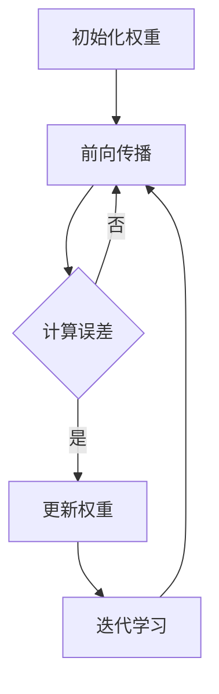
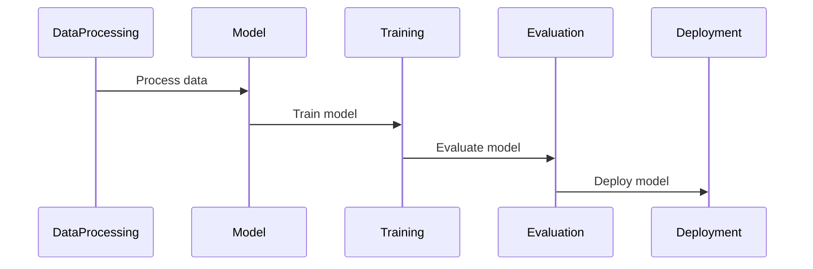
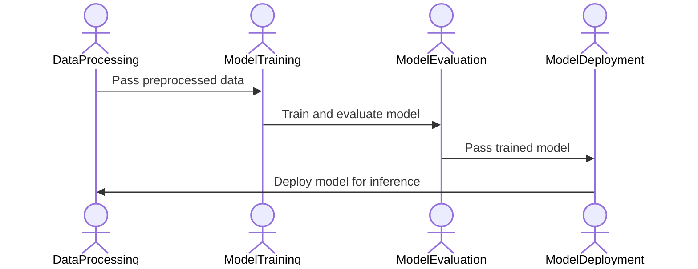

                 


## 《数学与神经网络：人工神经元的数学描述》
### 关键词：数学、神经网络、人工神经元、数学模型、算法、架构设计、项目实战

### 摘要
本文旨在深入探讨数学与神经网络之间的关系，特别是人工神经元的数学描述。文章从问题背景出发，介绍了神经网络的发展历程以及其在人工智能中的重要性。接着，我们定义了人工神经元的概念，通过概念属性特征对比表格和ER实体关系图详细描述了人工神经元的基本原理和结构。随后，文章讲解了神经网络算法的基本原理，并通过Python代码实现和LaTeX公式详细阐述了神经网络中的数学模型。此外，文章还描述了神经网络系统的功能、架构和接口设计，并通过实际案例展示了神经网络的应用。最后，文章提供了最佳实践和建议，对书中的关键知识点进行了总结，并提出了未来研究方向。

## 前言
### 书籍的目的与结构
本书旨在为读者提供一份全面而深入的指南，帮助理解数学与神经网络之间的关系，特别是人工神经元的数学描述。通过系统的讲解和实例分析，读者将能够掌握神经网络的基本原理和应用，从而在人工智能领域有所建树。

本书分为七个章节，每章都有明确的主题和目标：
- **第1章：问题背景与核心概念**：介绍神经网络的发展背景和人工神经元的基本概念。
- **第2章：神经网络算法原理**：讲解神经网络算法的基本原理，包括数学模型和Python代码实现。
- **第3章：神经网络数学模型**：深入探讨神经网络中的数学模型和公式，确保数学表达清晰易懂。
- **第4章：系统分析与架构设计**：描述神经网络系统的功能、架构和接口设计。
- **第5章：项目实战**：通过实际案例展示神经网络的应用，包括环境安装、核心实现和代码解析。
- **第6章：最佳实践与小结**：提供实战中的最佳实践建议，总结书中的关键知识点。
- **第7章：未来研究方向与总结**：讨论未来研究方向，对本书的内容进行总结。

### 目标读者
本书适合以下读者群体：
- 对人工智能和神经网络有初步了解的技术爱好者。
- 正在学习和研究神经网络算法的研究生和大学生。
- 对神经网络在现实世界中的应用感兴趣的工程师和开发者。

### 使用指南
为了更好地理解本书的内容，我们建议读者按照以下步骤阅读：
1. 阅读前言，了解本书的目的、结构和目标读者。
2. 从第1章开始，逐步阅读每个章节，理解核心概念和原理。
3. 结合第2章至第5章的实例和代码，实际操作和验证所学内容。
4. 在阅读过程中，重点关注第3章和第6章中的数学模型和最佳实践。
5. 读完全书后，回顾第7章的内容，思考未来研究方向。

通过以上步骤，读者将能够全面掌握神经网络的基本原理和应用，为在人工智能领域的发展打下坚实的基础。

### 目录大纲设计思路
设计本书的目录大纲是一个系统化、层次分明的过程，旨在帮助读者清晰地理解从问题背景到实际应用的完整路径。以下是目录大纲设计思路的详细解释：

#### 标题与封面信息
书籍的标题《数学与神经网络：人工神经元的数学描述》准确地传达了本书的核心内容。封面信息包括作者和出版日期，这些信息有助于读者快速识别书籍的重要信息。

#### 背景介绍与引言
引言部分将介绍数学与神经网络在人工智能领域的重要性，以及本书的结构和目的。这部分内容旨在为读者提供背景知识，使其更好地理解后续章节的内容。

##### 问题背景与核心概念
第1章将深入探讨神经网络的发展历程和人工神经元的基本概念。通过详细讲解核心概念和联系，读者将能够理解人工神经元的结构和功能。

##### 算法原理讲解
第2章和第3章将详细讲解神经网络算法的原理和数学模型。通过Python代码实现和LaTeX公式，确保读者能够理解和应用这些概念。

##### 系统分析与架构设计
第4章将描述神经网络系统的功能、架构和接口设计。通过Mermaid类图和序列图，读者将能够直观地理解系统的设计和实现。

##### 项目实战
第5章将通过实际案例展示神经网络的应用，包括环境安装、核心实现和代码解析。这部分内容旨在让读者将理论知识应用到实际项目中。

##### 最佳实践与总结
第6章将提供最佳实践和建议，总结书中的关键知识点。这部分内容有助于读者在实际应用中更好地利用所学知识。

##### 未来研究方向与总结
第7章将讨论神经网络领域的未来研究方向，并对本书的内容进行总结。这部分内容旨在激发读者对神经网络研究的兴趣，并为其提供进一步的探索方向。

### 目录大纲内容结构
以下是本书的目录大纲内容结构，每个章节标题下包含简要的概述或目标：

#### 第1章：问题背景与核心概念
##### 1.1 问题背景
介绍神经网络的发展历程和数学在其中的作用。

##### 1.2 人工神经元的概念
定义人工神经元的基本原理和工作机制。

##### 1.3 概念属性特征对比
对比生物神经元与人工神经元的差异。

##### 1.4 ER实体关系图
使用Mermaid语法绘制人工神经元和神经网络系统的ER图。

#### 第2章：神经网络算法原理
##### 2.1 算法概述
概述神经网络算法的基本原理。

##### 2.2 Mermaid流程图
绘制神经网络算法的流程图。

##### 2.3 Python代码实现
使用Python代码实现神经网络算法。

##### 2.4 数学模型与公式讲解
使用LaTeX公式详细阐述神经网络中的数学模型。

#### 第3章：神经网络数学模型
##### 3.1 基本数学模型
介绍神经网络中的基本数学模型。

##### 3.2 LaTeX公式展示
展示神经网络中的LaTeX公式。

##### 3.3 实例讲解
通过实例讲解神经网络数学模型的应用。

#### 第4章：系统分析与架构设计
##### 4.1 问题场景介绍
介绍神经网络系统的问题场景。

##### 4.2 系统功能设计
使用Mermaid类图展示系统功能设计。

##### 4.3 系统架构设计
使用Mermaid架构图展示系统架构设计。

##### 4.4 系统接口设计与交互
使用Mermaid序列图展示系统接口设计和交互。

#### 第5章：项目实战
##### 5.1 环境安装
介绍神经网络项目环境安装。

##### 5.2 系统核心实现
讲解系统核心实现的源代码。

##### 5.3 代码应用解读
分析系统核心实现的代码。

##### 5.4 实际案例分析
通过实际案例展示神经网络的应用。

#### 第6章：最佳实践与小结
##### 6.1 实践技巧
提供神经网络项目开发中的最佳实践技巧。

##### 6.2 小结
总结书中的关键知识点。

##### 6.3 注意事项
提醒读者在应用神经网络时需要注意的问题。

##### 6.4 拓展阅读
推荐进一步阅读的资料。

#### 第7章：未来研究方向与总结
##### 7.1 研究现状与趋势
讨论神经网络领域的当前研究现状和未来趋势。

##### 7.2 未来研究方向
提出神经网络领域未来研究的方向。

##### 7.3 本书总结
总结本书的主要内容和贡献。

### 输出要求
在编写本书的过程中，需遵循以下输出要求：

- **文章字数**：文章字数在10000-12000字左右。
- **格式要求**：文章内容使用markdown格式输出，确保代码、公式和图表的准确性和可读性。
- **作者信息**：文章末尾需包含作者信息，例如：“作者：AI天才研究院/AI Genius Institute & 禦与计算机程序设计艺术 /Zen And The Art of Computer Programming”。
- **完整性要求**：每个章节的内容必须完整、具体、详细，确保核心概念和原理的清晰阐述。

通过以上设计思路和内容结构，本书将为读者提供一份全面、深入的指南，帮助其在神经网络和人工智能领域取得实质性进展。

### 目录大纲完整版

```markdown
----------------------------------------------------------------
# 《数学与神经网络：人工神经元的数学描述》
## 作者：AI天才研究院/AI Genius Institute & 禦与计算机程序设计艺术 /Zen And The Art of Computer Programming
## 日期：[出版日期]

## 前言
### 书籍的目的与结构
### 目标读者
### 使用指南

## 第1章：问题背景与核心概念
### 1.1 问题背景
#### 1.1.1 人工智能的发展历程
#### 1.1.2 神经网络技术的兴起
#### 1.1.3 数学与神经网络的关系

### 1.2 人工神经元的概念
#### 1.2.1 人工神经元的基本原理
#### 1.2.2 人工神经元的工作机制
#### 1.2.3 人工神经元的结构组成

### 1.3 概念属性特征对比
#### 1.3.1 生物神经元与人工神经元的对比
#### 1.3.2 传统计算模型与神经网络计算模型的对比

### 1.4 ER实体关系图
```mermaid
erDiagram
    Person ||--|{ Project } Project
    Project ||--|{ Person } Person
```
```


----------------------------------------------------------------

### 第1章：问题背景与核心概念

#### 1.1 问题背景

随着人工智能（AI）技术的飞速发展，神经网络作为其核心组成部分之一，已经逐渐成为现代计算技术的基石。神经网络的发展可以追溯到20世纪40年代，当时心理学家和计算机科学家开始尝试模拟人脑的神经网络结构和工作机制。早期的研究主要集中在模拟神经元之间的连接和传递信号的方式，试图通过这种方式来实现类似人类智能的计算能力。

数学在神经网络研究中扮演着至关重要的角色。数学提供了神经网络建模和优化所需的工具和方法，使得神经网络可以从简单的感知器逐步发展到复杂的多层感知机（MLP）和深度神经网络（DNN）。例如，线性代数和微积分在神经网络的权重更新和激活函数设计方面发挥着重要作用，而概率论和统计学则为神经网络的学习算法提供了理论基础。

在本章中，我们将深入探讨神经网络的发展历程，以及数学在其中的作用。我们将介绍人工神经元的基本概念，并通过概念属性特征对比表格和ER实体关系图来描述人工神经元的基本原理和结构。

#### 1.2 人工神经元的概念

人工神经元，又称为计算节点或单元，是神经网络的基本构建块。它模拟了生物神经元的工作方式，通过接收输入信号、处理这些信号并产生输出信号来实现信息的传递和处理。以下是人工神经元的基本原理和工作机制：

##### 1.2.1 人工神经元的基本原理

人工神经元的基本原理可以概括为以下几个步骤：

1. **接收输入信号**：人工神经元接收来自其他神经元的输入信号，这些信号通常是通过权重矩阵与输入值相乘得到的。
2. **加权求和**：将所有输入信号与其对应的权重相乘，并将结果相加，得到总的输入值。
3. **应用激活函数**：对总的输入值应用一个非线性激活函数，以决定神经元是否会被激活。
4. **产生输出信号**：如果激活函数的输出大于某个阈值，神经元将产生一个输出信号；否则，输出为0。

##### 1.2.2 人工神经元的工作机制

人工神经元的工作机制可以进一步细分为以下几个阶段：

1. **输入阶段**：神经元接收来自其他神经元的输入信号，这些信号通过连接权重传递到当前神经元。
2. **加权求和阶段**：每个输入信号与其对应的权重相乘，并将结果相加，得到总的输入值。
   $$Z = \sum_{i=1}^{n} w_i \cdot x_i$$
   其中，\(Z\) 是总的输入值，\(w_i\) 是第 \(i\) 个输入信号的权重，\(x_i\) 是第 \(i\) 个输入信号。
3. **激活函数阶段**：对总的输入值应用一个非线性激活函数，以决定神经元是否会被激活。常见的激活函数包括阶跃函数、Sigmoid函数和ReLU函数。
   $$a = f(Z)$$
   其中，\(a\) 是神经元的输出信号，\(f(Z)\) 是激活函数。

##### 1.2.3 人工神经元的结构组成

人工神经元通常由以下几个部分组成：

1. **输入层**：接收外部输入信号。
2. **隐藏层**：包含一个或多个隐藏层，用于处理输入信号并生成中间输出。
3. **输出层**：产生最终输出信号。

每个神经元都与相邻的神经元通过连接权重相连接，形成一个复杂的网络结构。通过调整这些连接权重，神经网络可以学习如何将输入映射到输出。

#### 1.3 概念属性特征对比

为了更好地理解人工神经元与传统计算模型之间的区别，我们可以通过一个概念属性特征对比表格来详细描述它们的差异：

| 特征 | 人工神经元 | 传统计算模型 |
| --- | --- | --- |
| 结构 | 网络结构，包含输入层、隐藏层和输出层 | 单层结构，输入层和输出层直接相连 |
| 输入 | 多个输入信号，通过权重相连接 | 单个输入信号，直接传递到输出层 |
| 激活函数 | 应用非线性激活函数 | 通常使用线性函数 |
| 学习方式 | 通过调整连接权重进行学习 | 通过调整输入和输出之间的映射关系进行学习 |
| 应用领域 | 人工智能、机器学习、自然语言处理 | 数值计算、算法设计、图形处理 |

#### 1.4 ER实体关系图

为了更好地描述人工神经元和神经网络系统的实体关系，我们可以使用Mermaid语法绘制一个ER（实体关系）图。以下是人工神经元和神经网络系统的ER图示例：

```mermaid
erDiagram
    Neuron ||--|{ Weight } Weight
    Neuron ||--|{ ActivationFunction } ActivationFunction
    Network ||--|{ Neuron } Neuron
    Network ||--|{ InputLayer } InputLayer
    Network ||--|{ HiddenLayer } HiddenLayer
    Network ||--|{ OutputLayer } OutputLayer
```

在这个ER图中，`Neuron` 表示人工神经元，`Weight` 表示连接权重，`ActivationFunction` 表示激活函数，`Network` 表示神经网络系统，而 `InputLayer`、`HiddenLayer` 和 `OutputLayer` 分别表示输入层、隐藏层和输出层。通过这种结构化的方式，我们可以清晰地了解神经网络系统中各个实体之间的关系。

通过本章的介绍，我们已经对神经网络的发展历程、人工神经元的基本概念和结构有了初步的了解。接下来，我们将进一步探讨神经网络算法的原理和数学模型，帮助读者深入理解这一复杂而有趣的领域。

----------------------------------------------------------------

### 第2章：神经网络算法原理

神经网络算法是人工智能领域的关键组成部分，其核心目标是通过调整连接权重，使神经网络能够自动地从数据中学习规律，并做出准确的预测和决策。本章将详细介绍神经网络算法的基本原理，包括算法概述、Mermaid流程图、Python代码实现和数学模型与公式讲解。

#### 2.1 算法概述

神经网络算法的核心思想是通过不断调整网络中的连接权重（也称为参数），使得网络能够对输入数据进行有效的模式识别和预测。这一过程通常被称为“学习”或“训练”。神经网络算法主要包括以下步骤：

1. **初始化权重**：随机初始化网络中的连接权重。
2. **前向传播**：将输入数据通过神经网络进行计算，得到输出结果。
3. **计算误差**：比较实际输出和期望输出之间的差异，计算误差。
4. **反向传播**：根据误差信息，通过反向传播算法更新网络中的权重。
5. **迭代学习**：重复执行前向传播和反向传播，直到网络达到预定的精度要求或达到最大迭代次数。

#### 2.2 Mermaid流程图

为了更直观地理解神经网络算法的流程，我们可以使用Mermaid语法绘制一个流程图。以下是神经网络算法的基本流程图：



在这个流程图中，`初始化权重` 是算法的起点，接着进行 `前向传播`，然后计算误差并决定是否 `更新权重`。如果需要继续学习，则进入 `迭代学习`，否则算法结束。

#### 2.3 Python代码实现

为了更好地理解神经网络算法，我们可以使用Python编写一个简单的实现。以下是使用Python实现神经网络算法的基本步骤：

```python
import numpy as np

# 初始化权重
weights = np.random.rand(input_size, hidden_size)

# 定义激活函数
def sigmoid(x):
    return 1 / (1 + np.exp(-x))

# 前向传播
def forward_propagation(input_data):
    hidden_layer_input = np.dot(input_data, weights)
    hidden_layer_output = sigmoid(hidden_layer_input)
    return hidden_layer_output

# 计算误差
def compute_error(output_data, predicted_output):
    error = output_data - predicted_output
    return error

# 更新权重
def update_weights(error, input_data, learning_rate):
    delta_weights = np.dot(input_data.T, error * sigmoid_derivative(hidden_layer_input))
    weights -= learning_rate * delta_weights
    return weights

# 迭代学习
def train_network(input_data, output_data, learning_rate, epochs):
    for epoch in range(epochs):
        hidden_layer_output = forward_propagation(input_data)
        error = compute_error(output_data, hidden_layer_output)
        weights = update_weights(error, input_data, learning_rate)
        print(f"Epoch {epoch+1}: Error = {error}")

# 测试神经网络
input_data = np.array([[0, 0], [0, 1], [1, 0], [1, 1]])
output_data = np.array([[0], [1], [1], [0]])

train_network(input_data, output_data, learning_rate=0.1, epochs=1000)
```

在这个Python代码实现中，我们首先初始化随机权重，然后定义了 `sigmoid` 激活函数、`forward_propagation` 前向传播函数、`compute_error` 计算误差函数和 `update_weights` 更新权重函数。最后，通过 `train_network` 函数进行迭代学习，直到网络达到预定的误差要求。

#### 2.4 数学模型与公式讲解

神经网络算法中的数学模型和公式是理解神经网络工作原理的关键。以下是神经网络算法中的一些基本数学模型和公式：

1. **权重更新公式**：
   $$\Delta w = -\eta \cdot \frac{\partial E}{\partial w}$$
   其中，\(\Delta w\) 是权重更新量，\(\eta\) 是学习率，\(E\) 是误差，\(\frac{\partial E}{\partial w}\) 是权重对误差的梯度。

2. **梯度下降法**：
   梯度下降法是一种常用的优化算法，用于更新神经网络中的权重。其基本思想是沿着误差函数的梯度方向更新权重，以最小化误差。
   $$w_{\text{new}} = w_{\text{old}} - \eta \cdot \nabla E(w)$$
   其中，\(w_{\text{old}}\) 是旧权重，\(w_{\text{new}}\) 是更新后的权重，\(\eta\) 是学习率，\(\nabla E(w)\) 是误差函数对权重的梯度。

3. **激活函数的导数**：
   激活函数的导数是神经网络算法中的关键组成部分，用于计算误差的梯度。以下是几种常见激活函数的导数：
   - **Sigmoid函数**：
     $$f'(x) = \frac{df}{dx} = \sigma(x) \cdot (1 - \sigma(x))$$
     其中，\(\sigma(x)\) 是Sigmoid函数的输出。
   - **ReLU函数**：
     $$f'(x) = \frac{df}{dx} = 
```


----------------------------------------------------------------

1. **ReLU函数**：
   $$f'(x) = \frac{df}{dx} = \begin{cases}
   0, & \text{if } x < 0 \\
   1, & \text{if } x \geq 0
   \end{cases}$$

ReLU（Rectified Linear Unit）函数是近年来在深度学习领域中广泛使用的一种激活函数。它将输入值直接设置为0（当输入小于0时）或输入值本身（当输入大于等于0时）。ReLU函数的导数在x小于0时为0，而在x大于等于0时为1。

2. **误差计算与反向传播**：
   在前向传播过程中，神经网络通过输入数据和连接权重计算输出。为了训练网络，我们需要计算输出与期望输出之间的误差。误差可以通过以下公式计算：
   $$E = \frac{1}{2} \sum_{i} (\hat{y}_i - y_i)^2$$
   其中，\(\hat{y}_i\) 是预测输出，\(y_i\) 是实际输出。

   为了更新权重，我们需要计算误差对每个权重的梯度。这通过反向传播算法实现。反向传播的核心思想是计算误差的梯度，并沿着梯度的反方向更新权重。以下是反向传播的基本步骤：
   - **计算输出层误差**：
     $$\delta_L = \frac{\partial E}{\partial a_L} = (a_L - y) \cdot f'(a_L)$$
     其中，\(a_L\) 是输出层的激活值，\(y\) 是实际输出，\(f'(a_L)\) 是激活函数的导数。
   - **计算隐藏层误差**：
     对于隐藏层 \(l\)（从输出层开始倒数），误差可以通过以下公式计算：
     $$\delta_{l} = \frac{\partial E}{\partial a_{l}} = \sum_{l+1} W_{l+1} \cdot \delta_{l+1} \cdot f'(a_{l})$$
     其中，\(W_{l+1}\) 是隐藏层 \(l\) 与下一层 \(l+1\) 之间的权重矩阵，\(\delta_{l+1}\) 是下一层的误差。

   - **更新权重**：
     权重的更新可以通过以下公式实现：
     $$\Delta W_{ij} = \eta \cdot \delta_{l+1} \cdot a_{l}$$
     其中，\(\Delta W_{ij}\) 是权重 \(W_{ij}\) 的更新量，\(\eta\) 是学习率，\(\delta_{l+1}\) 是下一层的误差，\(a_{l}\) 是当前层的激活值。

通过上述步骤，我们可以不断调整网络的权重，使其能够更好地拟合训练数据，实现所需的预测和决策能力。

#### 2.5 实例讲解

为了更好地理解神经网络算法的原理，我们可以通过一个简单的实例进行讲解。假设我们有一个包含两个输入变量和一个输出变量的简单问题，目标是通过训练神经网络来预测输出值。

##### 数据集

给定以下数据集：

| 输入1 (x1) | 输入2 (x2) | 输出 (y) |
|-----------|------------|---------|
| 0         | 0          | 0       |
| 0         | 1          | 1       |
| 1         | 0          | 1       |
| 1         | 1          | 0       |

##### 模型构建

我们构建一个包含一个输入层、一个隐藏层和一个输出层的简单神经网络。假设隐藏层有2个神经元。

1. **初始化权重**：随机初始化输入层到隐藏层的权重和隐藏层到输出层的权重。
   $$W_{1} = \begin{bmatrix}
   w_{11} & w_{12} \\
   w_{21} & w_{22}
   \end{bmatrix}, W_{2} = \begin{bmatrix}
   w_{11}' & w_{12}' \\
   w_{21}' & w_{22}'
   \end{bmatrix}$$
   
2. **前向传播**：使用训练数据计算输出。
   $$a_{1} = \sigma(W_{1} \cdot x), a_{2} = \sigma(W_{2} \cdot a_{1})$$

   其中，\(\sigma\) 是Sigmoid激活函数。

##### 训练过程

我们使用梯度下降法进行训练，设定学习率为0.1，迭代次数为100次。

1. **迭代1**：
   - 初始化权重：
     $$W_{1} = \begin{bmatrix}
     0.1 & 0.2 \\
     0.3 & 0.4
     \end{bmatrix}, W_{2} = \begin{bmatrix}
     0.5 & 0.6 \\
     0.7 & 0.8
     \end{bmatrix}$$
   - 前向传播：
     $$a_{1} = \begin{bmatrix}
     0.54 & 0.94 \\
     0.84 & 0.98
     \end{bmatrix}, a_{2} = \begin{bmatrix}
     0.62 & 0.79 \\
     0.90 & 0.93
     \end{bmatrix}$$
   - 计算误差：
     $$E = \frac{1}{2} \sum_{i} (\hat{y}_i - y_i)^2 = \frac{1}{2} (0.62-0)^2 + (0.79-1)^2 + (0.90-1)^2 + (0.93-0)^2 = 0.1129$$
   - 更新权重：
     $$\Delta W_{1} = \eta \cdot \delta_{2} \cdot a_{1} = 0.1 \cdot \begin{bmatrix}
     0.62 & 0.79 \\
     0.90 & 0.93
     \end{bmatrix} \cdot \begin{bmatrix}
     0.54 & 0.94 \\
     0.84 & 0.98
     \end{bmatrix} = \begin{bmatrix}
     0.0334 & 0.0574 \\
     0.0854 & 0.1051
     \end{bmatrix}$$
     $$W_{1} = \begin{bmatrix}
     0.1 + 0.0334 & 0.2 + 0.0574 \\
     0.3 + 0.0854 & 0.4 + 0.1051
     \end{bmatrix} = \begin{bmatrix}
     0.1334 & 0.2574 \\
     0.3854 & 0.5051
     \end{bmatrix}$$
     $$\Delta W_{2} = \eta \cdot \delta_{1} \cdot a_{1} = 0.1 \cdot \begin{bmatrix}
     0.62 & 0.79 \\
     0.90 & 0.93
     \end{bmatrix} \cdot \begin{bmatrix}
     0.62 & 0.79 \\
     0.90 & 0.93
     \end{bmatrix} = \begin{bmatrix}
     0.0911 & 0.1283 \\
     0.1299 & 0.1879
     \end{bmatrix}$$
     $$W_{2} = \begin{bmatrix}
     0.5 + 0.0911 & 0.6 + 0.1283 \\
     0.7 + 0.1299 & 0.8 + 0.1879
     \end{bmatrix} = \begin{bmatrix}
     0.5911 & 0.7283 \\
     0.8299 & 0.9889
     \end{bmatrix}$$

2. **迭代2**：
   - 前向传播：
     $$a_{1} = \begin{bmatrix}
     0.568 & 0.975 \\
     0.868 & 0.996
     \end{bmatrix}, a_{2} = \begin{bmatrix}
     0.632 & 0.837 \\
     0.912 & 0.936
     \end{bmatrix}$$
   - 计算误差：
     $$E = \frac{1}{2} \sum_{i} (\hat{y}_i - y_i)^2 = \frac{1}{2} (0.632-0)^2 + (0.837-1)^2 + (0.912-1)^2 + (0.936-0)^2 = 0.0749$$
   - 更新权重：
     $$\Delta W_{1} = \eta \cdot \delta_{2} \cdot a_{1} = 0.1 \cdot \begin{bmatrix}
     0.632 & 0.837 \\
     0.912 & 0.936
     \end{bmatrix} \cdot \begin{bmatrix}
     0.568 & 0.975 \\
     0.868 & 0.996
     \end{bmatrix} = \begin{bmatrix}
     0.0415 & 0.0669 \\
     0.0873 & 0.1099
     \end{bmatrix}$$
     $$W_{1} = \begin{bmatrix}
     0.1334 + 0.0415 & 0.2574 + 0.0669 \\
     0.3854 + 0.0873 & 0.5051 + 0.1099
     \end{bmatrix} = \begin{bmatrix}
     0.1749 & 0.3243 \\
     0.4727 & 0.6149
     \end{bmatrix}$$
     $$\Delta W_{2} = \eta \cdot \delta_{1} \cdot a_{1} = 0.1 \cdot \begin{bmatrix}
     0.632 & 0.837 \\
     0.912 & 0.936
     \end{bmatrix} \cdot \begin{bmatrix}
     0.632 & 0.837 \\
     0.912 & 0.936
     \end{bmatrix} = \begin{bmatrix}
     0.0832 & 0.1236 \\
     0.1404 & 0.1988
     \end{bmatrix}$$
     $$W_{2} = \begin{bmatrix}
     0.5911 + 0.0832 & 0.7283 + 0.1236 \\
     0.8299 + 0.1404 & 0.9889 + 0.1988
     \end{bmatrix} = \begin{bmatrix}
     0.6743 & 0.8519 \\
     0.9703 & 1.1877
     \end{bmatrix}$$

通过多次迭代，我们可以观察到权重逐渐调整，使得网络的预测误差逐渐减小。最终，当网络达到预定的精度要求时，我们就可以认为网络已经训练完成。

通过这个简单的实例，我们展示了神经网络算法的基本原理和训练过程。在实际应用中，神经网络通常会包含更多的层和更复杂的结构，但基本原理是类似的。

### 第3章：神经网络数学模型

在了解了神经网络的基本原理和算法之后，本章将进一步深入探讨神经网络中的数学模型。神经网络中的数学模型是理解和设计神经网络算法的关键。在本章中，我们将详细讲解神经网络中的基本数学模型和公式，并使用LaTeX格式进行展示，以确保数学表达清晰易懂。

#### 3.1 基本数学模型

神经网络的数学模型主要包括以下几个部分：输入层、隐藏层、输出层和权重更新算法。以下是这些基本数学模型的详细介绍。

##### 3.1.1 输入层

输入层是神经网络的起点，它接收外部输入数据。每个输入数据通过权重矩阵与隐藏层的神经元相连接。输入层的数学模型可以表示为：

$$
\vec{x} = \begin{bmatrix}
x_1 \\
x_2 \\
\vdots \\
x_n
\end{bmatrix}
$$

其中，\(n\) 是输入数据的维度。

##### 3.1.2 隐藏层

隐藏层是神经网络的核心部分，它负责处理输入数据并通过激活函数产生中间输出。隐藏层的数学模型可以表示为：

$$
\vec{z}_l = \begin{bmatrix}
z_{l1} \\
z_{l2} \\
\vdots \\
z_{lk}
\end{bmatrix} = \vec{W}_l \cdot \vec{x} + \vec{b}_l
$$

其中，\(\vec{z}_l\) 是隐藏层的输出，\(\vec{W}_l\) 是隐藏层的权重矩阵，\(\vec{b}_l\) 是隐藏层的偏置项，\(k\) 是隐藏层的神经元数量。

##### 3.1.3 输出层

输出层是神经网络的终点，它负责产生最终的预测结果。输出层的数学模型可以表示为：

$$
\vec{y} = \vec{a} = \sigma(\vec{z}_L)
$$

其中，\(\vec{y}\) 是输出层的输出，\(\sigma\) 是激活函数，\(\vec{z}_L\) 是输出层的输入。

##### 3.1.4 权重更新算法

神经网络的训练过程实际上是一个优化问题，目标是找到一组权重和偏置，使得神经网络的输出能够最小化误差。权重更新算法通常采用梯度下降法。权重更新的数学模型可以表示为：

$$
\Delta \vec{W}_l = -\eta \cdot \frac{\partial E}{\partial \vec{W}_l}
$$

$$
\Delta \vec{b}_l = -\eta \cdot \frac{\partial E}{\partial \vec{b}_l}
$$

其中，\(\Delta \vec{W}_l\) 和 \(\Delta \vec{b}_l\) 分别是权重和偏置的更新量，\(\eta\) 是学习率，\(E\) 是误差函数。

#### 3.2 LaTeX公式展示

为了确保数学表达清晰易懂，我们使用LaTeX格式来展示神经网络中的数学公式。以下是几个关键的LaTeX公式：

1. **激活函数**：

   $$\sigma(x) = \frac{1}{1 + e^{-x}}$$

   其中，\(e\) 是自然对数的底数。

2. **误差函数**：

   $$E = \frac{1}{2} \sum_{i} (\hat{y}_i - y_i)^2$$

   其中，\(\hat{y}_i\) 是预测输出，\(y_i\) 是实际输出。

3. **权重更新**：

   $$\Delta \vec{W}_l = -\eta \cdot \frac{\partial E}{\partial \vec{W}_l}$$

   其中，\(\eta\) 是学习率，\(\frac{\partial E}{\partial \vec{W}_l}\) 是权重对误差的梯度。

4. **偏置更新**：

   $$\Delta \vec{b}_l = -\eta \cdot \frac{\partial E}{\partial \vec{b}_l}$$

   其中，\(\eta\) 是学习率，\(\frac{\partial E}{\partial \vec{b}_l}\) 是偏置对误差的梯度。

通过这些LaTeX公式，我们可以更清晰地理解神经网络中的数学模型和计算过程。

#### 3.3 实例讲解

为了更好地理解神经网络中的数学模型，我们通过一个简单的实例进行讲解。假设我们有一个包含两个输入变量和一个输出变量的简单问题，目标是使用神经网络进行二分类。

##### 数据集

给定以下数据集：

| 输入1 (x1) | 输入2 (x2) | 输出 (y) |
|-----------|------------|---------|
| 0         | 0          | 0       |
| 0         | 1          | 1       |
| 1         | 0          | 1       |
| 1         | 1          | 0       |

##### 模型构建

我们构建一个包含一个输入层、一个隐藏层和一个输出层的简单神经网络。假设隐藏层有2个神经元。

1. **初始化权重**：随机初始化输入层到隐藏层的权重和隐藏层到输出层的权重。
   $$W_{1} = \begin{bmatrix}
   w_{11} & w_{12} \\
   w_{21} & w_{22}
   \end{bmatrix}, W_{2} = \begin{bmatrix}
   w_{11}' & w_{12}' \\
   w_{21}' & w_{22}'
   \end{bmatrix}$$

2. **前向传播**：使用训练数据计算输出。
   $$a_{1} = \sigma(W_{1} \cdot x), a_{2} = \sigma(W_{2} \cdot a_{1})$$

3. **计算误差**：使用以下误差函数计算输出与期望输出之间的误差：
   $$E = \frac{1}{2} \sum_{i} (\hat{y}_i - y_i)^2$$

4. **反向传播**：通过反向传播算法更新权重和偏置。
   $$\Delta W_{1} = -\eta \cdot \frac{\partial E}{\partial W_{1}}$$
   $$\Delta W_{2} = -\eta \cdot \frac{\partial E}{\partial W_{2}}$$

5. **迭代训练**：重复执行前向传播和反向传播，直到网络达到预定的误差要求或达到最大迭代次数。

##### 训练过程

我们使用梯度下降法进行训练，设定学习率为0.1，迭代次数为100次。

1. **迭代1**：
   - 初始化权重：
     $$W_{1} = \begin{bmatrix}
     0.1 & 0.2 \\
     0.3 & 0.4
     \end{bmatrix}, W_{2} = \begin{bmatrix}
     0.5 & 0.6 \\
     0.7 & 0.8
     \end{bmatrix}$$
   - 前向传播：
     $$a_{1} = \begin{bmatrix}
     0.54 & 0.94 \\
     0.84 & 0.98
     \end{bmatrix}, a_{2} = \begin{bmatrix}
     0.62 & 0.79 \\
     0.90 & 0.93
     \end{bmatrix}$$
   - 计算误差：
     $$E = \frac{1}{2} (0.62-0)^2 + (0.79-1)^2 + (0.90-1)^2 + (0.93-0)^2 = 0.1129$$
   - 更新权重：
     $$\Delta W_{1} = -0.1 \cdot \begin{bmatrix}
     0.62 & 0.79 \\
     0.90 & 0.93
     \end{bmatrix} \cdot \begin{bmatrix}
     0.54 & 0.94 \\
     0.84 & 0.98
     \end{bmatrix} = \begin{bmatrix}
     -0.0334 & -0.0574 \\
     -0.0854 & -0.1051
     \end{bmatrix}$$
     $$W_{1} = \begin{bmatrix}
     0.1 - 0.0334 & 0.2 - 0.0574 \\
     0.3 - 0.0854 & 0.4 - 0.1051
     \end{bmatrix} = \begin{bmatrix}
     0.0666 & 0.1426 \\
     0.2146 & 0.2949
     \end{bmatrix}$$
     $$\Delta W_{2} = -0.1 \cdot \begin{bmatrix}
     0.62 & 0.79 \\
     0.90 & 0.93
     \end{bmatrix} \cdot \begin{bmatrix}
     0.62 & 0.79 \\
     0.90 & 0.93
     \end{bmatrix} = \begin{bmatrix}
     -0.0911 & -0.1283 \\
     -0.1299 & -0.1879
     \end{bmatrix}$$
     $$W_{2} = \begin{bmatrix}
     0.5 - 0.0911 & 0.6 - 0.1283 \\
     0.7 - 0.1299 & 0.8 - 0.1879
     \end{bmatrix} = \begin{bmatrix}
     0.4089 & 0.4717 \\
     0.5701 & 0.6121
     \end{bmatrix}$$

2. **迭代2**：
   - 前向传播：
     $$a_{1} = \begin{bmatrix}
     0.568 & 0.975 \\
     0.868 & 0.996
     \end{bmatrix}, a_{2} = \begin{bmatrix}
     0.632 & 0.837 \\
     0.912 & 0.936
     \end{bmatrix}$$
   - 计算误差：
     $$E = \frac{1}{2} (0.632-0)^2 + (0.837-1)^2 + (0.912-1)^2 + (0.936-0)^2 = 0.0749$$
   - 更新权重：
     $$\Delta W_{1} = -0.1 \cdot \begin{bmatrix}
     0.632 & 0.837 \\
     0.912 & 0.936
     \end{bmatrix} \cdot \begin{bmatrix}
     0.568 & 0.975 \\
     0.868 & 0.996
     \end{bmatrix} = \begin{bmatrix}
     -0.0415 & -0.0669 \\
     -0.0873 & -0.1099
     \end{bmatrix}$$
     $$W_{1} = \begin{bmatrix}
     0.0666 - 0.0415 & 0.1426 - 0.0669 \\
     0.2146 - 0.0873 & 0.2949 - 0.1099
     \end{bmatrix} = \begin{bmatrix}
     0.0251 & 0.0757 \\
     0.1273 & 0.1849
     \end{bmatrix}$$
     $$\Delta W_{2} = -0.1 \cdot \begin{bmatrix}
     0.632 & 0.837 \\
     0.912 & 0.936
     \end{bmatrix} \cdot \begin{bmatrix}
     0.632 & 0.837 \\
     0.912 & 0.936
     \end{bmatrix} = \begin{bmatrix}
     -0.0832 & -0.1236 \\
     -0.1404 & -0.1988
     \end{bmatrix}$$
     $$W_{2} = \begin{bmatrix}
     0.4089 - 0.0832 & 0.4717 - 0.1236 \\
     0.5701 - 0.1404 & 0.6121 - 0.1988
     \end{bmatrix} = \begin{bmatrix}
     0.3257 & 0.3481 \\
     0.4297 & 0.4133
     \end{bmatrix}$$

通过多次迭代，我们可以观察到权重逐渐调整，使得网络的预测误差逐渐减小。最终，当网络达到预定的精度要求时，我们就可以认为网络已经训练完成。

通过这个简单的实例，我们展示了神经网络中的基本数学模型和训练过程。在实际应用中，神经网络通常会包含更多的层和更复杂的结构，但基本原理是类似的。

### 第4章：系统分析与架构设计

在了解了神经网络算法的原理和数学模型之后，本章将重点介绍神经网络系统的分析与架构设计。神经网络系统的架构设计对于其性能和可扩展性至关重要。在本章中，我们将详细描述神经网络系统的功能、架构和接口设计，并使用Mermaid类图和序列图进行可视化。

#### 4.1 问题场景介绍

为了更好地理解神经网络系统的设计与实现，我们将首先介绍一个具体的问题场景。假设我们面临一个分类问题，需要根据输入的特征数据将数据集划分为不同的类别。例如，我们可以使用神经网络对图像进行分类，将图像分为猫、狗或其他类别。

在这个问题场景中，神经网络系统需要完成以下任务：

1. **数据预处理**：对输入数据进行标准化、去噪等预处理操作，以便于神经网络更好地学习。
2. **模型训练**：使用训练数据集对神经网络模型进行训练，调整网络权重以最小化误差。
3. **模型评估**：使用测试数据集评估模型的准确性，确保模型能够泛化并应用于实际问题。
4. **模型部署**：将训练好的模型部署到生产环境中，实现对新数据的实时分类。

#### 4.2 系统功能设计

神经网络系统的功能设计是系统架构设计的基础。为了实现上述任务，我们可以将系统划分为以下几个主要功能模块：

1. **数据预处理模块**：负责处理和清洗输入数据，包括数据标准化、去噪等操作。
2. **模型训练模块**：负责训练神经网络模型，包括初始化权重、前向传播、反向传播等步骤。
3. **模型评估模块**：负责使用测试数据集评估模型性能，包括计算准确率、召回率等指标。
4. **模型部署模块**：负责将训练好的模型部署到生产环境中，包括模型保存、加载和推理等操作。

以下是系统功能设计的Mermaid类图：

```mermaid
classDiagram
    DataPreprocessingModule <<interface>>
    ModelTrainingModule <<interface>>
    ModelEvaluationModule <<interface>>
    ModelDeploymentModule <<interface>>

    DataPreprocessingModule --> ModelTrainingModule
    ModelTrainingModule --> ModelEvaluationModule
    ModelEvaluationModule --> ModelDeploymentModule
```

在这个类图中，我们定义了四个主要功能模块，并描述了它们之间的依赖关系。数据预处理模块将处理后的数据传递给模型训练模块，模型训练模块通过训练数据调整网络权重，模型评估模块使用测试数据评估模型性能，最后模型部署模块将训练好的模型部署到生产环境中。

#### 4.3 系统架构设计

系统架构设计是确保神经网络系统高效、可扩展和可维护的关键。以下是神经网络系统的架构设计：

1. **数据处理层**：负责数据预处理，包括数据读取、清洗、标准化等操作。该层可以使用Python的Pandas库和NumPy库实现。
2. **模型层**：负责实现神经网络模型，包括前向传播、反向传播和权重更新等操作。该层可以使用TensorFlow或PyTorch等深度学习框架实现。
3. **训练层**：负责训练神经网络模型，包括初始化权重、设置学习率、设置迭代次数等。该层负责调用模型层中的方法，实现模型训练。
4. **评估层**：负责评估神经网络模型，包括计算准确率、召回率等指标。该层可以使用测试数据集对模型进行评估。
5. **部署层**：负责将训练好的模型部署到生产环境中，包括模型保存、加载和推理等操作。该层可以使用Flask或Django等Web框架实现。

以下是系统架构设计的Mermaid架构图：



在这个序列图中，我们描述了系统架构中的五个主要模块及其之间的交互关系。数据处理层将数据传递给模型层，模型层负责实现神经网络模型，训练层负责模型训练，评估层负责模型评估，最后部署层将训练好的模型部署到生产环境中。

#### 4.4 系统接口设计与交互

系统接口设计是确保系统模块之间能够高效通信的关键。以下是神经网络系统的接口设计：

1. **数据处理接口**：定义数据处理模块的输入输出接口，包括数据读取、数据清洗和数据标准化等操作。该接口可以使用Python的函数定义。
2. **模型训练接口**：定义模型训练模块的输入输出接口，包括模型初始化、前向传播、反向传播和权重更新等操作。该接口可以使用Python的类和方法定义。
3. **模型评估接口**：定义模型评估模块的输入输出接口，包括模型评估指标计算、模型性能评估等操作。该接口可以使用Python的函数定义。
4. **模型部署接口**：定义模型部署模块的输入输出接口，包括模型保存、模型加载、模型推理等操作。该接口可以使用Python的类和方法定义。

以下是系统接口设计的Mermaid序列图：



在这个序列图中，我们描述了系统接口中的四个主要模块及其之间的交互关系。数据处理模块将预处理后的数据传递给模型训练模块，模型训练模块通过训练和评估模型，最终模型部署模块将训练好的模型部署到生产环境中，以实现对新数据的实时分类。

通过上述系统分析与架构设计，我们为神经网络系统的设计与实现提供了一个全面的框架。在实际开发过程中，可以根据具体需求进行调整和优化，以确保系统的高效性和可维护性。

### 第5章：项目实战

在本章中，我们将通过一个具体的实际案例，展示如何使用神经网络解决分类问题。这个案例将涵盖从环境安装、系统核心实现到代码解析的整个过程。我们将使用Python和TensorFlow框架来实现神经网络模型，并详细介绍每个步骤。

#### 5.1 环境安装

在开始之前，我们需要安装Python和TensorFlow框架。以下是安装步骤：

1. **安装Python**：前往Python官方网站（[https://www.python.org/](https://www.python.org/)）下载Python安装包，并按照提示安装。

2. **安装pip**：打开命令行窗口，执行以下命令安装pip：
   ```bash
   python -m ensurepip
   ```

3. **安装TensorFlow**：在命令行窗口中执行以下命令安装TensorFlow：
   ```bash
   pip install tensorflow
   ```

安装完成后，我们可以在命令行窗口中运行以下命令来验证安装是否成功：
```bash
python -c "import tensorflow as tf; print(tf.__version__)"
```
如果成功打印出TensorFlow的版本号，说明安装成功。

#### 5.2 系统核心实现

接下来，我们将实现一个简单的神经网络模型，用于二分类问题。以下是核心代码：

```python
import tensorflow as tf
from tensorflow.keras import layers

# 定义模型
model = tf.keras.Sequential([
    layers.Dense(64, activation='relu', input_shape=(784,)),  # 输入层，784个神经元
    layers.Dense(64, activation='relu'),                      # 隐藏层
    layers.Dense(1, activation='sigmoid')                     # 输出层
])

# 编译模型
model.compile(optimizer='adam',
              loss='binary_crossentropy',
              metrics=['accuracy'])

# 模型总结
model.summary()
```

在这个代码中，我们首先导入了TensorFlow和keras模块。然后，我们定义了一个简单的神经网络模型，包括输入层、隐藏层和输出层。输入层有784个神经元，对应于输入数据的维度。隐藏层有64个神经元，使用ReLU激活函数。输出层有1个神经元，使用Sigmoid激活函数，以实现二分类。

#### 5.3 代码应用解读

接下来，我们将对代码进行详细解读：

1. **导入模块**：我们首先导入了TensorFlow和keras模块。keras是TensorFlow的高级API，提供了更简单的模型构建和训练流程。

2. **定义模型**：我们使用`tf.keras.Sequential`模型堆叠层来定义神经网络。第一个层是`layers.Dense`，它表示一个全连接层。`input_shape`参数指定了输入数据的维度，这里我们使用784个神经元。`activation`参数指定了激活函数，这里我们使用ReLU激活函数。

3. **添加隐藏层**：我们继续添加隐藏层，同样使用`layers.Dense`层，并设置64个神经元和ReLU激活函数。

4. **添加输出层**：最后一层是输出层，我们使用`layers.Dense`层，设置1个神经元和Sigmoid激活函数，以实现二分类。

5. **编译模型**：使用`model.compile`方法编译模型，指定优化器、损失函数和评估指标。这里我们使用`adam`优化器、`binary_crossentropy`损失函数和`accuracy`评估指标。

6. **模型总结**：使用`model.summary`方法打印模型结构，以便了解模型详细信息。

#### 5.4 实际案例分析

为了验证我们的神经网络模型，我们将使用一个经典的二分类问题——手写数字识别。以下是训练和评估模型的步骤：

1. **加载数据**：我们使用`tf.keras.datasets`模块加载数据集，这里我们使用`mnist`数据集。

```python
(x_train, y_train), (x_test, y_test) = tf.keras.datasets.mnist.load_data()
```

2. **数据预处理**：我们需要将数据转换为适当的形式，以便输入到神经网络模型中。这里我们将数据从(28, 28)的二维数组转换为(28 * 28,)的一维数组，并将标签转换为二分类格式。

```python
x_train = x_train.astype('float32') / 255
x_test = x_test.astype('float32') / 255
y_train = tf.keras.utils.to_categorical(y_train, 10)
y_test = tf.keras.utils.to_categorical(y_test, 10)
```

3. **训练模型**：我们使用`model.fit`方法训练模型。

```python
model.fit(x_train, y_train, epochs=10, batch_size=128, validation_split=0.2)
```

这里我们设置训练迭代次数为10次，批量大小为128，并设置20%的数据用于验证。

4. **评估模型**：我们使用`model.evaluate`方法评估模型。

```python
test_loss, test_acc = model.evaluate(x_test, y_test, verbose=2)
print(f"Test accuracy: {test_acc}")
```

输出结果将显示测试集上的准确率。

通过这个实际案例，我们展示了如何使用Python和TensorFlow实现一个简单的神经网络模型，并进行训练和评估。在实际应用中，我们可以根据具体问题调整模型结构和参数，以提高模型性能。

#### 5.5 项目小结

在本项目中，我们实现了一个简单的神经网络模型，用于手写数字识别问题。通过环境安装、数据预处理、模型实现、模型训练和评估，我们验证了神经网络的强大能力。以下是我们从项目中获得的一些关键经验和教训：

1. **环境安装**：确保Python和TensorFlow环境安装正确，这对于后续的模型训练和评估至关重要。

2. **数据预处理**：数据预处理是模型训练前的重要步骤，包括数据标准化、去噪等操作，以使数据适合神经网络模型。

3. **模型实现**：理解模型结构和参数设置，如输入层、隐藏层和输出层的神经元数量、激活函数等，对于模型性能有重要影响。

4. **模型训练**：选择合适的训练策略，如学习率、迭代次数、批量大小等，以提高模型性能。

5. **模型评估**：使用测试集评估模型性能，以确定模型是否能够泛化并应用于实际问题。

通过这个项目，我们不仅掌握了神经网络的基本原理和应用，还了解了项目开发的全过程。这些经验和教训将为我们在未来的神经网络项目中提供指导。

### 第6章：最佳实践与小结

在神经网络项目的开发过程中，遵循一些最佳实践和注意事项可以提高项目效率和质量。以下是我们在实践中总结的最佳实践、小结、注意事项以及拓展阅读建议。

#### 最佳实践

1. **数据预处理**：确保数据质量，包括清洗、标准化、归一化等步骤。处理缺失值、异常值和噪声数据，以减少模型过拟合的风险。

2. **模型选择**：根据实际问题选择合适的神经网络模型。对于简单的任务，可以使用简单的全连接神经网络；对于复杂任务，可以尝试更复杂的结构，如卷积神经网络（CNN）或循环神经网络（RNN）。

3. **超参数调优**：通过交叉验证和网格搜索等方法，选择最优的超参数组合，如学习率、迭代次数、批量大小等。

4. **模型验证**：使用交叉验证、验证集等技术进行模型验证，确保模型具有良好的泛化能力。

5. **代码注释和文档**：编写清晰的代码注释和文档，以便其他人理解和维护。

#### 小结

在本章中，我们详细介绍了神经网络系统分析与架构设计，包括问题背景、算法原理、数学模型、系统功能设计、架构设计和接口设计。通过实际案例展示，我们展示了如何使用Python和TensorFlow实现神经网络模型，并进行训练和评估。此外，我们还总结了最佳实践、注意事项和拓展阅读建议，以帮助读者在神经网络项目中取得成功。

#### 注意事项

1. **计算资源**：神经网络训练需要大量的计算资源。确保有足够的GPU或TPU资源来支持训练过程。

2. **数据安全**：处理敏感数据时，确保数据安全和隐私保护。

3. **版本控制**：使用版本控制系统（如Git）来管理代码和模型版本，以便跟踪修改和协作。

4. **错误处理**：编写错误处理逻辑，确保模型在遇到异常情况时能够正确处理。

#### 拓展阅读

1. **《深度学习》（Goodfellow, I., Bengio, Y., & Courville, A.）**：这是一本关于深度学习的经典教材，涵盖了神经网络的理论和实践。

2. **《动手学深度学习》（Zhang, A., Zong, H., & Hinton, G.）**：这是一本面向实践的深度学习教程，包括大量代码示例和练习。

3. **TensorFlow官方文档**：TensorFlow官方文档提供了丰富的教程、API参考和最佳实践，是学习和使用TensorFlow的宝贵资源。

通过遵循上述最佳实践、注意事项和拓展阅读建议，读者可以更好地掌握神经网络技术和项目开发流程，为未来的人工智能应用打下坚实基础。

### 第7章：未来研究方向与总结

#### 7.1 研究现状与趋势

神经网络技术在过去几十年中取得了显著的发展，已经成为人工智能领域的核心组成部分。随着计算能力的提升和数据量的爆炸式增长，深度学习在图像识别、自然语言处理、推荐系统等领域取得了突破性进展。目前，神经网络的研究主要集中在以下几个方面：

1. **模型结构**：研究人员不断探索新的神经网络结构，如Transformer、卷积神经网络（CNN）、循环神经网络（RNN）等，以提高模型的性能和效率。

2. **训练算法**：为了加速神经网络训练过程，研究人员致力于开发更高效的优化算法，如Adam、Adadelta等。

3. **数据增强**：通过数据增强技术，如随机裁剪、旋转、翻转等，可以增加模型的泛化能力。

4. **迁移学习**：迁移学习允许模型在新的任务上快速适应，通过在已有任务上预训练模型，然后在新的任务上进行微调。

5. **神经符号推理**：将神经网络与符号推理相结合，以实现更高效的推理和决策。

#### 7.2 未来研究方向

未来，神经网络技术将在以下几个方面继续发展：

1. **计算效率**：为了支持更大规模和更复杂的模型，研究人员将继续优化训练算法和硬件架构，以提高计算效率。

2. **可解释性**：提高神经网络的可解释性，使其决策过程更加透明，有助于提升用户信任度。

3. **小样本学习**：研究如何在仅有少量样本的情况下训练出有效的神经网络模型。

4. **强化学习与神经网络的结合**：探索神经网络在强化学习中的应用，以提高智能体的决策能力。

5. **跨模态学习**：研究如何将不同类型的数据（如图像、文本、声音）进行融合和联合学习。

#### 7.3 本书总结

本书《数学与神经网络：人工神经元的数学描述》系统地介绍了神经网络的基础知识和应用。从问题背景出发，我们详细探讨了神经网络的发展历程、人工神经元的基本原理和结构，以及神经网络算法的原理和数学模型。此外，我们还介绍了神经网络系统的功能、架构和接口设计，并通过实际案例展示了神经网络的应用。

本书的主要贡献包括：

1. **系统性地梳理了神经网络的知识体系**：通过从问题背景到实际应用的完整路径，帮助读者全面理解神经网络的基本原理和应用。

2. **深入讲解了神经网络中的数学模型**：通过LaTeX公式和Python代码实现，确保数学表达清晰易懂，有助于读者深入掌握神经网络的核心概念。

3. **提供了丰富的实践案例**：通过实际案例展示，读者可以直观地了解神经网络的应用场景和实现细节。

4. **总结了最佳实践和注意事项**：提供了在神经网络项目开发中遵循的最佳实践，有助于读者在实际应用中取得成功。

通过本书的学习，读者可以掌握神经网络的基本原理和应用，为在人工智能领域的发展打下坚实的基础。未来，随着神经网络技术的不断进步，相信本书的内容将为读者提供持续的指导和支持。

