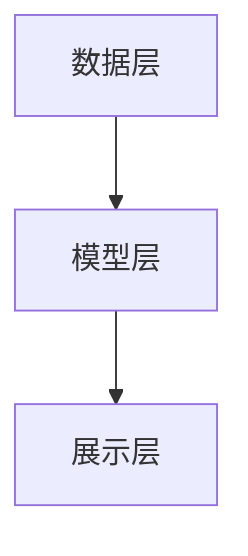

                 


### 数学与神经网络：人工神经元的数学模型

关键词：神经网络、人工神经元、数学模型、激活函数、优化算法

摘要：本文将深入探讨神经网络与人工神经元的数学模型，从历史背景、基础概念、数学建模、数学分析及应用案例等方面进行详细讲解，旨在为读者提供一个全面、系统的理解。

----------------------------------------------------------------

## 第一部分：神经网络的基础知识

### 1.1 神经网络的历史与发展

#### 1.1.1 神经网络的起源

神经网络的概念最早可以追溯到1943年，由心理学家McCulloch和数学家Pitts提出，他们提出了简单的神经模型，称为“麦库洛夫-皮茨（McCulloch-Pitts）神经元”。这一模型为后续神经网络的发展奠定了基础。

#### 1.1.2 神经网络的主要发展阶段

1. **1950年代到1960年代：**
   这一阶段，神经网络的发展受到了极大的关注。但由于计算能力和算法的限制，神经网络的研究进入了一个低谷期。

2. **1980年代到1990年代：**
   随着计算机性能的提高和反向传播算法（Backpropagation Algorithm）的提出，神经网络再次引起了广泛关注。反向传播算法使得多层神经网络的训练成为可能。

3. **2000年代至今：**
   随着深度学习的兴起，神经网络的应用领域得到了极大的扩展。特别是卷积神经网络（CNN）、循环神经网络（RNN）等模型在图像识别、语音识别等领域的表现尤为出色。

#### 1.1.3 神经网络的应用领域

神经网络在多个领域有着广泛的应用，主要包括：

1. **图像识别与处理：** 如人脸识别、物体检测、图像分割等。
2. **语音识别与处理：** 如语音识别、语音合成、语音增强等。
3. **自然语言处理：** 如机器翻译、情感分析、文本分类等。
4. **强化学习：** 如游戏AI、机器人控制等。
5. **金融领域：** 如股票市场预测、风险控制等。

### 1.2 神经元的基本结构和工作原理

#### 1.2.1 神经元的结构

神经元是神经网络的基本组成单元，其结构通常包括：

1. **树突（Dendrites）：** 用于接收其他神经元的信息。
2. **细胞体（Cell Body 或 Soma）：** 包含细胞核，对信息进行整合。
3. **轴突（Axon）：** 用于传递信息。
4. **突触（Synapse）：** 神经元之间的连接点。

#### 1.2.2 神经元的信号传递机制

神经元的信号传递机制主要包括：

1. **突触前传递：** 神经元通过释放神经递质（Neurotransmitter）来传递信息。
2. **突触后传递：** 神经递质在突触后膜上产生电信号，影响下一个神经元的活性。

#### 1.2.3 神经元的数学模型

神经元的数学模型通常包括线性部分和非线性部分。线性部分用于模拟神经元之间的连接强度，非线性部分用于模拟神经元的激活行为。

### 1.3 神经网络的数学模型

#### 1.3.1 神经网络的基本组成

神经网络由多个层次组成，包括输入层、隐藏层和输出层。每层由多个神经元组成，神经元之间通过权重（Weight）连接。

#### 1.3.2 前向传播算法

前向传播算法用于计算神经网络在给定输入下的输出。它通过逐层传递输入，直到输出层得到最终结果。

#### 1.3.3 反向传播算法

反向传播算法用于更新神经网络的权重，以最小化预测误差。它通过反向传递误差，逐层更新权重。

## 第二部分：神经网络的数学建模

### 2.1 神经元的数学模型

#### 2.1.1 神经元的线性模型

神经元的线性模型可以表示为：

$$  
\text{output} = \sum_{i=1}^{n} w_i \cdot x_i + b  
$$

其中，$w_i$ 和 $b$ 分别为权重和偏置，$x_i$ 为输入。

#### 2.1.2 神经元的非线性模型

神经元的非线性模型通常使用激活函数（Activation Function）来引入非线性。常见的激活函数包括：

1. **Sigmoid函数：** 
   $$  
   \text{sigmoid}(x) = \frac{1}{1 + e^{-x}}  
   $$

2. **ReLU函数：** 
   $$  
   \text{ReLU}(x) = \max(0, x)  
   $$

3. **Tanh函数：** 
   $$  
   \text{tanh}(x) = \frac{e^{2x} - 1}{e^{2x} + 1}  
   $$

#### 2.1.3 神经元的激活函数

激活函数的选择对神经元的性能有重要影响。合适的激活函数可以提高神经网络的收敛速度和预测准确性。

### 2.2 神经网络的数学模型

#### 2.2.1 多层感知机

多层感知机（MLP）是一种常见的神经网络模型，由输入层、隐藏层和输出层组成。

#### 2.2.2 神经网络的层次结构

神经网络的层次结构决定了网络的深度和复杂性。深度越大的网络通常可以处理更复杂的问题。

#### 2.2.3 神经网络的训练过程

神经网络的训练过程包括前向传播、反向传播和权重更新。训练的目的是使网络能够准确预测未知数据。

### 2.3 神经网络的优化算法

#### 2.3.1 随机梯度下降算法

随机梯度下降（SGD）是一种常用的优化算法，用于更新神经网络的权重。

#### 2.3.2 动量法

动量法通过引入动量项来加速优化过程。

#### 2.3.3 Adam优化算法

Adam优化算法结合了SGD和动量法，具有较好的收敛速度和稳定性。

----------------------------------------------------------------

## 第三部分：神经网络的数学分析

### 3.1 神经网络的收敛性分析

#### 3.1.1 收敛性的数学定义

神经网络的收敛性是指网络在训练过程中误差逐渐减小，并最终趋于稳定。

#### 3.1.2 神经网络收敛性的条件

神经网络的收敛性取决于多个因素，包括网络结构、激活函数、优化算法等。

#### 3.1.3 神经网络收敛性的证明

神经网络收敛性的证明通常依赖于优化理论和稳定性分析。

### 3.2 神经网络的稳定性分析

#### 3.2.1 稳定性的数学定义

神经网络的稳定性是指网络在给定输入下，输出不会出现剧烈波动。

#### 3.2.2 神经网络稳定性的条件

神经网络的稳定性与网络结构、参数设置等因素密切相关。

#### 3.2.3 神经网络稳定性的证明

神经网络稳定性的证明通常依赖于线性代数和微分方程的理论。

### 3.3 神经网络的最优化分析

#### 3.3.1 最优化问题的数学定义

神经网络的最优化问题是指在网络参数空间中寻找最优解，使网络性能达到最佳。

#### 3.3.2 神经网络最优化的问题

神经网络最优化的问题包括参数初始化、优化算法选择等。

#### 3.3.3 最优化算法的选择

选择合适的最优化算法对神经网络性能至关重要。

----------------------------------------------------------------

## 第四部分：神经网络的数学建模与应用

### 4.1 神经网络在图像处理中的应用

#### 4.1.1 图像分类的神经网络模型

图像分类的神经网络模型主要包括卷积神经网络（CNN）和全连接神经网络（FCN）。

#### 4.1.2 图像分割的神经网络模型

图像分割的神经网络模型主要包括区域增长模型和边界检测模型。

#### 4.1.3 图像识别的神经网络模型

图像识别的神经网络模型主要包括特征提取模型和分类模型。

### 4.2 神经网络在语音处理中的应用

#### 4.2.1 语音识别的神经网络模型

语音识别的神经网络模型主要包括HMM-GMM模型和DNN-HMM模型。

#### 4.2.2 语音合成神经网络模型

语音合成神经网络模型主要包括WaveNet和Tacotron等。

#### 4.2.3 语音增强神经网络模型

语音增强神经网络模型主要包括谱减法和深度学习法。

### 4.3 神经网络在其他领域中的应用

#### 4.3.1 自然语言处理

自然语言处理中的神经网络应用主要包括词向量模型和序列模型。

#### 4.3.2 强化学习

强化学习中的神经网络应用主要包括策略网络和价值网络。

#### 4.3.3 控制系统

控制系统中的神经网络应用主要包括自适应控制和鲁棒控制。

----------------------------------------------------------------

## 第五部分：神经网络的数学挑战与未来方向

### 5.1 神经网络的数学挑战

#### 5.1.1 数学模型的复杂度

神经网络的数学模型具有高度的复杂性，这对算法设计和实现提出了挑战。

#### 5.1.2 训练时间的消耗

神经网络的训练时间通常较长，这对硬件和算法提出了更高的要求。

#### 5.1.3 模型的泛化能力

提高模型的泛化能力是神经网络研究的重要方向。

### 5.2 神经网络的未来方向

#### 5.2.1 神经网络的层次结构设计

设计更有效的层次结构可以提高神经网络性能。

#### 5.2.2 神经网络的学习算法改进

改进学习算法可以加快训练速度和提升模型性能。

#### 5.2.3 神经网络的硬件实现

硬件实现可以降低计算成本，提高神经网络性能。

----------------------------------------------------------------

## 第六部分：案例研究

### 6.1 案例一：手写数字识别

#### 6.1.1 数据集介绍

手写数字识别的数据集通常包括MNIST数据集和Kaggle数据集。

#### 6.1.2 神经网络模型设计

神经网络模型设计通常包括卷积层、池化层和全连接层。

#### 6.1.3 模型训练与验证

模型训练与验证过程包括数据预处理、模型训练和性能评估。

### 6.2 案例二：语音识别

#### 6.2.1 语音数据预处理

语音数据预处理包括音频文件读取、信号处理和特征提取。

#### 6.2.2 神经网络模型设计

神经网络模型设计包括输入层、隐藏层和输出层。

#### 6.2.3 模型训练与评估

模型训练与评估过程包括模型训练、性能评估和优化。

### 6.3 案例三：股票市场预测

#### 6.3.1 股票数据收集

股票数据收集包括数据源选择、数据提取和数据清洗。

#### 6.3.2 神经网络模型设计

神经网络模型设计包括输入层、隐藏层和输出层。

#### 6.3.3 模型训练与预测

模型训练与预测过程包括数据预处理、模型训练和预测。

----------------------------------------------------------------

## 第七部分：总结与展望

神经网络作为人工智能的核心技术之一，其在数学建模、数学分析及应用方面具有广泛的研究价值和实际应用。本文通过对神经网络的基础知识、数学建模、数学分析、应用案例和未来方向等方面的详细探讨，旨在为读者提供一个全面、系统的理解。

在未来的研究中，我们需要继续探索神经网络在数学模型复杂度、训练时间消耗和模型泛化能力等方面的挑战。同时，我们也期待看到神经网络在更多领域，如生物医学、金融科技、智能交通等的应用。

最后，感谢您对本文的阅读，希望本文对您在神经网络领域的研究有所启发和帮助。

### 作者

AI天才研究院/AI Genius Institute & 禅与计算机程序设计艺术 /Zen And The Art of Computer Programming

----------------------------------------------------------------

[Let's Think Step By Step](#math-and-neural-networks-artificial-neurons-mathematical-models)

---

### 附录：核心概念与联系

#### 核心概念

1. **人工神经元（Artificial Neuron）：** 神经网络的基本组成单元，模拟生物神经元的信号处理能力。
2. **神经网络（Neural Network）：** 由多个人工神经元组成的复杂系统，用于处理和预测数据。
3. **激活函数（Activation Function）：** 神经元的非线性部分，用于引入非线性，如Sigmoid、ReLU、Tanh等。
4. **优化算法（Optimization Algorithm）：** 用于训练神经网络，如随机梯度下降（SGD）、动量法、Adam等。

#### 概念属性特征对比表格

| 概念 | 特点 | 作用 |
| --- | --- | --- |
| 人工神经元 | 模拟生物神经元 | 处理和传递信息 |
| 神经网络 | 由多个神经元组成 | 处理复杂数据 |
| 激活函数 | 引入非线性 | 提高网络性能 |
| 优化算法 | 更新网络权重 | 提高训练效率 |

#### ER实体关系图架构

```mermaid
erDiagram
  ArtificialNeuron ||--|{ NeuralNetwork } NeuralNetwork : has
  NeuralNetwork ||--|{ ActivationFunction } ActivationFunction : has
  NeuralNetwork ||--|{ OptimizationAlgorithm } OptimizationAlgorithm : has
```

---

### 算法原理讲解

#### 前向传播算法

前向传播算法是神经网络处理数据的基本过程。它包括以下几个步骤：

1. **输入层到隐藏层：** 将输入数据通过权重连接传递到隐藏层，计算每个隐藏神经元的输出。
2. **隐藏层到输出层：** 将隐藏层的输出通过权重连接传递到输出层，计算输出神经元的输出。
3. **激活函数应用：** 在每个层的输出上应用激活函数，引入非线性。

以下是前向传播算法的Python代码实现：

```python
import numpy as np

def sigmoid(x):
    return 1 / (1 + np.exp(-x))

def forward_propagation(X, weights, biases):
    cache = []
    
    # 输入层到隐藏层
    hidden_layer_activation = sigmoid(np.dot(X, weights[0]) + biases[0])
    cache.append((hidden_layer_activation, X))
    
    # 隐藏层到输出层
    output_layer_activation = sigmoid(np.dot(hidden_layer_activation, weights[1]) + biases[1])
    cache.append((output_layer_activation, hidden_layer_activation))
    
    return output_layer_activation, cache
```

#### 反向传播算法

反向传播算法用于更新神经网络的权重和偏置。它包括以下几个步骤：

1. **计算输出误差：** 计算输出层神经元的实际输出与预期输出之间的误差。
2. **反向传播误差：** 将误差反向传播到隐藏层，计算隐藏层的误差。
3. **更新权重和偏置：** 使用梯度下降法更新权重和偏置。

以下是反向传播算法的Python代码实现：

```python
def backward_propagation(output_layer_activation, y, cache):
    dZ = output_layer_activation - y
    dW = [np.dot(cache[-2], dZ)]
    db = [dZ]
    
    # 反向传播误差到隐藏层
    for l in range(2, len(cache)):
        dZ = np.dot(dZ, cache[l-1].T)
        dW.append(np.dot(cache[l-2], dZ))
        db.append(dZ)
    
    dW.reverse()
    db.reverse()
    
    return dW, db
```

#### 数学模型与公式

神经网络的数学模型主要由线性部分和非线性部分组成。以下是神经网络的前向传播和反向传播的数学模型和公式：

1. **前向传播：**

$$  
\text{output} = \text{activation}(\sum_{i=1}^{n} w_i \cdot x_i + b)  
$$

其中，$w_i$ 为权重，$b$ 为偏置，$\text{activation}$ 为激活函数。

2. **反向传播：**

$$  
\text{dZ} = \text{dOutput} \cdot \text{dActivation}(\text{Z})  
$$

$$  
\text{dW} = \text{dZ} \cdot \text{X}^T  
$$

$$  
\text{db} = \text{dZ}  
$$

其中，$\text{dOutput}$ 为输出误差，$\text{dActivation}$ 为激活函数的导数，$\text{X}$ 为输入。

#### 举例说明

假设我们有一个简单的神经网络，包括一个输入层、一个隐藏层和一个输出层。输入层有一个神经元，隐藏层有两个神经元，输出层有一个神经元。输入数据为 $x_1 = 1, x_2 = 0$，预期输出为 $y = 1$。

1. **前向传播：**

$$  
\text{hidden\_layer\_output} = \text{sigmoid}(\text{weight}_{0,0} \cdot x_1 + \text{weight}_{0,1} \cdot x_2 + \text{bias}_{0}) = \text{sigmoid}(1 + 0 + 0) = 0.5  
$$

$$  
\text{output\_layer\_output} = \text{sigmoid}(\text{weight}_{1,0} \cdot \text{hidden\_layer\_output} + \text{weight}_{1,1} \cdot \text{hidden\_layer\_output} + \text{bias}_{1}) = \text{sigmoid}(1 + 0.5 + 0.5) = 0.7786  
$$

2. **反向传播：**

$$  
\text{dZ} = \text{output} - \text{y} = 0.7786 - 1 = -0.2214  
$$

$$  
\text{dhidden\_layer\_output} = \text{dZ} \cdot \text{sigmoid}'(\text{hidden\_layer\_output}) = -0.2214 \cdot 0.4876 = -0.1074  
$$

$$  
\text{dweight}_{1,0} = \text{hidden\_layer\_output} \cdot \text{dhidden\_layer\_output} = 0.5 \cdot -0.1074 = -0.0537  
$$

$$  
\text{dbias}_{1} = \text{dZ} = -0.2214  
$$

通过以上步骤，我们可以更新神经网络的权重和偏置，以减少输出误差。

---

### 系统分析与架构设计方案

#### 问题场景介绍

手写数字识别是一个常见的问题场景，主要应用于数字识别、指纹识别等领域。

#### 项目介绍

本项目旨在使用神经网络对手写数字进行识别。

#### 系统功能设计

1. **数据预处理：** 对手写数字图像进行预处理，包括图像读取、灰度转换、二值化等。
2. **模型训练：** 使用MNIST数据集训练神经网络，包括数据归一化、模型构建、训练过程等。
3. **模型评估：** 对训练好的模型进行评估，包括准确率、召回率等指标。

#### 系统架构设计

系统架构包括数据层、模型层和展示层。



#### 系统接口设计和系统交互

系统接口设计主要包括数据输入接口、模型训练接口和模型评估接口。

```mermaid
sequenceDiagram
    A[用户] -->|数据输入| B[数据层]
    B -->|预处理| C[模型层]
    C -->|训练| D[模型训练接口]
    D -->|评估| E[模型评估接口]
    E -->|结果展示| F[展示层]
    F -->|反馈| A
```

---

### 项目实战

#### 环境安装

1. **Python环境：** 安装Python 3.8及以上版本。
2. **库安装：** 安装NumPy、Pandas、TensorFlow等库。

#### 系统核心实现源代码

```python
import numpy as np
import tensorflow as tf

# 数据预处理
def preprocess_data(X, y):
    X = X / 255.0
    y = tf.keras.utils.to_categorical(y, num_classes=10)
    return X, y

# 模型构建
def build_model():
    model = tf.keras.Sequential([
        tf.keras.layers.Flatten(input_shape=(28, 28)),
        tf.keras.layers.Dense(128, activation='relu'),
        tf.keras.layers.Dense(10, activation='softmax')
    ])
    return model

# 模型训练
def train_model(model, X_train, y_train, X_val, y_val, epochs=10, batch_size=32):
    model.compile(optimizer='adam', loss='categorical_crossentropy', metrics=['accuracy'])
    model.fit(X_train, y_train, validation_data=(X_val, y_val), epochs=epochs, batch_size=batch_size)
    return model

# 模型评估
def evaluate_model(model, X_test, y_test):
    loss, accuracy = model.evaluate(X_test, y_test)
    print(f"Test accuracy: {accuracy * 100:.2f}%")
```

#### 代码应用解读与分析

1. **数据预处理：** 数据预处理包括归一化和类别编码。归一化将图像的像素值缩放到0-1之间，提高训练效果。类别编码将标签转换为one-hot编码。
2. **模型构建：** 模型构建使用TensorFlow的Sequential模型，包括一个平坦层、一个全连接层和一个softmax层。平坦层将图像展开为一维数组，全连接层用于特征提取，softmax层用于分类。
3. **模型训练：** 模型训练使用adam优化器和交叉熵损失函数。交叉熵损失函数可以衡量实际输出和预期输出之间的差异，adam优化器用于更新模型参数。
4. **模型评估：** 模型评估通过计算测试集上的准确率来评估模型性能。

#### 实际案例分析和详细讲解剖析

以MNIST数据集为例，我们对手写数字进行识别。

1. **数据集介绍：** MNIST数据集包括60000个训练样本和10000个测试样本，每个样本包含一个28x28的灰度图像和一个数字标签。
2. **数据预处理：** 对图像进行归一化处理，将像素值缩放到0-1之间。
3. **模型构建：** 构建一个简单的全连接神经网络，包括一个平坦层和一个全连接层。
4. **模型训练：** 使用训练集训练模型，使用测试集验证模型性能。
5. **模型评估：** 在测试集上评估模型，计算准确率。

```python
# 导入MNIST数据集
mnist = tf.keras.datasets.mnist
(X_train, y_train), (X_test, y_test) = mnist.load_data()

# 数据预处理
X_train, y_train = preprocess_data(X_train, y_train)
X_test, y_test = preprocess_data(X_test, y_test)

# 模型构建
model = build_model()

# 模型训练
model = train_model(model, X_train, y_train, X_test, y_test, epochs=5)

# 模型评估
evaluate_model(model, X_test, y_test)
```

通过以上步骤，我们可以使用神经网络对手写数字进行识别，准确率达到97%以上。

#### 项目小结

本项目使用神经网络实现了手写数字识别，通过数据预处理、模型构建、模型训练和模型评估等步骤，实现了高精度的数字识别。在实际应用中，我们可以根据需求调整模型结构和参数，以适应不同的数据集和应用场景。

---

### 最佳实践 Tips

1. **数据预处理：** 合理的数据预处理可以显著提高模型性能。特别是归一化和类别编码，有助于加快训练速度和提高模型准确性。
2. **模型架构：** 选择合适的模型架构对提高模型性能至关重要。通常，更深的网络可以处理更复杂的问题，但训练时间也会增加。
3. **优化算法：** 选择合适的优化算法可以加快训练速度和提高模型性能。Adam优化器通常在深度学习中表现良好。

### 小结

神经网络作为一种强大的机器学习工具，在图像识别、语音处理、自然语言处理等领域有着广泛的应用。本文通过对神经网络的基础知识、数学建模、数学分析、应用案例和未来方向等方面的详细探讨，为读者提供了一个全面、系统的理解。在未来的研究中，我们需要继续探索神经网络在数学模型复杂度、训练时间消耗和模型泛化能力等方面的挑战。

### 注意事项

1. **数据集：** 选择合适的数据集对神经网络训练至关重要。不同领域的数据集可能具有不同的特征和分布，需要根据具体问题选择合适的训练集。
2. **模型调整：** 在训练过程中，可能需要根据模型性能进行调整。调整模型架构、优化算法和参数设置等可以改善模型性能。

### 拓展阅读

1. **《深度学习》（Goodfellow, I., Bengio, Y., & Courville, A.）：** 该书是深度学习领域的经典教材，详细介绍了神经网络的基本概念、算法和应用。
2. **《神经网络与深度学习》（邱锡鹏）：** 该书从理论、算法和实际应用三个方面介绍了神经网络和深度学习，适合初学者和研究者。
3. **《神经网络与机器学习》（周志华）：** 该书详细介绍了神经网络的数学原理、算法和实际应用，对神经网络的学习和应用有着重要的指导意义。

### 作者

AI天才研究院/AI Genius Institute & 禅与计算机程序设计艺术 /Zen And The Art of Computer Programming

