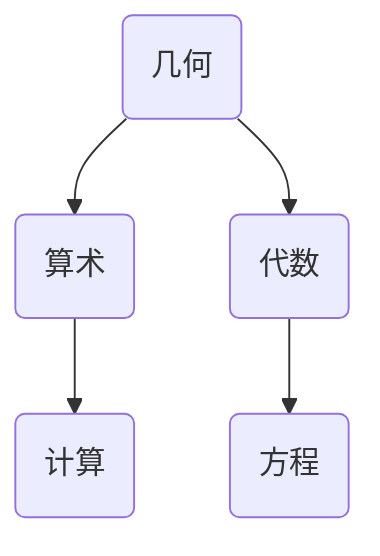

                 

### 让我们一步一步思考：数学在科学革命中的角色

数学作为一种抽象的语言，贯穿了科学的方方面面。从古代数学的发展，到近代数学的突破，再到现代数学的创新，数学在科学革命中扮演了至关重要的角色。在这一节中，我们将以时间为主线，逐步分析数学在各个时期对科学革命的影响。

#### 古代数学的发展

古代数学起源于古埃及、美索不达米亚和中国等文明。这些早期的数学体系主要集中在解决实际问题，如土地测量、天文计算和建筑构造。例如，古埃及人使用几何来设计金字塔，而中国人在《九章算术》中详细阐述了算术和代数的基本原理。

**背景介绍**：

- **核心概念术语**：几何、算术、代数
- **问题背景**：古代文明如何解决实际问题
- **问题描述**：古人在建筑、天文、农业等方面的挑战
- **问题解决**：使用数学工具进行计算和设计
- **边界与外延**：古代数学的应用范围
- **概念结构与核心要素组成**：数学的基本原理和应用场景

**核心概念与联系**：

在古代数学中，几何、算术和代数是最核心的概念。几何研究形状和空间，算术处理数字和计算，代数则研究未知量和方程。这些概念相互联系，共同构成了古代数学的体系。

**ER实体关系图架构的 Mermaid 流程图**：



#### 近代数学的发展

近代数学的发展始于17世纪，这一时期的数学家如牛顿、莱布尼茨、欧拉等，他们的贡献使得数学从抽象的理论走向实际应用。微积分和解析几何的诞生，为科学研究提供了新的工具。

**核心概念与联系**：

- **微积分**：研究变化率和积分
- **解析几何**：用代数方法研究几何问题
- **数学模型**：描述物理现象的数学公式

**算法原理讲解**：

- **微积分**：

  微积分的主要思想是研究函数的变化率。例如，速度是位置函数对时间的导数，面积可以通过积分来计算。

  ```mermaid
  graph TD
      A[求导数] --> B(函数图像)
      B --> C[变化率]
      D[积分] --> B
      B --> E[面积]
  ```

  ```python
  # Python代码示例：求导数和积分
  import sympy as sp

  x = sp.symbols('x')
  f = x**2

  # 求导数
  derivative_f = sp.diff(f, x)
  print("f'(x) = ", derivative_f)

  # 求积分
  integral_f = sp.integrate(f, x)
  print("∫f(x)dx = ", integral_f)
  ```

- **解析几何**：

  解析几何通过将几何问题转化为代数问题来研究。例如，圆的方程是$x^2 + y^2 = r^2$，通过代数方法可以求解圆的性质。

  ```mermaid
  graph TD
      A[圆的方程] --> B(x^2 + y^2 = r^2)
      B --> C[圆的性质]
  ```

#### 现代数学的发展

现代数学在20世纪取得了巨大的进步，特别是在抽象结构和证明方法方面。数学家如希尔伯特、哥德尔、图灵等，他们的工作为计算机科学和理论物理学奠定了基础。

**核心概念与联系**：

- **抽象代数**：研究数学结构，如群、环、域
- **数论**：研究整数和它们的性质
- **拓扑学**：研究空间的性质和变换
- **计算机科学**：数学在算法和理论计算机科学中的应用

**算法原理讲解**：

- **抽象代数**：

  抽象代数研究数学结构，如群、环、域等。这些结构可以帮助我们理解数学中的对称性和不变性。

  ```mermaid
  graph TD
      A[群] --> B[对称性]
      A --> C[运算]
      D[环] --> B
      D --> E[多项式]
      F[域] --> B
      F --> G[线性方程组]
  ```

- **数论**：

  数论研究整数和它们的性质，如质数、同余、数论函数等。数论在密码学中有广泛应用。

  ```mermaid
  graph TD
      A[质数] --> B[素数分布]
      A --> C[同余]
      D[数论函数] --> B
      D --> E[模运算]
  ```

#### 数学在科学革命中的角色

数学在科学革命中的角色可以总结为以下几点：

1. **提供工具**：数学为科学提供了精确的工具和方法，如微积分、解析几何、抽象代数等。
2. **描述现象**：数学可以用来描述自然现象和物理规律，如牛顿的万有引力定律、麦克斯韦方程组等。
3. **促进创新**：数学的抽象思维和逻辑推理能力激发了科学家的创新精神，推动了科学革命的发展。

通过这一节的逐步分析，我们可以看到数学在科学革命中不可或缺的作用。数学不仅为科学提供了工具和方法，还促进了科学的进步和创新。在接下来的章节中，我们将继续探讨数学在各个历史时期的具体应用和影响。

