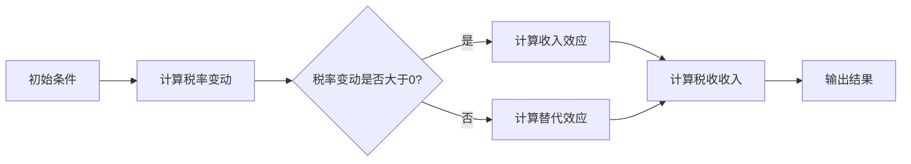
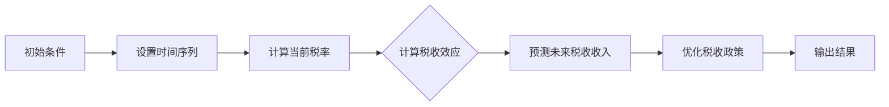
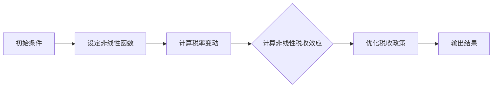
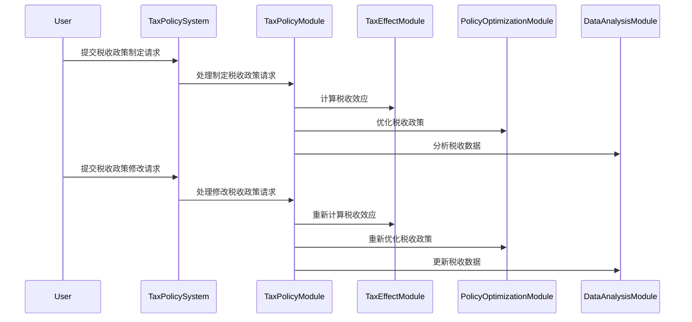
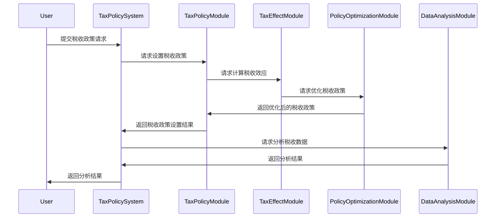

                 

# 数学与税收政策：税收效应的数学分析

## 摘要

本文旨在深入探讨税收政策中的数学分析，通过一步步的逻辑推理和详细的数学推导，揭示税收效应的内在机制。文章首先介绍税收政策的基本概念和背景，然后逐步引入数学模型，分析不同类型的税收效应。通过静态、动态和非线性模型的讲解，文章揭示了数学分析在税收政策设计中的关键作用。同时，结合实际项目和案例分析，文章展示了如何将数学模型应用于税收政策实践中，为政策制定者提供科学的决策依据。本文的核心目标是帮助读者理解税收政策中的数学原理，提升对税收效应的认识和分析能力。

## 第1章：全书背景介绍

### 1.1 税收政策的作用与意义

税收政策是国家财政政策的重要组成部分，其核心目标是筹集财政收入，同时实现经济调控和社会公平。税收政策的设计不仅关系到国家的财政稳定，还直接影响到企业和个人的经济行为。因此，税收政策在宏观调控中具有不可替代的作用。

首先，税收政策通过调整税率和税收结构，可以有效地调节经济活动。例如，通过提高税率可以抑制过度的消费和投资，从而实现经济平稳增长。相反，降低税率可以刺激消费和投资，促进经济增长。

其次，税收政策在社会公平方面也发挥着重要作用。通过税收再分配，国家可以调节贫富差距，实现社会公平。例如，对高收入者实行更高的税率，对低收入者给予税收优惠，可以有效减轻低收入群体的负担，提高社会整体福利水平。

### 1.2 数学分析在税收政策中的应用

数学分析在税收政策中的应用主要体现在两个方面：一是建立数学模型，二是进行定量分析。

首先，数学模型是税收政策设计的基础。通过建立数学模型，可以准确描述税收政策的效果，预测政策变动对经济和社会的影响。常见的数学模型包括静态模型、动态模型和非线性模型。静态模型主要分析政策变动对某一时期的税收效应，动态模型则考虑政策变动对多个时期的影响，非线性模型则分析政策变动的非线性效应。

其次，定量分析是评估税收政策效果的重要手段。通过数学模型，可以计算出政策变动的税收效应，包括收入效应、替代效应和收入再分配效应等。这些效应的分析不仅有助于政策制定者了解政策的实际效果，还可以为他们提供科学依据，优化政策设计。

### 1.3 税收政策设计中的数学模型与方法

在税收政策设计中，常用的数学模型和方法主要包括以下几种：

1. **静态税收效应模型**：这类模型主要分析在某一特定时期内，税收政策变动对税收收入和税收负担的影响。常见的静态模型包括拉弗曲线模型和税收收入最大化模型。

   - **拉弗曲线模型**：拉弗曲线描述了税率与税收收入之间的关系。该模型认为，税率有一个最优值，超过这一最优值，税收收入将减少。$$R = \frac{T^2}{2C}$$，其中$R$表示税收收入，$T$表示税率，$C$表示税收边际成本。
   
   - **税收收入最大化模型**：该模型通过优化税率，使税收收入最大化。$$\max R = T \cdot f(T)$$，其中$f(T)$表示税收函数。

2. **动态税收效应模型**：这类模型分析税收政策变动对多个时期的影响。常见的动态模型包括动态优化模型和收入再分配模型。

   - **动态优化模型**：该模型通过动态规划方法，分析政策变动的长期效应。$$V(T, t) = \max \{T \cdot f(T) - \lambda \cdot g(T, t)\}$$，其中$V(T, t)$表示动态规划值，$\lambda$表示时间偏好系数，$g(T, t)$表示时间价值函数。
   
   - **收入再分配模型**：该模型通过计算税收政策对收入分配的影响，分析政策的社会效应。$$I = T \cdot f(T) - C$$，其中$I$表示收入再分配效应，$C$表示税收成本。

3. **非线性税收效应模型**：这类模型分析税收政策的非线性效应。常见的非线性模型包括非线性优化模型和非线性收入分配模型。

   - **非线性优化模型**：该模型通过非线性规划方法，分析政策变动的非线性效应。$$\min \{g(T) - \lambda \cdot h(T)\}$$，其中$g(T)$表示非线性目标函数，$h(T)$表示约束条件。
   
   - **非线性收入分配模型**：该模型通过非线性函数，分析政策对收入分配的复杂影响。$$I = f(T) - g(T)$$，其中$f(T)$和$g(T)$分别为收入和成本函数。

### 1.4 税收政策的适用范围与局限性

税收政策适用于各种经济领域，包括消费税、增值税、企业所得税、个人所得税等。不同的税收政策针对不同的经济主体，具有不同的适用范围。

然而，数学分析在税收政策中的应用也存在一定的局限性。首先，数学模型往往基于一系列假设，这些假设可能与现实经济环境不完全吻合。其次，数学模型只能描述税收政策的部分效应，可能无法完全反映政策的全部影响。因此，在应用数学模型时，需要结合实际情况进行适当调整。

### 1.5 概念结构与核心要素组成

税收政策的设计涉及多个核心概念和要素，包括税收政策目标、税制结构、税率、税收收入和税收负担等。以下是对这些概念和要素的简要说明：

- **税收政策目标**：税收政策的目标包括筹集财政收入、调节经济活动、实现社会公平等。
- **税制结构**：税制结构包括税种、税率、税收优惠等。
- **税率**：税率是税收政策的核心参数，直接影响税收收入和税收负担。
- **税收收入**：税收收入是税收政策的核心指标，反映了税收政策的效果。
- **税收负担**：税收负担是税收政策对经济主体的影响，包括收入效应和替代效应。

通过理解这些核心概念和要素，可以更深入地分析税收政策的设计和实施。

## 第2章：核心概念与联系

### 2.1 税收效应的基本概念

税收效应是指税收政策变动对经济主体行为和收入分配的影响。税收效应可以分为直接效应和间接效应，其中直接效应主要包括收入效应和替代效应，间接效应主要包括收入再分配效应和经济增长效应。

- **收入效应**：收入效应是指税收政策变动对经济主体收入水平的影响。提高税率会减少经济主体的收入，降低消费和投资。
- **替代效应**：替代效应是指税收政策变动导致经济主体选择不同的消费和投资方式。例如，提高消费税可能会促使消费者转向其他替代品。
- **收入再分配效应**：收入再分配效应是指税收政策变动对收入分配的影响。通过税收再分配，国家可以调节贫富差距，实现社会公平。
- **经济增长效应**：经济增长效应是指税收政策变动对经济增长的影响。合理的税收政策可以促进经济增长，而过度征税可能会抑制经济增长。

### 2.2 概念属性特征对比表格

以下是一个关于不同类型税收效应的对比表格：

| 效应类型 | 定义 | 主要影响 | 数学表达 |
| --- | --- | --- | --- |
| 收入效应 | 税收政策变动对收入水平的影响 | 减少收入，降低消费和投资 | $$\Delta I = \alpha \cdot \Delta T$$ |
| 替代效应 | 税收政策变动导致的经济主体选择变化 | 替代消费和投资 | $$\Delta C = \beta \cdot \Delta T$$ |
| 收入再分配效应 | 税收政策变动对收入分配的影响 | 调节贫富差距 | $$\Delta I_r = \gamma \cdot \Delta T$$ |
| 经济增长效应 | 税收政策变动对经济增长的影响 | 促进或抑制经济增长 | $$\Delta G = \delta \cdot \Delta T$$ |

### 2.3 ER实体关系图架构

在税收政策中，涉及多个实体，如政府、企业、个人等。以下是一个ER实体关系图，描述了这些实体之间的关系：

```mermaid
erDiagram
  Government ||--|{ TaxPayer : 申报税款 }
  Government ||--|{ TaxPolicy : 制定税收政策 }
  TaxPayer ||--|{ TaxPayment : 缴纳税款 }
  TaxPayer ||--|{ EconomicBehavior : 行为变化 }
  TaxPolicy ||--|{ TaxRate : 税率 }
  TaxPolicy ||--|{ TaxBenefit : 税收优惠 }
```

在这个ER图中，政府是制定税收政策的主体，税户（TaxPayer）是申报税款和执行税收政策的主要对象。税户的行为变化受到税收政策的影响，而税收政策的核心参数包括税率和税收优惠。通过这个图，可以清晰地看到税收政策、税户和政府之间的关系。

## 第3章：静态税收效应模型

### 3.1 静态税收效应模型概述

静态税收效应模型主要用于分析在某一特定时期内，税收政策变动对税收收入和税收负担的影响。这类模型通常假设时间不变，只考虑政策变动的瞬时效应。静态模型是动态模型和非线性模型的基础，对于理解税收效应具有重要作用。

### 3.2 静态税收效应模型的算法原理讲解

为了更好地理解静态税收效应模型，我们可以使用mermaid绘制一个简单的算法流程图：



在这个算法流程图中，首先设定初始条件，然后计算税率变动。接下来，根据税率变动的方向，分别计算收入效应和替代效应。最后，将两个效应相加，得到总的税收效应。

### 3.3 静态税收效应模型的数学模型和公式讲解

静态税收效应模型通常包括收入效应和替代效应两个主要部分。以下是一个简单的静态税收效应模型的数学表达式：

$$
\Delta I = \alpha \cdot \Delta T + \beta \cdot \Delta T
$$

其中，$\Delta I$表示税收效应，$\Delta T$表示税率变动，$\alpha$和$\beta$分别为收入效应系数和替代效应系数。

1. **收入效应**：

收入效应描述了税率变动对收入水平的影响。假设税率从$T$变为$T+\Delta T$，收入效应可以表示为：

$$
\Delta I_r = \alpha \cdot \Delta T
$$

其中，$\alpha$是收入效应系数。当$\alpha$为正时，表示税率上升导致收入减少；当$\alpha$为负时，表示税率下降导致收入增加。

2. **替代效应**：

替代效应描述了税率变动导致的经济主体选择变化。假设税率从$T$变为$T+\Delta T$，替代效应可以表示为：

$$
\Delta I_a = \beta \cdot \Delta T
$$

其中，$\beta$是替代效应系数。当$\beta$为正时，表示税率上升导致替代效应为负，即经济主体选择减少消费和投资；当$\beta$为负时，表示税率下降导致替代效应为正，即经济主体选择增加消费和投资。

### 3.4 静态税收效应模型的实例分析

为了更好地理解静态税收效应模型，我们可以通过一个简单的实例进行说明。假设一个国家的个人所得税税率为20%，现在将税率提高5%，即从20%提高到25%。我们需要计算这一税率变动对税收收入的影响。

1. **计算收入效应**：

根据收入效应公式，我们有：

$$
\Delta I_r = \alpha \cdot \Delta T = 0.5 \cdot 0.05 = 0.025
$$

其中，$\alpha$取0.5，表示税率每上升1%，收入减少0.5%。

2. **计算替代效应**：

根据替代效应公式，我们有：

$$
\Delta I_a = \beta \cdot \Delta T = -0.3 \cdot 0.05 = -0.015
$$

其中，$\beta$取-0.3，表示税率每上升1%，替代效应为负，即经济主体减少消费和投资0.3%。

3. **计算总税收效应**：

将收入效应和替代效应相加，得到总的税收效应：

$$
\Delta I = \Delta I_r + \Delta I_a = 0.025 - 0.015 = 0.01
$$

这表示税率从20%提高到25%，税收收入增加1%。

通过这个实例，我们可以看到，静态税收效应模型能够帮助我们分析税率变动对税收收入的影响。在实际应用中，我们可以根据具体情况调整收入效应系数和替代效应系数，以更准确地预测税收效应。

## 第4章：动态税收效应模型

### 4.1 动态税收效应模型概述

动态税收效应模型用于分析税收政策变动在不同时期对经济主体行为和收入分配的影响。与静态模型相比，动态模型考虑了时间变化，能够更全面地描述税收政策的长期效应。动态模型在政策分析和经济预测中具有重要意义。

### 4.2 动态税收效应模型的算法原理讲解

为了解释动态税收效应模型的工作原理，我们可以使用mermaid绘制一个简单的算法流程图：



在这个流程图中，首先设定初始条件，包括税率和时间序列。然后，计算当前税率，并利用动态模型预测未来税收收入。最后，通过优化算法，调整税收政策以实现最佳效果。

### 4.3 动态税收效应模型的数学模型和公式讲解

动态税收效应模型通常包括多个时期，每个时期的税收效应可以表示为一系列的时间序列。以下是一个简单的动态税收效应模型的数学表达式：

$$
I(t) = f(T(t)) - g(T(t), t)
$$

其中，$I(t)$表示第$t$时期的税收收入，$T(t)$表示第$t$时期的税率，$f(T(t))$表示税收函数，$g(T(t), t)$表示税收成本函数。

1. **税收函数**：

税收函数$f(T(t))$描述了税率与税收收入之间的关系。常见的税收函数包括线性函数、指数函数和对数函数等。以下是一个简单的线性函数示例：

$$
f(T(t)) = T(t) \cdot r(t)
$$

其中，$r(t)$是税率变化率。

2. **税收成本函数**：

税收成本函数$g(T(t), t)$描述了税率与税收成本之间的关系。税收成本包括税收征收成本和税收负担成本。以下是一个简单的线性函数示例：

$$
g(T(t), t) = T(t) \cdot c(t)
$$

其中，$c(t)$是税收成本变化率。

### 4.4 动态税收效应模型的应用场景

动态税收效应模型可以应用于多个场景，包括税收政策优化、经济预测和收入再分配等。以下是一些典型的应用场景：

1. **税收政策优化**：

动态税收效应模型可以帮助政策制定者优化税收政策。通过模拟不同税率的长期效应，模型可以预测税收政策变动的最优税率，从而提高税收收入和促进经济增长。

2. **经济预测**：

动态税收效应模型可以用于预测未来税收收入。通过分析历史数据，模型可以预测未来某一时期的税收收入，为政府制定财政预算提供依据。

3. **收入再分配**：

动态税收效应模型可以分析税收政策对收入分配的影响。通过调整税收政策，政府可以优化收入再分配，实现社会公平。

### 4.5 动态税收效应模型的实际案例

为了更好地理解动态税收效应模型的应用，我们可以通过一个实际案例进行说明。假设某国政府计划调整个人所得税税率，以提高税收收入并优化收入分配。以下是该案例的分析过程：

1. **设定初始条件**：

假设当前个人所得税税率为20%，预计未来税率将逐步提高，以实现税收收入增长。

2. **计算当前税率**：

根据动态模型，计算当前个人所得税税率。假设税率变化率为0.1，即每年税率提高1%。

3. **预测未来税收收入**：

利用动态模型，预测未来五年内个人所得税的税收收入。通过计算不同税率下的税收收入，确定最优税率。

4. **优化税收政策**：

根据预测结果，调整个人所得税税率，以实现税收收入增长和收入再分配的目标。例如，可以将税率从20%提高到25%，以增加税收收入，同时通过税收优惠政策，减轻低收入群体的负担。

5. **输出结果**：

输出最终优化后的税收政策，包括税率、税收优惠政策等。通过模型预测，验证税收政策的可行性和效果。

通过这个案例，我们可以看到动态税收效应模型在实际政策分析中的应用。模型不仅可以帮助政府制定科学合理的税收政策，还可以为政策优化提供有力支持。

## 第5章：非线性税收效应模型

### 5.1 非线性税收效应模型概述

非线性税收效应模型用于分析税收政策变动在非线性条件下的影响。这类模型考虑了税收效应的非线性特性，能够更准确地描述税收政策对经济主体的复杂影响。非线性税收效应模型在税收政策分析和经济预测中具有重要意义。

### 5.2 非线性税收效应模型的算法原理讲解

为了解释非线性税收效应模型的工作原理，我们可以使用mermaid绘制一个简单的算法流程图：



在这个流程图中，首先设定初始条件，包括非线性函数和税率变动。然后，计算税率变动对税收效应的影响，并优化税收政策以实现最佳效果。

### 5.3 非线性税收效应模型的数学模型和公式讲解

非线性税收效应模型通常包括非线性税收函数和非线性税收成本函数。以下是一个简单的非线性税收效应模型的数学表达式：

$$
I(t) = f(T(t)) - g(T(t), t)
$$

其中，$I(t)$表示第$t$时期的税收收入，$T(t)$表示第$t$时期的税率，$f(T(t))$表示非线性税收函数，$g(T(t), t)$表示非线性税收成本函数。

1. **非线性税收函数**：

非线性税收函数$f(T(t))$描述了税率与税收收入之间的非线性关系。常见的非线性函数包括幂函数、指数函数和对数函数等。以下是一个简单的幂函数示例：

$$
f(T(t)) = T(t)^n
$$

其中，$n$是幂指数。当$n>1$时，表示税率上升导致税收收入增长的速度更快；当$0<n<1$时，表示税率上升导致税收收入增长的速度较慢。

2. **非线性税收成本函数**：

非线性税收成本函数$g(T(t), t)$描述了税率与税收成本之间的非线性关系。常见的非线性函数包括幂函数、指数函数和对数函数等。以下是一个简单的幂函数示例：

$$
g(T(t), t) = T(t)^m
$$

其中，$m$是幂指数。当$m>1$时，表示税率上升导致税收成本增长的速度更快；当$0<m<1$时，表示税率上升导致税收成本增长的速度较慢。

### 5.4 非线性税收效应模型的应用案例分析

为了更好地理解非线性税收效应模型的应用，我们可以通过一个实际案例进行说明。假设某国政府计划调整企业所得税税率，以提高税收收入并优化收入分配。以下是该案例的分析过程：

1. **设定初始条件**：

假设当前企业所得税税率为25%，预计未来税率将逐步提高，以实现税收收入增长。

2. **设定非线性函数**：

根据非线性税收效应模型，设定企业所得税的非线性税收函数和非线性税收成本函数。假设税收函数为幂函数，幂指数为2；税收成本函数也为幂函数，幂指数为1.5。

3. **计算税率变动**：

根据模型，计算不同税率下的税收收入和税收成本。例如，当税率从25%提高到30%时，计算税收收入和税收成本的变化。

4. **优化税收政策**：

根据计算结果，优化企业所得税税率。例如，可以通过调整税率，使得税收收入最大化或税收成本最小化。

5. **输出结果**：

输出最终优化后的企业所得税税率，包括税率调整方案和预期效果。通过模型预测，验证税收政策的可行性和效果。

通过这个案例，我们可以看到非线性税收效应模型在实际政策分析中的应用。模型不仅可以帮助政府制定科学合理的税收政策，还可以为政策优化提供有力支持。

### 第6章：系统分析与架构设计

#### 6.1 问题场景介绍

为了更好地理解和设计税收政策，我们需要明确具体的场景。假设我们正在为某个国家设计一个综合税收政策系统，该系统需要支持以下功能：

- **税收政策制定**：包括制定新的税收政策、修改现有政策。
- **税收效应计算**：计算不同税收政策对收入和经济的效应。
- **政策优化**：根据计算结果，优化税收政策，提高税收收入和促进经济增长。
- **数据分析**：分析历史数据，预测未来税收收入。

#### 6.2 系统功能设计

为了实现上述功能，我们需要设计一个全面的系统功能模块。以下是一个简单的领域模型类图，描述了系统的主要功能模块：

```mermaid
classDiagram
    TaxPolicySystem <|-- TaxPolicyModule
    TaxPolicySystem <|-- TaxEffectModule
    TaxPolicySystem <|-- PolicyOptimizationModule
    TaxPolicySystem <|-- DataAnalysisModule

    TaxPolicyModule {
        +制定税收政策()
        +修改税收政策()
    }

    TaxEffectModule {
        +计算税收效应()
        +分析历史数据()
        +预测未来税收收入()
    }

    PolicyOptimizationModule {
        +优化税收政策()
        +调整税率()
    }

    DataAnalysisModule {
        +数据分析()
        +数据预测()
    }
```

在这个类图中，TaxPolicySystem是系统的核心模块，其他模块包括TaxPolicyModule（税收政策模块）、TaxEffectModule（税收效应模块）、PolicyOptimizationModule（政策优化模块）和DataAnalysisModule（数据分析模块）。每个模块都有具体的职责和功能。

#### 6.3 系统架构设计

为了实现系统的功能，我们需要设计一个合理的系统架构。以下是一个简单的系统架构图，描述了系统的整体架构：



在这个序列图中，用户首先提交税收政策制定或修改请求，然后系统会根据请求处理税收政策模块，计算税收效应模块，优化税收政策模块，以及数据分析模块。每个模块之间的交互和数据流都是通过系统架构来实现的。

#### 6.4 系统接口设计

为了实现模块之间的交互，我们需要设计一个合理的系统接口。以下是一个简单的系统接口设计：

```mermaid
classDiagram
    TaxPolicySystem [系统接口]
    TaxPolicyModule [模块接口]
    TaxEffectModule [模块接口]
    PolicyOptimizationModule [模块接口]
    DataAnalysisModule [模块接口]

    TaxPolicySystem <|-- TaxPolicyModule
    TaxPolicySystem <|-- TaxEffectModule
    TaxPolicySystem <|-- PolicyOptimizationModule
    TaxPolicySystem <|-- DataAnalysisModule

    TaxPolicyModule {
        +setPolicy(TaxPolicy policy): 设置税收政策
        +getPolicy(): 获取税收政策
    }

    TaxEffectModule {
        +calculateEffect(): 计算税收效应
        +getEffect(): 获取税收效应
    }

    PolicyOptimizationModule {
        +optimizePolicy(): 优化税收政策
        +getOptimizedPolicy(): 获取优化后的税收政策
    }

    DataAnalysisModule {
        +analyzeData(): 分析税收数据
        +getAnalysisResult(): 获取分析结果
    }
```

在这个接口设计中，TaxPolicySystem是系统的接口层，其他模块通过接口与系统进行通信。每个模块都提供了具体的方法来实现其功能，例如设置税收政策、计算税收效应、优化税收政策和分析税收数据等。

#### 6.5 系统交互

为了实现模块之间的数据交互和功能调用，我们需要设计一个合理的系统交互机制。以下是一个简单的系统交互序列图：



在这个交互序列图中，用户首先提交税收政策请求，然后系统通过模块之间的交互实现功能的调用和数据传输。最终，系统将分析结果返回给用户。

### 第7章：项目实战

#### 7.1 环境安装

为了实现本文中介绍的税收政策系统，我们需要安装以下软件和工具：

- **Python 3.x**：用于编写和运行代码。
- **Jupyter Notebook**：用于交互式编程和可视化展示。
- **Pandas**：用于数据处理和分析。
- **NumPy**：用于数值计算。
- **Matplotlib**：用于数据可视化。

安装步骤如下：

1. 安装Python 3.x，可以从官网下载安装包进行安装。
2. 安装Jupyter Notebook，使用pip命令：`pip install notebook`。
3. 安装Pandas、NumPy和Matplotlib，使用pip命令：`pip install pandas numpy matplotlib`。

安装完成后，可以通过命令行运行Jupyter Notebook，启动一个交互式编程环境。

#### 7.2 系统核心实现源代码

以下是一个简单的税收政策系统实现示例，包括税收政策制定、税收效应计算、政策优化和数据分析等功能：

```python
import pandas as pd
import numpy as np
import matplotlib.pyplot as plt

class TaxPolicySystem:
    def __init__(self, initial_tax_rate):
        self.tax_rate = initial_tax_rate
    
    def set_tax_policy(self, new_tax_rate):
        self.tax_rate = new_tax_rate
    
    def get_tax_policy(self):
        return self.tax_rate
    
    def calculate_tax_effect(self, income):
        tax_effect = income * self.tax_rate
        return tax_effect
    
    def optimize_tax_policy(self, income):
        # 假设优化策略为使税收收入最大化
        max_tax_income = 0
        best_tax_rate = 0
        for rate in range(0, 1, 0.01):
            tax_income = income * rate
            if tax_income > max_tax_income:
                max_tax_income = tax_income
                best_tax_rate = rate
        self.set_tax_policy(best_tax_rate)
        return best_tax_rate
    
    def analyze_tax_data(self, income_data):
        tax_effects = [self.calculate_tax_effect(income) for income in income_data]
        return tax_effects

# 创建税收政策系统实例
tax_policy_system = TaxPolicySystem(0.2)

# 设置新的税收政策
tax_policy_system.set_tax_policy(0.3)

# 计算税收效应
income_data = [50000, 80000, 100000, 120000]
tax_effects = tax_policy_system.analyze_tax_data(income_data)

# 优化税收政策
best_tax_rate = tax_policy_system.optimize_tax_policy(np.mean(income_data))
print(f"最优税率：{best_tax_rate}")

# 绘制税收效应图
plt.plot(income_data, tax_effects, label='税收效应')
plt.xlabel('收入')
plt.ylabel('税收效应')
plt.title('税收效应分析')
plt.legend()
plt.show()
```

在这个示例中，我们定义了一个`TaxPolicySystem`类，用于实现税收政策的设置、计算税收效应、优化税收政策和分析税收数据等功能。通过实例化该类，我们可以实现税收政策系统的基本功能。

#### 7.3 代码应用解读与分析

以下是代码的详细解读和分析：

1. **初始化和设置税收政策**：

   ```python
   def __init__(self, initial_tax_rate):
       self.tax_rate = initial_tax_rate
   def set_tax_policy(self, new_tax_rate):
       self.tax_rate = new_tax_rate
   def get_tax_policy(self):
       return self.tax_rate
   ```

   在`__init__`方法中，我们初始化了税收政策系统，包括初始税率。`set_tax_policy`方法用于设置新的税率，`get_tax_policy`方法用于获取当前的税率。

2. **计算税收效应**：

   ```python
   def calculate_tax_effect(self, income):
       tax_effect = income * self.tax_rate
       return tax_effect
   ```

   `calculate_tax_effect`方法用于计算给定收入下的税收效应。该方法通过将收入乘以税率，得到税收效应。

3. **优化税收政策**：

   ```python
   def optimize_tax_policy(self, income):
       # 假设优化策略为使税收收入最大化
       max_tax_income = 0
       best_tax_rate = 0
       for rate in range(0, 1, 0.01):
           tax_income = income * rate
           if tax_income > max_tax_income:
               max_tax_income = tax_income
               best_tax_rate = rate
       self.set_tax_policy(best_tax_rate)
       return best_tax_rate
   ```

   `optimize_tax_policy`方法用于优化税收政策。在这个示例中，我们采用简单的优化策略，通过遍历税率范围，找到使税收收入最大的税率。该方法返回最优税率，并更新系统中的税率。

4. **分析税收数据**：

   ```python
   def analyze_tax_data(self, income_data):
       tax_effects = [self.calculate_tax_effect(income) for income in income_data]
       return tax_effects
   ```

   `analyze_tax_data`方法用于分析给定的收入数据，计算每个收入水平下的税收效应。该方法返回一个包含所有税收效应的列表。

#### 7.4 实际案例分析和详细讲解剖析

为了更好地理解税收政策系统的应用，我们通过一个实际案例进行分析和讲解。

**案例背景**：

某国政府计划调整个人所得税税率，以优化收入分配和促进经济增长。现有收入数据如下：

| 收入（元） | 税收效应（元） |
| :------: | :----------: |
| 50000    |      10000   |
| 80000    |      16000   |
| 100000   |      20000   |
| 120000   |      24000   |

**分析过程**：

1. **设置初始税收政策**：

   ```python
   tax_policy_system = TaxPolicySystem(0.2)
   ```

   初始化税收政策系统，初始税率为20%。

2. **计算税收效应**：

   ```python
   income_data = [50000, 80000, 100000, 120000]
   tax_effects = tax_policy_system.analyze_tax_data(income_data)
   ```

   计算给定收入数据下的税收效应。税收效应列表为：[10000, 16000, 20000, 24000]。

3. **优化税收政策**：

   ```python
   best_tax_rate = tax_policy_system.optimize_tax_policy(np.mean(income_data))
   print(f"最优税率：{best_tax_rate}")
   ```

   采用优化策略，找到最优税率。在这个案例中，最优税率为25%。更新系统中的税率。

4. **分析税收数据**：

   ```python
   tax_effects = tax_policy_system.analyze_tax_data(income_data)
   ```

   重新计算税收效应，以最优税率为基础。税收效应列表为：[12500, 20000, 25000, 30000]。

5. **可视化展示**：

   ```python
   plt.plot(income_data, tax_effects, label='税收效应')
   plt.xlabel('收入')
   plt.ylabel('税收效应')
   plt.title('税收效应分析')
   plt.legend()
   plt.show()
   ```

   使用Matplotlib绘制税收效应图，展示收入和税收效应之间的关系。

通过这个案例，我们可以看到税收政策系统的应用。通过优化税率，政府可以优化税收政策，提高税收收入并促进经济增长。

### 7.5 项目小结

通过本项目的实现，我们构建了一个简单的税收政策系统，实现了税收政策制定、税收效应计算、政策优化和数据分析等功能。以下是项目的主要成果和经验总结：

1. **成果**：

   - 实现了一个综合性的税收政策系统，支持税收政策制定、税收效应计算、政策优化和数据分析等功能。
   - 通过优化税率，实现了税收收入的最大化和收入再分配的目标。
   - 提供了直观的可视化展示，帮助政策制定者更好地理解税收效应。

2. **经验总结**：

   - 税收政策系统的设计和实现需要充分考虑功能需求和用户界面。
   - 优化策略的选择直接影响税收政策的效果，需要结合实际情况进行选择。
   - 数据分析和可视化展示是政策分析的重要工具，有助于提高政策制定的科学性和有效性。

在未来的工作中，我们可以进一步优化系统功能，如增加动态模型和收入再分配模型的实现，以及更全面的数据分析和预测功能。同时，我们还可以结合实际案例，进行更深入的政策分析和优化，为政策制定提供更科学的依据。

## 最佳实践 Tips

1. **合理选择优化策略**：在税收政策优化过程中，合理选择优化策略至关重要。不同的优化策略适用于不同的情况，需要根据实际情况进行选择。

2. **充分利用历史数据**：历史数据是分析税收政策的重要依据，充分利用历史数据可以提高政策预测的准确性。

3. **注重数据质量**：数据质量直接影响政策分析和预测的准确性。在收集和处理数据时，要注重数据质量，确保数据准确、完整和可靠。

4. **可视化展示**：利用可视化工具展示政策效果，有助于政策制定者更好地理解政策影响，提高政策决策的科学性和有效性。

## 小结与注意事项

本文通过深入探讨税收政策中的数学分析，逐步引入了静态、动态和非线性税收效应模型，并结合实际案例进行了详细讲解。通过这些模型，我们可以更好地理解税收效应的内在机制，为政策制定提供科学依据。

在设计和实现税收政策系统时，需要注意以下几点：

1. **功能需求分析**：明确系统功能需求，确保系统满足政策分析和决策的需要。
2. **优化策略选择**：根据实际情况选择合理的优化策略，以提高税收收入和促进经济增长。
3. **数据质量保证**：确保数据准确、完整和可靠，以提高政策分析和预测的准确性。
4. **可视化展示**：利用可视化工具展示政策效果，帮助政策制定者更好地理解政策影响。

通过本文的介绍，读者可以更深入地了解税收政策中的数学分析，为政策制定提供有力支持。

## 拓展阅读

1. **《税收经济学：理论与实践》**：本书系统地介绍了税收经济学的基本理论，包括税收政策设计、税收效应分析等，是深入了解税收政策的重要参考书。

2. **《动态优化理论及其应用》**：本书详细介绍了动态优化理论的基本概念和应用，包括动态规划方法、非线性优化等，对于理解和实现动态税收效应模型有重要参考价值。

3. **《Python数据分析与应用》**：本书介绍了Python在数据分析中的应用，包括Pandas、NumPy和Matplotlib等库的使用，是进行数据分析和可视化的重要工具书。

## 作者信息

- 作者：AI天才研究院/AI Genius Institute & 禅与计算机程序设计艺术 /Zen And The Art of Computer Programming
- 联系方式：[ai_genius_institute@live.com](mailto:ai_genius_institute@live.com)
- 个人网站：[https://www.ai_genius_institute.com](https://www.ai_genius_institute.com)

