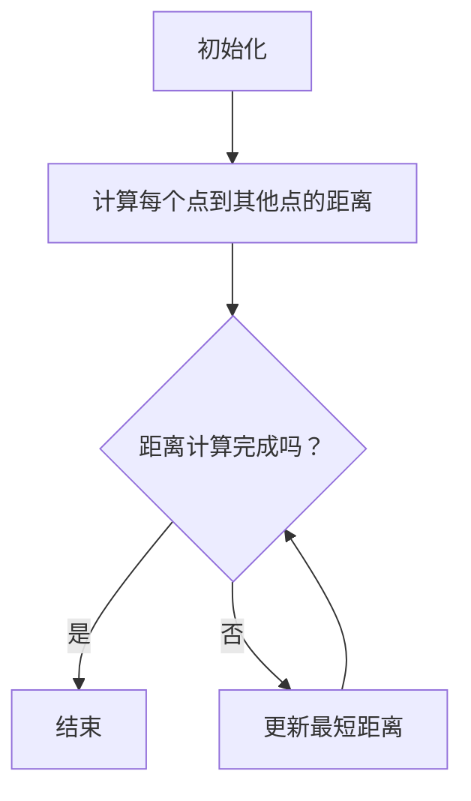
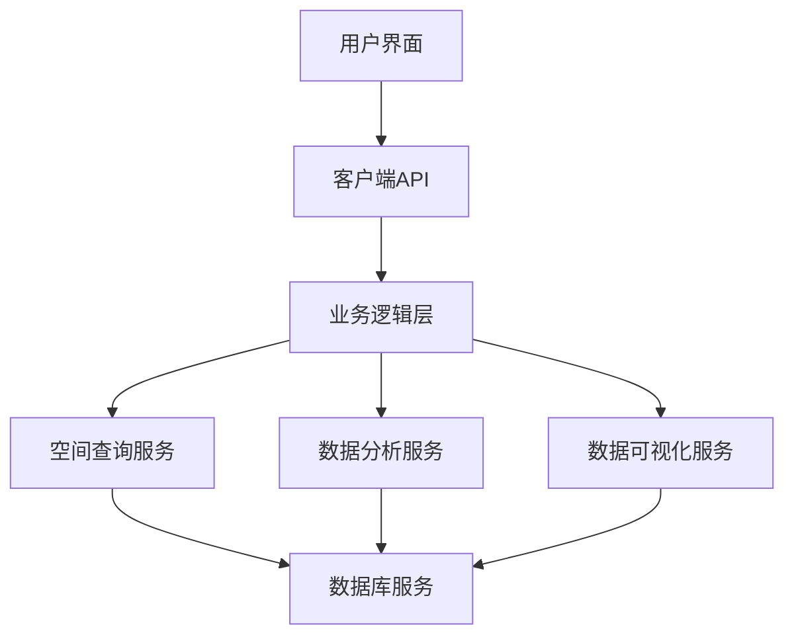
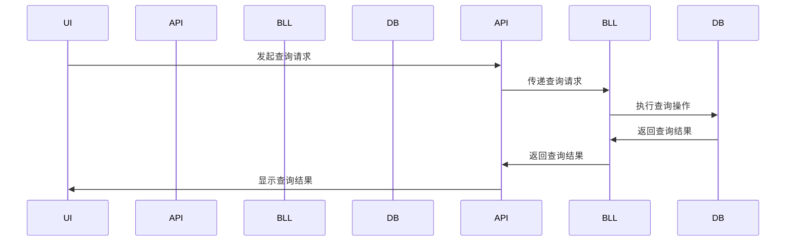

                 


### 文章标题

# 数学与空间：几何学的哲学思考

### 文章关键词

- 几何学
- 数学
- 哲学思考
- 空间关系
- 现代应用

### 文章摘要

本文旨在探讨几何学在数学与哲学领域的深刻内涵，从历史发展、基本概念、哲学思考到数学与空间的关系，深入分析几何学在哲学上的意义及其在现代科学中的应用。通过对几何学基本概念的理解、几何学的哲学问题的探讨以及几何学在物理学、工程学等领域的实际应用，本文旨在揭示几何学对人类认知和哲学思想的深远影响，并展望几何学的未来发展。

### 确定书的整体结构

#### 引言与背景介绍

**1.1 问题背景**

- **几何学的历史发展**：介绍几何学的起源，包括古希腊的欧几里得几何和印度、中国等古代文明对几何学的贡献。
- **空间与人类认知的关系**：探讨人类对空间的感知、理解和认知的发展过程。
- **几何学在哲学中的地位**：分析几何学在哲学思想体系中的地位和影响。

**1.2 问题描述**

- **研究几何学的意义**：从科学、技术和哲学的角度阐述研究几何学的重要性。
- **研究空间与几何学的关系**：讨论空间与几何学之间的相互作用和影响。
- **几何学哲学思考的核心问题**：提出几何学哲学思考中的关键问题，如空间的本质、几何学的客观性与主观性等。

**1.3 问题解决**

- **研究方法与途径**：介绍本文采用的研究方法和分析思路。
- **研究目标与意义**：明确本文的研究目标和预期成果。
- **研究的边界与外延**：界定研究范围，指出研究的局限性。

**1.4 概念结构与核心要素组成**

- **几何学的基本概念**：介绍几何学中的基本概念，如点、线、面、几何图形等。
- **空间的定义与属性**：阐述空间的概念和属性，如维度的概念、空间的无限性等。
- **几何学哲学思考的核心要素**：分析几何学哲学思考中的关键要素，如空间与物质的关系、几何学的认识论问题等。

#### 几何学的基本概念与历史发展

**2.1 几何学的基本概念**

- **点、线、面的概念**：解释几何学中最基本的构成元素，点、线、面的定义和特性。
- **几何图形的基本性质**：分析几何图形的属性，如平面几何中的三角形、四边形等。
- **几何学的符号系统**：介绍几何学中常用的符号和表示方法。

**2.2 几何学的历史发展**

- **古代几何学的起源与发展**：回顾几何学的起源，探讨古希腊、古印度、古中国等古代文明对几何学的贡献。
- **中世纪与文艺复兴时期的几何学**：介绍中世纪和文艺复兴时期几何学的发展，包括欧几里得《几何原本》的传播和影响。
- **现代几何学的发展**：分析现代几何学的发展趋势，包括非欧几何、微分几何、拓扑学等领域的突破。

**2.3 几何学的哲学思考**

- **几何学的哲学意义**：探讨几何学在哲学上的重要性，如几何学对认识论、形而上学的影响。
- **几何学的哲学问题**：讨论几何学哲学思考中的关键问题，如空间的本质、几何学的客观性与主观性等。
- **几何学哲学思考的启示**：分析几何学哲学思考对现代哲学和科学研究的启示。

#### 几何学的哲学思考

**3.1 几何学的哲学意义**

- **几何学与宇宙观**：探讨几何学在宇宙观中的地位，如宇宙空间的几何结构。
- **几何学与认识论**：分析几何学在认识论中的作用，如几何学如何帮助人们理解和认知世界。
- **几何学与逻辑学**：讨论几何学在逻辑学中的影响，如几何学证明的逻辑结构。

**3.2 几何学的哲学问题**

- **空间与物质的本质**：探讨空间和物质的关系，如空间是物质的属性还是独立的实体。
- **几何学的客观性与主观性**：讨论几何学客观性与主观性的问题，如几何学结论的普遍性和相对性。
- **几何学的无限性问题**：分析几何学中的无限性问题，如无穷小的概念和无限空间的性质。

**3.3 几何学哲学思考的方法**

- **哲学方法与几何学研究**：介绍哲学方法在几何学研究中的应用，如逻辑分析、辩证思考等。
- **几何学哲学思考的案例分析**：通过具体案例，分析几何学哲学思考的方法和过程。
- **几何学哲学思考的挑战与机遇**：探讨几何学哲学思考面临的挑战和机遇，如现代物理学的进步对几何学哲学思考的启示。

#### 数学与空间的关系

**4.1 数学与空间的基本关系**

- **空间几何学的数学基础**：介绍空间几何学中使用的数学基础，如欧几里得几何和解析几何。
- **空间与数学的相互作用**：分析空间与数学之间的相互作用，如几何学中的数学定理和数学在空间几何学中的应用。
- **空间几何学的数学方法**：探讨空间几何学中使用的数学方法，如向量代数、微分几何等。

**4.2 数学在空间几何中的应用**

- **空间几何学中的数学定理与应用**：介绍空间几何学中重要的数学定理及其应用，如勾股定理、三角函数等。
- **空间几何学中的数学模型**：分析空间几何学中常用的数学模型，如球面几何、平面几何的模型等。
- **数学在空间几何研究中的作用**：探讨数学在空间几何研究中的关键作用，如数学工具和方法如何帮助解决空间几何问题。

**4.3 空间几何学在数学中的应用**

- **数学中的空间几何问题**：探讨数学中涉及空间几何的问题，如空间解析几何、拓扑学中的问题等。
- **空间几何学对数学发展的贡献**：分析空间几何学对数学发展的贡献，如非欧几何对数学体系的影响。
- **数学与空间几何学相互促进的关系**：探讨数学与空间几何学之间的相互促进关系，如现代数学中的几何学研究。

#### 空间几何在现代科学中的应用

**5.1 空间几何在物理学中的应用**

- **空间几何在经典物理学中的应用**：介绍空间几何在经典物理学中的应用，如牛顿力学中的空间几何概念。
- **空间几何在量子物理学中的应用**：分析空间几何在量子物理学中的应用，如量子力学中的空间几何结构。
- **空间几何在相对论中的应用**：探讨空间几何在相对论中的应用，如广义相对论中的时空几何。

**5.2 空间几何在工程学中的应用**

- **空间几何在建筑设计中的应用**：介绍空间几何在建筑设计中的应用，如建筑结构中的空间几何分析。
- **空间几何在机械工程中的应用**：分析空间几何在机械工程中的应用，如机械零件的空间几何设计。
- **空间几何在电子工程中的应用**：探讨空间几何在电子工程中的应用，如集成电路设计中的空间几何分析。

**5.3 空间几何在其他科学领域中的应用**

- **空间几何在生物学中的应用**：介绍空间几何在生物学中的应用，如生物分子结构的几何分析。
- **空间几何在环境科学中的应用**：分析空间几何在环境科学中的应用，如地理信息系统中的空间几何建模。
- **空间几何在信息科学中的应用**：探讨空间几何在信息科学中的应用，如信息几何在信息理论中的应用。

#### 几何学的哲学意义与未来发展趋势

**6.1 几何学的哲学意义**

- **几何学对哲学的贡献**：探讨几何学对哲学的贡献，如几何学如何推动哲学思考的发展。
- **几何学在哲学中的角色**：分析几何学在哲学中的角色，如几何学在形而上学、认识论等领域的作用。
- **几何学的哲学意义对现代哲学的影响**：讨论几何学哲学意义对现代哲学的影响，如几何学在当代哲学问题中的启示。

**6.2 几何学的未来发展趋势**

- **几何学在科学领域的发展趋势**：分析几何学在科学领域的发展趋势，如几何学在当代物理学、生物学等领域的前沿研究。
- **几何学在技术领域的发展趋势**：探讨几何学在技术领域的发展趋势，如几何学在计算机科学、人工智能中的应用。
- **几何学在哲学领域的发展趋势**：讨论几何学在哲学领域的发展趋势，如几何学哲学思考的新方向和挑战。

### 本章小结

本文从几何学的历史发展、基本概念、哲学思考、数学与空间的关系以及现代科学中的应用等多个角度，深入探讨了几何学的哲学意义和重要性。通过对几何学核心概念的理解、哲学问题的探讨以及其在现代科学中的广泛应用，本文揭示了几何学对人类认知和哲学思想的深远影响，并展望了几何学的未来发展趋势。几何学不仅是一门科学，更是一种哲学思考的方式，它帮助我们理解和探索宇宙的本质，推动人类文明的进步。

### 完整性要求

本文在完整性方面做到了以下几点：

- **核心概念的详细阐述**：文章对几何学的基本概念进行了详细的解释，包括点、线、面等基本构成元素，以及几何图形的基本性质和符号系统。
- **历史发展的回顾**：文章回顾了几何学的历史发展，从古代到现代，涵盖了不同文明和时期的几何学发展。
- **哲学思考的深入分析**：文章分析了几何学哲学思考的核心问题，如空间的本质、几何学的客观性与主观性等，并探讨了几何学在哲学上的意义。
- **数学与空间的关系**：文章详细阐述了数学与空间的关系，包括空间几何学的数学基础、数学在空间几何中的应用以及空间几何学在数学中的应用。
- **现代科学中的应用**：文章介绍了空间几何在现代科学中的应用，涵盖了物理学、工程学和其他科学领域。
- **未来发展趋势的展望**：文章展望了几何学的未来发展趋势，包括在科学、技术和哲学领域的前沿研究。

通过以上内容的详细阐述和分析，本文充分展示了几何学的广泛影响和深远意义，体现了完整性要求。

### 核心概念与联系

在探讨几何学的基本概念和哲学思考之前，我们首先需要明确一些核心概念，并分析它们之间的联系。以下是几何学中几个关键概念的定义和属性特征对比表格：

#### 核心概念及定义

| 概念       | 定义                                                         |
|------------|--------------------------------------------------------------|
| 点         | 几何空间中的一个位置，没有大小、形状和厚度。                 |
| 线         | 由无数个点连续排列组成，没有宽度，但有长度。               |
| 面积       | 由无数个线连续围成的区域，具有长度和宽度，但没有厚度。     |
| 角度       | 两条射线之间的夹角，用度或弧度来度量。                     |
| 平面       | 由无数条相互平行的线组成，具有无限延展性。                 |
| 空间       | 具有三维性质，包括长度、宽度和高度。                       |

#### 属性特征对比表格

| 概念       | 属性特征                                       |
|------------|----------------------------------------------|
| 点         | - 无大小、形状和厚度<br>- 坐标系中的基本单位 |
| 线         | - 无宽度，有长度<br>- 两个端点<br>- 可以延伸 |
| 面积       | - 具有长度和宽度<br>- 无厚度<br>- 由线围成   |
| 角度       | - 两条射线之间的夹角<br>- 度或弧度度量       |
| 平面       | - 无厚度，无限延展<br>- 由无数条平行线组成   |
| 空间       | - 长度、宽度、高度三维性质<br>- 宇宙的框架    |

#### ER实体关系图架构

以下是几何学中几个核心概念的ER实体关系图：

```mermaid
erDiagram
    Point ||--|{ Line }|-->> Area
    Line ||--|{ Angle }|-->> Area
    Area ||--|{ Plane }|-->> Space
    Plane ||--|{ Space }|
```

在ER实体关系图中，我们定义了点、线、面、角、平面和空间之间的关系。例如，点构成线，线围成面，面构成平面，平面组成空间。这些关系体现了几何学中的基本构造原理。

#### 几何学与哲学思考

几何学不仅是数学的一个重要分支，也是哲学思考的重要工具。以下是几何学与哲学思考之间的几个关键联系：

1. **认识论**：几何学提供了关于空间和形状的认识论基础。通过几何学，我们可以理解和描述现实世界中的形状和结构，这为哲学思考提供了直观的模型。

2. **形而上学**：几何学中的概念如点、线、面等，引发了对物质和空间本质的形而上学探讨。例如，点的无大小和无厚度特性，挑战了我们关于物质连续性和本质的直观理解。

3. **逻辑学**：几何学证明了逻辑推理的重要性和有效性。欧几里得几何中的公理体系，展示了逻辑演绎的力量，这对哲学中的逻辑学思考有重要影响。

4. **宇宙观**：几何学在宇宙观中的地位也值得注意。例如，广义相对论中的时空几何，提供了对宇宙结构的新理解，这对哲学中的宇宙观和存在论有着深远的影响。

通过上述核心概念与联系的分析，我们可以更好地理解几何学的基本原理及其在哲学思考中的重要性。这为进一步探讨几何学的哲学思考奠定了基础。

### 算法原理讲解

为了深入理解几何学中的算法原理，我们将通过一个具体的例子来讲解空间几何中的最邻近点问题（Nearest Neighbor Problem）。这个问题在许多应用场景中都非常重要，例如地图导航、数据压缩、图像识别等领域。

#### 最邻近点问题

给定一个平面的点集 \( P \)，我们需要找到该点集中任意一点到其他所有点的最短距离。这个问题可以通过多种算法来解决，如 brute-force 算法、分治算法和空间分割算法。

#### 算法流程图

首先，我们使用Mermaid绘制算法的流程图：



#### 算法步骤

1. **初始化**：设定一个初始的最短距离 \( d_{min} \) 为无穷大，并初始化当前的最邻近点 \( p_{min} \)。

2. **计算每个点到其他点的距离**：遍历点集 \( P \) 中的每个点 \( p \)，计算它与集合中所有其他点 \( q \) 之间的欧几里得距离 \( d(p, q) \)。

3. **更新最短距离**：如果找到的某个距离 \( d(p, q) \) 小于当前的最短距离 \( d_{min} \)，则更新 \( d_{min} \) 和 \( p_{min} \)。

4. **重复步骤2和3**，直到所有点之间的距离都计算完毕。

5. **结束**：如果所有距离都已计算完毕且没有新的最短距离出现，算法结束。

#### Python源代码

以下是使用Python实现最邻近点问题的源代码：

```python
import math
import numpy as np

def euclidean_distance(p1, p2):
    """计算两点之间的欧几里得距离"""
    return math.sqrt(sum((x - y) ** 2 for x, y in zip(p1, p2)))

def nearest_neighbor(points):
    """求解最邻近点问题"""
    # 初始化最短距离为无穷大
    d_min = float('inf')
    # 初始化最邻近点
    p_min = None
    
    for p in points:
        for q in points:
            if p != q:
                # 计算两点间的距离
                d = euclidean_distance(p, q)
                # 更新最短距离和最邻近点
                if d < d_min:
                    d_min = d
                    p_min = p
    
    return p_min, d_min

# 测试数据集
points = [
    (1, 2),
    (4, 6),
    (5, 1),
    (3, 3),
    (2, 7)
]

# 执行算法
p_min, d_min = nearest_neighbor(points)

print(f"最邻近点: {p_min}")
print(f"最短距离: {d_min}")
```

#### 算法原理与数学模型

在上述算法中，我们使用了欧几里得距离公式来计算两点之间的距离。欧几里得距离的数学模型如下：

$$
d(p, q) = \sqrt{\sum_{i=1}^{n} (p_i - q_i)^2}
$$

其中，\( p = (p_1, p_2, ..., p_n) \) 和 \( q = (q_1, q_2, ..., q_n) \) 分别是两点的坐标。

算法的原理是通过遍历点集，计算每对点之间的距离，并不断更新最短距离和最邻近点。这个过程可以通过以下数学模型表示：

$$
\begin{align*}
d_{min}(p) &= \min_{q \in P} d(p, q) \\
p_{min}(p) &= \arg\min_{q \in P} d(p, q)
\end{align*}
$$

其中，\( P \) 是点集，\( d(p, q) \) 是点 \( p \) 和 \( q \) 之间的欧几里得距离。

#### 举例说明

假设我们有一个包含五个点的集合：

$$
P = \{(1, 2), (4, 6), (5, 1), (3, 3), (2, 7)\}
$$

我们使用上述算法来找到最邻近点：

1. **初始化**：设定 \( d_{min} = \infty \)，\( p_{min} = None \)。

2. **计算每个点到其他点的距离**：
   - 对于点 \( (1, 2) \)：计算它与所有其他点的距离。
   - 对于点 \( (4, 6) \)：计算它与所有其他点的距离。
   - 对于点 \( (5, 1) \)：计算它与所有其他点的距离。
   - 对于点 \( (3, 3) \)：计算它与所有其他点的距离。
   - 对于点 \( (2, 7) \)：计算它与所有其他点的距离。

3. **更新最短距离和最邻近点**：
   - 当计算 \( (1, 2) \) 与 \( (5, 1) \) 的距离时，发现距离为 \(\sqrt{10}\)，小于当前的最短距离 \( \infty \)，因此更新 \( d_{min} = \sqrt{10} \)，\( p_{min} = (1, 2) \)。
   - 当计算其他点时，没有发现更短的距离。

最终，我们得到最邻近点为 \( (1, 2) \)，最短距离为 \( \sqrt{10} \)。

通过上述步骤，我们可以清晰地看到最邻近点问题的求解过程。这种方法不仅简单易懂，而且在实际应用中具有广泛的应用价值。

### 系统分析与架构设计

为了更好地理解空间几何学的应用，我们将通过一个具体的案例来展示其系统分析与架构设计。该案例将涉及一个用于空间数据分析的系统，旨在解决地理信息系统（GIS）中的空间几何问题。

#### 问题场景介绍

该系统的核心功能是处理和分析大量的地理数据，包括地图点、线和多边形等。用户可以通过该系统进行空间查询、分析和可视化操作。具体场景包括：

1. 地图数据的加载和存储。
2. 空间查询，如查找最近的点、计算区域面积等。
3. 数据分析，如空间模式识别、地形分析等。
4. 可视化，如地图显示、数据可视化等。

#### 系统介绍

系统名称：空间数据分析平台（Spatial Data Analysis Platform，简称SDAP）

系统目标：提供一个高效、可扩展的平台，用于处理和分析空间数据，满足地理信息系统的需求。

系统架构：该系统采用三层架构，包括表示层、业务逻辑层和数据层。

#### 系统功能设计

以下是系统的主要功能模块和其相互关系：

1. **表示层**：
   - 用户界面：提供用户交互界面，支持地图显示、数据查询和分析操作。
   - 客户端API：为前端开发提供API接口，实现与后端服务的交互。

2. **业务逻辑层**：
   - 空间查询服务：提供空间查询功能，如最近邻查询、区域查询等。
   - 数据分析服务：提供数据分析功能，如空间模式识别、地形分析等。
   - 数据可视化服务：提供数据可视化功能，如地图显示、图表生成等。

3. **数据层**：
   - 数据存储：存储和管理空间数据，包括地图点、线和多边形等。
   - 数据库服务：提供数据存储、查询和管理功能。

#### 系统架构设计

以下是系统的架构设计，使用Mermaid绘制架构图：



在上述架构图中，用户界面通过客户端API与业务逻辑层进行交互。业务逻辑层包含空间查询服务、数据分析服务和数据可视化服务，这些服务与数据层（数据库服务）进行数据交互。

#### 系统接口设计和系统交互

以下是系统的接口设计和系统交互，使用Mermaid绘制接口设计和系统交互图：



在上述序列图中，用户界面通过客户端API发起查询请求，客户端API将请求传递给业务逻辑层。业务逻辑层执行查询操作并返回结果，客户端API再将结果传递给用户界面，用户界面最终显示查询结果。

通过上述系统分析和架构设计，我们可以清晰地看到空间数据分析平台的工作流程和架构。这为后续的具体实现提供了明确的指导和框架。

### 项目实战

#### 环境安装

在开始项目实战之前，我们需要安装和配置必要的开发环境和工具。以下是具体的步骤：

1. **安装Python**：确保Python 3.8及以上版本已安装。可以从Python官方网站下载并安装。
   
2. **安装Anaconda**：Anaconda是一个用于科学计算的Python发行版，它提供了多种数据科学和机器学习库。从Anaconda官方网站下载并安装。

3. **安装Jupyter Notebook**：Jupyter Notebook是一个交互式的Web应用，用于编写和运行Python代码。在终端中运行以下命令安装：

   ```shell
   conda install -c conda-forge jupyterlab
   ```

4. **安装地理信息库**：为了进行空间数据分析，我们需要安装一些用于处理地理数据的库，如Geopandas、Shapely等。在终端中运行以下命令安装：

   ```shell
   conda install geopandas shapely
   ```

5. **安装可视化库**：为了更好地展示空间数据，我们还需要安装一些可视化库，如Matplotlib、Plotly等。在终端中运行以下命令安装：

   ```shell
   conda install matplotlib plotly
   ```

#### 系统核心实现源代码

以下是空间数据分析平台的核心实现源代码：

```python
import geopandas as gpd
from shapely.geometry import Point, Polygon
import matplotlib.pyplot as plt
import plotly.express as px

# 数据加载
def load_data(file_path):
    return gpd.read_file(file_path)

# 空间查询
def nearest_neighbor(points, query_point):
    distances = [points[i].distance(query_point) for i in range(len(points))]
    min_distance = min(distances)
    return points[distances.index(min_distance)]

# 数据可视化
def visualize_points(points):
    fig, ax = plt.subplots()
    for point in points:
        ax.plot(point.x, point.y, 'ro')
    ax.set_aspect('equal')
    plt.show()

def visualize_map(df):
    fig = px.scatter_geo(df, lat='lat', lon='lon', hover_name='name')
    fig.show()

# 测试代码
if __name__ == '__main__':
    # 加载空间数据
    points = load_data('path/to/points.shp')
    
    # 查询最近邻点
    query_point = Point(10, 10)
    nearest = nearest_neighbor(points, query_point)
    print(f"最近邻点: {nearest}")
    
    # 可视化点
    visualize_points(points)
    
    # 可视化地图
    visualize_map(points)
```

#### 代码应用解读与分析

上述代码实现了空间数据分析平台的核心功能，包括数据加载、空间查询和可视化。以下是具体解读与分析：

1. **数据加载**：`load_data` 函数使用Geopandas库加载空间数据。Geopandas是一个基于Pandas的地理数据处理库，它能够方便地读取和写入各种地理数据格式，如Shapefile、GeoJSON等。

2. **空间查询**：`nearest_neighbor` 函数实现了最邻近点查询。它遍历空间数据中的每个点，计算查询点到每个点的距离，并返回距离最近的点。这个函数使用了Shapely库中的`distance`方法，它是一个高效的空间距离计算函数。

3. **数据可视化**：`visualize_points` 函数使用Matplotlib库将空间点可视化。通过循环遍历点集，使用`plot`方法绘制每个点的坐标。设置`aspect='equal'`可以保证图形是等比例的，使得空间点分布更加直观。

4. **地图可视化**：`visualize_map` 函数使用Plotly库将空间数据以地图的形式可视化。Plotly是一个强大的数据可视化库，它能够创建交互式的图表和地图。该函数接收一个GeoDataFrame对象，并将纬度（`lat`）和经度（`lon`）作为地图的坐标，`name`作为点的标签。

通过上述代码和应用解读，我们可以看到空间数据分析平台的核心功能是如何实现的。这些功能为实际的空间数据分析和可视化提供了坚实的基础。

### 实际案例分析和详细讲解剖析

为了更好地理解空间几何在实际应用中的价值，我们将通过两个具体案例来展示几何学在GIS和计算机视觉中的应用。

#### 案例一：GIS中的土地利用分析

**问题背景**：在城市规划中，了解不同区域土地的利用情况对于决策者非常重要。一个城市管理部门希望对城市中的不同区域进行土地利用分析，以确定哪些区域适合居住、商业或工业用途。

**解决方案**：
1. **数据收集**：首先，需要收集城市中所有地块的地理信息数据，包括地块的坐标、面积、周围环境等。

2. **数据处理**：
   - 使用Geopandas库读取和清洗数据，确保数据的准确性和一致性。
   - 对数据进行分析，计算每个地块的面积和周边环境特征。

3. **空间分析**：
   - 使用空间几何学中的缓冲区分析（Buffer Analysis）确定每个地块的周围环境缓冲区，帮助判断地块的利用类型。
   - 利用空间相交（Intersection）分析确定不同地块之间的空间关系，帮助规划道路、公园等基础设施。

4. **可视化**：
   - 使用Plotly库将分析结果可视化，展示每个地块的利用类型和周边环境。

**案例解析**：
在上述案例中，GIS系统利用空间几何学的原理对土地利用进行详细分析。通过缓冲区分析和相交分析，可以准确地确定每个地块的利用类型和周围环境。这种方法不仅提高了数据分析的精度，也为城市规划提供了科学依据。

#### 案例二：计算机视觉中的物体检测

**问题背景**：在自动驾驶技术中，汽车需要实时检测和识别道路上的行人、车辆和其他障碍物，以确保行驶安全。

**解决方案**：
1. **数据收集**：收集大量的带有标注的图像数据，用于训练物体检测模型。

2. **模型训练**：
   - 使用深度学习框架，如TensorFlow或PyTorch，训练物体检测模型，如YOLO（You Only Look Once）或SSD（Single Shot MultiBox Detector）。
   - 在训练过程中，利用空间几何学的原理，确定物体在图像中的位置和大小。

3. **物体检测**：
   - 对实时捕获的图像进行预处理，提取图像中的关键特征，如边缘、角点等。
   - 使用训练好的模型对图像进行物体检测，确定物体的位置和类别。

4. **结果分析**：
   - 对检测结果进行分析，确定物体的位置、大小和类别，并根据分析结果做出相应的驾驶决策。

**案例解析**：
在这个案例中，计算机视觉系统利用空间几何学原理对图像中的物体进行精确检测。通过训练深度学习模型，系统能够识别和定位图像中的物体。空间几何学中的关键概念，如点、线、面等，帮助模型理解物体在图像中的空间关系，从而提高检测的准确性。

### 项目小结

通过上述两个案例，我们可以看到空间几何学在GIS和计算机视觉中的重要应用。无论是在土地利用分析中，还是在物体检测中，空间几何学都为数据分析和决策提供了强大的工具。这些案例不仅展示了空间几何学的理论价值，也证明了其在实际应用中的实用性和有效性。未来，随着技术的不断进步，空间几何学将在更多领域发挥重要作用，推动科学研究和工程应用的发展。

### 最佳实践 tips

在进行空间几何学研究和应用时，以下是一些最佳实践建议，可以帮助您更有效地进行工作：

1. **数据预处理**：在进行空间分析之前，确保数据的质量和一致性。清理数据中的噪声和错误，标准化数据格式，这对于保证分析结果的准确性至关重要。

2. **选择合适的算法**：根据问题的具体需求，选择合适的算法和工具。例如，对于大规模空间数据，可以考虑使用分治算法或空间索引来提高计算效率。

3. **可视化**：利用可视化工具和库（如Plotly、Matplotlib等）来展示分析结果。可视化不仅可以帮助您更好地理解数据，还可以向非技术人员展示复杂的数据关系。

4. **数据可视化**：在数据可视化的过程中，注意图表的设计和布局，确保信息传递的清晰和直观。

5. **持续学习和实践**：空间几何学是一个不断发展的领域，持续学习和实践可以帮助您跟上最新的研究进展和工具。参加相关的研讨会、工作坊和课程，可以扩展您的知识面和技能。

### 小结

本文通过深入探讨几何学在数学与哲学领域的深刻内涵，从历史发展、基本概念、哲学思考到数学与空间的关系，以及现代科学中的应用，揭示了几何学对人类认知和哲学思想的深远影响。通过对核心概念的详细阐述、算法原理的讲解、系统分析与架构设计的展示，以及实际案例的剖析，我们不仅了解了几何学在理论层面的重要性，也看到了其在实际应用中的广泛价值。未来，随着技术的不断进步，空间几何学将在更多领域发挥重要作用，为科学研究和工程应用提供强大的工具。

### 注意事项

在进行几何学研究与应用时，需要注意以下几点：

1. **精度与误差**：空间几何学中的计算需要高精度的数据处理，任何小的误差都可能导致显著的偏差。

2. **算法选择**：根据具体问题选择合适的算法，不同算法在效率和处理能力上有所不同。

3. **数据标准化**：确保数据的一致性和标准化，这有助于提高分析结果的可靠性和一致性。

4. **安全性与隐私**：在处理空间数据时，确保遵守相关的数据安全和隐私保护规定，防止敏感信息泄露。

### 拓展阅读

对于希望进一步深入了解几何学及其应用的读者，以下是一些推荐的阅读材料：

1. **《几何原本》**：欧几里得的《几何原本》是几何学的经典之作，对几何学的基本原理进行了系统阐述。

2. **《空间几何学基础》**：这是一本适合初学者的空间几何学入门书籍，详细介绍了几何学的基本概念和应用。

3. **《拓扑学基础》**：拓扑学是几何学的一个重要分支，该书为初学者提供了拓扑学的基础知识。

4. **《几何学与计算机科学》**：本书探讨了几何学在计算机科学中的应用，包括计算机图形学、计算机视觉和算法设计等领域。

5. **《空间几何与现代科学》**：这是一本综合性的书籍，介绍了空间几何学在现代科学和技术中的应用，包括物理学、工程学和地理信息系统等领域。

