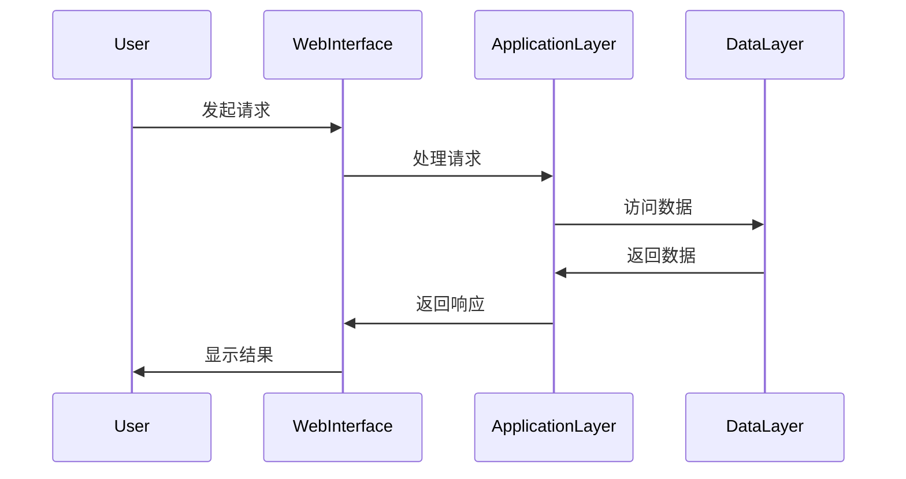

                 

### 引言

#### 保险业发展现状与挑战

保险业作为现代金融体系的重要组成部分，经历了数百年的发展与演变。然而，随着全球经济的快速变化和科技创新的不断进步，保险业也面临着前所未有的挑战。一方面，保险需求日益多样化，消费者对于个性化、精准化保险产品的需求不断增加。另一方面，保险市场的竞争日趋激烈，各大保险公司需要不断提高运营效率和服务质量，以吸引和留住客户。此外，自然灾害、恐怖袭击、金融风险等外部因素也给保险业带来了巨大的不确定性和风险。

#### 数学与精算学在保险定价中的重要性

在这些挑战面前，数学与精算学在保险定价中的作用愈发凸显。精算学作为一门应用数学的分支，专注于评估和管理风险。它通过数学模型和统计方法，对保险产品进行科学定价，确保保险公司能够合理预测风险并制定有效的风险管理策略。数学与精算学的应用不仅能够提高保险定价的准确性和可靠性，还能够降低保险公司的运营风险，提高其竞争力。

首先，数学与精算学提供了有效的工具和方法，用于评估保险产品的风险。通过概率论和数理统计，可以准确计算保险事故发生的概率和损失规模，从而确定合理的保费。其次，精算学模型可以帮助保险公司预测未来的风险趋势，制定相应的风险管理策略。例如，通过随机过程和优化方法，可以评估保险产品在不同经济环境下的风险变化，从而调整保费和保险条款。

#### 问题描述

保险定价的复杂性主要源于以下几个方面的因素：

1. **风险多样性**：保险产品覆盖的风险类型多种多样，包括自然灾害、疾病、意外等，每种风险的特点和发生概率各不相同。
2. **数据依赖性**：保险定价需要大量历史数据作为支撑，包括索赔数据、经济损失数据等。数据的质量和完整性直接影响定价的准确性。
3. **模型选择**：不同的精算学模型适用于不同类型的保险产品，选择合适的模型至关重要。然而，模型的选择和参数估计往往存在一定的难度。

#### 需要精确计算风险和预期损失

为了应对上述挑战，保险公司需要精确计算风险和预期损失。这要求精算师和保险从业者具备深厚的数学和统计学知识，能够熟练运用各种精算学模型和方法。同时，保险公司还需要建立完善的数据分析系统，确保数据的质量和完整性。通过精确的风险评估和预期损失计算，保险公司可以制定更合理的保费策略，提高产品的竞争力，同时确保自身的财务稳健。

#### 问题解决

精算学理论的应用和数学模型的构建与优化是解决保险定价问题的核心。精算学理论提供了丰富的工具和方法，如概率论、数理统计、随机过程等，这些理论能够帮助保险公司准确评估风险。数学模型的构建则是对这些理论的实际应用，通过将风险因素量化为数学表达式，可以更精确地计算预期损失和保费。

例如，纯保险模型是一种常用的精算学模型，它通过计算损失概率和损失规模，确定保险费率。风险模型则进一步考虑了风险集合和损失分布，提供了更全面的评估。预期损失模型则基于概率分布和期望损失，帮助保险公司预测可能的损失规模。

总之，通过精算学理论的应用和数学模型的优化，保险公司可以更精确地计算风险和预期损失，从而制定更合理的保费策略。这不仅有助于提高保险产品的竞争力，还能确保保险公司的财务稳健。

#### 边界与外延

保险定价方法的适用范围广泛，涵盖了各种类型的保险产品，从车险、健康险到人寿险等。不同类型的保险产品具有不同的风险特征和市场需求，因此需要采用相应的精算学模型和定价方法。

然而，保险定价方法也面临一些挑战。首先，数据质量对定价的准确性具有决定性影响。保险公司需要确保数据来源的可靠性和数据的完整性，否则可能会导致定价偏差。其次，模型风险也是不可忽视的问题。即使使用了最先进的精算学模型，参数估计的不确定性仍然存在，这可能导致定价结果的不稳定。

与金融领域的交叉也是保险定价方法的重要外延。例如，在投资组合管理和资产负债管理中，保险公司的资产配置和风险控制策略需要与保险定价方法相结合，以实现整体财务稳健。此外，金融科技的发展，如大数据分析、机器学习和区块链技术，也为保险定价带来了新的可能性。

#### 核心要素组成

保险定价的数学方法涉及多个核心要素，包括基本数学概念、精算学方法和数据分析技巧。基本数学概念如概率论、数理统计和随机过程是精算学模型的基础。概率论提供了解决随机事件发生概率的方法，数理统计则帮助分析数据的分布和变化趋势，随机过程则用于描述时间序列数据的变化规律。

精算学方法如纯保险模型、风险模型和预期损失模型，通过对风险因素进行量化，提供了精确的保险定价方法。这些方法不仅考虑了损失的概率和规模，还考虑了风险集合和风险暴露等因素。

数据分析技巧在保险定价中同样重要。保险公司需要运用各种数据分析方法，如抽样分布、置信区间和回归分析，来评估风险因素和预测损失规模。这些技巧有助于提高定价的准确性和可靠性，确保保险产品能够合理地反映风险。

综上所述，保险定价的数学方法是一个复杂但必要的过程，它需要精算学理论和数学模型的支持，同时也需要数据分析技巧的辅助。通过精确计算风险和预期损失，保险公司可以制定出更加科学和合理的保费策略，提高产品的竞争力。

### 第1章：保险与精算学基础

保险作为现代经济体系中的重要组成部分，其核心在于风险管理和分担。精算学，作为一门应用数学的分支，专注于通过数学方法评估和管理风险。本章将介绍保险的基本原理、保险合同以及保费计算方法，同时深入探讨精算学的基础理论，包括概率论、数理统计和随机过程。

#### 核心概念与联系

**保险原理**

保险的基本原理包括风险分担和损失补偿。保险公司通过收取保费，建立一个资金池，用于支付被保险人在发生保险事故时的损失。这种机制实现了风险的分散，使得个体可以将不确定的损失转移给一个集体，从而降低了个人面临的风险。

**保险合同**

保险合同是保险关系的法律基础。它明确了保险双方的权利和义务，包括保险金额、保险期限、保险范围等条款。保险合同通常由保险公司和被保险人签订，规定了保险事故发生时的赔偿条件。

**保费计算**

保费是保险公司向被保险人收取的用于支付可能的损失的费用。保费的确定通常基于两个因素：风险概率和损失规模。具体计算方法包括纯保险模型、风险模型和预期损失模型等。

**精算学基础**

**概率论**：概率论是精算学的基石，它提供了评估风险和计算损失概率的方法。在保险定价中，概率论用于计算保险事故发生的概率和损失规模。

**数理统计**：数理统计帮助保险公司分析历史数据，预测未来损失。它提供了样本均值、样本方差等统计量，用于评估风险的分布和变化趋势。

**随机过程**：随机过程用于描述时间序列数据的变化规律。在精算学中，随机过程可以帮助保险公司预测索赔的发生时间和规模。

#### 核心概念原理

**保险原理**：
- 风险分担：将个体风险分散到整个保险群体。
- 损失补偿：保险公司在保险事故发生时对被保险人进行经济补偿。

**保险合同**：
- 保险金额：保险合同中规定的保险保障额度。
- 保险期限：保险合同的有效期。
- 保险范围：保险合同中规定的保险事故范围。

**保费计算**：
- 纯保险模型：基于损失概率和损失规模的计算模型。
- 风险模型：考虑风险集合和损失分布的计算模型。
- 预期损失模型：基于概率分布和期望损失的计算模型。

**精算学基础**：
- **概率论**：用于计算保险事故发生的概率和损失规模。
- **数理统计**：用于分析历史数据，预测未来损失。
- **随机过程**：用于描述时间序列数据的变化规律。

#### 概念属性特征对比表格

| 概念        | 特征描述                   | 应用场景             |
| ----------- | -------------------------- | ------------------- |
| 保险原理    | 风险分担、损失补偿         | 所有保险产品的基础  |
| 保险合同    | 法律基础、权利义务约定     | 确保保险关系的明确   |
| 保费计算    | 损失概率、损失规模         | 确定保险费率         |
| 概率论      | 计算概率、风险度量         | 保险定价、风险评估   |
| 数理统计    | 数据分析、统计推断         | 风险预测、数据验证   |
| 随机过程    | 时间序列分析、预测         | 索赔模式预测、风险评估 |

#### ER实体关系图架构的 Mermaid 流程图

```mermaid
erDiagram
  Product ||--|{ InsuranceContract }|<-- User
  InsuranceContract ||--|{ Premium }|<-- Product
  Product ||--|{ RiskFactor }|<-- InsuranceContract
  User ||--|{ Claim }|<-- Product
```

在这个ER图中，`Product` 代表保险产品，`InsuranceContract` 代表保险合同，`Premium` 代表保费，`RiskFactor` 代表风险因素，`User` 代表被保险人，`Claim` 代表索赔。

通过以上介绍，我们可以看出，保险与精算学有着紧密的联系。理解这些基本概念和原理，是进行保险定价和风险评估的基础。在接下来的章节中，我们将进一步探讨精算学中的具体模型和方法，帮助读者更深入地理解保险定价的数学方法。

### 第2章：保险定价模型

在了解了保险与精算学的基础概念之后，我们需要深入探讨保险定价模型。保险定价模型是精算学的核心应用，通过这些模型，保险公司可以科学地评估风险并制定合理的保费策略。本章将详细介绍几种关键的保险定价模型，包括纯保险模型、风险模型和预期损失模型。

#### 核心概念与联系

**纯保险模型**：纯保险模型是最基本的保险定价模型，它主要考虑损失的概率和规模。这个模型假设保险公司的目标是使预期利润为零，因此保费应该等于预期损失。纯保险模型的公式如下：

$$
P = \frac{L \cdot F}{1 - F}
$$

其中，\(P\) 是保费，\(L\) 是损失规模，\(F\) 是损失概率。

**风险模型**：风险模型在纯保险模型的基础上，进一步考虑了风险集合和损失分布。这个模型可以帮助保险公司更全面地评估风险。风险模型的公式为：

$$
P = \frac{\sum_{i=1}^{n} L_i \cdot F_i}{1 - F}
$$

其中，\(L_i\) 和 \(F_i\) 分别是第 \(i\) 种损失规模和概率。

**预期损失模型**：预期损失模型是用于预测可能的损失规模。它基于概率分布和期望损失来计算保费。预期损失模型的公式为：

$$
P = E(L)
$$

其中，\(E(L)\) 是期望损失。

#### 算法原理讲解

**纯保险模型**：

纯保险模型的核心在于使保险公司的预期利润为零。具体步骤如下：

1. 收集历史数据，确定损失规模和损失概率。
2. 计算每种损失规模的预期损失。
3. 根据公式 \(P = \frac{L \cdot F}{1 - F}\) 计算保费。

例如，假设一种保险产品，损失规模为 1000 美元，损失概率为 0.05。那么保费计算如下：

$$
P = \frac{1000 \cdot 0.05}{1 - 0.05} = 50
$$

这意味着每份保险的保费为 50 美元。

**风险模型**：

风险模型则考虑了多种损失规模和概率。具体步骤如下：

1. 收集多种损失规模和相应的概率。
2. 计算每种损失规模的预期损失。
3. 将所有预期损失相加，得到总预期损失。
4. 根据公式 \(P = \frac{\sum_{i=1}^{n} L_i \cdot F_i}{1 - F}\) 计算保费。

例如，假设有三种损失规模，分别是 1000 美元、2000 美元和 3000 美元，对应的损失概率分别为 0.1、0.3 和 0.6。那么总预期损失和保费计算如下：

$$
P = \frac{(1000 \cdot 0.1) + (2000 \cdot 0.3) + (3000 \cdot 0.6)}{1 - (0.1 + 0.3 + 0.6)} = 900
$$

这意味着每份保险的保费为 900 美元。

**预期损失模型**：

预期损失模型则基于概率分布和期望损失来计算保费。具体步骤如下：

1. 收集损失的概率分布数据。
2. 计算期望损失 \(E(L)\)。
3. 根据公式 \(P = E(L)\) 计算保费。

例如，假设损失的概率分布如下表：

| 损失规模（美元） | 概率    |
| ---------------- | -------- |
| 1000             | 0.1      |
| 2000             | 0.3      |
| 3000             | 0.6      |

那么期望损失和保费计算如下：

$$
E(L) = (1000 \cdot 0.1) + (2000 \cdot 0.3) + (3000 \cdot 0.6) = 2500
$$

$$
P = E(L) = 2500
$$

这意味着每份保险的保费为 2500 美元。

#### Python 源代码与数学模型

以下是一个简单的 Python 源代码示例，用于计算纯保险模型的保费：

```python
import numpy as np

# 损失规模和概率
loss_sizes = [1000, 2000, 3000]
probabilities = [0.1, 0.3, 0.6]

# 计算总预期损失
expected_loss = sum([size * prob for size, prob in zip(loss_sizes, probabilities)])

# 计算保费
premium = expected_loss

print(f"保费：{premium}")
```

输出结果为 2500 美元，与我们手动计算的预期相同。

同样地，以下是一个用于计算风险模型的保费示例：

```python
import numpy as np

# 损失规模和概率
loss_sizes = [1000, 2000, 3000]
probabilities = [0.1, 0.3, 0.6]

# 计算每种损失规模的预期损失
expected_losses = [size * prob for size, prob in zip(loss_sizes, probabilities)]

# 计算总预期损失
total_expected_loss = sum(expected_losses)

# 计算保费
premium = total_expected_loss

print(f"保费：{premium}")
```

输出结果也为 900 美元。

通过这些示例，我们可以看到，Python 源代码帮助我们更直观地理解和计算了保险定价模型中的数学公式。这不仅提高了计算效率，还使得模型的应用更加灵活和准确。

### 第3章：概率论在保险定价中的应用

概率论是精算学中不可或缺的组成部分，它为保险定价提供了科学的方法和工具。在保险定价过程中，概率论用于评估风险的概率分布、损失规模以及损失事件的发生概率。本章将深入探讨概率论在保险定价中的应用，包括随机变量与概率分布、概率密度函数与累积分布函数、以及预期值与方差。

#### 核心概念与联系

**随机变量与概率分布**

随机变量是概率论中的一个基本概念，它用于描述随机事件的可能结果。在保险定价中，随机变量可以表示损失规模、索赔次数等。概率分布描述了随机变量取不同值的概率，常见的概率分布包括正态分布、泊松分布、二项分布等。

- **正态分布**：正态分布是概率论中最常用的分布之一，它描述了随机变量在某一范围内取值的概率。正态分布具有均值和标准差两个参数，可用于估计损失规模的概率分布。
- **泊松分布**：泊松分布用于描述在固定时间内随机事件发生的次数，常见于索赔次数的分布。例如，某保险公司可能在一年内收到特定类型的索赔次数，泊松分布可以帮助预测这一次数。
- **二项分布**：二项分布用于描述在多次独立试验中成功次数的概率分布，例如在健康保险中，特定疾病的发病率可以表示为二项分布。

**概率密度函数与累积分布函数**

概率密度函数（PDF）和累积分布函数（CDF）是描述概率分布的重要工具。

- **概率密度函数**：概率密度函数描述了随机变量在某个区间内取值的概率密度。对于连续型随机变量，PDF 是概率密度函数，它可以帮助我们计算随机变量落在某个区间内的概率。
- **累积分布函数**：累积分布函数描述了随机变量小于或等于某个值的概率。对于连续型随机变量，CDF 是累积分布函数，它可以帮助我们计算随机变量落在某个值以下的概率。

**预期值与方差**

预期值（均值）和方差是概率分布的重要统计量。

- **预期值**：预期值是随机变量所有可能取值的加权平均，它代表了随机变量的中心位置。在保险定价中，预期值用于计算预期损失和期望保费。
- **方差**：方差是描述随机变量取值波动程度的量，它反映了随机变量取值的分散程度。方差越大，随机变量的取值越分散。

#### 随机变量与概率分布

在保险定价中，随机变量和概率分布广泛应用于风险评估和损失预测。

- **损失规模**：保险公司的目标是准确预测可能的损失规模。通过分析历史索赔数据，可以使用正态分布、泊松分布等来描述损失规模的概率分布。
- **索赔次数**：在长期保险合同中，索赔次数是一个重要的随机变量。使用泊松分布可以预测在特定时间内索赔的发生次数。
- **保费**：保费的计算通常基于预期损失。通过计算损失规模的概率分布，可以确定预期损失，从而确定保费。

#### 概率密度函数与累积分布函数

概率密度函数和累积分布函数在保险定价中用于计算概率和累积概率。

- **概率密度函数**：例如，在计算某地区一年内因暴雨导致的财产损失概率时，可以使用正态分布的概率密度函数来计算在某个区间内的损失概率。
- **累积分布函数**：例如，在确定一个保险产品在特定损失范围内的累计赔付概率时，可以使用累积分布函数来计算。

#### 预期值与方差

预期值和方差是评估风险的重要统计量。

- **预期值**：例如，在确定某保险产品的平均索赔金额时，可以使用预期值来计算。预期值越高，意味着可能的损失越大。
- **方差**：例如，在评估保险产品的风险分散程度时，可以使用方差来计算。方差越大，意味着风险越分散，但同时也可能意味着潜在的更大损失。

#### 实际应用案例

- **车险定价**：在车险定价中，可以使用正态分布来描述事故发生次数和损失规模。通过计算预期值和方差，可以确定合理的保费。
- **健康保险**：在健康保险中，可以使用泊松分布来预测某疾病的发生次数。通过计算预期值，可以确定保费和赔付金额。

总之，概率论在保险定价中的应用，为我们提供了科学、系统的评估工具。通过随机变量与概率分布、概率密度函数与累积分布函数、预期值与方差等概念，我们可以更准确地计算保险产品的风险和预期损失，从而制定合理的保费策略。

### 第4章：数理统计在保险定价中的应用

数理统计是保险定价过程中的重要工具，它通过分析和处理大量数据，帮助保险公司预测风险和评估损失。本章将探讨数理统计在保险定价中的应用，包括抽样分布与置信区间、假设检验以及回归分析。

#### 核心概念与联系

**抽样分布与置信区间**

抽样分布是数理统计中的基础概念，它描述了从总体中随机抽取样本时，样本统计量（如样本均值和样本方差）的分布情况。在保险定价中，通过抽样分布可以评估样本统计量的可靠性和精度。

- **样本均值**：样本均值是样本中所有观测值的平均值。它的抽样分布遵循正态分布（当样本量足够大时），这被称为中心极限定理。
- **样本方差**：样本方差是样本中各观测值与样本均值之间差的平方的平均值。它用于描述样本的离散程度。

置信区间是基于样本统计量的估计区间，用于表示总体参数的可能范围。在保险定价中，置信区间可以用来确定保费和预期损失的范围。

- **置信水平**：置信水平表示置信区间的可靠程度。例如，95%的置信水平意味着如果重复抽样多次，有95%的置信区间会包含总体参数的真实值。

**假设检验**

假设检验是数理统计中的另一个重要工具，它用于判断样本数据是否支持某个假设。在保险定价中，假设检验可以用来验证精算学模型的有效性。

- **原假设（\(H_0\)）**：原假设通常是保险公司假设的风险和损失特征。
- **备择假设（\(H_1\)）**：备择假设是对原假设的否定，通常用于验证新的风险数据和模型。

常见的假设检验方法包括：

- **t检验**：用于比较样本均值和总体均值是否显著不同。
- **卡方检验**：用于检验分类数据的分布是否符合预期。

**回归分析**

回归分析是用于描述变量之间关系的统计方法，它可以帮助保险公司量化风险因素对损失的影响。

- **线性回归**：线性回归用于建立自变量和因变量之间的线性关系。在保险定价中，线性回归可以用来评估风险因素（如年龄、性别、地理位置）对损失规模的影响。
- **多元回归**：多元回归考虑多个自变量对因变量的影响。在复杂保险产品中，多元回归可以帮助确定多个风险因素的共同作用。

#### 抽样分布与置信区间

**抽样分布**

抽样分布描述了样本统计量的分布情况。在保险定价中，通过抽样分布可以评估样本数据的可靠性和精度。例如，假设我们有一组损失数据，我们可以通过计算样本均值和样本方差，得到其抽样分布。当样本量足够大时，根据中心极限定理，样本均值的抽样分布会趋近于正态分布。

**置信区间**

置信区间是基于样本统计量的估计区间，用于表示总体参数的可能范围。在保险定价中，置信区间可以帮助保险公司确定保费和预期损失的范围。例如，如果我们估计某保险产品的平均损失为10000美元，并设置95%的置信水平，那么我们可以认为总体平均损失的95%置信区间为（9000，11000）美元。

#### 假设检验

**t检验**

t检验是一种常用的假设检验方法，用于比较样本均值和总体均值是否显著不同。在保险定价中，t检验可以帮助验证精算学模型的有效性。例如，假设我们想要验证某新模型的损失预测准确性，我们可以通过t检验比较新模型预测的损失均值与实际损失的均值是否显著不同。

**卡方检验**

卡方检验用于检验分类数据的分布是否符合预期。在保险定价中，卡方检验可以用来验证保险索赔数据的分布是否符合某种理论分布。例如，假设我们想要验证某地区汽车事故索赔数据的泊松分布是否成立，我们可以使用卡方检验来评估实际数据与泊松分布之间的差异。

#### 回归分析

**线性回归**

线性回归用于建立自变量和因变量之间的线性关系。在保险定价中，线性回归可以帮助量化风险因素对损失的影响。例如，我们可以通过线性回归分析来评估不同年龄、性别、地理位置等因素对车险损失的影响。

**多元回归**

多元回归考虑多个自变量对因变量的影响。在复杂保险产品中，多元回归可以帮助确定多个风险因素的共同作用。例如，在健康保险中，我们可以使用多元回归分析来评估年龄、性别、医疗历史等多个因素对医疗费用的共同影响。

#### 实际应用案例

- **车险定价**：通过抽样分布和置信区间，保险公司可以评估不同车型、驾驶习惯等因素对车险损失的影响，从而制定合理的保费。
- **健康保险**：通过回归分析，保险公司可以量化不同健康风险因素（如吸烟、体重指数）对医疗费用的贡献，从而调整保险费率。
- **自然灾害保险**：通过假设检验，保险公司可以验证不同地区自然灾害的索赔数据是否符合预期分布，从而调整风险管理和定价策略。

总之，数理统计在保险定价中的应用，为我们提供了科学、系统的数据分析和风险评估工具。通过抽样分布与置信区间、假设检验和回归分析等统计方法，保险公司可以更准确地预测风险和评估损失，从而制定合理的保费策略。

### 第5章：精算学中的随机过程

随机过程是精算学中的一个重要概念，它用于描述时间序列数据的变化规律。随机过程可以用于评估保险公司的风险积累、索赔次数分布等，为精算学模型提供重要的数学基础。本章将探讨精算学中的随机过程，包括其概述、具体模型以及实际应用。

#### 核心概念与联系

**随机过程概述**

随机过程是指随机变量组成的集合，这些随机变量在不同的时间点上取不同的值。在精算学中，随机过程通常用于描述时间序列数据，如索赔的发生时间、损失规模等。

- **时间序列**：时间序列是指按照时间顺序排列的一组数据点，这些数据点可以是连续的（如每天的收入）或离散的（如每年的索赔次数）。
- **马尔可夫链**：马尔可夫链是一种随机过程，它表示系统状态在未来时刻的转移概率仅与当前状态有关，而与过去状态无关。在精算学中，马尔可夫链可以用于描述索赔模式、风险评估等。

**随机过程模型**

**泊松过程**：泊松过程是一种重要的随机过程，它描述了在一定时间内随机事件发生的次数。在精算学中，泊松过程常用于描述索赔次数的分布。

- **核心概念**：泊松过程具有两个关键参数：事件发生率（λ）和时间间隔（t）。事件发生率表示单位时间内事件发生的平均次数。
- **概率分布**：泊松过程的概率分布函数为：

$$
P(N(t) = k) = \frac{(\lambda t)^k e^{-\lambda t}}{k!}
$$

其中，\(N(t)\) 表示在时间 t 内发生的随机事件次数，\(k\) 是事件发生的次数。

**伽马过程**：伽马过程是一种广义的泊松过程，它描述了随机变量在特定时间内的累积分布。在精算学中，伽马过程可以用于描述损失规模的分布。

- **核心概念**：伽马过程具有两个参数：形状参数（α）和尺度参数（β）。形状参数决定了分布的形状，尺度参数决定了分布的尺度。
- **概率分布**：伽马过程的概率分布函数为：

$$
f(x) = \frac{\beta^\alpha x^{\alpha-1} e^{-\beta x}}{\Gamma(\alpha)}
$$

其中，\(x\) 是随机变量的取值，\(\Gamma(\alpha)\) 是伽马函数。

**应用实例**

**风险积累函数**：风险积累函数是描述保险公司未来某一时点的累积风险。通过随机过程模型，可以计算风险积累函数。

- **泊松过程**：假设某保险公司在一段时间内发生索赔次数服从泊松过程，可以通过累积索赔次数来计算风险积累函数。
- **伽马过程**：假设某保险公司的损失规模服从伽马过程，可以通过累积损失金额来计算风险积累函数。

**索赔次数分布**：索赔次数分布是描述在一定时间内索赔次数的概率分布。通过随机过程模型，可以预测索赔次数的分布。

- **泊松分布**：通过泊松过程，可以预测某时间段内索赔次数的概率分布，这对于制定保险费率和风险控制策略至关重要。
- **伽马分布**：通过伽马过程，可以预测某时间段内累计索赔金额的概率分布，这对于评估保险公司的财务稳健性和风险承受能力非常重要。

#### 应用实例

**风险积累函数**：

假设某保险公司索赔次数服从泊松过程，事件发生率为λ=2。我们需要计算在未来某一时间点t=3的风险积累函数。

- **泊松过程**：累积索赔次数为 \(N(t) = \lambda t = 2 \times 3 = 6\)。
- **风险积累函数**：风险积累函数为 \(R(t) = \sum_{i=1}^{N(t)} L_i\)，其中 \(L_i\) 是每次索赔的损失规模。

假设每次索赔的损失规模为1000美元，那么风险积累函数为：

$$
R(t) = \sum_{i=1}^{6} 1000 = 6000
$$

这意味着在时间点t=3，保险公司的累积风险为6000美元。

**索赔次数分布**：

假设某保险公司索赔次数服从泊松分布，事件发生率为λ=3。我们需要预测在时间t=1内的索赔次数分布。

- **泊松分布**：索赔次数的概率分布函数为：

$$
P(N(t) = k) = \frac{(\lambda t)^k e^{-\lambda t}}{k!}
$$

在时间t=1内，索赔次数为k的概率分布为：

$$
P(N(1) = k) = \frac{(3 \times 1)^k e^{-3}}{k!}
$$

例如，索赔次数为2的概率为：

$$
P(N(1) = 2) = \frac{(3 \times 1)^2 e^{-3}}{2!} = \frac{9 e^{-3}}{2} \approx 0.405
$$

这意味着在时间t=1内，索赔次数为2的概率约为40.5%。

通过以上应用实例，我们可以看到，随机过程在精算学中的应用不仅有助于预测索赔次数和损失规模，还可以帮助保险公司评估风险积累和财务稳健性。这些模型和方法为保险定价提供了科学依据，使保险公司能够更精确地评估和管理风险。

### 第6章：保险定价中的优化方法

在保险定价过程中，优化方法是提高定价效率和准确性的关键手段。这些方法能够帮助保险公司在不同风险水平下实现利润最大化或成本最小化。本章将介绍三种主要的优化方法：线性规划、动态规划和多目标优化，并详细解释其原理和应用。

#### 核心概念与联系

**线性规划**：线性规划是解决最优资源分配问题的数学方法。在保险定价中，线性规划用于确定最佳保费策略，以实现预期利润最大化或成本最小化。线性规划的基本原理是建立线性目标函数，并考虑一组线性约束条件。

- **目标函数**：目标函数表示保险公司希望优化的量，如利润或成本。
- **约束条件**：约束条件描述了保险公司运营中的限制，如预算、资本限制和风险承受度。

**动态规划**：动态规划是解决多阶段决策优化问题的方法。在保险定价中，动态规划用于评估不同时期的保险策略，以实现长期利润最大化。动态规划将复杂的问题分解为多个子问题，并利用子问题的解来构建整体最优解。

- **阶段**：动态规划将问题划分为多个阶段，每个阶段都面临不同的决策。
- **状态变量**：状态变量描述了每个阶段的状态，如时间点、资产水平或风险暴露。

**多目标优化**：多目标优化是解决具有多个目标函数的问题的方法。在保险定价中，多目标优化用于在利润、风险和成本之间寻求平衡。多目标优化通过权衡不同目标，帮助保险公司制定出更全面和合理的定价策略。

- **目标函数**：多目标优化中包含多个目标函数，如利润最大化、风险最小化和成本控制。
- **权重分配**：权重分配用于平衡不同目标的重要性，使优化结果更符合公司的战略目标。

#### 算法原理讲解

**线性规划**：

线性规划的目标是找到一组变量值，使得目标函数在满足约束条件的情况下最大化或最小化。在保险定价中，线性规划可以用于以下问题：

- **利润最大化**：目标函数为 \( \max Z = c_1x_1 + c_2x_2 + ... + c_nx_n \)，其中 \( c_i \) 是保费定价系数，\( x_i \) 是不同保险产品的保费。
- **成本最小化**：目标函数为 \( \min Z = c_1x_1 + c_2x_2 + ... + c_nx_n \)，其中 \( c_i \) 是保费定价系数，\( x_i \) 是不同保险产品的保费。

约束条件包括预算限制、风险承受度限制和保险产品的需求量限制。例如：

- \( b_1x_1 + b_2x_2 + ... + b_nx_n \leq B \)（预算限制）
- \( r_1x_1 + r_2x_2 + ... + r_nx_n \leq R \)（风险承受度限制）
- \( x_1, x_2, ..., x_n \geq 0 \)（需求量限制）

通过求解线性规划问题，保险公司可以确定最优的保费组合，以实现利润最大化或成本最小化。

**动态规划**：

动态规划将保险定价问题分解为多个子问题，每个子问题对应一个阶段。在每个阶段，保险公司需要做出决策，如调整保费或风险控制策略。动态规划的基本步骤包括：

1. **定义状态变量和决策变量**：状态变量描述当前阶段的状态，如时间点、资产水平或风险暴露。决策变量描述当前阶段的决策，如保费调整。

2. **建立递推关系**：通过递推关系，将当前阶段的状态和决策与下一阶段的状态和决策联系起来。递推关系通常表示为 \( V(t) = \min_{x} [f(t, x) + g(t, x, V(t+1))] \)，其中 \( V(t) \) 是当前阶段的价值函数，\( f(t, x) \) 是当前阶段的利润函数，\( g(t, x, V(t+1)) \) 是下一阶段的价值函数。

3. **求解最优化问题**：通过逆向递推，从最终阶段开始，逐步求解每个阶段的最优决策，最终得到整体最优解。

**多目标优化**：

多目标优化通过权衡多个目标函数，实现多个目标的平衡。在保险定价中，多目标优化的目标函数包括：

- **利润最大化**： \( \max Z_1 = c_1x_1 + c_2x_2 + ... + c_nx_n \)
- **风险最小化**： \( \min Z_2 = r_1x_1 + r_2x_2 + ... + r_nx_n \)
- **成本最小化**： \( \min Z_3 = b_1x_1 + b_2x_2 + ... + b_nx_n \)

权重分配用于平衡不同目标的重要性。权重分配系数 \( \lambda_1, \lambda_2, ..., \lambda_m \) 满足 \( \sum_{i=1}^{m} \lambda_i = 1 \)。多目标优化的目标函数为：

$$
\min Z = \sum_{i=1}^{m} \lambda_i Z_i
$$

通过求解多目标优化问题，保险公司可以制定出兼顾利润、风险和成本的最佳定价策略。

### 系统架构设计

为了实现高效的保险定价，需要设计一个完善的系统架构。以下是一个简单的系统架构设计，包括项目介绍、系统功能设计、系统架构设计和系统接口设计。

#### 项目介绍

本项目旨在开发一个自动化保险定价系统，用于帮助保险公司制定合理的保费策略。系统将收集和分析大量历史数据，结合精算学模型和优化算法，实现精准的保险定价。

#### 系统功能设计

系统的主要功能包括：

- **数据收集**：从多个数据源收集历史索赔数据、客户信息和市场数据。
- **数据预处理**：清洗和整合收集到的数据，确保数据的质量和一致性。
- **模型构建**：构建和应用精算学模型，如纯保险模型、风险模型和预期损失模型。
- **优化定价**：利用线性规划、动态规划和多目标优化算法，实现最优保费策略。

#### 系统架构设计

系统架构采用三层架构设计，包括数据层、应用层和界面层。

- **数据层**：用于存储和管理数据，包括索赔数据、客户数据和市场数据。数据层可以使用关系型数据库或分布式数据库。
- **应用层**：实现数据预处理、模型构建和优化定价功能。应用层可以使用Python、Java等编程语言。
- **界面层**：提供用户界面，用于展示数据和保险产品信息。界面层可以使用Web前端框架，如React或Vue.js。

#### 系统接口设计

系统接口设计包括以下部分：

- **数据接口**：用于数据层的访问和操作，包括数据库接口和API接口。
- **服务接口**：用于应用层的模块化设计，包括数据预处理服务、模型构建服务和优化服务。
- **Web接口**：用于界面层的交互，包括数据展示接口和用户操作接口。

#### 系统交互

系统交互设计使用Mermaid序列图来描述。以下是一个简单的系统交互示例：



通过上述系统架构设计和接口设计，可以实现高效、可靠的保险定价系统，帮助保险公司提高运营效率和竞争力。

### 第7章：保险定价案例研究

在本章中，我们将通过一个实际案例，详细探讨保险定价的过程和方法。本案例涉及一个保险公司，为其客户群体制定合理的汽车保险费率。我们将介绍案例背景、系统功能设计、系统架构设计、系统接口设计以及系统交互流程。

#### 案例背景

某保险公司是一家知名的综合保险公司，提供包括车险、健康险和人寿险等多种保险产品。为了提高产品的竞争力，公司决定利用现代技术和精算学方法，为其汽车保险产品进行精准定价。案例的目标是通过数据分析和技术优化，为不同风险水平的客户制定个性化的保费策略。

#### 系统功能设计

本案例的系统功能设计主要包括以下部分：

1. **数据收集与预处理**：系统需要从多个数据源收集客户的历史索赔数据、驾驶行为数据和车辆信息数据。预处理步骤包括数据清洗、去重和格式转换，确保数据的质量和一致性。

2. **模型构建与优化**：系统使用精算学模型，如纯保险模型和风险模型，结合机器学习算法，对客户的风险进行评估。模型构建过程中，需要考虑多种风险因素，如驾驶行为、车辆类型和地区风险等。

3. **费率计算与调整**：根据模型评估结果，系统将自动计算每位客户的保费，并考虑公司的利润目标和风险偏好，进行费率的调整。

4. **结果展示与反馈**：系统通过用户界面，将定价结果展示给客户，并提供保费调整的说明和理由。同时，客户可以提供反馈，帮助公司不断优化定价策略。

#### 系统架构设计

系统架构设计采用三层架构，包括数据层、应用层和界面层。

- **数据层**：用于存储和管理数据，包括客户信息、历史索赔数据和车辆信息。数据层使用关系型数据库，如MySQL或PostgreSQL，确保数据的存储和管理效率。

- **应用层**：实现数据预处理、模型构建和费率计算等功能。应用层采用微服务架构，使用Python或Java等编程语言，开发多个独立的模块，如数据预处理模块、模型构建模块和费率计算模块。

- **界面层**：提供用户交互界面，包括Web前端和移动应用。界面层使用React或Vue.js等现代Web前端框架，确保用户体验的流畅性和交互性。

#### 系统接口设计

系统接口设计包括以下部分：

1. **API接口**：用于系统各层之间的数据传输和功能调用。API接口设计遵循RESTful风格，确保接口的简洁和易用性。

2. **数据库接口**：用于应用层与数据层之间的数据访问和操作。数据库接口使用ORM（对象关系映射）框架，如SQLAlchemy或Hibernate，简化数据库操作。

3. **Web接口**：用于用户与系统之间的交互，包括数据展示和操作。Web接口设计使用Web Socket技术，实现实时数据传输和互动。

#### 系统交互

系统交互设计使用Mermaid序列图来描述。以下是一个简单的系统交互示例：


在该交互流程中，用户通过Web界面发起请求，Web界面将请求转发给应用层，应用层处理请求后从数据层获取数据，再将处理结果返回给Web界面，最后Web界面将结果展示给用户。

#### 案例实施与实现

1. **环境安装**：在服务器上安装操作系统、数据库和编程环境，如Linux、MySQL和Python。

2. **数据收集**：从保险公司内部系统和外部数据源（如驾驶行为记录仪）收集数据。

3. **数据预处理**：对收集到的数据执行清洗、去重和格式转换操作，确保数据质量。

4. **模型构建**：使用机器学习算法（如决策树、随机森林）构建风险评估模型，结合精算学方法（如预期损失模型），实现精准的保险定价。

5. **费率计算**：根据模型评估结果，计算每位客户的保费，并调整费率以满足公司目标和客户需求。

6. **系统测试与部署**：对系统进行测试，确保功能正常运行，然后部署到生产环境。

7. **用户反馈与优化**：收集用户反馈，对系统进行持续优化，提高定价的准确性和用户体验。

通过本案例的实施与实现，保险公司能够利用现代技术和精算学方法，为其汽车保险产品提供精准的定价服务，提高市场竞争力和客户满意度。

### 最佳实践 tips

在进行保险定价时，需要注意以下几个关键点：

1. **数据质量**：确保数据的准确性和完整性，对异常值和缺失值进行合理的处理，以提高定价的准确性。
2. **模型选择**：根据保险产品的特点和市场需求，选择合适的精算学模型，如纯保险模型、风险模型或预期损失模型。
3. **参数估计**：对模型中的参数进行准确估计，可以通过历史数据和统计分析方法（如最小二乘法、最大似然估计）实现。
4. **风险评估**：定期进行风险评估，根据市场变化和风险趋势调整保费策略，确保保险公司的财务稳健性。
5. **客户沟通**：与客户保持良好的沟通，解释保费的计算方法和依据，增加客户对保险产品的信任和理解。

### 注意事项

1. **合规性**：确保保险定价符合相关法律法规和行业标准，避免潜在的法律风险。
2. **透明度**：在保费定价过程中保持透明度，公开透明地向客户解释保险费用构成和计算方法。
3. **风险评估**：充分考虑各种风险因素，如自然灾害、欺诈行为等，确保保险产品的风险可控。

### 拓展阅读

- **《保险精算学原理与应用》**：详细介绍了精算学的基本概念、方法和应用案例。
- **《概率论与数理统计》**：系统讲解了概率论和数理统计的基础知识，适用于保险定价的学习。
- **《保险定价模型与优化方法》**：介绍了多种保险定价模型和优化方法，包括线性规划、动态规划和多目标优化。

通过以上最佳实践 tips 和注意事项，以及拓展阅读资源，保险公司可以更好地进行保险定价，提高产品的竞争力和市场占有率。

### 结论

通过本篇博客，我们深入探讨了保险定价的数学方法，从保险与精算学的基础概念到复杂的精算学模型，再到优化方法和实际案例研究，全面解析了保险定价的各个环节。我们首先介绍了保险业的发展现状与挑战，阐明了数学与精算学在保险定价中的重要性。接着，我们详细分析了核心概念，如保险原理、概率论、数理统计、随机过程等，并通过具体的数学模型和Python代码示例，展示了如何进行精确的风险评估和保费计算。

我们还介绍了抽样分布与置信区间、假设检验、回归分析等数理统计方法，以及随机过程在保险定价中的应用。最后，我们通过案例研究和系统架构设计，展示了如何将理论与实际应用相结合，为保险公司提供科学的定价策略。

展望未来，保险定价将越来越多地依赖于大数据分析、机器学习和人工智能技术。随着这些技术的发展，保险定价将变得更加精准和个性化，同时也会面临新的挑战，如数据隐私和安全问题、模型选择和参数估计的复杂性等。保险公司需要不断更新和优化其定价方法，以适应不断变化的市场环境，提高竞争力和客户满意度。

通过本文的学习，读者不仅能够掌握保险定价的数学方法，还能理解精算学在保险业中的重要作用。希望本文能为从事保险定价工作的专业人士和感兴趣的学习者提供有价值的参考和启示。让我们继续探索和推动保险定价的创新发展，共同构建一个更加稳健和高效的保险体系。**作者：AI天才研究院/AI Genius Institute & 禅与计算机程序设计艺术 /Zen And The Art of Computer Programming**。

