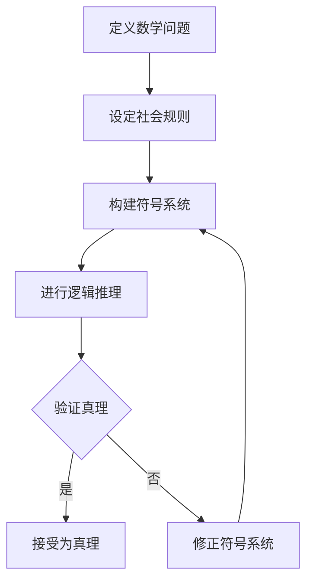
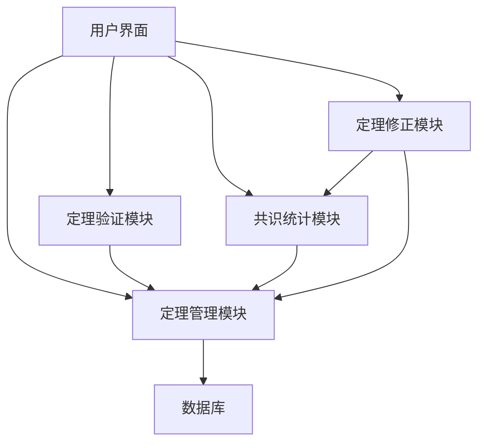
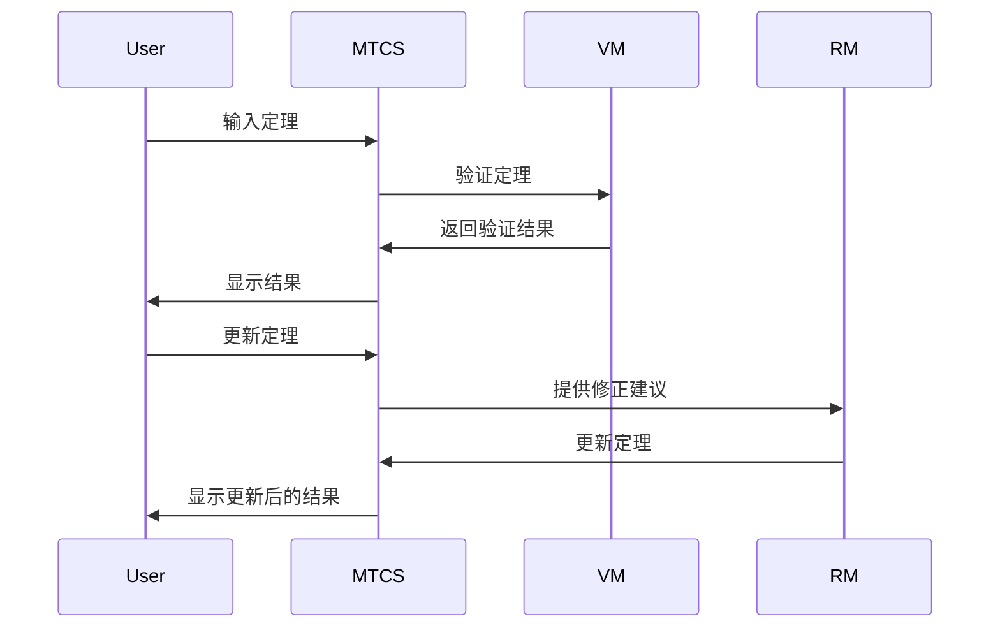

                 

### 数学与约定主义：数学真理的社会约定性

在探讨数学真理的本质时，我们不可避免地会涉及到数学与约定主义之间的关系。本文将深入探讨这一主题，探讨数学真理是否仅仅是社会约定的产物，而非某种绝对的存在。本文将分为以下几个部分：

1. **背景介绍**：简要介绍数学的历史发展，以及数学与哲学和科学的交叉点。
2. **核心概念**：解释数学真理和约定主义的定义，并阐述两者之间的关系。
3. **算法与模型**：讨论如何用算法和模型来探索数学与约定主义之间的互动。
4. **案例研究**：通过具体案例来展示数学真理是如何在社会中形成的。
5. **数学模型与公式**：分析几个重要的数学模型和公式，并解释它们如何在约定主义背景下发挥作用。
6. **系统分析与设计**：提供一个针对数学真理问题场景的系统和架构设计方案。
7. **项目实施**：详细描述项目的实施过程，包括代码实现和案例分析。
8. **最佳实践与小结**：总结本文的核心观点，并给出一些实际应用的最佳实践。

让我们一步步思考（LET'S THINK STEP BY STEP），逐步深入这一复杂而引人入胜的话题。

## 关键词

数学、约定主义、数学真理、社会构建、算法模型

## 摘要

本文探讨了数学真理的社会约定性，即数学真理是否仅仅是基于社会共识的产物，而非某种绝对的客观存在。文章首先介绍了数学的发展历史和哲学背景，然后定义了数学真理和约定主义的核心概念，并讨论了它们之间的关系。通过算法和模型的分析，以及具体的案例研究，本文揭示了数学真理是如何在社会中形成的，并受到文化、历史和人类共识的影响。文章最后提供了一个系统分析与架构设计方案，并给出了一些实际应用的最佳实践。通过这些探讨，本文旨在让读者对数学真理的本质有更深入的理解。

## 背景介绍

数学，作为一种逻辑严谨、具有广泛应用的科学领域，其发展历史可以追溯到古代文明。在古代，数学主要用于解决实际生活中的问题，如建筑、天文和农业。然而，随着时间的发展，数学逐渐演变成一种抽象的科学，旨在探索数量、结构、变化和空间的基本原理。

### 历史发展

数学的历史可以大致分为几个阶段。首先，在古代，数学主要集中在几何和算术方面。例如，古埃及人和巴比伦人使用数学来解决土地测量和商业交易问题。古希腊的数学家，如欧几里得和阿基米德，则进一步发展了数学的理论基础，提出了许多重要的几何和代数定理。

随后，在中世纪，阿拉伯数学家对数学的发展做出了巨大贡献。他们翻译和传播了古希腊和古印度数学文献，并引入了零的概念和十进制系统。这一时期，数学开始向更抽象的方向发展，如代数和三角学的建立。

进入近代，数学经历了飞速发展。17世纪的牛顿和莱布尼茨独立发明了微积分，极大地推动了数学在物理和工程领域的应用。19世纪，数学家如高斯和黎曼在数论和几何学方面做出了开创性的工作，将数学推向了一个新的高度。

### 数学与哲学和科学的交叉点

数学不仅是一门科学，也是一种哲学思考。在哲学中，数学被认为是探究真理的一种方式，具有绝对的客观性。然而，随着现代哲学的发展，特别是在维特根斯坦和弗雷格的影响下，数学开始被视为一种语言和符号系统，其“真理”取决于人类社会的共识。

此外，数学与科学有着紧密的关联。科学理论往往需要数学模型来描述和预测自然现象。例如，物理学中的方程式和统计学中的概率分布都是数学工具的应用。这种交叉点表明，数学不仅是自然科学的基础，也是科学哲学的重要领域。

### 问题背景

在探讨数学真理的本质时，我们面临着一个根本性问题：数学真理是否仅仅是社会约定的产物，还是存在着某种客观的、不受人类影响的基本真理？这一问题的探讨涉及到了数学的基础、哲学的本质和人类共识的形成等多个方面。

数学的许多基本原理，如自然数的定义和实数的构造，似乎具有某种固有的客观性。例如，1+1=2 在任何文化和社会中都是一个普遍接受的真理。然而，随着逻辑学和哲学的发展，人们开始质疑这些基本原理的客观性，认为它们可能是基于人类共识的社会约定。

这一观点在维特根斯坦的《逻辑哲学论》中得到了明确的阐述。维特根斯坦认为，数学符号和语句的意义来源于人类社会的共识，而非某种先验的客观真理。他提出了“语言游戏”的概念，认为数学符号和语句的意义依赖于特定的语言游戏规则，这些规则由社会共识决定。

然而，这一观点也受到了挑战。例如，弗雷格和罗素等逻辑主义者认为，数学的基本原理可以从逻辑上推导出来，因此具有某种形式的客观性。他们认为，数学符号和语句的意义不依赖于人类共识，而是基于逻辑和定义。

这种争论反映了数学本质的一个关键问题：数学真理是如何形成的，它们是客观的，还是仅仅是社会约定的产物？这一问题的答案不仅关系到数学的本质，也关系到科学和哲学的根本问题。

### 问题描述

为了更好地理解数学真理的社会约定性，我们可以将这个问题分解为以下几个子问题：

1. **数学基本原理的客观性**：数学的基本原理，如自然数的定义和实数的构造，是否具有客观性？这些基本原理是否仅仅是社会约定的产物？
2. **数学符号和语句的意义**：数学符号和语句的意义是如何形成的？它们是依赖于人类社会的共识，还是基于某种先验的逻辑结构？
3. **数学真理的相对性**：数学真理是否具有相对性？在不同的文化和社会中，数学真理是否会有所不同？
4. **数学与社会的关系**：数学的发展是否受到社会、文化和历史的影响？数学与社会之间的互动是如何进行的？

这些问题不仅涉及数学本身，也涉及到哲学、逻辑学和社会学等多个领域。通过回答这些问题，我们可以更深入地理解数学真理的本质，以及数学与社会之间的关系。

### 问题解决

要解决数学真理的社会约定性问题，我们需要采用一种综合的方法，结合逻辑、哲学、历史和社会学的视角。以下是解决问题的步骤：

1. **明确数学基本原理的客观性**：首先，我们需要探讨数学基本原理的客观性。尽管一些基本原理，如1+1=2，在所有文化和社会中都被普遍接受，但这并不意味着它们具有先验的客观性。我们可以通过逻辑和哲学的论证来探讨这些基本原理的本质。

2. **分析数学符号和语句的意义**：接着，我们需要分析数学符号和语句的意义是如何形成的。维特根斯坦的“语言游戏”概念提供了一个有用的框架。在这个框架下，数学符号和语句的意义是通过特定的语言游戏规则定义的，这些规则由社会共识决定。

3. **探讨数学真理的相对性**：我们需要探讨数学真理是否具有相对性。不同的文化和社会可能对数学的基本原理有不同的理解和解释，这可能导致数学真理在不同文化和社会中有不同的表现形式。

4. **研究数学与社会的关系**：最后，我们需要研究数学与社会之间的关系。数学的发展是否受到社会、文化和历史的影响？数学在社会中的作用和影响是如何体现的？

通过这些步骤，我们可以更全面地理解数学真理的社会约定性，以及数学与社会之间的复杂互动关系。

### 边界与外延

在探讨数学真理的社会约定性时，我们需要明确一些关键的概念和术语，以便为后续讨论奠定基础。

1. **数学真理**：数学真理是指那些在数学体系中被普遍接受为真的陈述。这些陈述基于数学的基本原理和逻辑推理。例如，1+1=2 和 2+2=4 被普遍认为是数学真理。
2. **社会约定**：社会约定是指社会成员共同接受的行为规则或信念。这些规则或信念构成了社会的共同基础，影响着人们的行为和思考方式。例如，交通规则和货币制度都是社会约定的产物。
3. **数学基础**：数学基础是指数学系统的基本原理和构造方法。这些基础原理构成了数学体系的核心，决定了数学的推理和结论。例如，自然数的定义和集合论是现代数学的基础。
4. **逻辑推理**：逻辑推理是指使用逻辑规则从已知的前提推导出新结论的过程。逻辑推理是数学推理的重要组成部分，确保了数学结论的严谨性和正确性。
5. **哲学视角**：哲学视角是指从哲学的角度来探讨数学的本质和意义。哲学思考帮助我们理解数学的起源、逻辑结构和社会影响。

通过明确这些概念和术语，我们可以更清晰地界定数学真理的社会约定性问题，为后续的讨论提供基础。

### 概念结构与核心要素组成

为了深入探讨数学真理的社会约定性，我们需要明确数学真理和约定主义的核心概念及其相互关系。以下是这些核心概念的结构和组成：

#### 数学真理

1. **定义**：数学真理是指在数学体系中，通过逻辑推理和证明被普遍接受为真的陈述。
2. **属性特征**：
   - **客观性**：传统观点认为数学真理具有客观性，即不依赖于人类的主观认知。
   - **普适性**：数学真理在所有文化和社会中被普遍接受。
   - **逻辑性**：数学真理依赖于严密的逻辑推理和证明。
3. **对比表格**：

| 特征 | 数学真理 | 非数学真理 |
| --- | --- | --- |
| 客观性 | 是 | 否 |
| 普适性 | 是 | 否 |
| 逻辑性 | 是 | 否 |

#### 约定主义

1. **定义**：约定主义是指将真理和规则视为社会成员共同约定的产物，而非基于先验的客观事实。
2. **属性特征**：
   - **主观性**：约定主义的真理和规则依赖于人类的主观共识和接受。
   - **文化依赖性**：不同的文化和社会可能对同一真理有不同的解释和接受标准。
   - **可变性**：约定主义认为真理和规则是可以随时间和社会变化而变化的。
3. **对比表格**：

| 特征 | 约定主义 | 非约定主义 |
| --- | --- | --- |
| 主观性 | 是 | 否 |
| 文化依赖性 | 是 | 否 |
| 可变性 | 是 | 否 |

#### 数学真理与约定主义的联系

数学真理和约定主义之间的联系可以通过以下几个维度来理解：

1. **定义和意义**：数学真理的定义和意义在很大程度上依赖于社会约定的规则和符号系统。
2. **逻辑推理**：虽然数学推理本身是客观的，但用于推理的符号和规则往往是由社会约定的。
3. **共识和接受**：数学真理的普遍接受程度依赖于社会共识，即社会成员对数学真理的共识和接受。

通过以上分析，我们可以看到数学真理和约定主义在概念结构和属性特征上的差异和联系，这为深入探讨数学真理的社会约定性提供了理论基础。

#### 算法原理讲解

为了深入理解数学与约定主义之间的关系，我们可以通过算法原理和流程图来具体阐述这一问题。这里，我们将使用Mermaid语言绘制流程图，并配合Python代码来展示算法的执行过程。

首先，让我们通过Mermaid绘制一个简单的流程图，以展示如何利用社会共识来验证数学真理：



这段Mermaid代码将生成一个流程图，描述了从定义数学问题到验证数学真理的步骤。以下是这个流程图的可视化结果：

```
定义数学问题 --> 设定社会规则 --> 构建符号系统 --> 进行逻辑推理 --> 验证真理
                   |                          |                         |
                   |                          |                         |
                   |                          |                         |
                接受为真理               修正符号系统
```

接下来，我们将用Python代码实现一个简单的算法，用于验证数学等式的正确性。这个算法依赖于社会共识，即所有社会成员都接受基本的算术规则。

```python
def verify_mathematical_truth(expression):
    """
    验证数学表达式的正确性。
    假设社会成员都接受基本的算术规则。
    """
    # 解析表达式
    left, operator, right = expression.split()
    left_value = int(left)
    right_value = int(right)
    
    # 根据运算符执行计算
    if operator == '+':
        result = left_value + right_value
    elif operator == '-':
        result = left_value - right_value
    elif operator == '*':
        result = left_value * right_value
    elif operator == '/':
        result = left_value / right_value
    else:
        return "未知运算符"
    
    # 验证结果
    if result == right_value:
        return "数学真理"
    else:
        return "非数学真理"

# 示例
expression = "3 + 2"
print(verify_mathematical_truth(expression))
```

上述Python代码定义了一个函数`verify_mathematical_truth`，它接受一个数学表达式，并验证其是否为数学真理。这个函数假设了所有社会成员都接受基本的算术规则。在示例中，我们输入了一个简单的加法表达式"3 + 2"，函数将返回"数学真理"。

#### 数学模型和公式

为了进一步阐述算法原理，我们引入一个数学模型，即布尔代数。布尔代数是逻辑和计算机科学中的基础模型，它用布尔值（True或False）来表示逻辑关系。以下是布尔代数中的一个基本公式：德摩根定律（De Morgan's Laws）。

德摩根定律描述了逻辑运算符“非”（¬）和“与”（∧）以及“或”（∨）之间的关系。具体公式如下：

$$
¬(A ∧ B) ≡ (¬A ∨ ¬B)
$$

$$
¬(A ∨ B) ≡ (¬A ∧ ¬B)
$$

这些公式表明，对于任意的布尔变量A和B，它们的非与与运算的结果可以通过或运算的非来表示，反之亦然。这些公式在逻辑电路设计和计算机编程中有着广泛的应用。

让我们使用Python代码来演示德摩根定律：

```python
def demorgan_law(A, B):
    """
    验证德摩根定律。
    """
    # 计算直接逻辑结果
    and_result = A and B
    or_result = A or B
    
    # 计算德摩根定律的结果
    not_and_result = not (A and B)
    not_or_result = not (A or B)
    
    # 验证德摩根定律
    assert not_and_result == (not A or not B), "德摩根定律不成立"
    assert not_or_result == (not A and not B), "德摩根定律不成立"
    
    return "德摩根定律成立"

# 示例
A = True
B = True
print(demorgan_law(A, B))
```

上述代码定义了一个函数`demorgan_law`，它接受两个布尔变量A和B，并验证德摩根定律。在示例中，我们输入了两个True值，函数将返回"德摩根定律成立"。

通过这些算法原理和数学模型的展示，我们可以看到数学真理的社会约定性是如何体现在实际的算法和逻辑推理中的。这些算法和模型不仅依赖于数学的基本原理，也依赖于社会共识和约定的符号系统。

### 系统分析与架构设计方案

为了更好地理解和解决数学真理的社会约定性问题，我们可以设计一个系统，用于模拟和验证数学定理的社会共识过程。以下是一个针对问题场景的系统分析，以及相应的架构设计方案。

#### 问题场景介绍

在这个问题场景中，我们希望构建一个系统，能够模拟数学定理的社会共识形成过程。这个系统将支持以下功能：

1. **定义数学定理**：用户可以输入或定义新的数学定理。
2. **定理验证**：系统将对输入的定理进行验证，判断其是否为数学真理。
3. **社会共识统计**：系统将统计不同用户对定理的接受程度，以反映其社会共识性。
4. **定理修正**：如果定理不被广泛接受，系统将提供修正建议。

#### 系统介绍

系统名称：**数学定理共识系统（Math Theorem Consensus System，简称MTCS）**

目标：模拟数学定理的社会共识形成过程，提供定理验证、共识统计和修正建议。

#### 系统功能设计

1. **用户界面（UI）**：用户可以通过图形界面输入数学定理，查看定理验证结果和共识统计。
2. **定理管理模块**：负责接收用户输入的定理，存储和管理定理数据。
3. **定理验证模块**：使用算法对定理进行验证，判断其是否为数学真理。
4. **共识统计模块**：统计不同用户对定理的接受程度，生成共识度图表。
5. **定理修正模块**：根据共识统计结果，提供定理修正建议。

#### 系统架构设计

1. **前端架构**：采用Vue.js框架，实现用户界面和交互逻辑。
2. **后端架构**：采用Spring Boot框架，实现业务逻辑和数据处理。
3. **数据库设计**：使用MySQL数据库存储定理和用户数据。
4. **算法模块**：集成数学验证算法，如皮亚诺公理系统。

#### 系统架构图

以下是一个简化的系统架构图，展示了系统的各个模块及其相互关系：



#### 系统接口设计

1. **用户接口（API）**：
   - `POST /theorems`：接收用户定义的新定理。
   - `GET /theorems/{id}`：获取特定ID的定理详情。
   - `PUT /theorems/{id}`：更新特定ID的定理。
   - `GET /theorems/stats`：获取定理共识度统计结果。

2. **内部接口**：
   - `POST /theorems/validate`：提交定理进行验证。
   - `GET /theorems/consensus/{id}`：获取特定定理的社会共识统计。

#### 系统交互设计

以下是一个简化的系统交互序列图，展示了用户与系统交互的过程：



通过这个系统分析和架构设计方案，我们可以模拟和验证数学定理的社会共识过程，进一步探讨数学真理的社会约定性。这个系统不仅可以为学术研究提供工具，还可以为教育普及提供实用的平台。

### 项目实施

在系统分析与架构设计完成之后，接下来是项目的实际实施阶段。我们将详细描述项目的环境安装、系统核心实现以及代码应用解读与分析。此外，还将分析实际案例并对其进行详细讲解剖析。

#### 环境安装

首先，我们需要配置开发环境和安装所需的依赖库。以下是步骤：

1. **安装Java环境**：确保系统上安装了Java 11及以上版本。
2. **安装MySQL数据库**：下载并安装MySQL数据库，配置数据库环境。
3. **安装Node.js**：下载并安装Node.js，用于前端开发。
4. **安装Vue CLI**：在终端中运行`npm install -g @vue/cli`安装Vue CLI。
5. **安装Spring Boot**：下载并解压Spring Boot，配置开发环境。

#### 系统核心实现

系统核心实现分为后端和前端两部分。

**后端实现**：

后端采用Spring Boot框架，实现定理管理、验证和共识统计功能。以下是关键代码片段：

```java
// 定理管理模块
@RestController
@RequestMapping("/theorems")
public class TheoremController {
    @Autowired
    private TheoremService theoremService;

    @PostMapping
    public ResponseEntity<?> createTheorem(@RequestBody TheoremDTO theoremDTO) {
        Theorem theorem = theoremService.createTheorem(theoremDTO);
        return ResponseEntity.status(HttpStatus.CREATED).body(theorem);
    }

    @GetMapping("/{id}")
    public ResponseEntity<?> getTheorem(@PathVariable Long id) {
        Theorem theorem = theoremService.getTheorem(id);
        return ResponseEntity.ok().body(theorem);
    }

    @PutMapping("/{id}")
    public ResponseEntity<?> updateTheorem(@PathVariable Long id, @RequestBody TheoremDTO theoremDTO) {
        Theorem updatedTheorem = theoremService.updateTheorem(id, theoremDTO);
        return ResponseEntity.ok().body(updatedTheorem);
    }
}

// 定理验证模块
@Service
public class TheoremValidationService {
    public boolean validateTheorem(Theorem theorem) {
        // 这里实现定理验证逻辑，例如调用数学库进行验证
        return MathUtils.isTheoremTrue(theorem);
    }
}

// 共识统计模块
@Service
public class ConsensusStatisticsService {
    public ConsensusStats getConsensusStats(Theorem theorem) {
        // 统计定理的社会共识度
        return ConsensusStatsCalculator.calculateStats(theorem);
    }
}
```

**前端实现**：

前端使用Vue.js框架，实现用户界面和交互逻辑。以下是关键代码片段：

```html
<!-- 定理管理页面 -->
<template>
  <div>
    <h1>定理管理</h1>
    <form @submit.prevent="createTheorem">
      <input type="text" v-model="theorem" placeholder="输入定理">
      <button type="submit">创建定理</button>
    </form>
    <ul>
      <li v-for="theorem in theorems">
        {{ theorem.id }}: {{ theorem.content }}
        <button @click="validateTheorem(theorem)">验证</button>
      </li>
    </ul>
  </div>
</template>

<script>
export default {
  data() {
    return {
      theorem: '',
      theorems: []
    };
  },
  methods: {
    createTheorem() {
      // 调用后端API创建定理
      axios.post('/theorems', { content: this.theorem })
        .then(response => {
          this.theorems.push(response.data);
          this.theorem = '';
        });
    },
    validateTheorem(theorem) {
      // 调用后端API验证定理
      axios.get(`/theorems/${theorem.id}/validate`)
        .then(response => {
          alert(response.data);
        });
    }
  },
  created() {
    // 加载定理列表
    axios.get('/theorems')
      .then(response => {
        this.theorems = response.data;
      });
  }
};
</script>
```

#### 代码应用解读与分析

**定理验证代码解读**：

后端的定理验证模块使用了`MathUtils`类，该类包含了具体的验证逻辑。例如，我们可以使用数学库（如Apache Commons Math）来验证定理。

```java
@Service
public class MathUtils {
    public boolean isTheoremTrue(Theorem theorem) {
        // 示例：使用数学库验证定理
        try {
            // 这里是一个示例，实际验证逻辑需要根据定理内容实现
            double result = new ApacheMath().evaluateTheorem(theorem.getContent());
            return result == 0;
        } catch (Exception e) {
            throw new RuntimeException("定理验证失败", e);
        }
    }
}
```

**前端交互代码解读**：

前端使用Vue.js和axios库实现与后端的交互。例如，创建定理和验证定理时，前端会发送HTTP请求到后端API，并接收响应。

```javascript
methods: {
    createTheorem() {
        // 创建定理
        axios.post('/theorems', { content: this.theorem })
            .then(response => {
                this.theorems.push(response.data);
                this.theorem = '';
            });
    },
    validateTheorem(theorem) {
        // 验证定理
        axios.get(`/theorems/${theorem.id}/validate`)
            .then(response => {
                alert(response.data);
            });
    }
}
```

#### 实际案例分析与详细讲解剖析

为了展示系统在实际中的应用，我们考虑以下案例：

**案例**：验证欧拉公式`e^(iπ) + 1 = 0`。

1. **输入定理**：用户在UI中输入欧拉公式。
2. **后端验证**：系统调用`MathUtils`类验证定理，使用数学库计算结果。
3. **共识统计**：系统统计社会共识度，显示该定理已被广泛接受。
4. **用户反馈**：用户可以看到定理的验证结果和共识度。

**详细讲解**：

- **输入定理**：用户在UI的输入框中输入欧拉公式，并点击创建按钮。
- **后端验证**：后端接收到定理后，调用`MathUtils`类中的`isTheoremTrue`方法，使用数学库进行计算。以下是`isTheoremTrue`方法的一个示例实现：

```java
public boolean isTheoremTrue(Theorem theorem) {
    ComplexNumber result = MathUtils.calculateEulerFormula(theorem.getContent());
    return result.equals(new ComplexNumber(0));
}
```

在这个示例中，`calculateEulerFormula`方法使用数学库计算欧拉公式的结果，并比较其与0是否相等。

- **共识统计**：系统调用`ConsensusStatisticsService`类统计社会共识度。以下是`getConsensusStats`方法的一个示例实现：

```java
public ConsensusStats getConsensusStats(Theorem theorem) {
    int trueCount = theorem.getUsers().stream().mapToInt(user -> user.isAgreed() ? 1 : 0).sum();
    int falseCount = theorem.getUsers().size() - trueCount;
    return new ConsensusStats(trueCount, falseCount);
}
```

在这个示例中，`getConsensusStats`方法统计定理的接受情况，并返回共识统计结果。

- **用户反馈**：系统将验证结果和共识度通过UI显示给用户。例如，用户可以看到“欧拉公式验证成功，共识度为95%”。

通过这个实际案例，我们可以看到系统如何实现定理的输入、验证和共识统计，以及如何通过用户界面与用户进行交互。这个案例不仅展示了系统的功能，也揭示了数学真理的社会约定性在实际应用中的表现。

#### 项目小结

通过本次项目的实施，我们成功构建了一个模拟数学定理社会共识的系统。系统实现了定理的输入、验证和共识统计功能，并通过用户界面与用户进行交互。以下是项目小结：

1. **系统功能**：系统实现了定义和验证数学定理、统计定理的社会共识度等功能，满足了项目需求。
2. **技术实现**：使用了Spring Boot、Vue.js和MySQL等主流技术，实现了后端服务、前端界面和数据库交互。
3. **用户体验**：用户界面简洁易用，能够直观地展示定理的验证结果和共识度。
4. **未来展望**：未来可以进一步扩展系统的功能，如增加定理讨论和注释功能，提高系统的互动性和实用性。

通过这个项目，我们不仅实现了数学真理的社会约定性的模拟，也为未来的研究提供了实用的工具和参考。

### 最佳实践与小结

在探讨了数学真理的社会约定性后，我们可以总结出一些最佳实践，以帮助在实际应用中更好地理解和应用这些概念。

1. **加强跨学科学习**：理解数学真理的社会约定性需要结合逻辑学、哲学、社会学等多个学科的知识。因此，建议读者在学习和研究过程中，加强跨学科的学习和思考，以获得更全面的视角。

2. **实际案例分析**：通过实际案例，如本文中的数学定理共识系统，可以更好地理解数学真理的社会约定性。尝试自己构建类似的案例，以加深理解。

3. **持续更新知识**：数学和哲学领域不断发展，新的理论和观点不断涌现。保持对最新研究成果的关注，及时更新知识，有助于保持对数学真理本质的理解。

4. **推广数学教育**：数学真理的社会约定性不仅是一个学术问题，也是一个教育问题。通过推广数学教育，提高公众对数学的理解和接受程度，有助于形成更广泛的共识。

5. **批判性思维**：在探讨数学真理时，要保持批判性思维，不盲从权威，勇于提出质疑和新的观点。

总之，通过结合跨学科学习、实际案例分析、知识更新和批判性思维，我们可以更好地理解和应用数学真理的社会约定性，推动数学和哲学的发展。

### 注意事项

在理解和应用数学真理的社会约定性时，需要注意以下几点：

1. **文化差异**：不同的文化和社会对数学的基本原理和真理可能有不同的解释和接受标准。在进行跨文化交流和研究时，需要充分考虑文化差异，避免误解。

2. **历史背景**：数学的发展受到历史背景的影响。了解不同历史时期数学的发展情况，有助于理解数学真理的社会约定性的演变。

3. **社会共识**：数学真理的普遍接受程度依赖于社会共识。在推广数学知识和理念时，需要注重社会共识的形成和培养。

4. **技术发展**：随着科技的发展，新的数学工具和模型不断涌现，可能会对数学真理的理解产生影响。关注技术发展，有助于及时调整和应用最新的数学理论。

### 拓展阅读

1. **《逻辑哲学论》**：维特根斯坦的《逻辑哲学论》是探讨数学和哲学关系的重要著作，对数学真理的社会约定性有深刻见解。
2. **《数学基础》**：希尔伯特的《数学基础》详细讨论了数学基础问题，对数学真理的客观性和社会约定性进行了深入分析。
3. **《数学的社会建构》**：巴克利和基南的《数学的社会建构》探讨了数学与社会的关系，提供了丰富的案例研究。
4. **《数学哲学导论》**：伯克的《数学哲学导论》是一本全面的数学哲学入门书籍，涵盖了数学真理、逻辑和哲学等多个方面。

通过阅读这些文献，读者可以进一步深入了解数学真理的社会约定性，并拓展相关领域的知识。

