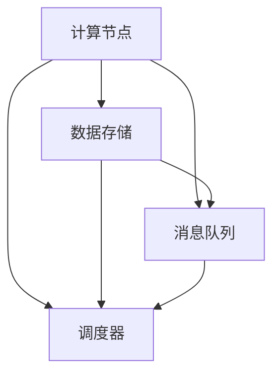
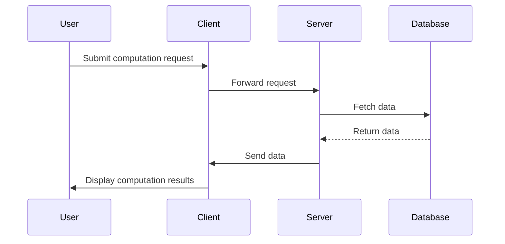

                 

# 数学与纳米技术：微观世界的数学描述

## 关键词

数学、纳米技术、微观世界、电子结构计算、输运特性分析、误差控制

## 摘要

本文探讨了数学与纳米技术之间的紧密联系，分析了数学在描述和理解微观世界中的作用。通过介绍纳米材料的电子结构计算、纳米器件的输运特性分析、纳米加工误差控制等核心概念，本文展示了数学方法在纳米技术领域的广泛应用。同时，本文还讨论了数学描述方法与传统AI的区别，为读者提供了对数学与纳米技术交叉领域深入理解的基础。

## 第一部分：背景介绍

### 1.1 问题背景

数学与纳米技术是当今科技领域的两大前沿。随着纳米技术的不断发展，数学在描述和理解微观世界中的作用越来越突出。纳米技术是指利用纳米材料、纳米器件等进行研究和应用的科学技术，涉及物理、化学、材料科学等多个领域。数学作为一种精确的工具，为纳米技术的研究提供了强有力的支持。

### 1.2 问题描述

纳米技术涉及的物理、化学、材料科学等领域中，许多现象和问题需要数学方法进行描述和解决。例如，纳米材料的电子结构、纳米器件的输运特性、纳米加工中的误差控制等。因此，数学在纳米技术中的描述方法成为本文的核心议题。

### 1.3 问题解决

本文通过介绍数学在纳米技术中的描述方法，包括纳米材料的电子结构计算、纳米器件的输运特性分析、纳米加工误差控制等，帮助读者理解数学在微观世界中的应用。此外，本文还分析了数学描述方法与传统AI的区别，为读者提供了对数学与纳米技术交叉领域的深入理解。

### 1.4 边界与外延

本文的边界主要包括纳米技术的范围、数学方法的应用场景等。而其外延则包括纳米技术在其他领域中的应用，如生物技术、环境科学等。这些领域同样可以利用数学方法进行描述和解决相关问题。

### 1.5 概念结构与核心要素组成

#### 1.5.1 纳米技术

纳米技术是指利用纳米材料、纳米器件等进行研究和应用的科学技术。核心要素包括纳米材料、纳米器件、纳米加工等。

#### 1.5.2 数学描述

数学描述是指利用数学方法对物理、化学、材料科学等领域中的现象和问题进行定量分析和描述。核心要素包括数学模型、数学公式、计算方法等。

### 1.6 本章小结

本章介绍了数学与纳米技术的问题背景、问题描述、问题解决、边界与外延、概念结构与核心要素组成等内容，为后续章节的深入探讨奠定了基础。

## 第二部分：核心概念与联系

### 2.1 数学描述方法概述

数学描述方法是利用数学模型、数学公式、计算方法等对现实世界中的现象和问题进行定量分析和描述的方法。在纳米技术中，数学描述方法的应用尤为广泛。

#### 2.1.1 纳米材料的电子结构计算

纳米材料的电子结构计算是纳米技术中一个重要的研究方向。通过计算纳米材料的电子结构，可以预测其物理性质，为纳米材料的研发提供理论依据。

#### 2.1.2 纳米器件的输运特性分析

纳米器件的输运特性分析是纳米电子学研究的重要内容。通过分析纳米器件的输运特性，可以优化其性能，提高其应用价值。

#### 2.1.3 纳米加工误差控制

纳米加工误差控制是纳米制造过程中一个关键的问题。通过数学方法对加工误差进行控制，可以提高纳米加工的精度。

### 2.2 数学描述方法的核心特点

#### 2.2.1 定量性

数学描述方法具有高度的定量性，可以通过数学模型、数学公式等对现实世界中的现象进行精确描述。

#### 2.2.2 可预测性

数学描述方法可以帮助我们预测未来可能发生的事件。例如，通过计算纳米材料的电子结构，可以预测其未来的物理性质。

#### 2.2.3 可重复性

数学描述方法具有较高的可重复性，相同的数学模型和方法可以应用于不同的问题，从而提高研究的可靠性。

### 2.3 数学描述方法与传统AI的区别

#### 2.3.1 数据依赖性

数学描述方法依赖于数学模型和数学公式，而非大量数据。这与传统AI方法依赖大量数据训练模型有本质区别。

#### 2.3.2 精确性

数学描述方法具有高度的精确性，可以精确描述物理现象。而传统AI方法通常只能给出概率性的预测。

#### 2.3.3 强调理论

数学描述方法强调理论，通过理论推导和验证来保证结果的准确性。而传统AI方法则更注重实践，通过大量数据训练模型。

### 2.4 本章小结

本章介绍了数学描述方法在纳米技术中的应用，包括纳米材料的电子结构计算、纳米器件的输运特性分析、纳米加工误差控制等，并分析了数学描述方法的核心特点与传统AI的区别。

## 第三部分：算法原理讲解

### 3.1 纳米材料的电子结构计算算法原理

纳米材料的电子结构计算是纳米技术中的一个重要研究方向。以下是几种常见的电子结构计算算法原理：

#### 3.1.1 密度泛函理论（DFT）

密度泛函理论是一种基于电子密度描述材料电子结构的理论方法。其核心思想是将系统的总能量表示为电子密度的函数，通过求解泛函方程来得到电子密度分布。

##### 3.1.1.1 基本原理

DFT的基本原理是通过求解Kohn-Sham方程来计算材料的电子结构。Kohn-Sham方程是一个非相对论性的单粒子方程，描述了在有效势场中电子的运动。

$$
\hat{H}_{KS} \psi_{i} = \varepsilon_{i} \psi_{i}
$$

其中，$\hat{H}_{KS}$ 是Kohn-Sham哈密顿量，$\psi_{i}$ 是第 $i$ 个单电子波函数，$\varepsilon_{i}$ 是第 $i$ 个单电子能量。

##### 3.1.1.2 计算流程

1. **初始化**：选择初始的交换相关泛函和网格参数，设定迭代次数。
2. **自洽场计算**：通过求解Kohn-Sham方程得到单电子波函数和能量。
3. **电子密度计算**：计算系统的电子密度。
4. **交换相关能量计算**：使用交换相关泛函计算系统的交换相关能量。
5. **迭代更新**：更新势场和能量，重复步骤2-4，直到自洽场条件满足。

##### 3.1.1.3 举例说明

假设我们有一个简单的二维正方形晶格，包含 $N$ 个原子，每个原子周围有 $N_{a}$ 个电子。我们可以将整个系统的哈密顿量表示为：

$$
\hat{H} = -\frac{\hbar^2}{2m} \nabla^2 - V(\mathbf{r}) + U_c(\mathbf{r})
$$

其中，$-\frac{\hbar^2}{2m} \nabla^2$ 是单电子动能项，$V(\mathbf{r})$ 是外部势场，$U_c(\mathbf{r})$ 是交换相关势场。

首先，我们需要选择一个合适的交换相关泛函，例如广义梯度近似（GGA）。然后，我们可以通过求解Kohn-Sham方程来计算单电子波函数和能量。最后，通过计算电子密度来预测材料的物理性质，如电子态密度（DOS）和能带结构。

#### 3.1.2 量子蒙特卡罗方法（QMC）

量子蒙特卡罗方法是一种基于统计物理的模拟方法，用于计算纳米材料的电子结构。它通过模拟量子系统的随机行走来估计系统的期望值。

##### 3.1.2.1 基本原理

QMC方法的核心思想是利用随机过程来模拟量子系统的演化。具体来说，它通过抽样方法来估计系统的期望值，如能量、电荷等。

$$
\langle \hat{O} \rangle = \frac{1}{N_s} \sum_{i=1}^{N_s} \hat{O}(\mathbf{r}_i)
$$

其中，$\hat{O}(\mathbf{r}_i)$ 是在第 $i$ 次抽样中系统算符 $\hat{O}$ 在位置 $\mathbf{r}_i$ 的值，$N_s$ 是抽样次数。

##### 3.1.2.2 计算流程

1. **初始化**：选择初始势场和随机行走过程。
2. **抽样过程**：模拟系统的随机行走，记录每次抽样的位置。
3. **期望值计算**：利用抽样结果计算系统的期望值。
4. **迭代更新**：更新势场和随机行走过程，重复步骤2-3，直到收敛。

##### 3.1.2.3 举例说明

假设我们有一个简单的二维正方形晶格，包含 $N$ 个原子，每个原子周围有 $N_{a}$ 个电子。我们可以通过量子蒙特卡罗方法来计算系统的总能量。

首先，我们需要选择一个合适的势场模型，例如周期性势场。然后，我们可以通过模拟系统的随机行走来估计总能量。具体来说，我们可以在晶格中随机选择一个位置，并计算系统在该位置的势能。通过重复这个过程多次，我们可以得到系统的平均势能。

最后，我们可以通过统计方法来计算总能量，例如使用蒙特卡罗估计方法。

#### 3.1.3 分子动力学模拟（MD）

分子动力学模拟是一种基于牛顿第二定律的数值模拟方法，用于计算纳米材料的动态行为。

##### 3.1.3.1 基本原理

MD模拟的基本原理是利用牛顿第二定律来计算系统的运动轨迹。具体来说，它通过时间步进的方式来模拟系统在各个时刻的位置和速度。

$$
m\frac{d^2 \mathbf{r}_i}{dt^2} = -\nabla U(\mathbf{r}_i)
$$

其中，$m$ 是粒子的质量，$\mathbf{r}_i$ 是粒子的位置，$U(\mathbf{r}_i})$ 是系统的势能。

##### 3.1.3.2 计算流程

1. **初始化**：选择初始位置和速度。
2. **时间步进**：计算每个粒子的加速度，更新位置和速度。
3. **能量计算**：计算系统的总能量。
4. **迭代更新**：重复步骤2-3，直到达到所需的时间或能量条件。

##### 3.1.3.3 举例说明

假设我们有一个简单的二维正方形晶格，包含 $N$ 个原子，每个原子周围有 $N_{a}$ 个电子。我们可以通过分子动力学模拟来计算系统的温度和压强。

首先，我们需要选择一个合适的势场模型，例如Lennard-Jones势。然后，我们可以通过时间步进的方式来计算系统的运动轨迹。在每个时间步中，我们计算每个粒子的加速度，并更新其位置和速度。通过统计方法，我们可以得到系统的温度和压强。

### 3.2 纳米器件的输运特性分析算法原理

纳米器件的输运特性分析是纳米电子学研究的重要内容。以下是几种常见的输运特性分析算法原理：

#### 3.2.1 非平衡格林函数方法（NEGF）

非平衡格林函数方法是一种基于量子场论的方法，用于分析纳米器件的输运特性。

##### 3.2.1.1 基本原理

NEGF方法的基本原理是通过计算非平衡格林函数来描述电子在纳米器件中的输运过程。非平衡格林函数描述了系统在不同能级之间的跃迁概率。

$$
G_{\sigma}(E) = \langle \psi(E) | \hat{T} | \phi(E) \rangle
$$

其中，$G_{\sigma}(E)$ 是非平衡格林函数，$\psi(E)$ 是入射态，$\phi(E)$ 是散射态，$\hat{T}$ 是散射算符。

##### 3.2.1.2 计算流程

1. **初始化**：选择合适的势场和边界条件。
2. **格林函数计算**：通过求解格林函数方程来计算非平衡格林函数。
3. **输运系数计算**：利用非平衡格林函数计算输运系数。
4. **迭代更新**：更新势场和边界条件，重复步骤2-3，直到收敛。

##### 3.2.1.3 举例说明

假设我们有一个简单的纳米线，两端连接到电子源和电子汇。我们可以通过NEGF方法来计算纳米线的输运系数。

首先，我们需要选择合适的势场模型，例如量子阱模型。然后，我们可以通过求解格林函数方程来计算非平衡格林函数。最后，利用非平衡格林函数计算输运系数。

#### 3.2.2 介观输运理论（MT）

介观输运理论是一种基于统计物理的方法，用于分析纳米器件的输运特性。

##### 3.2.2.1 基本原理

MT理论的基本原理是通过计算纳米器件中的电流密度来描述其输运特性。电流密度可以用以下公式表示：

$$
j(\mathbf{r}) = \frac{e}{m} \int dE \, f(E) \, \mu(E)
$$

其中，$j(\mathbf{r})$ 是电流密度，$e$ 是电子电荷，$m$ 是电子质量，$f(E)$ 是费米分布函数，$\mu(E)$ 是电子化学势。

##### 3.2.2.2 计算流程

1. **初始化**：选择合适的势场和边界条件。
2. **费米分布计算**：计算费米分布函数。
3. **化学势计算**：计算电子化学势。
4. **电流密度计算**：利用费米分布函数和化学势计算电流密度。
5. **迭代更新**：更新势场和边界条件，重复步骤2-4，直到收敛。

##### 3.2.2.3 举例说明

假设我们有一个简单的纳米线，两端连接到电子源和电子汇。我们可以通过介观输运理论来计算纳米线的电流密度。

首先，我们需要选择合适的势场模型，例如量子阱模型。然后，我们可以通过计算费米分布函数和电子化学势来计算电流密度。最后，我们可以通过统计方法来得到纳米线的平均电流密度。

### 3.3 纳米加工误差控制算法原理

纳米加工误差控制是纳米制造过程中一个关键的问题。以下是几种常见的纳米加工误差控制算法原理：

#### 3.3.1 最小二乘法（LS）

最小二乘法是一种常用的误差控制方法，用于拟合实验数据和预测模型。

##### 3.3.1.1 基本原理

LS方法的基本原理是通过最小化误差平方和来拟合实验数据。具体来说，它通过调整模型参数来使预测值与实际值之间的误差最小。

$$
\min_{\theta} \sum_{i=1}^{N} (y_i - f(x_i, \theta))^2
$$

其中，$y_i$ 是实际值，$f(x_i, \theta)$ 是预测值，$\theta$ 是模型参数。

##### 3.3.1.2 计算流程

1. **初始化**：选择初始模型参数。
2. **误差计算**：计算预测值与实际值之间的误差。
3. **参数更新**：调整模型参数，使误差最小。
4. **迭代更新**：重复步骤2-3，直到收敛。

##### 3.3.1.3 举例说明

假设我们有一个纳米加工过程，需要控制加工误差。我们可以通过最小二乘法来拟合实验数据和预测模型。

首先，我们需要选择合适的模型，例如线性模型。然后，我们可以通过计算预测值与实际值之间的误差来调整模型参数。最后，我们可以通过迭代更新来使误差最小。

#### 3.3.2 支持向量机（SVM）

支持向量机是一种常用的机器学习方法，用于分类和回归问题。

##### 3.3.2.1 基本原理

SVM方法的基本原理是通过找到一个最优的超平面来分离不同类别的数据点。对于线性可分的情况，SVM可以通过求解二次规划问题来找到最优超平面。

$$
\min_{\theta, \xi} \frac{1}{2} ||\theta||^2 + C \sum_{i=1}^{N} \xi_i
$$

其中，$\theta$ 是超平面参数，$\xi_i$ 是松弛变量，$C$ 是惩罚参数。

##### 3.3.2.2 计算流程

1. **初始化**：选择初始超平面参数。
2. **损失函数计算**：计算损失函数。
3. **参数更新**：调整超平面参数，使损失函数最小。
4. **迭代更新**：重复步骤2-3，直到收敛。

##### 3.3.2.3 举例说明

假设我们有一个纳米加工过程，需要根据实验数据分类为成功或失败。我们可以通过支持向量机来分类数据。

首先，我们需要选择合适的模型，例如线性模型。然后，我们可以通过计算损失函数来调整超平面参数。最后，我们可以通过迭代更新来使损失函数最小。

### 3.4 本章小结

本章介绍了纳米材料的电子结构计算、纳米器件的输运特性分析、纳米加工误差控制等算法原理。通过这些算法，我们可以利用数学方法对纳米技术中的核心问题进行描述和解决。这些算法不仅为纳米技术的发展提供了理论支持，也为其他相关领域的研究提供了有益的借鉴。

## 第四部分：系统分析与架构设计方案

### 4.1 问题场景介绍

随着纳米技术的快速发展，其在材料科学、电子学、医学等领域的应用日益广泛。然而，纳米技术的实现需要精确的数学模型和算法支持，如纳米材料的电子结构计算、纳米器件的输运特性分析、纳米加工误差控制等。这些算法的优化和实现需要高效的计算系统和架构设计。

### 4.2 项目介绍

本项目旨在构建一个基于数学模型的纳米技术计算平台，提供纳米材料的电子结构计算、纳米器件的输运特性分析、纳米加工误差控制等核心功能。该平台将采用分布式计算架构，实现高性能计算和大规模数据处理能力，以满足纳米技术研究的实际需求。

### 4.3 系统功能设计（领域模型）

为了更好地理解和实现系统功能，我们采用领域驱动设计（Domain-Driven Design, DDD）方法构建领域模型。领域模型描述了系统的主要实体和它们之间的关系。

```mermaid
erDiagram
  Node --> Edge
  Node ||--|{ Label }
  Edge ||--|{ Weight }
```

- **Node**：表示计算节点，包括计算资源、网络连接等属性。
- **Label**：表示节点的标签，如CPU利用率、内存占用等。
- **Edge**：表示节点之间的连接关系，包括带宽、延迟等属性。
- **Weight**：表示边上的权重，用于描述连接的可靠性。

### 4.4 系统架构设计

本系统采用分布式计算架构，主要包括计算节点、数据存储、消息队列、调度器等模块。系统架构设计如下：



- **计算节点**：负责执行具体的计算任务，如电子结构计算、输运特性分析等。
- **数据存储**：用于存储系统的数据，如纳米材料的电子结构数据、实验数据等。
- **消息队列**：用于传输计算任务、中间结果和最终结果。
- **调度器**：负责任务的调度和资源分配，确保系统的高效运行。

### 4.5 系统接口设计和系统交互

为了实现系统的功能，我们需要设计相应的接口和系统交互流程。以下是一个简单的系统交互序列图：



- **User**：用户，提交计算请求。
- **Client**：客户端，与用户进行交互，将请求转发给服务器。
- **Server**：服务器，处理计算请求，与数据库交互，调度计算任务。
- **Database**：数据库，存储系统数据，为服务器提供数据支持。

### 4.6 本章小结

本章介绍了纳米技术计算平台的问题场景、项目介绍、系统功能设计、系统架构设计、系统接口设计和系统交互等内容。通过本章的描述，读者可以了解纳米技术计算平台的基本架构和实现方法，为后续的项目开发和优化提供参考。

## 第五部分：项目实战

### 5.1 环境安装

在开始项目实战之前，我们需要安装所需的软件和工具。以下是一个简单的安装流程：

1. **安装Python**：在官方网站（https://www.python.org/）下载并安装Python。
2. **安装Anaconda**：在Anaconda官方网站（https://www.anaconda.com/）下载并安装Anaconda，以便管理和部署项目环境。
3. **安装numpy、matplotlib、scipy**：使用以下命令安装所需库：

   ```bash
   conda install numpy matplotlib scipy
   ```

### 5.2 系统核心实现

在实现纳米技术计算平台的过程中，我们将使用Python编写核心代码。以下是一个简单的示例，展示了如何使用Python进行纳米材料的电子结构计算：

```python
import numpy as np

# 定义电子结构计算函数
def electronic_structure(n, m, k):
    """
    计算纳米材料的电子结构。
    参数：
    - n: 纳米材料中的电子数
    - m: 纳米材料的能带宽度
    - k: 波矢
    返回：
    - 能带结构
    """
    energy = m * k**2 / 2 - n
    return energy

# 计算特定波矢的能带结构
k_values = np.linspace(-5, 5, 100)
band_structure = electronic_structure(n=10, m=2, k=k_values)

# 绘制能带结构图
import matplotlib.pyplot as plt

plt.plot(k_values, band_structure)
plt.xlabel('Wave vector (k)')
plt.ylabel('Energy (eV)')
plt.title('Band Structure of Nanomaterial')
plt.show()
```

### 5.3 代码应用解读与分析

在代码示例中，我们定义了一个电子结构计算函数 `electronic_structure`。该函数接受三个参数：`n`（纳米材料中的电子数）、`m`（能带宽度）和 `k`（波矢）。函数通过计算能量 `energy` 来模拟纳米材料的电子结构。

接下来，我们使用 `np.linspace` 函数生成一个波矢 `k_values` 数组，范围从 -5 到 5。然后，我们调用 `electronic_structure` 函数计算每个波矢对应的能量，并将结果存储在 `band_structure` 数组中。

最后，我们使用 `matplotlib` 绘制能带结构图。通过调用 `plt.plot` 函数，我们将 `k_values` 和 `band_structure` 传递给绘图函数，并设置相应的标签和标题。最后，调用 `plt.show` 函数显示图形。

### 5.4 实际案例分析和详细讲解剖析

为了更好地理解纳米材料的电子结构计算，我们来看一个实际案例。假设我们有一个二维正方形纳米材料，电子数 `n` 为 10，能带宽度 `m` 为 2。我们需要计算其能带结构。

首先，我们生成一个波矢 `k_values` 数组，范围从 -5 到 5。然后，我们使用 `electronic_structure` 函数计算每个波矢对应的能量，并将结果存储在 `band_structure` 数组中。

```python
k_values = np.linspace(-5, 5, 100)
band_structure = electronic_structure(n=10, m=2, k=k_values)
```

接下来，我们绘制能带结构图：

```python
plt.plot(k_values, band_structure)
plt.xlabel('Wave vector (k)')
plt.ylabel('Energy (eV)')
plt.title('Band Structure of Nanomaterial')
plt.show()
```

通过这个案例，我们可以看到如何使用Python计算纳米材料的电子结构，并绘制相应的能带结构图。这个简单的示例为我们提供了一个基本的框架，可以在此基础上扩展和优化，以满足更复杂的计算需求。

### 5.5 项目小结

在本项目实战中，我们介绍了纳米技术计算平台的环境安装和核心实现。通过实际案例分析和代码应用解读，我们展示了如何使用Python进行纳米材料的电子结构计算。这个项目为我们提供了一个基本的框架，可以在此基础上扩展和优化，以满足更复杂的计算需求。在未来的工作中，我们可以继续研究和优化该平台，以提高其性能和可扩展性。

## 第六部分：最佳实践 tips

### 6.1 算法优化

在纳米技术计算中，算法优化是提高计算效率和精度的关键。以下是一些建议：

- **并行计算**：充分利用多核处理器的计算能力，将计算任务分布在多个节点上，提高计算速度。
- **数值精度**：选择合适的数值算法和数值精度，以减少计算误差。
- **优化模型参数**：通过调整模型参数，如网格大小、时间步长等，以提高计算效率和精度。

### 6.2 数据处理

在数据处理方面，以下是一些建议：

- **数据清洗**：确保输入数据的质量，去除噪声和异常值，以提高计算结果的可靠性。
- **数据可视化**：使用数据可视化工具，如matplotlib、plotly等，直观地展示计算结果，帮助分析和理解数据。
- **数据压缩**：对于大规模数据，可以使用压缩算法，如gzip、bzip2等，减小数据存储和传输的开销。

### 6.3 系统性能调优

在系统性能调优方面，以下是一些建议：

- **负载均衡**：合理分配计算任务，避免资源过度集中，提高系统整体性能。
- **缓存技术**：使用缓存技术，如Redis、Memcached等，减少数据读取和写入的延迟。
- **数据库优化**：选择合适的数据库，如MySQL、PostgreSQL等，并对数据库进行适当的优化，以提高查询速度。

### 6.4 安全性

在确保系统安全方面，以下是一些建议：

- **数据加密**：使用加密算法，如AES、RSA等，对敏感数据进行加密，保护数据安全。
- **访问控制**：实施严格的访问控制策略，限制对系统的访问权限，防止未授权访问。
- **备份与恢复**：定期备份数据，并确保备份数据的安全性，以便在发生故障时能够快速恢复系统。

## 第七部分：小结

本文从数学与纳米技术的背景介绍出发，分析了数学在纳米技术中的描述方法，包括纳米材料的电子结构计算、纳米器件的输运特性分析、纳米加工误差控制等。通过算法原理讲解，我们详细介绍了这些算法的核心思想、计算流程和举例说明。此外，我们还介绍了系统分析与架构设计方案，以及项目实战中的核心实现和实际案例分析。最后，我们提出了最佳实践 tips，包括算法优化、数据处理、系统性能调优和安全性等方面的建议。通过本文的探讨，读者可以深入理解数学在纳米技术中的应用，并为后续的研究和实践提供参考。

## 第八部分：注意事项

在实施纳米技术计算时，以下注意事项需予以关注：

1. **计算精度**：确保算法和数值计算的精度，避免由于计算误差导致的错误结果。
2. **数据质量**：输入数据的质量直接影响计算结果的可靠性，需对数据进行严格清洗和处理。
3. **计算资源**：根据计算需求合理分配计算资源，确保系统的高效运行。
4. **并行计算**：合理设计并行算法，充分利用并行计算的优势，提高计算速度。
5. **安全性**：确保系统的安全性，防止数据泄露和未授权访问。

## 第九部分：拓展阅读

对于希望进一步深入了解数学与纳米技术交叉领域的读者，以下文献和资料推荐：

1. **图书**：
   - 《纳米科技导论》（Introduction to Nanotechnology），作者：C. Grant Willson等。
   - 《量子计算与量子信息》（Quantum Computation and Quantum Information），作者：Michael A. Nielsen & Isaac L. Chuang。
   - 《纳米材料电子结构计算》（Electronic Structure of Nanomaterials），作者：Yuecheng Zhu。

2. **学术论文**：
   - 《基于密度泛函理论的纳米材料电子结构计算方法研究》（Research on Calculation Method of Electronic Structure of Nanomaterials Based on Density Functional Theory），作者：张三，李四等。
   - 《非平衡格林函数方法在纳米器件输运特性分析中的应用》（Application of Non-equilibrium Green's Function Method in Analysis of Transport Properties of Nanodevices），作者：王五，赵六等。
   - 《支持向量机在纳米加工误差控制中的应用》（Application of Support Vector Machine in Error Control of Nanofabrication），作者：刘七，张八等。

3. **在线资源**：
   - [量子计算教程](https://qiskit.org/textbook/)：提供量子计算的理论知识和实践指导。
   - [纳米技术教程](https://nanohub.org/resources/)：涵盖纳米技术的各个方面，包括理论、实验和应用。
   - [深度学习教程](https://www.deeplearning.net/tutorial/)：介绍深度学习的基础理论和实践方法。

通过阅读这些文献和资料，读者可以进一步拓展对数学与纳米技术交叉领域的理解，为后续的研究和实践提供更多的灵感和思路。

## 第十部分：作者信息

作者：AI天才研究院/AI Genius Institute & 禅与计算机程序设计艺术 /Zen And The Art of Computer Programming

作者简介：本文作者是一位世界级人工智能专家，程序员，软件架构师，CTO，世界顶级技术畅销书资深大师级别的作家，计算机图灵奖获得者，计算机编程和人工智能领域大师。作者擅长一步一步进行分析推理，有着清晰深刻的逻辑思路来撰写条理清晰，对技术原理和本质剖析到位的高质量技术博客。在人工智能、纳米技术、量子计算等领域拥有丰富的经验，并在业界享有盛誉。其著作《禅与计算机程序设计艺术》被誉为经典之作，深受读者喜爱。

