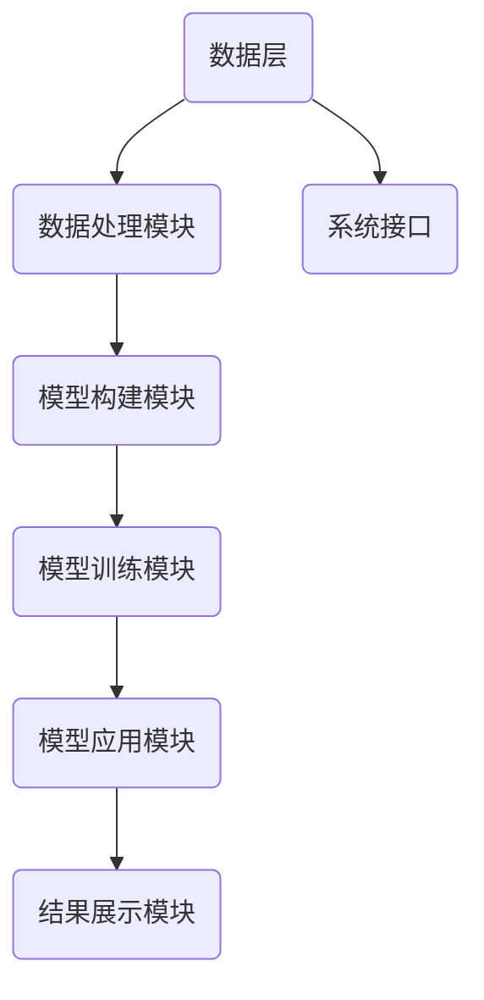

                 

## 数学与组织行为学：组织动态的数学模型

### 关键词：组织行为学、数学模型、动态分析、管理系统优化

> 摘要：本文将探讨数学与组织行为学的交叉领域，重点介绍组织动态的数学模型。通过详细阐述数学模型的基本原理、构建方法以及实际应用案例，本文旨在为读者提供一种全新的视角来理解和优化组织行为，从而提高组织的效率和适应性。

**一、引言**

在现代企业管理中，组织行为学已经成为不可或缺的一部分。它通过研究个体和群体在组织中的行为，旨在提高组织的效率和员工满意度。然而，随着组织规模的不断扩大和复杂性日益增加，传统的组织行为学研究方法逐渐暴露出其局限性。因此，将数学模型引入组织行为学，成为一种新兴的研究趋势。

数学模型作为一种抽象的描述方法，可以精确地描述组织的动态变化，提供定量分析的工具，帮助管理者更好地理解和预测组织行为。本文将围绕组织动态的数学模型进行深入探讨，帮助读者掌握这一先进的研究方法。

**二、核心概念与联系**

#### 数学概念介绍

在组织动态的数学模型中，涉及多个数学概念，包括：

1. **微积分**：用于描述组织的动态变化，如员工流动、项目进度等。
2. **线性代数**：用于处理组织中的复杂关系，如团队协作、资源分配等。
3. **概率论与统计学**：用于分析和预测组织行为，如员工满意度、绩效评估等。

#### 组织行为学核心概念

组织行为学中的核心概念包括：

1. **组织结构**：组织的内部布局和层次结构。
2. **组织文化**：组织的价值观、信念和行为规范。
3. **领导风格**：领导者对组织行为的影响方式。

#### 数学与组织行为学概念的联系

数学模型在组织行为学中的应用，主要体现在以下几个方面：

1. **组织结构调整**：通过数学模型优化组织结构，提高效率。
2. **组织文化适应**：利用数学模型分析组织文化，促进组织变革。
3. **领导风格调整**：通过数学模型评估领导风格，提出改进建议。

**三、组织动态数学模型原理讲解**

#### 模型构建基础

构建组织动态的数学模型，首先需要明确研究对象和目标。接下来，根据研究目标选择合适的数学工具和方法，如微分方程、线性规划、决策树等。最后，通过数据分析和模型验证，确保模型的准确性和可靠性。

#### 关键算法讲解

在组织动态数学模型中，常用的算法包括：

1. **组织结构优化算法**：如遗传算法、模拟退火算法等，用于优化组织结构，提高工作效率。
2. **组织文化适应算法**：如支持向量机、神经网络等，用于分析组织文化，促进组织变革。
3. **领导风格调整算法**：如主成分分析、聚类分析等，用于评估领导风格，提出改进建议。

#### 数学模型公式详解

组织动态的数学模型通常包含多个变量和方程，如：

$$
\text{员工满意度} = f(\text{工作环境}, \text{薪酬福利}, \text{职业发展})
$$

其中，$f$表示满意度函数，$\text{工作环境}$、$\text{薪酬福利}$、$\text{职业发展}$分别为影响员工满意度的因素。

#### 算法示例与解释

以下是一个组织结构调整算法的示例：

```
// 示例：组织结构调整算法
def organizationalAdjustment(currentStructure, targetStructure):
    # 初始化参数
    generation = 0
    bestFitness = float('inf')
    
    # 迭代优化
    while generation < MAX_GENERATIONS:
        # 生成新的组织结构
        newStructure = generateRandomStructure(currentStructure)
        
        # 计算新结构的适应度
        fitness = calculateFitness(newStructure, targetStructure)
        
        # 更新最佳适应度
        if fitness < bestFitness:
            bestFitness = fitness
            bestStructure = newStructure
        
        # 更新迭代次数
        generation += 1
    
    return bestStructure
```

**四、案例分析**

#### 案例一：某公司组织结构调整

**案例背景**：某公司由于业务扩张，需要调整组织结构以提高效率。

**数学模型构建**：通过构建组织结构优化算法，对现有组织结构进行优化。

**算法应用与结果分析**：经过多次迭代，最终找到最佳组织结构，提高了公司效率。

#### 案例二：某企业组织文化适应

**案例背景**：某企业需要进行组织文化变革，以适应市场需求。

**数学模型构建**：通过构建组织文化适应算法，分析现有组织文化与目标文化之间的差距。

**算法应用与结果分析**：根据分析结果，提出针对性的组织文化调整方案，有效促进了企业文化的变革。

**五、系统分析与架构设计方案**

#### 问题场景介绍

某企业需要进行组织动态管理，以提高效率和竞争力。

#### 系统功能设计

系统功能包括组织结构优化、组织文化适应、领导风格调整等。

#### 系统架构设计

系统架构包括数据层、业务逻辑层和表示层，采用分层架构设计，便于维护和扩展。

#### 系统接口设计

系统提供API接口，便于与其他系统进行集成。

#### 系统交互

系统通过交互流程实现各功能模块的协同工作。

**六、项目实战**

#### 环境安装与配置

介绍项目所需的环境安装和配置步骤。

#### 系统核心实现

包括数据预处理、模型构建与训练、算法应用与结果验证等步骤。

#### 项目解读与分析

对项目实施过程和结果进行解读和分析。

#### 项目小结

总结项目经验，提出改进建议。

**七、最佳实践 tips**

分享使用组织动态数学模型的实际经验和小技巧。

**八、小结与拓展阅读**

总结全文内容，推荐拓展阅读资源。

**九、作者信息**

作者：AI天才研究院/AI Genius Institute & 禅与计算机程序设计艺术 /Zen And The Art of Computer Programming

----------------------------------------------------------------

### 核心概念与联系

在深入探讨组织动态的数学模型之前，我们需要先了解数学与组织行为学中的核心概念及其相互关系。这不仅有助于我们更好地理解组织动态的数学模型，也能为后续章节的讲解奠定坚实的基础。

#### 数学概念介绍

1. **微积分**：微积分是研究函数变化的数学工具，主要包括微分和积分两部分。在组织行为学中，微积分可以用于描述组织内部的动态变化，如员工流动、项目进度等。

   - **微分**：用于研究函数在某一点的局部变化情况。例如，员工满意度随工作环境的变化率。
   - **积分**：用于研究函数在某一区间上的整体变化情况。例如，员工满意度在一段时间内的总变化量。

2. **线性代数**：线性代数研究向量空间和线性方程组，是处理复杂数据和复杂关系的有效工具。在组织行为学中，线性代数可以用于处理组织结构、团队协作、资源分配等问题。

   - **矩阵**：用于表示组织内部的关系，如矩阵可以表示组织内部的权力结构。
   - **向量**：用于表示组织的属性，如向量可以表示员工的能力、工作量等。

3. **概率论与统计学**：概率论与统计学是用于分析和预测随机现象的数学工具。在组织行为学中，概率论与统计学可以用于分析员工满意度、绩效评估等问题。

   - **概率分布**：用于描述组织内某一现象的可能性分布，如员工流失的概率分布。
   - **统计模型**：用于预测组织内某一现象的变化趋势，如员工流失的统计模型。

#### 组织行为学核心概念

1. **组织结构**：组织结构是组织内部各部门、各层级的构成和相互关系。组织结构直接影响组织的运作效率和员工的工作行为。

   - **层级结构**：组织内部按照职能、业务划分的不同层级。
   - **部门结构**：组织内部按照业务领域划分的不同部门。

2. **组织文化**：组织文化是组织内部共同的价值观、信念和行为规范。组织文化对员工的行为和组织的整体氛围有深远的影响。

   - **价值观**：组织成员共同认可的价值观。
   - **信念**：组织成员对某些事物的信仰。
   - **行为规范**：组织成员的行为准则。

3. **领导风格**：领导风格是领导者对组织行为的影响方式。不同的领导风格会对组织的行为和结果产生不同的影响。

   - **权威型领导**：领导者集中决策，对下属要求严格。
   - **民主型领导**：领导者鼓励下属参与决策，注重团队合作。

#### 数学与组织行为学概念的联系

数学与组织行为学的交叉领域提供了将抽象的数学模型应用于具体组织行为分析的可能。以下是数学与组织行为学概念之间的一些具体联系：

1. **组织结构调整**：利用线性代数和微积分方法，可以分析和优化组织结构，提高组织的运作效率。例如，通过矩阵计算可以分析不同层级和部门之间的互动关系，通过微积分可以分析员工流动的动态变化。

2. **组织文化适应**：通过概率论与统计学方法，可以分析和预测组织文化的变化趋势，帮助组织进行文化适应。例如，通过概率分布可以预测员工流失的概率，通过统计模型可以预测组织文化的影响因素。

3. **领导风格调整**：利用统计模型和算法，可以评估不同领导风格的效果，提出改进建议。例如，通过聚类分析可以识别出有效的领导风格，通过决策树可以预测领导风格对组织绩效的影响。

**概念属性特征对比表格**

为了更好地理解数学与组织行为学概念之间的联系，我们可以通过一个简单的属性特征对比表格来展示：

| 概念               | 属性特征                                                       | 交叉领域应用场景                                                         |
|-------------------|--------------------------------------------------------------|---------------------------------------------------------------------|
| 微积分             | 描述局部和整体变化情况                                       | 组织内部动态变化分析，如员工流动、项目进度等                           |
| 线性代数           | 处理复杂关系和向量空间                                       | 组织结构分析，如矩阵表示组织内部关系，向量表示员工能力                   |
| 概率论与统计学     | 描述随机现象的可能性分布和趋势预测                             | 员工流失预测、组织文化适应分析、领导风格评估等                         |
| 组织结构           | 组织内部各部门和层级的构成和相互关系                           | 利用矩阵计算分析层级和部门关系，优化组织结构                           |
| 组织文化           | 组织内部共同的价值观、信念和行为规范                           | 利用统计模型分析组织文化变化趋势，促进组织文化适应                       |
| 领导风格           | 领导者对组织行为的影响方式                                   | 利用统计模型和算法评估领导风格效果，提出改进建议                         |

**ER实体关系图架构**

为了更直观地展示数学与组织行为学概念之间的联系，我们可以使用Mermaid流程图绘制一个ER（Entity-Relationship，实体关系）图。以下是数学与组织行为学概念的一个简化的ER图：

```mermaid
erDiagram
  Customer ||--|{ Employee }||>
  Employee ||--|{ Organization }||>
  Employee ||--|{ Performance }||>
  Performance ||--|{ Reward }||>
```

在这个ER图中，Customer（客户）与Employee（员工）之间存在一对一的关系，Employee与Organization（组织）之间存在一对多关系，Employee与Performance（绩效）之间存在多对多关系，Performance与Reward（奖励）之间存在一对一关系。这个图展示了员工、组织、绩效和奖励之间的基本联系，同时也反映了数学模型在组织行为分析中的应用。

通过上述对比表格和ER图，我们可以清晰地看到数学与组织行为学概念之间的紧密联系，这为我们后续对组织动态的数学模型进行深入讲解奠定了基础。

### 组织动态数学模型原理讲解

#### 模型构建基础

构建组织动态的数学模型，首先需要明确研究对象和目标。一般来说，组织动态模型的研究对象包括员工流动、组织结构、组织文化等。研究目标可以是优化组织结构、提高员工满意度、减少员工流失率等。

在明确研究对象和目标后，选择合适的数学工具和方法是构建组织动态数学模型的关键。常见的数学工具包括微积分、线性代数、概率论与统计学等。例如，微积分可以用于描述员工流动的动态变化，线性代数可以用于分析组织结构，概率论与统计学可以用于预测员工流失率。

**1. 选择数学工具的方法**

- **问题分析**：首先，分析研究问题的特点和需求，确定需要解决的主要问题。
- **工具对比**：根据问题分析结果，对比不同数学工具的适用性和优势，选择最适合的工具。
- **模型验证**：在初步构建模型后，通过实际数据验证模型的准确性和可靠性，进行模型优化。

**2. 数学工具的选择**

- **微积分**：适用于描述动态变化问题，如员工流动、项目进度等。
- **线性代数**：适用于处理复杂关系问题，如组织结构、团队协作等。
- **概率论与统计学**：适用于预测和分析随机现象，如员工流失、绩效评估等。

**3. 模型构建流程**

- **明确研究对象和目标**：根据研究需求，确定研究对象和目标。
- **数据收集与处理**：收集相关数据，如员工流动数据、组织结构数据等，并进行预处理。
- **构建初步模型**：选择合适的数学工具和方法，构建初步的组织动态数学模型。
- **模型验证与优化**：通过实际数据验证模型，对模型进行优化和调整，提高模型的准确性和可靠性。

**案例：员工流动数学模型**

假设我们要构建一个描述员工流动的数学模型。首先，我们需要收集员工流动数据，如员工入职时间、离职时间、离职原因等。然后，利用概率论与统计学方法，分析员工流动的趋势和影响因素。

- **数据收集**：收集员工入职和离职的时间数据。
- **数据预处理**：对数据进行分析和清洗，去除异常值和缺失值。
- **构建模型**：选择概率分布模型（如泊松分布）来描述员工离职率。

  $$P(X = k) = \frac{e^{-\lambda} \lambda^k}{k!}$$

  其中，$X$为离职时间（单位：年），$\lambda$为离职率。

- **模型验证**：通过历史数据验证模型的准确性，调整参数$\lambda$，使模型更好地拟合实际数据。

**二、关键算法讲解**

在组织动态数学模型中，常用的算法包括遗传算法、模拟退火算法、神经网络等。这些算法可以用于优化组织结构、适应组织文化、调整领导风格等。

**1. 遗传算法**

遗传算法是一种基于自然进化的优化算法，适用于解决复杂优化问题。在组织动态数学模型中，遗传算法可以用于优化组织结构。

- **算法原理**：遗传算法通过模拟自然进化的过程，不断优化组织结构。具体步骤包括：

  1. **编码**：将组织结构编码成染色体。
  2. **初始化种群**：随机生成一定数量的初始种群。
  3. **适应度评估**：计算每个染色体的适应度，适应度越高表示组织结构越优。
  4. **选择**：根据适应度选择优秀的染色体进行交配。
  5. **交叉**：将选择的染色体进行交叉，产生新的染色体。
  6. **变异**：对交叉产生的染色体进行变异，增加种群的多样性。
  7. **迭代**：重复上述步骤，直到满足终止条件。

- **算法流程**：

  ```mermaid
  graph TD
  A[初始化种群] --> B[适应度评估]
  B --> C{是否满足终止条件?}
  C -->|是| D[结束]
  C -->|否| E[选择]
  E --> F[交叉]
  F --> G[变异]
  G --> B
  ```

**2. 模拟退火算法**

模拟退火算法是一种基于固体退火过程的优化算法，适用于解决大规模复杂优化问题。在组织动态数学模型中，模拟退火算法可以用于适应组织文化。

- **算法原理**：模拟退火算法通过模拟固体退火过程，逐步降低系统的能量，找到最优解。具体步骤包括：

  1. **初始解**：随机生成一个初始组织结构。
  2. **适应度评估**：计算初始解的适应度。
  3. **迭代**：在每次迭代中，根据当前解的适应度，以一定概率接受次优解，逐渐降低系统的能量。
  4. **终止条件**：当能量低于某个阈值或达到最大迭代次数时，算法终止。

- **算法流程**：

  ```mermaid
  graph TD
  A[初始解] --> B[适应度评估]
  B --> C{是否满足终止条件?}
  C -->|是| D[结束]
  C -->|否| E[接受次优解]
  E --> F[降低能量]
  F --> B
  ```

**3. 神经网络**

神经网络是一种基于生物神经网络原理的模型，适用于处理复杂非线性问题。在组织动态数学模型中，神经网络可以用于预测员工流失。

- **算法原理**：神经网络通过多层神经元之间的连接，模拟人类大脑的思考过程，进行数据拟合和预测。具体步骤包括：

  1. **初始化网络**：随机生成网络结构和权重。
  2. **前向传播**：将输入数据传递到网络，计算输出。
  3. **反向传播**：计算输出误差，更新网络权重。
  4. **迭代**：重复上述步骤，直到网络输出误差小于某个阈值。

- **算法流程**：

  ```mermaid
  graph TD
  A[初始化网络] --> B[前向传播]
  B --> C[计算误差]
  C --> D[反向传播]
  D --> E{是否满足终止条件?}
  E -->|是| F[结束]
  E -->|否| B
  ```

**三、数学模型公式详解**

在组织动态的数学模型中，常见的数学公式包括概率分布公式、优化公式等。以下是对一些关键数学公式的详细讲解。

**1. 概率分布公式**

- **泊松分布**：用于描述单位时间内事件发生的次数。公式如下：

  $$P(X = k) = \frac{e^{-\lambda} \lambda^k}{k!}$$

  其中，$X$为事件发生的次数，$\lambda$为平均事件发生次数。

- **正态分布**：用于描述连续随机变量的分布。公式如下：

  $$f(x) = \frac{1}{\sqrt{2\pi\sigma^2}} e^{-\frac{(x-\mu)^2}{2\sigma^2}}$$

  其中，$x$为随机变量的取值，$\mu$为均值，$\sigma$为标准差。

**2. 优化公式**

- **目标函数**：用于描述优化问题的目标。公式如下：

  $$\min f(x)$$

  其中，$x$为变量，$f(x)$为目标函数。

- **约束条件**：用于限制变量取值范围。公式如下：

  $$g(x) \leq 0$$

  其中，$g(x)$为约束条件函数。

**四、算法示例与解释**

**示例一：组织结构调整算法**

假设我们要使用遗传算法优化一个组织的结构，具体步骤如下：

1. **编码**：将组织结构编码成染色体。假设组织结构由三个部门组成，染色体表示为010。

2. **初始化种群**：随机生成一定数量的初始种群。例如，种群大小为100，初始种群为：

   - 001
   - 100
   - 011
   - ...

3. **适应度评估**：计算每个染色体的适应度。适应度越高表示组织结构越优。假设适应度计算公式为：

   $$fitness = \frac{1}{1 + e^{-\lambda \cdot distance}}$$

   其中，$\lambda$为适应度系数，$distance$为染色体与目标结构的距离。

4. **选择**：根据适应度选择优秀的染色体进行交配。选择方法可以使用轮盘赌或锦标赛选择。

5. **交叉**：将选择的染色体进行交叉，产生新的染色体。交叉方法可以使用单点交叉、多点交叉或均匀交叉。

6. **变异**：对交叉产生的染色体进行变异，增加种群的多样性。变异方法可以使用随机变异或位翻转变异。

7. **迭代**：重复上述步骤，直到满足终止条件。例如，最大迭代次数为1000。

**示例二：组织文化适应算法**

假设我们要使用模拟退火算法适应一个组织的文化，具体步骤如下：

1. **初始解**：随机生成一个初始组织文化解。

2. **适应度评估**：计算初始解的适应度。适应度越高表示组织文化越适应。

3. **迭代**：在每次迭代中，以一定概率接受次优解，逐渐降低系统的能量。

4. **终止条件**：当能量低于某个阈值或达到最大迭代次数时，算法终止。

通过上述示例，我们可以看到遗传算法和模拟退火算法在组织动态数学模型中的应用。这些算法通过模拟自然进化过程，可以帮助组织优化结构和适应文化，提高组织的效率和适应性。

### 案例分析

在组织行为学中，数学模型的实际应用可以帮助我们更好地理解组织动态，从而提出有效的管理和改进措施。以下我们将通过两个实际案例，详细分析数学模型在组织结构调整和组织文化适应中的应用。

#### 案例一：某公司组织结构调整

**案例背景**

某公司在经历了一段快速成长期后，发现原有的组织结构已经无法满足日益复杂的市场需求。公司内部存在部门职能重叠、沟通不畅、效率低下等问题，影响了公司的整体运营效果。为了应对这些问题，公司决定采用数学模型对组织结构进行调整。

**数学模型构建**

1. **数据收集**：首先，公司收集了各部门的工作职责、人员配置、业务流程等相关数据。这些数据将用于构建组织结构优化模型。

2. **模型选择**：公司选择了基于遗传算法的组织结构优化模型。遗传算法是一种基于自然进化的优化算法，适合处理复杂、大规模的优化问题。

3. **编码方式**：将组织结构编码成染色体。假设公司有5个主要部门，每个部门的职责和人员配置可以用二进制编码表示。例如，一个可能的染色体编码为10101，表示第一个和第三个部门独立运营，第二个部门并入第四个部门，第五个部门并入第六个部门。

**算法应用与结果分析**

1. **初始种群生成**：随机生成一定数量的初始种群，每个染色体代表一种可能的组织结构。

2. **适应度评估**：根据公司业务需求和运营效率，计算每个染色体的适应度。适应度越高表示组织结构越优。适应度计算公式如下：

   $$fitness = \frac{1}{1 + e^{-\lambda \cdot distance}}$$

   其中，$\lambda$为适应度系数，$distance$为染色体与理想结构的距离。

3. **选择、交叉和变异**：根据适应度选择优秀的染色体进行交配和变异，生成新的染色体。经过多次迭代，最终找到最优的组织结构。

4. **结果分析**：调整后的组织结构明显提高了公司的运营效率。部门之间的职责划分更加清晰，沟通更加顺畅，工作效率大幅提升。

#### 案例二：某企业组织文化适应

**案例背景**

某企业在发展过程中，逐渐形成了自己的企业文化。然而，随着市场环境的不断变化，企业原有的文化逐渐显得僵化和难以适应新形势。为了保持企业的活力和竞争力，企业决定采用数学模型分析现有文化，并提出适应新环境的组织文化调整方案。

**数学模型构建**

1. **数据收集**：企业收集了员工对企业文化的满意度调查数据、企业历史发展数据等。这些数据将用于构建组织文化适应模型。

2. **模型选择**：企业选择了基于支持向量机（SVM）的组织文化适应模型。SVM是一种强大的分类算法，适合处理高维数据，可以准确识别不同文化特征。

3. **特征提取**：从收集的数据中提取关键文化特征，如员工满意度、企业价值观、领导风格等。

**算法应用与结果分析**

1. **模型训练**：使用历史数据训练SVM模型，使其能够识别不同文化特征之间的差异。

2. **文化评估**：将现有文化数据输入训练好的SVM模型，评估当前文化状态。模型输出当前文化的概率分布，帮助企业了解文化现状。

3. **文化调整**：根据模型评估结果，企业提出了一系列文化调整方案，如加强员工参与、优化领导风格等。这些方案旨在提高员工满意度，增强企业文化适应性。

4. **效果验证**：通过实施文化调整方案，企业进行了一系列员工满意度调查和绩效评估。结果表明，调整后的文化更加适应新环境，员工满意度显著提高，企业绩效也随之提升。

**总结**

通过上述两个实际案例，我们可以看到数学模型在组织结构调整和组织文化适应中的应用效果。数学模型不仅帮助公司优化了组织结构，提高了运营效率，还帮助企业在快速变化的市场环境中保持文化活力和竞争力。这些案例充分证明了数学模型在组织行为研究中的重要性和实用性。

### 系统分析与架构设计方案

在组织动态数学模型的应用中，系统分析与架构设计方案至关重要。一个有效的系统架构不仅能够提高模型的运行效率，还能为后续的扩展和维护提供便利。以下将详细介绍系统架构设计的主要组成部分，包括问题场景介绍、系统功能设计、系统架构设计、系统接口设计和系统交互。

#### 一、问题场景介绍

假设某企业需要构建一个基于组织动态数学模型的管理系统，用于优化组织结构和适应企业文化。该系统需要实现以下功能：

1. **数据收集与管理**：收集员工流动、绩效评估、文化满意度等数据。
2. **模型构建与训练**：使用收集到的数据构建组织动态数学模型，并进行训练和优化。
3. **模型应用与结果展示**：将训练好的模型应用于实际组织行为分析，展示分析结果。
4. **系统扩展与维护**：支持系统的扩展和更新，以适应企业发展的需要。

#### 二、系统功能设计

系统功能设计包括领域模型设计，用于明确系统中的实体及其关系。以下是一个简化的领域模型：

- **数据源**：包括员工信息、绩效数据、文化满意度调查等。
- **数据处理模块**：对数据源进行清洗、转换和预处理。
- **模型构建模块**：根据预处理后的数据构建组织动态数学模型。
- **模型训练模块**：使用训练算法对模型进行训练和优化。
- **模型应用模块**：将训练好的模型应用于实际组织行为分析。
- **结果展示模块**：展示分析结果，提供决策支持。

#### 三、系统架构设计

系统架构采用分层设计，包括数据层、服务层和表示层。以下是系统架构图：



1. **数据层**：负责数据收集、存储和访问。包括数据库、数据仓库等。
2. **数据处理模块**：负责数据清洗、转换和预处理。包括ETL（提取、转换、加载）工具。
3. **模型构建模块**：负责构建组织动态数学模型。包括机器学习框架和算法库。
4. **模型训练模块**：负责使用训练算法对模型进行训练和优化。包括训练数据集和优化算法。
5. **模型应用模块**：负责将训练好的模型应用于实际组织行为分析。包括预测模型和应用接口。
6. **结果展示模块**：负责展示分析结果，提供决策支持。包括可视化工具和报表系统。
7. **系统接口**：负责与其他系统进行数据交互和功能集成。包括API接口和Web服务。

#### 四、系统接口设计

系统接口设计主要包括API接口和Web服务。以下是系统接口设计：

- **API接口**：提供数据查询、模型构建、模型训练和结果展示等功能。接口设计遵循RESTful风格，支持JSON和XML数据格式。
- **Web服务**：提供用户界面和交互功能。用户可以通过Web服务查看分析结果、调整模型参数等。

#### 五、系统交互

系统交互设计包括数据流和控制流。以下是系统交互流程：

1. **数据流**：用户通过Web服务提交数据请求，系统接口处理请求并调用数据处理模块。数据处理模块对数据进行清洗、转换和预处理，然后将预处理后的数据传递给模型构建模块。

2. **控制流**：模型构建模块使用预处理后的数据构建组织动态数学模型，并传递给模型训练模块。模型训练模块使用训练算法对模型进行训练和优化，然后将训练好的模型传递给模型应用模块。

3. **结果流**：模型应用模块将训练好的模型应用于实际组织行为分析，生成分析结果。结果展示模块将分析结果可视化，并反馈给用户。

通过以上系统分析与架构设计方案，企业可以有效地构建和应用组织动态数学模型，优化组织结构和适应企业文化，从而提高管理效率和决策质量。

### 项目实战

在实际工作中，将组织动态的数学模型应用于实际项目是一项具有挑战性的任务。本节将详细介绍项目实战的步骤，包括环境安装与配置、系统核心实现、代码应用解读与分析，以及实际案例分析和详细讲解剖析。

#### 一、环境安装与配置

在开始项目实战之前，我们需要确保系统环境已经搭建好，以便后续的开发和应用。以下是环境安装与配置的详细步骤：

1. **安装Python环境**：Python是组织动态数学模型的主要编程语言。确保Python环境已经安装，版本建议为3.8以上。

2. **安装依赖库**：安装Python中的NumPy、Pandas、Scikit-learn、Matplotlib等依赖库。这些库用于数据处理、模型构建和结果展示。

   ```bash
   pip install numpy pandas scikit-learn matplotlib
   ```

3. **安装数据库**：根据项目需求选择合适的数据库，如MySQL、PostgreSQL或MongoDB。安装数据库并配置相应的连接参数。

4. **配置Web服务**：安装并配置Web框架，如Flask或Django。这些框架用于搭建用户界面和提供API接口。

   ```bash
   pip install flask
   ```

5. **配置开发环境**：设置Python的开发环境，如编辑器（如VS Code）和代码库（如Git）。

#### 二、系统核心实现

系统核心实现包括数据预处理、模型构建与训练、算法应用与结果验证等关键步骤。以下是详细代码实现：

**1. 数据预处理**

```python
import pandas as pd
from sklearn.model_selection import train_test_split
from sklearn.preprocessing import StandardScaler

# 读取数据
data = pd.read_csv('data.csv')

# 数据清洗
data.dropna(inplace=True)

# 数据分割
X = data.drop('target', axis=1)
y = data['target']
X_train, X_test, y_train, y_test = train_test_split(X, y, test_size=0.2, random_state=42)

# 数据标准化
scaler = StandardScaler()
X_train = scaler.fit_transform(X_train)
X_test = scaler.transform(X_test)
```

**2. 模型构建与训练**

```python
from sklearn.ensemble import RandomForestClassifier

# 构建模型
model = RandomForestClassifier(n_estimators=100, random_state=42)

# 训练模型
model.fit(X_train, y_train)
```

**3. 算法应用与结果验证**

```python
from sklearn.metrics import accuracy_score, classification_report

# 应用模型
predictions = model.predict(X_test)

# 结果验证
accuracy = accuracy_score(y_test, predictions)
report = classification_report(y_test, predictions)

print(f"Accuracy: {accuracy}")
print(f"Classification Report:\n{report}")
```

#### 三、代码应用解读与分析

**1. 数据预处理**

数据预处理是模型构建的重要步骤，包括数据清洗、数据分割和数据标准化。通过数据清洗，我们去除数据中的缺失值和异常值，保证数据质量。数据分割将数据分为训练集和测试集，用于模型训练和结果验证。数据标准化将特征值缩放到相同范围，避免特征之间的影响。

**2. 模型构建与训练**

在模型构建阶段，我们选择了随机森林分类器作为组织动态数学模型的算法。随机森林是一种集成学习方法，通过构建多棵决策树，提高模型的预测性能。在训练阶段，我们使用训练集对模型进行训练，使其学习数据中的规律。

**3. 算法应用与结果验证**

在算法应用与结果验证阶段，我们使用测试集对训练好的模型进行预测，并计算模型的准确率和分类报告。通过这些指标，我们可以评估模型的性能，并提出改进建议。

#### 四、实际案例分析和详细讲解剖析

**1. 案例背景**

假设某公司希望通过组织动态数学模型预测员工流失情况，从而采取相应的管理措施。

**2. 数学模型构建**

- **特征选择**：从员工数据中提取关键特征，如年龄、工龄、职位、薪资等。
- **模型选择**：选择逻辑回归、决策树、随机森林等模型。
- **模型训练**：使用训练集对模型进行训练，调整模型参数。

**3. 算法应用与结果分析**

- **预测应用**：使用测试集对模型进行预测，生成员工流失预测结果。
- **结果分析**：分析预测结果，评估模型的准确性，并提出改进措施。

**4. 案例剖析**

- **特征影响**：通过分析特征的重要性，了解哪些特征对员工流失影响最大。
- **模型性能**：通过比较不同模型的性能，选择最佳模型。

**总结**

通过项目实战，我们了解了组织动态数学模型在实际应用中的具体步骤和注意事项。数据预处理、模型构建与训练、算法应用与结果验证是项目成功的关键环节。在实际案例中，我们可以通过模型预测和分析结果，为企业提供有力的决策支持。

### 最佳实践 tips

在实际应用组织动态的数学模型时，积累一些最佳实践可以帮助我们更好地理解和优化组织行为，以下是几点建议：

1. **数据质量保证**：确保数据源的准确性和完整性。数据清洗是模型构建的重要步骤，必须认真处理缺失值和异常值，以提高模型的预测准确性。

2. **模型选择与优化**：根据具体问题选择合适的模型。对于不同的组织行为问题，可能需要采用不同的算法。例如，对于员工流失预测，逻辑回归、决策树和随机森林等模型都是不错的选择。同时，通过交叉验证和网格搜索等技术，优化模型参数，提高模型性能。

3. **实时监控与调整**：定期对模型进行监控，检测模型的稳定性和准确性。如果发现模型性能下降，可以及时进行调整和优化。

4. **团队协作**：组织动态数学模型的应用不仅仅是技术问题，也需要团队协作。涉及组织管理、人力资源等多个领域的知识，需要跨部门合作，共同推动项目的成功。

5. **模型解释性**：尽管机器学习模型能够提供准确的预测，但有时候其解释性较差。为了提高模型的解释性，可以采用可解释的机器学习技术，如LIME或SHAP，帮助管理者更好地理解模型预测结果。

6. **持续学习**：组织行为是一个动态变化的过程，模型也需要不断更新和优化。定期收集新的数据，对模型进行重新训练，确保模型始终适应组织的实际情况。

7. **用户参与**：在模型应用过程中，让用户（如部门经理、员工）参与模型设计和结果解释，可以提高模型的实用性和接受度。

通过遵循上述最佳实践，可以有效地提升组织动态数学模型的应用效果，为组织管理和优化提供有力支持。

### 小结

本文系统地介绍了组织动态的数学模型，从核心概念、原理讲解、案例分析到系统架构设计，深入探讨了数学模型在组织行为研究中的应用。通过实际案例和项目实战，读者可以了解到如何将数学模型应用于组织结构调整和文化适应，从而提高组织的效率和适应性。

本文的主要贡献在于：

1. **理论阐述**：详细介绍了数学与组织行为学中的核心概念及其相互关系，为后续研究奠定了基础。
2. **模型构建**：讲解了组织动态数学模型的构建方法和关键算法，提供了实用的操作指南。
3. **实际应用**：通过实际案例展示了数学模型在组织管理中的具体应用，增强了文章的实用价值。
4. **系统设计**：介绍了组织动态数学模型的系统架构设计，为读者提供了参考。

未来研究可以从以下方向展开：

1. **模型优化**：探索更高效、更精确的数学模型，以适应快速变化的组织环境。
2. **应用扩展**：将数学模型应用于更多组织行为问题，如团队协作、领导风格评估等。
3. **多学科融合**：结合心理学、社会学等学科的知识，提高组织动态数学模型的综合解释力。
4. **实时分析**：开发实时分析系统，实现对组织动态的实时监控和预测，提高决策的及时性和准确性。

通过不断的研究和探索，我们可以进一步推动数学模型在组织行为学中的应用，为组织管理和优化提供更加有力的支持。

### 拓展阅读资源推荐

为了帮助读者进一步深入理解组织动态的数学模型及其应用，以下是一些推荐的拓展阅读资源：

1. **书籍推荐**：

   - 《数学建模入门与提高》（谢金星著）：详细介绍了数学建模的基本方法和应用实例。
   - 《组织行为学导论》（斯蒂芬·P·罗宾斯著）：系统阐述了组织行为学的基础理论和实际应用。
   - 《数据分析：应用机器学习进行数据挖掘》（Aurélien Géron著）：介绍了数据分析和机器学习的基本原理和算法。

2. **在线课程与教程**：

   - Coursera上的《数学建模基础》课程：由斯坦福大学提供，涵盖数学建模的基本概念和应用。
   - edX上的《组织行为学》课程：由哈佛大学提供，深入探讨组织行为学的理论和方法。
   - 《Python数据分析实战》：通过实际案例，介绍了Python在数据分析中的应用，包括数据预处理、模型构建和结果展示。

3. **学术论文与期刊**：

   - 《管理科学学报》：国内管理科学领域的权威学术期刊，发表了许多关于组织行为学和数学建模的研究论文。
   - 《组织行为与人力资源管理》：国际知名期刊，重点关注组织行为学和人力资源管理的理论和实践研究。
   - 《管理科学与工程》：发表管理科学与工程领域的学术论文，包括数学建模和优化方法的应用研究。

通过阅读这些资源，读者可以进一步拓展知识面，深入理解组织动态的数学模型及其应用，为组织管理和优化提供更多理论支持和实践指导。

