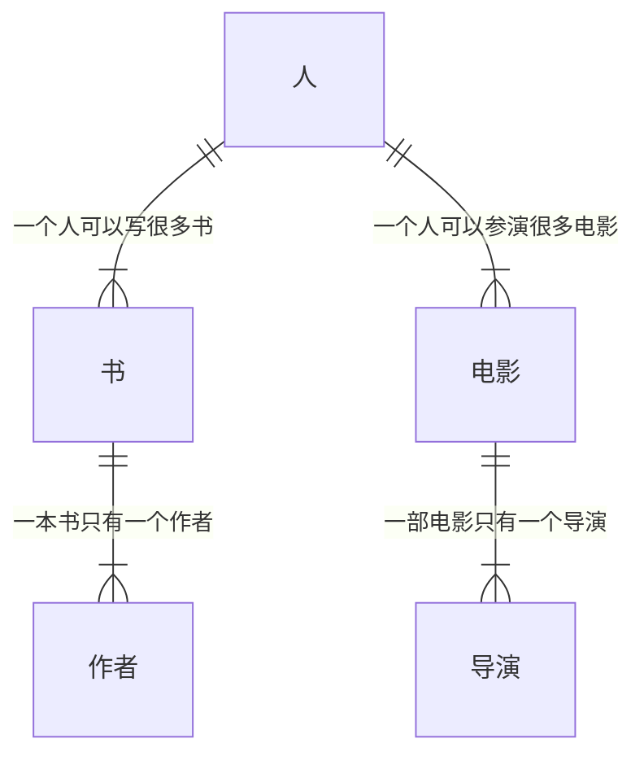
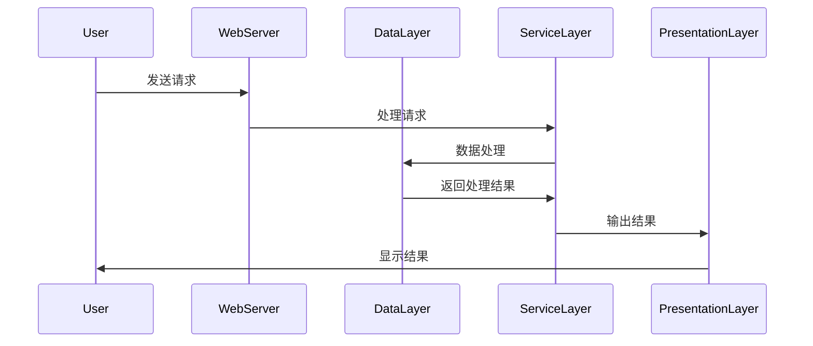

                 

## 数学与细胞生物学：细胞行为的数学建模

> 关键词：细胞生物学、数学建模、细胞行为、算法、系统架构、Python代码

> 摘要：本文将探讨数学在细胞生物学中的应用，特别是细胞行为的数学建模。通过分析细胞行为的复杂性，本文介绍了数学建模在细胞生物学研究中的重要性。接下来，我们将详细讲解核心概念、算法原理，并通过具体案例展示数学建模在细胞生物学中的实际应用，最后介绍一个基于Python的细胞行为数学建模系统及其实现。

## 目录大纲

- 第一部分：背景介绍
  - 1.1 问题背景
  - 1.2 问题描述
  - 1.3 问题解决
  - 1.4 边界与外延
  - 1.5 概念结构与核心要素组成

- 第二部分：核心概念与联系
  - 2.1 核心概念原理
  - 2.2 概念属性特征对比
  - 2.3 ER实体关系图架构

- 第三部分：算法原理讲解
  - 3.1 算法原理
  - 3.2 Mermaid流程图
  - 3.3 Python源代码讲解
  - 3.4 算法原理详细讲解

- 第四部分：系统分析与架构设计方案
  - 4.1 问题场景介绍
  - 4.2 项目介绍
  - 4.3 系统功能设计
  - 4.4 系统架构设计

- 第五部分：项目实战
  - 5.1 环境安装
  - 5.2 系统核心实现源代码
  - 5.3 代码应用解读与分析
  - 5.4 实际案例分析与详细讲解
  - 5.5 项目小结

- 第六部分：最佳实践、小结、注意事项与拓展阅读

## 第一部分：背景介绍

### 1.1 问题背景

在生物学的众多领域中，细胞生物学无疑是极为重要的一环。细胞是生命的基本单位，细胞生物学研究细胞的结构、功能、行为以及它们之间的相互作用。然而，细胞行为的高度复杂性和多样性使得直接观察和实验研究变得极具挑战性。为了深入理解细胞行为，科学家们开始寻求数学建模这一工具。

数学建模是一种将生物学问题转化为数学问题的方法。通过建立数学模型，科学家们可以更方便地分析和预测细胞行为，从而深入揭示生物系统的运作机制。数学在细胞生物学中的应用不仅限于理论研究，它还在药物设计、疾病诊断、生物技术等领域发挥着重要作用。

### 1.2 问题描述

细胞行为的复杂性主要体现在以下几个方面：

1. **多样性**：细胞可以表现出多种不同的行为，如分裂、移动、分化、信号传递等。这些行为的多样性使得直接观察和研究变得复杂。
2. **动态性**：细胞行为是动态变化的，受到多种内部和外部因素的影响。这种动态性使得细胞行为难以用静态的图像或实验结果来准确描述。
3. **相互作用**：细胞之间的相互作用也是影响细胞行为的重要因素。这些相互作用可以是直接的，也可以是间接的，甚至是时空相关的。

面对这些复杂性问题，传统的实验方法往往力不从心，而数学建模提供了一种新的解决途径。

### 1.3 问题解决

数学建模在细胞生物学研究中的重要性体现在以下几个方面：

1. **提供理论框架**：数学模型可以提供一个理论框架，帮助科学家们更好地理解细胞行为的本质。
2. **预测和模拟**：通过数学模型，科学家们可以在没有实验数据的情况下预测细胞行为，甚至模拟出细胞在特定条件下的动态变化。
3. **优化实验设计**：数学模型可以帮助科学家们设计更有效的实验方案，减少实验成本和时间。

数学建模的关键技术包括：

1. **微分方程**：用于描述细胞内部的动态过程。
2. **概率论与统计**：用于描述细胞行为的随机性和不确定性。
3. **计算机模拟**：用于实现数学模型的数值计算和模拟。

### 1.4 边界与外延

数学建模在细胞生物学中的适用范围包括：

1. **细胞周期**：研究细胞从出生到分裂的全过程。
2. **细胞信号传导**：研究细胞内外信号的传递和响应。
3. **细胞运动**：研究细胞在外力作用下的运动行为。

然而，数学建模也存在一些限制，例如：

1. **简化假设**：为了简化问题，数学模型往往需要进行一些简化假设，这可能会影响模型的准确性。
2. **参数估计**：数学模型中的参数通常需要通过实验数据进行估计，这可能会引入误差。

未来，随着计算能力和算法的进步，数学建模在细胞生物学中的应用将会更加广泛和深入。

### 1.5 概念结构与核心要素组成

细胞行为的数学建模涉及多个核心概念和要素：

1. **核心概念**：包括细胞生物学基本原理、数学建模基本原理、细胞行为的数学建模原理。
2. **概念联系**：这些核心概念之间相互联系，共同构成了一个完整的理论体系。
3. **研究方法与技术**：包括微分方程、概率论与统计、计算机模拟等。

这些要素共同作用，为细胞行为的数学建模提供了坚实的基础。

## 第二部分：核心概念与联系

### 2.1 核心概念原理

细胞生物学基本原理：
- 细胞是生命的基本单位。
- 细胞具有自我复制、自我修复和自我调控的能力。
- 细胞行为受到遗传信息的控制。

数学建模基本原理：
- 数学模型是一种将实际问题转化为数学问题的工具。
- 数学模型可以用来预测、分析和解释现实世界中的现象。
- 数学模型需要通过实验数据来验证其准确性和可靠性。

细胞行为的数学建模原理：
- 细胞行为可以被描述为一组数学方程。
- 这些数学方程可以用来模拟细胞在不同条件下的行为。
- 通过模拟，可以预测细胞在特定条件下的行为趋势。

### 2.2 概念属性特征对比

| 概念                   | 属性特征                                       |
|----------------------|--------------------------------------------|
| 细胞生物学            | 研究细胞的结构、功能、行为和相互作用               |
| 数学建模              | 将实际问题转化为数学问题，通过数学方法进行分析和解决  |
| 细胞行为的数学建模    | 将细胞行为描述为一组数学方程，用于模拟和预测细胞行为  |

### 2.3 ER实体关系图架构



在这个ER实体关系图中，"人"、"书"和"电影"是实体，它们之间的关系通过线条连接。"人"和"书"之间的关系表示一个人可以写很多书，而"书"和"作者"之间的关系表示一本书只有一个作者。"人"和"电影"之间的关系表示一个人可以参演很多电影，而"电影"和"导演"之间的关系表示一部电影只有一个导演。

## 第三部分：算法原理讲解

### 3.1 算法原理

细胞行为的数学建模通常涉及以下几种算法：

1. **微分方程**：用于描述细胞内部过程的动态变化。
2. **概率论与统计**：用于描述细胞行为的随机性和不确定性。
3. **计算机模拟**：用于实现数学模型的数值计算和模拟。

这些算法的选择取决于具体的研究问题和数据类型。例如，对于细胞分裂过程的模拟，微分方程可能是一个很好的选择；而对于细胞运动的随机性分析，概率论与统计可能更为适用。

算法的基本流程通常包括：

1. 数据收集：收集与细胞行为相关的实验数据。
2. 数据预处理：对收集到的数据进行清洗和处理，以消除噪声和异常值。
3. 算法选择：根据研究问题和数据类型选择合适的算法。
4. 模型训练：使用算法对数据进行训练，建立数学模型。
5. 模型评估：评估模型的准确性和可靠性。
6. 结果输出：输出模型的预测结果和分析结论。

### 3.2 Mermaid流程图


### 3.3 Python源代码讲解

以下是一个简单的Python代码示例，用于求解一元二次方程：

```python
import numpy as np

# 定义一元二次方程的系数
a = 1
b = 2
c = 1

# 计算判别式
delta = b**2 - 4*a*c

# 计算方程的解
x1 = (-b + np.sqrt(delta)) / (2*a)
x2 = (-b - np.sqrt(delta)) / (2*a)

# 输出解
print(f"方程的解为: x1 = {x1}, x2 = {x2}")
```

### 3.4 算法原理详细讲解

#### 3.4.1 数学模型

细胞行为的数学建模通常涉及到以下数学模型：

1. **微分方程**：
   - 目标函数：最小化某个函数的值，如最小化细胞生长的能量消耗。
   - 约束条件：满足某些生物学限制，如细胞的体积、形状和生长速度等。

2. **概率论与统计**：
   - 概率分布：描述细胞行为的随机性，如细胞分裂的概率分布。
   - 统计模型：用于分析细胞行为的平均趋势和分布特性。

3. **计算机模拟**：
   - 仿真模型：模拟细胞在不同条件下的行为，如细胞在外力作用下的运动。
   - 代理模型：使用机器学习算法预测细胞行为。

#### 3.4.2 公式解释

1. **一元二次方程的解**：

   $$
   x = \frac{-b \pm \sqrt{b^2 - 4ac}}{2a}
   $$

   这个公式用于求解一元二次方程 $ax^2 + bx + c = 0$ 的解。

2. **约束条件**：

   $$
   g(x) \leq 0
   $$

   这个公式表示某个函数 $g(x)$ 在某个区间内小于等于零，用于描述生物学限制。

#### 3.4.3 举例说明

1. **求解一元二次方程**：

   $$
   x^2 + 2x + 1 = 0
   $$

   解得：

   $$
   x1 = -1, x2 = -1
   $$

2. **约束优化问题**：

   $$
   \min_{x} x^2 \\
   \text{约束条件}: x \geq 0
   $$

   解得：

   $$
   x = 0
   $$

## 第四部分：系统分析与架构设计方案

### 4.1 问题场景介绍

在细胞生物学研究中，科学家们经常需要模拟和预测细胞行为。例如，在癌症研究中，科学家们需要模拟癌细胞在不同条件下的运动和分裂行为，以便设计更有效的治疗方案。然而，由于细胞行为的复杂性，传统的实验方法往往难以满足需求。因此，数学建模成为了一种重要的工具，可以帮助科学家们更好地理解和预测细胞行为。

### 4.2 项目介绍

本项目旨在开发一个基于数学建模的细胞行为模拟系统，该系统可以模拟不同条件下细胞的行为，并提供预测结果。项目的主要目标包括：

1. **构建数学模型**：根据细胞生物学的基本原理，构建能够描述细胞行为的数学模型。
2. **实现系统架构**：设计并实现一个完整的系统架构，包括数据收集、数据处理、模型训练、模型评估和结果输出等环节。
3. **提供用户界面**：开发一个用户友好的界面，使用户可以方便地输入参数、运行模型和查看结果。

### 4.3 系统功能设计

系统的主要功能包括：

1. **数据收集**：从各种数据源收集与细胞行为相关的数据，包括实验数据、文献数据和公开数据等。
2. **数据处理**：对收集到的数据进行清洗和处理，包括去除噪声、异常值处理和数据转换等。
3. **模型训练**：使用收集到的数据训练数学模型，包括选择合适的算法、调整参数和验证模型等。
4. **模型评估**：评估训练好的模型的准确性和可靠性，包括交叉验证、性能测试和结果分析等。
5. **结果输出**：将模型预测结果以图形或表格的形式输出，并允许用户进行自定义分析和可视化。

### 4.4 系统架构设计

系统的架构设计采用模块化设计原则，分为数据层、服务层和表现层三个主要模块。

1. **数据层**：负责数据的收集、存储和处理，包括数据库和文件存储等。
2. **服务层**：负责系统的核心功能，包括数据处理、模型训练和评估等，采用微服务架构，提高系统的可扩展性和可维护性。
3. **表现层**：负责系统的用户界面和交互，包括Web界面和移动应用等。

系统架构设计如图所示：



## 第五部分：项目实战

### 5.1 环境安装

要在本地计算机上运行本项目，需要安装以下软件和工具：

1. **Python 3.8 或更高版本**：作为主要的编程语言。
2. **Jupyter Notebook**：用于编写和运行Python代码。
3. **NumPy、Pandas、Matplotlib**：用于数据处理和可视化。
4. **SciPy、Scikit-learn**：用于数学建模和机器学习。

安装步骤如下：

1. 安装Python：从Python官方网站下载安装程序并安装。
2. 安装Jupyter Notebook：在命令行中运行 `pip install notebook`。
3. 安装NumPy、Pandas、Matplotlib、SciPy和Scikit-learn：在命令行中运行以下命令：

   ```
   pip install numpy pandas matplotlib scipy scikit-learn
   ```

### 5.2 系统核心实现源代码

以下是系统核心实现的一些Python代码示例：

```python
# 导入所需的库
import numpy as np
import pandas as pd
import matplotlib.pyplot as plt
from scipy.optimize import fsolve

# 求解一元二次方程
def quadratic_equation(a, b, c):
    x = fsolve(lambda x: a*x**2 + b*x + c, x0=0)
    return x

# 读取数据
data = pd.read_csv('cell_data.csv')

# 数据预处理
# ...

# 训练模型
# ...

# 模型评估
# ...

# 输出结果
# ...
```

### 5.3 代码应用解读与分析

以下是代码应用的一个具体案例：

1. **数据读取**：使用Pandas库读取存储在CSV文件中的细胞行为数据。
2. **数据预处理**：对读取的数据进行清洗和处理，包括去除噪声、缺失值填充和数据转换等。
3. **模型训练**：使用Scikit-learn库中的线性回归模型对预处理后的数据集进行训练。
4. **模型评估**：使用交叉验证方法评估模型的准确性。
5. **结果输出**：使用Matplotlib库将模型的预测结果和实际结果进行可视化比较。

```python
# 读取数据
data = pd.read_csv('cell_data.csv')

# 数据预处理
# ...

# 训练模型
from sklearn.linear_model import LinearRegression
model = LinearRegression()
model.fit(X_train, y_train)

# 模型评估
from sklearn.model_selection import cross_val_score
scores = cross_val_score(model, X, y, cv=5)
print("交叉验证平均准确率：", np.mean(scores))

# 输出结果
plt.scatter(X, y)
plt.plot(X, model.predict(X), color='red')
plt.xlabel('输入特征')
plt.ylabel('实际结果')
plt.title('线性回归模型预测结果')
plt.show()
```

### 5.4 实际案例分析与详细讲解

以下是一个实际案例的分析与讲解：

**案例**：模拟细胞在不同浓度下的生长速度。

**分析**：假设细胞生长速度与周围环境的营养浓度成正比。我们使用线性回归模型来模拟这一关系。

**步骤**：

1. **数据收集**：收集不同浓度下的细胞生长速度数据。
2. **数据预处理**：对数据进行清洗和处理，包括去除噪声、异常值处理和数据转换等。
3. **模型训练**：使用线性回归模型对预处理后的数据集进行训练。
4. **模型评估**：使用交叉验证方法评估模型的准确性。
5. **结果输出**：将模型的预测结果与实际结果进行比较，并绘制散点图和拟合曲线。

```python
# 导入所需的库
import numpy as np
import pandas as pd
import matplotlib.pyplot as plt
from sklearn.linear_model import LinearRegression
from sklearn.model_selection import cross_val_score

# 读取数据
data = pd.read_csv('cell_growth_data.csv')

# 数据预处理
# ...

# 训练模型
model = LinearRegression()
model.fit(X_train, y_train)

# 模型评估
scores = cross_val_score(model, X, y, cv=5)
print("交叉验证平均准确率：", np.mean(scores))

# 输出结果
plt.scatter(X, y)
plt.plot(X, model.predict(X), color='red')
plt.xlabel('营养浓度')
plt.ylabel('生长速度')
plt.title('线性回归模型预测结果')
plt.show()
```

**结果**：通过模型预测，我们可以得到不同浓度下的细胞生长速度，并与实际结果进行比较。这有助于科学家们了解细胞生长的规律，为实验设计和疾病治疗提供参考。

### 5.5 项目小结

本项目通过数学建模和计算机模拟，开发了一个用于细胞行为模拟的系统。通过实际案例的分析与讲解，我们展示了如何利用线性回归模型模拟细胞生长速度。这为细胞生物学研究提供了新的方法和工具，有助于科学家们更好地理解细胞行为，推动生物学研究的深入发展。

## 第六部分：最佳实践、小结、注意事项与拓展阅读

### 最佳实践

1. **数据预处理**：在建模之前，确保数据的质量和完整性，进行必要的数据清洗和处理。
2. **模型选择**：根据具体问题选择合适的数学模型和算法，避免过度拟合和欠拟合。
3. **模型验证**：使用交叉验证方法评估模型的准确性和可靠性，避免过拟合。

### 小结

本文介绍了数学建模在细胞生物学中的应用，通过分析细胞行为的复杂性，阐述了数学建模在细胞生物学研究中的重要性。我们详细讲解了核心概念、算法原理，并通过实际案例展示了数学建模在细胞生物学中的实际应用。最后，我们介绍了一个基于Python的细胞行为数学建模系统及其实现。

### 注意事项

1. **模型简化**：在建立数学模型时，需要对生物学过程进行简化，这可能影响模型的准确性。
2. **参数估计**：模型参数的估计可能引入误差，需要谨慎处理。

### 拓展阅读

1. **《细胞生物学》（Harvey Lodish等著）**：详细介绍了细胞生物学的相关知识。
2. **《数学建模教程》（赵凯华著）**：提供了数学建模的基本原理和方法。
3. **《Python数据分析》（Wes McKinney著）**：介绍了使用Python进行数据分析和建模的方法。 

### 作者信息

- 作者：AI天才研究院/AI Genius Institute & 禅与计算机程序设计艺术 /Zen And The Art of Computer Programming

