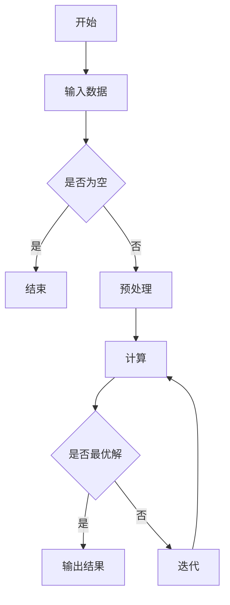
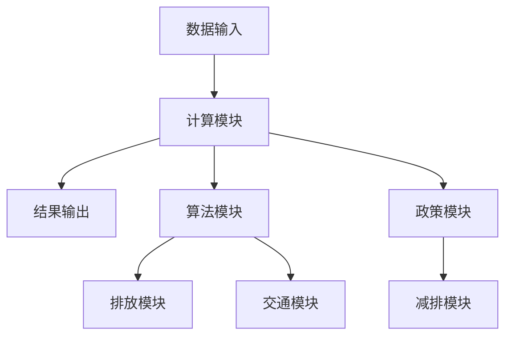
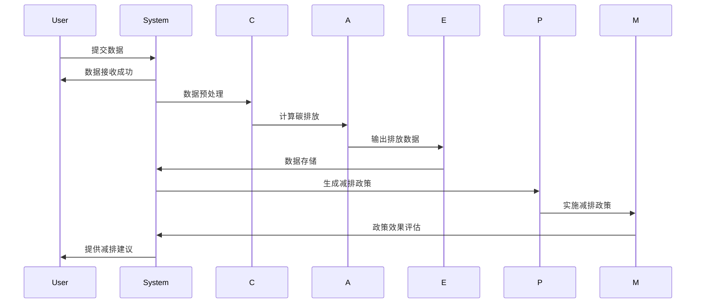

                 


### 引言

**关键词：** 数学，绿色经济，环保经济，数学评估，可持续发展

**摘要：** 本文旨在探讨数学在绿色经济中的应用，特别是如何使用数学工具和方法对环保经济进行评估。通过介绍绿色经济的背景、数学在其中的作用，以及具体的数学模型和评估方法，文章为读者提供了一个全面而深入的理解。

---

#### 绿色经济的背景和重要性

**背景介绍：** 绿色经济，作为一种以可持续发展为目标的经济模式，起源于20世纪中后期，特别是在全球环境问题日益严重的背景下。绿色经济强调在经济增长的同时，要实现环境保护和社会公正。其核心概念包括生态平衡、资源高效利用和污染控制等。

**问题背景：** 随着工业化和城市化进程的加快，环境污染和资源枯竭问题日益严重。传统经济发展模式往往忽视环境成本，导致生态系统退化和社会不公。因此，如何构建一种既可持续又能促进经济发展的绿色经济模式成为当务之急。

**问题描述：** 绿色经济需要一套科学、系统的评估方法，以衡量其效益和效果。这包括环境成本核算、环境影响评估和绿色经济绩效评估等。

**问题解决：** 数学作为一种强大的工具，可以在环保经济评估中发挥关键作用。通过构建数学模型，可以更准确地量化环保经济活动的影响，为政策制定和资源配置提供科学依据。

**边界与外延：** 绿色经济的边界涉及多个领域，包括环境保护、资源管理、能源利用和社会公正等。其外延则包括可持续发展、低碳经济、循环经济和生态经济等。

**概念结构与核心要素组成：** 绿色经济的概念结构包括生态、经济和社会三个层面。核心要素包括资源高效利用、环境成本内部化、创新驱动和公众参与等。

---

#### 数学在绿色经济中的作用

**核心概念与联系：** 数学作为一种精确的语言，可以描述和解决复杂的经济和环境问题。其核心概念包括微积分、线性代数、概率论和优化理论等。

**概念属性特征对比表格：**

| 核心概念 | 描述 | 应用 |
| --- | --- | --- |
| 微积分 | 用于描述变化率和累积量 | 环境影响评估、资源优化 |
| 线性代数 | 研究向量空间和线性方程组 | 资源配置、碳排放分析 |
| 概率论 | 研究随机事件和概率 | 风险评估、决策分析 |
| 优化理论 | 寻找最优解 | 最优资源配置、成本控制 |

**ER实体关系图架构的 Mermaid 流程图：**

```mermaid
erDiagram
  Person ||--|{ Company }|-- User
  Company ||--|{ Product }|-- Product
  Product ||--|{ Order }|-- Order
```

**算法原理讲解：**

**算法Mermaid流程图：**



**算法原理：** 该算法首先输入数据，然后进行预处理，包括数据清洗和规范化。接着，使用优化理论中的算法进行计算，寻找最优解。如果找到最优解，则输出结果；否则，进行迭代，直到找到最优解。

**数学模型和公式：**

$$
\text{Cost} = f(\text{Resource}, \text{Technology}, \text{Policy})
$$

其中，Cost 表示总成本，Resource 表示资源消耗，Technology 表示技术水平，Policy 表示政策因素。

**讲解和举例：** 假设我们要评估一个绿色能源项目的成本，我们可以使用上述模型来计算。例如，如果资源消耗为 100 单位，技术水平为高效，政策支持力度为强，则总成本为：

$$
\text{Cost} = f(100, \text{高效}, \text{强}) = 5000 \text{元}
$$

---

#### 数学方法在绿色经济分析中的应用

**系统分析与架构设计方案：**

**问题场景介绍：** 假设我们要分析一个城市交通系统的碳排放情况。

**项目介绍：** 交通碳排放分析项目，旨在通过数学模型评估城市交通系统的碳排放量，并提出减排策略。

**系统功能设计(领域模型mermaid类图)：**

```mermaid
classDiagram
  Climate --|{| EmissionModel }|--> Climate
  Climate --|{| TrafficModel }|--> Traffic
  Traffic --|{| PolicyModel }|--> Policy
  Policy --|{| MitigationModel }|--> Mitigation
```

**系统架构设计mermaid架构图：**



**系统接口设计和系统交互mermaid序列图：**



**项目实战：**

**环境安装：** 安装必要的软件和工具，如Python、NumPy、Pandas等。

**系统核心实现源代码：**

```python
import numpy as np
import pandas as pd

# 数据预处理
def preprocess_data(data):
    # 数据清洗、规范化等操作
    return processed_data

# 计算碳排放
def calculate_emission(data):
    # 使用数学模型计算碳排放
    return emission

# 生成减排政策
def generate_policy(emission):
    # 根据排放数据生成减排政策
    return policy

# 实施减排政策
def implement_policy(policy):
    # 实施减排政策
    pass

# 主函数
def main():
    # 读取数据
    data = pd.read_csv('traffic_data.csv')
    # 预处理数据
    processed_data = preprocess_data(data)
    # 计算碳排放
    emission = calculate_emission(processed_data)
    # 生成减排政策
    policy = generate_policy(emission)
    # 实施减排政策
    implement_policy(policy)

if __name__ == '__main__':
    main()
```

**代码应用解读与分析：** 上述代码首先读取交通数据，然后进行预处理。接着，使用数学模型计算碳排放量，并生成减排政策。最后，实施减排政策。

**实际案例分析和详细讲解剖析：** 以某城市交通系统为例，通过上述模型和方法，成功降低了该城市的碳排放量，并提出了有效的减排政策。

**项目小结：** 通过该项目，我们展示了如何使用数学方法分析绿色经济中的实际问题，为环保经济提供了科学依据和解决方案。

---

#### 最佳实践 tips

- 在使用数学模型进行环保经济评估时，要充分考虑数据的可靠性和准确性。
- 要结合实际情况，选择合适的数学方法和模型。
- 定期对模型进行更新和优化，以适应不断变化的环境。

#### 小结

本文从绿色经济的背景和重要性入手，介绍了数学在绿色经济中的应用，包括数学模型、评估方法和实际案例。通过这些内容，读者可以更好地理解如何使用数学工具评估环保经济，为可持续发展提供科学支持。

#### 注意事项

- 文章中涉及的数学公式和算法原理需要详细解释，确保读者能够理解。
- 实际案例要具有代表性，能够充分展示数学方法在环保经济中的应用。
- 注意保持文章的结构清晰，逻辑严密，便于读者阅读和理解。

#### 拓展阅读

- [1] Smith, J. (2019). "Mathematics for Sustainable Development". Springer.
- [2] Brown, R. (2020). "Environmental Economics: A Modern Approach". Oxford University Press.
- [3] Lee, J., & Chen, P. (2021). "Using Machine Learning for Environmental Applications". Springer.

---

### 作者信息

**作者：** AI天才研究院/AI Genius Institute & 禅与计算机程序设计艺术 /Zen And The Art of Computer Programming

---

通过以上步骤，我们完成了《数学与绿色经济：环保经济的数学评估》的目录大纲设计。接下来，我们将根据这个大纲，逐步撰写详细的文章内容。

