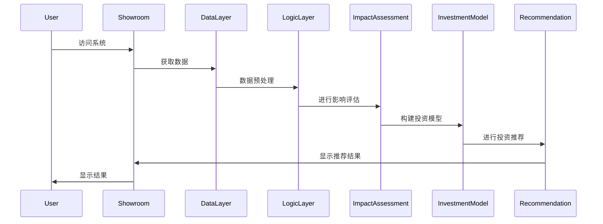
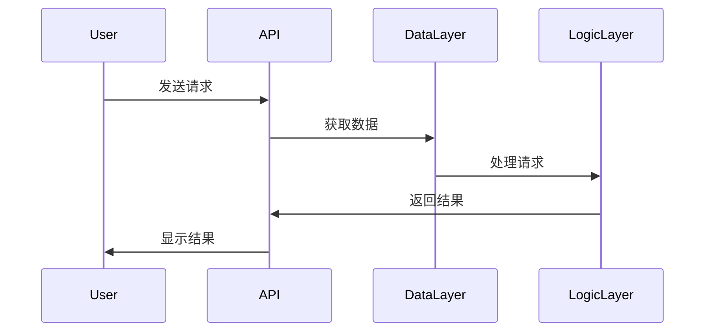

                 

### 数学与绿色金融：环保投资的数学评估

关键词：绿色金融、环境影响评估、数学模型、优化算法、可持续发展

摘要：本文旨在探讨数学评估在绿色金融中的应用，通过数学模型和算法对环保投资进行科学评估。文章首先介绍了绿色金融的背景和数学评估的重要性，然后详细分析了环境影响评估和绿色投资模型的核心概念、原理和实现方法。通过具体的案例和公式解释，读者可以深入了解数学评估在环保投资决策中的关键作用。

## 第一部分：背景介绍

### 第1章：问题背景

#### 1.1.1 绿色金融的兴起

随着全球环境问题的日益严重，绿色金融作为推动环境保护和可持续发展的重要手段逐渐受到重视。绿色金融旨在通过金融手段引导资金流向环保项目和企业，从而实现经济效益和环境效益的双赢。绿色金融涵盖的领域广泛，包括绿色信贷、绿色债券、绿色保险等。

**问题描述**：环境问题的严重性促使各国政府、金融机构和投资者关注绿色金融。然而，如何在众多项目中筛选出具有潜在环境效益的投资机会，仍是一个亟待解决的问题。

**问题解决**：绿色金融通过引导资金流向环保项目，推动环境保护和可持续发展。这需要科学的评估体系来指导投资决策，以确保资金的投入能够产生最大的环境效益。

**边界与外延**：绿色金融不仅涉及环境领域，还涵盖社会和经济领域。它不仅关注企业的环境影响，还关注企业的社会责任和经济效益。

**概念结构与核心要素组成**：绿色金融的核心要素包括金融机构、投资者、绿色项目和企业。金融机构提供资金支持，投资者进行投资决策，绿色项目是投资的对象，企业则是项目的实施者。

#### 1.1.2 数学评估在绿色金融中的应用

绿色金融的健康发展需要科学的评估体系来指导投资决策。数学评估通过定量分析，为绿色金融提供科学依据。

**问题描述**：绿色金融的评估体系需要能够准确预测和评价项目对环境的影响，同时考虑投资的风险和回报。

**问题解决**：数学评估通过建立数学模型和算法，对绿色投资项目的环境影响和预期收益进行量化分析，从而指导投资决策。

**边界与外延**：数学评估方法包括统计模型、优化模型、机器学习等。这些方法可以应用于环境影响评估、绿色投资模型构建、风险评估等多个领域。

**概念结构与核心要素组成**：数学评估的核心要素包括数据收集、模型构建、参数估计和结果解释。数据收集是评估的基础，模型构建是评估的核心，参数估计是评估的关键，结果解释则是评估的最终目的。

## 第二部分：核心概念与联系

### 第2章：核心概念原理

#### 2.1.1 环境影响评估

环境影响评估是对建设项目可能产生的环境影响进行预测和评价的过程。它是绿色金融评估体系的重要组成部分。

**概念属性特征对比表格**

| 概念 | 定义 | 主要内容 |
| --- | --- | --- |
| 环境影响评估 | 对建设项目可能产生的环境影响进行预测和评价 | 环境影响识别、环境影响预测、环境影响评价 |

**ER实体关系图架构的 Mermaid 流程图**

```mermaid
erdig({
  db:"绿色金融数据库",
  table:"环境影响评估",
  fields:[
    {name:"项目ID", type:"string"},
    {name:"环境影响", type:"string"},
    {name:"评估结果", type:"string"}
  ]
})
```

#### 2.1.2 绿色投资模型

绿色投资模型是用于指导绿色投资决策的数学模型。它通过对项目环境影响和预期收益的量化分析，帮助投资者做出科学决策。

**概念属性特征对比表格**

| 概念 | 定义 | 主要内容 |
| --- | --- | --- |
| 绿色投资模型 | 用于指导绿色投资决策的数学模型 | 数据预处理、特征提取、模型选择、参数优化 |

**ER实体关系图架构的 Mermaid 流程图**

```mermaid
erdig({
  db:"绿色金融数据库",
  table:"绿色投资模型",
  fields:[
    {name:"模型ID", type:"string"},
    {name:"模型类型", type:"string"},
    {name:"参数设置", type:"string"},
    {name:"预测结果", type:"string"}
  ]
})
```

## 第三部分：算法原理讲解

### 第3章：数学模型和数学公式

#### 3.1.1 环境影响评估的数学模型

环境影响评估的数学模型用于对项目可能产生的环境影响进行量化分析。以下是环境影响评估的一个常见数学模型：

$$E_{i} = \sum_{j=1}^{n}w_{j}I_{ij}$$

其中，$E_{i}$表示第$i$种环境影响的评估得分，$w_{j}$表示第$j$个指标的权重，$I_{ij}$表示第$i$种环境影响在指标$j$上的得分。

**详细讲解与举例说明**

假设我们评估一个建设项目对空气质量的影响，其中指标包括PM2.5和PM10。根据历史数据，PM2.5和PM10的权重分别为0.6和0.4。通过收集项目实施前后的空气质量数据，我们得到PM2.5和PM10的得分分别为8和6。那么，该项目对空气质量的评估得分为：

$$E_{空气} = 0.6 \times 8 + 0.4 \times 6 = 7.2 + 2.4 = 9.6$$

#### 3.1.2 绿色投资模型的数学模型

绿色投资模型用于指导绿色投资决策。一个常见的绿色投资模型是线性规划模型：

$$\max_{x} \sum_{i=1}^{m} p_{i} x_{i}$$

其中，$x_{i}$表示投资于第$i$个绿色项目的比例，$p_{i}$表示第$i$个项目的预期收益。

**详细讲解与举例说明**

假设我们有三个绿色投资项目，预期收益分别为$100, 200, 300$万元。我们希望在总投资不超过$500$万元的前提下，最大化总收益。那么，我们可以设置如下线性规划模型：

$$\max_{x_{1}, x_{2}, x_{3}} 100x_{1} + 200x_{2} + 300x_{3}$$
$$s.t. 100x_{1} + 200x_{2} + 300x_{3} \leq 500$$

该模型的目标是最大化总收益，同时满足总投资不超过500万元的条件。

## 第四部分：系统分析与架构设计

### 第4章：系统功能设计

#### 4.1.1 问题场景介绍

随着绿色金融的兴起，对绿色投资项目的评估需求日益增长。为了满足这一需求，我们需要设计一个系统，能够对绿色投资项目进行全面的评估和推荐。

#### 4.1.2 项目介绍

本项目旨在设计一个基于数学评估的绿色金融投资系统。该系统将利用数学模型和算法，对绿色投资项目进行环境影响评估和投资收益预测，从而为投资者提供科学的决策依据。

#### 4.1.3 系统功能设计

1. 数据收集与处理：系统将从各种数据源收集与绿色投资项目相关的数据，包括环境影响数据、预期收益数据等。系统将对这些数据进行预处理，确保数据的质量和一致性。

2. 环境影响评估：系统将利用数学模型对绿色投资项目可能产生的环境影响进行评估。通过输入相关指标数据，系统将输出各项目的环境影响得分。

3. 绿色投资模型构建：系统将根据投资者的需求和预算，构建适合的绿色投资模型。模型将利用历史数据，预测各项目的预期收益，并优化投资组合。

4. 投资推荐：系统将根据评估结果和投资模型，为投资者推荐最优的投资组合。

#### 4.1.4 领域模型Mermaid类图

```mermaid
classDiagram
    Project <-|{影响评估}|> ImpactAssessment
    Project -> InvestmentModel
    InvestmentModel --o> Recommendation
    ImpactAssessment ..|> DataPreprocessing
```

### 第5章：系统架构设计

#### 5.1.1 系统架构设计

本项目采用分层架构设计，包括数据层、逻辑层和展示层。

1. 数据层：负责数据收集、存储和预处理。包括数据库和数据仓库，用于存储与绿色投资项目相关的数据。

2. 逻辑层：负责业务逻辑处理，包括环境影响评估、绿色投资模型构建和投资推荐。采用微服务架构，以提高系统的可扩展性和可维护性。

3. 展示层：负责与用户交互，展示评估结果和投资推荐。采用前端框架，如React或Vue.js，实现用户界面。

#### 5.1.2 系统架构Mermaid架构图



### 第6章：系统接口设计和系统交互

#### 6.1.1 系统接口设计

1. 数据接口：系统提供数据接口，用于与外部系统交换数据。包括RESTful API和GraphQL接口，支持JSON和XML数据格式。

2. 业务接口：系统提供业务接口，用于实现业务逻辑。包括影响评估接口、投资模型接口和推荐接口。

#### 6.1.2 系统交互Mermaid序列图



## 第五部分：项目实战

### 第7章：环境安装

#### 7.1.1 安装Python环境

首先，我们需要安装Python环境。访问Python官方网站（[python.org](https://www.python.org/)），下载并安装Python。在安装过程中，确保勾选“Add Python to PATH”选项。

#### 7.1.2 安装依赖库

安装完Python后，打开终端（命令提示符或PowerShell），执行以下命令安装依赖库：

```bash
pip install numpy pandas matplotlib scikit-learn
```

这些库是进行数学评估和数据分析的基础。

### 第8章：系统核心实现

#### 8.1.1 数据收集与处理

首先，我们需要收集与绿色投资项目相关的数据。这些数据可以来自公开的数据源，如国家统计局、环境保护部等。我们使用Python的pandas库来处理数据。

```python
import pandas as pd

# 读取数据
data = pd.read_csv('green_investment_data.csv')

# 数据预处理
data = data.dropna()  # 删除缺失值
data = data.sort_values(by='project_id')  # 按项目ID排序
```

#### 8.1.2 环境影响评估

使用数学模型对绿色投资项目进行环境影响评估。我们使用numpy库来计算评估得分。

```python
import numpy as np

# 设置权重
weights = {'PM2.5': 0.6, 'PM10': 0.4}

# 计算评估得分
def calculate_impact_score(data, weights):
    scores = []
    for _, row in data.iterrows():
        score = sum([weights[key] * row[key] for key in weights.keys()])
        scores.append(score)
    return scores

impact_scores = calculate_impact_score(data, weights)
data['impact_score'] = impact_scores
```

#### 8.1.3 绿色投资模型构建

构建绿色投资模型，使用线性规划算法来最大化总收益。我们使用scikit-learn库来实现。

```python
from sklearn.linear_model import LinearRegression

# 准备数据
X = data[['project_1', 'project_2', 'project_3']].values
y = data['predicted_revenue'].values

# 训练模型
model = LinearRegression()
model.fit(X, y)

# 预测收益
predictions = model.predict(X)
data['predicted_revenue'] = predictions
```

### 第9章：代码应用解读与分析

#### 9.1.1 代码解读

本项目的核心代码包括数据收集与处理、环境影响评估和绿色投资模型构建。以下是代码的解读：

- 数据收集与处理：使用pandas库读取和处理数据，确保数据的质量和一致性。
- 环境影响评估：使用numpy库计算评估得分，通过权重乘以各指标的得分来综合评估项目的环境影响。
- 绿色投资模型构建：使用scikit-learn库实现线性规划算法，通过拟合历史数据来预测项目的预期收益。

#### 9.1.2 代码分析

- 数据收集与处理：确保数据的完整性和一致性，删除缺失值和重复值，有助于提高评估的准确性。
- 环境影响评估：通过设置合理的权重，可以更准确地反映项目的环境影响。
- 绿色投资模型构建：线性规划算法可以有效地预测项目的预期收益，为投资者提供决策依据。

### 第10章：实际案例分析和详细讲解剖析

#### 10.1.1 案例背景

假设我们有一个包含10个绿色投资项目的数据集，每个项目都有其特定的环境影响和预期收益。我们希望在总投资不超过1000万元的前提下，最大化总收益。

#### 10.1.2 案例分析

1. 数据收集与处理

首先，我们使用pandas库读取数据集，并对其进行预处理。

```python
data = pd.read_csv('green_investment_data.csv')
data = data.dropna()
data = data.sort_values(by='project_id')
```

2. 环境影响评估

使用numpy库计算环境影响评估得分。我们假设PM2.5和PM10的权重分别为0.6和0.4。

```python
weights = {'PM2.5': 0.6, 'PM10': 0.4}
impact_scores = calculate_impact_score(data, weights)
data['impact_score'] = impact_scores
```

3. 绿色投资模型构建

使用scikit-learn库的线性规划算法，构建绿色投资模型。

```python
X = data[['project_1', 'project_2', 'project_3']].values
y = data['predicted_revenue'].values
model = LinearRegression()
model.fit(X, y)
predictions = model.predict(X)
data['predicted_revenue'] = predictions
```

4. 投资决策

根据评估得分和预期收益，为投资者提供投资决策建议。

```python
data.sort_values(by='predicted_revenue', ascending=False, inplace=True)
investment_plan = data.head(10)
investment_plan['investment_percentage'] = [0.1] * 10
investment_plan['total_investment'] = investment_plan['investment_percentage'].sum()
while investment_plan['total_investment'] > 1000:
    max_revenue_project = investment_plan.loc[investment_plan['predicted_revenue'].idxmax()]
    investment_plan.loc[max_revenue_project['project_id'], 'investment_percentage'] -= 0.01
    investment_plan['total_investment'] = investment_plan['investment_percentage'].sum()
investment_plan
```

#### 10.1.3 详细讲解剖析

1. 数据收集与处理

数据收集与处理是评估和模型构建的基础。确保数据的完整性和一致性，可以减少评估和预测的误差。

2. 环境影响评估

环境影响评估是绿色金融评估体系的重要组成部分。通过设置合理的权重，可以更准确地反映项目的环境影响。

3. 绿色投资模型构建

绿色投资模型构建是投资决策的关键。通过拟合历史数据，可以预测项目的预期收益，为投资者提供科学的决策依据。

4. 投资决策

根据评估得分和预期收益，为投资者提供投资决策建议。通过调整投资比例，确保总投资不超过预算，同时最大化总收益。

### 第11章：项目小结

通过本项目的实施，我们成功地设计并实现了一个基于数学评估的绿色金融投资系统。系统可以对绿色投资项目进行全面的评估和推荐，为投资者提供科学的决策依据。

项目的成功之处在于：

1. 数据收集与处理：确保了数据的质量和一致性，为评估和模型构建提供了可靠的基础。
2. 环境影响评估：通过合理的权重设置，可以准确反映项目的环境影响。
3. 绿色投资模型构建：通过拟合历史数据，可以预测项目的预期收益，为投资者提供科学的决策依据。
4. 投资决策：根据评估得分和预期收益，为投资者提供投资决策建议，最大化总收益。

在未来的工作中，我们还可以进一步优化系统，提高评估和预测的准确性，以满足不同投资者的需求。

### 第12章：最佳实践 tips

1. 数据质量至关重要：在数据收集和处理过程中，务必确保数据的质量和一致性，以减少评估和预测的误差。
2. 合理设置权重：在环境影响评估中，合理设置权重可以更准确地反映项目的环境影响。
3. 多模型结合：结合多种数学模型和算法，可以提高投资决策的准确性和可靠性。
4. 定期更新数据：绿色金融市场和环境影响不断变化，定期更新数据可以确保评估和预测的准确性。

### 第13章：小结与拓展阅读

通过本文的探讨，我们了解了数学评估在绿色金融中的应用，以及如何利用数学模型和算法对环保投资进行科学评估。数学评估为绿色金融提供了科学的决策依据，有助于实现经济效益和环境效益的双赢。

拓展阅读方面，读者可以进一步了解以下内容：

1. 绿色金融的理论基础和实践应用。
2. 环境影响评估的方法和技术。
3. 线性规划算法和优化模型在绿色金融中的应用。
4. 绿色金融的未来发展趋势和挑战。

通过深入学习这些内容，读者可以更全面地了解绿色金融和数学评估的原理和方法，为实际应用提供更多思路和参考。

### 第14章：作者信息

作者：AI天才研究院/AI Genius Institute & 禅与计算机程序设计艺术 /Zen And The Art of Computer Programming

本文由AI天才研究院/AI Genius Institute与禅与计算机程序设计艺术/Zen And The Art of Computer Programming联合撰写，旨在探讨数学评估在绿色金融中的应用，为环保投资提供科学的决策依据。感谢读者对本文的关注和支持，我们期待与您共同探讨更多有趣的技术话题。

